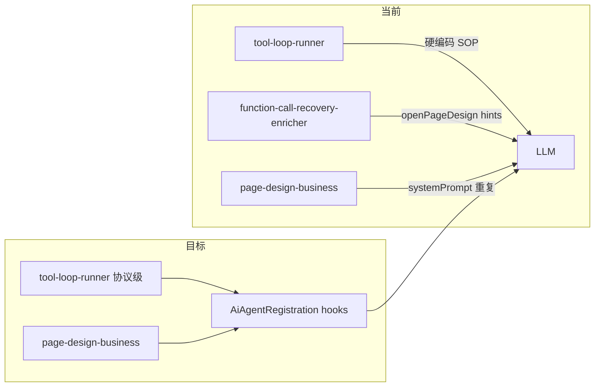

# 阶段 3：业务 Nudge 下沉（断手工 AiModule 收尾）

## 已完成基线（阶段 0–2，无需重复）

- [`vite.codex-dev.mjs`](vite.codex-dev.mjs)：`modules` 别名已删，已补 `vcm-native`
- [`tools/verify-ai-codegen-rules.mjs`](tools/verify-ai-codegen-rules.mjs)：`src/services` 禁止 `createAiAgentRegistration`
- [`tools/verify-architecture.mjs`](tools/verify-architecture.mjs)：`vite.codex-dev.mjs` 纳入 spark-ai alias 校验
- 生产注册路径：`VcmNativeAgentAdapter.createRegistration`（[`page-design-business.ts`](src/services/page-design-business.ts)、[`project-planning-business.ts`](src/services/project-planning-business.ts)）

## 问题（阶段 3 要解决的）

[`tool-loop-runner.ts`](packages/spark-ai/src/agent/tool-loop/tool-loop-runner.ts) 与 [`function-call-recovery-enricher.ts`](packages/spark-ai/src/agent/tool-loop/function-call-recovery-enricher.ts) 仍硬编码 pageDesign 语义（`openPageDesign`、`editDataSet`、`createTable` 等），违反 [`verify-architecture.mjs`](tools/verify-architecture.mjs) 对 spark-ai 内核「不含业务材料」的设计意图（当前仅拦 `pageDesign` 字面，未拦 `openPageDesign`）。



## 实施方案

### 1. 扩展注册契约（内核）

在 [`registration-types.ts`](packages/spark-ai/src/agent/business/registration-types.ts) 增加可选 hook（命名与现有 lifecycle 风格一致）：

```typescript
export type AiAgentToolLoopNudgeReason =
  | 'plan_without_tool'
  | 'execution_phase'
  | 'module_script_retry'

export type AiAgentToolLoopNudgeContext = Readonly<{
  reason: AiAgentToolLoopNudgeReason
  moduleInstanceId: string
  runtimeContext: AiAgentRuntimeContext
}>

// AiAgentRegistrationOptions 新增：
toolLoopNudge?: (context: AiAgentToolLoopNudgeContext) => string | undefined
executionToolNames?: ReadonlySet<string>  // 默认仅 vcm_script
planWithoutToolMarkers?: readonly string[]  // 扩展 mentionsPendingToolExecution
enrichRecoveryHints?: (command: EnrichFunctionCallFailureCommand) => readonly string[]
```

- [`business-task.ts`](packages/spark-ai/src/agent/business/business-task.ts) / [`createAiAgentRegistration`](packages/spark-ai/src/agent/business/business-task.ts)：透传新字段
- [`vcm-native-agent-adapter.ts`](packages/spark-ai/src/agent/business/vcm-native-agent-adapter.ts)：`VcmNativeAgentAdapterRegisterOptions` 增加同名可选字段并写入 `AiAgentRegistration`

### 2. 瘦身 tool-loop-runner（内核只留协议级）

文件：[`tool-loop-runner.ts`](packages/spark-ai/src/agent/tool-loop/tool-loop-runner.ts)

**保留（协议级，不删）：**
- `TOOL_PRODUCTION_LINE_PROMPT`
- `PSEUDO_TOOL_CALL_NUDGE`（含 `vcm_script` / `RECOVERY_HINT` 通用指引）
- `CATALOG_DISCOVERY_TOOL_NAMES`（4 个 `vcm_*_guide` + `vcm_query`）
- `shouldNudgeExecutionPhase` / `shouldNudgeModuleScriptRetry` 相位判断逻辑

**删除/替换（业务级）：**
- 删除 `EXECUTION_TOOL_NAMES` 中的 `'openPageDesign'`、`'readPlanningProjection'`；改为 `registration.executionToolNames ?? defaultSet(vcm_script)`
- `PLAN_WITHOUT_TOOL_NUDGE` 改为通用短句 + `registration.toolLoopNudge?.({ reason: 'plan_without_tool', ... })`
- `buildExecutionPhaseNudge` / `buildModuleScriptRetryNudge` / `buildModuleScriptShapeReminder` 删除；改调 `registration.toolLoopNudge?.({ reason: 'execution_phase' | 'module_script_retry', ... })`
- `mentionsPendingToolExecution`：通用 marker（`vcm_script`、`我将调用` 等）+ `registration.planWithoutToolMarkers`

若 hook 未提供且 reason 需要业务文案：**不 nudge**（fail-safe，避免非 pageDesign 业务收到错误 SOP）。

### 3. pageDesign 业务注入 SOP

文件：[`page-design-business.ts`](src/services/page-design-business.ts)

在 `VcmNativeAgentAdapter.createRegistration({ options: { ... } })` 中新增：

| Hook | 内容来源 |
|------|----------|
| `executionToolNames` | `Set(['vcm_script'])`（VCM-native 无 direct function tool） |
| `planWithoutToolMarkers` | `openpagedesign`、`editdataset`、`editnodetree` |
| `toolLoopNudge` | 将现有 `createPageDesignSystemPrompt` 中的 script 形状片段按 reason 拆分复用（避免与 systemPrompt 第三次重复——优先从同一 helper 函数生成） |
| `enrichRecoveryHints` | 承接 enricher 里所有 `openPageDesign` / `editDataSet` / `createTable` 分支 |

`createPageDesignSystemPrompt` 保留为首轮 systemPrompt；round nudge 与 recovery 从 **同一 `pageDesignScriptSop(pageId)` helper** 派生，减少漂移。

### 4. Recovery enricher 去业务化

文件：[`function-call-recovery-enricher.ts`](packages/spark-ai/src/agent/tool-loop/function-call-recovery-enricher.ts)

- `enrichFunctionCallResult(command, options?)` 增加可选 `businessHints` 参数；或在 executor 侧先调 `registration.enrichRecoveryHints` 再合并
- `GLOBAL_ERROR_RECOVERY.SCRIPT_EXECUTION_FAILED` 删除 `openPageDesign` 行；保留 VCM-native 通用句（`vcm_script` 参数名、`this` 绑定）
- `appendProtocolRecoveryHints` 中 `openPageDesign` 示例改为 `"<actionName>"` 占位
- [`tool-call-executor.ts`](packages/spark-ai/src/agent/tool-loop/tool-call-executor.ts) 调用 enrich 时传入 `registration.enrichRecoveryHints`

### 5. 测试与门禁

| 文件 | 动作 |
|------|------|
| 新建 `packages/spark-ai/src/tests/tool-loop-nudge-hooks.test.ts` | 用 mock `AiAgentRegistration` 验证：有 hook 时返回业务 nudge；无 hook 时不含 `openPageDesign` |
| [`function-call-recovery-enricher.test.ts`](packages/spark-ai/src/tests/function-call-recovery-enricher.test.ts) | 通用路径不再断言 `openPageDesign`；新增「传入 businessHints 才出现」用例 |
| [`verify-architecture.mjs`](tools/verify-architecture.mjs) | 扩展 `checkSparkAiBusinessMaterial`：禁止 spark-ai 生产代码出现 `openPageDesign`/`editDataSet`/`editNodeTree`（tests 除外） |

### 6. 验证命令（实现后必跑）

```bash
pnpm exec vitest run packages/spark-ai/src/tests/tool-loop-nudge-hooks.test.ts
pnpm exec vitest run packages/spark-ai/src/tests/function-call-recovery-enricher.test.ts
pnpm exec vitest run packages/spark-ai/src/tests/legacy-protocol-tool-names.test.ts
pnpm exec vitest run tests/page/verify-rules.test.ts
pnpm run verify:arch
pnpm --filter @spark-appworks/spark-ai run typecheck
```

不跑全量 `verify:rules`（仓库另有 ~120 条历史违规，与本次无关）。

## 风险与约束

- **不修改** [`native-script-sandbox.ts`](packages/spark-ai/src/agent/native-runtime/native-script-sandbox.ts) 错误映射（本轮范围外；其文案同样偏 pageDesign，可后续单独切片）
- **不碰** project-planning：无 pageDesign SOP，hook 留空即可
- **最小 diff**：不改 Java 后端、不改 VCM 生成器

## 完成定义

- spark-ai 内核 `tool-loop-runner` / `function-call-recovery-enricher` 无 `openPageDesign` 等业务方法名字面量
- pageDesign SOP 仅存在于 `src/services/page-design-business.ts`
- 新增测试 + `verify:arch` 通过
