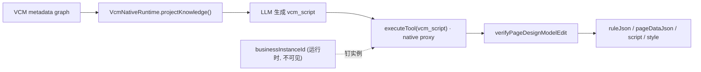
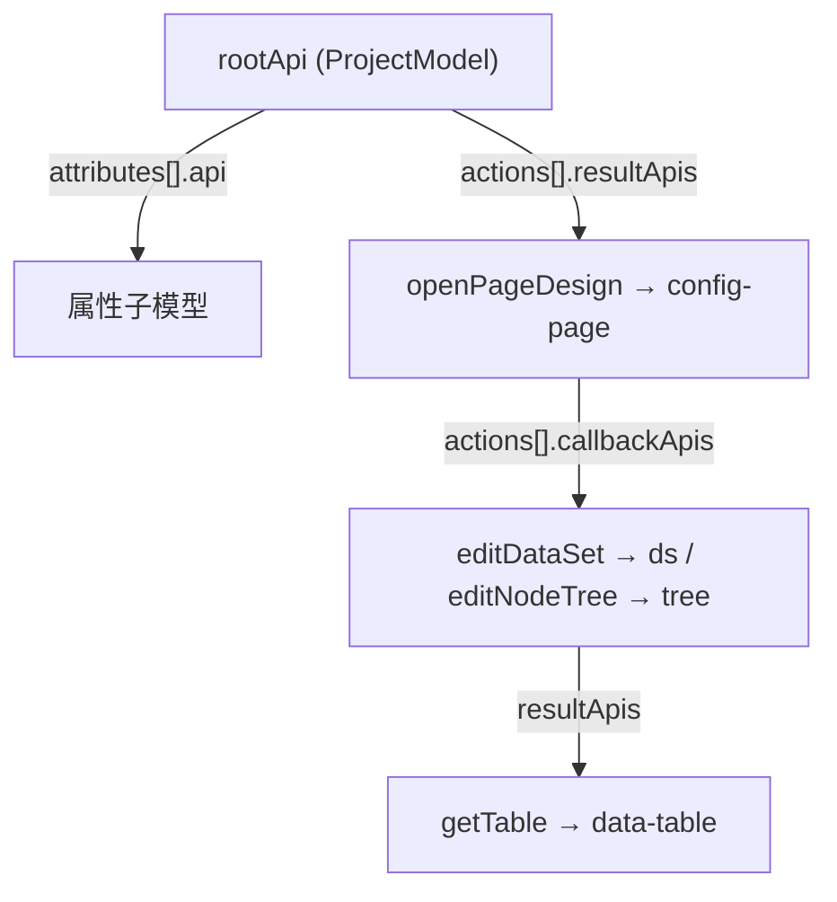
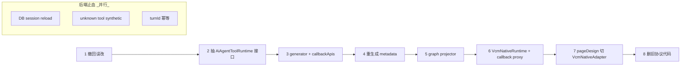

# SPARK AI 体系 · VCM Native Script 断代方案

> 仓库唯一方案文档：`.cursor/plans/全面解决方案.md`
> 状态：**方案阶段（planning-only），不写代码**；执行需用户明确授权「执行计划」。
> 来源：用户重写的「断代方案」+ 架构师核验与补强。
> 日期：2026-06-08（F10/F11 实跑构建 + git 历史核验补记）

---

## 0. 架构师结论（先读这段）

**采纳断代（clean-break）路线**，放弃我此前的「渐进降级 + compat flag」方案。理由：

- 断代彻底，**不背两套协议的债**；旧 `module_*` 调用直接判未知工具失败，由会话轴 C3 synthetic 结果兜底——这比维护 `SPARK_AI_COMPAT_PATH_TOOLS` 更干净。
- 已核验：**只有一条主线在运行时真正起作用**（`resolveInstance` 只读 `moduleInstanceId`，path 段从不参与解析），所以断代无功能损失。

**核验三项关键事实（决定方案可行性）**：

| # | 断言 | 代码证据 | 结论 |
|---|------|---------|------|
| F1 | `callbackApis` 是**新概念**，必须加 | `ai-api-object-metadata-schema.ts` 仅有 `attributes[].api` / `actions[].resultApis`，**无 callbackApis**；`native-script-context.ts` `callApiMethod` L467-469 把回调原样 `Reflect.apply`，`run(ds)` 的 `ds` 是**裸业务对象**（无 metadata/校验/知识） | 你补的 callbackApis 命中真实缺口，是本方案最关键的新增 |
| **F1+** | generator **把 callback 子模型错放进了 `resultApis`** | 真实签名 `config-page.ts` L231/L253：`editNodeTree(run: (tree)=>...)`/`editDataSet(run: (tool)=>...)` 均返回 `Promise<void>`；runtime 版（schemaVersion 2）`editNodeTree.paramsSchema.properties.run = true`（不透明），`resultApis = [{ resultPath: [], $ref: "node-tree" }]`（返回 void → 死元数据），`callbackApis` 计数 0 | callbackApis 不只是新增边，更是**修正语义错位**：把子模型从 resultApis 迁到 callbackApis，并让运行时校验回调参数 |
| F2 | `AiAgentToolRuntime` 三方法**已隐式存在** | `ai-module-runtime.ts` 已有 `getTools()`/`executeTool()`/`projectKnowledge()` | 抽成显式接口，Host/tool-loop/bridge **零改动**，新旧 runtime 都实现它 |
| F3 | pageDesign 已有目标 action | `config-page.ts` 已有 `editDataSet`/`editNodeTree`/`getFileText`；四文件当前靠 `page.getFileText(...)` ×4（`page-design-business.ts` L171） | `verifyPageDesignModelEdit` 为新增 root action，**收敛** 4 次 getFileText 为一次校验+返回 |
| **F4** | 三份生成物，runtime 版**已 `$ref` 去重** | `*.runtime.generated.json`（运行时真源，`.cursorignore`）= `schemaVersion: 2`，**7702 行**，`apiRegistry` + `$ref`（337 个，108 个 resultApis 已 `$ref`）；`*.api.generated.json` = 全内联 12 万行（中间产物）；`*.generated.json` = 366 行 VCM props 原始描述符 | schemaVersion 2→3：新增 `callbackApis` **必须复用 `$ref`/apiRegistry**（与 resultApis 同机制），否则 node-tree/dataset 子树被重复内联使 7702 行回膨胀 |
| **F5** | generator **早已读出回调首参类型**，只是字段名放错 | `module-metadata-generator.ts` L581-587：返回 void 时进入 `discoverMutatorCallbackResultApis`，`readCallbackFirstArgumentType`（L695-700）已用 TS checker 读出 `tree: SparkNodeTreeModel`/`ds: DataSetCrudTool`，emit 进 `resultApis` | callbackApis = **改输出字段名**（resultApis→callbackApis），类型分析硬骨头已完成；改动量远小于预期 |
| **F6** | 执行内核**已是 VCM-native**，旧包袱集中在 LLM 可见层 | `routeModuleScript` 无 path 分支 → `createProviderScriptContext` → 取唯一 root kind → `moduleKind.createScriptContext({segments:[], host})`，Target Flow 现在就走这条；`AiModuleAdapter` 用 `directCallable:false` 注册 VCM actions（不生成 direct function tool）；path 寻址只活在 `module_find/attr/call` + Navigator/AiModulePath | 断代应断"LLM 可见 path 协议层 + 工具命名"，**复用执行内核**，而非从零重写 runtime |
| **F7** | Host 层 `tool-loop-runner` 有**按工具名的相位门控**（不止文案） | L79-129 prompt 硬编码 `module_script`/`module_query`/`module_function_guide`；**L524-573 状态机按字面量 `module_function_guide`/`module_script` 判定"目录阶段完成/禁止重复查目录/强制执行"** | 「抽接口后 Host 零感知」**部分不成立**：接口干净，但 prompt + 门控按工具名耦合，重命名必须同步改门控，否则 agent 循环静默失效 |
| **F8** | recovery enricher 深绑 path 协议，但夹带**真价值脚本提示** | `function-call-recovery-enricher.ts`：`GLOBAL_ERROR_RECOVERY` 教 `module_find`/`module_call`/path 语法，`INVALID_PATH_*`/`ROOT_LIST_REQUIRES_FIND` 随 path 删除变死条目；但 L152-169 `SCRIPT_EXECUTION_FAILED` 提示（run 必须是函数、createTable 签名）协议无关、要留 | 删 path 恢复条目，**保留并改名**脚本类提示；`resolveFailedFunctionContext` 的 moduleCall/moduleFind 分支随删 |
| **F9** | knowledge projector 结构可复用，**输出文案全埋 `module_*`** | `ai-module-knowledge.ts`：`guideKind`(L152-163)、`guideFunction`、`guideHumanQuestion`(L425-430)、`buildPromptSnapshot`(L461)、`knowledge-support.FIXED_PROTOCOL_TOOL_ROUTING_LINES` 均硬编码工具名 | 「保留改造」成立但改造量大；应抽**单一工具名 SSOT**，projector/enricher/tool-loop/generator 全引用它 |
| **F10** | 知识面 ~22000 行，**prompt 装不下** → 否决 .d.ts 注入 | **实跑** `pnpm run generate:module-metadata`：`*.runtime.generated.json` = **7702 行**（schemaVersion 2，`apiRegistry`+$ref）；`SparkNode.props` 在 runtime 中**全部** `$ref` → `AnonSchema_d9833819eb9f` = `{ additionalProperties: true }`（0 个 r-table 字段）；**组件 props 真源** = `src/services/page-design/payload/component-catalog.json` = **14580 行 / 107 组件**（非 module metadata 内联） | 知识**必须 on-demand 查询**；`.d.ts` 全量注入不可行；API 面 7700 + props 面 14580 ≈ **22000 行**只能靠 lazy lookup（详见 §0.2） |
| **F11** | 组件 props 查询链路**今日误删，非从未存在** | git：`dbec13dbf` 删 `create-payload-catalog-module`/`component-catalog.json` 消费/`spark-component-module`；`d0fe24277` 删 `json-catalog-generator`/`extract-component-api-vcm` 等生成器；`0e4f71e46` 删 Java `ComponentMetadataService`。删前链路：`queryPayloads({ moduleKind:"node-tree", payloadRef:"spark.component" })` → `guidePayload({ key:"r-table" })` → node-tree `addNode` paramsSchema；`node-tree` 模块声明 `payloads:[{ payloadRef:"spark.component", requiredForFunctions:[addNode,setProps,...] }]` | 组件 catalog + payload 消费能力必须恢复；但旧 `queryPayloads`/`guidePayload` 工具名不恢复，查询能力并入 `vcm_query` / `vcm_action_guide` |

**架构师补强（在你方案基础上新增，详见 §5、§8）**：

1. **callback proxy 必须实现**：`callApiMethod` 要把 run 参数包成「callbackApi kind 的 metadata 代理」，否则 `ds`/`tree` 仍是裸对象，知识/校验仍缺。
2. **先建后删的严格顺序**：新工具层通过 `AiAgentToolRuntime` 契约接入并**全绿**后，才删旧协议代码（吸取上一轮「先删 find 触发 19 测试红」教训）。
3. **schemaVersion 升级**：加 `callbackApis` 需动 schema + generator + `resolve-api-object-metadata`（apiRegistry $ref 去重也要覆盖 callbackApis），建议 `schemaVersion: 3`。
4. **`verifyPageDesignModelEdit` 必须从内存编辑态取四文件**（非磁盘），且为只读校验+投影，保证幂等。

### 0.1 关键架构决策：断代断在「LLM 可见层」，复用执行内核（F5/F6）

> 深读源码后修正方案口径。「VcmNativeRuntime 从零重写」**不可取**——执行内核已是 VCM-native 且经测试。

`native-script-context.ts`（586 行 Promise/Proxy 链）、knowledge projector、registry 都已正确工作；Target Flow 今天就跑在 `routeModuleScript` 无 path 分支上。从零重写它们只会把已验证逻辑重新推导一遍，是纯回归风险、零收益。

**断代的真实边界 = 砍掉 LLM 可见的 path 协议层 + 重命名工具，保留执行内核。** 据此把组件分三类：

| 处置 | 组件 | 理由 |
|------|------|------|
| **复用（保留/微调）** | `AiModuleRegistry`、`AiModule`、`native-script-context`（+callback proxy）、knowledge projector（改输出文案/加 callbackApis + **payload lookup**，**不重写**）、`module-script-sandbox`、`AiModuleAdapter`→更名 `VcmNativeAdapter`（去 path 型 companion，**保留并改造** spark-component props catalog provider） | 已是 VCM-native，删了要重写 |
| **重写（小而新）** | tool 生成器（只发 7 个 `vcm_` 工具）、slim executeTool 路由（仅 vcm_query/guide×3/script/human/complete）、script helpers（只暴露只读 `vcm_*`，去 find/attr/call） | 现 `protocol-tool-router.ts` 763 行多为待删工具的 path 归一化，值得净身重写 |
| **横切改造（跨 ≥4 文件，F7/F9）** | 工具名 SSOT（`PROTOCOL_TOOL_NAMES`→`VCM_TOOL_NAMES`，值 `vcm_*`）；`tool-loop-runner` prompt + **相位门控**（L524-573 按工具名）；`recovery-enricher` 删 path 条目/留脚本提示（F8） | 工具名是横切关注点，必须单一源 + 同步门控，否则 agent 循环静默失效 |
| **删除** | `Navigator`、`AiModulePath`、`AttributeAccessor`、`FunctionInvoker`、旧 `ProtocolToolRouter`、`module_find/attr/call/memory`、direct function tools | path 寻址专属，断代后无消费者 |
| **恢复/并入 VCM 知识面** | `component-catalog.json` 生成器、props catalog provider、node-tree payload 绑定（F11/D9） | props 面 14580 行知识；与 path 协议无关，今日误删须恢复，但 LLM 工具面不恢复旧 `queryPayloads`/`guidePayload`，统一并入 `vcm_query` / `vcm_action_guide` |

> 注：用户原列「删除旧 knowledge projector」——更正为**保留并改造**（它是 `vcm_query`/`vcm_model_guide` 的知识源），只删其 `module_*` 命名与 path 教学。`VcmNativeRuntime` = 组合（复用内核 + 重写工具层），可作为 `AiModuleRuntime` 的瘦身重构或同名替换，对 Host 层经 `AiAgentToolRuntime` 接口零感知。

### 0.2 知识体系结论：7 工具闭集 + on-demand VCM 知识

> 本节收敛上一轮「极简 codegen」讨论：**LLM 直接生成代码是执行形态，不是知识体系替代品**。断代后仍必须给 LLM 足够知识，只是知识来源从旧 `module_* / path / 手写指南` 换成 VCM metadata graph + component props catalog。

**F10（决定性，推翻 .d.ts / prompt 全量注入）——知识面太大，prompt 装不下**（2026-06-08 实跑核验）：

| 知识面 | 体量 | 真源文件 | 生成命令 | 投递方式 |
|--------|------|---------|---------|----------|
| API 面（page/ds/tree 方法 + paramsSchema） | **7702 行** | `page-design-module-metadata.runtime.generated.json` | `pnpm run generate:module-metadata` | `vcm_query` / `vcm_*_guide` 按需查 |
| props 面（r-table 等每组件 props schema） | **14580 行** | `payload/component-catalog.json`（107 组件） | `tsx packages/vite-plugin-spark-catalog/src/cli.ts`（独立于 module-metadata CLI） | 并入 `vcm_query` / `vcm_action_guide` 按需查 |
| 中间诊断件（非运行时） | 120600 行 | `*.api.generated.json`（全内联） | 同上 | 不进入 prompt、不进 runtime |

- module metadata 中 `SparkNode.props` = **开放 record**（`additionalProperties: true`），**不含** r-table 等字段定义；组件 props 真源是 `component-catalog.json`。
- 合计 API+props ≈ **22000 行**，远超 context 预算；`.d.ts` 全量注入不可行。
- 因此新体系必须保留 on-demand 知识查询：**先查 VCM 知识，再生成 `vcm_script`**。

**F11（今日清理误删，必须恢复数据源，但不恢复旧工具面）——组件 props catalog 是硬依赖**：

```text
.props.ts (84 文件)
  → json-catalog-generator (vite-plugin-spark-catalog/cli.ts)
  → component-catalog.json (14580 行)
  → VCM 知识投影层
  → vcm_query / vcm_action_guide
  → node-tree.addNode / setProps 的组件 props schema
```

- 今日清理提交链：`11d437e0b`（最后完整版）→ `dbec13dbf`（删 payload 消费）→ `d0fe24277`（删 catalog 生成器）→ `0e4f71e46`（删 Java 侧）。
- 工作区现状：component catalog 相关资产已重新出现在工作区（部分为新增/待接线），包括生成器、产物、provider、payload 模块与测试；执行撤回/清理时必须显式排除这些资产。
- **裁定**：恢复 component catalog 生成与 provider 能力，但 LLM 工具闭集仍保持 7 个 `vcm_*` 工具；不恢复旧 `queryPayloads` / `guidePayload` 工具名。
- **不可再误删**：component catalog 是组件 props 知识真源，不是探索代码、不是垃圾文件。后续清理旧协议时，只能迁移它的消费入口，不能删除生成器、产物或 provider 能力。

**受保护资产清单（执行撤回/清理时必须保留）**：

```text
packages/vite-plugin-spark-catalog/src/json-catalog-generator.ts
packages/vite-plugin-spark-catalog/src/extract-component-api-vcm.ts
packages/vite-plugin-spark-catalog/src/component-catalog-schema.ts
packages/vite-plugin-spark-catalog/src/cli.ts
packages/spark-ai/src/modules/payloads/*
packages/spark-ai/src/tests/payload-catalog-module.test.ts
src/services/page-design/spark-component-catalog-provider.ts
src/services/page-design/spark-component-catalog-types.ts
src/services/page-design/payload/component-catalog.json
tests/spark-component-catalog-provider.test.ts
```

**最终工具面固定为 §2.4 的 7 个工具**：

| 工具 | 知识/执行职责 |
|------|--------------|
| `vcm_query` | 查模型、action、attribute、组件/payload 索引 |
| `vcm_model_guide` | 查模型的属性、action、子模型入口 |
| `vcm_attribute_guide` | 查属性 schema 与子模型能力 |
| `vcm_action_guide` | 查 action paramsSchema、resultApis、callbackApis；对 node-tree 这类 action 可携带 component props lookup 结果 |
| `vcm_script` | 唯一执行通道，执行 LLM 生成的 async JS body |
| `human_question` | 缺少业务事实时反问 |
| `agent_complete` | 工具生产线收尾 |

> 修正结论：真正要保留的是 **VCM 知识体系**，不是旧 payload 工具。`queryPayloads` / `guidePayload` 的数据价值并入 `vcm_query` / `vcm_action_guide`；执行仍由 `vcm_script` 完成。worker/Comlink 本轮不做，仅保留 executor 边界。

---

## 1. Summary（主线）

不沿用旧 `module_*` 体系，不做 path / 实例 Id 寻址兼容。新主线只有一条：

```text
VCM metadata → 模型 → 属性 || action → 子模型
  → LLM 生成代码 → runtime 执行代码 → verify 返回四文件
```

- LLM 不再学习 `/kind[id]`、`module_find`、`module_attr`、direct function，也不接触 `moduleInstanceId`。
- 后端不承载业务 AI 协议，只负责：LLM 通信、SSE、会话记录、查询、turn 幂等。
- 运行时内部仍可用 `businessInstanceId` 钉当前业务实例，但**不进入 LLM 可见层**。



---

## 2. Key Changes

### 2.1 统一 runtime 契约 `AiAgentToolRuntime`（F2：抽取已有接口）

```ts
interface AiAgentToolRuntime {
  getTools(): readonly ToolSpec[]
  executeTool(toolName: string, args: JsonValue, context: RuntimeContext): Promise<ToolResult>
  projectKnowledge(): KnowledgeSnapshot
}
```

- 现 `AiModuleRuntime` 已天然满足此形状 → 抽成接口后，Host 层（`tool-loop-runner`、`tool-call-executor`、`ai-turn-bridge`）只依赖接口，**不感知**底层是旧 module 还是新 VCM。
- 这是「先建后删」的支点：新旧实现可短期共存于接口之后，切换 = 改 registration 工厂一行。

### 2.2 `VcmNativeRuntime` = 复用内核 + 重写工具层（F6，非从零）

- 输入：generated VCM metadata。
- 输出：LLM 可见工具与指南（仅新工具集）。
- 执行：`vcm_script`（复用 `native-script-context` + callback proxy）。
- **复用**：`AiModuleRegistry` / knowledge projector / `native-script-context` / `module-script-sandbox`。
- **重写（小）**：tool 生成器（7 个 vcm_）+ slim 路由（仅 vcm_ 工具，无 path 归一化）。
- 实现形态：可以是 `AiModuleRuntime` 瘦身重构后改名，或新类同时实现 `AiAgentToolRuntime`；Host 层经接口零感知（见 §0.1）。

### 2.3 `VcmNativeAdapter`（由 `AiModuleAdapter` 更名瘦身）

- 业务 class + metadata + instance resolver → `AiAgentRegistration`。
- 去掉 `buildVcmGuideModules` 把嵌套 API 注册成「直调即失败的假 find 模块」那套——知识改由 projector 直接吃 metadata graph。
- 不再为 path 型 guide 做 `mergeCompanionChildDeclarations`；**保留并改造** spark-component props catalog provider（F11/D9），作为 VCM 知识投影的数据源。不再生成 direct function tools（现已 `directCallable:false`，断代后连开关都删）。

### 2.4 新 LLM 工具集（精确闭集）

```text
vcm_query            模型/动作目录发现
vcm_model_guide      单模型指南（attributes/actions/子模型入口）
vcm_attribute_guide  单属性 schema
vcm_action_guide     单 action paramsSchema + resultApis + callbackApis
vcm_script           唯一执行通道
human_question       反问
agent_complete       收尾
```

旧工具（`module_query/guide/attribute_guide/function_guide/find/attr/call/script/memory`、direct function、`module_handle_call`）**全部删除**。

### 2.5 VCM metadata graph = 唯一知识源（F1：补 callbackApis）

```text
rootApi               = 根模型
attributes[].api      = 属性子模型
actions[].resultApis  = action 返回值子模型
actions[].callbackApis = callback 参数子模型   ← 新增
                         例：editDataSet(run) 的 ds、editNodeTree(run) 的 tree
```

### 2.6 组件 props catalog（F11：硬依赖，与断代并行恢复）

与 VCM API metadata **双轨**，不可合并进 7702 行 runtime json：

| 产物 | 行数 | 角色 |
|------|------|------|
| `component-catalog.json` | 14580 | 107 个 SparkNode `type` 的 props/emits schema |
| props catalog provider | — | 向 VCM 知识投影提供组件索引与单组件 props schema |
| `node-tree.payloads` | — | 绑定 `payloadRef: spark.component`，`addNode`/`setProps` 等 action guide 消费 |

LLM 写 `r-table` 节点前的新标准路径：

```text
vcm_action_guide({ kind:"node-tree", actionName:"addNode", componentType:"r-table" })
  → paramsSchema.properties.props（additionalProperties:false，逐字段约束）
  → vcm_script 内 tree.addNode({ node: { type, props } })
```

生成：`tsx packages/vite-plugin-spark-catalog/src/cli.ts`（扫 84 个 `*.props.ts`）。
消费：VCM knowledge projector 读取 props catalog provider；`node-tree.addNode` / `setProps` 的 `vcm_action_guide` 按 `componentType` 补充组件 props schema。

> 断代删 path 协议时**不得**连带删 payload catalog；catalog 数据与 provider 逻辑必须保留，但 LLM 工具面仍只有 7 个 `vcm_*` 工具。

### 2.7 pageDesign 增加 root action

```text
verifyPageDesignModelEdit({ pageId })
  → 校验并返回 ruleJson、pageDataJson、script、style（四文件，取自内存编辑态）
```

---

## 3. Target Flow

```js
const page = await this.openPageDesign({ pageId })

await page.editDataSet(async (ds) => {
  const table = ds.getTable({ tableName: 'orders' }) ?? ds.createTable({
    tableName: 'orders',
    columns: []
  })
  void table
})

await page.editNodeTree(async (tree) => {
  tree.addNode({
    parentComponentId: null,
    node: {
      id: 'orders-table',
      type: 'r-table',
      props: { dataViewKey: 'orders@default', dataMember: 'rows' }
    }
  })
})

return await this.verifyPageDesignModelEdit({ pageId })
```

- `this` = scope 钉死的根实例（ProjectModel）。
- `page` 来自 `openPageDesign` 的 `resultApis`（kind=config-page）。
- `ds` / `tree` 来自 `editDataSet` / `editNodeTree` 的 **`callbackApis`**（kind=data-set-editor / node-tree）——这是 F1 的落点。

---

## 4. Metadata Graph 四类边



四类边的投影/执行支持现状：

| 边 | schema 字段 | native proxy 现状 | 本方案动作 |
|----|------------|------------------|-----------|
| 属性子模型 | `attributes[].api` | ✅ `resolvePropertyApi` 已支持 | 保留 |
| 返回值子模型 | `actions[].resultApis` | ✅ `wrapResultApis` 已支持 | 保留 |
| callback 子模型 | `actions[].callbackApis` | ❌ **不存在**；现被错挂在 `resultApis`（死元数据） | **新增 schema + proxy 注入；generator 从 resultApis 迁移过来** |

> 现状陷阱：`editNodeTree`/`editDataSet` 返回 `void`，但生成器把 `node-tree`/`dataset` 放在它们的 `resultApis` 里。运行时实际通过 run 回调首参交付真实对象，且**无校验**。callbackApis 同时修这两处。

---

## 5. 架构师补强细节

### 5.1 callback proxy（核心新增）

`native-script-context.ts` `callApiMethod` 当前：

```js
const mutatorRun = readMutatorRunArgument(action, args)
if (mutatorRun !== undefined) {
  return Reflect.apply(method, target, [mutatorRun])   // ds/tree 是裸业务对象
}
```

改造目标：业务方法实际把真实 `ds`/`tree` 传给 run；proxy 要在中间**包一层 callbackApi 的 metadata 代理**：

```js
// 伪代码
const callbackApi = action.callbackApis?.[0]?.api
if (mutatorRun !== undefined && callbackApi !== undefined) {
  const wrappedRun = (realSubModel) =>
    mutatorRun(createAiApiScriptContext(realSubModel, callbackApi, ctx, validateOptions))
  return Reflect.apply(method, target, [wrappedRun])
}
```

效果：`ds.getTable`/`createTable`、`tree.addNode` 全部走 VCM metadata 校验与知识投影，LLM 通过 `vcm_action_guide(editDataSet)` 即可发现 `ds` 的能力。

### 5.2 schemaVersion 升级（F1+ / F4 / F5）

- `AiApiActionMetadata` 增 `callbackApis?: readonly AiApiResultApiRef[]`（复用 `resultPath` + `api`/`$ref` 形状；`resultPath` 对 callback 语义为「回调第 N 参数路径」，本轮按 R1 约定固定 `['0']`）。
- **generator 改输出字段（F5，非新逻辑）**：`module-metadata-generator.ts` L584-587 已用 `discoverMutatorCallbackResultApis` + `readCallbackFirstArgumentType` 读出回调首参类型，当前 emit 进 `resultApis`；改为 emit 进新 `callbackApis`。这类 void 返回 action 的 `resultApis` 随之为空。类型分析无需新增。
- **$ref 去重（F4 关键）**：runtime 真源已是 `schemaVersion: 2` + `apiRegistry`/`$ref`（7702 行，resultApis 已全部 `$ref`）。schemaVersion 3 新增 callbackApis 必须**复用同一 `$ref`/apiRegistry 机制**，否则 node-tree/dataset 子树重复内联会让 7702 行回膨胀。（12 万行的 `.api.generated.json` 是中间产物，非运行时消费。）
- 影响面：`ai-api-object-metadata-schema.ts`、`resolve-api-object-metadata.ts`（$ref 去重覆盖 callbackApis）、`validate-api-object-metadata.ts`、VCM generator、`native-script-context.ts`（§5.1）。
- 建议 `schemaVersion: 3`，旧 metadata 走 fail-fast 提示重生成。

### 5.3 verifyPageDesignModelEdit 约束

- **收敛现有 4 次 `getFileText`**（F3）：现状 `return { ruleJson: page.getFileText("rule.json"), ... }` 四次手取；新 action 一次校验+返回四文件，减少 LLM 出错面。
- 从**内存编辑态**（openPageDesign 打开的会话内模型）序列化四文件，不读磁盘。
- 纯校验 + 投影，幂等；失败返回结构化 failureModes，供 LLM 自纠。
- 外层 `ProjectWorkspace` 仍负责最终落盘；本 action 只产出四文件供 verify 与返回。
- `getFileText`/`setFileText` 是否保留为 LLM 可见 action，列入 §8 待定（建议保留 set、读取走 verify）。

---

## 6. Implementation Steps（架构师重排，先建后删）

> 原则：**新链路全绿前不删旧协议代码**（吸取上一轮「先删 find → 19 测试红」教训）。

1. **撤回最近误改代码**：只撤回本轮误改文件，**不做全仓 `git clean`**，不误删文档/计划草稿，不误删 F11 受保护资产。
   - 禁止使用 `git checkout -- packages/spark-ai/**` 这类包级一刀切命令；`packages/spark-ai/src/modules/payloads/**` 是 component catalog 资产，必须保留。
   - 建议：逐文件撤回明确的误改文件；未跟踪的 `metadata-graph.ts`/`metadata-graph.test.ts` 按需保留或移入新链路。
1b. **恢复组件 props catalog 全链路（F11，与断代并行，不阻塞 step 2）**：
   - 生成器：`vite-plugin-spark-catalog` 的 `cli.ts` + `json-catalog-generator` + `extract-component-api-vcm`（`d0fe24277` 删前版本）。
   - 产物：`src/services/page-design/payload/component-catalog.json`（≈14580 行，107 组件）。
   - 消费：恢复 props catalog provider 与 node-tree payload 绑定；不恢复旧 LLM 工具名。
   - 知识投影：`vcm_query` 可查组件索引；`vcm_action_guide({ kind:"node-tree", actionName:"addNode", componentType })` 返回对应组件 props schema。
   - 验收：`tests/page/page-design-knowledge.test.ts` 中 VCM props guide 用例全绿；`vcm_action_guide(..., componentType:"r-table")` 返回非空 props schema。
2. **抽 `AiAgentToolRuntime` 接口 + 建工具名 SSOT**（F2/F9）：让 `AiModuleRuntime` 显式实现接口；**同时**把工具名收敛到单一常量源（重命名 `PROTOCOL_TOOL_NAMES` → `VCM_TOOL_NAMES`，值改 `vcm_*`），projector/enricher/tool-loop/generator 全改为引用该常量，消除内联字面量。接口层零行为变更，先合。
2b. **同步 Host 相位门控**（F7）：`tool-loop-runner` L524-573 的"目录阶段完成/禁止重复查目录"判定改 key off 新常量（`vcm_action_guide`/`vcm_script`）；prompt 文案改 `vcm_*`。否则 agent 循环静默失效。
3. **改 VCM generator**（F5 改字段名 + F1+ 语义 + F4 去重）：新增 `callbackApis` 字段；把 `discoverMutatorCallbackResultApis` 的产物从 `resultApis` 改 emit 到 `callbackApis`；callbackApis 走 `apiRegistry` + `$ref`；schema/validate/resolve 同步到 schemaVersion 3；去旧 `module_*`/path 文案。
4. **重新生成 pageDesign metadata**：不手改 generated JSON；回归 runtime 版体积（应保持 ≈7702 行量级，callbackApis 走 $ref，勿回膨胀）；断言 `editNodeTree.callbackApis[0].$ref="node-tree"` 且 `resultApis` 空。
5. **改造 knowledge projector（不重写）**（F9）：吃 callbackApis 边，输出引用工具名 SSOT 的 model/action/attribute/callback guide；删 path 教学（howToUse/nextSteps/resumeFlow/promptSnapshot 里的 path、`module_find` 行）。
5b. **改造 recovery enricher**（F8）：删 `GLOBAL_ERROR_RECOVERY` 的 path 条目（`INVALID_PATH_*`/`ROOT_LIST_REQUIRES_FIND`/`DIRECT_CHILD_LIST_NOT_SUPPORTED` 等）与 moduleCall/moduleFind 分支；**保留并改名** `SCRIPT_EXECUTION_FAILED` 脚本提示（run 必须是函数、createTable 签名、editDataSet/editNodeTree 用法）。
6. **落地工具层**：重写 tool 生成器（7 个 vcm_）+ slim executeTool 路由 + script helpers（只读 vcm_）；`native-script-context` 加 §5.1 callback proxy。复用内核不动。
7. **pageDesign 改用 `VcmNativeAdapter` 注册**（切换 = registration 工厂），跑通 e2e 后再继续。
8. **删除旧协议代码**：`AiModulePath`、`Navigator`、`AttributeAccessor`、`FunctionInvoker`、旧 `ProtocolToolRouter`、`module_find/attr/call/memory`、direct function tools。（projector 保留改造，不删；**保留并迁移** props catalog provider 到 VCM props 查询能力）
9. **后端会话/传输止血**（与 1–8 并行，独立 PR）：DB session reload、unknown tool synthetic result、turnId 幂等。



---

## 7. Test Plan

1. metadata graph 能投影 `openPageDesign`、`editDataSet`、`editNodeTree`、`getTable`/`createTable`、`addNode`（含 callbackApis 边）。
2. `getTools()` **精确等于**新 VCM 工具集合（闭集断言，多一个少一个都红）。
3. prompt / guide / recovery **不含** `module_find`、`module_attr`、`moduleInstanceId`、`/kind[id]`。
4. `vcm_script` 执行 §3 目标脚本后，`verifyPageDesignModelEdit` 返回四文件。
5. pageDesign e2e 跑通：`vcm_query → vcm_action_guide → vcm_script → agent_complete`。
6. **（补）callback proxy 断言**：`ds`/`tree` 上调用未声明方法 → schema/metadata 失败，而非裸对象静默执行。
7. **（补）未知工具**：旧 `module_find` 调用 → unknown tool + synthetic role:tool failure，会话链仍合法。
8. **（补 F1+）语义迁移断言**：`editNodeTree`/`editDataSet` 的 `resultApis` 为空，`callbackApis[0].api.kind` 分别为 `node-tree`/`dataset`。
9. **（补 F4）体积回归**：schemaVersion 3 的 runtime metadata 行数 ≈ 现 7702 行量级（仅小幅增加 callbackApis 的 $ref 边），设上限阈值断言防 callbackApis 未走 $ref 导致回膨胀。
10. **（补 F7/R5）相位门控行为**：读完 `vcm_action_guide` 后下一回合强制 `vcm_script`、禁止重复查目录；上次 `vcm_script` 失败按 RECOVERY_HINT 修正。重命名后门控不失效。
11. **（补 F8/R6）recovery 提示存活**：`SCRIPT_EXECUTION_FAILED`（run 非函数、createTable 签名、editDataSet/editNodeTree）提示仍产出且引用 `vcm_script`；path 类条目（`INVALID_PATH_*`/`ROOT_LIST_REQUIRES_FIND`）已移除。
12. **（补 F9/R7）工具名 SSOT**：全仓 grep `module_query|module_guide|module_attribute_guide|module_function_guide|module_find|module_attr|module_call|module_memory` 残留为 0（测试夹具/历史除外）。
13. **（补 F11）组件 catalog 恢复**：`component-catalog.json` 行数 ≈ 14580、`componentCount=107`；`vcm_query({ keyword:"table", includePayloads:true })` 命中 `r-table`；`vcm_action_guide({ kind:"node-tree", actionName:"addNode", componentType:"r-table" })` 返回 `props.additionalProperties:false` 且含 `dataViewKey`/`dataMember` 字段。

---

## 8. 决策（架构师已拍板）

| # | 项 | 决策 | 约束/落点 |
|---|----|------|----------|
| **R1** | callback proxy 签名约定 | **仅支持「单 run 回调、首参为子模型」**；其余 fail-fast | `callbackApis` schema 用数组预留多参，本轮只实现 `callbackApis[0]`（resultPath=`['0']`）；run 必须是 function，非函数 → `SCHEMA_VALIDATION_FAILED` |
| **R2** | 删旧协议时机 | 严格按 §6 顺序，step 7 全绿后才 step 8 | 新链路 e2e 绿 + 闭集断言绿，才允许删旧代码 |
| **R3** | schemaVersion 3 | 旧 metadata 不兼容直接 fail-fast | 报错要求重生成；**禁止静默回退** |
| **R4** | Host 层耦合 | 随 step 6/8 清 tool-loop/enricher 残留 `module_*` 文案 | 纳入 test 3 闭集断言 |
| **R5** | **相位门控按工具名（F7）** | `tool-loop-runner` L524-573 按字面量判定相位；重命名不同步 → agent 空转/不执行 | step 2b 改门控 key off SSOT 常量；加门控行为测试（读完 vcm_action_guide → 强制 vcm_script） |
| **R6** | **recovery 真价值提示误删（F8）** | 删 path 恢复条目时连带删掉 run/createTable 脚本提示 → 自纠能力退化 | 保留并改名 `SCRIPT_EXECUTION_FAILED` 脚本类提示，仅删 path/find/call 条目 |
| **R7** | **工具名 SSOT（F9）** | 工具名散布 ≥4 文件内联字面量，零散改易漏 | step 2 先建 `VCM_TOOL_NAMES` 单一源，全部引用；grep 残留 `module_` 断言为 0 |
| **D1** | 撤回粒度 | **仅撤回误改文件**，禁止全仓 `git clean` | `git checkout -- <误改文件>`；保留未跟踪的计划/文档/新链路草稿 |
| **D2** | Comlink | **本轮不接入**，仅预留 executor 边界 | `executeTool` 内部 executor 接口留扩展点，不实现跨 worker 传输 |
| **D3** | getFileText/setFileText 可见性 | **保留 `setFileText` 为 action；读取统一走 `verifyPageDesignModelEdit`** | 移除 LLM 用 `getFileText` ×4 的旧用法，四文件读取只有一个出口，减少出错面 |
| **D4** | VcmNativeRuntime 形态 | **`AiModuleRuntime` 瘦身重构 + 改名**，不从零新建（F6） | 复用 586 行已测 native proxy 内核，避免回归风险 |
| **D5** | knowledge projector | **保留并改造**，不删（F6） | 它是 `vcm_query`/`vcm_model_guide` 的知识源，仅去 module_*/path 文案 + 吃 callbackApis |
| **D9** | 组件 props catalog | **核心资产，必须恢复并保护**（F11），但并入 VCM 知识面 | 恢复 `component-catalog.json` 生成 + props catalog provider + node-tree payloads 绑定；旧 `queryPayloads`/`guidePayload` 工具名不恢复，统一由 `vcm_query` / `vcm_action_guide` 暴露；禁止把 catalog 作为废弃探索代码清理 |

> 决策已全部拍定（R1–R7 + D1–D5 + D9），无遗留阻塞项。可直接进入执行。

---

## 9. Assumptions

- 不保留 `SPARK_AI_COMPAT_PATH_TOOLS`。
- 旧 `module_*` 调用直接未知工具失败。
- 运行时内部可用 `businessInstanceId` 钉当前业务实例，但不进入 LLM 可见层。
- Comlink 本轮不接入，只预留 executor 边界。
- 产品约束「一会话一实例」成立 → 废除 path 多实例导航无损。

---

## 10. 验收标准

- §7 测试全过；`pnpm run typecheck` + `pnpm run lint` + `pnpm run test` 通过；触界时 `pnpm run verify:rules` 通过。
- LLM 任意可见出口（prompt/guide/recovery/getTools）只出现新 VCM 工具集，无 `module_find`/`module_attr`/`moduleInstanceId`/`/kind[id]`（禁令句除外）。
- pageDesign e2e：`vcm_query → vcm_action_guide → vcm_script → verifyPageDesignModelEdit → agent_complete` 跑通，返回四文件。

---

## 11. 不在本次范围

- 不改 LLM 模型 / prompt 调优本身。
- 不重写 Java 后端 LLM 调用层（仅 session reload / unknown-tool synthetic / turnId 幂等三处止血）。
- Comlink 不接入。
- 最小侵入，不引入新框架或全局状态。

---

## 12. 下一步

本文件为**断代方案（planning-only）**，§8 决策已全部拍板（含 D9 组件 catalog 恢复）。

- 当前仍处方案阶段，**不写代码**（本轮仅落盘方案补记 F10/F11）。
- 你明确说 **「执行计划」** 后，建议顺序：
  1. step 1 撤回误改
  2. **step 1b 恢复组件 props catalog 全链路**（F11/D9，可与 step 2 并行）
  3. step 2 抽 `AiAgentToolRuntime` + 工具名 SSOT
  4. step 3–8 断代主线（generator callbackApis → 删 path 协议）
  5. 后端止血独立 PR
- 每个 step 完成即跑对应 §7 测试（含 §7.13 catalog 恢复断言），全绿才进下一 step。

### 12.1 本轮讨论已闭合的问题

| 问题 | 结论 |
|------|------|
| 「Vue 组件 14000+ 行」在哪？ | `component-catalog.json` **14580 行**（独立产物，非 module metadata） |
| LLM 怎么查 r-table props？ | 新体系：`vcm_query` 查组件索引，`vcm_action_guide({ kind:"node-tree", actionName:"addNode", componentType:"r-table" })` 查 props schema；删前的 `queryPayloads` → `guidePayload` 只作为历史证据 |
| 是不是从未接入？ | **否**。`11d437e0b` 完整可用；`dbec13dbf`/`d0fe24277` 今日删除 |
| 断代后还要吗？ | **要**。D9：catalog 生成 + props 查询是硬依赖，但暴露在 VCM 7 工具闭集内 |
