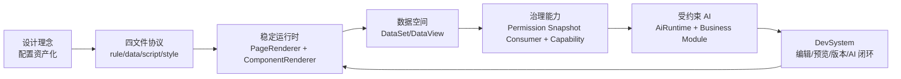

# SPARK_VIEW 16 篇技术博客系列策划

> 系列主线：配置不是代码的替代品，而是可治理、可审计、可预览、可由 AI 安全修改的软件资产。

本策划基于对 SPARK_VIEW 源码主链路的阅读，面向中高级前端工程师、低代码平台架构师、企业后台平台开发者。系列目标不是宣传“配置驱动”，而是逐层拆解 SPARK_VIEW 如何把页面、数据、权限、AI 与设计时工具组织成一套可落地的生产系统。

## 1. 系列叙事结构

### 四阶段主线

| 阶段 | 篇章 | 主题 | 读者获得 |
| --- | --- | --- | --- |
| 第一阶段 | 1-4 | 理念与工程分层 | 理解 SPARK_VIEW 为什么存在、解决什么问题、源码如何分包 |
| 第二阶段 | 5-9 | 运行时解释链路 | 看清页面从导航、配置加载、编译到组件渲染的完整路径 |
| 第三阶段 | 10-13 | 数据与权限内核 | 理解复杂后台页面为什么需要 DataSet/DataView 与权限快照 |
| 第四阶段 | 14-16 | AI、DevSystem 与生产化闭环 | 理解通用受约束 AI、业务知识库、设计时工具如何复用运行时 |

### 统一术语

- **四文件协议**：`rule.json`、`pagedata.json`、`script.js`、`style.css` 共同构成一个页面资产。
- **SparkNode**：运行时组件节点模型，是 `rule.json` 被解释后的核心结构。
- **DataSet/DataTable/DataView**：数据空间、表元数据、交互视图三层模型。
- **DataKey**：配置绑定数据的表达式，例如 `Users@rows`、`Orders@detail@currentRow.total`。
- **Capability**：组件、页面、数据、行上下文之间的能力传递机制。
- **Permission Snapshot**：后端鉴权后下发的模型级 `_modelPerm` 与行级 `_perm` 快照；前端只消费快照做 UI 显隐、禁用、脱敏等装饰性渲染。
- **AI Runtime**：AI 会话、函数暴露、函数调用翻译与记录的通用核心运行时。
- **Business AI Module**：接入 AI Runtime 的业务模块，负责自己的状态、函数目录、知识 payload 和执行器。
- **EditToolHost**：PageDesign 样例中，DevSystem 暴露给 AI 的编辑工具宿主。

### 系列核心图

建议在第 1 篇绘制并在后续文章反复复用一个总览图：

## 2. 16 篇文章策划

### 第 1 篇：SPARK_VIEW 不是 JSON 表单生成器

**一句话核心论点**：SPARK_VIEW 的目标不是把表单写成 JSON，而是把企业后台页面变成可治理的软件资产。

**目标读者与收益**

- 适合首次接触项目的技术负责人、平台工程师、前端架构师。
- 读完能区分 SPARK_VIEW 与普通低代码、表单生成器、代码生成器的差异。

**正文大纲**

1. 从企业后台的真实复杂度开始：数据联动、权限、可审计变更、长期维护。
2. 为什么“生成代码”不是唯一答案：代码灵活，但难审计、难回滚、难让 AI 安全修改。
3. SPARK_VIEW 的基本答案：配置资产 + 稳定运行时 + 设计时工具。
4. 四文件协议预告：页面结构、数据模型、行为脚本、样式资产各司其职。
5. 系列路线图：后续文章如何从理念走到源码。

**源码锚点**

- `README.md`
- `package.json`
- `docs/SPARK_VIEW_PROJECT_DEEP_DIVE_ZH.md`
- `packages/README.md`

**配图方案**

- 架构图：SPARK_VIEW 总览图，展示配置资产、运行时、数据、权限、AI、DevSystem。
- 对比图：表单生成器、代码生成器、SPARK_VIEW 三种路线的差异表。
- 截图：选择典型 demo 页面或 DevSystem 首页作为第一视觉。

**开篇角度**

> 如果一个后台页面只有字段和按钮，JSON 表单足够；但当它开始有主从表、树、权限、聚合、AI 修改和版本回滚时，问题就不再是“怎么少写 Vue 代码”，而是“怎么管理页面这个长期资产”。

**结尾落点**

引出第 2 篇：SPARK_VIEW 把页面资产收敛为四个文件，先从这个协议看整个系统的边界。

---

### 第 2 篇：四文件协议的诞生

**一句话核心论点**：`rule.json`、`pagedata.json`、`script.js`、`style.css` 是 SPARK_VIEW 页面可治理的最小资产单元。

**目标读者与收益**

- 适合要上手写页面配置、设计页面存储协议的人。
- 读完能解释每个文件负责什么、不负责什么，以及运行时如何加载它们。

**正文大纲**

1. 页面为什么不能只有一个大 JSON：结构、数据、行为、样式变化频率不同。
2. `rule.json`：描述组件树与 SparkNode，而不是 Vue 模板。
3. `pagedata.json`：描述 DataSet 元数据，而不是后端数据库。
4. `script.js` 与 `style.css`：保留必要扩展，但被运行时边界约束。
5. Loader 与 Compiler 的职责分离：来源、缓存、解析、规范化。

**源码锚点**

- `packages/spark-page-config/src/loader/index.ts`
- `packages/spark-page-config/src/compiler/index.ts`
- `spark-ai-server/src/main/java/com/spark/ai/controller/PageConfigController.java`
- `src/views/app/dev-system/page-file-documents.ts`

**配图方案**

- 架构图：四文件到 `PageConfig` 的转换管线。
- 状态图：必选文件和可选文件的加载成功、缺失、失败处理。
- 配置样例：一个最小 `rule.json` 与 `pagedata.json` 片段。

**开篇角度**

> 一个页面如果要被运行时解释、被 AI 修改、被版本系统回滚，它首先要有清晰的资产边界。

**结尾落点**

引出第 3 篇：四文件只是资产边界，真正支撑它的是 monorepo 中多个包的分工。

---

### 第 3 篇：Monorepo 分层设计

**一句话核心论点**：SPARK_VIEW 的 monorepo 不是目录拆分，而是把应用启动、组件解释、数据内核、AI 能力和构建知识库拆成可独立演进的层。

**目标读者与收益**

- 适合平台架构师和准备参与维护的工程师。
- 读完能知道新增能力应该放在哪一层，避免把所有逻辑塞进根应用。

**正文大纲**

1. 根应用与 packages 的边界：根应用负责集成，不负责沉淀通用内核。
2. Runtime 包：`spark-app`、`spark-component`、`spark-data`、`spark-page-config`。
3. AI 与构建包：`spark-ai`、`vite-plugin-spark-catalog`。
4. 插件与集成包：`vxe-table` 等适配层如何避免污染核心。
5. 架构守护：为什么需要 `verify:arch`、`build:packages` 一类脚本。

**源码锚点**

- `packages/README.md`
- `package.json`
- `packages/spark-app/src/start.ts`
- `packages/spark-component/src/system/spark.ts`
- `packages/vite-plugin-spark-catalog/src/plugin.ts`

**配图方案**

- 架构图：packages 依赖层级图。
- 边界图：根应用、运行时包、AI 包、后端服务的职责划分。
- 表格：每个 package 的输入、输出、禁止承担的职责。

**开篇角度**

> 低代码平台最容易失败的方式，是所有能力最终都长在一个巨大的应用目录里。

**结尾落点**

引出第 4 篇：看分层最好的方式，是跟随应用启动链路走一遍。

---

### 第 4 篇：应用启动链路：从 `src/main.ts` 到 `SparkApp.start`

**一句话核心论点**：SPARK_VIEW 的启动过程是在装配一个“可解释页面”的运行环境，而不只是挂载 Vue 应用。

**目标读者与收益**

- 适合想理解前端应用如何接入 SPARK_VIEW 运行时的人。
- 读完能画出启动时插件、路由、主题、组件注册、页面配置加载器的装配顺序。

**正文大纲**

1. `src/main.ts` 做了什么：加载配置、清理缓存、注册插件、准备导航树。
2. `SparkApp.start` 的职责：创建 app、router、UI 插件、Spark 插件。
3. 占位路由与动态路由：为什么启动时先有 placeholder，再注册真实路由。
4. 组件注册与 `virtual:spark-components`：运行时如何知道有哪些组件可用。
5. 启动钩子与业务集成：auth、tenant、logger、page cache。

**源码锚点**

- `src/main.ts`
- `packages/spark-app/src/start.ts`
- `packages/spark-app/src/router/dynamic.ts`
- `packages/spark-component/src/components/register-renderers.ts`

**配图方案**

- 时序图：`main.ts` -> `SparkApp.start` -> router/plugin/configLoader。
- 架构图：启动后运行时容器内有哪些服务。
- 源码截图：`SparkApp.start` 的核心配置对象。

**开篇角度**

> 一个普通 Vue 应用启动后得到的是组件树；SPARK_VIEW 启动后得到的是一个可以加载、解释、渲染配置页面的运行环境。

**结尾落点**

引出第 5 篇：运行环境准备好以后，页面入口来自导航树和动态路由。

---

### 第 5 篇：导航树即路由源

**一句话核心论点**：SPARK_VIEW 把页面入口统一收敛到导航树，让配置页、系统页、外链和跨项目引用共享同一套路由语义。

**目标读者与收益**

- 适合做企业后台、多租户 SaaS、菜单权限系统的工程师。
- 读完能理解 `config-page`、`system-page`、`link`、`ref` 等节点如何转成路由。

**正文大纲**

1. 为什么导航不是 UI 小组件，而是平台级路由源。
2. 动态路由注册：从 nav tree 到 Vue Router route。
3. 多租户路径：`tenantPathPrefix` 与 URL 中 tenant/project 的同步。
4. 特殊节点：系统页、系统动作、iframe/new tab/self link、跨项目 ref。
5. 后端导航 API 如何支持树编辑、移动、搜索与 link probe。

**源码锚点**

- `packages/spark-app/src/router/dynamic.ts`
- `src/main.ts`
- `spark-ai-server/src/main/java/com/spark/ai/controller/NavigationController.java`
- `src/views/app/dev-system/useDevState.ts`

**配图方案**

- 决策图：NavNode kind 到 route 行为的映射。
- 时序图：DevSystem 保存导航 -> 后端导航 API -> 前端刷新动态路由。
- 截图：DevSystem 左侧站点树。

**开篇角度**

> 对后台平台来说，导航不是“菜单数据”，而是页面资产、权限、租户上下文进入运行时的第一个入口。

**结尾落点**

引出第 6 篇：路由命中页面以后，运行时开始加载四文件配置。

---

### 第 6 篇：配置加载与编译边界

**一句话核心论点**：SPARK_VIEW 把“文件从哪里来”和“文件如何变成运行时模型”拆开，降低了缓存、后端、预览、AI 编辑之间的耦合。

**目标读者与收益**

- 适合关注配置平台稳定性、缓存、预览和后端协议的人。
- 读完能说明为什么 Loader 和 Compiler 要分离。

**正文大纲**

1. Loader 的职责：本地/远程文件加载、请求头、缓存、缺失文件策略。
2. Compiler 的职责：解析 `rule`、`pagedata`、`script`、`css` 并规范化。
3. 必选与可选：`rule.json`、`pagedata.json` 必须存在，脚本和样式可以为空。
4. `pagedata.json` 的兼容与规范化：从普通对象到 canonical metadata。
5. DevSystem 预览为什么可以绕过 Loader 但仍复用 Compiler。

**源码锚点**

- `packages/spark-page-config/src/loader/index.ts`
- `packages/spark-page-config/src/compiler/index.ts`
- `src/views/app/dev-system/DevPreviewTab.vue`
- `spark-ai-server/src/main/java/com/spark/ai/controller/PageConfigController.java`

**配图方案**

- 架构图：remote/local loader -> compiler -> PageConfig。
- 状态图：文件加载结果、optional missing、required missing。
- 配置样例：编译前后 `rule` root object/array 的规范化差异。

**开篇角度**

> 当页面配置既可能来自服务器，也可能来自 DevSystem 内存态，还可能被 AI 改写时，“加载”和“解释”必须分家。

**结尾落点**

引出第 7 篇：编译出的 PageConfig 最终进入 `SparkPageRenderer`。

---

### 第 7 篇：页面运行时核心：`SparkPageRenderer`

**一句话核心论点**：`SparkPageRenderer` 是 SPARK_VIEW 的页面解释器，它按固定顺序把四文件资产变成可运行页面。

**目标读者与收益**

- 适合深入理解运行时主链路的工程师。
- 读完能画出 `load -> css -> script -> dataset -> nodeTree -> init -> autoLoad` 的完整流程。

**正文大纲**

1. PageRenderer 的输入：`pageId`、`configLoader`、直接传入的 `pageConfig`。
2. CSS、script、pagedata、rule 的应用顺序为什么重要。
3. `pageContext` 的组成：DataSet、module context、registry、route、container、service。
4. `__init__` 与 `triggerAutoLoad`：脚本初始化和数据自动加载的时机。
5. 运行时错误回调：预览和正式页面如何收集错误。

**源码锚点**

- `packages/spark-component/src/page/renderer/SparkPageRenderer.vue`
- `packages/spark-component/src/page/renderer/useRendererSetup.ts`
- `packages/spark-component/src/page/binding/build-page-children.ts`
- `src/views/app/dev-system/DevPreviewTab.vue`

**配图方案**

- 时序图：`SparkPageRenderer` 加载与初始化链路。
- 架构图：PageContext 内部对象关系。
- 截图：DevSystem 实时预览复用 `SparkPageRenderer`。

**开篇角度**

> SPARK_VIEW 页面不是 Vue SFC 编译出来的，而是运行时一步步解释出来的；这个解释器就是 `SparkPageRenderer`。

**结尾落点**

引出第 8 篇：PageRenderer 处理页面级生命周期，真正递归渲染节点的是 ComponentRenderer。

---

### 第 8 篇：递归组件解释器：`SparkComponentRenderer`

**一句话核心论点**：`SparkComponentRenderer` 把 SparkNode 解释成 Vue 组件，同时处理数据上下文、事件、占位符、host 约束和 children 协商。

**目标读者与收益**

- 适合写自定义组件、扩展渲染器、排查配置渲染问题的工程师。
- 读完能理解一个 `rule.json` 节点如何变成真实组件实例。

**正文大纲**

1. SparkNode 的最小结构：`id`、`type`、`props`、`children`。
2. 组件解析：从 registry 找组件，从 meta 判断 hostTypes 和 childrenMode。
3. beforeRender：同步修改 props、控制 visible、读取 row/dataSource。
4. Data row 与 data source 透传：表格、表单、字段组件如何共享上下文。
5. 事件与 children：`props.on`、nested SparkNode、文本子节点的处理。

**源码锚点**

- `packages/spark-component/src/components/SparkComponentRenderer.vue`
- `packages/spark-component/src/components/support/beforeRender.ts`
- `packages/spark-component/src/page/binding/build-page-children.ts`
- `packages/spark-component/src/core/spark-node-tree.ts`

**配图方案**

- 流程图：SparkNode -> registry -> props patch -> context -> Vue component。
- 决策图：unregistered、host mismatch、visible false、normal render。
- 配置样例：一个带 `onBeforeRender` 和 `dataKey` 的节点。

**开篇角度**

> 配置化页面的难点不是“用字符串找到组件”，而是在递归渲染中保住上下文、约束和扩展点。

**结尾落点**

引出第 9 篇：递归渲染需要跨层传递能力，SPARK_VIEW 为此设计了 capability 系统。

---

### 第 9 篇：组件注册与能力系统

**一句话核心论点**：SPARK_VIEW 的 Capability 不是普通 `provide/inject` 的替代品，而是为配置递归渲染设计的跨组件能力协议。

**目标读者与收益**

- 适合组件库开发者、运行时扩展开发者。
- 读完能理解组件如何消费 DataSet、DataView、row、registry、service 等上下文。

**正文大纲**

1. 组件注册：全局 registry、内置 renderers、插件注册。
2. 为什么需要 owner WeakMap：配置节点的父子关系不总等同 Vue 组件树。
3. `sparkProvide` 与 `sparkConsume`：能力读写的运行时桥。
4. 页面根能力：`PAGE_DATASET`、`APP_SERVICES`、`PAGE_COMPONENT_REGISTRY`。
5. 组件扩展建议：新 renderer 应该声明和消费哪些能力。

**源码锚点**

- `packages/spark-component/src/core/useSparkComponent.ts`
- `packages/spark-component/src/core/capability-context.ts`
- `packages/spark-component/src/system/registry.ts`
- `packages/spark-component/src/components/register-renderers.ts`
- `packages/spark-component/src/system/spark.ts`

**配图方案**

- 架构图：Vue instance、SparkNode owner、CapabilityContext 的关系。
- 表格：常见 capability 的 provider、consumer、使用场景。
- 源码截图：`sparkProvide`/`sparkConsume` 的关键调用。

**开篇角度**

> 低代码运行时的上下文不是一根 Vue provide 链就能讲清楚的，因为配置树、组件树、DOM 树常常不是同一棵树。

**结尾落点**

引出第 10 篇：组件能力中最关键的一类是数据能力，它来自 DataSet/DataView。

---

### 第 10 篇：DataSet/DataTable/DataView 三层数据模型

**一句话核心论点**：SPARK_VIEW 把复杂后台页面的数据问题沉到 DataSet/DataView，而不是散落在组件 props 和页面脚本里。

**目标读者与收益**

- 适合处理主从表、列表详情、联动查询、分页选择的工程师。
- 读完能区分 DataSet、DataTable、DataView 各自的职责。

**正文大纲**

1. DataSet：页面级数据空间，管理表、关系、依赖、HTTP 上下文。
2. DataTable：表元数据和 view 容器，不直接承担交互状态。
3. DataView：交互状态中心，管理 rows、currentRow、selection、pagination、filter、sort。
4. 为什么视图比表更重要：同一张表可以有多个交互视图。
5. 从 `pagedata.json` 到 DataSet：解析、默认视图、自动加载。

**源码锚点**

- `packages/spark-data/src/dataset.ts`
- `packages/spark-data/src/data-table.ts`
- `packages/spark-data/src/data-view.ts`
- `packages/spark-data/src/spark-data.ts`
- `packages/spark-component/src/page/renderer/SparkPageRenderer.vue`

**配图方案**

- 架构图：DataSet -> DataTable -> DataView 的对象关系。
- 状态图：DataView 的 Idle、Preparing、Loading、Loaded、Failed。
- 配置样例：一份包含两张表和默认 view 的 `pagedata.json`。

**开篇角度**

> 后台页面真正复杂的地方，往往不是组件，而是多个数据视图之间的状态和关系。

**结尾落点**

引出第 11 篇：数据模型建好后，组件需要用 DataKey 绑定它。

---

### 第 11 篇：DataKey 与级联加载

**一句话核心论点**：DataKey 是配置组件访问数据空间的语言，级联委托则让主从表联动从页面脚本中解耦。

**目标读者与收益**

- 适合写配置、排查数据绑定、设计复杂联动页面的人。
- 读完能掌握 DataKey 语法和父子数据加载顺序。

**正文大纲**

1. DataKey 语法：默认 view、指定 view、scope、字段路径。
2. `rows`、`currentRow`、`selectedRows`、聚合结果分别代表什么。
3. DataKey 解析后如何返回 value 或 DataView capability。
4. Cascade delegate：子 view 订阅父 view，而不是父 view 硬编码子表。
5. 请求状态与防重复：`requestData` 如何处理 pending promise 和父级未就绪。

**源码锚点**

- `packages/spark-data/src/core/data-key.ts`
- `packages/spark-data/src/strategies/cascade-delegate.ts`
- `packages/spark-data/src/data-view.ts`
- `docs/architecture/DATAFLOW_ARCHITECTURE.md`

**配图方案**

- 速查表：DataKey 语法与返回类型。
- 时序图：父表加载、选择行、子表刷新。
- 状态图：DataView 请求状态转换。

**开篇角度**

> 在 SPARK_VIEW 里，组件不应该知道数据从哪个接口来；它只需要知道自己绑定哪个 DataKey。

**结尾落点**

引出第 12 篇：DataView 不只加载数据，还承载 CRUD、聚合、计算列和树。

---

### 第 12 篇：CRUD、聚合、计算列与树数据

**一句话核心论点**：SPARK_VIEW 将企业后台的高频数据能力做成数据层委托和工具，而不是让每个页面重复写脚本。

**目标读者与收益**

- 适合做数据管理后台、树形目录、报表汇总、计算字段的工程师。
- 读完能理解 DataSetCrudTool 和多个 delegate 的价值。

**正文大纲**

1. DataSetCrudTool：面向人工和 AI 的数据结构编辑门面。
2. CRUD 能力：表、列、视图、行、关系、依赖的统一修改入口。
3. 聚合委托：sum、count、avg、min、max、join 的单次扫描计算。
4. 计算列委托：表达式编译、上下文、子表聚合函数。
5. TreeManager：树缓存、父子索引、懒加载、移动校验。

**源码锚点**

- `packages/spark-data/src/dataset-crud-tool.ts`
- `packages/spark-data/src/strategies/aggregate-delegate.ts`
- `packages/spark-data/src/strategies/computed-column-delegate.ts`
- `packages/spark-data/src/tree-manager.ts`
- `src/views/app/dev-system/DevDataSetDesigner.vue`

**配图方案**

- 架构图：DataView 周围的 delegate 能力。
- 流程图：计算列从表达式到 row value 的执行路径。
- 截图：DataSet 可视化设计器。

**开篇角度**

> 如果每个页面都自己写 CRUD、汇总、计算字段、树加载，平台就只是在把重复代码换成重复配置。

**结尾落点**

引出第 13 篇：数据能展示出来，还要按后端权限快照做前端装饰渲染。

---

### 第 13 篇：权限系统的真实边界：前端只是装饰层

**一句话核心论点**：领码 SPARK 认为，前端权限只是体验装饰，只有后端鉴权才能保证安全；`_modelPerm` / `_perm` 是后端鉴权后的权限快照，`SparkNode.props.action` / `permAction`、页面 `permissionMode` 和字段渲染只是这些快照的消费端。

**目标读者与收益**

- 适合设计前后端权限协同、字段权限、按钮权限的工程师。
- 读完能理解：安全边界必须在后端，前端只负责把后端权限快照转换成“可见、禁用、脱敏、隐藏”等交互表现。

**正文大纲**

1. 权限边界：前端权限不是安全机制，只是 UI 装饰；新增、删除、导入、导出、编辑等真实安全裁决必须由后端鉴权完成。
2. 权限快照事实源：模型级权限来自 `IDataSource._modelPerm`，行级/字段级权限来自 `row._perm`；前端不根据角色名、用户 ID 或本地规则重新发明一套鉴权。
3. 动作消费端：`SparkNode.props.permAction` 是显式动作权限声明，`SparkNode.props.action` 可被映射为默认 `permAction`；按钮、链接、工具栏、行操作只消费 `_modelPerm` / `_perm` 决定 hide/disable。
4. 页面模式消费端：`permissionMode` 只改变前端如何消费快照，例如 `none` 跳过前端装饰判断、`masked` 把 hidden 降级为 masked、`invisible` 按普通权限渲染；它不是权限事实源。
5. 字段消费端：`visible`、`masked`、`hidden`、`editableFields` 只影响字段展示、脱敏和编辑态；敏感数据是否能读写仍由后端响应内容和写接口鉴权决定。
6. 源码口径：当前实现更接近“基线允许，快照显式 false/空 editableFields 才拒绝”；文章要把这个实现说清楚，不把它包装成安全边界。

**源码锚点**

- `packages/spark-component/src/permission/PermissionChecker.ts`
- `packages/spark-component/src/permission/PermissionResolver.ts`
- `packages/spark-component/src/permission/FieldRenderHelper.ts`
- `packages/spark-component/src/permission/usePermission.ts`
- `packages/spark-component/src/page/renderer/SparkPageRenderer.vue`
- `packages/spark-component/src/components/containers/layout/RendererButton.vue`
- `packages/spark-component/src/components/containers/layout/RendererLink.vue`
- `packages/spark-component/src/components/fields/context/useFieldPermission.ts`
- `packages/spark-component/src/components/support/beforeRender.ts`
- `packages/spark-data/src/types.ts`
- `docs/architecture/PERMISSION_SYSTEM.md`

**配图方案**

- 事实源/消费端图：后端鉴权 -> `_modelPerm` / `_perm` -> `permAction` / `permissionMode` / 字段渲染。
- 决策表：模型级动作、行级动作、字段读写的输入输出。
- 状态图：Visible、Masked、Hidden 与页面模式的消费关系。
- 安全边界图：后端接口鉴权负责安全，前端 hide/disable 只负责体验。

**开篇角度**

> 权限文章最怕把“按钮隐藏了”说成“安全了”。领码 SPARK 的判断很朴素：前端权限只是装饰，真正能保安全的只有后端鉴权；前端要讲清楚自己消费了哪些快照、影响了哪些 UI，而不是把自己伪装成安全边界。

**结尾落点**

引出第 14 篇：数据、组件、权限快照消费链路都清楚后，AI 才能进入这个系统。

---

### 第 14 篇：给 AI 上护栏：SPARK_VIEW 的通用受约束智能体架构

**一句话核心论点**：SPARK_VIEW 没有让 AI 直接改源码或绕过业务系统，而是让 AI 在注册模块、函数协议和业务工具内行动。

**目标读者与收益**

- 适合探索 AI 生成页面、AI 低代码、AI 工具调用架构的人。
- 读完能理解 AiRuntime 的边界和为什么它不直接执行业务逻辑。

**正文大纲**

1. 为什么不让 AI 直接改 Vue 文件：可验证性、回滚、权限和审计。
2. AiRuntime 的职责：模块注册、会话、知识投影、函数调用翻译、记录历史。
3. AiRuntime 明确不做什么：不创建业务服务实例、不解释函数结果、不决定业务状态、不吸收 PageDesign 业务语义。
4. function action 格式：`rootInstance[/childInstance]@moduleId@functionId`。
5. PageDesign 只是样例：在页面设计域里 AI 修改的是四文件页面资产；换到其他业务域则修改对应 live model。

**源码锚点**

- `packages/spark-ai/src/core/runtime/ai-runtime.ts`
- `packages/spark-ai/src/core/protocol/runtime-contracts.ts`
- `packages/spark-ai/ARCHITECTURE.md`
- `docs/ai/README.md`
- `src/views/app/dev-system/usePageModelSessionHost.ts`

**配图方案**

- 架构图：LLM、Backend Session、AiRuntime、BusinessModule、PageDesign 样例、EditToolHost。
- 时序图：模型发起 tool call 到 Runtime 翻译执行。
- 表格：AiRuntime 做什么/不做什么。

**开篇角度**

> AI 参与业务系统的关键问题不是“能不能生成内容”，而是“它被允许以什么方式修改业务事实”。

**结尾落点**

引出第 15 篇：以 PageDesign 为样例，看一个业务 AI 模块具体有哪些工具，以及这些工具如何落到四文件。

---

### 第 15 篇：业务 AI 落地样例：以 Page Design 为第一块试金石

**一句话核心论点**：PageDesign 只是通用 AI Runtime 的首个业务样例，它由 nodeTree、dataset、jsonDoc、textModel、knowledge 等子模块组成，用来证明自然语言可以受约束地落到四文件变更。

**目标读者与收益**

- 适合实现业务 AI、AI 编辑器、AI 页面搭建、function calling 工具链的工程师。
- 读完能把一次业务 AI 修改拆成“查询知识、修改领域对象、回写结果、读取验证”的事务；PageDesign 是具体样例。

**正文大纲**

1. 先讲通用模式：业务模块维护自己的子模块、函数目录、知识 provider、执行器和 host adapter。
2. PageDesignModule 的子模块：lifecycle、nodeTree、dataset、jsonDoc、textModel、knowledge。
3. nodeTree 工具：围绕 SparkNodeTree 修改 `rule.json`。
4. dataset 工具：围绕 DataSetCrudTool 修改 `pagedata.json`。
5. textModel 与 jsonDoc：处理脚本、样式和结构化 JSON 修改。
6. knowledge：组件目录、组件 spec、配置 guide、函数目录如何约束 AI；Component PayloadProvider 属于 PageDesign knowledge，不属于 core。

**源码锚点**

- `packages/spark-ai/src/registrations/page-design/page-design-business.ts`
- `packages/spark-ai/src/registrations/page-design/functions/tool-catalog.ts`
- `packages/spark-ai/src/registrations/page-design/payloads/component-payload-provider.ts`
- `packages/spark-ai/src/catalog/catalog-projections.ts`
- `packages/vite-plugin-spark-catalog/src/json-catalog-generator.ts`

**配图方案**

- 架构图：BusinessModule 通用结构 + PageDesignModule 子模块地图。
- 时序图：一次 AI 编辑从 prompt 到多个 tool call 再到文档变更。
- 截图/表格：组件 catalog 投影示例。

**开篇角度**

> 大多数 AI 业务生成失败，不是因为模型不聪明，而是因为它没有稳定、可验证、足够细的业务工具。

**结尾落点**

引出第 16 篇：PageDesign 这组 AI 工具最终被 DevSystem 编排成一个真实的页面生产工作台，也给其他业务 AI 模块提供接入范式。

---

### 第 16 篇：DevSystem：从运行时框架到生产工具链

**一句话核心论点**：DevSystem 把站点树、四文件编辑、模型化文档、实时预览、版本管理和 AI 会话连接起来，让设计时与运行时复用同一条解释链路。

**目标读者与收益**

- 适合关注低代码编辑器、可视化设计器、AI 工作台落地的人。
- 读完能理解 SPARK_VIEW 如何从“运行时框架”变成“页面生产平台”。

**正文大纲**

1. DevSystem 的三栏结构：站点树、工作区、状态栏/AI 入口。
2. PageFileDocument：`rule.json` 和 `pagedata.json` 以领域模型为真源，script/style 以文本为真源。
3. 手工编辑与 AI 编辑共享 EditToolHost：同一模型、同一 undo 链、同一 dirty 状态。
4. 实时预览：直接复用 `SparkPageRenderer`，保证设计时看到的就是运行时路径。
5. 版本与诊断：文件版本、预览页面文本快照、JS 错误快照如何服务 AI 和人工排查。

**源码锚点**

- `src/views/app/dev-system/DevSystem.vue`
- `src/views/app/dev-system/useDevState.ts`
- `src/views/app/dev-system/page-file-documents.ts`
- `src/views/app/dev-system/DevPreviewTab.vue`
- `src/views/app/dev-system/usePageModelSessionHost.ts`
- `src/views/app/dev-system/usePageModelEditSession.ts`

**配图方案**

- 架构图：DevSystem 编辑、预览、AI、保存、版本的闭环。
- 时序图：手工/AI 修改文档 -> preview -> save -> version。
- 截图：DevSystem 工作台、实时预览、DataSet 可视化设计器、版本侧栏。

**开篇角度**

> 一个低代码系统的分水岭，不是有没有运行时，而是有没有能让人和 AI 一起安全修改页面的设计时工具。

**结尾落点**

回扣全系列：SPARK_VIEW 的核心价值是把页面从一次性代码，变成可运行、可编辑、可验证、可治理的长期资产。

## 3. 图文素材库

### 必备架构图

1. SPARK_VIEW 总览图：配置资产、运行时、数据、权限、AI、DevSystem。
2. 四文件协议图：四个文件如何进入 PageConfig。
3. Monorepo 分层图：根应用、runtime packages、AI packages、backend。
4. PageRenderer 上下文图：PageContext、DataSet、NodeTree、Registry、Services。
5. Capability 上下文图：Vue instance、SparkNode owner、CapabilityContext。
6. DataSet 对象模型图：DataSet、DataTable、DataView、Relation、Dependency。
7. AI Runtime 边界图：LLM、Backend Session、AiRuntime、PageDesignModule。
8. DevSystem 闭环图：编辑、预览、AI、保存、版本。

### 必备时序/状态图

1. 应用启动时序：`main.ts` 到 `SparkApp.start`。
2. 动态路由注册时序：导航树到 Vue Router。
3. 配置加载时序：Loader 到 Compiler。
4. 页面渲染时序：CSS、script、DataSet、NodeTree、`__init__`、auto-load。
5. ComponentRenderer 渲染分支图。
6. DataView 请求状态机。
7. 主从表级联加载时序。
8. 计算列执行路径。
9. 权限快照消费矩阵。
10. AI function call 时序。
11. DevSystem 预览刷新时序。

### 截图与样例素材

1. DevSystem 主界面。
2. DevSystem 左侧站点树。
3. `rule.json` JsonTreeEditor。
4. `pagedata.json` DataSet 可视化设计器。
5. 实时预览页。
6. 版本侧栏。
7. 典型数据表页面。
8. 主从表页面。
9. 权限装饰渲染页面。
10. AI 面板工具调用日志。

## 4. 推荐写作顺序

### 第一批：建立系列骨架

1. 第 1 篇：SPARK_VIEW 不是 JSON 表单生成器。
2. 第 2 篇：四文件协议的诞生。
3. 第 7 篇：页面运行时核心 `SparkPageRenderer`。
4. 第 10 篇：DataSet/DataTable/DataView 三层数据模型。
5. 第 14 篇：给 AI 上护栏：SPARK_VIEW 的通用受约束智能体架构。
6. 第 16 篇：DevSystem：从运行时框架到生产工具链。

这一批形成“理念、资产、运行时、数据、AI、工具闭环”的完整骨架，适合作为系列首发。

### 第二批：补齐运行时工程细节

1. 第 3 篇：Monorepo 分层设计。
2. 第 4 篇：应用启动链路。
3. 第 5 篇：导航树即路由源。
4. 第 6 篇：配置加载与编译边界。
5. 第 8 篇：递归组件解释器。
6. 第 9 篇：组件注册与能力系统。

这一批面向工程维护者，重点是“怎么扩展、怎么排查、边界在哪里”。

### 第三批：补齐高级能力与边界

1. 第 11 篇：DataKey 与级联加载。
2. 第 12 篇：CRUD、聚合、计算列与树数据。
3. 第 13 篇：权限系统的真实边界。
4. 第 15 篇：业务 AI 落地样例：以 Page Design 为第一块试金石。

这一批适合深入专题发布，也可以作为架构评审材料。

## 5. 单篇验收清单

每篇文章写完后必须满足：

- 能回答“这个设计解决了什么真实问题？”
- 能回答“源码里具体在哪里实现？”
- 能回答“读者看完能画出哪条执行链路？”
- 至少引用 3 个准确源码锚点。
- 至少包含 2 张图，其中至少 1 张解释概念，至少 1 张解释执行路径。
- 不只复述文档，必须落到一个具体机制。
- 不用已经过时或与源码不一致的文档作为唯一依据。

## 6. 系列级验收清单

- 16 篇文章全部有标题、核心论点、读者收益、大纲、源码锚点、配图方案、开篇角度、结尾落点。
- 全系列总计至少 32 张图：
  - 架构图不少于 8 张。
  - 时序/状态图不少于 10 张。
  - 截图/配置样例不少于 10 张。
- 术语前后一致，不混用 DataSet/DataTable/DataView、SparkNode/rule、AI Runtime/Business AI Module/PageDesignModule。
- 第 13 篇明确强调前端权限只是装饰层，安全边界在后端鉴权；`_modelPerm` / `_perm` 是事实源，`permAction` / `permissionMode` / 字段渲染是消费端。
- 第 16 篇明确强调设计时预览和正式运行时共同复用 `SparkPageRenderer`。
- 另一位作者拿到本文档后，可以不重新通读仓库，直接开始任一单篇初稿。

## 7. 作者执行建议

- 每篇开头用真实工程问题，不用抽象口号开场。
- 每篇正文至少有一个“源码跟读”小节，展示关键函数或组件的执行顺序。
- Mermaid 图用于解释路径，产品截图用于建立直觉，源码截图用于增强可信度。
- 文章标题可以更媒体化，但核心论点不要变。
- 如果源码继续演进，优先更新第 7、10、13、14、16 篇，因为它们是系列的主骨架。
