# SPARK View 项目深度介绍与优化空间分析

> 本文基于当前仓库源码、包内 README、架构文档、前端入口、运行时核心、数据层、AI 运行时与 Java 后端控制器进行梳理。目标不是复述目录，而是回答三个问题：SPARK View 到底解决什么问题、源码如何把这个目标落地、下一阶段最值得投入的优化空间在哪里。

## 1. 项目一句话定位

SPARK View 是一个面向 Vue 3、Element Plus 与企业后台场景的深度配置平台。它的核心思想是：页面不要只靠临时拼组件，也不要让 AI 无边界生成代码，而是把页面结构、数据模型、行为脚本、样式、权限、导航和 AI 编辑能力收束到一套稳定运行时中。

更具体地说，项目把一个后台页面拆成四类可治理资产：

| 资产 | 典型文件 | 解决的问题 |
|---|---|---|
| 页面结构 | `rule.json` | 描述容器、字段、工具栏、事件、节点树 |
| 页面数据 | `pagedata.json` | 描述 DataSet、表、视图、关系、计算列、聚合 |
| 页面行为 | `script.js` | 承载最小化业务分支、页面初始化与事件函数 |
| 页面样式 | `style.css` | 页面级样式，并由渲染器做作用域隔离 |

这四类文件进入固定运行时后，由 `spark-page-config` 加载和编译，由 `spark-component` 渲染，由 `spark-data` 管理数据状态，由 `spark-app` 组织路由、插件、主题、日志和认证，由 `spark-ai` 给 AI 提供受约束的编辑工具与知识目录。Java 后端 `spark-ai-server` 则承载页面配置存储、导航树、租户项目、认证、AI 会话、SSE 调试和版本管理等服务端能力。

从产品视角看，它适合配置驱动的管理后台、运营平台、低代码/零代码页面搭建、复杂表单表格、主从联动、树形编辑、权限可视化和 AI 辅助配置生成。从工程视角看，它不是一个单一 Vue 应用，而是一个 pnpm workspace 组织的前端运行时平台，加一个 Spring Boot 平台后端。

## 2. 仓库全景

当前仓库根目录同时包含主应用、内部包、服务端、脚本、文档、测试和构建产物。源码统计上，主要源码集中在 TypeScript、Vue、Java、JSON 与文档中；`packages` 是运行时能力的主体，`src` 是产品壳层与业务页面入口，`spark-ai-server` 是后端平台服务。

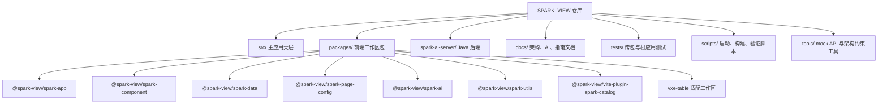

项目的核心 npm 包和职责如下：

| 包 | 主要职责 | 关键价值 |
|---|---|---|
| `spark-app` | 应用启动、路由、导航、认证、主题、插件、日志 | 把 Vue 应用启动变成声明式高层 API |
| `spark-component` | 组件注册、能力系统、递归渲染器、页面渲染、权限 | 把 `SparkNode` 节点树转成真实 UI |
| `spark-data` | DataSet、DataTable、DataView、CRUD、关系、树、历史 | 让页面数据有统一模型，而不是散落在组件状态中 |
| `spark-page-config` | 四文件加载、解析、编译、缓存、远程 API 对接 | 把页面配置文件变成运行时可消费对象 |
| `spark-ai` | AI runtime、业务注册、函数暴露、页面设计工具、知识目录 | 让 AI 在受约束函数与配置空间中工作 |
| `spark-utils` | Logger、HTTP、FileLoader、能力基础工具 | 为上层包提供框架无关底座 |
| `vite-plugin-spark-catalog` | 构建期组件元数据提取、目录生成 | 给 AI 与 DevSystem 提供组件知识 |
| `vxe-table` | 表格集成工作区 | 面向更重表格能力的扩展 |

根应用 `src/main.ts` 并不承载核心渲染逻辑，而是把这些包组装起来：加载配置、注册插件、构建 Vue 页面映射、同步租户项目上下文、启动 `SparkApp.start()`、注册路由守卫、挂载 SPARK 组件系统，并注入全局 AI 面板、SSE 调试桥和页面 UI host。这种设计让主应用更像“平台壳”，真正的平台内核沉淀在 workspace 包内。

## 3. 技术栈与工程基线

项目的前端技术栈是 Vue 3.5、TypeScript、Vite、Element Plus、VXE Table、Vitest、Storybook、ESLint 与 pnpm workspace。后端技术栈是 Java 17、Spring Boot、Maven、JPA/Repository 风格的数据访问、SSE 流式响应和 OpenAI 兼容接口。

根 `package.json` 暴露的脚本可以看出工程目标很明确：开发、构建、包构建、类型检查、lint、测试、架构验证、目录生成、Storybook、发布流程都有对应入口。

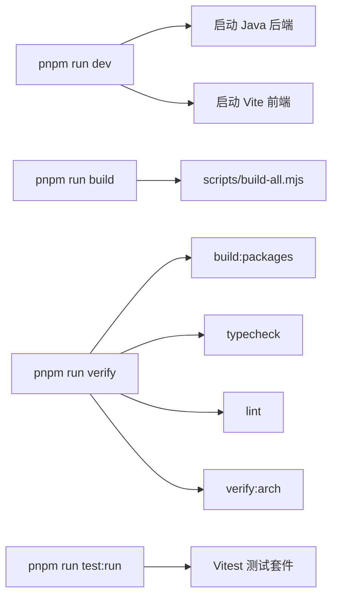

值得注意的是，仓库里有 `tools/verify-architecture.mjs`，它明确约束主应用 `src/` 不能重新实现渲染器、模板编译、沙箱等基础能力，也会检查 workspace 包之间的依赖边界。这说明项目已经把“包分层”视为架构纪律，而不是文档口号。这个脚本输出的依赖关系也概括了当前分层：

```text
spark-utils      工具层：Logger、HTTP、FileLoader、Capability 基础
spark-data       数据管理层
spark-page-config 页面配置加载/编译层
spark-component  组件系统与页面渲染引擎
spark-ai         AI 闭环、业务 runtime、函数工具
spark-app        应用层基础设施
src/             主应用，只组合这些包
```

## 4. 产品心智模型

理解 SPARK View 最短路径不是先看每个包，而是先理解它对“页面”的定义。传统后台页面往往由 Vue SFC、接口请求、表格状态、权限判断和样式共同组成，逻辑散在各处。SPARK View 则把页面定义成一个可加载、可编辑、可校验、可回滚的配置单元。

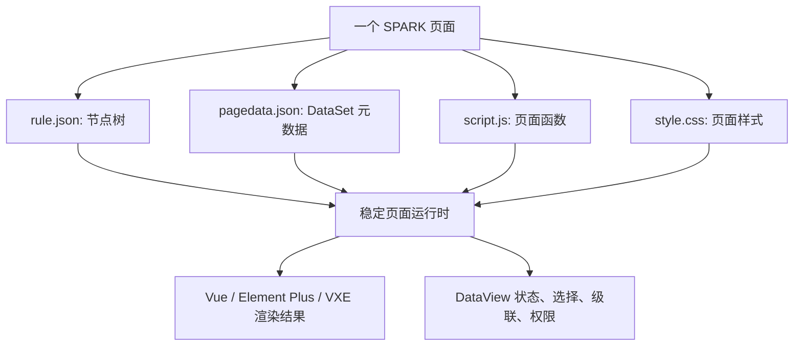

这种模型有几个直接收益：

1. 页面结构可以被 AI 或设计器编辑，而不是必须改 Vue 文件。
2. 数据模型是显式资产，主从关系、自动加载、聚合和计算列不需要藏在组件里。
3. 权限可以从页面模式、模型权限、行权限、字段权限统一进入渲染链。
4. 页面可以做版本管理、回滚、审计和差异分析。
5. AI 的职责被限制在“生成或编辑配置”，运行可靠性由固定 runtime 保障。

## 5. 前端启动链路

前端入口 [src/main.ts](../src/main.ts) 的职责很集中：它不是直接创建完整业务系统，而是把运行所需的配置、插件、路由、组件注册和服务能力交给 `SparkApp.start()`。

启动主流程可以概括为：

1. 清理损坏的本地页面缓存，避免历史缓存污染。
2. 调用 `loadAppConfig()` 加载应用配置。
3. 根据配置注册远程日志 transport。
4. 注册内置插件加载器，并按配置动态加载 Element Plus、VXE Table 等 UI 插件。
5. 从 `src/config/vue-page-map.ts` 构建平台级 Vue 组件页面映射、登录前导航树和平台路径集合。
6. 从 URL 预同步租户和项目上下文，避免跨项目直达时接口上下文错位。
7. 调用 `SparkApp.start()` 创建 Vue app、router、主题服务、SPARK 插件、动态路由和 Bootstrap。
8. 在 `beforeMount` 注册鉴权路由守卫、组件注册逻辑、AI 页面上下文注入。
9. 在 `afterMount` 输出路由统计，完成平台启动。

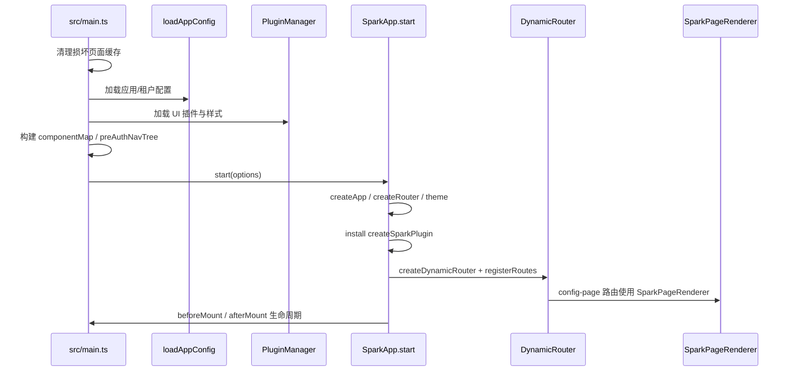

这个入口最值得肯定的是，它把很多容易硬编码在业务里的平台行为显式化了：多租户路径 `/t/{tenantId}/{projectId}`、登录前后导航树切换、远程日志开关、动态请求头、项目切换、AI panel 开关、SSE 调试桥、平台路径白名单都集中在启动链路中。

潜在问题也在这里：`main.ts` 文件职责偏重，已经包含缓存修复、日志、插件、路由守卫、租户同步、组件注册、AI 上下文、错误降级等大量细节。它虽然不是渲染内核，但仍是启动复杂度最高的单文件之一。后续可以把“启动前缓存修复”“租户作用域守卫”“AI 调试桥注册”“插件样式加载”继续拆成可测试的启动阶段模块。

## 6. 应用层：spark-app

`spark-app` 是应用基础设施层。它的高层入口 [packages/spark-app/src/start.ts](../packages/spark-app/src/start.ts) 提供 `SparkApp.start()`，自动完成 Vue app 创建、Vue Router 创建、主题服务初始化、UI 插件安装、SPARK 插件安装、编译时组件注册、动态路由系统配置和 Bootstrap。

这个包的设计意图是把应用启动从“到处调用 createApp/use/router/app.use”提升为声明式配置：

```typescript
await SparkApp.start({
  rootComponent: App,
  routerMode: 'history',
  plugins,
  theme: true,
  spark: { autoRegister: true },
  pageConfig: {
    source: 'remote',
    apiBaseUrl: '/api',
    pageComponent: SparkPageRenderer,
    componentMap,
    tenantPathPrefix: '/t/:tenantId/:projectId',
    loadNavigation,
  },
  config,
})
```

`spark-app` 中另一个关键模块是 [packages/spark-app/src/router/dynamic.ts](../packages/spark-app/src/router/dynamic.ts)。动态路由器以导航树作为路由唯一来源：登录前使用 `preAuthNavTree` 注册平台页和登录页，登录后从远程导航树派生业务路由。它能区分以下节点：

| 导航节点类型 | 路由行为 |
|---|---|
| `config-page` 类节点 | 注册到 `SparkPageRenderer`，通过 `pageId` 加载四文件 |
| `system-page` | 使用 `componentMap` 映射到 Vue SFC |
| `system-action` | 不注册路由，由 header/user menu 等处理 |
| `link` + iframe | 注册外部链接嵌入页 |
| `link` + new-tab/self | 不注册或直接跳转 |
| `ref` | 注册跨项目引用宿主页 |

这让导航树成为平台信息架构的单一事实源。它的工程价值很高：菜单、路由、页面类型、权限模式、跨项目引用都由同一份树驱动，避免“菜单有但路由没有”“路由有但菜单没有”的常见错位。

优化空间主要有两点。第一，动态路由器逻辑非常丰富，适合进一步提炼成“节点分类器、路径解析器、route factory、注册调度器”几个纯函数模块，降低单文件复杂度。第二，`refreshRoutes()` 当前承担重新注册与清理旧路由，如果后续导航树体量很大，可以引入 diff 注册策略，只增删变化节点，减少路由表波动。

## 7. 页面配置加载：spark-page-config

`spark-page-config` 的核心类是 [packages/spark-page-config/src/loader/index.ts](../packages/spark-page-config/src/loader/index.ts) 中的 `PageConfigLoader`。它负责从本地或远程读取 `rule.json`、`pagedata.json`、`script.js`、`style.css`，再交给 compiler 解析成运行时对象。

加载器设计上把“从哪里加载”和“如何解析”分开：

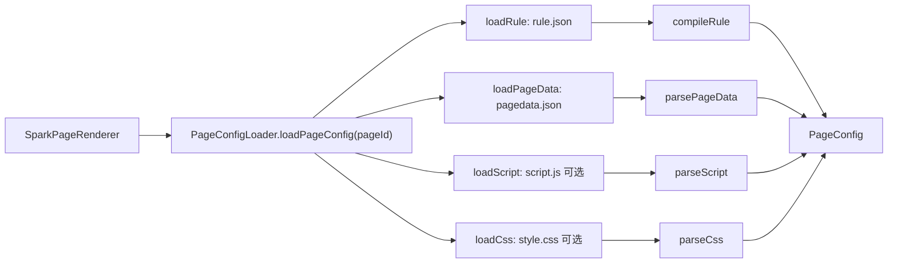

它对必需文件和可选文件做了不同处理：`rule.json` 和 `pagedata.json` 缺失会让页面加载失败；`script.js` 和 `style.css` 缺失会返回空内容。远程模式下通过统一 HTTP client 读取 `/pages-config/{pageId}/{filename}`，并支持动态请求头注入，配合租户与项目上下文。

这个包很重要，因为它是页面配置和运行时之间的契约边界。优化时应优先增强这里，而不是让渲染器到处兜底。建议下一阶段补齐三类能力：

1. 更明确的配置诊断对象。现在 `ConfigLoadResult` 已有 `reason`，但错误仍以字符串为主。可以扩展成 `code/path/fileName/status/detail/suggestion`，便于 UI 给出更可操作的错误。
2. 配置 schema 版本迁移。`pagedata.json` 已有 `schemaVersion`，页面整体也可以引入版本迁移管线，兼容历史配置并给出迁移报告。
3. 远程缓存策略。当前注释说明远程依赖服务器 HTTP 缓存，客户端无缓存。对于大页面和频繁调试，可以引入 ETag/If-None-Match 或显式 timestamp 协议，避免重复拉取四文件。

## 8. 页面渲染核心：spark-component

`spark-component` 是项目最关键的运行时包。它解决的问题是：如何把一个 `SparkNode` 节点树稳定、递归、可扩展地渲染为 Vue 组件，并让数据源、行上下文、权限、页面服务、模块上下文等能力在组件树中松耦合传递。

### 8.1 SparkPageRenderer：四文件落地流水线

[packages/spark-component/src/page/renderer/SparkPageRenderer.vue](../packages/spark-component/src/page/renderer/SparkPageRenderer.vue) 是页面级渲染器。源码注释里已经把流水线写得很清楚：

1. CSS：`style.css` 进入 `setScopedCss`，按页面做作用域隔离。
2. Script：`script.js` 进入 `compileFunctions`，生成页面函数，并注册以 `Render` 开头的运行时函数组件。
3. Data：`pagedata.json` 初始化为 `DataSet`，并通过 `PAGE_DATASET` 能力向下提供。
4. Rule：`rule.json` 进入 `SparkNodeTree`，再由 `buildPageChildren` 转为渲染用 `children`。
5. DOM 更新后执行 `__init__`，然后触发 `dataSet.triggerAutoLoad()` 和 `dataSet.initAutoSelection()`。

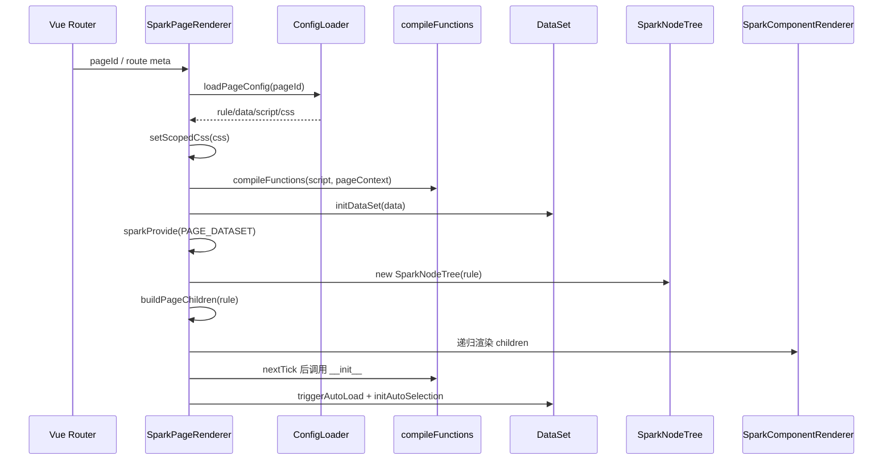

这条流水线是项目的“稳定运行时”核心。AI 可以改配置，但最终都要穿过这条固定管道。这比让 AI 修改任意 Vue 文件安全得多。

### 8.2 SparkComponentRenderer：递归节点渲染

[packages/spark-component/src/components/SparkComponentRenderer.vue](../packages/spark-component/src/components/SparkComponentRenderer.vue) 是通用递归渲染引擎。它做了许多细节处理：

| 机制 | 说明 |
|---|---|
| registry 分支 | 从 SPARK 注册表解析 `config.type`，找到已注册 renderer |
| external 分支 | registry 未命中时尝试全局 Vue 组件或白名单原生标签 |
| fallback 分支 | 未注册时显示降级卡片，子树仍继续递归 |
| beforeRender | 在渲染前基于行数据、dataSource、host 等上下文决定 visible 与 props patch |
| 事件映射 | 把 `props.on` 转成 Vue 的 `onClick/onRowClick` 等 listener prop |
| children 协商 | 根据组件声明或 registry meta 决定 children 走 prop 还是 slot |
| 行上下文 | 当前节点有 row/data 时提供 `DATA_ROW` 能力 |
| 占位符解析 | 将 `$[fieldName]` 这类占位符替换成当前行字段值 |
| 宿主约束 | 根据 registry meta 的 `hostTypes` 检查组件是否能出现在当前宿主链 |

这个渲染器的价值不只是“动态 component”，而是把低代码节点树中常见的不确定性全部收束：未注册组件不致命、原生 DOM attrs 不被污染、运行时上下文可追溯、children 传递有协议、权限与 beforeRender 能影响节点可见性。

优化空间是复杂度控制。`SparkComponentRenderer.vue` 已经承担节点归一、上下文解析、权限/占位符/beforeRender、组件解析、props 过滤、children 协商等多个职责。建议拆出纯函数并扩展测试矩阵，例如：

1. `node-props-forwarding.ts`：专管 props 过滤和事件映射。
2. `node-component-resolution.ts`：专管 registry/global/native/fallback 解析。
3. `node-context-resolution.ts`：专管 row/dataSource/modelPermission/host 上下文。
4. `children-negotiation.ts`：专管 childrenMode、prop/slot 推断。

这样不会改变运行时行为，但能让后续优化更安心。

### 8.3 能力系统

SPARK 的组件通信不主要依赖 Vue provide/inject，而是使用自己的能力系统。能力上下文由 `SparkCapabilityContext` 表达，内部是 capability map 和 parent 链。组件通过 `sparkProvide(KEY, impl)` 提供能力，通过 `sparkConsume(KEY)` 沿父链查找。

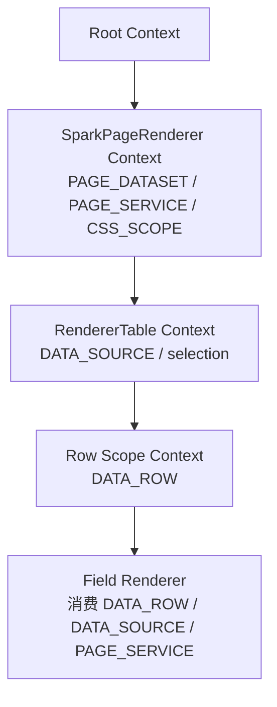

这套机制的优点是跨容器通信松耦合，适合配置化组件树中父子关系动态变化的场景。它也支持延迟绑定：消费不到能力返回 `null` 是正常状态，而不是一定报错。

需要注意的是，能力系统虽然强大，但认知成本较高。对新贡献者来说，“Vue DI 只用于注册表，业务能力走 SPARK 能力链”需要在文档、测试和错误提示中反复强化。建议增加一张“常用能力键地图”和一组 runtime debug API，让开发者能在 DevSystem 中查看当前节点的能力链。

## 9. 数据核心：spark-data

`spark-data` 是 SPARK View 与普通 JSON 表单/表格生成器拉开差异的关键。它没有把数据当作组件 props 的附属物，而是建立了独立数据空间：DataSet、DataTable、DataView、TreeManager、CrudService、ComputedColumnDelegate、AggregateDelegate、CascadeDelegate 等。

### 9.1 DataSet / DataTable / DataView

[packages/spark-data/src/dataset.ts](../packages/spark-data/src/dataset.ts) 中 `DataSet` 的注释很明确：它是数据空间协调器，负责表注册、关系注册、数据加载协调，但不主动操作下层 DataView 状态，也不订阅 DataView 事件。引用方向是 DataView → DataTable → DataSet，尽量避免顶层协调器变成全知全能对象。

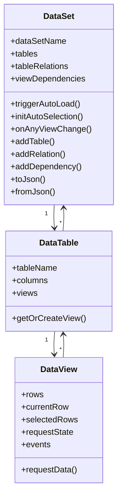

DataSet 的能力包括：

| 能力 | 源码体现 |
|---|---|
| 表/视图管理 | `tables`、`getTable()`、`getView()`、`addTable()`、`removeTable()` |
| 关系与依赖 | `tableRelations`、`viewDependencies`、`_resolvedRelations`、关系索引 |
| 自动加载 | `triggerAutoLoad()` 遍历 autoLoad 的 default 视图 |
| 自动选中 | `initAutoSelection()` 在页面初始化后触发 |
| 事件桥 | `on()`、`onAnyViewChange()` 跨所有视图订阅 |
| 历史快照 | `dataset-history` 支持 commit/list/get/format |
| CRUD 工具 | `DataSetCrudTool.fromDataSet()` 作为 AI/设计器编辑入口 |
| 反序列化 | `fromJson()` 支持 canonical DataSet 与 pagedata 原始对象 |

### 9.2 DataKey

DataKey 是组件和数据视图的连接语法。项目文档中给出的常见格式是 `Users@rows`、`Users@grid@rows`、`Orders@currentRow` 等。组件不直接关心 DataSet 内部结构，而是通过 DataKey 解析到 DataView 或字段。

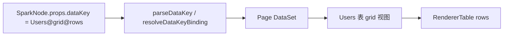

这个设计值得继续强化，因为它是配置表达力和运行时安全之间的桥。建议后续把 DataKey 的错误诊断做得更细：表不存在、视图不存在、字段不存在、跨页引用无效、字段路径错误，都应该返回结构化诊断，供 DevSystem 与 AI 直接消费。

### 9.3 关系、级联、计算列和聚合

`spark-data` 不只负责存取 rows。它支持表关系 `tableRelations`、视图依赖 `viewDependencies`、父子级联、计算列、聚合、脏追踪、选择状态、CRUD 委托和权限字段。对于真实后台页面来说，这些能力比“渲染几个字段”更关键。

典型主从联动模型如下：

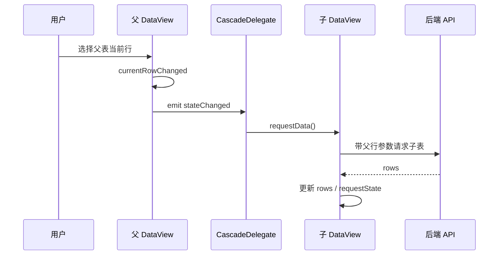

这个模型的优化空间是可观测性。级联链路一旦复杂，开发者需要知道“为什么子表加载了/没加载”“父字段参数怎么解析”“请求为什么处于 Failed”。建议增加 DataView 调试事件面板，记录每次 requestData 的触发源、依赖参数、请求 URL、状态变化和错误。

## 10. 权限体系

权限能力主要落在 `spark-component` 与 `spark-data` 类型中。`spark-data` 定义了 `_perm`、`_modelPerm` 等权限字段，`spark-component` 中 [packages/spark-component/src/permission/PermissionResolver.ts](../packages/spark-component/src/permission/PermissionResolver.ts) 负责动作与字段权限状态解析。

权限判断有几个特点：

1. 支持页面权限模式，例如 `none` 表示不启用权限限制。
2. 区分模型级动作和行级动作。`create/import/export/create-child` 偏模型级，`edit/delete/create-child` 偏行级。
3. 内置动作可以映射为权限动作，例如 `append-row` 映射 `create`，`delete-row` 映射 `delete`，`patch-row` 映射 `edit`。
4. 字段权限由 `computeFieldState` 输出可见性、可编辑性等渲染状态。

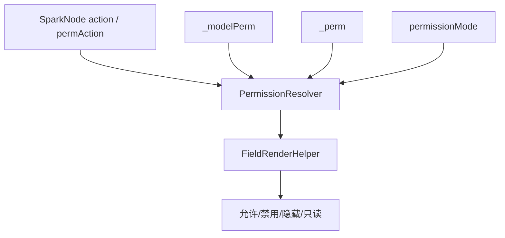

优化建议是把权限从“运行时判断”进一步提升为“配置设计时可解释”。DevSystem 中应能对选中节点展示权限来源：当前动作映射成哪个权限动作、命中了模型级还是行级、权限快照来自哪张表/哪一行、页面模式如何影响结果。这样权限问题不必靠阅读代码排查。

## 11. AI 体系：受约束配置生成

SPARK View 的 AI 设计理念很清楚：AI 不应无边界生成代码，而是在平台定义的业务、模块、函数和知识目录中工作。`packages/spark-ai` 的 README 强调 business-first core：核心层定义业务能力向 LLM 暴露的标准形态，业务层实现 page-design 编辑服务与具体领域能力。

### 11.1 AI runtime

[packages/spark-ai/src/core/runtime/ai-runtime.ts](../packages/spark-ai/src/core/runtime/ai-runtime.ts) 中 `AiRuntime` 是内存型 AI runtime 编排器。它拥有：

| 对象 | 说明 |
|---|---|
| business registration | 按 `businessId` 注册业务能力 |
| runtime instance | 按 `instanceId` 管理运行实例 |
| business scope index | 同一 `(businessId, businessInstanceId)` 复用同一非终态实例 |
| function exposure | 将业务模块函数投影给 LLM |
| history | 记录消息、函数调用、生命周期、函数暴露快照 |
| event hub | 统一订阅实例生命周期和函数执行事件 |
| arg validator | 基于 paramsSchema 做轻量参数校验 |

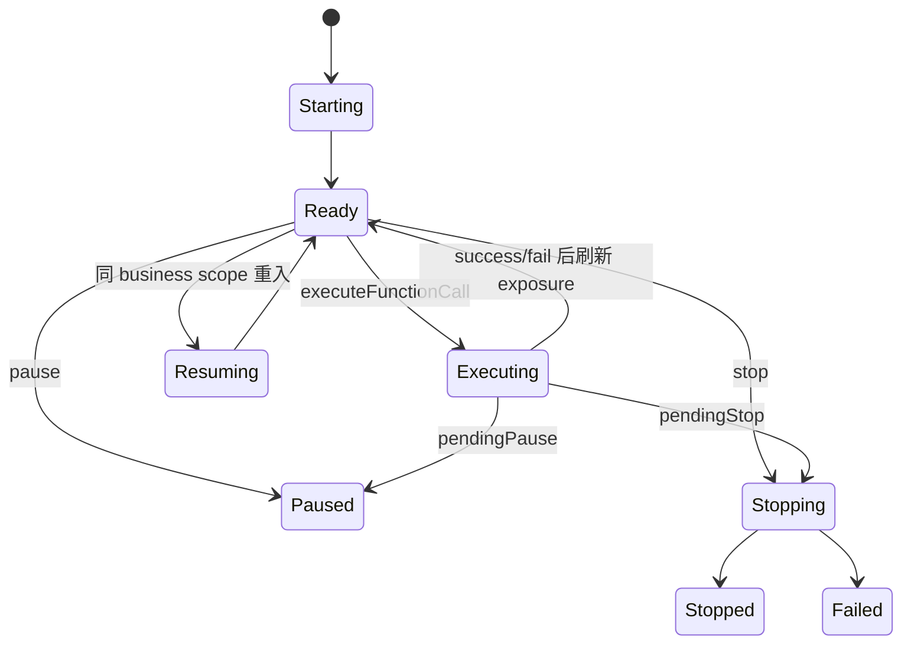

函数调用采用 `business@module@function` 地址。执行前会解析 action、检查 instance 状态、检查 business 匹配、校验 `businessInstanceId`、确认 module/function/exposure 存在、校验参数 schema，再执行业务函数。执行后记录历史、发事件、刷新函数暴露，并处理 pending stop/pause。

这个设计比“前端直接拼 prompt”成熟很多，因为它给 AI 行为提供了可验证边界。优化空间是持久化与并发：当前 runtime 是内存型，适合前端/本地会话与测试；如果要进入多人协作或生产级 AI 会话，需要把 instance/history/event 持久化，并解决并发函数调用、锁、幂等和恢复问题。

### 11.2 page-design 业务

`spark-ai/src/business/page-design` 负责页面设计业务，围绕四文件编辑服务组织：节点树、dataset、json-doc、lifecycle、text-model 等函数模块。它和 `SparkPageRenderer` 暴露的 `nodeTree`、`crudTool` 形成闭环：AI 调工具编辑 `rule.json` 或 `pagedata.json` 的内存模型，页面可以重建 children 或序列化回文件。

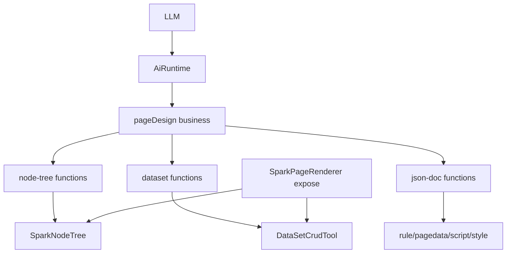

建议后续把 page-design 的函数调用结果进一步标准化：每个工具返回“变更摘要、影响节点/表/字段、可回滚 patch、验证诊断、下一步建议”。这会显著提升 AI 编辑的可解释性。

### 11.3 组件知识目录

`vite-plugin-spark-catalog` 在构建期从组件源码提取元数据，生成 AI 运行时和提示词所需目录。它基于 VCM 读取 props 信息，并输出结构化组件目录。这个包连接了“真实组件 API”和“AI 可用知识”，非常关键。

优化空间在目录质量与变更治理：当组件 props 变更时，应自动生成目录 diff，提示哪些 prompt、示例、schema、AI 工具可能受影响。否则 AI 知识目录会逐渐与组件真实 API 漂移。

## 12. DevSystem 与页面开发闭环

根应用下 `src/views/app/dev-system` 是非常重要的产品功能区。它包含 `DevSystem.vue`、`DevSiteTree.vue`、`DevPreviewTab.vue`、`DevFileEditor.vue`、`DevDataSetDesigner.vue`、节点属性面板、策略文件、页面模型 session、文件文档服务和多个 composable。

从命名和测试看，它承担的是页面配置开发工作台：站点树、文件编辑、预览、数据集设计、节点属性配置、AI 会话和页面模型编辑。它把运行时包提供的底层能力转化成面向配置作者的 UI。

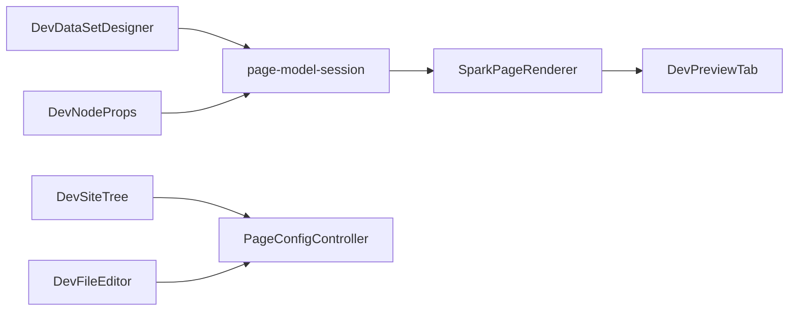

优化建议是把 DevSystem 定义为平台的一等产品，而不是隐藏工具页。它可以承担：

1. 页面配置健康检查。
2. 节点树可视化与能力链调试。
3. DataSet 关系图与请求状态追踪。
4. AI 工具调用回放。
5. 配置版本 diff、回滚和发布审批。
6. 组件目录浏览与 props 示例生成。

这些能力一旦完善，SPARK View 的竞争力会从“运行时框架”升级为“配置化页面生产平台”。

## 13. Java 后端：spark-ai-server

`spark-ai-server` 是 Spring Boot 后端，当前承载范围已经不只是 AI 聊天。根据控制器扫描，主要接口包括：

| Controller | 路径 | 职责 |
|---|---|---|
| `AiChatController` | `/api/ai` | 通用聊天流、组件元数据、上传、截图/路由调试 |
| `AiSessionController` | `/api/ai/sessions` | AI 会话创建、执行、流式执行、追加、查询、删除 |
| `AiDiagnosticsController` | `/api/ai/debug` | FC 错误报告记录与查询 |
| `AppConfigController` | `/api/config`、`/api/tenants`、`/health` | 默认配置、租户配置、健康检查 |
| `AuthController` | `/api/auth` | 登录、注册、注册租户、当前用户 |
| `CacheController` | `/api/cache` | 缓存统计与元数据清理 |
| `NavigationController` | `/api/tenants/{tenantId}/projects/{projectId}/navigation` | 项目导航树查询、节点 CRUD、搜索、子树、链接探测 |
| `PageConfigController` | `/api/.../pages-config` | 页面配置列表、健康、创建、删除、读取、版本、恢复、裁剪 |
| `ProjectController` | `/api/tenants/{tenantId}/projects` | 项目列表、创建、查询、删除 |
| `ScenarioFunctionController` | `/api/ai/scenario-functions` | 场景函数执行 |
| `FilterExpressionCaseController` | `/api/tenants/{tenantId}/projects/{projectId}/filter-expression-cases` | 过滤表达式案例 CRUD |
| `LogsController` | `/api/logs` | 前端远程日志上报 |

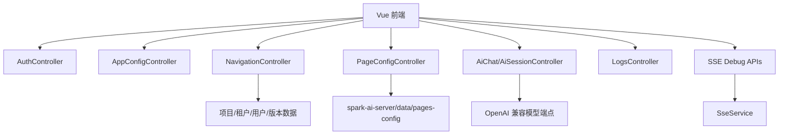

后端的价值在于把页面配置从静态 public 文件升级为多租户、多项目、可版本化、可调试的服务端资产。`spark-ai-server/README.md` 也明确指出，当前正式页面配置路径是 `spark-ai-server/data/pages-config/`，前端通过作用域化 API 读取，而不是把 `public/pages-config` 当默认入口。

后端优化空间比较大，建议按生产化优先级推进：

1. 统一 API 响应格式。目前前端需要处理不同接口形状，建议后端统一 `{ ok, data, error, requestId }`。
2. 权限和租户隔离下沉。前端已有 URL 与 header 约束，但后端应在 service/repository 层强校验 tenant/project 所属关系。
3. 页面配置存储抽象。当前数据目录适合本地与原型，生产可抽象为文件系统、数据库、对象存储或 Git-backed storage。
4. 版本 diff 与审计。版本接口已存在，下一步应增加 diff、作者、提交原因、AI/人工来源、审批状态。
5. AI 会话持久化。当前服务端已有 session API，但还应明确会话与页面版本、工具调用、模型参数、上下文快照的关联。

## 14. 脚本、测试与质量体系

项目测试覆盖面很广：根 `tests/` 包含 AI runtime、AI panel、组件查询目录、权限、动态路由、DataView CRUD、DataKey、DevSystem、字段组件、渲染器、工具栏、布局容器、协议解析等测试；各包内部还有自己的 `src/tests` 或 `__tests__`。

测试体系可以分成四类：

| 类型 | 示例 |
|---|---|
| 运行时行为测试 | renderer、field、toolbar、tabs、dialog、table datasource |
| 数据层回归测试 | DataKey、DataView CRUD、dataset relation rebuild、computed column |
| AI 与协议测试 | ai-runtime、page-design-business、dataset-tool-protocol、llm params validator |
| 架构约束测试 | `tools/verify-architecture.mjs`、forbidden imports、public API |

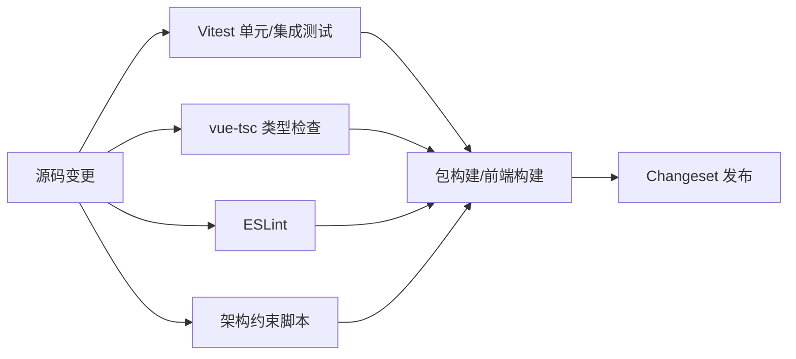

优化建议是引入“场景级黄金样例”。当前单点测试很多，但平台类项目还需要稳定的端到端样例集，例如 tree-demo、master-detail、permission-render、dynamic-columns、smart-load，每个样例都应有页面配置、截图基线、数据请求模拟、权限快照、AI 编辑回归。这样能防止底层改动破坏真实页面体验。

## 15. 核心优势总结

SPARK View 当前已经具备几个明显优势。

第一，架构边界清楚。主应用不是所有逻辑的堆放地，核心能力进入 workspace 包，且有验证脚本守住依赖方向。

第二，页面模型有深度。它不是只渲染表单 JSON，而是把页面结构、数据空间、脚本、样式、权限、导航和 AI 编辑放进同一体系。

第三，数据层设计扎实。DataSet/DataTable/DataView、关系、级联、计算列、聚合、历史、CRUD 委托和 DataKey 组合起来，能覆盖复杂后台页面常见需求。

第四，AI 方向克制而正确。项目没有把“生成代码”当卖点，而是强调受约束配置生成、函数工具、组件知识目录和稳定运行时。

第五，有真实平台化痕迹。多租户路径、项目切换、远程页面配置、版本管理、SSE 调试、远程日志、组件目录生成、DevSystem 都说明项目正在从框架走向平台。

## 16. 主要风险与问题

当前项目也有一些需要正视的问题。

### 16.1 单文件复杂度偏高

`src/main.ts`、`SparkComponentRenderer.vue`、`SparkPageRenderer.vue`、`DynamicRouter`、`DataSet` 等核心文件承载了大量逻辑。它们并非混乱，但已经接近“继续增长会影响维护”的阶段。建议用纯函数模块和更细测试来拆解，而不是大改架构。

### 16.2 配置诊断仍不够产品化

配置化平台最怕错误难查。当前已经有 load error、runtime error、FC error monitor、SSE debug，但对最终页面作者来说，仍需要更强的诊断体验：哪个节点错、哪个 DataKey 错、哪个关系错、哪个权限让按钮消失、哪个请求参数没解析出来。

### 16.3 设计时与运行时需要更紧密闭环

DevSystem 已经具备很多能力，但如果设计器、AI、预览、版本、诊断、发布之间没有形成一条自然工作流，平台能力会显得分散。建议以 DevSystem 为中心重组产品叙事。

### 16.4 AI 工具调用需要可审计

AI runtime 有 history，但在产品层面还需要把每次工具调用落成可读审计：输入参数、影响范围、变更前后、验证结果、是否应用、是否回滚。否则 AI 编辑在复杂页面中会降低信任。

### 16.5 后端生产化仍需补强

后端接口丰富，但生产级平台还需要统一异常、鉴权、租户隔离、审计、数据迁移、存储抽象、限流、观测、会话持久化和部署文档。

## 17. 优化路线图

下面给出一个分阶段优化建议，按“收益高、风险可控、能持续沉淀”的顺序排列。

### 阶段一：诊断与可观测性

目标：让页面配置错误更容易定位。

建议任务：

1. 为 `ConfigLoadResult` 扩展结构化错误码。
2. 为 DataKey 解析返回诊断对象，而不是只返回 null。
3. 在 DevSystem 增加“当前节点诊断”面板：节点类型、registry 命中情况、hostTypes、props、能力链、DataKey 解析、权限结果。
4. 在 DataView 增加请求调试日志：触发源、参数、URL、状态、耗时、错误。
5. 把 `onRuntimeError` 统一接入 AI/DevSystem 错误监控面板。

预期收益：开发者和 AI 都能知道错在哪里，减少“页面空白但不知道原因”的时间。

### 阶段二：核心文件瘦身

目标：降低核心运行时修改风险。

建议任务：

1. 拆分 `SparkComponentRenderer` 的 props 转发、组件解析、children 协商、上下文解析。
2. 拆分 `DynamicRouter` 的节点分类、路径生成、route factory、刷新 diff。
3. 拆分 `main.ts` 的启动阶段：cache repair、plugin style、tenant guard、AI bridge。
4. 为拆出的纯函数补充独立测试。

预期收益：行为不变，但代码更容易审查、测试和扩展。

### 阶段三：DevSystem 产品化

目标：把内部开发工具升级为页面生产工作台。

建议任务：

1. 页面健康检查：四文件是否完整、schema 是否有效、DataKey 是否可解析、组件是否注册。
2. DataSet 可视化：表、视图、关系、依赖、聚合、请求状态。
3. 节点树可视化：节点选择、属性编辑、beforeRender 结果、权限来源。
4. 版本 diff：四文件差异、AI 调用差异、恢复点。
5. 发布流程：草稿、验证、提交、发布、回滚。

预期收益：让 SPARK View 从运行时框架变成可演示、可协作、可落地的平台。

### 阶段四：AI 编辑可信化

目标：让 AI 不是“黑箱改配置”，而是“可解释协作者”。

建议任务：

1. 每个 AI 工具返回标准 patch 与影响摘要。
2. 工具调用前做 dry-run 校验，提示潜在破坏。
3. 工具调用后自动运行页面健康检查。
4. AI 会话绑定页面版本，支持回放和回滚。
5. 组件目录生成加入质量审计和变更 diff。

预期收益：提升用户对 AI 编辑复杂页面的信任。

### 阶段五：后端生产化

目标：支持多人、多租户、可部署环境。

建议任务：

1. 统一 API envelope 与错误码。
2. 所有 service 层强校验 tenant/project/user 权限。
3. 页面配置存储抽象，支持文件、数据库、对象存储或 Git。
4. 版本审计增强：作者、来源、说明、审批、关联 AI 会话。
5. AI session/history 持久化。
6. 增加部署配置、数据库迁移、日志追踪、指标与限流。

预期收益：从原型/内部平台走向可持续运行的团队级产品。

## 18. 推荐对外介绍方式

如果要对外介绍 SPARK View，不建议一开始讲 `SparkNode`、`PAGE_DATASET`、`businessInstanceId` 这些内部术语。更好的表达顺序是：

1. SPARK View 是一个配置驱动的后台页面平台。
2. 它把页面拆成结构、数据、行为、样式四类资产。
3. 运行时固定解释这些资产，因此比 AI 直接生成代码更可控。
4. DataSet/DataView 让主从联动、树、权限、计算列、聚合成为平台能力。
5. DevSystem 与 AI 工具让页面配置可以被可视化编辑、调试、回滚和审计。

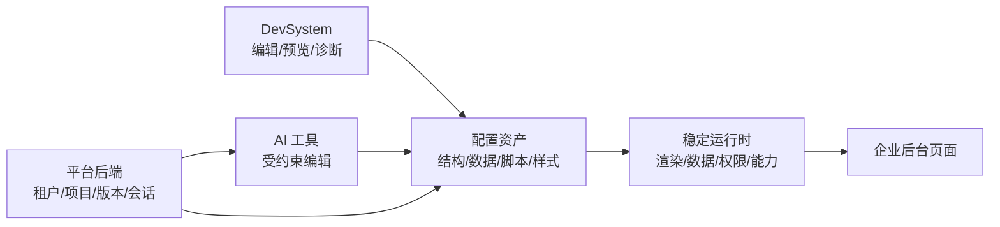

一句更凝练的对外口径可以是：

> SPARK View 用稳定运行时承载配置化页面，用 DataSet 管理复杂业务数据，用权限和导航体系治理后台应用，用受约束 AI 编辑页面资产，而不是让 AI 无边界生成代码。

## 19. 关键源码阅读路线

给新贡献者的推荐阅读顺序如下：

1. [README.md](../README.md)：理解项目定位和包结构。
2. [src/main.ts](../src/main.ts)：理解前端启动、插件、租户路由、页面配置接入。
3. [packages/spark-app/src/start.ts](../packages/spark-app/src/start.ts)：理解应用启动抽象。
4. [packages/spark-app/src/router/dynamic.ts](../packages/spark-app/src/router/dynamic.ts)：理解导航树如何派生路由。
5. [packages/spark-page-config/src/loader/index.ts](../packages/spark-page-config/src/loader/index.ts)：理解四文件加载。
6. [packages/spark-component/src/page/renderer/SparkPageRenderer.vue](../packages/spark-component/src/page/renderer/SparkPageRenderer.vue)：理解页面运行时流水线。
7. [packages/spark-component/src/components/SparkComponentRenderer.vue](../packages/spark-component/src/components/SparkComponentRenderer.vue)：理解递归渲染。
8. [packages/spark-data/src/dataset.ts](../packages/spark-data/src/dataset.ts)：理解数据空间协调器。
9. [packages/spark-data/src/core/data-key.ts](../packages/spark-data/src/core/data-key.ts)：理解组件到数据视图的绑定协议。
10. [packages/spark-ai/src/core/runtime/ai-runtime.ts](../packages/spark-ai/src/core/runtime/ai-runtime.ts)：理解 AI runtime 和函数调用边界。
11. [spark-ai-server/README.md](../spark-ai-server/README.md)：理解后端能力和 API。
12. [docs/ai/README.md](ai/README.md)：理解 AI 文档体系。

## 20. 结语

SPARK View 当前最有价值的地方，是它已经把“配置驱动页面”从简单 JSON 渲染推进到了平台级问题：数据模型、权限、导航、组件目录、AI 编辑、页面版本、调试链路和后端服务都在同一个方向上收束。它的技术路线是克制的：让 AI 做擅长的结构化生成和局部编辑，让稳定 runtime 承担可验证执行，让 DataSet 承担复杂业务状态，让 DevSystem 承担设计时闭环。

下一阶段真正决定项目上限的，不是再增加多少 renderer，而是把诊断、可观测性、设计器体验、AI 审计和后端生产化补齐。只要这些闭环打通，SPARK View 就不只是一个“能渲染配置页面的 Vue 项目”，而会成为一个可以支撑团队长期维护复杂后台页面的平台内核。
