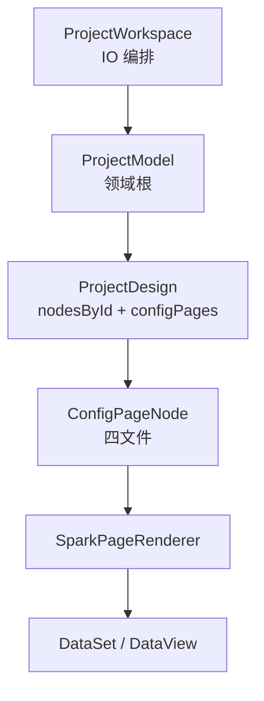

# SPARK AppWorks 项目深度解析

> **注意**：下文部分类名（如 `ProjectNodeCollection`、`ProjectPlanningModel`）为历史表述。当前权威模型见 [`packages/spark-project-model/src/MODEL-HIERARCHY.md`](../packages/spark-project-model/src/MODEL-HIERARCHY.md) 与 [`guides/MODEL-CONVERGENCE-ACCEPTANCE.zh-CN.md`](guides/MODEL-CONVERGENCE-ACCEPTANCE.zh-CN.md)。
>
> 更新基准：2026-06。当前口径：唯一领域根 `ProjectModel`；嵌套子页 = `page` + `hidden` + 无 `path`（legacy `sub-page` 读写时迁移）。

## 定位

SPARK AppWorks 是企业后台的软件项目模型与页面运行平台。它不是 JSON 表单生成器，也不是让 AI 任意生成 Vue 代码的工具。它把项目需求、模块规划、页面功能、结构、数据、脚本、样式和权限收敛到可验证的模型链路。

```text
理念 > 逻辑 > AI 生成代码规则 > SSOT || SOLID > 该删则删 || 该合则合 || 该拆则拆 > 兼容
```

## 主模型



`ProjectDesign.nodesById` 是节点事实源。树形 navigation 是投影；`domain-model/` 第二栈与 `sub-page` nodeKind 已删除（见 MODEL-HIERARCHY §0.1）。

## 节点设计

节点基础字段来自后端 navigation/DB 节点：`id`、`pid`、`title`、`description`、`nodeKind`、`path`、`icon`。

```text
项目 => 子模块 || 页面
子模块 => 子模块 || 页面
页面 => 嵌套子页（page + hidden，无 path）
```

顶层页与嵌套子页均为 `ConfigPageNode`；不再使用独立 `sub-page` nodeKind 或第二套 class。

## 功能策划

节点 `description` 即功能描述，也就是用户需求。所有父级和本级描述都约束当前节点：

```text
project.description
  + module.description
  + page.description
  + subPage.description
  => effectiveUserRequirement
```

项目策划就是模块策划 + 页面策划。模块策划是所属模块下的全子模块、页面、子页面策划；页面策划是页面下的全子页面策划。

## 配置页节点

`navigation` 已合并到 `ProjectNodeModel` 基类，所有节点都通过同一套导航草稿模型承载标题、描述、路径、上下文和权限入口。`ProjectConfigPageNodeModel` 只扩展配置页内容子模型：

| 子模型 | 持久化 |
|---|---|
| `rule` | `rule.json` |
| `dataSet` | `pagedata.json` |
| `script` | `script.js` |
| `style` | `style.css` |

导航也是配置项，但它属于节点基类，不是四文件之一。四文件是内容投影，不能反过来成为最高事实源。

## 包职责

| 包 | 职责 |
|---|---|
| `spark-utils` | Logger、HTTP、FileLoader、基础工具 |
| `spark-data` | DataSet、DataTable、DataView、CRUD、树与事务 |
| `spark-project-model` | ProjectModel、ProjectNode、项目策划、配置页节点子模型 |
| `spark-component` | 组件注册、能力系统、页面渲染器 |
| `spark-app` | Vue 应用壳、路由、插件、主题、认证 |
| `spark-ai` | AI runtime、tool loop、业务注册协议 |

依赖方向：

```text
spark-utils <- spark-data <- spark-project-model <- spark-component <- spark-app
```

## DevSystem

DevSystem 是消费层，不是模型层。

```text
DevSystem
  -> ProjectWorkspace
  -> ProjectModel
  -> ConfigPageNode 四文件
  -> 后端 DB + file
```

pageDesign：DevSystem「AI 编辑」。projectPlanning：仅 headless / Host Run（无 DevSystem 顶栏）。

## AI 生产线

`spark-ai` 是通用 AI runtime。pageDesign 是业务注册示例，它把工具写入收敛到 PageNode 子模型。

```text
AI Agent Host
  -> ensurePageDesignBusiness() | ensureProjectPlanningBusiness()
  -> ProjectWorkspace.project
  -> ProjectModel.openPageDesign(pageId)
  -> ConfigPageNode 子模型
```

AI 写入先进入内存并标 dirty。DevSystem 保持显式保存；自动化 runner 可在运行结束后保存 dirty 四文件。

## 数据运行时

`pagedata.json` 进入 PageNode 的 `dataSet` 子模型，再由 Renderer 初始化 `DataSet`。组件读取数据必须走：

```text
dataViewKey + dataMember + dataField
```

不要使用旧的成员拼接键、点号数据路径、`pageData` 或 `$data` 旁路。

## 继续阅读

- [architecture/SPARK_PAGE_CONFIG_ARCHITECTURE.md](architecture/SPARK_PAGE_CONFIG_ARCHITECTURE.md)
- [architecture/DATAFLOW_ARCHITECTURE.md](architecture/DATAFLOW_ARCHITECTURE.md)
- [guides/CONFIG_SYSTEM.md](guides/CONFIG_SYSTEM.md)
- [ai/README.md](ai/README.md)
