# SPARK View 项目深度解析与演进建议

> 本文面向第一次深入了解 SPARK View 的开发者、维护者和技术评审者。它不逐项复述目录，而是回答四个问题：这个项目解决什么问题，核心运行链路如何成立，各包分别承担什么职责，下一阶段最值得投入的优化空间在哪里。
>
> 更新基准：2026-05-16，覆盖 DataViewKey规则、DataView 输出面、DataSet 事务保存、统一 API envelope、页面配置存储抽象、AI 会话持久化和后端生产化基线。

## 1. 执行摘要

SPARK View 是一个面向 Vue 3、Element Plus 和企业后台场景的深度配置平台。它的核心目标不是再做一个 JSON 表单生成器，也不是让 AI 无边界生成 Vue 代码，而是把页面结构、数据模型、页面行为、样式、权限和导航收束到一条稳定运行时链路中。

一句话概括：

> SPARK View 用配置描述复杂后台页面，用 DataSet 管理业务数据，用组件运行时解释页面结构，用权限和导航治理应用边界，并通过 DevSystem 管理设计时编辑、预览和版本流程。

从产品视角看，它适合这些场景：

| 场景 | SPARK View 的价值 |
|---|---|
| 配置驱动后台 | 用结构化配置生成页面，而不是为每个页面手写 SFC |
| 复杂表单表格 | DataSet/DataView 统一处理数据源、选择、联动、请求和状态 |
| 主从联动和树形编辑 | 关系、级联、当前行和树管理进入平台模型 |
| 权限可视化 | 字段、按钮、页面模式和行权限能进入同一套判断链 |
| 多租户页面平台 | 后端承载租户、项目、成员关系、导航、页面配置、版本审计和 AI 会话 |
| 生产化部署 | MySQL/Flyway、Actuator/Prometheus、Docker、限流和 requestId 日志已进入后端基线 |

项目当前已经从平台雏形推进到“可生产化演进”的阶段：前端使用 pnpm workspace 组织多个运行时包，根应用只做装配；Java 后端已经具备统一响应 envelope、鉴权上下文、成员关系校验、可插拔页面配置存储、AI 会话持久化、MySQL/Flyway 迁移和观测入口。

DevSystem 承担配置编辑、预览、数据设计和版本管理职责；测试与架构验证脚本开始约束包边界。

下一阶段最重要的工作，不是继续增加更多 renderer，而是把诊断产品化、DevSystem 工作流、AI 审计回放和生产化二期压实。这样 SPARK View 才会从“可运行的页面平台”进一步变成“能被团队长期稳定使用的页面生产系统”。

## 2. 项目心智模型

理解 SPARK View 的入口不是组件目录，而是它对“页面”的定义。一个 SPARK 页面被拆成四类可治理资产：

| 资产 | 典型文件 | 说明 |
|---|---|---|
| 页面结构 | `rule.json` | 描述容器、字段、工具栏、事件、节点树和布局关系 |
| 页面数据 | `pagedata.json` | 描述 DataSet、表、视图、关系、请求、计算列和聚合 |
| 页面行为 | `script.js` | 承载页面初始化、事件函数和少量业务分支 |
| 页面样式 | `style.css` | 承载页面级样式，并由渲染器做作用域隔离 |

这四类文件进入固定运行时后，由不同包协作处理：

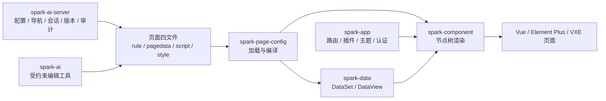

这套模型带来几个关键收益：

1. 页面结构可被设计器和 AI 修改，而不是必须改 Vue 文件。
2. 数据模型成为显式资产，主从关系、自动加载、聚合和计算列不散落在组件状态里。
3. 权限、导航、页面模式和数据状态可以进入统一运行链。
4. 页面可以版本化、回滚、审计和差异分析，版本元数据可关联 requestId、来源和 AI 会话。
5. AI 的工作范围被限制在配置和平台函数内，后端持久化 LLM 会话与工具调用事实，前端 runtime 执行受控工具，降低不可控代码生成风险。
6. DataSet 可以选择逐视图保存或统一事务保存，复杂页面的多表提交不再只能靠页面脚本串行拼接。

SPARK View 的本质不是“动态 component”，而是“配置资产 + 稳定运行时 + 设计时闭环”的组合。

## 3. 仓库全景

仓库根目录同时包含主应用、workspace 包、Java 后端、脚本、文档、测试和构建工具。

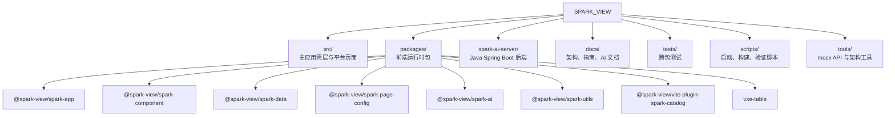

核心目录职责如下：

| 目录 | 职责 |
|---|---|
| `src/` | 产品壳层、平台页面、DevSystem、入口装配和运行时接入 |
| `packages/` | 可复用前端运行时包，是项目内核所在 |
| `spark-ai-server/` | Java 后端，承载页面配置、导航、认证、AI 会话和调试接口 |
| `docs/` | 架构说明、AI prompt、开发指南和质量规范 |
| `tests/` | 根级 Vitest 测试，覆盖跨包行为和运行时集成 |
| `scripts/` | 开发启动、构建、验证、调试和发布脚本 |
| `tools/` | mock config API、组件工具和架构约束脚本 |

核心 workspace 包职责如下：

| 包 | 主要职责 | 关键价值 |
|---|---|---|
| `spark-app` | 应用启动、动态路由、插件、主题、认证、导航 | 把 Vue 应用启动抽象成平台级 API |
| `spark-component` | 组件注册、能力系统、递归渲染器、页面渲染、权限接入 | 把 `SparkNode` 节点树转为真实 UI |
| `spark-data` | DataSet、DataTable、DataView、CRUD、关系、树、历史 | 让页面数据有统一模型 |
| `spark-page-config` | 四文件加载、解析、编译、缓存、远程 API 接入 | 连接配置资产和运行时 |
| `spark-ai` | AI runtime、业务注册、页面设计工具、函数暴露、知识目录 | 让 AI 在受约束函数空间中工作 |
| `spark-utils` | Logger、HTTP、FileLoader、能力基础工具 | 提供框架无关底座 |
| `vite-plugin-spark-catalog` | 构建期提取组件元数据和目录 | 让 AI 与 DevSystem 看到真实组件 API |
| `vxe-table` | VXE Table 集成与适配 | 支持更重的表格场景 |

根应用 [src/main.ts](../src/main.ts) 不承载核心渲染逻辑，而是把配置、插件、路由、组件映射、租户项目上下文、AI 面板和调试桥接入 `SparkApp.start()`。这使主应用更像平台壳层，内核沉淀在 workspace 包里。

## 4. 技术栈与工程基线

当前根 [package.json](../package.json) 显示，前端基线包括 Vue 3.5、TypeScript、Vite、Element Plus、VXE Table、Vitest、Storybook、ESLint 和 pnpm workspace。后端基线是 Java 17、Spring Boot、Maven、JPA/JdbcTemplate、SSE 流式响应和 OpenAI 兼容模型接口，并已引入 Flyway、MySQL driver、Actuator、Micrometer Prometheus、S3 SDK、Dockerfile 与 docker-compose 示例。

常用脚本体现了项目的工程意图：

| 脚本 | 作用 |
|---|---|
| `pnpm run dev` | 启动完整开发环境，包含 Java 后端和 Vite 前端 |
| `pnpm run dev:fe` | 只启动前端 Vite |
| `pnpm run build` | 执行完整构建流程 |
| `pnpm run build:packages` | 构建 workspace 包 |
| `pnpm run typecheck` | 运行 Vue/TypeScript 类型检查 |
| `pnpm run lint` | 运行 ESLint |
| `pnpm run test:run` | 运行根级 Vitest 测试 |
| `pnpm run verify:arch` | 执行架构边界验证 |
| `pnpm run generate:catalog` | 生成组件知识目录 |
| `mvn test` | 运行 `spark-ai-server` 后端测试 |

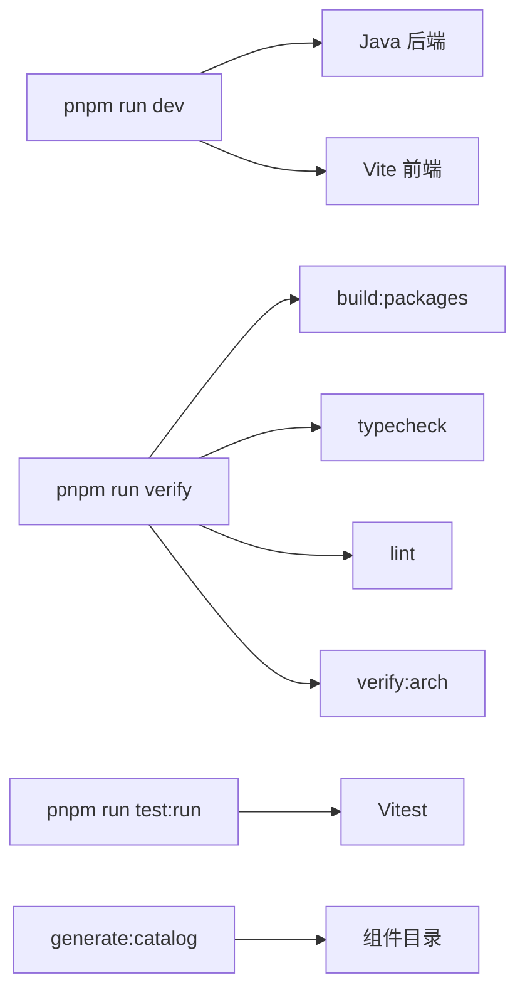

值得注意的是，仓库包含 [tools/verify-architecture.mjs](../tools/verify-architecture.mjs)。它约束主应用 `src/` 不应重新实现渲染器、模板编译、沙箱等基础能力，也会检查 workspace 包之间的依赖边界。这说明项目已经把包分层当作工程纪律，而不是只写在文档里的愿望。

后端配置也开始按环境分层：`application-dev.yml` 和 `application-prod.yml` 均面向 Docker MySQL；本地统一使用 `127.0.0.1:3307/spark_ai`，避免与宿主机 3306 混淆。页面配置默认仍是文件系统，但可通过 `spark.pages.storage.type=file|database|s3|git` 切换存储后端。

## 5. 端到端运行链路

一个配置页面从访问路由到渲染完成，大致经历以下阶段：

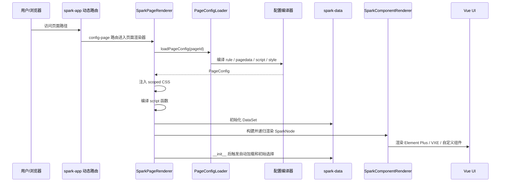

这个链路有两个重要边界：

1. 配置加载与解析集中在 `spark-page-config`，渲染器不应到处兜底读取文件。
2. 页面执行集中在 `spark-component` 和 `spark-data`，AI 和 DevSystem 修改的是配置资产，不直接绕过 runtime。

这也是 SPARK View 和传统“AI 生成页面代码”方案最不同的地方。AI 输出可以变化，但进入页面的执行通道是固定的，因此更容易做校验、回滚和审计。

## 6. 前端入口与应用壳层

[src/main.ts](../src/main.ts) 是根应用启动入口。它的职责不是实现渲染内核，而是把平台运行所需的上下文装配起来：

1. 清理损坏的本地页面缓存。
2. 调用 `loadAppConfig()` 加载应用配置。
3. 注册远程日志 transport。
4. 注册和加载 Element Plus、VXE Table 等 UI 插件。
5. 构建 Vue 页面映射、登录前导航树和平台路径集合。
6. 从 URL 预同步租户和项目上下文。
7. 调用 `SparkApp.start()` 创建 Vue app、router、主题服务、SPARK 插件和动态路由。
8. 注册路由守卫、组件注册逻辑、AI 页面上下文、SSE 调试桥和页面 UI host。

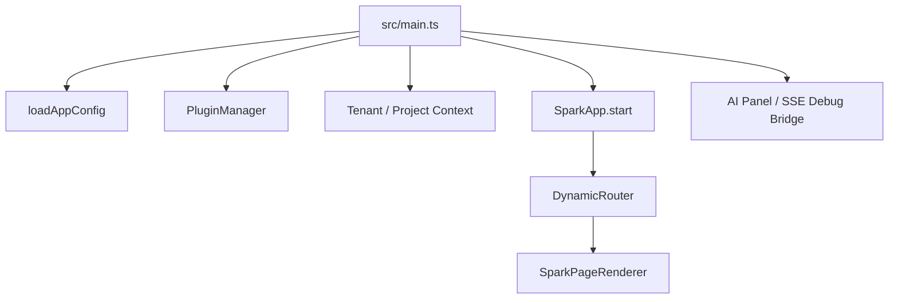

这个入口最有价值的地方，是把多租户路径、登录前后导航树切换、远程日志、动态请求头、项目切换、AI 面板和调试桥集中到启动链路里。

主要风险也在这里：`main.ts` 已经包含缓存修复、日志、插件、租户同步、组件注册、AI 上下文和错误降级等细节，文件职责偏重。建议后续拆出几个启动阶段模块：

| 模块 | 可拆出的职责 |
|---|---|
| `startup/cache-repair` | 本地缓存检测和修复 |
| `startup/plugin-bootstrap` | UI 插件与样式加载 |
| `startup/tenant-scope` | URL 租户项目上下文同步 |
| `startup/route-guards` | 鉴权与平台路径守卫 |
| `startup/ai-bridge` | AI panel、SSE debug 和页面上下文注入 |

拆分目标不是改变行为，而是让启动链路更容易测试和维护。

## 7. `spark-app`：应用基础设施

`spark-app` 是应用层基础设施包。高层入口 [packages/spark-app/src/start.ts](../packages/spark-app/src/start.ts) 提供 `SparkApp.start()`，负责创建 Vue app、Vue Router、主题服务、UI 插件、SPARK 插件、编译时组件注册、动态路由系统和 bootstrap 生命周期。

它希望把传统 Vue 应用里分散的启动代码提升为声明式配置：

```typescript
await SparkApp.start({
  rootComponent: App,
  routerMode: 'history',
  plugins,
  theme: true,
  spark: { autoRegister: true },
  pageConfig: {
    source: 'remote',
    apiBaseUrl: '/api',
    pageComponent: SparkPageRenderer,
    componentMap,
    tenantPathPrefix: '/t/:tenantId/:projectId',
    loadNavigation,
  },
  config,
})
```

另一个关键模块是 [packages/spark-app/src/router/dynamic.ts](../packages/spark-app/src/router/dynamic.ts)。动态路由器以导航树作为路由的事实来源，并根据节点类型生成不同路由行为：

| 导航节点类型 | 路由行为 |
|---|---|
| `config-page` | 注册到 `SparkPageRenderer`，通过 `pageId` 加载四文件 |
| `system-page` | 使用 `componentMap` 映射到 Vue SFC |
| `system-action` | 不注册页面路由，由菜单或用户操作触发 |
| `link` + iframe | 注册外部链接嵌入页 |
| `link` + new-tab/self | 不注册或直接跳转 |
| `ref` | 注册跨项目引用宿主页 |

这个设计让导航树同时驱动菜单、路由、页面类型、跨项目引用和权限入口，避免“菜单有但路由没有”或者“路由有但菜单没有”的平台常见错位。

优化建议：

1. 将动态路由拆成节点分类器、路径解析器、route factory 和注册调度器。
2. 为 `refreshRoutes()` 引入更明确的 diff 注册策略，降低大导航树刷新时的路由波动。
3. 增加导航节点到 route record 的快照测试，防止平台路径规则被无意改坏。

## 8. `spark-page-config`：配置加载与编译边界

`spark-page-config` 的核心类是 [packages/spark-page-config/src/loader/index.ts](../packages/spark-page-config/src/loader/index.ts) 中的 `PageConfigLoader`。它负责从本地或远程读取页面四文件，再交给编译器变成运行时对象。

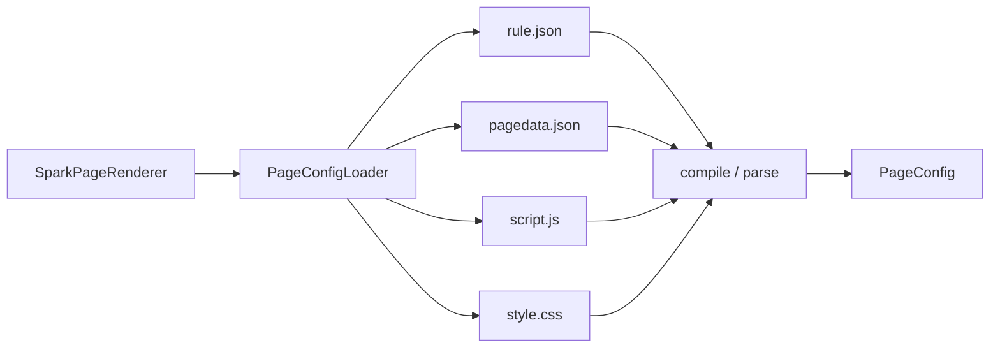

加载器对必需文件和可选文件做了不同处理：运行时页面加载仍将 `rule.json` 与 `pagedata.json` 视为关键资产；DevSystem 编辑态可以显式开启 `allowMissingAsEmpty`，让缺失文件以空文档进入编辑状态，避免把占位内容写回远端。远程模式下，它通过统一 HTTP client 读取 `/pages-config/{pageId}/{filename}`，并支持动态请求头注入，以配合租户和项目上下文。

`page-data-json-schema.ts` 也已经跟随数据层扩展，`CrudApi` 新增 `transaction` 端点，DataSet 顶层新增 `saveChanges` 配置，用于声明 `perView` 或 `transaction` 保存策略。

这个包是配置资产和运行时之间的契约边界。后续优化应优先增强这里，而不是让渲染器在下游反复兜底。

建议补齐三类能力：

| 方向 | 建议 |
|---|---|
| 结构化诊断 | 将加载错误扩展为 `code/path/fileName/status/detail/suggestion` |
| schema 迁移 | 为页面整体配置引入版本迁移管线，兼容历史配置 |
| 远程缓存 | 支持 ETag、If-None-Match 或显式 timestamp 协议 |
| schema 示例 | 为 `saveChanges.transaction`、`dataViewKey + dataMember + dataField`、聚合和状态字段提供最小可运行样例 |

如果这个边界变得更强，DevSystem 和 AI 都可以基于同一套诊断对象给出可操作反馈。

## 9. `spark-component`：页面渲染核心

`spark-component` 是最关键的运行时包。它解决的问题是：如何把 `SparkNode` 节点树稳定、递归、可扩展地渲染为 Vue 组件，并让数据源、行上下文、权限、页面服务和宿主上下文在动态组件树中传递。

### 9.1 `SparkPageRenderer`

[packages/spark-component/src/page/renderer/SparkPageRenderer.vue](../packages/spark-component/src/page/renderer/SparkPageRenderer.vue) 是页面级渲染器。它把页面四文件落成运行时：

1. `style.css` 进入 `setScopedCss`，按页面做作用域隔离。
2. `script.js` 进入 `compileFunctions`，生成页面函数，并注册以 `Render` 开头的运行时函数组件。
3. `pagedata.json` 初始化为 `DataSet`，并通过能力系统向下提供。
4. `rule.json` 进入 `SparkNodeTree`，再由 `buildPageChildren` 变成渲染子树。
5. DOM 更新后执行 `__init__`，随后触发自动加载和初始选择。

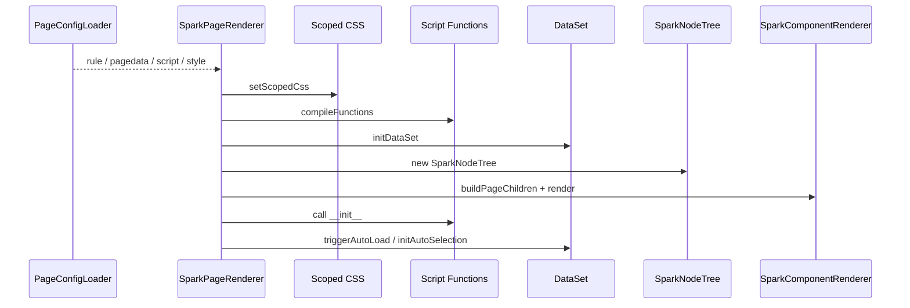

这条流水线是项目的稳定执行核心。AI 可以改配置，DevSystem 可以改配置，但最终都必须经过同一套运行时解释。

### 9.2 `SparkComponentRenderer`

[packages/spark-component/src/components/SparkComponentRenderer.vue](../packages/spark-component/src/components/SparkComponentRenderer.vue) 是通用递归渲染器。它不只是动态 component 包装，而是集中处理配置节点在真实 UI 中的多种不确定性：

| 机制 | 说明 |
|---|---|
| registry 解析 | 根据 `config.type` 从 SPARK 注册表找到 renderer |
| fallback 渲染 | 组件未注册时显示降级卡片，同时保留子树递归 |
| beforeRender | 在渲染前基于上下文决定可见性和 props patch |
| 事件映射 | 将配置中的事件映射为 Vue listener props |
| children 协商 | 根据组件声明决定 children 走 prop 还是 slot |
| 行上下文 | 当前节点有 row/data 时提供 `DATA_ROW` 能力 |
| 占位符解析 | 将任意 prop 中的 `$[fieldName]` 替换为当前行字段值 |
| 宿主约束 | 根据 registry meta 的 `hostTypes` 检查组件可放置位置 |

优化建议是拆出纯函数模块，并给每类规则补独立测试：

| 模块 | 职责 |
|---|---|
| `node-props-forwarding.ts` | props 过滤、事件映射和透传策略 |
| `node-component-resolution.ts` | registry 命中、hostTypes 约束和 fallback 诊断 |
| `node-context-resolution.ts` | row、dataSource、权限和宿主上下文 |
| `children-negotiation.ts` | childrenMode、prop/slot 推断 |

这样可以保持行为不变，同时降低后续改 renderer 的风险。

占位符解析是渲染器级能力，不是某个展示组件的私有能力。只要节点处在 `DATA_ROW` 上下文中，任何组件的任何 prop 都可以写 `$[fieldName]`：纯占位符保留字段原始类型，混合文本会转成字符串。`placeholder-demo` 页面里的 `r-tag.content="$[age] 岁"`、`r-tag.tagType="$[ageBadgeType]"`、`r-statistic.title="$[name] 的年龄"` 就是这个能力的标准用法。

### 9.3 能力系统

SPARK 的组件通信不只依赖 Vue provide/inject，而是使用自己的能力系统。能力上下文由 capability map 和 parent 链组成，组件通过 `sparkProvide(KEY, impl)` 提供能力，通过 `sparkConsume(KEY)` 沿父链查找能力。

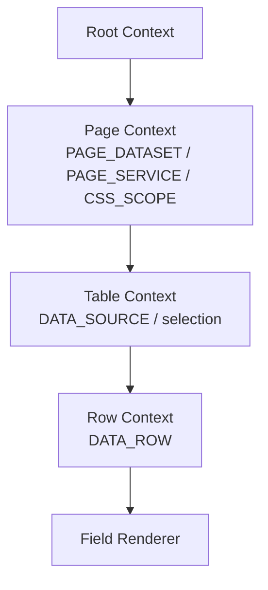

这套机制适合配置化组件树，因为父子关系可能由配置动态决定，不能完全依赖静态组件层级。但它也带来认知成本。建议在 DevSystem 中增加“能力链调试”视图，展示当前节点能消费哪些能力、能力来自哪个祖先节点、是否命中预期数据源。

## 10. `spark-data`：数据空间与绑定协议

`spark-data` 是复杂后台页面的核心支撑。它让页面不再把数据散落在组件内部，而是通过 DataSet、DataTable、DataView、DataViewKey 和关系管理形成统一数据空间。

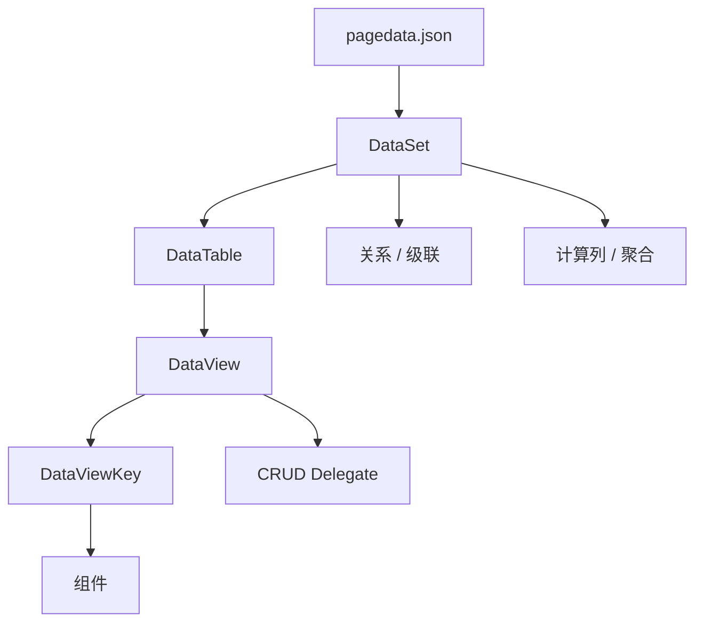

### 10.1 DataSet / DataTable / DataView

DataSet 是页面数据空间协调器，DataTable 表示表级数据容器，DataView 表示面向组件绑定和交互的视图。组件通常不直接关心接口细节：表级容器通过 `dataViewKey` 定位某个 DataView，展示组件或动作上下文通过 `dataViewKey + dataMember + dataField` 读取该 DataView 的 rows、currentRow、selection、aggregateResult 或状态字段。

这套分层让 SPARK 页面能表达后台页面常见模式：

| 能力 | 价值 |
|---|---|
| 当前行 | 主表选中后，详情区和子表自动响应 |
| selection | 工具栏动作可以基于勾选行执行 |
| editingRows | 字段编辑可写入 DataView 编辑态，提交前不污染原始 rows |
| 关系与级联 | 主从数据不需要每个组件手写 watch |
| 自动加载 | 页面初始化后按配置触发请求 |
| CRUD 委托 | 新增、编辑、删除、保存进入统一数据工具 |
| 事务保存 | `DataSet.saveChanges({ mode: 'transaction' })` 可把多表 staged 变更提交到统一后端事务端点 |
| 历史记录 | 支持撤销、回滚和变更追踪的基础 |
| 计算列/聚合 | 将业务派生数据纳入平台模型 |

### 10.2 DataViewKey 与 DataMember

DataViewKey 和 DataMember 是组件和数据视图之间的绑定协议。DataViewKey 用稳定字符串定位 DataView，DataMember 用枚举字符串选择 DataView 输出成员，DataField 再选择对象成员内部的业务字段或点路径：

| 协议 | 示例 | 含义 |
|---|---|---|
| DataViewKey | `Users@mainList` | 容器级绑定，定位 `Users` 表的 `mainList` DataView |
| DataViewKey | `#SharedDS@Users@lookup` | 跨 scope 定位共享 DataView |
| DataMember | `rows` | 读取某个 DataView 的行集合 |
| DataMember + DataField | `currentRow` + `name` | 读取当前行的 `name` 字段 |
| DataMember | `selectedRows` | 读取当前多选集合 |
| DataMember + DataField | `aggregateResult` + `totalAmount` | 读取聚合结果字段 |
| DataMember | `requestState` | 读取请求状态 |
| DataMember | `loadingError` | 读取加载错误 |

当前规则下，表级容器使用 `dataViewKey`，DataView 输出读取使用 `dataViewKey + dataMember + dataField`。例如列表容器写 `dataViewKey: "Users@mainList"`，字段节点写 `field: "name"`，统计展示写 `dataViewKey: "Users@summary", dataMember: "aggregateResult", dataField: "totalAmount"`。

在容器已经提供 `DATA_ROW` 的子树中，还可以使用 `$[fieldName]` 把当前行字段投影到任意 prop，这适合按钮文案、tag 类型、tooltip、标题、前后缀等轻量展示，不需要额外脚本拼装。

当前 DataView 的 UI 输出面已经不只是 `rows`。容器状态桥接监听 DataView 领域事件，并按需读取 `rows`、`columns`、`currentRow`、`selectedRows`、`editingRows`、`aggregateResult`、`selectionAggregateResult`、`total`、`page`、`pageSize`、`requestState`、`mutating`、`loadingError`、`mutatingError`、权限和树配置。`r-table/r-list/r-tree/r-filter` 等表级容器通过 `dataViewKey` 解析 DataView；`r-form/r-detail` 通过 `contextDataMember` 和 `contextDataField` 选择 currentRow、aggregateResult 或 selectionAggregateResult 作为字段上下文。

建议后续增强 DataViewKey 诊断：当解析失败时，不只返回 null，而是返回失败原因、候选 view、候选字段和修复建议。这个能力对 DevSystem 和 AI 都很重要。

### 10.3 关系、级联、计算列和聚合

SPARK View 的数据层不止是请求缓存。它已经开始覆盖企业后台页面中最容易散落的复杂逻辑：

1. 主从关系：父视图当前行变化后，子视图参数和数据随之变化。
2. 树数据：树节点、当前节点、展开状态和编辑行为进入统一模型。
3. 计算列：派生字段不必落在每个组件的临时 computed 里。
4. 聚合：表格统计和汇总可以成为配置化能力。
5. 请求状态：加载、失败、空状态和刷新可以被平台统一感知。
6. 事务提交：`CrudService.executeTransaction` 和后端 `/data/transactions` 让多表 create/update/delete 具备原子性与 requestId 幂等 replay。

下一阶段建议为 DataSet 增加可视化关系图、请求追踪面板和事务计划预览，让页面作者能看见“哪个组件触发了哪个 view 的哪次请求”，以及一次保存会生成哪些 transaction operations。

## 11. 权限体系

SPARK View 的权限思路是把权限判断嵌入渲染链，而不是让每个业务页面临时写 `v-if`。权限来源包括页面模式、节点动作、模型权限、行权限、字段权限和组件状态。

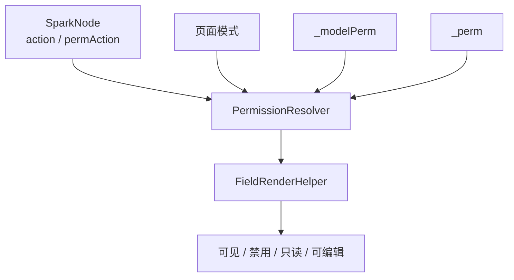

这套能力让同一份页面结构可以在不同权限快照下呈现不同结果。它也为 `permission-render` 这类 demo 提供了很强的表达力：改权限，不改页面代码。

主要优化方向是设计时可解释性。页面作者需要知道：

1. 当前节点为什么被隐藏或禁用。
2. 权限动作来自哪个配置字段。
3. 命中的是模型级权限还是行级权限。
4. 页面模式如何影响最终状态。
5. 当前字段是否因为数据状态而只读。

建议 DevSystem 为选中节点增加权限诊断卡片，把运行时判断过程变成可读报告。

## 12. `spark-ai`：受约束的 AI 编辑体系

`spark-ai` 的设计方向是克制的：AI 不直接拥有整个仓库的修改权，而是在业务、模块、函数和知识目录定义的范围内工作。

### 12.1 AI runtime

[packages/spark-ai/src/core/internal/runtime/ai-runtime.ts](../packages/spark-ai/src/core/internal/runtime/ai-runtime.ts) 中的 `AiRuntime` 不是模型网关，也不是页面编辑器本身，而是 AI Core 的组合根。它把注册、知识投影、会话账本、函数调用翻译和函数执行串起来，并且只通过 `registerBusiness` / `registerModule` 返回的注册句柄暴露能力。

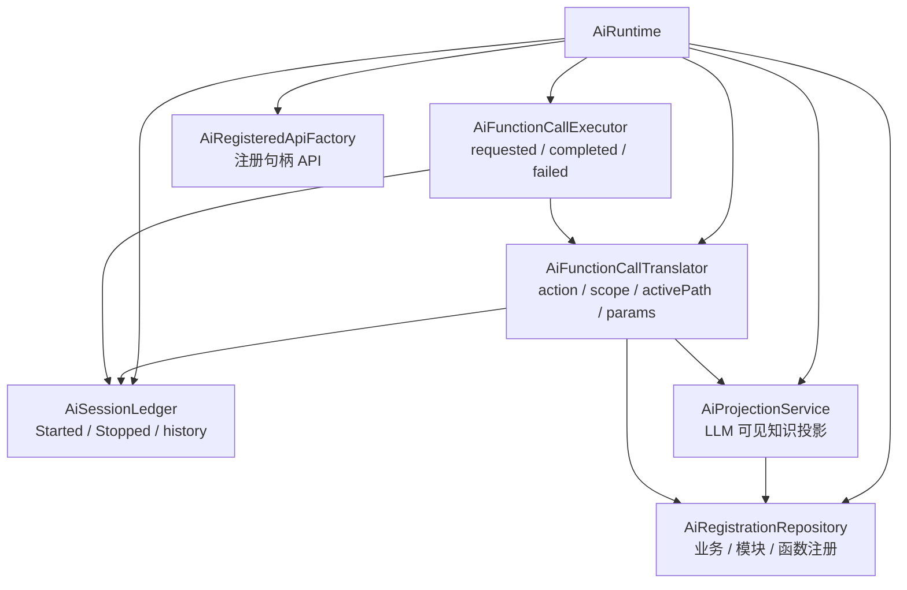

前端 AI Core 的会话生命周期目前只有 `Started` 和 `Stopped`。它保存的是当前模块实例的 AI 会话记录、UI/LLM 消息和函数调用历史，不创建、不恢复、不暂停模块服务实例，也不直接调用后端 LLM。函数调用由 `AiInvocationProtocol` 解析 action，再经 projection、scope、activePath 和参数 schema 校验；执行器只调用注册方提供的 `run` 落点，并把函数调用记录成 `requested/completed/failed`。

这个边界非常重要。它让 AI 行为从“拼 prompt 后直接生成代码”变成“LLM 看到投影出来的工具，前端 runtime 把工具调用翻译成受约束的平台函数”。可验证性高很多，职责也更清楚。

需要特别区分两层会话：前端 `AiRuntime/AiSessionLedger` 是工具执行侧的内存账本；后端 `AiSessionService` 是 LLM 会话、SSE 流和数据库持久化服务。二者通过应用层 transport 协作，但不是同一个对象，也不是互相自动同步完整状态。

### 12.2 page-design 业务

[packages/spark-ai/src/registrations/page-design/page-design-module.ts](../packages/spark-ai/src/registrations/page-design/page-design-module.ts) 是页面设计业务适配器。它内部创建 `AiRuntime`，把自己注册成 business，并把页面编辑能力拆成五个子模块：

| 模块 | 职责 |
|---|---|
| `lifecycle` | 初始化编辑会话、查询编辑进度 |
| `textModel` | 读写 `script.js` 和 `style.css` |
| `knowledge` | 查询组件参数 payload 和组件知识 |
| `nodeTree` | 读写 `rule.json` 对应的 SparkNodeTree |
| `dataset` | 读写 `pagedata.json` 对应的 DataSetCrudTool |

真正落地到页面文件的能力在 [PageDesignService](../packages/spark-page-config/src/page-design/operations/page-design-service.ts)。它通过 `PageDesignEditHost` 获取活体编辑对象：`getNodeTree`、`getDataSetTool`、`readScript/writeScript`、`readStyle/writeStyle`。也就是说，AI 工具不是直接改 Vue 组件或后端文件，而是调用宿主暴露的编辑会话。

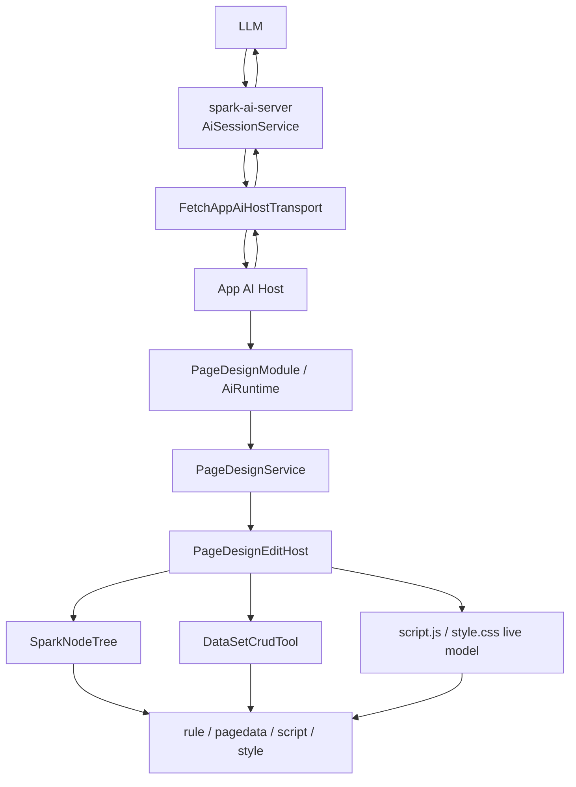

这里还有一个关键细节：LLM tool call 的闭环由 [src/services/ai-host/tool-loop.ts](../src/services/ai-host/tool-loop.ts) 驱动。后端 SSE 返回 `toolCalls` 后，前端在本地执行 `runtime.executeFunctionCall`，再把 assistant/tool messages 通过 `/turn/append` 追加回后端会话。因此后端保存的是 LLM 对话、计划中的 tool calls 和追加回去的 tool result 消息；页面配置的实际编辑仍发生在前端宿主绑定的编辑对象里。

### 12.3 后端 AI session

[spark-ai-server/src/main/java/com/spark/ai/service/AiSessionService.java](../spark-ai-server/src/main/java/com/spark/ai/service/AiSessionService.java) 负责 OpenAI-compatible LLM 调用、SSE stream、Function Calling 消息窗口、协议 v3 校验、scope guard 和持久化。它会把 session、message、tool call 和 context snapshot 写入数据库；`/conversation` 会从持久层恢复完整消息历史；retention job 默认按配置清理过期会话。

这层不应该被描述成“执行页面设计工具”的地方。它更像 LLM 会话账本与流式传输层：负责让工具调用计划可追踪、让 SSE result/error 使用 envelope、让前端完成工具执行后能把结果 append 回同一条后端会话。

产品层后续仍应把 AI 工具调用结果标准化为：

| 字段 | 说明 |
|---|---|
| `summary` | 本次变更做了什么 |
| `affected` | 影响的节点、表、字段或文件 |
| `patch` | 可回滚的结构化变更 |
| `diagnostics` | 校验结果和潜在问题 |
| `nextSteps` | 建议下一步 |

这样 AI 编辑才会从“黑箱改配置”变成“可解释协作者”。

### 12.4 组件知识目录

`vite-plugin-spark-catalog` 在构建期从组件源码提取元数据，生成可供业务 AI 模块和 DevSystem 使用的组件目录。它连接真实组件 API 与上层工具知识，是避免手写目录与源码漂移的关键机制。

后续建议在目录生成中加入质量审计：

1. props 变更时生成目录 diff。
2. 标记缺少示例或说明的组件。
3. 检查 prompt 中引用的组件类型是否仍存在。
4. 将目录 diff 接入 CI，防止组件 API 与 AI 知识脱节。

## 13. DevSystem：设计时闭环

根应用下 [src/views/app/dev-system](../src/views/app/dev-system) 是项目非常关键的产品能力区。它包含站点树、文件编辑器、预览、DataSet 设计器、节点属性面板、策略文件和多个 composable。

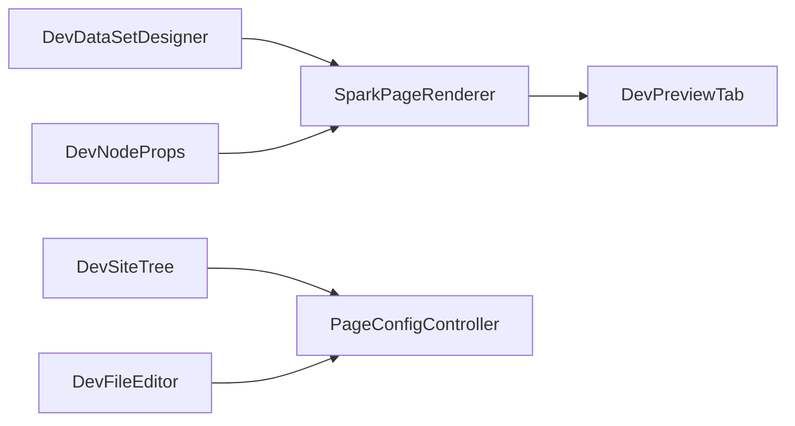

DevSystem 应该被视为 SPARK View 的一等产品，而不是附属调试页。因为配置化平台真正难的不是把 JSON 渲染出来，而是让页面作者能持续编辑、预览、诊断、发布和回滚。

建议围绕 DevSystem 打造五个核心工作流：

| 工作流 | 说明 |
|---|---|
| 页面健康检查 | 四文件完整性、schema、组件注册、DataViewKey、权限、请求配置 |
| 节点树编辑 | 节点选择、拖拽/插入、属性编辑、beforeRender 结果 |
| DataSet 可视化 | 表、视图、关系、依赖、请求状态和当前行 |
| AI 调用回放 | 工具调用参数、影响范围、变更前后和验证结果 |
| 版本发布 | 草稿、diff、提交、审批、发布和回滚 |

一旦这些闭环打通，SPARK View 的竞争力会从“运行时框架”升级为“页面生产平台”。

## 14. Java 后端：`spark-ai-server`

[spark-ai-server](../spark-ai-server) 是 Spring Boot 后端。虽然名字里带 AI，但当前职责已经覆盖平台后端能力：聊天流、AI 会话、页面配置、导航、认证、租户项目、SSE 调试、日志和版本管理。

根据当前控制器、service、entity 和配置，可以概括为：

| 能力 | 说明 |
|---|---|
| API envelope | JSON REST 统一返回 `{ ok, data, error, requestId }`，非 JSON/SSE 保留原协议，SSE result/error data 使用同一 envelope |
| AI chat | `POST /api/ai/chat/stream` 通用对话流 |
| AI sessions | `/api/ai/sessions/*` 会话创建、执行、追加、查询和销毁，DB 持久化 session/message/tool/context |
| 页面配置 | 读取、创建、删除、版本、恢复和健康检查页面四文件，依赖 `PageConfigStorage` SPI |
| 导航树 | 多租户项目下的导航节点查询、CRUD、搜索和链接探测，service 层校验访问上下文 |
| 认证与租户 | 登录、注册、当前用户、租户、项目和 `ProjectMember` 成员关系 |
| 动态数据 | 动态表模型、CRUD、批处理与同步事务提交 `/data/transactions` |
| SSE 调试 | 截图、路由、调试请求和结果回传 |
| 观测与治理 | requestId MDC 日志、IP 限流、Actuator health、Prometheus metrics |

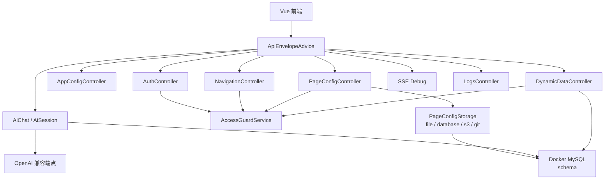

后端的价值，是把页面配置从静态 public 文件升级为多租户、多项目、可版本化、可调试、可审计的服务端资产。当前正式页面配置路径默认仍是 `spark-ai-server/data/pages-config/`，但 `PageConfigService` 已经只依赖 `PageConfigStorage`，文件系统只是默认 adapter。

已经落地的生产化基线如下：

| 基线 | 当前状态 |
|---|---|
| 统一响应 | `ApiEnvelopeAdvice`、`ApiResponseFactory`、`GlobalExceptionHandler` 和 `RequestIdFilterConfig` 已统一 JSON 成功/错误响应 |
| 鉴权上下文 | JWT filter 写入 requestId/tenantId/username/roles，`AccessGuardService` 在 service 层校验用户、租户、项目和成员关系 |
| 存储抽象 | `PageConfigStorage` 支持 file/database/s3/git，`PageConfigFileEntity` 承载 database storage |
| 版本审计 | `FileVersionEntity` 增加 source、commitMessage、approvalStatus、AI session/turn、requestId、contentHash、storageRef |
| AI 持久化 | `AiSessionEntity`、`AiMessageEntity`、`AiToolCallEntity`、`AiContextSnapshotEntity` 与 retention job 已落地 |
| 数据库迁移 | `V1__production_baseline.sql` 覆盖核心业务表和动态数据元数据表 |
| 部署观测 | `application-prod.yml`、Dockerfile、docker-compose、Actuator、Prometheus 和 IP rate limit 已进入仓库 |

下一阶段后端不再是“补齐生产化”这个大方向，而是生产化二期：补 Testcontainers/MySQL 迁移验证、对象存储集成测试、审计查询 API、租户级限流、OpenTelemetry tracing、备份恢复策略和 Git storage 的远端同步策略。

## 15. 测试、脚本与质量体系

项目已经有较丰富的测试和质量入口。根 `tests/` 覆盖 AI runtime、AI panel、组件查询目录、权限、动态路由、DataView CRUD、DataViewKey、DevSystem、字段组件、渲染器、工具栏、布局容器和协议解析等内容。各包内部也有自己的测试。

质量体系可以分成四类：

| 类型 | 示例 |
|---|---|
| 运行时行为测试 | renderer、field、toolbar、tabs、dialog、table datasource |
| 数据层回归测试 | DataViewKey、DataView CRUD、relation rebuild、computed column、editingRows、transaction save |
| AI 与协议测试 | ai-runtime、page-design-business、dataset-tool-protocol、validator |
| 后端生产化测试 | envelope controller、AI session、page config service、dynamic data transaction、navigation service |
| 架构约束测试 | `verify-architecture.mjs`、forbidden imports、public API |

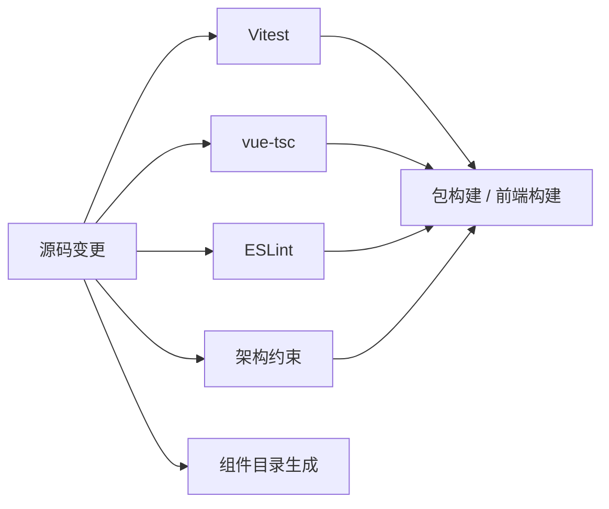

下一阶段建议增加“场景级黄金样例”。单点测试能保护函数行为，但平台项目还需要保护真实页面体验。建议为以下 demo 建立稳定样例集：

| 样例 | 验证重点 |
|---|---|
| `tree-demo` | 树编辑、当前节点、表单联动、页面脚本 |
| `master-detail` | 主从关系和 DataView 联动 |
| `permission-render` | 权限快照对渲染结果的影响 |
| `dynamic-columns` | 动态列和表格配置 |
| `smart-load` | 依赖链驱动的数据加载 |
| `tx-transaction-commit` | 多表事务提交和 `DataSet.saveChanges(transaction)` |
| `tx-transaction-retry` | requestId 幂等 replay 与 payload 冲突拒绝 |
| `tx-editing-rows` | 字段编辑态、保存前预览和 DataView editingRows |

每个样例应包含页面配置、mock 数据、权限快照、截图基线和 AI 编辑回归。这样底层改动才不容易破坏真实体验。

## 16. 当前优势

SPARK View 当前最突出的优势有五点。

第一，架构边界清楚。主应用不是所有逻辑的堆放地，核心能力进入 workspace 包，并有架构验证脚本守住依赖方向。

第二，页面模型有深度。项目不是只渲染表单 JSON，而是把结构、数据、脚本、样式、权限、导航和 AI 编辑放进同一体系。

第三，数据层扎实。DataSet、DataTable、DataView、DataViewKey、关系、级联、计算列、聚合和 CRUD 委托能覆盖复杂后台页面的常见需求。

第四，AI 方向克制。项目没有把“生成代码”作为核心卖点，而是强调受约束配置生成、函数工具、组件知识目录和稳定运行时。

第五，平台化痕迹真实。多租户路径、项目切换、远程页面配置、版本审计、统一 envelope、SSE 调试、远程日志、DevSystem、组件目录生成和后端迁移/观测配置都说明项目正在从框架走向平台。

## 17. 主要风险

### 17.1 单文件复杂度继续上升

`src/main.ts`、`SparkComponentRenderer.vue`、`SparkPageRenderer.vue`、`DynamicRouter` 和 `DataSet` 等核心文件已经承担大量逻辑。它们并非混乱，但继续增长会提高维护和评审成本。

建议优先用纯函数模块和测试拆分，不做大规模架构重写。

### 17.2 配置诊断还不够产品化

配置化平台最怕错误难查。当前已有加载错误、运行时错误、FC error monitor 和 SSE debug，但页面作者仍需要更明确的诊断：哪个节点错、哪个 DataViewKey 错、哪个关系错、哪个权限让按钮消失、哪个请求参数没有解析出来。

建议把诊断对象前移到 loader、DataViewKey、renderer、permission 和 DataView 请求链。

### 17.3 设计时和运行时闭环还不够紧

DevSystem 已经具备许多能力，但编辑、预览、诊断、AI、版本和发布之间还需要更自然的工作流。否则平台能力容易显得分散。

建议以 DevSystem 为中心重新组织产品叙事和功能入口。

### 17.4 AI 编辑需要产品级审计

后端已经开始持久化 AI session、message、tool call 和 context snapshot，但产品层还需要把每次工具调用转成可读审计：输入参数、影响范围、变更前后、验证结果、是否应用、是否回滚。

没有审计，AI 在复杂页面中的可信度会下降。

### 17.5 后端生产化二期仍需压实

后端生产化基线已经落地，但生产级平台仍需要把“可运行”推进到“可运营”：迁移脚本需要 MySQL/Testcontainers 验证，S3/Git storage 需要真实集成测试，AI session retention 需要运维可见性，限流还只是 IP 维度，审计字段已有但查询和审批工作流还不完整。

这些不是展示 demo 的前置条件，却是团队长期使用、多人协作和故障追踪的前置条件。

## 18. 演进路线图

下面的路线按“收益高、风险可控、能持续沉淀”的顺序排列。

### 阶段一：诊断与可观测性

目标：让页面配置错误更容易定位。

建议任务：

1. 为 `ConfigLoadResult` 扩展结构化错误码和修复建议。
2. 为 DataViewKey 解析返回诊断对象。
3. 在 DevSystem 增加当前节点诊断面板。
4. 在 DataView 增加请求调试日志：触发源、参数、URL、状态、耗时、错误。
5. 将 `onRuntimeError`、FC error 和 SSE debug 汇总到统一错误面板。

预期收益：页面空白、数据不加载、按钮消失这类问题能被快速定位。

### 阶段二：核心文件瘦身

目标：降低核心运行时修改风险。

建议任务：

1. 拆分 `SparkComponentRenderer` 的 props 转发、组件解析、children 协商和上下文解析。
2. 拆分 `DynamicRouter` 的节点分类、路径生成、route factory 和刷新调度。
3. 拆分 `main.ts` 的 cache repair、plugin bootstrap、tenant guard 和 AI bridge。
4. 为拆出的纯函数补充独立测试。

预期收益：行为不变，但代码更容易审查、测试和扩展。

### 阶段三：DevSystem 产品化

目标：把内部开发工具升级为页面生产工作台。

建议任务：

1. 页面健康检查：四文件、schema、DataViewKey、组件注册、权限和请求配置。
2. DataSet 可视化：表、视图、关系、依赖、聚合和请求状态。
3. 节点树可视化：节点选择、属性编辑、beforeRender、权限来源。
4. 版本 diff：四文件差异、AI 调用差异和恢复点。
5. 发布流程：草稿、验证、提交、发布、回滚。

预期收益：SPARK View 从运行时框架变成可演示、可协作、可落地的平台。

### 阶段四：AI 编辑可信化

目标：让 AI 成为可解释的配置协作者。

建议任务：

1. 每个 AI 工具返回标准 patch 与影响摘要。
2. 工具调用前执行 dry-run 校验。
3. 工具调用后自动运行页面健康检查。
4. AI 会话绑定页面版本，支持回放和回滚。
5. 组件目录生成加入质量审计和变更 diff。

预期收益：用户能理解、验证和回滚 AI 对复杂页面的修改。

### 阶段五：生产化二期与运营能力

目标：在已落地生产化基线之上，补齐可运营、可审计和可恢复能力。

建议任务：

1. 为 Flyway migration 增加 MySQL/Testcontainers 验证。
2. 为 file/database/s3/git storage 建立 contract tests 和故障注入测试。
3. 增加版本审计查询、审批状态流转和 AI session 关联视图。
4. 将 IP 限流升级为可选租户/用户维度限流，并明确 trusted proxy 策略。
5. 接入 OpenTelemetry trace，将 requestId、tenantId、projectId、sessionId 串到前后端链路。
6. 制定备份恢复、retention、归档和 Git-backed storage 远端同步策略。

预期收益：项目从“具备生产化基线”走向“可持续运营的团队级产品”。

## 19. 对外介绍口径

如果要对外介绍 SPARK View，不建议一开始讲 `SparkNode`、`PAGE_DATASET`、`businessInstanceId` 这些内部术语。更好的顺序是：

1. SPARK View 是一个配置驱动的后台页面平台。
2. 它把页面拆成结构、数据、行为、样式四类资产。
3. 稳定运行时解释这些资产，比 AI 直接生成页面代码更可控。
4. DataSet/DataView 让主从联动、树、权限、计算列、聚合和事务保存成为平台能力。
5. DevSystem、AI 工具和生产化后端让页面配置可以被编辑、调试、回滚、审计和运营。

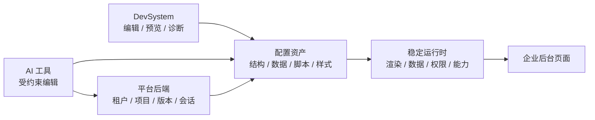

推荐对外一句话：

> SPARK View 是一个面向企业后台的配置化页面平台，用稳定运行时承载页面配置，用 DataSet 管理复杂业务数据，用受约束 AI 辅助生成、编辑和审计页面资产，并通过生产化后端支撑租户、版本、会话和观测链路。

## 20. 关键源码阅读路线

给新贡献者的推荐阅读顺序如下：

1. [README.md](../README.md)：理解项目定位、包结构和推荐 demo。
2. [src/main.ts](../src/main.ts)：理解前端启动、插件、租户路由和页面配置接入。
3. [packages/spark-app/src/start.ts](../packages/spark-app/src/start.ts)：理解应用启动抽象。
4. [packages/spark-app/src/router/dynamic.ts](../packages/spark-app/src/router/dynamic.ts)：理解导航树如何派生路由。
5. [packages/spark-page-config/src/loader/index.ts](../packages/spark-page-config/src/loader/index.ts)：理解页面四文件加载。
6. [packages/spark-component/src/page/renderer/SparkPageRenderer.vue](../packages/spark-component/src/page/renderer/SparkPageRenderer.vue)：理解页面运行时流水线。
7. [packages/spark-component/src/components/SparkComponentRenderer.vue](../packages/spark-component/src/components/SparkComponentRenderer.vue)：理解递归渲染器。
8. [packages/spark-component/src/core/spark-node-tree.ts](../packages/spark-component/src/core/spark-node-tree.ts)：理解节点树模型。
9. [packages/spark-data/src/dataset.ts](../packages/spark-data/src/dataset.ts)：理解数据空间协调器。
10. [packages/spark-data/src/core/data-view-key.ts](../packages/spark-data/src/core/data-view-key.ts)：理解组件到 DataView 的绑定协议。
11. [packages/spark-component/src/components/containers/data-views/view-data-source.ts](../packages/spark-component/src/components/containers/data-views/view-data-source.ts)：理解容器如何通过 `dataViewKey` 解析 DataView。
12. [packages/spark-component/src/components/containers/data-views/view-runtime-state.ts](../packages/spark-component/src/components/containers/data-views/view-runtime-state.ts)：理解 DataView 领域事件如何映射到 UI 状态。
13. [packages/spark-ai/src/core/internal/runtime/ai-runtime.ts](../packages/spark-ai/src/core/internal/runtime/ai-runtime.ts)：理解前端 AI Core 组合根和函数调用边界。
14. [packages/spark-ai/src/registrations/page-design/page-design-module.ts](../packages/spark-ai/src/registrations/page-design/page-design-module.ts)：理解 page-design 工具如何绑定页面编辑服务。
15. [src/services/ai-host/tool-loop.ts](../src/services/ai-host/tool-loop.ts)：理解 LLM tool call 如何在前端执行并 append 回后端。
16. [src/services/ai-host/transport.ts](../src/services/ai-host/transport.ts)：理解前端 AI transport、SSE envelope unwrap 和 protocol v3。
17. [src/views/app/dev-system/DevSystem.vue](../src/views/app/dev-system/DevSystem.vue)：理解设计时工作台。
18. [spark-ai-server/src/main/java/com/spark/ai/api/ApiEnvelopeAdvice.java](../spark-ai-server/src/main/java/com/spark/ai/api/ApiEnvelopeAdvice.java)：理解统一 API envelope。
19. [spark-ai-server/src/main/java/com/spark/ai/security/AccessGuardService.java](../spark-ai-server/src/main/java/com/spark/ai/security/AccessGuardService.java)：理解 tenant/project/user 访问校验。
20. [spark-ai-server/src/main/java/com/spark/ai/storage/PageConfigStorage.java](../spark-ai-server/src/main/java/com/spark/ai/storage/PageConfigStorage.java)：理解页面配置存储 SPI。
21. [spark-ai-server/src/main/java/com/spark/ai/service/AiSessionService.java](../spark-ai-server/src/main/java/com/spark/ai/service/AiSessionService.java)：理解后端 LLM 会话持久化和 SSE envelope。
22. [spark-ai-server/README.md](../spark-ai-server/README.md)：理解后端能力和 API。
23. [docs/ai/SPARK_AI_PACKAGE_USAGE_GUIDE.md](ai/SPARK_AI_PACKAGE_USAGE_GUIDE.md)：理解 AI Core、通用宿主与 AI 业务服务关系。

## 21. 结语

SPARK View 当前最有价值的地方，是它已经把配置驱动页面推进到了平台级问题：页面结构、数据模型、权限、导航、组件目录、AI 编辑、页面版本、调试链路和后端服务都在同一个方向上收束。

它的技术路线是克制的：让 AI 做结构化生成和局部编辑，让稳定 runtime 承担可验证执行，让 DataSet 承担复杂业务状态，让 DevSystem 承担设计时闭环。

下一阶段真正决定项目上限的，不是继续堆更多组件，而是把诊断、可观测性、设计器体验、AI 审计和生产化二期压实。只要这些闭环打通，SPARK View 就不只是一个“能渲染配置页面的 Vue 项目”，而会成为一个可以支撑团队长期维护复杂后台页面的平台内核。
