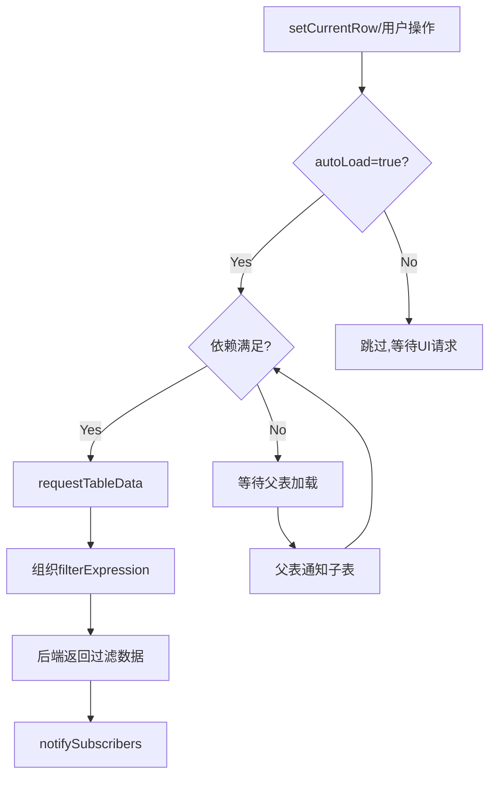
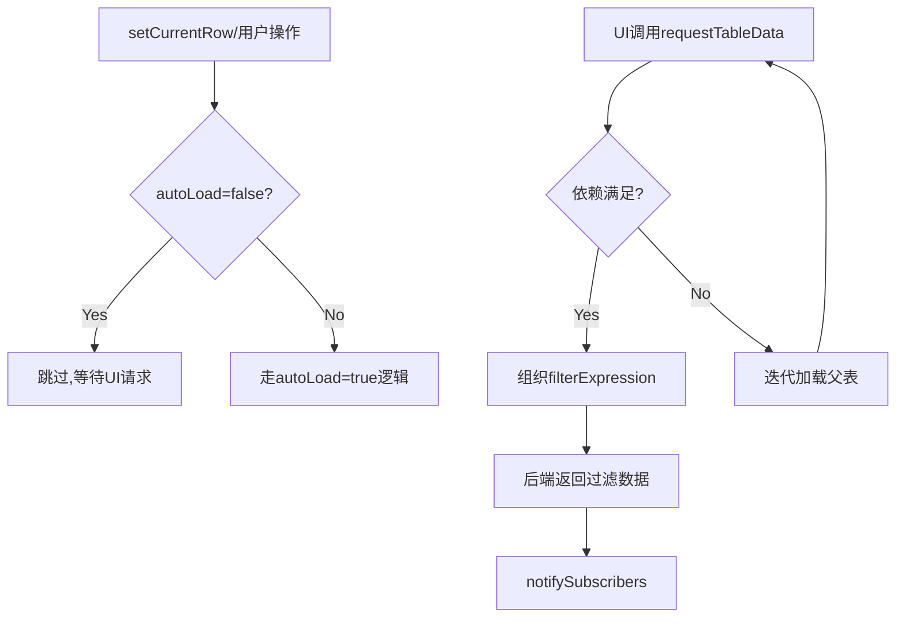
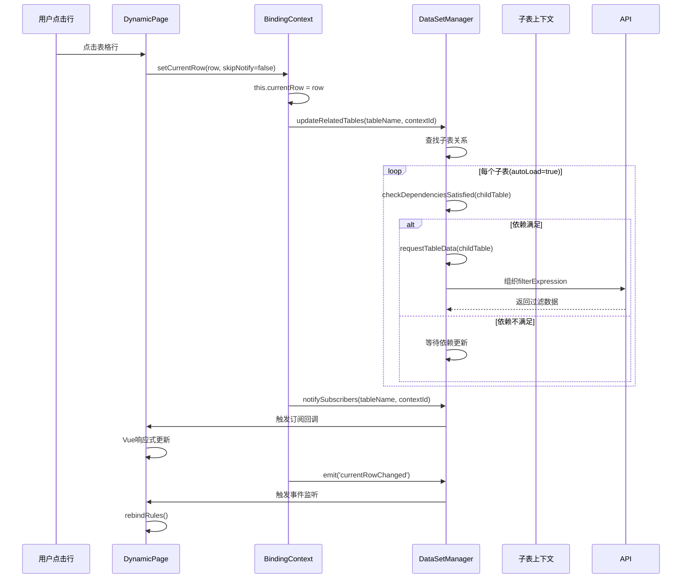
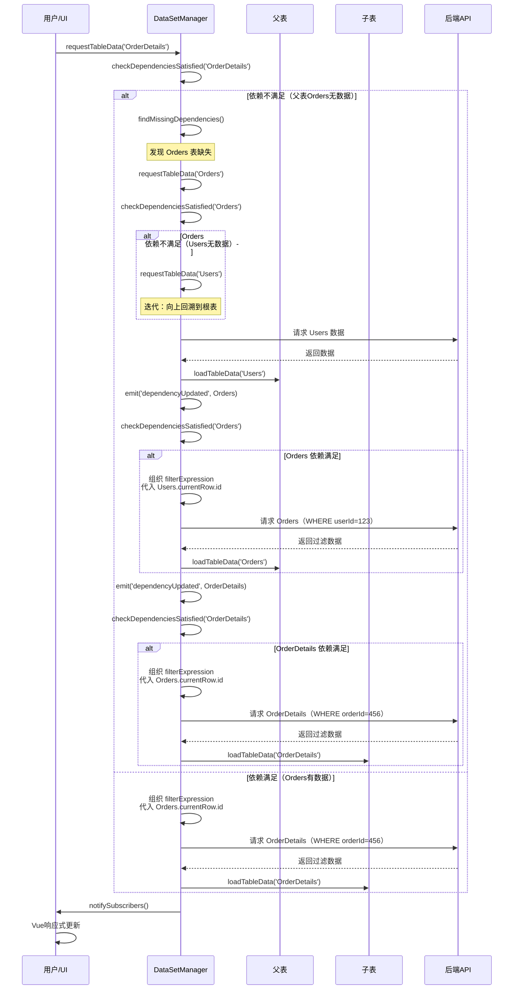
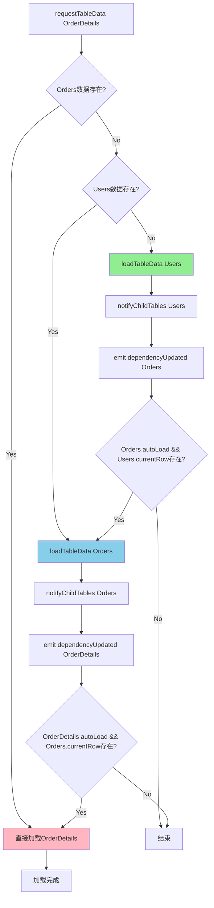
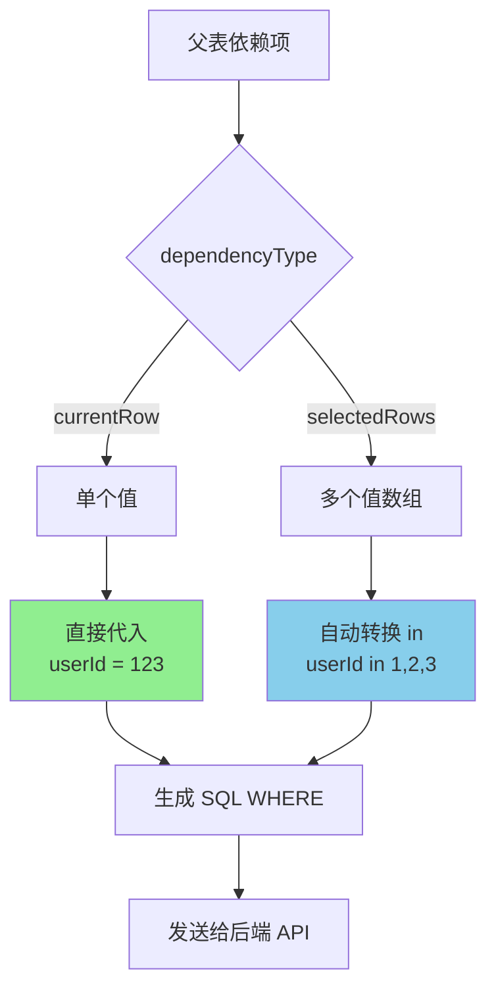

# 数据加载与通知流程梳理（完整版）

## 一、autoLoad 设计原则

### 1.1 autoLoad = true（主动请求模式）
- **触发条件**：所有依赖都满足时，自动请求数据
- **依赖检查**：currentRow/selectedRows/allRows 都必须有数据
- **递归处理**：依赖不满足时，通知父级加载（迭代）
- **配置是静态的**：依赖关系永远不变



### 1.2 autoLoad = false（被动等待模式）
- **不主动请求**：永远不自动加载数据
- **UI 驱动**：只有 UI 调用 `requestTableData()` 才加载
- **后端过滤**：每次请求都组织 filterExpression 传给后端



---

## 二、通知流程详解

### 2.1 用户交互触发（setCurrentRow/setSelectedRows）



**关键点**：
- `updateRelatedTables` → 处理子表过滤/加载
- `notifySubscribers` → 通知当前表 UI 更新（Vue 响应式）
- `emit` → 触发业务事件（需要 rebindRules 的场景）

---

### 2.2 数据请求触发（依赖驱动迭代加载）



**关键流程**：
1. **requestTableData(tableName)** → 检查依赖
2. **checkDependenciesSatisfied()** → 验证所有父表是否有数据
3. **依赖满足** → 组织 filterExpression（代入父表值）→ 向后端请求数据
4. **依赖不满足** → findMissingDependencies() → requestTableData(parentTable) → **迭代**
5. 父表加载完成 → **emit('dependencyUpdated')** → 子表重新检查依赖 → 递归触发

**与旧流程的区别**：
- ❌ 旧：加载完成后主动通知所有子表
- ✅ 新：子表接到通知后，**自己判断**依赖是否满足，决定是否加载

---

### 2.3 依赖迭代加载详解



**关键点**：
- 依赖链：OrderDetails → Orders → Users
- 从叶子节点向根节点回溯
- 根节点加载完成后，逐级通知子节点
- 每个子节点检查 autoLoad && 依赖满足 → 自动加载

---

## 三、FilterExpression 设计说明

### 3.1 核心原理

**filterExpression 用于构建后端查询条件，通过代入父表依赖项的值生成 WHERE 子句。**

**关键机制**：
1. **值代入**：将父上下文的数据值代入表达式中的占位符
2. **自动转换**：
   - **单行依赖**（currentRow）：直接代入 → `userId = 123`
   - **多行依赖**（selectedRows）：自动转换为 `in` → `userId in (1,2,3)`
3. **in 的语义**：`true in {关系表达式}` = 满足任一父表值即可



### 3.2 代入规则详解

**规则 1：currentRow（单行依赖）**
```json
{
  "dependencyType": "currentRow",
  "filterExpression": {
    "field": "userId",
    "op": "==",
    "value": "$.parentRow.id"
  }
}
```
**代入过程**：
- 父表 currentRow = `{ id: 123, name: "张三" }`
- 代入 `$.parentRow.id` → `123`
- 生成 SQL：`WHERE userId = 123`

**规则 2：selectedRows（多行依赖，自动转 in）**
```json
{
  "dependencyType": "selectedRows",
  "filterExpression": {
    "field": "userId",
    "op": "==",
    "value": "$.parentRow.id"
  }
}
```
**代入过程**：
- 父表 selectedRows = `[{ id: 1 }, { id: 2 }, { id: 3 }]`
- 提取值数组：`[1, 2, 3]`
- **自动转换**：`==` → `in`
- 生成 SQL：`WHERE userId in (1, 2, 3)`

**规则 3：多条件 AND/OR 组合**
```json
{
  "type": "or",
  "children": [
    { "field": "assignedTo", "op": "==", "value": "$.parentRow.id" },
    { "field": "createdBy", "op": "==", "value": "$.parentRow.id" }
  ]
}
```
**代入过程**：
- 父表 selectedRows = `[{ id: 1 }, { id: 2 }]`
- 代入每个条件：
  - `assignedTo == $.parentRow.id` → `assignedTo in (1, 2)`
  - `createdBy == $.parentRow.id` → `createdBy in (1, 2)`
- 生成 SQL：`WHERE (assignedTo in (1, 2) OR createdBy in (1, 2))`

**语义解释**：`true in {关系表达式}` = 子表行满足**任一**父表值即可显示

### 3.3 语法结构

**单一条件**：
```json
{
  "field": "userId",
  "op": "==",
  "value": "$.parentRow.id"
}
```

**逻辑组合（AND/OR）**：
```json
{
  "type": "and",
  "children": [
    { "field": "status", "op": "==", "value": "active" },
    { "field": "userId", "op": "==", "value": "$.parentRow.id" }
  ]
}
```

**引用父表字段**：
```json
{
  "field": "userId",
  "op": "==",
  "value": {
    "func": "FIELD",
    "args": ["id"]
  }
}
```4 完整示例

**示例 1：用户 → 订单（currentRow，单值代入）**
```json
{
  "parentTable": "Users",
  "childTable": "Orders",
  "dependencyType": "currentRow",
  "filterExpression": {
    "field": "userId",
    "op": "==",
    "value": "$.parentRow.id"
  }
}
```
**代入结果**：
- 用户选中行：`{ id: 5, name: "李四" }`
- 生成 SQL：`WHERE userId = 5`
- 生成 MongoDB：`{ userId: 5 }`

**示例 2：部门 → 员工（selectedRows，多值转 in）**
```json
{
  "parentTable": "Departments",
  "childTable": "Employees",
  "dependencyType": "selectedRows",
  "filterExpression": {
    "field": "deptId",
    "op": "==",
    "value": "$.parentRow.id"
  }
}
```
**代入结果**：
- 部门选中行：`[{ id: 1 }, { id: 3 }, { id: 5 }]`
- **自动转换**：`deptId == ...` → `deptId in (...)`
- 生成 SQL：`WHERE deptId in (1, 3, 5)`
- 生成 MongoDB：`{ deptId: { $in: [1, 3, 5] } }`

**示例 3：多关系 OR 组合（任务分配 OR 创建）**
```json
{
  "parentTable": "Users",
  "childTable": "Tasks",
  "dependencyType": "currentRow",
  "filterExpression": {
    "type": "or",
    "children": [
      { "field": "assignedTo", "op": "==", "value": "$.parentRow.id" },
      { "field": "createdBy", "op": "==", "value": "$.parentRow.id" }
    ]
  }
}
```
**代入结果**：
- 用户选中行：`{ id: 10 }`
- 生成 SQL：`WHERE (assignedTo = 10 OR createdBy = 10)`
- **语义**：显示"分配给我"或"我创建"的所有任务

**示例 4：复合条件（状态过滤 + 用户关联）**
```json
{
  "parentTable": "Users",
  "childTable": "Orders",
  "dependencyType": "selectedRows",
  "filterExpression": {
    "type": "and",
    "children": [
      { "field": "userId", "op": "==", "value": "$.parentRow.id" },
      { "field": "status", "op": "==", "value": "pending" }
    ]
  }
}
```
**代入结果**：
- 用户选中行：`[{ id: 1 }, { id: 2 }]`
- 生成 SQL：`WHERE (userId in (1, 2) AND status = 'pending')`
- **语义**：显示选中用户的待处理订单

### 3.5 后端 API 实现
解释：子表数据满足 `assignedTo = 父表id` **或** `createdBy = 父表id` 即可显示。

**场景 4：后端 API 集成（dataLoader 中构建查询）**
```typescript
// 在 script.js 的 __init__() 中
export function __init__() {
  const dataSet = $dataSet();
  
  // 后端查询模式的 dataLoader
  dataSet.dataLoader = async (tableName, context) => {
    const table = dataSet.getTable(tableName);
    
    // 1. 检查是否有父表依赖关系
    const relations = dataSet.dataSet.relations?.filter(
      rel => rel.childTable === tableName
    ) || [];
    
    if (relations.length === 0) {
      // 根表，直接查询
      return await fetch(`/api/${tableName}`).then(r => r.json());
    }
    
    // 2. 构建后端查询参数（多个关系用 OR 连接）
    const orConditions = relations.map(relation => {
      const parentContext = dataSet.getContext(
        relation.parentTable, 
        relation.parentContextId
      );
      
      const parentRows = dataSet.dataSet.getParentRows(
        parentContext, 
        relation.dependencyType
      );
      
      if (!parentRows || parentRows.length === 0) return null;
      
      // 构建 SQL WHERE 子句
      const { sql, params } = FilterExpressionParser.toSQL(
        relation.filterExpression,
        { parentRow: parentRows[0], parentRows }
### 3.5 后端 API 实现

**dataLoader 代入值并构建查询参数**：
```typescript
// 在 script.js 的 __init__() 中
export function __init__() {
  const dataSet = $dataSet();
  
  dataSet.dataLoader = async (tableName) => {
### 3.6 当前实现状态

| 功能 | 状态 | 实现位置 | 说明 |
|------|------|---------|------|
| **值代入机制** | ✅ 已实现 | `filterExpressionParser.ts` → `resolveValue()` | 支持 `$.parentRow.field` |
| **单值代入** | ✅ 已实现 | currentRow → 直接赋值 | `userId = 123` |
| **多值转 in** | ⚠️ 部分实现 | 需在 dataLoader 中转换 | 自动 `== → in` |
| **SQL 构建** | ✅ 已实现 | `toSQL()` | 参数化查询 |
| **MongoDB 构建** | ✅ 已实现 | `toMongoDB()` | `$in` 操作符 |
| **AND/OR 组合** | ✅ 已支持 | 递归处理 children | 嵌套逻辑 |
| **后端 API 集成** | ⏳ 需实现 | dataLoader 示例已提供 | 需用户自定义 |

**关键区别**：
- ❌ **客户端模式**（已废弃）：`toMemoryFilter()` 遍历 parentRows，对每个父行过滤子表（性能差，不安全）
- ✅ **后端模式**（正确实现）：代入值后发送 SQL 给后端，后端直接返回过滤结果

**优势对比**：
| 模式 | 数据传输 | 性能 | 适用场景 |
|------|---------|------|---------|
| 客户端 | 传输全量数据 | 较慢（需过滤） | 小数据量（<1000行） |
| 后端 | 只传输结果 | 快速 | 大数据量、分页查询`).then(r => r.json());
    }
    
    // 2. 处理每个关系，代入父表值
    const whereClauses = [];
    const allParams = [];
    
    for (const relation of relations) {
      const parentContext = dataSet.getContext(
        relation.parentTable, 
        relation.parentContextId || 'default'
      );
      
      // 获取父表依赖数据
      const parentRows = dataSet.dataSet.getParentRows(
        parentContext, 
        relation.dependencyType
      );
      
      if (!parentRows || parentRows.length === 0) {
        continue; // 父表无数据，跳过
      }
      
      // 3. 代入父表值到 filterExpression
      let substitutedExpr = relation.filterExpression;
      
      // 如果是多行依赖（selectedRows），自动转换为 in
      if (relation.dependencyType === 'selectedRows' && parentRows.length > 1) {
        substitutedExpr = convertToInOperator(
          relation.filterExpression, 
          parentRows
        );
      }
      
      // 4. 构建 SQL WHERE 子句
      const context = {
        parentRow: parentRows[0],  // 单值代入用第一个
        parentRows: parentRows      // 多值代入用数组
      };
      
      const { sql, params } = FilterExpressionParser.toSQL(
        substitutedExpr, 
        context
      );
      
      whereClauses.push(sql);
      allParams.push(...params);
    }
    
    if (whereClauses.length === 0) return [];
    
    // 5. 多个关系用 OR 连接（满足任一即可）
    const finalWhere = whereClauses.length > 1 
      ? `(${whereClauses.join(' OR ')})` 
      : whereClauses[0];
    
    // 6. 发送给后端
    const response = await fetch('/api/query', {
      method: 'POST',
      headers: { 'Content-Type': 'application/json' },
      body: JSON.stringify({
        table: tableName,
        where: finalWhere,
        params: allParams
      })
    });
    
    return await response.json();
  };
}

// 辅助函数：自动转换 == 为 in（多值）
function convertToInOperator(expr, parentRows) {
  if ('field' in expr && 'op' in expr && expr.op === '==') {
    // 提取所有父行的值
    const values = parentRows.map(row => {
      // 假设 value 是 $.parentRow.id
      const fieldPath = expr.value.replace('$.parentRow.', '');
      return row[fieldPath];
    });
    
    return {
      field: expr.field,
      op: 'in',
      value: values
    };
  }
  
  // 递归处理 and/or children
  if ('type' in expr && 'children' in expr) {
    return {
      ...expr,
      children: expr.children.map(child => 
        convertToInOperator(child, parentRows)
      )
    };
  }
  
  return expr;
}
```

**后端 API 接收参数**：
```typescript
// Express.js 示例
app.post('/api/query', async (req, res) => {
  const { table, where, params } = req.body;
  
  // 使用参数化查询防止 SQL 注入
  const sql = `SELECT * FROM ${table} WHERE ${where}`;
  const rows = await db.query(sql, params);
  
  res.json(rows);
});
```

### 3.63. 组合多个条件（OR 逻辑）
    const whereClauses = orConditions.map(c => c.sql);
    const allParams = orConditions.flatMap(c => c.params);
    const finalWhere = whereClauses.length > 1 
      ? `(${whereClauses.join(' OR ')})` 
      : whereClauses[0];
    
    // 4. 发送给后端
    const response = await fetch('/api/query', {
      method: 'POST',
      headers: { 'Content-Type': 'application/json' },
      body: JSON.stringify({
        table: tableName,
        where: finalWhere,
        params: allParams
      })
    });
    
    return await response.json();
  };
}
```

**关键点**：
- ✅ 支持多个父表关系（多个 filterExpression）
- ✅ 使用 OR 逻辑组合条件（满足任一父表即可）
- ✅ 自动提取父上下文数据（currentRow/selectedRows）
- ✅ 构建标准 SQL 参数化查询
- ✅ 后端接收 WHERE 子句 + 参数数组

### 3.4 当前实现状态

| 功能 | 状态 | 实现位置 |
|------|------|---------|
| 客户端内存过滤 | ❌ 已移除 | filterExpression 仅用于后端查询 |
| SQL 查询构建 | ✅ 已实现 | `filterExpressionParser.ts` → `toSQL()` |
| MongoDB 查询构建 | ✅ 已实现 | `filterExpressionParser.ts` → `toMongoDB()` |
| AND/OR 逻辑组合 | ✅ 已支持 | 所有解析器均支持 |
| 父表字段引用 | ✅ 已支持 | `$.parentRow.field` 或 `{func:'FIELD'}` |
| 后端 API 集成 | ⏳ 待扩展 | 需在 dataLoader 中构建查询参数 |

---

## 四、通知机制对比

### 3.1 updateRelatedTables vs notifyChildTables

| 方法 | 触发时机 | 作用范围 | 是否加载数据 |
|------|----------|----------|--------------|
| `updateRelatedTables` | setCurrentRow/setSelectedRows | 当前表的子表 | 根据 autoLoad 决定 |
| `notifyChildTables` | loadTableData 完成后 | 当前表的子表 | 触发事件，子表自己决定 |

**建议**：合并为一个方法，统一处理子表通知逻辑

---

### 3.2 notifySubscribers vs emit

| 机制 | 触发时机 | 接收者 | 用途 |
|------|----------|--------|------|
| `notifySubscribers` | 数据变化时 | DynamicPage 订阅回调 | Vue 响应式更新（el-table data 变化） |
| `emit('currentRowChanged')` | currentRow 变化后 | DynamicPage 事件监听 | 触发 rebindRules（更新 <pre> 标签） |
| `emit('loadSuccess')` | 数据加载完成 | 用户脚本监听器 | 显示提示消息 |

**关键区别**：
- `notifySubscribers` → 数据驱动 UI（自动）
- `emit` → 业务事件通知（手动监听）

---

## 四、当前存在的问题

### 4.1 通知路径冗余

**问题**：`updateRelatedTables` 和 `notifyChildTables` 职责重叠

**现状**：
```typescript
// 情况1: setCurrentRow 触发
setCurrentRow() 
  → updateRelatedTables()      // 通知子表
  → emit('dependencyUpdated')   // 触发事件，监听器决定是否加载

// 情况2: loadTableData 完成
loadTableData() 
  → notifyChildTables()         // 也通知子表
  → emit('dependencyUpdated')   // 触发事件，监听器决定是否加载
```

**建议**：统一为 `updateRelatedTables`，删除 `notifyChildTables`

---

### 4.2 依赖检查不完整

**问题**：`shouldAutoLoadDependentTable` 只检查单个依赖

**现状**：
```typescript
shouldAutoLoadDependentTable(tableName) {
  const relation = relations.find(rel => rel.childTable === tableName)
  // ❌ 只检查第一个 relation
}
```

**修复**：检查所有依赖是否满足
```typescript
checkDependenciesSatisfied(tableName) {
  return relations.every(relation => {
    // ✅ 检查每个依赖
  })
}
```

**已修复** ✅

---

### 4.3 rebindRules 多次触发

**问题**：订阅回调 + 事件监听都触发 rebindRules

**已修复** ✅：
- 移除订阅回调中的 rebindRules
- 只保留事件监听触发

---

## 五、优化后的流程（推荐实现）

### 5.1 统一请求入口：requestTableData

```typescript
requestTableData(tableName: string): void {
  // 1. 检查依赖
  const missingDeps = this.findMissingDependencies(tableName);
  
  if (missingDeps.length > 0) {
    // 2. 依赖不满足，递归加载父表
    console.log(`⏳ ${tableName} 等待依赖: ${missingDeps.join(', ')}`);
    missingDeps.forEach(parentTable => {
      this.requestTableData(parentTable); // 迭代
    });
    return;
  }
  
  // 3. 依赖满足，组织 filterExpression
  const relations = this.getParentRelations(tableName);
  const filterConditions = relations.map(relation => {
    const parentContext = this.getContext(
      relation.parentTable, 
      relation.parentContextId
    );
    const parentRows = this.dataSet.getParentRows(
      parentContext, 
      relation.dependencyType
    );
    
    // 代入父表值
    return {
      expression: relation.filterExpression,
      parentRows
    };
  });
  
  // 4. 调用 dataLoader（传递过滤条件）
  this._loadTableDataAsync(tableName, filterConditions);
}

private async _loadTableDataAsync(
  tableName: string, 
  filterConditions: any[]
): Promise<void> {
  try {
    // 5. 调用外部数据加载器（后端查询）
    const rows = await this.dataLoader(tableName, filterConditions);
    
    // 6. 更新表数据
    const table = this.getTable(tableName);
    table.rows.splice(0, table.rows.length, ...rows);
    table._originalRows = [...rows];
    
    // 7. 通知 UI 更新
    this.notifySubscribers(tableName);
    
    // 8. 触发子表依赖检查
    this.emit('dependencyUpdated', { tableName });
    this.emit('loadSuccess', { tableName, rowCount: rows.length });
    
  } catch (error) {
    this.emit('loadError', { tableName, error });
  }
}

// 辅助方法：查找缺失的依赖
private findMissingDependencies(tableName: string): string[] {
  const relations = this.getParentRelations(tableName);
  const missing: string[] = [];
  
  for (const relation of relations) {
    const parentTable = this.getTable(relation.parentTable);
    const parentContext = this.getContext(
      relation.parentTable, 
      relation.parentContextId
    );
    
    // 检查父表是否有数据
    if (!parentTable._originalRows || parentTable._originalRows.length === 0) {
      if (!missing.includes(relation.parentTable)) {
        missing.push(relation.parentTable);
      }
      continue;
    }
    
    // 检查依赖类型是否满足
    const parentRows = this.dataSet.getParentRows(
      parentContext, 
      relation.dependencyType
    );
    
    if (!parentRows || parentRows.length === 0) {
      console.warn(`依赖不满足: ${tableName} 需要 ${relation.parentTable}.${relation.dependencyType}`);
    }
  }
  
  return missing;
}
```

**关键改进**：
- ✅ 请求前先检查依赖，避免无效请求
- ✅ 自动向上递归加载缺失的父表
- ✅ 组织 filterExpression 并传递给 dataLoader
- ✅ 加载完成后触发 `dependencyUpdated` 事件
- ✅ 子表监听事件，自动触发加载

---

### 5.2 事件驱动的依赖通知（EventEmitter 机制详解）

**核心问题**：`emit('dependencyUpdated')` 是如何触发子表加载的？

**答案**：通过 **EventEmitter（事件发射器）** 模式实现解耦通信。

#### 5.2.1 EventEmitter 基础

```typescript
// DataSetManager 继承事件发射器
class DataSetManager extends EventEmitter {
  // 可以 emit（发射事件）和 on（监听事件）
}

// 基本用法
dataSet.on('eventName', callback);   // 注册监听器
dataSet.emit('eventName', data);     // 发射事件，触发所有 callback
```

**类比理解**：就像微信公众号
- `on()` = 关注公众号（订阅）
- `emit()` = 公众号发文章（发布）
- 发文章时，所有关注者自动收到推送（callback 自动执行）

#### 5.2.2 完整代码示例

```typescript
// ===== 步骤 1：初始化时注册监听器 =====
function setupDependencyListeners(manager: DataSetManager) {
  const relations = dataSet.dataSet.relations || [];
  
  relations.forEach(relation => {
    if (relation.autoLoad) {
      // 🔔 注册监听器：监听父表的更新事件
      dataSet.on('dependencyUpdated', (eventData) => {
        // 👆 这是回调函数，当 emit 时会被自动调用
        
        // 1. 检查事件是否来自我的父表
        if (eventData.tableName === relation.parentTable) {
          console.log(`📢 ${relation.childTable} 收到父表 ${relation.parentTable} 的通知`);
          
          // 2. 重新检查依赖
          if (dataSet.checkDependenciesSatisfied(relation.childTable)) {
            console.log(`✅ ${relation.childTable} 依赖满足，开始加载`);
            dataSet.requestTableData(relation.childTable);
          } else {
            console.log(`⏳ ${relation.childTable} 依赖未满足，继续等待`);
          }
        }
      });
    }
  });
}

// DynamicPage.vue 中调用
onMounted(() => {
  setupDependencyListeners(dataSetManager);  // 只执行一次
});

// ===== 步骤 2：父表加载完成时发射事件 =====
async function _loadTableDataAsync(tableName: string) {
  try {
    const rows = await dataLoader(tableName, filterConditions);
    table.rows.splice(0, table.rows.length, ...rows);
    table._originalRows = [...rows];
    
    this.notifySubscribers(tableName);
    
    // 🔥 发射事件：通知所有监听器"表已更新"
    this.emit('dependencyUpdated', { tableName });
    //         ↑                     ↑
    //    事件名称                事件数据
    //
    // 这会触发所有监听 'dependencyUpdated' 的回调函数
    
    this.emit('loadSuccess', { tableName, rowCount: rows.length });
  } catch (error) {
    this.emit('loadError', { tableName, error });
  }
}
```

#### 5.2.3 三级依赖链完整流程

**配置**：
```json
{
  "relations": [
    {
      "parentTable": "Users",
      "childTable": "Orders",
      "dependencyType": "currentRow",
      "autoLoad": true
    },
    {
      "parentTable": "Orders",
      "childTable": "OrderDetails",
      "dependencyType": "currentRow",
      "autoLoad": true
    }
  ]
}
```

**执行流程**：

```typescript
// ===== 时间线 0ms：初始化 =====
setupDependencyListeners(manager);

// 监听器 A 被注册（Orders 监听 Users）
dataSet.on('dependencyUpdated', (eventData) => {
  if (eventData.tableName === 'Users') {
    if (checkDependenciesSatisfied('Orders')) {
      requestTableData('Orders');
    }
  }
});

// 监听器 B 被注册（OrderDetails 监听 Orders）
dataSet.on('dependencyUpdated', (eventData) => {
  if (eventData.tableName === 'Orders') {
    if (checkDependenciesSatisfied('OrderDetails')) {
      requestTableData('OrderDetails');
    }
  }
});

// ===== 时间线 1ms：用户请求 =====
dataSet.requestTableData('OrderDetails');
// → 检查依赖：缺少 Orders → requestTableData('Orders')
// → 检查依赖：缺少 Users → requestTableData('Users')
// → 检查依赖：无依赖 ✅ → 调用 dataLoader('Users')

// ===== 时间线 200ms：Users 加载完成 =====
_loadTableDataAsync('Users') {
  // ... 加载数据
  
  // 🔥 发射事件
  this.emit('dependencyUpdated', { tableName: 'Users' });
  //                              ↓
  //                    触发所有监听 'dependencyUpdated' 的回调
}

// ===== 时间线 201ms：监听器 A 自动执行 =====
// 回调函数自动被调用，传入 eventData = { tableName: 'Users' }
function callback_A(eventData) {
  if (eventData.tableName === 'Users') {  // ✅ 条件满足
    console.log('📢 Orders 收到 Users 的通知');
    
    if (checkDependenciesSatisfied('Orders')) {
      // Users 已有数据 ✅
      console.log('✅ Orders 依赖满足，开始加载');
      requestTableData('Orders');
      // → 组织 filterExpression（userId = Users.currentRow.id）
      // → 调用 dataLoader('Orders', { where: 'userId=123' })
    }
  }
}

// ===== 时间线 400ms：Orders 加载完成 =====
_loadTableDataAsync('Orders') {
  // ... 加载数据
  
  // 🔥 再次发射事件
  this.emit('dependencyUpdated', { tableName: 'Orders' });
}

// ===== 时间线 401ms：监听器 B 自动执行 =====
function callback_B(eventData) {
  if (eventData.tableName === 'Orders') {  // ✅ 条件满足
    console.log('📢 OrderDetails 收到 Orders 的通知');
    
    if (checkDependenciesSatisfied('OrderDetails')) {
      // Orders 已有数据 ✅
      console.log('✅ OrderDetails 依赖满足，开始加载');
      requestTableData('OrderDetails');
      // → 组织 filterExpression（orderId = Orders.currentRow.id）
      // → 调用 dataLoader('OrderDetails', { where: 'orderId=456' })
    }
  }
}

// ===== 时间线 600ms：OrderDetails 加载完成 =====
_loadTableDataAsync('OrderDetails') {
  // ... 加载数据
  
  this.emit('dependencyUpdated', { tableName: 'OrderDetails' });
  // 没有表依赖 OrderDetails，所以没有监听器响应
  
  this.notifySubscribers('OrderDetails');
  // UI 更新
}
```

#### 5.2.4 为什么需要事件机制？

**❌ 不用事件（硬编码方式）**：
```typescript
function loadTableData(tableName: string) {
  // ... 加载数据
  
  // 硬编码：必须知道谁依赖我
  if (tableName === 'Users') {
    if (checkDependencies('Orders')) {
      requestTableData('Orders');  // 直接调用
    }
  }
  if (tableName === 'Orders') {
    if (checkDependencies('OrderDetails')) {
      requestTableData('OrderDetails');  // 直接调用
    }
  }
}
```
**问题**：
- 耦合严重，每次添加关系都要修改 loadTableData 代码
- 不易维护，关系多了代码会很乱

**✅ 使用事件（解耦方式）**：
```typescript
function loadTableData(tableName: string) {
  // ... 加载数据
  
  // 只发事件，不关心谁在监听
  this.emit('dependencyUpdated', { tableName });
}

// 监听器在初始化时统一注册（基于配置）
relations.forEach(rel => {
  dataSet.on('dependencyUpdated', (data) => {
    if (data.tableName === rel.parentTable) {
      // 子表自己决定是否加载
      if (checkDependencies(rel.childTable)) {
        requestTableData(rel.childTable);
      }
    }
  });
});
```
**优势**：
- ✅ 完全解耦：父表不需要知道子表
- ✅ 配置驱动：添加关系只需改 JSON 配置
- ✅ 易于扩展：新增表不需要改核心代码

#### 5.2.5 事件流转可视化

```
初始化阶段（只执行一次）
┌─────────────────────────────────┐
│ setupDependencyListeners()      │
│                                 │
│ for relation in relations:      │
│   dataSet.on('dependencyUpdated'│
│     callback_监听父表更新)       │
└─────────────────────────────────┘
         │
         │ 监听器已注册，等待事件
         ↓
运行时阶段（多次触发）
┌─────────────────────────────────┐
│ Users 加载完成                   │
│   ↓                             │
│ emit('dependencyUpdated',       │
│      { tableName: 'Users' })    │  ← 发射事件
└─────────────────────────────────┘
         │
         │ 自动触发所有监听器
         ↓
┌─────────────────────────────────┐
│ 监听器 A（Orders）被调用         │
│   ↓                             │
│ if tableName === 'Users': ✅    │
│   checkDependencies('Orders')   │
│     ↓                           │
│   requestTableData('Orders')    │  ← 触发子表加载
└─────────────────────────────────┘
         │
         │ Orders 加载完成
         ↓
┌─────────────────────────────────┐
│ emit('dependencyUpdated',       │
│      { tableName: 'Orders' })   │  ← 再次发射事件
└─────────────────────────────────┘
         │
         │ 自动触发所有监听器
         ↓
┌─────────────────────────────────┐
│ 监听器 B（OrderDetails）被调用   │
│   ↓                             │
│ if tableName === 'Orders': ✅   │
│   checkDependencies('OrderDetails')│
│     ↓                           │
│   requestTableData('OrderDetails')│ ← 触发孙表加载
└─────────────────────────────────┘
```

**总结**：
- **注册监听器**：初始化时一次性完成（setupDependencyListeners）
- **发射事件**：每次表加载完成时（emit）
- **监听器触发**：自动执行，无需手动调用
- **检查依赖**：监听器内部逻辑，决定是否加载子表

---

### 5.3 严格 autoLoad 控制

```typescript
// setCurrentRow 触发的更新逻辑
setCurrentRow(row: DataRow | null, skipNotify = false): void {
  this.currentRow = row;
  
  if (!skipNotify && this.manager) {
    // 1. 通知 UI 更新
    this.dataSet.notifySubscribers(this._hostTable, this._contextId);
    
    // 2. 触发依赖更新事件（不是直接加载子表）
    this.dataSet.emit('dependencyUpdated', { 
      tableName: this._hostTable,
      contextId: this._contextId,
      trigger: 'currentRowChanged'
    });
    
    // 3. 触发业务事件
    this.dataSet.emit('currentRowChanged', {
      tableName: this._hostTable,
      contextId: this._contextId,
      currentRow: row
    });
  }
}

// 监听器根据 autoLoad 决定是否加载
on('dependencyUpdated', ({ tableName }) => {
  const childRelations = relations.filter(
    rel => rel.parentTable === tableName && rel.autoLoad
  );
  
  childRelations.forEach(relation => {
    if (checkDependenciesSatisfied(relation.childTable)) {
      requestTableData(relation.childTable);
    }
  });
});
```

**autoLoad = false 的处理**：
```typescript
// 不注册自动监听，只有 UI 手动调用才加载
export function handleLoadOrders() {
  const dataSet = $dataSet();
  dataSet.requestTableData('Orders'); // 手动触发
}
```

**已实现** ✅

---

## 七、当前实现分析与问题

### 7.1 当前 dependencyUpdated 实现

**当前代码路径**：`src/utils/dataSetManager.ts`

```typescript
// 1. loadTableData 加载完成后调用
private async loadTableData(tableName: string) {
  try {
    const rows = await this.dataLoader(tableName);
    table.rows.splice(0, table.rows.length, ...rows);
    table._originalRows = [...rows];
    
    // ❌ 错误（已移除）：在客户端应用过滤规则
    // filterExpression 应该在 requestTableData 中传给 dataLoader
    // 后端直接返回过滤后的数据，不需要客户端再过滤
    const parentRelations = this.dataSet.relations?.filter(
      rel => rel.childTable === tableName
    ) || [];
    
    if (parentRelations.length > 0) {
      console.log(`🔄 检查父表依赖关系`);
      parentRelations.forEach(relation => {
        // ❌ 旧代码：this.applyRelation(relation) - 客户端过滤（已删除）
        // ✅ 新设计：filterExpression 传给 dataLoader，后端过滤
      });
    }
    
    // 通知 UI 订阅者
    this.notifySubscribers(tableName);
    
    // 🔥 通知子表：父表数据已更新
    this.notifyChildTables(tableName);
  } catch (error) {
    console.error(`❌ 加载数据失败: ${tableName}`, error);
  }
}

// 2. applyRelation - ❌ 错误的客户端过滤逻辑（已删除）
// applyRelation(relation: DataRelation): void {
//   const parentRows = this.getParentRows(parentContext, relation.dependencyType);
  
  if (!parentRows || parentRows.length === 0) {
    childContext.rows.splice(0);  // 清空
    return;
  }
  
  // ❌ 错误：在客户端过滤已加载的数据
  const sourceRows = childContext._originalRows || [];
  const filteredRows = this.filterChildRows(
    sourceRows,
    relation.filterExpression,
    parentRows,
    parentContext
  );
  
  childContext.rows.splice(0, childContext.rows.length, ...filteredRows);
  console.log(`✅ 过滤完成: ${filteredRows.length}/${sourceRows.length} 条`);
}

// 3. notifyChildTables
private notifyChildTables(parentTableName: string): void {
  const childRelations = this.dataSet.relations?.filter(
    rel => rel.parentTable === parentTableName
  );
  
  childRelations.forEach(relation => {
    console.log(`📢 通知子表 ${relation.childTable}: 父表 ${parentTableName} 数据已更新`);
    this.notifyDependencyUpdated(relation.childTable);
  });
}

// 4. notifyDependencyUpdated - 发射事件并自动加载
private notifyDependencyUpdated(tableName: string): void {
  console.log(`📢 通知 ${tableName}: 依赖数据已更新`);
  
  this.emit('dependencyUpdated', { tableName });
  
  // 自动判断是否应该加载
  const shouldAutoLoad = this.shouldAutoLoadDependentTable(tableName);
  const hasSubscribers = Array.from(this.contextSubscribers.keys())
    .some(key => key.startsWith(`${tableName}.`));
  
  if (shouldAutoLoad && hasSubscribers) {
    console.log(`🎯 ${tableName} 依赖条件满足，自动加载数据`);
    this.loadTableData(tableName);
  }
}
```

### 7.2 当前实现的问题

**问题 1：在客户端应用过滤规则（严重错误）**

```typescript
// ❌ 旧实现（已废弃）：加载全量数据后在客户端过滤
// loadTableData(tableName) {
//   const rows = await dataLoader(tableName);  // 加载全量数据
//   table.rows = rows;
//   table._originalRows = rows;
//   
//   // 错误：在客户端过滤
//   parentRelations.forEach(relation => {
//     this.applyRelation(relation);  // 客户端过滤
//   });
// }
// 
// applyRelation(relation) {
//   // 错误：使用 filterChildRows 在客户端过滤
//   const filteredRows = this.filterChildRows(
//     childContext._originalRows,
//     relation.filterExpression,
//     parentRows,
//     parentContext
//   );
//   childContext.rows = filteredRows;
// }
```

**问题**：
- ❌ 违反设计原则：filterExpression 是用来构建**后端查询参数**的
- ❌ 性能问题：传输全量数据到客户端再过滤
- ❌ 数据安全：客户端能看到不应该看到的数据
- ❌ 内存浪费：_originalRows 存储全量，rows 存储过滤后的

**正确设计**：
```typescript
// ✅ 应该在请求时就传递过滤条件给后端
requestTableData(tableName) {
  // 1. 检查依赖
  const missingDeps = findMissingDependencies(tableName);
  if (missingDeps.length > 0) {
    // 先加载父表
    return;
  }
  
  // 2. 组织 filterExpression（代入父表值）
  const relations = getParentRelations(tableName);
  const whereClauses = relations.map(relation => {
    const parentRows = getParentRows(
      relation.parentTable, 
      relation.dependencyType
    );
    
    // 构建 SQL WHERE 子句
    const { sql, params } = FilterExpressionParser.toSQL(
      relation.filterExpression,
      { parentRow: parentRows[0], parentRows }
    );
    
    return { sql, params };
  });
  
  // 3. 调用 dataLoader，传递查询参数
  const rows = await dataLoader(tableName, {
    where: combineWhereClauses(whereClauses),  // 后端过滤
    params: combineParams(whereClauses)
  });
  
  // 4. 后端返回的已经是过滤后的数据
  table.rows = rows;  // 直接使用，无需再过滤
}
```

**问题 2：事件发射和加载逻辑耦合**
```typescript
// ❌ 当前实现
private notifyDependencyUpdated(tableName: string): void {
  this.emit('dependencyUpdated', { tableName });
  
  // 既发射事件，又自动执行加载
  if (shouldAutoLoad && hasSubscribers) {
    this.loadTableData(tableName);  // 硬编码逻辑
  }
}
```

**问题**：
- 违反事件驱动原则：发射者不应该执行业务逻辑
- 不够灵活：无法通过配置控制加载行为

**问题 3：缺少外部监听器注册**
当前没有在 DynamicPage.vue 中注册监听器，逻辑直接写在 DataSetManager 内部。

**问题 4：缺少 autoLoad 配置检查**
`shouldAutoLoadDependentTable` 没有检查 `relation.autoLoad`。

---

### 7.3 推荐的修改方案（后端过滤 + 事件驱动）

**问题 1：直接在 notifyDependencyUpdated 内部自动加载**
```typescript
// ❌ 当前实现
private notifyDependencyUpdated(tableName: string): void {
  this.emit('dependencyUpdated', { tableName });
  
  // 直接在这里判断并加载
  if (shouldAutoLoad && hasSubscribers) {
    this.loadTableData(tableName);  // ← 硬编码逻辑
  }
}
```

**问题**：
- 耦合严重：事件发射和加载逻辑混在一起
- 不够灵活：无法通过配置控制加载行为
- 违反事件驱动原则：事件发射者不应该执行业务逻辑

**问题 2：缺少外部监听器注册**
当前代码没有在 DynamicPage.vue 中注册监听器，而是直接在 DataSetManager 内部处理。

**问题 3：缺少 autoLoad 配置检查**
`shouldAutoLoadDependentTable` 没有检查 `relation.autoLoad` 配置。

### 7.3 推荐的修改方案（后端过滤 + 事件驱动）

**核心原则**：
1. ✅ filterExpression 只用于构建后端查询参数
2. ✅ 后端返回的就是过滤后的数据，无需客户端再过滤
3. ✅ 事件驱动：监听器决定是否加载
4. ❌ 删除 applyRelation、applyRelationsForTable 等客户端过滤逻辑

#### 修改 1：requestTableData 传递过滤条件给 dataLoader

```typescript
// DataSetManager.ts
async requestTableData(tableName: string): Promise<void> {
  // 1. 检查依赖
  const missingDeps = this.findMissingDependencies(tableName);
  
  if (missingDeps.length > 0) {
    console.log(`⏳ ${tableName} 等待依赖: ${missingDeps.join(', ')}`);
    missingDeps.forEach(parentTable => {
      this.requestTableData(parentTable);  // 迭代
    });
    return;
  }
  
  // 2. 组织 filterExpression（代入父表值）
  const relations = this.dataSet.relations?.filter(
    rel => rel.childTable === tableName
  ) || [];
  
  let queryOptions: any = undefined;
  
  if (relations.length > 0) {
    const whereClauses: any[] = [];
    const allParams: any[] = [];
    
    for (const relation of relations) {
      const parentContext = this.getContext(
        relation.parentTable, 
        relation.parentContextId
      );
      const parentRows = this.dataSet.getParentRows(
        parentContext, 
        relation.dependencyType
      );
      
      if (!parentRows || parentRows.length === 0) continue;
      
      // 代入父表值
      let expr = relation.filterExpression;
      
      // 多值自动转 in
      if (relation.dependencyType === 'selectedRows' && parentRows.length > 1) {
        expr = this.convertToInOperator(expr, parentRows);
      }
      
      // 构建 SQL WHERE 子句
      const { sql, params } = FilterExpressionParser.toSQL(
        expr, 
        { parentRow: parentRows[0], parentRows }
      );
      
      whereClauses.push(sql);
      allParams.push(...params);
    }
    
    // 3. 组合查询参数
    if (whereClauses.length > 0) {
      queryOptions = {
        where: whereClauses.length > 1 
          ? `(${whereClauses.join(' OR ')})` 
          : whereClauses[0],
        params: allParams
      };
    }
  }
  
  // 4. 调用 dataLoader，传递查询参数给后端
  const rows = await this.dataLoader(tableName, queryOptions);
  
  // 5. 后端返回的就是过滤后的数据，直接使用
  this._loadTableDataDirectly(tableName, rows);
}

// 辅助方法：多值转 in 操作符
private convertToInOperator(
  expr: FilterExpression, 
  parentRows: DataRow[]
): FilterExpression {
  if ('field' in expr && 'op' in expr && expr.op === '==') {
    const values = parentRows.map(row => {
      const fieldPath = (expr.value as string).replace('$.parentRow.', '');
      return row[fieldPath];
    });
    
    return {
      field: expr.field,
      op: 'in',
      value: values
    };
  }
  
  // 递归处理 and/or
  if ('type' in expr && 'children' in expr) {
    return {
      ...expr,
      children: expr.children.map(child => 
        this.convertToInOperator(child, parentRows)
      )
    };
  }
  
  return expr;
}
```

#### 修改 2：_loadTableDataDirectly（直接加载，无过滤）

```typescript
// DataSetManager.ts
private _loadTableDataDirectly(tableName: string, rows: DataRow[]): void {
  const table = this.getTable(tableName);
  if (!table) return;
  
  // 直接更新数据（后端已过滤）
  table.rows.splice(0, table.rows.length, ...rows);
  
  // 不再需要 _originalRows（后端已过滤）
  // 如果需要缓存，也是缓存过滤后的结果
  table._originalRows = [...rows];
  
  console.log(`✅ ${tableName} 加载完成: ${rows.length} 行（后端已过滤）`);
  
  // 通知 UI 更新
  this.notifySubscribers(tableName);
  
  // 🔥 触发依赖更新事件
  this.emit('dependencyUpdated', { tableName });
  this.emit('loadSuccess', { tableName, rowCount: rows.length });
}
```

#### 修改 3：删除客户端过滤逻辑

```typescript
// ❌ 删除这些方法
// private applyRelation(relation: DataRelation): void { ... }
// private applyRelationsForTable(tableName: string): void { ... }
// private filterChildRows(...): DataRow[] { ... }

// 这些都是客户端过滤逻辑，不再需要
```

#### 修改 4：notifyDependencyUpdated 只发射事件

```typescript
// DataSetManager.ts
private notifyDependencyUpdated(tableName: string): void {
  console.log(`📢 发射事件: dependencyUpdated for ${tableName}`);
  this.emit('dependencyUpdated', { tableName });
  
  // ❌ 删除自动加载逻辑
  // 让监听器决定是否加载
}

// notifyChildTables 保持不变
private notifyChildTables(parentTableName: string): void {
  const childRelations = this.dataSet.relations?.filter(
    rel => rel.parentTable === parentTableName
  );
  
  childRelations.forEach(relation => {
    console.log(`📢 通知子表 ${relation.childTable}`);
    this.notifyDependencyUpdated(relation.childTable);
  });
}
```

#### 修改 5：添加公开方法

```typescript
// DataSetManager.ts
public checkDependenciesSatisfied(tableName: string): boolean {
  const relations = this.dataSet.relations?.filter(
    rel => rel.childTable === tableName
  ) || [];
  
  return relations.every(relation => {
    const parentTable = this.getTable(relation.parentTable);
    
    // 父表必须已加载数据
    if (!parentTable._originalRows || parentTable._originalRows.length === 0) {
      return false;
    }
    
    // 检查依赖类型
    const parentContext = this.getContext(
      relation.parentTable, 
      relation.parentContextId
    );
    
    if (relation.dependencyType === 'currentRow') {
      return parentContext.currentRow !== null;
    } else if (relation.dependencyType === 'selectedRows') {
      return (parentContext.selectedRows?.length || 0) > 0;
    } else if (relation.dependencyType === 'allRows') {
      return parentTable.rows.length > 0;
    }
    
    return true;
  });
}
```

#### 修改 6：DynamicPage.vue 注册监听器

```typescript
// DynamicPage.vue
function setupDependencyListeners(manager: DataSetManager) {
  const relations = dataSet.dataSet.relations || [];
  
  relations.forEach(relation => {
    if (relation.autoLoad) {  // ✅ 检查 autoLoad
      dataSet.on('dependencyUpdated', (eventData) => {
        if (eventData.tableName === relation.parentTable) {
          console.log(`📢 ${relation.childTable} 收到 ${relation.parentTable} 的通知`);
          
          if (dataSet.checkDependenciesSatisfied(relation.childTable)) {
            console.log(`✅ ${relation.childTable} 依赖满足，开始加载`);
            dataSet.requestTableData(relation.childTable);
          } else {
            console.log(`⏳ ${relation.childTable} 依赖未满足，继续等待`);
          }
        }
      });
    }
  });
}

// initDataSetManager 中调用
function initDataSetManager(pageData: PageData) {
  const dataSet = new DataSetManager(pageData.dataset, backendDataLoader);
  setupDependencyListeners(manager);  // ← 注册监听器
  return manager;
}
```

#### 修改 7：dataLoader 实现（后端查询模式）

```typescript
// script.js
async function backendDataLoader(tableName: string, queryOptions?: any) {
  if (!queryOptions) {
    // 根表，无过滤条件
    const response = await fetch(`/api/${tableName}`);
    return await response.json();
  }
  
  // 子表，传递 WHERE 子句给后端
  const response = await fetch('/api/query', {
    method: 'POST',
    headers: { 'Content-Type': 'application/json' },
    body: JSON.stringify({
      table: tableName,
      where: queryOptions.where,
      params: queryOptions.params
    })
  });
  
  return await response.json();
}

export function __init__() {
  const dataSet = $dataSet();
  dataSet.dataLoader = backendDataLoader;  // ← 使用后端查询模式
}
```

**优势总结**：
- ✅ **性能最优**：后端过滤，只传输需要的数据
- ✅ **安全性高**：客户端不会接收到不应该看到的数据
- ✅ **内存节省**：不需要存储全量 _originalRows
- ✅ **完全解耦**：事件驱动，配置化
- ✅ **符合设计原则**：filterExpression 用于后端查询
- ✅ **代码简洁**：删除了大量客户端过滤逻辑

---

### 7.4 实施步骤

```typescript
// ===== DataSetManager 改动 =====

// 1. notifyDependencyUpdated 只发射事件，不自动加载
private notifyDependencyUpdated(tableName: string): void {
  console.log(`📢 发射事件: dependencyUpdated for ${tableName}`);
  this.emit('dependencyUpdated', { tableName });
  // ❌ 删除自动加载逻辑
}

// 2. 提供公开方法：检查依赖是否满足
public checkDependenciesSatisfied(tableName: string): boolean {
  const relations = this.dataSet.relations?.filter(
    rel => rel.childTable === tableName
  ) || [];
  
  return relations.every(relation => {
    const parentTable = this.getTable(relation.parentTable);
    
    // 父表必须已加载数据
    if (!parentTable._originalRows || parentTable._originalRows.length === 0) {
      return false;
    }
    
    // 检查依赖类型
    const parentContext = this.getContext(
      relation.parentTable, 
      relation.parentContextId
    );
    
    if (relation.dependencyType === 'currentRow') {
      return parentContext.currentRow !== null;
    } else if (relation.dependencyType === 'selectedRows') {
      return (parentContext.selectedRows?.length || 0) > 0;
    } else if (relation.dependencyType === 'allRows') {
      return parentTable.rows.length > 0;
    }
    
    return true;
  });
}

// ===== DynamicPage.vue 改动 =====

// 3. 注册事件监听器
function setupDependencyListeners(manager: DataSetManager) {
  const relations = dataSet.dataSet.relations || [];
  
  relations.forEach(relation => {
    if (relation.autoLoad) {  // ✅ 检查 autoLoad 配置
      // 注册监听器
      dataSet.on('dependencyUpdated', (eventData) => {
        // 检查事件是否来自父表
        if (eventData.tableName === relation.parentTable) {
          console.log(`📢 ${relation.childTable} 收到 ${relation.parentTable} 的通知`);
          
          // 检查依赖是否满足
          if (dataSet.checkDependenciesSatisfied(relation.childTable)) {
            console.log(`✅ ${relation.childTable} 依赖满足，开始加载`);
            dataSet.requestTableData(relation.childTable);
          } else {
            console.log(`⏳ ${relation.childTable} 依赖未满足，继续等待`);
          }
        }
      });
    }
  });
}

// 在 initDataSetManager() 中调用
function initDataSetManager(pageData) {
  const dataSet = new DataSetManager(pageData.dataset, defaultDataLoader);
  setupDependencyListeners(manager);  // ← 注册监听器
  return manager;
}
```

**优势**：
- ✅ 完全解耦：事件发射和加载逻辑分离
- ✅ 配置驱动：基于 `autoLoad` 决定是否加载
- ✅ 易于测试：可以 mock 监听器
- ✅ 符合事件驱动原则

#### 方案 B：保持现状但修复问题

```typescript
// 只修改 shouldAutoLoadDependentTable，添加 autoLoad 检查
private shouldAutoLoadDependentTable(tableName: string): boolean {
  const relations = this.dataSet.relations?.filter(
    rel => rel.childTable === tableName && rel.autoLoad  // ← 添加 autoLoad 检查
  ) || [];
  
  for (const relation of relations) {
    const parentContext = this.getContext(
      relation.parentTable, 
      relation.parentContextId
    );
    
    if (relation.dependencyType === 'currentRow') {
      if (parentContext.currentRow) return true;
    } else if (relation.dependencyType === 'selectedRows') {
      if (parentContext.selectedRows?.length > 0) return true;
    } else if (relation.dependencyType === 'allRows') {
      if (parentContext.rows?.length > 0) return true;
    }
  }
  
  return false;
}
```

**优势**：
- ✅ 改动最小
- ⚠️ 仍然耦合（不推荐长期使用）

### 7.4 推荐实施步骤

**第 1 步：添加 checkDependenciesSatisfied 公开方法**
```typescript
// DataSetManager.ts
public checkDependenciesSatisfied(tableName: string): boolean {
  // ... 实现见方案 A
}
```

**第 2 步：修改 notifyDependencyUpdated（只发事件）**
```typescript
private notifyDependencyUpdated(tableName: string): void {
  console.log(`📢 发射事件: dependencyUpdated for ${tableName}`);
  this.emit('dependencyUpdated', { tableName });
  // 移除自动加载逻辑
}
```

**第 3 步：在 DynamicPage.vue 注册监听器**
```typescript
function setupDependencyListeners(manager: DataSetManager) {
  // ... 实现见方案 A
}

// 在 initDataSetManager 中调用
const dataSet = new DataSetManager(pageData.dataset, defaultDataLoader);
setupDependencyListeners(manager);
```

**第 4 步：测试验证**
- 测试三级依赖链：Users → Orders → OrderDetails
- 测试 autoLoad=false 场景
- 测试依赖不满足场景（currentRow 为空）

---

## 八、测试用例（验证逻辑）

### 用例1: autoLoad=true，依赖满足
```javascript
// 配置
relation: { 
  parentTable: 'Users', 
  childTable: 'Orders', 
  dependencyType: 'currentRow',
  autoLoad: true 
}

// 操作
Users.setCurrentRow(user1)

// 期望
1. ✅ updateRelatedTables('Users')
2. ✅ applyRelation(Users → Orders)
3. ✅ checkDependenciesSatisfied('Orders') → true
4. ✅ requestTableData('Orders')
5. ✅ Orders 数据加载并过滤
```

### 用例2: autoLoad=false，数据未加载
```javascript
// 配置
relation: { 
  parentTable: 'Categories', 
  childTable: 'Products', 
  autoLoad: false 
}

// 操作
Categories.setCurrentRow(category1)

// 期望
1. ✅ updateRelatedTables('Categories')
2. ✅ applyRelation(Categories → Products)
3. ✅ Products._originalRows 为空
4. ✅ 直接 return（不加载）
5. ❌ 不调用 requestTableData
```

### 用例3: 多级依赖递归加载
```javascript
// 配置
relations: [
  { parentTable: 'Users', childTable: 'Orders', autoLoad: true },
  { parentTable: 'Orders', childTable: 'OrderDetails', autoLoad: true }
]

// 操作
requestTableData('OrderDetails')

// 期望
1. ✅ 检测 Orders 数据为空
2. ✅ 检测 Users 数据为空
3. ✅ loadTableData('Users')
4. ✅ notifyChildTables('Users')
5. ✅ emit('dependencyUpdated', { tableName: 'Orders' })
6. ✅ checkDependenciesSatisfied('Orders') → true
7. ✅ requestTableData('Orders')
8. ✅ loadTableData('Orders')
9. ✅ notifyChildTables('Orders')
10. ✅ emit('dependencyUpdated', { tableName: 'OrderDetails' })
11. ✅ checkDependenciesSatisfied('OrderDetails') → true
12. ✅ requestTableData('OrderDetails')
```

---

## 七、下一步优化

### 7.1 合并通知方法（优先级：高）
- [ ] 删除 `notifyChildTables`
- [ ] 统一使用 `updateRelatedTables`
- [ ] 确保 `loadTableData` 调用 `updateRelatedTables`

### 7.2 完善依赖检查（已完成 ✅）
- [x] 实现 `checkDependenciesSatisfied`
- [x] 检查所有依赖是否满足
- [x] 支持 currentRow/selectedRows/allRows 三种类型

### 7.3 规范事件系统（优先级：中）
- [ ] 明确 `emit` vs `notifySubscribers` 的职责
- [ ] 文档化事件命名规范
- [ ] 补充事件时序图

### 7.4 性能优化（优先级：低）
- [ ] 防重复加载机制（loadingTables）
- [ ] 批量通知（debounce）
- [ ] 缓存依赖检查结果

---

## 总结

### 核心原则
1. **autoLoad 是配置，严格遵守**：true=主动请求，false=被动等待
2. **依赖是静态的，永不改变**：配置时定义好依赖关系
3. **通知是分层的**：updateRelatedTables → applyRelation → requestTableData
4. **递归是自动的**：依赖不满足时，自动加载父表（迭代）

### 已修复问题
- ✅ autoLoad 失效（非 autoLoad 也加载）
- ✅ 依赖检查不完整（checkDependenciesSatisfied）
- ✅ rebindRules 多次触发（移除订阅回调）

### 待优化问题
- ⏳ 通知路径冗余（notifyChildTables vs updateRelatedTables）
- ⏳ 事件系统规范化
- ⏳ 性能优化（防重复、批量通知）


### 1. 多个加载入口，职责不清

```typescript
// 入口1: 用户主动请求
requestTableData(tableName) 
  → 检查依赖 → 加载根表 → 通知子表

// 入口2: 父表变化触发
setCurrentRow() 
  → updateRelatedTables() 
  → checkDependenciesSatisfied() 
  → autoLoad? requestTableData(后端查询)

// 入口3: 数据加载完成后
loadTableData() 
  → applyRelation() 
  → notifyChildTables() 
  → notifyDependencyUpdated()
```

**问题**：加载触发点分散，难以追踪数据流

---

## 2. 通知链路复杂

### 当前通知机制

```
setCurrentRow(skipNotify=false)
  ├─→ updateRelatedTables()        // 触发子表过滤
  │     └─→ applyRelation()
  │           └─→ autoLoad? requestTableData() : 手动过滤
  │
  ├─→ notifySubscribers()          // 通知UI更新
  │     └─→ rebindRules() 触发
  │
  └─→ emit('currentRowChanged')    // 事件通知
        └─→ rebindRules() 再次触发
```

**问题**：
- `notifySubscribers` 和 `emit` 都会触发 UI 更新
- `updateRelatedTables` 和 `notifyChildTables` 职责重叠
- rebindRules 可能被触发多次

---

## 3. autoLoad 逻辑混乱

### autoLoad 触发时机

```typescript
// 场景1: autoLoad 为 true
if (relation.autoLoad) {
  if (checkDependenciesSatisfied(childTable)) {
    requestTableData(childTable)  // 后端查询
  }
}

// 场景2: 非 autoLoad 模式
else {
  // 不会触发加载，需UI手动调用 requestTableData
}
```

**问题**：非 autoLoad 模式下也会触发加载，autoLoad 配置失效

---

## 4. 通知时机不一致

### 数据变化后的通知

```typescript
// 情况1: loadTableData 完成
loadTableData()
  → applyRelation()                // 先过滤
  → notifySubscribers()            // 再通知UI
  → notifyChildTables()            // 最后通知子表

// 情况2: setCurrentRow
setCurrentRow()
  → updateRelatedTables()          // 先触发子表
  → notifySubscribers()            // 再通知UI（如果 !skipNotify）

// 情况3: 手动修改 rows
rows.push(newRow)
  → 需要手动调用 notifySubscribers()  // 容易遗漏
```

**问题**：通知顺序不一致，手动操作易遗漏

---

## 优化建议

### 设计原则

1. **单一入口**：所有数据加载统一通过 `requestTableData`
2. **明确职责**：
   - `notifySubscribers` → 通知 UI 订阅者
   - `emit` → 触发业务事件
   - `updateRelatedTables` → 处理数据关系
3. **避免重复触发**：去除冗余通知路径
4. **严格遵守 autoLoad**：非 autoLoad 不触发加载

### 建议的流程

```
┌─────────────────┐
│ 用户操作/API请求 │
└────────┬────────┘
         │
         ▼
┌──────────────────────┐
│ requestTableData()   │  唯一加载入口
│ - 检查依赖           │
│ - 递归加载根表       │
│ - 调用 dataLoader    │
└────────┬─────────────┘
         │
         ▼
┌──────────────────────┐
│ loadTableData()      │  实际加载逻辑
│ - 调用 dataLoader    │
│ - 更新 rows          │
│ - 缓存 _originalRows │
└────────┬─────────────┘
         │
         ├─→ applyRelationsForTable()   // 应用过滤规则
         │
         ├─→ notifySubscribers()        // 通知 UI
         │
         └─→ emit('loadSuccess')        // 业务事件
```

### setCurrentRow 流程简化

```
setCurrentRow(row, skipNotify)
  │
  ├─→ this.currentRow = row          // 更新数据
  │
  ├─→ updateRelatedTables()          // 触发子表检查（不加载）
  │     └─→ checkDependenciesSatisfied()
  │           └─→ autoLoad? requestTableData(后端查询)
  │
  ├─→ if (!skipNotify)
  │     └─→ notifySubscribers()      // 通知 UI
  │
  └─→ emit('currentRowChanged')      // 业务事件（不触发 rebindRules）
```

### autoLoad 严格模式

```typescript
// ✅ 新设计：严格遵守 autoLoad 配置
function checkAndLoadChildTable(relation) {
  const parentRows = getParentRows(...)
  
  if (!parentRows || parentRows.length === 0) {
    // 清空子表
    childContext.rows.splice(0)
    return
  }
  
  // ❌ 移除：非 autoLoad 也加载的逻辑
  // if (!childContext._originalRows) {
  //   requestTableData()  
  // }
  
  // ✅ 仅在 autoLoad=true 且依赖满足时触发
  if (relation.autoLoad && checkDependenciesSatisfied(relation.childTable)) {
    requestTableData(relation.childTable)  // 后端查询
    return  // 后端返回过滤数据
  }
  
  // 非 autoLoad 模式，等待 UI 手动请求
}
```

---

## 事件系统规范

### 事件分类

**数据事件**（emit）：
- `loadSuccess` - 数据加载完成
- `loadError` - 数据加载失败
- `currentRowChanged` - 当前行变化
- `selectedRowsChanged` - 选中行变化

**UI 通知**（notifySubscribers）：
- 直接触发订阅回调
- 用于 Vue 响应式更新

### 事件与通知的职责

| 机制 | 职责 | 触发时机 | 接收者 |
|------|------|----------|--------|
| `notifySubscribers` | 通知 UI 更新 | 数据变化后立即 | DynamicPage 订阅回调 |
| `emit('loadSuccess')` | 业务通知 | 加载完成后 | 用户脚本监听器 |
| `emit('currentRowChanged')` | 状态变化通知 | currentRow 更新后 | 需要 rebindRules 的场景 |

### DynamicPage 监听规范

```typescript
// ✅ 推荐：只监听需要 rebindRules 的事件
dataSetManager.on('currentRowChanged', () => {
  rebindRules()  // 更新 <pre> 标签显示
})

dataSetManager.on('selectedRowsChanged', () => {
  rebindRules()  // 更新选中行显示
})

// ❌ 不推荐：订阅回调中调用 rebindRules
dataSetManager.subscribe(tableName, contextId, () => {
  // rebindRules()  // 会导致频繁重绘
})
```

---

## 重构检查清单

### Phase 1: 清理冗余通知
- [ ] 移除订阅回调中的 `rebindRules()`（已完成）
- [ ] 统一使用事件触发 `rebindRules`
- [ ] 移除 `notifyChildTables` 中的重复逻辑

### Phase 2: 规范 autoLoad
- [ ] 严格限制 autoLoad 触发条件
- [ ] 非 autoLoad 模式不触发加载
- [ ] 统一过滤逻辑入口

### Phase 3: 简化通知链路
- [ ] `setCurrentRow/setSelectedRows` 只调用 `updateRelatedTables` + `notifySubscribers`
- [ ] `loadTableData` 只调用 `applyRelationsForTable` + `notifySubscribers`
- [ ] 移除循环通知路径

### Phase 4: 文档化
- [ ] 明确各个方法的职责边界
- [ ] 补充流程图
- [ ] 添加调用时序图

---

## 关键修复点

### 1. applyRelation 中移除非 autoLoad 的加载逻辑

**当前问题**：
```typescript
else {  // 非 autoLoad
  if (!childContext._originalRows) {
    this.requestTableData(relation.childTable);  // ❌ 不应该加载
    return;
  }
}
```

**修复**：
```typescript
else {  // 非 autoLoad
  if (!childContext._originalRows || childContext._originalRows.length === 0) {
    console.warn(`⚠️ ${relation.childTable} 数据未加载且非 autoLoad，跳过`);
    return;  // ✅ 直接返回，不加载
  }
  // 等待 UI 手动调用 requestTableData
}
```

### 2. 统一 updateRelatedTables 和 notifyChildTables

**问题**：职责重叠

**修复方案**：
- `updateRelatedTables()` - 父表变化时触发（setCurrentRow）
- 移除 `notifyChildTables()` - 职责合并到 `updateRelatedTables`

### 3. rebindRules 只在特定事件触发

**当前**：
- 订阅回调触发（已移除）
- currentRowChanged 事件触发（✅ 保留）
- selectedRowsChanged 事件触发（✅ 保留）

**最终**：只通过事件触发，订阅回调专注数据更新

---

## 测试用例

### 用例1: 根表加载
```javascript
// 操作
dataSet.requestTableData('Users')

// 期望
1. ✅ 调用 dataLoader('Users')
2. ✅ 更新 Users.rows
3. ✅ 缓存 Users._originalRows
4. ✅ notifySubscribers('Users')
5. ✅ emit('loadSuccess', { tableName: 'Users' })
```

### 用例2: Master-Detail (autoLoad)
```javascript
// 配置
relation: { 
  parentTable: 'Users', 
  childTable: 'Orders', 
  autoLoad: true 
}

// 操作
Users.setCurrentRow(user1)

// 期望
1. ✅ Users.currentRow = user1
2. ✅ updateRelatedTables('Users')
3. ✅ applyRelation(Users → Orders)
4. ✅ 检测 Orders._originalRows 为空
5. ✅ requestTableData('Orders')  // 因为 autoLoad=true
6. ✅ 加载完成后自动过滤
7. ✅ Orders.rows = [order1, order2]  // 只显示 user1 的订单
```

### 用例3: 非 autoLoad 手动过滤
```javascript
// 配置
relation: { 
  parentTable: 'Categories', 
  childTable: 'Products', 
  autoLoad: false  // ❌ 不自动加载
}

// 操作
Categories.setCurrentRow(category1)

// 期望
1. ✅ Categories.currentRow = category1
2. ✅ updateRelatedTables('Categories')
3. ✅ checkDependenciesSatisfied('Products')
4. ❌ 不调用 requestTableData（因为 autoLoad=false）
5. ✅ 等待 UI 手动调用 requestTableData('Products')
```

---

## 结论

**核心问题**：
1. ❌ 加载入口分散，难以维护
2. ❌ autoLoad 配置失效（非 autoLoad 也会加载）
3. ❌ 客户端过滤违反设计（filterExpression 应用于后端）
4. ❌ rebindRules 多次触发（订阅 + 事件）

**优化方向**：
1. ✅ 统一加载入口（requestTableData）
2. ✅ 严格遵守 autoLoad 配置
3. ✅ 简化通知链路（去除 notifyChildTables）
4. ✅ 规范 rebindRules 触发（只通过事件）

**下一步**：根据此文档重构 DataSetManager，逐项修复问题。

