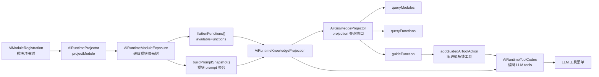
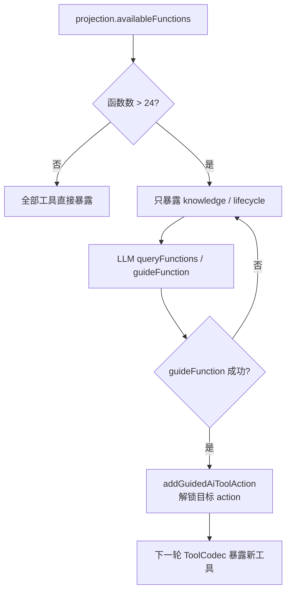

# SPARK AI 业务流程文档

## 架构总览

```
schema/ (底层) → module-semantic/ (协议层) → host/ (宿主层) → 业务注册
```

核心思路：业务方只需创建 `ModuleKind` 实例描述能力，框架自动生成 LLM 工具、导航、调用链和会话管理。

---

## 一、核心框架 (`packages/spark-ai/src/`)

### 1.1 三层结构

| 层 | 目录 | 职责 | 文件数 |
|----|------|------|--------|
| Schema | `schema/` | JSON Schema 类型、构建器、校验器 | 3 |
| 协议 | `module-semantic/` | ModuleKind 协议、运行时、工具生成 | 13 |
| 宿主 | `host/` | 业务注册、会话、传输、工具循环 | 25 |

### 1.2 Schema 层

**`schema/types.ts`** — JSON Schema 类型系统：
- `LlmJsonValue` — LLM 可序列化的值联合类型
- `LlmJsonSchema` / `LlmJsonSchemaObject` — 标准 JSON Schema 对象模型

**`schema/helpers.ts`** — Schema 构建工厂函数：
- `stringSchema()` / `numberSchema()` / `booleanSchema()` / `enumSchema()`
- `arraySchema()` / `objectSchema()` / `paramsSchema()` / `noParamsSchema()`

**`schema/validator.ts`** — `LlmSchemaValidator` 类（静态方法，基于 AJV 2020）：
- 校验 LLM 参数是否符合 JSON Schema
- 格式化中文诊断信息

### 1.3 Module-Semantic 协议层

#### 核心协议类型

**`ModuleKind`**（`protocol/module-kind.ts:114`）— 中心抽象类：
- 属性元数据：`attributes: ModuleAttributeMetadata[]`
- 动作元数据：`actions: ModuleActionMetadata[]`
- 子模块委托：`runner` / `list` / `find` 函数
- 基类实现 `invokeAction`、`getAttribute`、`setAttribute`、`listChildren`、`findInstance`
- 元数据自描述：schema 校验由基类完成

**`ModuleOperationResult<T>`**（`protocol/module-operation.ts:80`）— 结果容器：
- `ok: boolean` / `data?: T` / `checks: ModuleCheckEntry[]`
- `ModuleCheckEntry` 含 `level` / `code` / `message` / `hint`

**`ModulePath`**（`protocol/module-path.ts:85`）— 模块树路径值对象：
- 格式：`/kind[id]/kind[id]`
- 支持 `parent()` / `append()` / `parse()` / `toString()`

#### 运行时组件

**`ModuleSemanticRuntime`**（`runtime/module-semantic-runtime.ts:49`）— 组合根：
- 组装 Registry、Navigator、ActionInvoker、ProtocolToolGenerator、ProtocolToolRouter
- `registerKind()` — 注册 ModuleKind
- `getLlmTools()` — 生成 6 个 LLM 协议工具
- `executeTool()` — 执行单个工具调用（Host 入口）

**6 个 LLM 可见协议工具**（`internal/protocol-tool-generator.ts`）：
1. `getAttribute(path, attrName)` — 读取属性
2. `setAttribute(path, attrName, value)` — 写入属性
3. `invokeAction(path, actionName, args)` — 调用动作
4. `listChildren(path, childKind?)` — 列出子实例
5. `findInstance(path, childKind, query)` — 搜索实例
6. `describeKind(kind)` — 查询模块元数据

**导航器** `Navigator`（`internal/navigator.ts:84`）：
- `navigate(path, host?)` — 逐段验证路径，返回尾部 ModuleKind + 路径上下文
- `listChildren()` / `findInstance()` — 委托到目标 ModuleKind

### 1.4 Host 宿主层

#### 业务注册

**`AiHostBusinessRegistration`**（`business/registration-types.ts:82`）：
```
moduleId, name, description
runtime: ModuleSemanticRuntime      ← 业务能力投影
sessionStore?: AiHostSessionStore
systemPrompt?                       ← 动态系统提示词
afterFunctionCall?                  ← 工具调用后生命周期
onStartSession? / onEndBusinessInstance? / releaseModuleInstance?
```

**`AiHostBusinessSession`**（`business/business-session.ts:213`）— 主公开 API：
- `start()` — 创建会话记录，生成工具
- `send(request)` — 发送用户消息，触发完整 AI 回合

#### 会话存储

**`AiHostSessionStore`**（`session/session-types.ts:158`）— 抽象持久化契约：
- `DefaultAiHostSessionStore` — 默认内存实现

#### 传输层

**`AiHostTransport`**（`transport/transport-types.ts:108`）— 抽象传输契约：
- `streamTurn(input)` — AI 推理请求
- `appendMessages(input)` — 同步消息到服务端

**`AiHostFetchTransport`**（`transport/fetch-transport.ts:55`）— 唯一实现：
- POST `/api/ai/sessions/{id}/turn/stream` → SSE 流
- POST `/api/ai/sessions/{id}/turn/append`
- 默认 base URL：`/api/ai`

#### 工具循环（核心编排引擎）

**`AiHostToolLoopRunner`**（`tool-loop/tool-loop-runner.ts:60`）：
```
runToolLoop(input):
  1. 组装系统提示词
  2. 提取最新用户消息
  3. 回合循环 (最多 maxToolRounds 轮):
     a. 生成 LLM 工具 specs
     b. transport.streamTurn() → 文本 + toolCalls
     c. 写入 AI 文本到 sessionStore
     d. 无 toolCalls → 自然结束
     e. 每个 toolCall → AiHostToolCallExecutor.execute()
     f. 收集生命周期指令
     g. 构建下一轮消息
  4. 生命周期终结处理
```

**`AiHostToolCallExecutor`**（`tool-loop/tool-call-executor.ts:86`）— 单次工具执行：
```
execute(toolCall):
  1. 提取 function.name
  2. 映射为协议工具名 (codec.actionOf)
  3. 解析 JSON 参数
  4. runtime.executeTool() 执行
  5. 结果转换 + 历史记录
  6. 生命周期钩子 afterFunctionCall
```

---

## 二、业务注册 (`packages/spark-page-config/src/ai/`)

### 2.1 页面设计 (`page-design-module.ts`)

**PAGE_DESIGN_MODULE_ID = 'pageDesign'**

注册 1 个根 ModuleKind + 5 个子 ModuleKind 到一个 ModuleSemanticRuntime：

| ModuleKind | kind | 动作数 | 职责 |
|------------|------|--------|------|
| `PageDesignRootModuleKind` | `pageDesign` | 0 | 根模块，声明 lifecycle / text-model / payload-catalog / node-tree / dataset 子模块 |
| `PageDesignLifecycleModuleKind` | `lifecycle` | 3 | bootstrap / describeProgress / describeDesignFlow |
| `PageDesignTextModelModuleKind` | `text-model` | 4 | readScript / writeScript / readStyle / writeStyle |
| `PageDesignPayloadCatalogModuleKind` | `payload-catalog` | 2 | queryPayloads / guidePayload |
| `PageDesignNodeTreeModuleKind` | `node-tree` | 19 | 节点树 CRUD（rule.json 编辑） |
| `PageDesignDatasetModuleKind` | `dataset` | 37 | 数据集 CRUD（pagedata.json 编辑） |

### 2.2 请假申请 (`leave-request.ts`)

**LEAVE_REQUEST_MODULE_ID = 'manualLeave'**

1 个 ModuleKind：`LeaveRequestModuleKind`（kind: `manual-leave`）
- `describeDraft` / `setDraftFields` / `submitDraft` / `cancelDraft`
- 生命周期：submit → `complete`；cancel → `abort`；其他 → `continue`

---

## 三、端到端数据流

```
用户发送消息
  → AiHostBusinessSession.send(request)
    → resolveSelectedBusiness()           // 解析业务注册
    → startRegistrationSession()           // onStartSession + 创建 Session + 生成工具
    → toolLoopRunner.runToolLoop():
       ┌─ 回合循环 ─────────────────────────────────────┐
       │  1. 组装 systemPrompt (动态 + UI + 业务描述 + 知识快照) │
       │  2. 提取最新用户消息                              │
       │  3. ModuleSemanticToolCodec(runtime.getLlmTools())│
       │     6 个协议工具 → transport tool specs           │
       │  4. transport.streamTurn() → SSE 流              │
       │     POST /api/ai/sessions/{id}/turn/stream       │
       │     → 解析 delta/reasoning/result 事件            │
       │     → 返回 { text, reasoning, toolCalls }         │
       │  5. 写入 AI 文本到 sessionStore                   │
       │  6. 无 toolCalls → 自然结束                       │
       │  7. 每个 toolCall:                               │
       │     a. codec.actionOf(name) → 协议工具名           │
       │     b. parseToolArgs(JSON) → Record<string, LlmJsonValue>│
       │     c. runtime.executeTool(name, args, host):     │
       │        ProtocolToolRouter → Navigator → ModuleKind│
       │     d. 结果 → toFunctionCallResult → sessionStore │
       │     e. registration.afterFunctionCall → 生命周期指令│
       │  8. 构建下一轮消息（assistant + tool results）      │
       └──────────────────────────────────────────────────┘
       → 生命周期终结: appendMessages → stopSession → onEndBusinessInstance
       → releaseInstance → releaseModuleInstance → clearSelected

  ← onDelta (文本流) / onFcCall (工具记录) / onSseEvent (诊断) 实时回调 UI
```

---

## 四、AI 标准知识体系（2026-05-21 代码）

这一节来自前天代码里的 projection-driven 设计，主要在以下文件中：

- `packages/spark-ai/src/internal/knowledge/knowledge-projection.ts`
- `packages/spark-ai/src/internal/knowledge/knowledge-tool-catalog.ts`
- `packages/spark-ai/src/internal/runtime/ai-runtime-support.ts`
- `packages/spark-ai/src/internal/tool-exposure-policy.ts`
- `packages/spark-ai/src/host/tool-loop.ts`
- `docs/ai/SPARK_AI_CORE_RESPONSIBILITY_BOUNDARIES.md`

核心结论：AI 标准知识体系不是一组静态 prompt，而是“模块注册树 → 知识投影 → 知识查询工具 → 渐进式工具暴露 → systemPrompt 拼接”的运行时闭环。



### 4.1 知识对象层次

| 对象 | 来源 | 含义 |
|------|------|------|
| `AiRuntimeModuleExposure` | `AiRuntimeProjector.projectModule()` | LLM 可见模块树，包含 `moduleId`、`modulePath`、`name`、`description`、`prompt`、`functions`、`modules` |
| `AiRuntimeFunctionExposure` | `projectModuleNode()` | LLM 可见函数指南，包含 `action`、`description`、`paramsSchema`、`resultSchema`、`usageRules`、`failureModes`、`contextParams` |
| `AiRuntimeKnowledgeProjection` | `AiProjectionService.projectKnowledge()` | 会话级知识快照，包含 `scope`、`module`、`promptSnapshot`、`availableFunctions` |
| `AiKnowledgeProjector` | `internal/knowledge/knowledge-projection.ts` | 保存每个 scope 最近一次 projection，给知识工具提供查询视图 |
| `AiKnowledgeCatalog` | `internal/knowledge/knowledge-tool-catalog.ts` | 定义 knowledge 模块的内置工具、参数 schema、结果说明和失败模式 |

### 4.2 三个标准知识工具

| 函数 | 参数 | 返回 | 用途 |
|------|------|------|------|
| `queryModules` | `{}` | 轻量模块目录：`moduleId/modulePath/name/description/functionCount/childModuleCount` | 让 LLM 先理解当前业务模块边界 |
| `queryFunctions` | `modulePath? / moduleId? / keyword?` | 轻量函数目录：`action/description/paramNames/requiredParamNames/failureCodes` | 让 LLM 搜索可用能力，不一次性读取全部 schema |
| `guideFunction` | `{ action }` | 完整 `AiRuntimeFunctionExposure` | 调用具体业务函数前读取完整参数、规则、失败模式，并触发工具解锁 |

知识工具的使用纪律：

```text
不知道有哪些模块 → queryModules()
知道模块但不知道函数 → queryFunctions({ moduleId/modulePath/keyword })
准备执行某个函数 → guideFunction({ action })
guideFunction 成功 → 下轮工具循环可解锁该 action
```

### 4.3 systemPrompt 拼接链路

前天代码里，Host 工具循环的系统提示词由三段按顺序拼接：

```ts
const systemPrompt = [
  runtime.getSystemPrompt?.(runtimeContext),
  request.systemPrompt,
  projection.promptSnapshot,
].filter((part): part is string => typeof part === 'string' && part.trim().length > 0).join('\n\n')
```

三段语义分别是：

| 片段 | 来源 | 语义 |
|------|------|------|
| `runtime.getSystemPrompt(runtimeContext)` | 业务 Host runtime | 当前业务实例的运行时规则，例如页面设计纪律、请假日期规则 |
| `request.systemPrompt` | UI/调用方本轮请求 | 本轮临时约束或用户界面注入的额外指令 |
| `projection.promptSnapshot` | `AiRuntimeProjector.buildPromptSnapshot()` | 模块注册树中所有 `prompt` 的聚合，是 AI 标准知识体系进入 LLM 上下文的关键入口 |

这也是你说“系统提示词搞丢”的核心点：图文版只写了 Host/ModuleKind 主链路，但没有保留“模块 prompt → promptSnapshot → systemPrompt”的知识注入链路。

### 4.4 渐进式工具暴露

前天代码里还有一个重要策略：工具多时，LLM 初始只看见 `knowledge` 和 `lifecycle` 模块，避免一次性暴露几十个业务函数。



这套策略解决的是“AI 标准知识太多时如何给 LLM 看”的问题：

- `queryFunctions` 给摘要，不塞完整 schema。
- `guideFunction` 按需给完整指南。
- `addGuidedAiToolAction` 把 LLM 已学习过的 action 加入可见工具集。
- 真正执行前仍走 schema 校验和 action 翻译，不靠 prompt 信任。

### 4.5 与当前 module-semantic 版本的差异

| 前天知识体系 | 当前 module-semantic 方向 |
|--------------|---------------------------|
| 动态投影 `AiRuntimeKnowledgeProjection` | 固定 6 个协议工具 + `describeKind` |
| `queryModules/queryFunctions/guideFunction` 作为 knowledge 工具 | `listChildren/findInstance/describeKind` 承担发现与说明 |
| `promptSnapshot` 聚合模块 prompt | `registration.systemPrompt + request.systemPrompt + registration.description` |
| 工具多时渐进式暴露真实 action | LLM 始终只看见 6 个协议工具，业务 action 通过 `invokeAction` 间接调用 |
| action 格式 `rootInstance[/child]@moduleId@functionId` | path 格式 `/<kind>[<id>]` + `actionName` |

如果要把“AI 标准知识体系”补回当前文档，应至少保留三件事：

1. 知识对象：模块曝光树、函数曝光、知识投影。
2. 知识工具：查询模块、查询函数、函数指南。
3. 系统提示词链路：业务 runtime prompt、本轮 request prompt、模块 promptSnapshot。

---

## 五、最小 AI 业务

### 5.1 绝对核心（任何 AI 交互都需要）

**协议层 6 文件：**

| 文件 | 核心内容 |
|------|---------|
| `schema/types.ts` | JSON Schema 类型定义 |
| `module-semantic/protocol/module-kind.ts` | ModuleKind 中心类 |
| `module-semantic/protocol/module-operation.ts` | ModuleOperationResult |
| `module-semantic/protocol/module-path.ts` | ModulePath 值对象 |
| `module-semantic/protocol/module-context.ts` | 委托契约类型 |
| `module-semantic/internal/module-kind-registry.ts` | ModuleKind 注册表 |

**运行时 8 文件：**

| 文件 | 核心内容 |
|------|---------|
| `module-semantic/internal/navigator.ts` | 路径解析 + 发现 |
| `module-semantic/internal/action-invoker.ts` | 动作调用 + 校验 |
| `module-semantic/internal/protocol-tool-generator.ts` | 6 个 LLM 工具生成 |
| `module-semantic/runtime/module-semantic-runtime.ts` | 组合根 |
| `module-semantic/runtime/protocol-tool-router.ts` | 工具调用路由 |
| `module-semantic/runtime/protocol-tool-args.ts` | 参数解析 |
| `module-semantic/runtime/protocol-result-projector.ts` | 结果投影 |
| `schema/validator.ts` | 参数校验 |

**宿主层 11 文件：**

| 文件 | 核心内容 |
|------|---------|
| `host/business/registration-types.ts` | 业务注册契约 |
| `host/business/business-registry.ts` | 注册管理 |
| `host/business/business-scope.ts` | Scope/ID 工具 |
| `host/business/business-session.ts` | 主公开 API |
| `host/business/scope-types.ts` | Scope 类型体系 |
| `host/business/lifecycle-types.ts` | 生命周期指令 |
| `host/session/session-types.ts` | 会话持久化契约 |
| `host/session/default-session-store.ts` | 默认内存存储 |
| `host/transport/transport-types.ts` | 传输契约 |
| `host/transport/fetch-transport.ts` | HTTP+SSE 实现 |
| `host/tool-loop/tool-loop-runner.ts` | 多回合循环引擎 |
| `host/tool-loop/tool-call-executor.ts` | 单工具执行 |

### 5.2 业务方只需做的事

```typescript
// 1. 定义 ModuleKind 子类
class MyBusinessKind extends ModuleKind {
  constructor(service: MyService) {
    super({
      kind: 'my-action',
      name: 'My Business Action',
      actions: [
        {
          name: 'doSomething',
          description: '执行业务操作',
          paramsSchema: paramsSchema({ input: stringSchema('输入') }, ['input']),
          // ...
        },
      ],
    })
  }

  override invokeAction(ctx, actionName, args) {
    // 委托到业务 service
  }
}

// 2. 创建运行时
const runtime = new ModuleSemanticRuntime()
runtime.registerKind(new MyBusinessKind(service))

// 3. 创建业务注册
const registration = new AiHostBusinessRegistration({
  moduleId: 'myBusiness',
  runtime,
  // ... 可选生命周期钩子
})

// 4. 创建注册表 + 会话
const registry = new AiHostBusinessRegistry()
registry.register(registration)

const session = createAiHostBusinessSession(
  { registry, transport: new AiHostFetchTransport({ baseUrl: '/api/ai' }) },
  { businessRegistrationId: 'myBusiness', businessInstanceId: 'instance-1' },
)

// 5. 启动并发送消息
await session.start()
await session.send({ historyMsgs: [{ role: 'user', content: '你好' }] })
```
