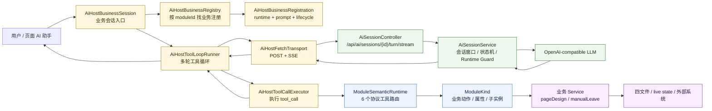
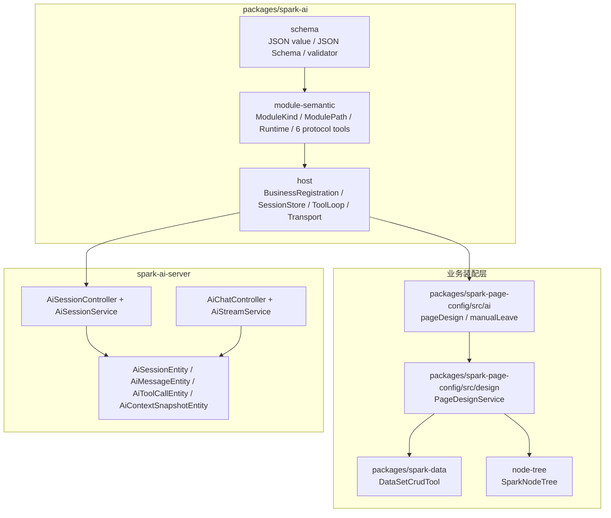
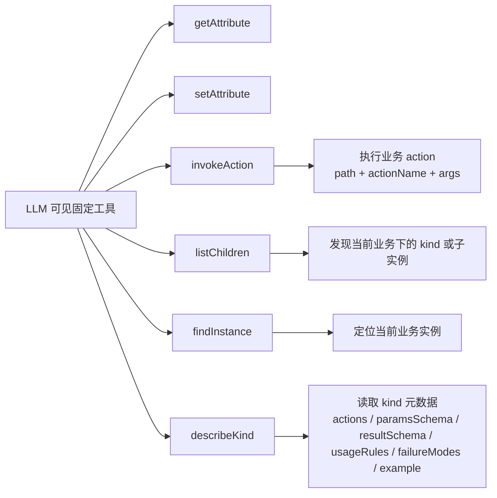
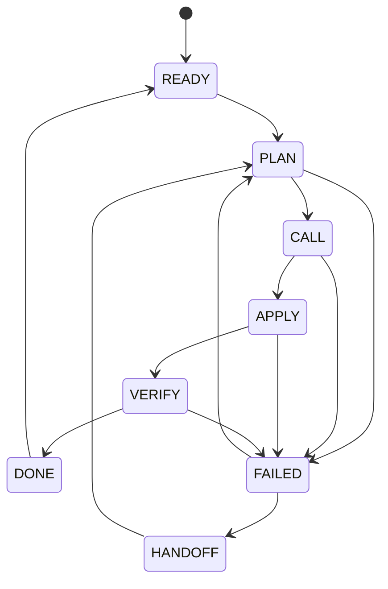
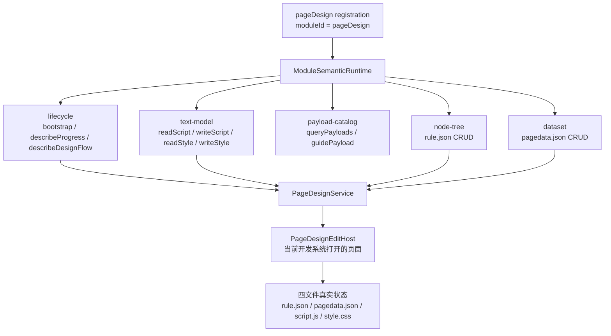
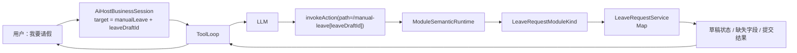
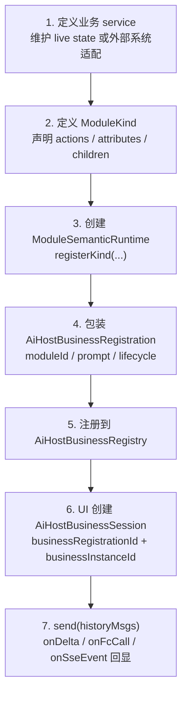
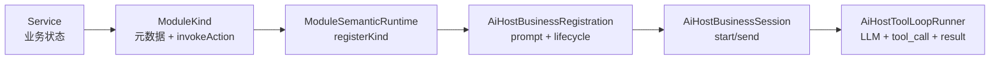

# SPARK AI 业务流程图文文档

本文梳理 SPARK View 当前 AI 业务从“用户发消息”到“LLM 推理、函数调用、业务状态修改、结果回流”的完整闭环，并给出一个最小 AI 业务的落地模板。

读这份文档时可以把系统分成两件事：

- AI Host 负责通用会话、工具协议、SSE 传输、函数调用循环。
- 业务模块负责把自己的能力投影为 `ModuleKind`，并维护自己的 live state 或文件编辑状态。

## 一图总览



## 分层地图

`packages/spark-ai` 是框架无关的 AI Host 内核，只暴露四个公共入口：

- `@spark-view/spark-ai`
- `@spark-view/spark-ai/schema`
- `@spark-view/spark-ai/module-semantic`
- `@spark-view/spark-ai/host`



| 层 | 核心文件 | 职责 | 不做什么 |
| --- | --- | --- | --- |
| Schema | `packages/spark-ai/src/schema/*` | LLM JSON 值、标准 JSON Schema、参数校验 | 不定义业务动作 |
| Module Semantic | `packages/spark-ai/src/module-semantic/*` | `ModuleKind` 元数据、路径导航、协议工具路由 | 不持有业务 live state |
| Host | `packages/spark-ai/src/host/*` | 会话、工具循环、函数调用历史、HTTP/SSE 传输 | 不理解 pageDesign 或请假字段 |
| Business | `packages/spark-page-config/src/ai/*` | 创建业务注册，把领域 service 投影成 `ModuleKind` | 不改 Host 工具循环 |
| Backend | `spark-ai-server/src/main/java/com/spark/ai/*` | LLM 调用、SSE 转发、后端会话状态、持久化 | 不执行前端业务工具 |

## 固定六工具模型

SPARK AI 不把每个业务 action 直接暴露成一个 LLM function。LLM 始终只看到 6 个稳定协议工具，业务动作通过 `describeKind` + `invokeAction` 间接调用。



这样做的好处是工具面稳定：新增业务 action 时只更新 `ModuleKind.actions` 元数据，不扩张 Host 的公共工具协议。

## 一次 AI Turn 的时序

```mermaid
sequenceDiagram
  autonumber
  participant UI as UI / 调用方
  participant Session as AiHostBusinessSession
  participant Loop as AiHostToolLoopRunner
  participant Transport as AiHostFetchTransport
  participant Server as AiSessionController/Service
  participant LLM as LLM
  participant Exec as AiHostToolCallExecutor
  participant Runtime as ModuleSemanticRuntime
  participant Biz as ModuleKind + BusinessService

  UI->>Session: send({ historyMsgs, callbacks })
  Session->>Session: latestUserInput + append user message
  Session->>Loop: runToolLoop(registration, scope, turn)
  Loop->>Loop: build systemPrompt + 6 tool specs
  Loop->>Transport: streamTurn(sessionId, messages, tools)
  Transport->>Server: POST /api/ai/sessions/{id}/turn/stream
  Server->>LLM: chat/completions + tools
  LLM-->>Server: delta / reasoning / tool_calls
  Server-->>Transport: SSE delta / reasoning / usage / result
  Transport-->>UI: onDelta / onReasoning / onUsage / onSseEvent
  Transport-->>Loop: { text, reasoning, toolCalls }
  Loop->>Exec: execute(tool_call)
  Exec->>Runtime: executeTool(protocolToolName, args, host)
  Runtime->>Biz: navigate path + invokeAction/get/list/find
  Biz-->>Runtime: ModuleOperationResult
  Runtime-->>Exec: operationResult
  Exec->>Session: appendFunctionCall
  Exec-->>UI: onFcCall + diagnostic event
  Exec-->>Loop: tool message + lifecycle directive
  alt directive = continue
    Loop->>Loop: assistant + tool messages become next round input
  else directive = complete / abort
    Loop->>Transport: appendMessages(assistant + tool results)
    Transport->>Server: POST /api/ai/sessions/{id}/turn/append
    Loop->>Session: stopSession + releaseModuleInstance
  end
```

## 后端通道

| 场景 | 端点 | 调用方 | 特点 |
| --- | --- | --- | --- |
| Host 工具循环流式推理 | `POST /api/ai/sessions/{sessionId}/turn/stream` | `AiHostFetchTransport.streamTurn()` | protocol v3，返回 SSE，`result` 事件携带最终文本和 `toolCalls` |
| Host 工具结果回填 | `POST /api/ai/sessions/{sessionId}/turn/append` | `AiHostFetchTransport.appendMessages()` | 把 assistant `tool_calls` 和 tool result 写回后端会话 |
| 通用聊天 | `POST /api/ai/chat/stream` | 普通聊天 UI | 不走 `ModuleSemanticRuntime` 工具循环 |
| 附件上传 | `POST /api/ai/upload` | 聊天附件 | 存入 `data/uploads/` |
| 组件元数据上传 | `POST /api/ai/component-metadata` | 构建期脚本 | 给 AI 侧提供组件元数据摘要 |
| 调试诊断 | `/api/ai/debug/*` | 调试工具 | FC 错误报告、截图/路由调试事件 |

SSE 事件类型：

| 事件 | 含义 | 前端回调 |
| --- | --- | --- |
| `delta` | 正文 token 增量 | `onDelta` |
| `reasoning` | 推理文本增量，DeepSeek reasoner 场景常见 | `onReasoning` |
| `usage` | token 用量 | `onUsage` |
| `result` | 最终聚合结果，含 `sessionId`、`turnId`、`text`、`toolCalls` | `readAiHostSseStream()` 内部收敛 |
| `done` | 通用聊天流结束 | 通用聊天消费 |
| `error` | 服务端错误 | 抛错或错误 UI |

## 后端会话状态机

`AiSessionService` 在后端维护 LLM 会话窗口、scope 校验、工具调用运行时防护和持久化。核心状态如下：



关键保护：

- protocolVersion 必须是 `3`。
- 后端 session scope 必须与前端传入 scope 匹配，否则返回 `SESSION_SCOPE_MISMATCH`。
- LLM 返回 `tool_calls` 后会生成 runtime meta，用于识别重复 tool call、并行写入风险和资源冲突。
- 有 `tool_calls` 时，后端不自动追加 assistant 消息；由前端 Host 执行业务工具后通过 `/turn/append` 回填，避免 assistant/tool 消息块不完整。

## pageDesign 完整业务

`pageDesign` 是当前最完整的业务注册。它把一个页面的四文件编辑能力投影给 AI：

- `rule.json`：节点树，走 `node-tree` kind。
- `pagedata.json`：数据集，走 `dataset` kind。
- `script.js`：脚本，走 `text-model` kind。
- `style.css`：样式，走 `text-model` kind。



`pageDesign` 的业务特征：

- 注册入口：`createPageDesignBusinessRegistration()`。
- 业务 ID：`PAGE_DESIGN_MODULE_ID = 'pageDesign'`。
- `ModuleSemanticRuntime` 内注册 5 个扁平 `ModuleKind`。
- `systemPrompt` 注入四文件编辑纪律、DataViewKey 绑定格式、脚本沙箱约束、数据优先策略和页面设计流程。
- `afterFunctionCall` 遇到缺少 edit host 的错误时会 `abort`，提示用户先打开并选中目标配置页面。
- `releaseModuleInstance(pageId)` 只释放 `PageDesignService` live state，不删除 Host 会话历史。

### pageDesign 动作地图

| kind | 核心职责 | 典型动作 |
| --- | --- | --- |
| `lifecycle` | 页面设计会话状态和流程说明 | `bootstrap`、`describeProgress`、`describeDesignFlow` |
| `text-model` | 读写脚本和样式 | `readScript`、`writeScript`、`readStyle`、`writeStyle` |
| `payload-catalog` | 查询组件荷载指南 | `queryPayloads`、`guidePayload` |
| `node-tree` | 编辑 `rule.json` 节点树 | `listChildren`、`getNode`、`addNode`、`setProps`、`moveNode` 等 |
| `dataset` | 编辑 `pagedata.json` 数据集 | 表、列、视图、行、关系、依赖、历史等 CRUD |

## manualLeave 最小业务

`manualLeave` 是最小 AI 业务闭环：一个业务注册、一个 `ModuleKind`、一个内存 service、四个 action，就能跑通完整 Host 工具循环。



`manualLeave` 的最小闭环：

1. `onStartSession` 调用 `service.getDraft()` 创建草稿。
2. LLM 用 `describeKind('manual-leave')` 读取可用动作。
3. LLM 用 `invokeAction('/manual-leave[leaveDraftId]', 'setDraftFields', { fields })` 写草稿。
4. `LeaveRequestService` 校验日期、必填字段、状态可编辑性。
5. 用户确认后 LLM 调用 `submitDraft`。
6. `afterFunctionCall` 看到 `submitDraft` 成功，返回 `complete` + `finalAssistantMessage` + `releaseInstance`。
7. ToolLoop 停止 session，回填消息，释放草稿 live state。

### manualLeave 动作表

| action | 类型 | 成功后影响 | 失败模式示例 |
| --- | --- | --- | --- |
| `describeDraft` | 只读 | 返回当前草稿和缺失字段 | 基本无业务失败 |
| `setDraftFields` | 写入 | 合并用户明确给出的字段 | `INVALID_DATE_RANGE`、`DRAFT_NOT_EDITABLE` |
| `submitDraft` | 终结写入 | 校验并提交草稿 | `MISSING_REQUIRED_FIELDS`、`DRAFT_ALREADY_SUBMITTED` |
| `cancelDraft` | 终止 | 取消未提交草稿 | `DRAFT_ALREADY_SUBMITTED` |

### 最小业务代码骨架

下面是新增一个最小业务时应保留的结构。实际代码应放在业务包中，例如 `packages/spark-page-config/src/ai/my-business.ts`，并通过公共入口显式导出。

```ts
import {
  DefaultAiHostSessionStore,
  AiHostBusinessRegistration,
  type AiHostBusinessRuntimeContext,
  type AiHostFunctionCallResult,
} from '@spark-view/spark-ai/host'
import {
  ModuleKind,
  ModuleOperationResult,
  ModuleSemanticRuntime,
  type ModuleActionMetadata,
  type ModulePathContext,
} from '@spark-view/spark-ai/module-semantic'
import type { LlmJsonValue, LlmJsonSchemaObject } from '@spark-view/spark-ai/schema'

const MODULE_ID = 'myBusiness'
const KIND = 'my-kind'

const NO_PARAMS: LlmJsonSchemaObject = {
  type: 'object',
  properties: {},
  additionalProperties: false,
}

const ACTIONS: readonly ModuleActionMetadata[] = [
  {
    name: 'describe',
    description: '读取当前业务实例状态。',
    paramsSchema: NO_PARAMS,
    resultSchema: { state: '当前业务状态' },
    usageRules: ['不知道下一步时先调用。'],
    failureModes: [],
    example: {},
  },
]

class MyBusinessService {
  private readonly states = new Map<string, Record<string, LlmJsonValue>>()

  public getState(instanceId: string): Record<string, LlmJsonValue> {
    const existing = this.states.get(instanceId)
    if (existing !== undefined) return existing
    const created = { status: 'draft' }
    this.states.set(instanceId, created)
    return created
  }

  public release(instanceId: string): void {
    this.states.delete(instanceId)
  }
}

class MyBusinessModuleKind extends ModuleKind {
  public constructor(private readonly service: MyBusinessService) {
    super({
      kind: KIND,
      name: '最小业务',
      description: '演示最小 AI 业务接入。',
      actions: ACTIONS,
    })
  }

  public override invokeAction(
    ctx: ModulePathContext,
    actionName: string,
    _args: Readonly<Record<string, LlmJsonValue>>,
  ): Promise<ModuleOperationResult<LlmJsonValue>> {
    if (actionName !== 'describe') {
      return Promise.resolve(ModuleOperationResult.failCode(
        'ACTION_NOT_SUPPORTED',
        `${KIND} 不支持动作 ${actionName}`,
        '调用 describeKind 查看可用动作。',
      ))
    }
    return Promise.resolve(ModuleOperationResult.ok(this.service.getState(ctx.host?.moduleInstanceId ?? ctx.segment.id)))
  }
}

export function createMyBusinessRegistration(): AiHostBusinessRegistration {
  const service = new MyBusinessService()
  const runtime = new ModuleSemanticRuntime()
  runtime.registerKind(new MyBusinessModuleKind(service))

  return new AiHostBusinessRegistration({
    moduleId: MODULE_ID,
    name: '最小业务',
    description: '最小 AI 业务闭环示例。',
    runtime,
    sessionStore: new DefaultAiHostSessionStore(),
    systemPrompt: () => '你正在处理最小业务示例。先 describe，再根据用户意图执行下一步。',
    onStartSession: (context: AiHostBusinessRuntimeContext) => {
      service.getState(context.moduleInstanceId)
    },
    afterFunctionCall: (call): ReturnType<NonNullable<AiHostBusinessRegistration['afterFunctionCall']>> => {
      return shouldFinish(call.result) ? { status: 'complete', releaseInstance: true } : { status: 'continue' }
    },
    releaseModuleInstance: (moduleInstanceId) => {
      service.release(moduleInstanceId)
    },
  })
}

function shouldFinish(result: AiHostFunctionCallResult<unknown>): boolean {
  return result.ok === true
}
```

最小业务不需要做这些事：

- 不需要新增 Host 工具。
- 不需要新增 transport。
- 不需要改后端接口。
- 不需要把业务 live state 放进 Host session history。
- 不需要为单实现创建 `XxxInterface` / `XxxImpl`。

## 新增 AI 业务接入清单



接入时的判断点：

| 问题 | 推荐做法 |
| --- | --- |
| 业务状态放哪里？ | 放业务 service，Host session 只放消息和函数调用历史 |
| LLM 怎么知道 action 参数？ | 写完整 `paramsSchema`、`resultSchema`、`usageRules`、`failureModes`、`example` |
| 业务完成怎么停？ | 在 `afterFunctionCall` 返回 `complete` 或 `abort` |
| 资源怎么释放？ | `releaseModuleInstance(moduleInstanceId)` 清 live state |
| 多页面/多草稿如何隔离？ | `businessRegistrationId + businessInstanceId` 决定 sessionId 和 scope |
| 需要扩展工具协议吗？ | 通常不需要，优先通过 `ModuleKind` 元数据表达 |

## 关键源码索引

| 主题 | 文件 |
| --- | --- |
| AI Host 架构说明 | `packages/spark-ai/ARCHITECTURE.md` |
| 业务会话入口 | `packages/spark-ai/src/host/business/business-session.ts` |
| 业务注册表 | `packages/spark-ai/src/host/business/business-registry.ts` |
| 业务 scope/sessionId | `packages/spark-ai/src/host/business/business-scope.ts` |
| 工具循环 | `packages/spark-ai/src/host/tool-loop/tool-loop-runner.ts` |
| 单次工具调用执行 | `packages/spark-ai/src/host/tool-loop/tool-call-executor.ts` |
| Fetch + SSE 传输 | `packages/spark-ai/src/host/transport/fetch-transport.ts` |
| SSE 读取与收敛 | `packages/spark-ai/src/host/transport/sse-stream-reader.ts` |
| ModuleSemanticRuntime | `packages/spark-ai/src/module-semantic/runtime/module-semantic-runtime.ts` |
| ModuleKind | `packages/spark-ai/src/module-semantic/protocol/module-kind.ts` |
| 固定六工具生成 | `packages/spark-ai/src/module-semantic/internal/protocol-tool-generator.ts` |
| pageDesign 注册 | `packages/spark-page-config/src/ai/page-design-module.ts` |
| manualLeave 注册 | `packages/spark-page-config/src/ai/leave-request.ts` |
| 后端会话端点 | `spark-ai-server/src/main/java/com/spark/ai/controller/AiSessionController.java` |
| 后端会话服务 | `spark-ai-server/src/main/java/com/spark/ai/service/AiSessionService.java` |
| 通用聊天流 | `spark-ai-server/src/main/java/com/spark/ai/controller/AiChatController.java` |

## 业务边界与约束

- `spark-ai` 只保留 `schema`、`module-semantic`、`host` 三块稳定能力，不反向依赖 `spark-page-config` 或 Vue。
- 业务能力进入协议层前必须投影为标准 `ModuleKind` / `ModuleSemanticRuntime`。
- LLM 可见工具固定为 6 个协议工具，业务 action 通过 `describeKind` 和 `invokeAction` 暴露。
- `describeKind` 必须完整暴露 action 的参数、结果、使用规则、失败模式和示例。
- 参数 schema 必须是标准 JSON Schema object root。
- Host session history 只记录消息和函数调用结果；业务 live state 由业务 service 自管。
- 业务 release 只清 live state，不删除 Host 历史。
- `pageDesign` 修改页面时优先改配置文件和现有渲染器能力，不能用 `$data`、ESM import、`window.xxx` 或直接 UI 框架 API 绕过脚本沙箱。

## 最小业务结论

最小 AI 业务不是“最少文件”，而是“最少闭环”：



当前仓库里 `manualLeave` 已经是这个闭环的参考实现；`pageDesign` 是同一机制扩展到真实四文件页面编辑后的完整业务实现。
