# SPARK AI 通用架构设计方案与 PageDesign 实施样例

> 面向方案评审、研发落地和后续迭代治理。本文基于当前 `packages/spark-ai` 实现编写，目标是把 AI 从“能对话”推进到“能在受约束的业务空间里稳定执行、可审计、可验证、可回滚”。PageDesign 是当前最完整的落地样例，不是 SPARK AI 的唯一边界。

## 1. 方案定位

SPARK AI 不是一个独立替代业务系统的自由智能体，而是一套可嵌入不同业务域的受控协作层。它读取当前业务上下文，向 LLM 投影可用知识和工具函数，再把模型产生的函数调用翻译为确定性的业务操作。

核心目标：

- 让 AI 在明确的业务边界内工作，而不是自由生成不可控代码或绕过领域约束。
- 让不同业务模块通过统一注册协议暴露自己的函数、知识、状态读取和写入能力。
- 以 `pageDesign` 作为首个实施样例，验证自然语言如何落到 `rule.json`、`pagedata.json`、`script.js`、`style.css` 四类 live 模型。
- 让 core 层只负责协议、会话、知识投影和函数调用翻译，业务状态由业务模块自管。
- 让所有函数调用、用户输入、模型回复和执行结果都进入统一 AI session history，便于审计和追踪。
- 让实施过程可以按模块逐步交付，每一步都有测试和回滚口径。

## 2. 总体架构图

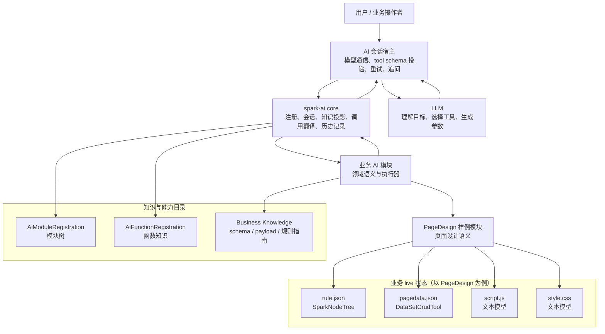

设计要点：

| 层级 | 负责什么 | 不负责什么 |
|------|----------|------------|
| AI 会话宿主 | 模型通信、tool schema 投递、tool call 转发、暂停/停止、重试策略 | 不直接维护业务数据模型 |
| `spark-ai core` | 模块注册、会话历史、知识投影、函数调用翻译、结果消息序列化 | 不执行函数体、不保存业务状态、不调度下一轮 |
| 业务 AI 模块 | 领域状态、函数目录、参数校验、真实执行、变更通知 | 不实现通用 AI session ledger |
| `pageDesign` 样例 | 页面编辑状态、四文件工具、组件知识、节点与数据编辑函数 | 不把 AI 边界收窄到页面设计 |
| live 业务模型 | 业务对象当前事实；PageDesign 样例中是页面结构、数据集、脚本、样式 | 不参与 LLM 编排 |

## 3. 核心设计原则

### 3.1 Core 机制化，Business 语义化

`core` 只回答“怎么注册、怎么投影、怎么翻译、怎么记录”。它不知道 `r-table`、DataSet、SparkNodeTree、script.js 沙箱，也不应该知道任何具体业务概念。

业务模块只回答“当前领域里有什么函数、这些函数如何解释、如何校验、如何执行”。PageDesign 样例回答的是页面设计领域的问题；其他业务模块也应按同一模式维护自己的语义和状态，但不复制 core 的会话账本。

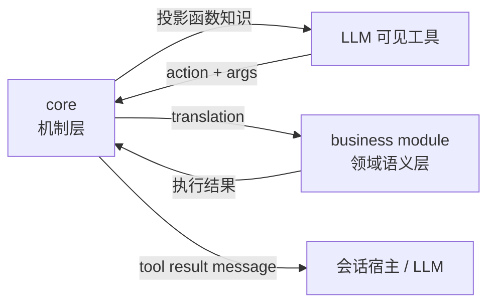

### 3.2 函数定义是唯一事实源

函数目录不再分散在 prompt、常量、工具映射和运行时适配器中。每个函数的事实源来自 `AiFunctionRegistration` 或业务 catalog row，包括：

- `functionId`
- `description`
- `paramsSchema`
- `resultSchema`
- `usageRules`
- `failureModes`
- `validate`
- `execute`

LLM-facing action 由 core 在会话投影时生成，格式为：

```text
rootInstanceId[/childInstanceId]@moduleId@functionId
```

示例：

```text
page-001@lifecycle@bootstrap
page-001@knowledge@queryPayloads
page-001@nodeTree@addNode
page-001@dataset@createTable
page-001@textModel@writeScript
page-001@jsonDoc@setMultiple
```

### 3.3 会话账本和业务状态分离

AI session history 保存的是“协作轨迹”：用户说了什么、模型回复了什么、模型请求调用什么函数、函数是否完成。业务模块保存的是“业务事实”；在 PageDesign 样例中，这些事实是页面树、数据集、脚本和样式。

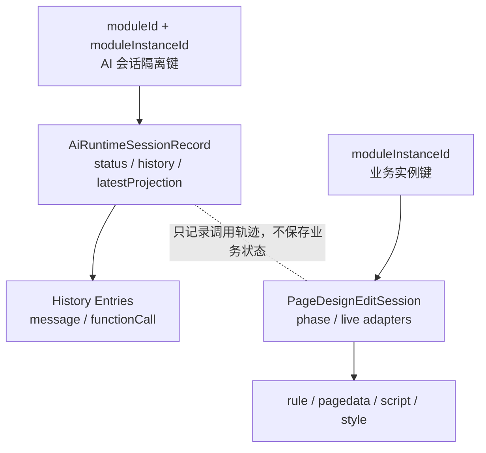

### 3.4 知识先行，执行后置

知识先行是通用纪律：写入前先读取当前业务事实，再查询相关工具、schema、规则和 payload 指南。以 PageDesign 为例，新增或替换页面组件前，AI 必须先查询知识：

1. `queryPayloads` 选择合法组件 type。
2. `guidePayload` 获取该组件的 SparkNode 参数荷载指南。
3. `nodeTree.addNode` / `replaceNode` 使用真实 schema 构造节点。

这能避免模型凭空猜测 props、把类型名当 componentId、或生成旧字段。

## 4. 模块设计

### 4.1 Core 模块

`packages/spark-ai/src/core` 是确定性协议层，主要由四组能力组成。

| 能力 | 关键文件 | 设计说明 |
|------|----------|----------|
| 协议契约 | `protocol/business-contracts.ts` | 定义模块注册、函数注册、会话记录、知识投影、函数调用翻译 |
| 参数协议 | `protocol/parameter-schema.ts`、`protocol/llm-params-validator.ts` | 归一化并校验 LLM 反序列化后的 JSON 参数 |
| 知识负载协议 | `protocol/knowledge-payload-contracts.ts`、`knowledge/payload-provider-registry.ts` | 定义并注册通用知识 payload provider；不承载组件参数语义 |
| Runtime Facade | `runtime/ai-runtime.ts`、`runtime/ai-runtime-support.ts` | 注册模块、投影知识、翻译调用、记录历史 |

Core 的主链路：

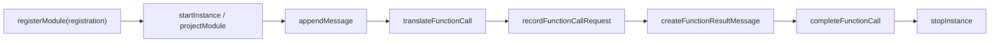

### 4.2 业务模块与 PageDesign 样例

`packages/spark-ai/src/business/page-design` 是通用 AI 架构下的首个业务样例。它证明一个业务域可以把自己的状态、函数、知识和执行器封装成可投影给 LLM 的模块树。当前 PageDesign 样例围绕六个子模块展开。

| 子模块 | 职责 | 典型函数 |
|--------|------|----------|
| `lifecycle` | 引导编辑会话，检查 live adapter 是否可用 | `bootstrap`、`describeProgress` |
| `knowledge` | PageDesign 业务模块内的组件参数荷载目录和组件 schema 指南 | `queryPayloads`、`guidePayload` |
| `nodeTree` | 操作 `rule.json` 对应的 SparkNodeTree | `listChildren`、`findByType`、`addNode`、`setProps`、`moveNode`、`replaceNode` |
| `dataset` | 操作 `pagedata.json` 对应的 DataSetCrudTool | `listTables`、`createTable`、`addColumn`、`createView`、`addAggregate` |
| `textModel` | 读写 `script.js` 和 `style.css` 全量文本 | `readScript`、`writeScript`、`readStyle`、`writeStyle` |
| `jsonDoc` | 通过 JSON Pointer / JMESPath 直接读写原始 JSON 文档 | `read`、`list`、`get`、`set`、`setMultiple`、`query` |

模块关系：

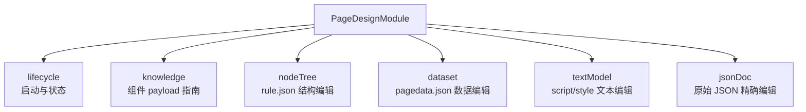

### 4.3 EditToolHost 接入层（PageDesign 样例）

`PageDesignModule` 不直接读写文件，而是通过宿主注入的 `EditToolHost` 访问 live model。这个接入层是 PageDesign 样例的宿主适配方式；其他业务模块也应提供自己的 host adapter，负责把业务 live state 暴露给 AI 工具函数。

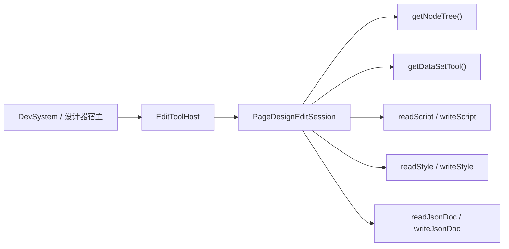

## 5. AI 执行链路

### 5.1 会话启动链路

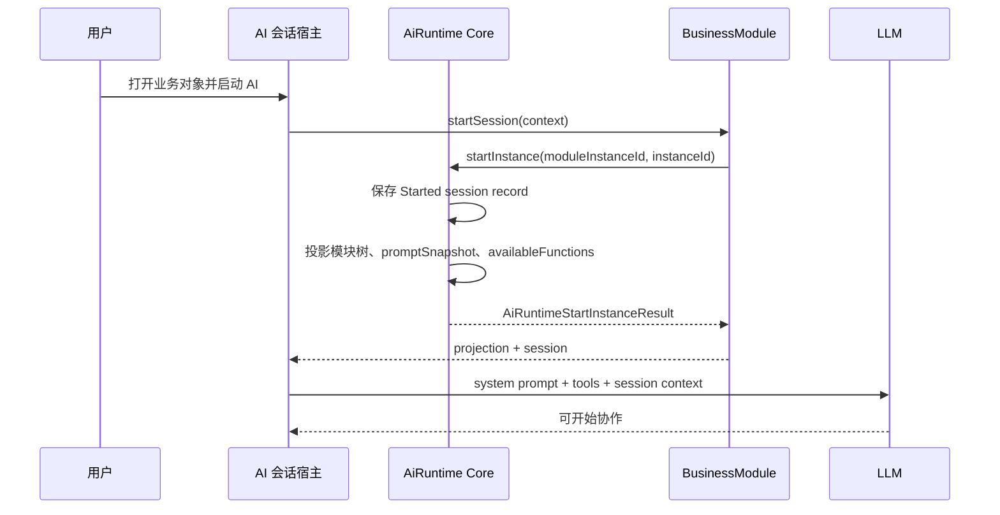

启动结果包括：

- 当前 session scope。
- 模块树暴露结果。
- 聚合后的 prompt snapshot。
- 当前可用函数列表。
- 会话生命周期快照。
- core 保存后的 session record。

### 5.2 用户意图到函数执行链路

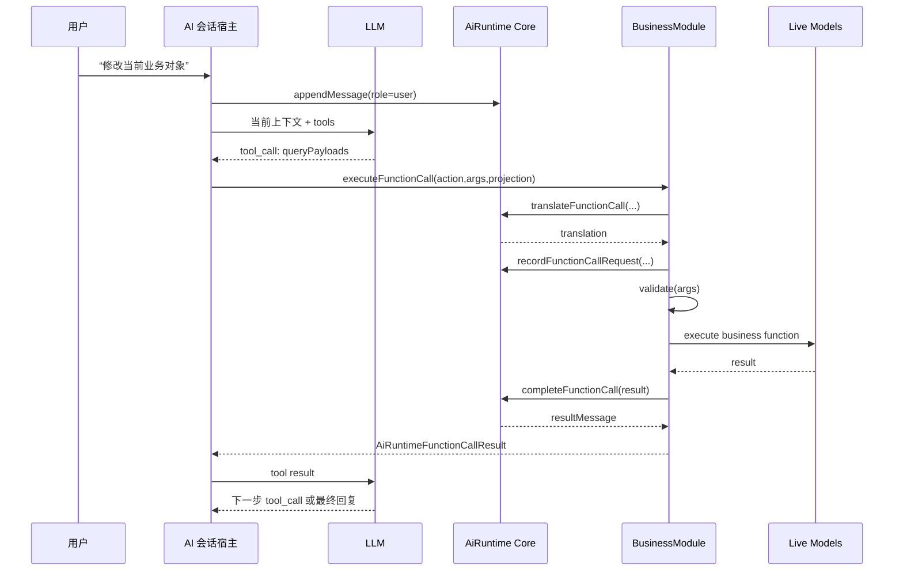

这条链路中，core 从不直接执行业务函数。它只负责把 LLM 的 action 和 args 翻译为注册方能执行的 `executionArgs` 和 `FunctionExecutionContext`。

### 5.3 PageDesign 样例推荐 SOP

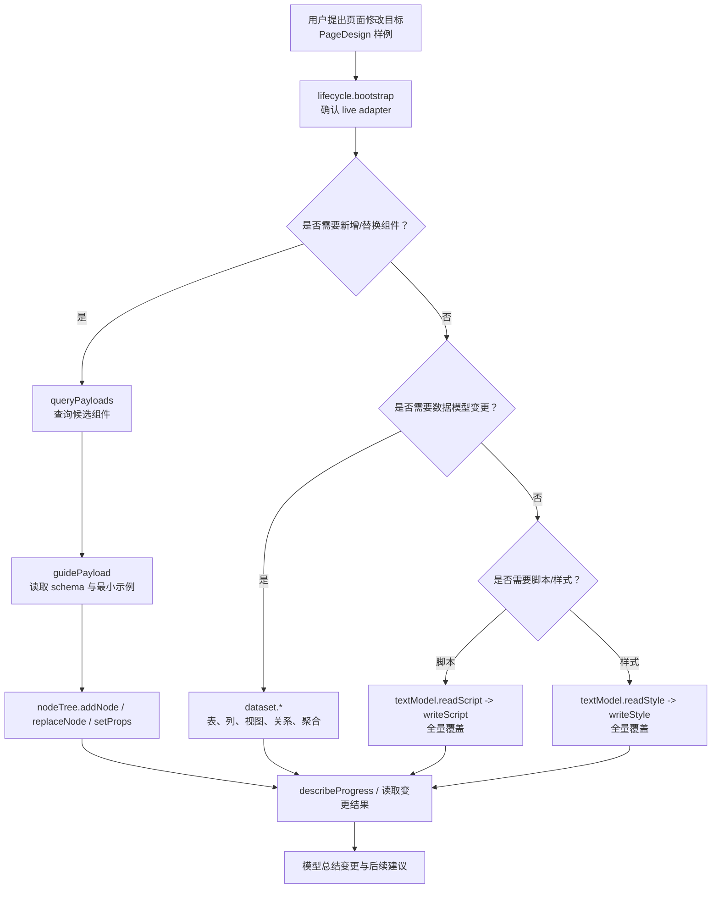

## 6. 函数调用安全设计

### 6.1 参数校验

每个业务函数必须在执行前经过参数校验。下面是 PageDesign 样例中的校验分工：

- `lifecycle` 和 `textModel` 采用轻量手写校验。
- `nodeTree` 和 `dataset` 通过 `LlmParamsValidator` 校验 schema。
- `jsonDoc` 对 `docType`、`pointer`、`patches`、`expression` 做针对性校验。
- `guidePayload` 要求 `key` 为非空组件 type 字符串。

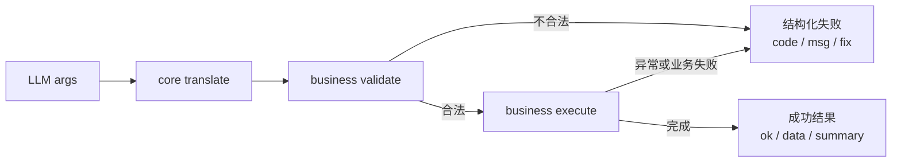

### 6.2 结构化失败

所有失败都应返回统一形态：

```ts
{
  ok: false,
  code: string,
  msg: string,
  fix: string
}
```

这让 LLM 能根据 `fix` 修正参数，而不是盲目重复调用。

常见失败类型：

| 失败码 | 场景 | 修复方向 |
|--------|------|----------|
| `NO_NODE_TREE` | 未绑定 SparkNodeTree | 先执行 `lifecycle.bootstrap` 并注入 nodeTree adapter |
| `NO_DATASET_EDIT` | 未绑定 DataSetCrudTool | 注入 dataset tool 后重试 |
| `NO_TEXT_MODEL` | 缺少 script/style 读写器 | 注入 `readScript/writeScript/readStyle/writeStyle` |
| `PAYLOAD_NOT_FOUND` | 组件 payload key 不存在 | 先调用 `queryPayloads` 重新选择组件 |
| `INVALID_ARGS` | 参数结构不符合 schema | 按函数指南修正参数 |
| `INVALID_SCRIPT_RUNTIME_API` | script.js 使用伪 API | 改用受支持的 `$page`、`$dataSet`、`$components.getApi` |

### 6.3 审计与回放

会话历史同时记录自然语言消息和函数调用历史：

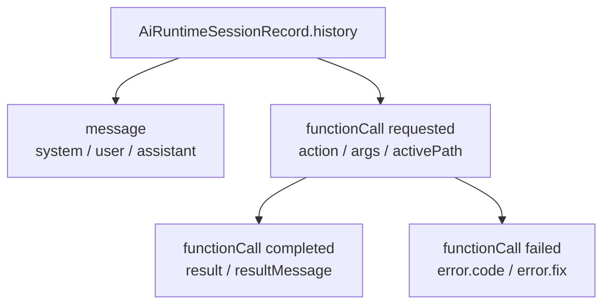

审计重点：

- 用户原始意图是否进入 history。
- 模型请求的 action 是否来自当前 projection。
- 函数参数是否经过业务校验。
- 写操作是否有对应 completed 或 failed 结果。
- 失败结果是否包含可执行的修复建议。

## 7. 实施链路

### 7.1 阶段路线图

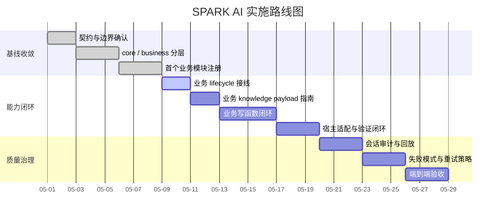

### 7.2 研发实施步骤

| 阶段 | 输入 | 工作项 | 输出 | 验收 |
|------|------|--------|------|------|
| 1. 协议冻结 | `business-contracts.ts` | 明确 core 不执行、不保存业务状态、不维护 active path | 稳定接口与边界说明 | `@spark-view/spark-ai typecheck` |
| 2. 模块注册 | 业务函数目录；PageDesign 样例为 lifecycle、knowledge、nodeTree、dataset、textModel、jsonDoc | 注册模块树、函数目录、prompt 和失败模式 | `availableFunctions` 投影完整 | 函数目录契约测试 |
| 3. 宿主接入 | 业务 host adapter；PageDesign 样例为 `EditToolHost` | 注入 live adapter，打通 bootstrap | 业务 edit/session state 可被函数访问 | bootstrap 失败/成功场景测试 |
| 4. 知识查询 | 业务知识源；PageDesign 样例为 component catalog | 查询 payload 摘要与指南 | AI 可按 schema 生成合法业务参数 | payload guide 测试 |
| 5. 写操作闭环 | 业务写函数；PageDesign 样例为 nodeTree / dataset / textModel | 写入、通知、记录 completed | 业务 live model 真实变更 | 编辑链路端到端测试 |
| 6. 失败治理 | failureModes | 补齐错误码、修复建议、参数校验 | 失败可被模型理解并修正 | 失败分支单测 |
| 7. 审计回放 | session history | 记录消息、请求、完成和失败 | 可追踪一次完整 AI 修改 | history snapshot 测试 |

### 7.3 端到端交付链路

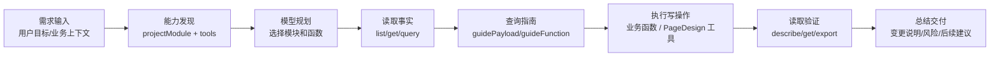

建议把每次复杂编辑控制在“小步读写闭环”中，而不是一次性让模型提交大块不可验证配置：

1. 先读当前事实。
2. 再查函数或组件指南。
3. 只执行最小必要写操作。
4. 写后读取验证。
5. 最后总结本轮变更。

## 8. 关键实施文案

### 8.1 对产品/业务方的说明

SPARK AI 的定位是“受约束的业务协作框架”。它不会绕过业务系统直接改文件或数据，也不会随意生成无法验证的代码。所有修改都通过已注册的业务函数完成，系统会记录用户意图、模型调用、参数、执行结果和失败原因。

以 PageDesign 为例，当用户提出“新增表格”“调整表单字段”“增加筛选条件”“补充脚本逻辑”等目标时，AI 会先读取当前页面状态，再查询可用组件和工具指南，最后通过结构化函数调用完成变更。换成其他业务域时，也应遵守同样的“先读事实、再查知识、后写入、再验证”链路。

### 8.2 对研发团队的说明

研发接入 AI 能力时，只需要维护三个事实源：

1. 业务模块注册树，描述模块职责和 prompt。
2. 函数 catalog row，描述函数参数、结果、规则、失败模式和执行器。
3. 业务模块维护的知识 payload provider，描述复杂 JSON 参数如何构造；其中 Component PayloadProvider 组件参数荷载指南属于 PageDesign knowledge 模块，不属于 core 层业务能力。

不要在 prompt、常量文件、前端按钮、后端接口中重复维护第二套函数目录。所有 LLM 可见能力都应由 core 从注册事实投影生成。

### 8.3 对测试/验收的说明

验收不只看模型最终文字是否正确，更要检查函数链路是否正确：

- 是否完成业务模块的 bootstrap；PageDesign 样例中是 `lifecycle.bootstrap`。
- 是否查询过必要的 knowledge guide。
- PageDesign 场景中，是否使用真实 `componentId`，没有把组件 type 当 id。
- PageDesign 场景中，是否按 schema 传入完整 `SparkNode` 或 DataSet 参数。
- 写操作后是否读取验证。
- session history 是否记录 requested、completed 或 failed。

## 9. 质量门禁

### 9.1 必跑验证

```bash
pnpm --filter @spark-view/spark-ai typecheck
pnpm --filter @spark-view/spark-ai lint
pnpm run test:run -- --config vitest.spark-ai.config.ts tests/ai-runtime-business.test.ts tests/page-design-business-definition.test.ts tests/dataset-tool-protocol-contract.test.ts tests/llm-params-validator.test.ts --reporter verbose
```

### 9.2 重点断言

| 断言 | 目的 |
|------|------|
| core 不 import 具体业务模块 | 保证机制层不吸收业务语义 |
| 同一注册树内 `moduleId` 唯一 | 保证 action 可翻译 |
| 旧 action 不再注册 | 避免模型走过时链路 |
| `guidePayload` 缺失时返回结构化失败 | 避免凭空构造业务 payload；PageDesign 场景返回 `PAYLOAD_NOT_FOUND` |
| 写操作都会记录 requested 和 completed/failed | 保证审计闭环 |
| `writeScript` 拦截伪 API | 保证运行时脚本安全 |

### 9.3 风险清单

| 风险 | 表现 | 对策 |
|------|------|------|
| 函数事实源分裂 | prompt 中写了不存在的函数 | 以注册投影为唯一目录，prompt 只描述纪律 |
| 参数 schema 过宽 | 模型传入类型名字符串或旧字段 | 收紧 `paramsSchema` 和 `validate` |
| 写入前缺少读取 | AI 覆盖用户已有配置 | SOP 强制先 read/list/query |
| 业务 payload 猜测 | 生成不可执行参数；PageDesign 场景中表现为不可渲染 SparkNode | 写入前强制查询对应 guide |
| session 与业务状态混淆 | stop AI 后误释放页面编辑态 | `stopSession` 只停止 AI，会话释放由业务显式 API 处理 |
| 失败后重复调用 | 模型不看 `fix` 继续重试 | failureModes 写清修复路径，宿主可加重复检测 |

## 10. 里程碑交付物

| 里程碑 | 交付物 |
|--------|--------|
| M1 协议层稳定 | `AiRuntimeApi`、`AiRegisteredModuleApi`、会话历史和函数翻译契约 |
| M2 首个业务模块稳定 | `PageDesignModule` 作为样例完成六个子模块注册 |
| M3 业务 Knowledge 闭环 | 业务 payload 查询、指南、失败模式完整；PageDesign 样例为组件 payload |
| M4 业务编辑闭环 | 业务写操作可执行并可验证；PageDesign 样例为 nodeTree、dataset、textModel、jsonDoc |
| M5 会话可观测 | history 可追踪自然语言和函数调用全过程 |
| M6 质量门禁 | 类型、lint、协议测试、端到端样例稳定 |

## 11. 推荐落地样例

以下以 PageDesign 样例中的“给订单列表增加状态筛选和汇总金额”为例：

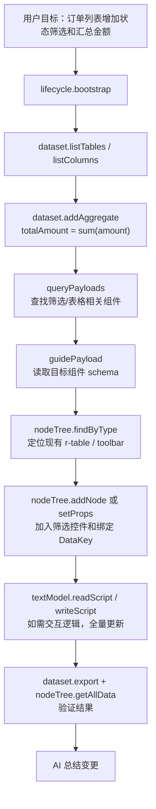

这类样例的验收标准：

- DataSet 中存在目标表、目标列和聚合配置。
- 页面树中使用真实组件 id 定位和修改。
- 新增组件的 `type` 与 `props` 来自 payload guide。
- script.js 没有使用不可用伪 API。
- session history 中能看到完整函数调用链。

## 12. 后续演进方向

1. 增加更细粒度的 diff preview，让 AI 写操作在提交前可被人工确认。
2. 为高风险函数增加 dry-run 模式，例如批量删除、批量替换和脚本覆盖。
3. 建立常见业务任务 recipe；PageDesign 先覆盖 CRUD 列表页、主从表、审批表单、统计看板。
4. 将 session history 接入可视化审计面板，支持按 action、失败码、模块过滤。
5. 扩展 payload provider 到数据模型、脚本 API、样式 token 等知识域。

## 13. 一句话总结

SPARK AI 的工程路线是：**用 core 提供稳定的会话与函数调用协议，用业务模块承载领域语义，用业务 knowledge 约束复杂参数生成，用 session history 串起完整审计链路，最终让自然语言需求落到可验证的业务模型变更。PageDesign 是这条路线的首个完整样例。**
