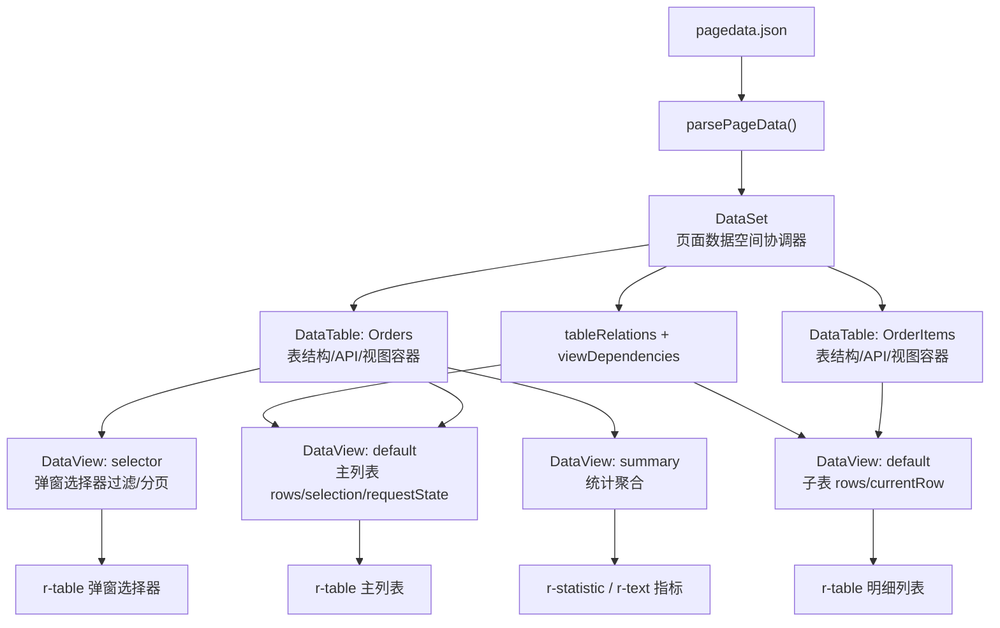
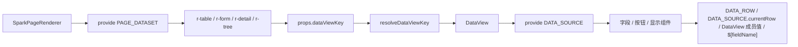
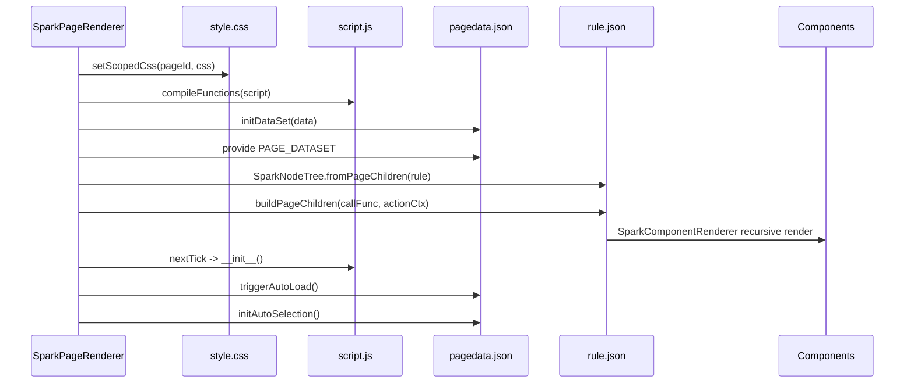

# DataSet 包与 AI 页面设计 100 步流程（数据规划优先版）

> 本文面向 SPARK View 的页面设计、组件配置与 AI 直接编辑流程。核心目标是讲清 `DataSet / DataTable / DataView` 的关系、页面四文件 `rule.json / pagedata.json / script.js / style.css` 的职责，以及一套以“数据规划 -> 表关系 -> 页面规划 -> 数据利用 -> 按需视图 -> 视图依赖”为主线的 AI 页面设计流程。

## 1. 一句话总览

SPARK View 的页面不是由 Vue 单文件组件直接写死，而是由四文件资产驱动：

| 文件 | 真正职责 | 运行时落点 |
| --- | --- | --- |
| `rule.json` | 声明页面组件树、布局、组件 props、事件名、`dataViewKey`、`dataViewKey + dataMember + dataField`、`field`、class | `SparkNodeTree` -> `buildPageChildren` -> `SparkComponentRenderer` |
| `pagedata.json` | 声明页面数据空间：表、列、视图、静态行、API、关系、依赖、计算列、聚合 | `parsePageData` -> `DataSet` -> `DataTable` -> `DataView` |
| `script.js` | 声明页面初始化函数、事件函数和少量业务动作 | `compileFunctions` -> 沙箱函数表 -> `__init__` / `handle*` |
| `style.css` | 页面级样式，通常配合 `rule.json` 中的 class 使用 | `setScopedCss` -> 页面作用域 CSS |

推荐设计主线：

```text
业务数据事实
-> 最小 DataTable 模型（表名 / 字段 / 主键 / 资源语义）
-> tableRelations（父子业务关系）
-> 页面规划（区域 / 工作流 / 操作）
-> 数据利用规划（每个 UI 消费点需要哪个 DataView 能力）
-> 按消费点选择/创建 DataView（同表多 UI 按运行态隔离拆分）
-> viewDependencies（按 parentTable / childTable 声明表关系级联动）
-> rule.json dataViewKey / dataViewKey + dataMember + dataField / field 绑定
-> script.js / style.css 补齐行为和表现
```

这里的“先不搞 datatable”要区分两层含义：

- 如果指的是 **表格 UI / r-table**：正确，先不要急着搭页面表格。
- 如果指的是 **spark-data 的 DataTable 模型**：不能跳过，只做最小表结构即可，因为关系和 DataView 都依赖表名、字段和主键。

源码坐标：

| 主题 | 关键文件 |
| --- | --- |
| DataSet 核心 | `packages/spark-data/src/dataset.ts` |
| DataTable 核心 | `packages/spark-data/src/data-table.ts` |
| DataView 核心 | `packages/spark-data/src/data-view.ts` |
| DataViewKey 协议 | `packages/spark-data/src/core/data-view-key.ts` |
| 页面运行时物化 | `packages/spark-component/src/page/renderer/SparkPageRenderer.vue` |
| 组件解析 DataView | `packages/spark-component/src/components/containers/data-views/view-data-source.ts` |

## 2. DataSet / DataTable / DataView 三层关系



这张图的重点是消费边界：同一张 `DataTable: Orders` 可以被多个 `DataView` 投影成不同 UI 场景。UI 不能直接消费 `DataTable`。独立分页、筛选、统计、选择器可以使用命名视图；但当前 `viewDependencies` 协议只按 `parentTable / childTable` 工作，运行时会把关系展开到父子表的 `default` 视图。

### 2.1 DataSet 是页面数据空间协调器

`DataSet` 是页面内存数据空间的顶层协调器，不是数据库。它持有所有 `DataTable`，维护 `tableRelations`、`viewDependencies` 和运行时关系索引，并向页面根节点提供 `PAGE_DATASET` capability。

它做的事：

- 注册、查询、替换表。
- 将 `tableRelations + viewDependencies` 规范化为内部关系索引。
- 提供 `getTable(name)`、`getView(tableName, viewId)`。
- 触发自动加载、自动选中、任意视图变更监听。

它不做的事：

- 不提供数据库事务、外键、索引、约束语义。
- 不直接替代后端数据权限。
- 不让 UI 组件绕过 DataView 直接散落管理行状态。

### 2.2 DataTable 是表结构与视图容器

`DataTable` 管的是一张业务表的静态结构和配置：`tableName`、`columns`、资源语义、`api`、`crudConfig`、CRUD 策略，以及多个 `DataView`。

早期阶段只需要把 DataTable 建到足够支撑关系：表名、主键、必要字段、资源类型、基础 API；不要一上来就为它铺复杂 view、筛选、聚合和 UI 列布局。

它做的事：

- 保存列定义与校验器。
- 保存表级 API 与 CRUD 策略。
- 作为多个 DataView 的宿主。
- 实现层会保留 `default` 视图；当前表关系级视图依赖也固定展开到父子表的 `default` 视图。
- 对静态表保存全量 `rows`，供内存级联过滤复用。

它不做的事：

- 不直接承担当前行、多选、分页、加载状态。
- 不执行跨表联动。
- 不把 UI 状态写进表结构。

### 2.3 DataView 是组件交互的统一数据源

`DataView` 是 UI 组件真正消费的数据中介。它实现 `IDataSource`，持有 `rows`、`currentRow`、`selectedRows`、`requestState`、`page/pageSize/total`、`aggregateResult`、`selectionAggregateResult`、`treeConfig`、过滤排序状态和 CRUD 方法。

它的核心价值是解决“一张 DataTable 被多处 UI 使用”的问题：主列表、详情表单、弹窗选择器、统计面板、子表区域可能都来自同一张业务表，但它们的分页、筛选、当前行、选中行、加载状态不一定应该互相污染。因此 DataView 不是“默认通道”，而是某个 UI 消费场景与某张业务表之间的运行态使用实例。

设计规则：

- 每个真实 UI 数据消费点都要先判断是否需要独立 DataView。
- 多个 UI 区域只有在刻意共享 `rows/currentRow/selectedRows/requestState` 时，才共享同一个 DataView。
- 独立分页、独立筛选、独立当前行、弹窗选择器、主从区域、统计面板，都是独立 DataView 的候选。
- 命名视图适合表达独立消费意图；依赖 `tableRelations / viewDependencies` 做主从级联时，父子容器应绑定到当前协议实际消费的 `default` 视图。

## 3. DataViewKey：容器定位与成员读取协议

DataView 绑定拆成三个显式语义：

- `dataViewKey`：容器级定位，告诉 `r-table / r-list / r-tree / r-form / r-detail` 消费哪一个 `DataView`。
- `dataMember`：成员级读取，从某个 `DataView` 读取 `rows/currentRow/selectedRows/aggregateResult` 等具体成员。
- `dataField`：对象型成员内部字段或点路径，只用于 `currentRow / aggregateResult / selectionAggregateResult`。

`dataViewKey` 合法格式：

| 格式 | 含义 |
| --- | --- |
| `Orders@mainList` | 表 `Orders` 的 `mainList` 视图，常用于主列表容器 |
| `Orders@selector` | 表 `Orders` 的 `selector` 视图，常用于弹窗选择器 |
| `#Shared@Orders@lookup` | 跨页面或共享 scope 的 `lookup` 视图 |

`dataMember` 合法值：

| 值 | 含义 |
| --- | --- |
| `rows` | 视图行集 |
| `columns` | 视图列定义 |
| `currentRow` | 当前行 |
| `selectedRows` | 当前选中行集合 |
| `aggregateResult` | 当前行集聚合结果 |
| `selectionAggregateResult` | 选中行聚合结果 |
| `total` | 总数 |
| `page` | 当前页 |
| `pageSize` | 每页条数 |
| `requestState` | 请求状态 |
| `mutating` | 是否正在提交变更 |
| `loadingError` | 加载错误 |
| `mutatingError` | 提交错误 |

绑定规则：容器上用 `dataViewKey: "Orders@mainList"` 绑定 DataView；字段节点在容器上下文中写 `field`；展示组件需要读取 DataView 成员时，再显式写 `dataMember` 和可选 `dataField`。

## 4. `$[fieldName]`：任意组件 prop 消费容器字段

`dataViewKey` 让容器拿到 DataView，容器会把当前行或行模板数据下发成 `DATA_ROW`。在这个行上下文里，任何组件的任何 prop 都可以用 `$[fieldName]` 消费当前行字段值，并不局限于字段组件。

运行时解析规则：

- 解析发生在组件下发 props 前。
- 只要节点处在 `DATA_ROW` 上下文中，就可以在任意 prop 的字符串、数组、对象里写 `$[字段名]`。
- 纯占位符保留原始类型：`"tagType": "$[ageBadgeType]"` 拿到字段真实值。
- 混合文本退化为字符串：`"content": "$[age] 岁"` 做字符串拼接。
- 字段缺失、`null`、`undefined` 在混合文本里解析为空字符串。
- 这个能力只读当前行字段，不替代 `dataViewKey`、`dataMember`、`dataField` 或 `field`。

DATA_ROW 来源：

| 容器 | 触发方式 | 典型场景 |
| --- | --- | --- |
| `r-table` 行模板 | 每行渲染时自动注入该行数据 | 表格单元格模板 |
| `r-detail`、`r-form`、`r-list` | 通过 `contextDataMember` / `contextDataField` 注入指定 DataView 成员值 | 独立详情/表单面板 |

表格行模板示例：

```json
{
  "type": "r-table",
  "props": {
    "dataViewKey": "employees@default"
  },
  "children": [
    {
      "type": "r-row-fragment",
      "props": { "label": "年龄画像" },
      "children": [
        {
          "type": "r-tag",
          "props": {
            "content": "$[age] 岁",
            "tagType": "$[ageBadgeType]",
            "size": "small"
          }
        }
      ]
    }
  ]
}
```

独立详情面板示例：

```json
{
  "type": "r-detail",
  "props": {
    "dataViewKey": "employees@default",
    "contextDataMember": "currentRow"
  },
  "children": [
    {
      "type": "r-text-display",
      "props": {
        "field": "email",
        "label": "混合文本前缀",
        "prefix": "$[name] 的邮箱: "
      }
    },
    {
      "type": "r-tag",
      "props": {
        "content": "$[status]",
        "dynamicType": {
          "在职": "success",
          "休假": "warning",
          "出差": "info"
        }
      }
    }
  ]
}
```

## 5. 组件中如何使用 DataSet / DataTable / DataView



### 5.1 r-table

`r-table` 消费 `PAGE_DATASET`，通过 `props.dataViewKey` 解析到某个 `DataView`，再把该 DataView 向下提供为 `DATA_SOURCE`。表格列里只写 `field`，不要把列名拼进 `dataViewKey`。

```json
{
  "type": "r-table",
  "id": "orders-table",
  "props": {
    "dataViewKey": "Orders@mainList",
    "highlightCurrentRow": true
  },
  "children": [
    {
      "type": "r-row-fragment",
      "props": { "title": "订单号" },
      "children": [
        { "type": "r-text", "props": { "field": "orderNo" } }
      ]
    }
  ]
}
```

### 5.2 r-form / r-detail

表单和详情也通过 `dataViewKey` 绑定 DataView。默认情况下，字段组件从该 DataView 的 `currentRow` 或容器注入的 `DATA_ROW` 读取字段；如果要让表单跟随聚合结果或选中行聚合结果，可以用 `contextDataMember` / `contextDataField` 指向明确的成员上下文。

```json
{
  "type": "r-form",
  "id": "order-form",
  "props": {
    "dataViewKey": "Orders@mainList",
    "contextDataMember": "currentRow"
  },
  "children": [
    { "type": "r-input", "props": { "field": "orderNo", "label": "订单号" } },
    { "type": "r-number", "props": { "field": "amount", "label": "金额" } }
  ]
}
```

### 5.3 字典选项

当选择项需要复用、远程加载、级联或多字段映射时，优先放到 `pagedata.json` 的独立字典表里，再在字段组件中通过选项数据源引用。`optionDataViewKey` 指向选项视图，默认 `optionDataMember` 为 `rows`。

```json
{
  "type": "r-select",
  "props": {
    "field": "status",
    "label": "状态",
    "optionDataViewKey": "StatusOptions@lookup",
    "optionDataMember": "rows",
    "optionLabelField": "label",
    "optionValueField": "value"
  }
}
```

### 5.4 script.js 中访问 DataView

`script.js` 运行在沙箱中，数据入口是 `$dataSet`：

```js
function handleCreateOrder() {
  const view = $dataSet?.getView('Orders', 'mainList')
  if (!view) return
  view.appendRow({
    id: Date.now(),
    orderNo: 'SO-' + Date.now(),
    amount: 0,
    status: 'draft'
  })
  $page.showMessage('已新增订单', 'success')
}
```

不要使用不可用伪 API，例如 `$page.getDataSet()`、`$page.getTableRows()`、`$page.createRow()`、`$page.confirm()`。页面服务只做消息、确认、导航等交互；数据读写走 `$dataSet`；组件实例能力走 `$components.getApi('component-id')`。

## 6. 页面四文件的协作关系

```mermaid
flowchart TB
  Rule["rule.json<br/>组件树 / dataViewKey / dataViewKey + dataMember + dataField / class / on"] -->|dataViewKey + dataMember + dataField| PageData["pagedata.json<br/>DataSet / tables / views"]
  Rule -->|on: handleX| Script["script.js<br/>函数定义"]
  Rule -->|class| Style["style.css<br/>选择器"]
  Script -->|$dataSet.getView(table, view)| PageData
  Script -->|$components.getApi(component-id)| Rule
  Style -->|选择器命中| Rule
  PageData -->|表名/字段/聚合| Rule
```

| 如果改了 | 需要同步检查 |
| --- | --- |
| `pagedata.json` 新增表/字段/view | `rule.json` 的 `dataViewKey`、`dataViewKey + dataMember + dataField`、字段 `field`、`script.js` 的 `getView()` |
| `rule.json` 新增 `dataViewKey` 或 `dataViewKey + dataMember + dataField` | `pagedata.json` 是否存在对应表和 view |
| `rule.json` 新增 `on.click = handleX` | `script.js` 是否有 `function handleX(...)` |
| `rule.json` 修改组件 `id` | `script.js` 中 `$components.getApi(id)` 是否同步 |
| `rule.json` 新增 class | `style.css` 是否定义对应选择器 |
| `pagedata.json` 新增 aggregates | `rule.json` 是否用 `dataViewKey + dataMember + dataField` 展示聚合字段 |
| `pagedata.json` 新增 relation/dependency | `viewDependencies` 是否与 `tableRelations` 的 parentTable / childTable 对齐；主从 UI 是否绑定当前协议实际消费的 `default` 视图 |

## 7. 页面加载顺序



虽然加载顺序中 CSS 和 script 先被处理，但 AI 设计流程应该“数据优先”。原因是 UI 的 `dataViewKey`、`dataViewKey + dataMember + dataField`、字段、聚合、主从关系都依赖数据模型；先稳定 `pagedata.json`，后续 rule/script/style 才不容易互相打架。

## 8. PageDesign AI 模块怎么改四文件

PageDesign AI 不是直接改磁盘文件，而是通过 DevSystem 暴露的 live editing host 修改当前打开页面的四文件模型。

PageDesign 子模块边界：

| 子模块 | 只负责 |
| --- | --- |
| `lifecycle` | 校验 live binding 是否齐全，进入 editing phase |
| `knowledge` | 查询函数目录、组件 payload、组件参数指南 |
| `dataset` | 通过 `DataSetCrudTool` 改 `pagedata.json` |
| `nodeTree` | 通过 `SparkNodeTree` 改 `rule.json` |
| `textModel` | 全量读写 `script.js` / `style.css` 文本 |

硬规则：

- 先 `lifecycle.bootstrap`。
- 新增或替换组件前，先 `knowledge.queryPayloads` / `knowledge.guidePayload`。
- 数据优先：涉及数据的任务，先调用 `dataset` 函数。
- `nodeTree` 必须使用真实组件 `id`，不能把 `r-table`、`r-tabs` 这种类型名当作 `componentId`。
- `textModel.writeScript` / `writeStyle` 是全量覆盖，不是 patch。
- `script.js` 必须遵守沙箱 API 边界。

## 9. 可交叉修改的设计原则

推荐顺序：

1. **先读当前四文件状态**：确认已有表、关系、页面区域、事件函数和样式。
2. **先做数据规划**：识别业务对象、字段、主键、字典、主表/子表/引用表。
3. **只建最小 DataTable 模型**：先不要搞表格 UI，也不要急着建 UI 专属视图。
4. **再做表关系规划**：先写 `tableRelations`，把业务父子关系立住。
5. **再做页面规划**：确认列表、详情、表单、统计、筛选、弹窗、树等区域。
6. **再做数据利用规划**：每个页面区域消费哪个 DataView，以及它需要 `rows`、`currentRow`、`selectedRows` 还是 `aggregateResult`。
7. **按消费点构建 DataView**：同表多处 UI 先判断运行态是否独立；独立分页、筛选、当前行、选择、聚合就建独立 view。
8. **最后确认视图依赖**：`viewDependencies` 使用 `parentTable / childTable / dependencyType`，省略时会从 `tableRelations` 自动推导；只有需要改 `dependencyType`、`autoLoad` 或显式禁用时才额外处理。
9. **再改 rule/script/style**：`rule.json` 绑定真实 `dataViewKey`、值级 `dataViewKey + dataMember + dataField` 和字段 `field`，`script.js` 只补无法配置化表达的业务分支，`style.css` 只补 rule 中确实使用的 class。
10. **完成后做交叉校验**：表名、字段、viewId、handler、class、component id、relation、dependency 都要闭合。

`pagedata.json` 内部顺序：

```text
业务对象
-> DataTable columns / primaryKey
-> tableRelations
-> UI 数据消费点清单
-> 按消费点创建或复用 DataView
-> viewDependencies（parentTable / childTable / dependencyType）
-> computeExpression / aggregates
```

## 10. 100 步 AI 页面设计流程

| 步骤 | 阶段 | 动作 | 目标产物 / 校验点 |
| ---: | --- | --- | --- |
| 1 | 入口 | 明确用户要的是新页面、局部改造、修 bug、补数据还是调样式 | 得到任务类型 |
| 2 | 入口 | 定位当前页面 pageId | DevSystem 中有 activePageId |
| 3 | 入口 | 判断是否处于 PageDesign live editing 环境 | 能解析到 `PageDesignEditHost` |
| 4 | 入口 | 调用 lifecycle bootstrap | nodeTree、dataset、script、style binding 齐全 |
| 5 | 入口 | 调用 describeProgress | 确认 phase = editing |
| 6 | 入口 | 识别本次修改的风险级别 | 小改、结构改、数据改、跨文件改 |
| 7 | 入口 | 明确是否允许新增表和新增组件 | 约束 AI 的改动边界 |
| 8 | 入口 | 明确是否需要保留现有页面交互 | 避免误删已有能力 |
| 9 | 入口 | 建立本轮修改日志 | 记录后续每个文件的变更原因 |
| 10 | 入口 | 确认本轮先不处理表格 UI 细节 | 先做数据事实，不先铺 r-table |
| 11 | 盘点 | 读取 `pagedata.json` 当前模型摘要 | 已有表、字段、关系、view、聚合、错误状态可见 |
| 12 | 盘点 | 列出所有 DataTable | 表名和业务角色可见 |
| 13 | 盘点 | 列出每张表的 columns 和 primaryKey | 字段事实可见 |
| 14 | 盘点 | 列出 tableRelations | 现有父子关系可见 |
| 15 | 盘点 | 列出 viewDependencies | 显式视图联动可见 |
| 16 | 盘点 | 列出每张表的 views | `default` 与业务命名 view 可见 |
| 17 | 盘点 | 读取 `rule.json` 根节点和现有 `dataViewKey` / `dataViewKey + dataMember + dataField` | 组件树和绑定列表可见 |
| 18 | 盘点 | 收集 rule 中现有 handler 名 | 为 script 校验做准备 |
| 19 | 盘点 | 读取 `script.js` | 明确已有 `__init__` 和 `handle*` 函数 |
| 20 | 盘点 | 读取 `style.css` | 明确已有页面 class 和布局规则 |
| 21 | 数据规划 | 把用户需求翻译成业务对象 | 例如客户、订单、订单明细、状态字典 |
| 22 | 数据规划 | 区分主表、子表、引用表、字典表、树节点表 | 形成表角色清单 |
| 23 | 数据规划 | 确定每个业务对象的稳定表名 | 表名大小写与后续 `dataViewKey` / `dataViewKey + dataMember + dataField` 一致 |
| 24 | 数据规划 | 确定每张表的主键字段 | 单字段主键优先，多字段交给 `_pk` 机制 |
| 25 | 数据规划 | 规划必要字段和字段类型 | 只放业务必要字段，不提前塞 UI 临时状态 |
| 26 | 数据规划 | 规划字段 label | 后续表格、表单、详情可复用 |
| 27 | 数据规划 | 规划字段必填、范围、正则等校验 | 校验沉到 DataColumn |
| 28 | 数据规划 | 规划资源语义 | `resourceType`、`resourceId`、`businessCategory` 明确 |
| 29 | 数据规划 | 判断哪些数据是静态样例 | `resourceType=static-data` 才内联 rows |
| 30 | 数据规划 | 判断哪些数据来自远端 API | 后续配置 `api.list` / CRUD 家族 |
| 31 | 最小表模型 | 创建或更新主业务表 columns | 先建最小表结构，不进入表格 UI 设计 |
| 32 | 最小表模型 | 创建或更新子表 columns | 子表字段足够支撑关系 |
| 33 | 最小表模型 | 创建或更新字典/引用表 | 选项不重复塞进主表每一行 |
| 34 | 最小表模型 | 给静态表设置基础 rows | 样例数据字段与 columns 对齐 |
| 35 | 最小表模型 | 给远端表设置基础 API family | list/create/update/delete 按需出现 |
| 36 | 最小表模型 | 设置 crudConfig | 超时、提交模式、校验策略明确 |
| 37 | 最小表模型 | 避免把 UI 状态写入表结构 | 展开态、弹窗态、临时筛选不进 columns |
| 38 | 最小表模型 | 检查表名是否含非法分隔符 | 避免破坏 DataViewKey |
| 39 | 最小表模型 | 检查字段名是否稳定 | 避免后续 rule/script 频繁跟改 |
| 40 | 最小表模型 | 做一次 DataSetCrudTool toJson | 表结构能 canonical 序列化 |
| 41 | 表关系 | 先设计 `tableRelations` | 父表、子表、父字段、子字段明确 |
| 42 | 表关系 | 处理多层主从关系 | 父子链条能从业务上解释 |
| 43 | 表关系 | 处理同一父子表多条关系 | 用字段和 relationName 消歧 |
| 44 | 表关系 | 校验 parentField 存在 | 不出现悬空父字段 |
| 45 | 表关系 | 校验 childField 存在 | 不出现悬空子字段 |
| 46 | 表关系 | 判断是否需要 cascadeUpdate | 只在业务明确要求时设置 |
| 47 | 表关系 | 判断是否需要 cascadeDelete | 只在业务明确要求时设置 |
| 48 | 表关系 | 暂不急着写 `viewDependencies` | 先确认后续是否有真实主从级联消费 |
| 49 | 表关系 | 检查是否把数据库外键概念误写进配置 | 保持 DataSet 页面数据模型口径 |
| 50 | 表关系 | 复核表关系对页面是否有真实价值 | 没有消费场景的关系先不建 |
| 51 | 页面规划 | 规划页面信息架构 | 列表、详情、表单、统计、筛选、弹窗、树等区域 |
| 52 | 页面规划 | 规划用户操作路径 | 新增、编辑、删除、查看、批量、刷新、导入导出 |
| 53 | 页面规划 | 明确首屏优先级 | 用户打开页面首先看到什么 |
| 54 | 页面规划 | 明确主工作区 | 主表列表、树、表单还是看板 |
| 55 | 页面规划 | 明确辅助区 | 详情、统计、日志、说明、筛选等 |
| 56 | 页面规划 | 判断哪些区域需要真实数据容器 | 避免为装饰区创建无意义 DataView |
| 57 | 页面规划 | 判断哪些区域只是展示静态文本 | 这些区域不需要 DataView |
| 58 | 页面规划 | 判断哪些区域需要交互按钮 | 后续 rule action / script handler 有据可依 |
| 59 | 页面规划 | 判断是否需要弹窗或抽屉 | 只在流程需要时新增组件 |
| 60 | 页面规划 | 形成页面区域到数据对象的映射草图 | 每个区域消费哪张表、是否共享状态清楚 |
| 61 | 数据利用 | 为每个区域标注 DataView 消费点 | 区域、表名、预期 viewId 草案明确 |
| 62 | 数据利用 | 为列表/树区域标注 `rows` | 容器使用 `dataViewKey=Table@view` |
| 63 | 数据利用 | 为详情/表单区域标注 `currentRow` | 来自同一 view 或显式 `contextDataMember + contextDataField` |
| 64 | 数据利用 | 为批量操作标注 `selectedRows` | 多选表格或列表有独立消费点 |
| 65 | 数据利用 | 为统计区域标注 `aggregateResult` | 明确统计依附哪个 DataView |
| 66 | 数据利用 | 为选中统计标注 `selectionAggregateResult` | 批量选择统计有明确 DataView 来源 |
| 67 | 数据利用 | 为字段节点和任意 prop 占位符规划字段消费 | `field` 与 `$[fieldName]` 都来自当前 DATA_ROW，不写非法 dataViewKey + dataMember + dataField |
| 68 | 数据利用 | 为选项组件规划 `optionDataViewKey` | 字典表 view rows 能被复用 |
| 69 | 数据利用 | 为按钮和普通组件规划数据作用域 | 行内、工具栏、页面级动作区分清楚；需要当前行文案/颜色时用 `$[fieldName]` |
| 70 | 数据利用 | 校验每个数据消费都有真实页面区域 | 避免先建没人用的数据出口 |
| 71 | 按需视图 | 判断每个消费点是否需要独立 DataView | 以运行态隔离为判断标准 |
| 72 | 按需视图 | 为主列表命名主消费 view | 例如 `mainList`，表达页面意图 |
| 73 | 按需视图 | 为独立分页创建 view | 与其他区域分页互不干扰 |
| 74 | 按需视图 | 为弹窗选择器创建 view | 选择器过滤和主列表互不干扰 |
| 75 | 按需视图 | 为独立筛选面板创建 view | 特殊筛选不污染其他视图 |
| 76 | 按需视图 | 为树区域配置 view 元数据 | `treeConfig` 按需出现 |
| 77 | 按需视图 | 为排序需求配置 sortExpression | 只在该 view 需要稳定排序时写 |
| 78 | 按需视图 | 为过滤需求配置 filterExpression | 复杂过滤用结构化表达 |
| 79 | 按需视图 | 设置 view 的自动加载策略 | `autoLoad` 与首屏行为一致 |
| 80 | 按需视图 | 设置 view 的首行策略 | `autoCurrentFirst` / `autoSelectFirst` 与页面行为一致 |
| 81 | 视图依赖 | 判断是否需要显式 `viewDependencies` | 省略会从 `tableRelations` 自动推导；`[]` 表示明确禁用 |
| 82 | 视图依赖 | 为父子表建依赖 | `parentTable` / `childTable` 与 `tableRelations` 对齐 |
| 83 | 视图依赖 | 判断 `dependencyType` | currentRow、selectedRows、allRows、pagedRows 语义明确 |
| 84 | 视图依赖 | 判断子表是否 `autoLoad` | 只在父状态变化后需要加载时开启 |
| 85 | 视图依赖 | 校验依赖对应的表关系存在 | 字段绑定由 `tableRelations` 提供，避免悬空依赖 |
| 86 | 视图依赖 | 校验父表和子表的 `default` view 可用 | 当前 ViewDependency 协议运行时展开到 `default` view |
| 87 | 视图依赖 | 校验依赖链不会循环 | 避免 A 触发 B、B 又触发 A |
| 88 | 视图依赖 | 再次序列化 DataSetCrudTool toJson | `pagedata.json` canonical、可 round-trip |
| 89 | 结构 | 查询组件 payload 列表 | 选择合法 `r-*` 组件 |
| 90 | 结构 | 对目标组件调用 guidePayload | 获取 props schema 和使用规则 |
| 91 | 结构 | 写入页面节点树 | `rule.json` 区域、组件、`dataViewKey`、`dataViewKey + dataMember + dataField`、field 对齐 |
| 92 | 结构 | 为需要脚本访问的组件设置稳定 id | `$components.getApi(id)` 有真实目标 |
| 93 | 行为 | 对照 rule 中 handlers 生成函数清单 | 缺失函数列表明确 |
| 94 | 行为 | 补 `__init__` 和事件函数 | `$dataSet.getView(table, view)` 读写 DataView |
| 95 | 行为 | 替换或补全 script.js 全文 | 不使用 forbidden `$page` 伪 API |
| 96 | 样式 | 从 rule 收集 class 并补 style.css | 选择器与 rule class 对齐 |
| 97 | 交叉校验 | 校验 `dataViewKey`、`dataViewKey + dataMember + dataField`、field、relation、dependency | 表、字段、view、关系全部闭合 |
| 98 | 交叉校验 | 校验 handler、component id、class | rule/script/style 互相闭合 |
| 99 | 预览修正 | 触发 DevPreviewTab 或页面渲染并回补错误 | 解析、渲染、自动加载、主从联动正常 |
| 100 | 收尾 | 总结修改与剩余风险 | 用户知道改了哪些文件、如何验证 |

## 11. AI 设计时的推荐决策树

```mermaid
flowchart TD
  Start["收到页面设计请求"] --> NeedData{"是否涉及数据结构/表/字段/接口/主从/聚合？"}
  NeedData -->|是| DataPlan["数据规划<br/>业务对象 / 字段 / 主键"]
  NeedData -->|否| ReadRule["读取 rule.json 当前结构"]
  DataPlan --> MinTable["最小 DataTable 模型<br/>先不搞表格 UI"]
  MinTable --> Relations["tableRelations<br/>先建业务父子关系"]
  Relations --> PagePlan["页面规划<br/>区域 / 工作流 / 操作"]
  ReadRule --> PagePlan
  PagePlan --> DataUse["数据利用规划<br/>UI 消费点 / rows / currentRow / selectedRows / aggregateResult"]
  DataUse --> NeedView{"该消费点是否需要独立 DataView？"}
  NeedView -->|复用已有 view| NeedDependency{"是否需要表关系级联动？"}
  NeedView -->|需要隔离状态| CreateView["按消费点创建 DataView"]
  CreateView --> NeedDependency
  NeedDependency -->|需要| CreateDependency["创建或确认 viewDependencies<br/>parentTable / childTable"]
  NeedDependency -->|不需要| QueryPayload["查询组件 payload"]
  CreateDependency --> QueryPayload
  QueryPayload --> NeedUI{"是否新增/替换组件？"}
  NeedUI -->|是| Guide["guidePayload 获取 schema"]
  NeedUI -->|否| ScriptCheck["检查 handler/script"]
  Guide --> NodeEdit["nodeTree 精细修改 rule.json"]
  NodeEdit --> ScriptCheck
  ScriptCheck --> NeedScript{"是否需要脚本？"}
  NeedScript -->|是| WriteScript["readScript -> writeScript 全文"]
  NeedScript -->|否| StyleCheck["检查 class/style"]
  WriteScript --> StyleCheck
  StyleCheck --> NeedStyle{"是否需要样式？"}
  NeedStyle -->|是| WriteStyle["readStyle -> writeStyle 全文"]
  NeedStyle -->|否| Verify["四文件交叉校验"]
  WriteStyle --> Verify
  Verify --> Preview["预览/运行验证"]
  Preview --> Done["总结"]
```



## 12. 典型页面模式

| 模式 | `pagedata.json` | `rule.json` |
| --- | --- | --- |
| 单表列表页 | 一张主表，columns，`mainList` view rows 或 api.list | `r-table dataViewKey=Table@mainList` + toolbar + row fragments |
| 主从页 | 父表、子表、`tableRelations`，必要时 `viewDependencies` | 依赖内置级联时父子容器绑定 `Parent@default` / `Child@default`；命名 view 只用于非级联的独立消费 |
| 表格 + 详情/表单 | 单表，`mainList` view，字段校验 | `r-table dataViewKey=Users@mainList` + `r-form dataViewKey=Users@mainList, contextDataMember=currentRow` |
| 树页 | tree table，`treeConfig`，必要时 tree API | `r-tree` 或树表格 |
| 聚合统计页 | view `aggregates` 配置 | display 组件通过 `dataViewKey=Table@summary, dataMember=aggregateResult, dataField=xxx` 展示 |
| 行上下文占位符页 | 表字段中包含 UI 需要展示或映射的派生字段 | 数据容器通过 `dataViewKey` 提供 `DATA_ROW`；任意子组件 prop 可写 `$[fieldName]` |

## 13. 常见陷阱清单

| 陷阱 | 正确做法 |
| --- | --- |
| 把 DataSet 当数据库设计外键/索引/事务 | 只建页面数据空间与视图联动 |
| UI 直接消费 DataTable | 容器必须通过 `dataViewKey` 消费 DataView |
| 把字段名或成员名写进 `dataViewKey` | 容器用 `dataViewKey: "Users@mainList"`，字段用 `field: "name"`；展示 DataView 成员时再写 `dataMember` / `dataField` |
| 为了让普通组件显示当前行字段而写脚本拼 props | 放在数据容器上下文里，用 `$[fieldName]` 写任意 prop |
| 把组件类型当 componentId | 先 list/find，读取节点顶层真实 `id` |
| 先写 UI 再补数据 | 涉及数据时先稳定 `pagedata.json` |
| script 中用 `$page.getDataSet()` | 用 `$dataSet?.getView("Table", "mainList")` |
| script 中手写聚合结果 | 用 view `aggregates`，UI 通过 `dataViewKey=Table@summary, dataMember=aggregateResult, dataField=xxx` 读取 |
| rule 中写不存在的 handler | 补 `script.js` 函数或删除事件绑定 |
| style.css 写了无对应 class 的样式 | 从 rule 反查 class，删除死 CSS |
| 选择项写死在每一行 | 复用选项建独立字典表，字段用 `optionDataViewKey` |
| 主从联动靠脚本监听手写过滤 | 优先用 `tableRelations` / `viewDependencies`；当前 ViewDependency 协议要求依赖与 parentTable / childTable 对齐，并作用于 `default` view |

## 14. 最小可落地模板

### 14.1 pagedata.json 片段

```json
{
  "dataSetName": "OrdersPage",
  "schemaVersion": 2,
  "tables": {
    "Orders": {
      "tableName": "Orders",
      "resourceType": "static-data",
      "businessCategory": "master",
      "columns": [
        { "name": "id", "type": "number", "label": "ID", "isPrimaryKey": true },
        { "name": "orderNo", "type": "string", "label": "订单号" },
        { "name": "amount", "type": "number", "label": "金额" },
        { "name": "status", "type": "string", "label": "状态" }
      ],
      "views": {
        "mainList": {
          "rows": [
            { "id": 1, "orderNo": "SO-001", "amount": 1200, "status": "draft" }
          ],
          "autoCurrentFirst": true,
          "aggregates": {
            "totalAmount": { "type": "sum", "field": "amount" },
            "orderCount": { "type": "count", "field": "id" }
          }
        }
      }
    }
  }
}
```

### 14.2 rule.json 片段

```json
[
  {
    "type": "r-section",
    "id": "orders-section",
    "props": {
      "title": "订单管理",
      "class": "orders-page-section"
    },
    "children": [
      {
        "type": "r-table",
        "id": "orders-table",
        "props": {
          "dataViewKey": "Orders@mainList",
          "highlightCurrentRow": true
        },
        "children": [
          {
            "type": "r-row-fragment",
            "props": { "title": "订单号" },
            "children": [
              { "type": "r-text", "props": { "field": "orderNo" } }
            ]
          }
        ]
      }
    ]
  }
]
```

### 14.3 script.js 片段

```js
function __init__() {
  console.log('[orders] page ready')
}

function handleRefreshOrders() {
  const view = $dataSet?.getView('Orders', 'mainList')
  if (!view) return
  view.refresh()
}
```

### 14.4 style.css 片段

```css
.orders-page-section {
  display: grid;
  gap: 12px;
}
```

## 15. 深度分析

100 步流程的核心不是“步骤越多越严谨”，而是把页面设计拆成一组可以被验证的因果链。SPARK View 的难点在于：页面结构、数据模型、运行时状态、脚本行为和样式都分散在四文件中；如果 AI 一开始就写 `rule.json` 或大量 `DataView`，很容易生成看似完整、实则互相悬空的配置。

### 15.1 为什么先数据规划，再表关系

`DataSet` 的第一层事实是业务对象：有哪些表、表里有哪些字段、主键是什么、哪些是字典或引用数据。这个阶段只需要最小 `DataTable` 模型，不需要先想表格列宽、按钮位置、分页器或弹窗。

表关系应该紧跟数据规划，是因为主从关系通常来自业务事实，而不是来自 UI 布局。例如“客户 -> 订单 -> 订单明细”即使页面还没设计，父子关系也已经成立。

### 15.2 为什么先不搞表格 UI

这里的“先不搞 datatable”应该理解为：先不搞页面上的 `r-table`、列布局、工具栏和操作列，而不是不建 `DataTable`。`DataTable` 是数据模型层，`r-table` 是 UI 组件层，两者名字相近但职责完全不同。

| 名称 | 层级 | 是否早期需要 | 理由 |
| --- | --- | --- | --- |
| `DataTable` | 数据模型 | 需要，但保持最小 | 关系、字段、DataViewKey 都依赖它 |
| `DataView` | 运行视图 | 延后，按需创建 | 只有页面消费方式明确后才知道要几个 view |
| `r-table` | UI 组件 | 延后 | 先确定页面区域和数据消费，再搭结构 |

### 15.3 DataView 的本质：数据利用合同

`DataView` 不是第二张表，也不是数据库视图的直接等价物。它更像页面组件和数据表之间的“数据利用合同”：这个 UI 消费点要读哪些行、当前关注哪一行、是否多选、是否分页、是否加载、是否聚合。

| 需求 | DataView 策略 |
| --- | --- |
| 主列表需要一批行和当前行 | 创建或复用 `mainList` view |
| 详情区刻意跟随主列表当前行 | 复用 `mainList`，并在详情/表单中设置 `contextDataMember=currentRow`；需要具体字段时再设置 `contextDataField` |
| 编辑区需要独立草稿/保存状态 | 创建 `editor` view |
| 弹窗选择器有独立筛选和分页 | 创建 `selector` view |
| 统计区基于当前列表结果 | 在 `mainList` 上加 `aggregates` |
| 统计区基于另一套过滤条件 | 创建 `summary` view 并配置 aggregates |
| 子表跟随父表某个 currentRow | 父表/子表使用 `default` view 承接内置级联，再按需写 `viewDependencies` |
| 同表两个列表需要互不干扰 | 分别创建两个 view，不共享分页、筛选和 selection |

这个判断能同时防止两种问题：一种是“视图爆炸”，每个可能性都预建 view；另一种是“状态串线”，多个 UI 明明需要独立分页、筛选或当前行，却挤在同一个 view 上互相污染。

### 15.4 viewDependencies 为什么最后写

`viewDependencies` 不是任意两个命名 DataView 之间的连线。当前 ViewDependency 协议只声明 `parentTable`、`childTable`、`dependencyType` 和 `autoLoad`；字段绑定来自对应 `tableRelations`，运行时展开为父子表 `default` view 之间的联动。

省略 `viewDependencies` 时，框架会为每条 `tableRelations` 自动推导默认依赖；显式传 `[]` 才表示不建立视图联动。因此 AI 不应该为了“完整”重复生成一份与 `tableRelations` 完全等价的依赖列表。

应该显式写 `viewDependencies` 的情况：

- 需要把 `dependencyType` 改成 `selectedRows`、`allRows` 或 `pagedRows`。
- 需要显式关闭或控制 `autoLoad`。
- 需要让某条父子表关系参与级联，但又不想依赖自动推导的默认值。

不应该显式写的情况：

- 没有 UI 区域消费这个联动。
- 只是为了“看起来完整”把 tableRelations 再复制一遍。
- 想表达任意命名 DataView 之间的自由连线；当前 ViewDependency 协议只支持 parentTable / childTable 关系。

### 15.5 AI 判断门：每一步都要问“谁消费它”

| 要创建的东西 | 必须回答 |
| --- | --- |
| DataTable | 哪个业务对象需要持久表达？ |
| 字段 | 哪个业务含义、组件 field 或 `$[fieldName]` 会用到？ |
| tableRelation | 哪个父子业务链或页面联动会用到？ |
| DataView | 哪个页面区域需要独立 rows/currentRow/selection/requestState？ |
| viewDependency | 哪个 parentTable / childTable 关系需要覆盖默认 dependencyType 或 autoLoad？ |
| aggregate | 哪个统计展示或逻辑判断会读取它？ |
| rule 节点 | 它承担哪个页面区域或交互？ |
| script 函数 | 哪个 rule handler 或初始化流程会调用它？ |
| CSS class | 哪个 rule 节点使用它？ |

答不上来，就先不建。这个规则比“生成更完整”更重要。

## 16. 最终建议

如果要把 AI 页面设计做成稳定产品能力，建议围绕下面四个闭环建设：

1. **数据闭环**：DataSetCrudTool 对 `pagedata.json` 做结构化 CRUD、canonical 序列化和交叉校验。
2. **结构闭环**：SparkNodeTree 对 `rule.json` 做节点级精细编辑，避免整文件重写。
3. **文本闭环**：script/style 走完整文本模型，但写前做 API 契约和 class/handler 校验。
4. **验证闭环**：每轮修改后跑四文件交叉校验和 DevPreview 预览，把错误反馈重新归因到具体文件。

最重要的工程口径是：**先立业务数据事实，再立表关系；先规划页面有哪些数据消费点，再按消费点创建或复用 DataView；最后才确认 viewDependencies、rule.json、script.js 和 style.css。**
