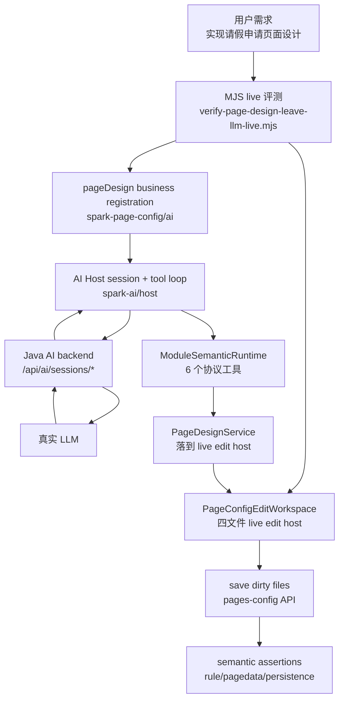

# PageDesign AI Engineering Flow

> 记录时间：2026-05-24
>
> 范围：本文梳理当前“页面设计 AI 一条线”的工程全过程，覆盖 live LLM 评测、前端 AI Host、V4 通信、pageDesign 业务注册、工具执行、四文件保存和验收闭环。
>
> 定位：这是当前实现的工程流程文档；源码出处用 `PAGE_DESIGN_AI_TRACE[...]` 标识，完整索引见 `docs/ai/PAGE_DESIGN_AI_TRACE_INDEX.md`，文件全文组织和注释边界见 `docs/ai/PAGE_DESIGN_AI_FILE_ORGANIZATION.md`。

## 一句话总览

用户输入“实现请假申请页面设计”后，前端通过 `@spark-view/spark-ai` 建立 AI 会话，把 `spark-page-config` 注册的 pageDesign 模块投影成 6 个稳定协议工具，真实 Java AI 后端只负责会话、LLM 和 SSE，LLM 通过工具调用回到前端执行 `dataset/node-tree/text-model` 动作，最后前端保存 `rule.json`、`pagedata.json`、`script.js`、`style.css` 并做语义验收。



## 工程分层

| 层 | 包/文件 | 责任边界 |
| --- | --- | --- |
| live 装配层 | `scripts/verify-page-design-leave-llm-live.mjs` | 登录、创建/替换测试页、注册 pageDesign、启动 AI、保存脏文件、远端回读、语义验收 |
| AI Host 层 | `packages/spark-ai/src/host` | 会话、tool loop、V4 HTTP/SSE transport、工具调用执行、append 后端历史 |
| module-semantic 层 | `packages/spark-ai/src/module-semantic` | 固定 6 个 LLM 协议工具、路径路由、`describeKind` 元数据、自描述动作 |
| pageDesign 业务层 | `packages/spark-page-config/src/ai` | lifecycle、dataset、node-tree、payload-catalog、text-model 五个子模块 |
| live edit bridge | `packages/spark-page-config/src/design/page-design-service.ts` | 把 AI 工具动作落到 `PageDesignEditHost`，修改前端 workspace 中的四文件模型 |
| 页面配置文件层 | `PageConfigEditWorkspace`、`PageConfigFileApi`、`FileLoader` | 加载/保存 `rule.json`、`pagedata.json`、`script.js`、`style.css` |
| Java 后端 | `/api/ai/**`、`/api/pages-config/**` | AI 会话、LLM 调用、V4 envelope、pages-config 持久化；不直接写 pageDesign 业务工具逻辑 |

## 源码锚点

使用下面命令查看整条 AI 线：

```bash
rg "PAGE_DESIGN_AI_TRACE" scripts packages/spark-ai/src packages/spark-page-config/src packages/spark-utils/src
```

关键锚点：

| Trace ID | 含义 |
| --- | --- |
| `live-llm-entry` | live LLM 评测入口 |
| `live-auth` | 登录/外部 token |
| `live-page-workspace` | 真实 pages-config API 到前端 workspace |
| `live-session-reset` | V4 session 隔离，避免复用旧历史 |
| `live-orchestrator` | live 主流程 |
| `host-session-entry` | 前端 AI 会话公开入口 |
| `host-session-start` | `onStartSession` 和工具投影 |
| `host-tool-loop` | LLM round、toolCalls、工具结果回填 |
| `host-transport-prepare-session` | SSE turn 前显式创建后端 V4 session |
| `host-transport-stream` | POST AI stream endpoint |
| `host-sse-v4-envelope` | V4 SSE 信封校验 |
| `host-sse-tool-call-payload` | toolCalls 提取兼容边界 |
| `host-transport-append` | assistant(tool_calls)+tool 结果 append 到后端会话 |
| `page-design-registration` | pageDesign 业务注册真源 |
| `page-design-dataset-tool` | 修改 `pagedata.json` |
| `page-design-node-tree-tool` | 修改 `rule.json`，校验 type/id/props |
| `page-design-payload-provider` | 组件 props 参数荷载指南 |
| `page-design-payload-props-validator` | props schema 校验，错误返回给 LLM |
| `page-design-text-model` | 修改 `script.js` / `style.css` |
| `page-design-workspace-load` | 四文件加载 |
| `page-design-workspace-save` | 四文件保存 |
| `file-loader-v4-envelope` | pages-config V4 HTTP envelope 解包 |

## 完整时序

### 1. live 脚本启动

入口：`scripts/verify-page-design-leave-llm-live.mjs`

职责：

- 读取环境变量，默认连接 `http://localhost:8080`。
- 登录获取 token，或使用 `SPARK_AUTH_TOKEN` / `SPARK_BACKEND_TOKEN`。
- 默认创建隔离测试页：`ai-leave-request-llm-smoke-<runId>`。
- 不启动 Java 后端、Maven、Docker。
- 创建 `PageConfigLoader`、`PageConfigFileApi`、`PageConfigEditWorkspace`。
- 加载目标页四文件。

关键约束：

- Java 后端必须已启动。
- LLM key 必须已配置。
- live 评测只操作专用测试页，避免覆盖真实业务页。

### 2. pageDesign 注册

入口：`packages/spark-page-config/src/ai/page-design-module.ts`

注册内容：

| 子模块 | 修改对象 | 典型动作 |
| --- | --- | --- |
| `lifecycle` | 编辑态/流程状态 | `bootstrap`、`describeProgress`、`describeDesignFlow` |
| `dataset` | `pagedata.json` | `createTable`、`createView`、`listTables` |
| `node-tree` | `rule.json` | `addNodes`、`removeNode`、`setProps`、`findByType` |
| `payload-catalog` | 组件 props 知识 | `queryPayloads`、`guidePayload` |
| `text-model` | `script.js` / `style.css` | `readStyle`、`writeStyle`、`readScript`、`writeScript` |

pageDesign 的系统提示词明确：

- 这是直接编辑，不是需求调研。
- 对申请类页面，必须从数据模型推进到 UI 结构。
- 数据集完成但 `rule.json` 仍是占位时，下一步必须写节点树。
- 常见表单组件可直接 `node-tree.addNodes`，由 node-tree 自动按 type 提取 payload guide 并校验 props。

### 3. AI Host session 启动

入口：`packages/spark-ai/src/host/business/business-session.ts`

流程：

1. `createAiHostBusinessSession()` 创建前端业务会话。
2. `session.start()` 调用 `startRegistrationSession()`。
3. pageDesign 的 `onStartSession` 执行 `PageDesignService.bootstrap()`。
4. `ModuleSemanticRuntime.getLlmTools()` 投影固定 6 个协议工具：
   - `getAttribute`
   - `setAttribute`
   - `invokeAction`
   - `listChildren`
   - `findInstance`
   - `describeKind`

这一步只建立 AI 会话和工具能力，不写页面文件。

### 4. V4 session 准备

入口：`AiHostFetchTransport.prepareSession()`

目的：

- 在 SSE turn 前显式调用 `POST /api/ai/sessions`。
- 带上前端确定的 `sessionId`、scope、tools、systemPrompt。
- 使用 `reuseScopeSession:false`，避免 Java 后端把旧 session 历史装回来。

注意：

- 这是后端 AI 会话准备，不是模型生成。
- 这是 AI 会话历史隔离，不是 pages-config 文件隔离。

### 5. LLM tool loop

入口：`packages/spark-ai/src/host/tool-loop/tool-loop-runner.ts`

每个 round 的顺序：

1. 组装 system prompt。
2. 从 pageDesign runtime 取得 6 个协议工具。
3. 发出诊断事件 `llm-request`。
4. 调用 `transport.streamTurn()`。
5. 读取 SSE result，解析文本和 toolCalls。
6. 对每个 toolCall 调用 `AiHostToolCallExecutor.execute()`。
7. 工具执行结果写入 sessionStore，并发出 `tool-result`。
8. 将 `assistant(tool_calls)` 和 `tool` 结果通过 `appendMessages()` 同步到 Java 后端。
9. 下一轮 `messages=[]`，让后端基于已 append 的会话历史继续。
10. 无 toolCalls 时自然结束。

核心点：

- V4 后端在有 toolCalls 时不应由最终 result 自动持久化 assistant 工具调用历史，前端 tool loop 必须 append。
- append 后端历史和保存页面四文件是两件事。
- 达到 `AI_MAX_TOOL_ROUNDS` 时必须 fail，不能静默宣称完成。

### 6. V4 SSE 通信

入口：

- `AiHostFetchTransport.streamTurn()`
- `readAiHostSseStream()`

协议要求：

- 只有 AI 生成流设置 `Accept: text/event-stream`。
- 普通 session create、append、pages-config 请求都使用 HTTP JSON。
- SSE `data:` 是 V4 envelope。
- `event.name` 必须等于 SSE frame 的 `event:`。
- `context.session.sessionId`、`context.turn.turnId`、`context.stream.streamKey` 必须匹配本次请求。

SSE reader 只做通用通信处理：

- 聚合 delta/reasoning/usage/result/done/error。
- 从 result、snake_case `tool_calls`、OpenAI choices 兼容路径提取 toolCalls。
- 不理解 pageDesign 业务，不写四文件。

### 7. 工具调用路由

入口：`ModuleSemanticRuntime.executeTool()`

LLM 只看到 6 个协议工具。业务动作通过：

```json
{
  "tool": "invokeAction",
  "args": {
    "path": "/pageDesign[page-id]/dataset[page-id]",
    "actionName": "createTable",
    "args": {}
  }
}
```

路由链路：

```text
toolCall
  -> ModuleSemanticToolCodec
  -> AiHostToolCallExecutor
  -> ModuleSemanticRuntime.executeTool
  -> ProtocolToolRouter
  -> Navigator
  -> ModuleKind.runAction
  -> PageDesignService
  -> PageDesignEditHost
```

这层的边界是“协议路由和参数校验”，不关心 Vue 渲染细节。

### 8. pageDesign 工具落到四文件

pageDesign 工具通过 `PageDesignService` 操作 `PageDesignEditHost`：

| 工具模块 | Host 能力 | 文件 |
| --- | --- | --- |
| `dataset` | `getDataSetTool()` / `onDataSetChanged()` | `pagedata.json` |
| `node-tree` | `getNodeTree()` / `onNodeTreeChanged()` | `rule.json` |
| `text-model` | `readScript/writeScript` | `script.js` |
| `text-model` | `readStyle/writeStyle` | `style.css` |

live 中的 edit host 来自 `PageConfigEditWorkspace`，所以 AI 工具只是在前端 workspace 中改模型。真正持久化发生在 live 脚本后续的 `saveDirtyFiles()`。

### 9. 参数荷载指南和校验

组件 props 的知识来源：

- `payload-catalog.queryPayloads`
- `payload-catalog.guidePayload`
- `packages/spark-page-config/src/ai/payloads/component-catalog.json`

当前策略：

- 常见 r-* 表单组件可以直接写。
- node-tree 写动作会按 `SparkNode.type` 自动提取 payload guide。
- 能提取 guide 的组件会做 props schema 校验。
- 参数错误时返回 `NODE_PAYLOAD_SCHEMA_INVALID`，包含 `code/msg/fix/checks`。
- LLM 应读取错误内容，修正后重试同一动作。

非 r-* 组件策略：

- node-tree 不再把“不是 r-*”当成唯一阻断条件。
- 标准 HTML 标签允许。
- payload-catalog 中可识别的组件允许。
- 函数执行不报错则放行；live 语义断言负责验收生成结果是否满足页面需求。

### 10. 四文件保存

入口：

- `PageConfigEditWorkspace.savePageFile()`
- `PageConfigFileApi.saveFileContent()`
- 真实后端 `/api/pages-config/**`

流程：

1. AI 工具修改 workspace document。
2. live 脚本检查 dirty 文件。
3. 保存 dirty 的四文件。
4. 再从后端读取四文件。
5. 比较远端内容和本地 workspace 内容。

注意：

- `appendMessages()` 只保存 AI 会话历史。
- `savePageFile()` 才保存页面配置四文件。
- `FileLoader` 需要解 V4 HTTP envelope 后再读取 `{ content, timestamp }`。

### 11. live 验收

入口：`validateArtifacts(files)`

验收不是快照，而是结构语义断言：

`pagedata.json` 必须：

- 可被 `parsePageData()` 解析。
- 包含请假主表。
- 覆盖申请人、请假类型、开始日期、结束日期、天数、事由、状态。
- 包含请假类型字典/选项。
- 至少有一个待审批或列表 DataView。

`rule.json` 必须：

- 可被 `compileRule()` 解析。
- 包含表单或字段组件。
- 包含请假类型、日期、天数、事由相关字段节点。
- 包含列表/表格区域。
- 收集到的 `dataViewKey` 必须能在 `pagedata.json` 中解析到真实 DataView。

持久化必须：

- 至少 `rule.json` 和 `pagedata.json` 变更并保存。
- 保存文件远端回读一致。
- LLM 至少发生一次工具调用。
- 未命中最大 tool round 上限。

## 请假申请 live 示例

执行：

```bash
pnpm run verify:ai:page-design-leave:llm
```

前置：

- Java 后端已启动。
- `OPENAI_API_KEY` / `OPENAI_BASE_URL` / `AI_MODEL` 已配置。
- 默认登录：`admin / admin123`。
- 默认租户/项目：`lmspark / homepage`。

可选调试：

```bash
AI_PRINT_FILES=1 pnpm run verify:ai:page-design-leave:llm
AI_MAX_TOOL_ROUNDS=40 pnpm run verify:ai:page-design-leave:llm
AI_PAGE_ID=my-ai-test-page pnpm run verify:ai:page-design-leave:llm
```

通过时应该看到：

- `ok: true`
- `changedFiles` 至少包含 `rule.json`、`pagedata.json`
- `savedFiles` 至少包含 `rule.json`、`pagedata.json`
- `verifiedFiles[*].matchesRemote === true`
- `semanticAssertions.ok === true`
- `persistenceAssertions.hasToolCalls === true`

## 常见卡点和定位

| 现象 | 优先看哪里 | 典型原因 |
| --- | --- | --- |
| 登录失败 | `live-auth` | 后端没启动、账号错误、token 过期 |
| 页面文件读取失败，缺 `content/timestamp` | `file-loader-v4-envelope` | HTTP 已升级 V4 envelope，loader 未解包 |
| SSE 报 session/turn/stream mismatch | `host-sse-v4-envelope` | 后端 V4 context 与本次请求不一致 |
| LLM 没有工具调用 | `diagnosticSummary.llmRequests` | tools 没送到后端、模型未按 function/tool call 返回 |
| 工具执行了但后端历史断掉 | `host-transport-append` / `host-append-envelope` | assistant(tool_calls)+tool 结果未 append |
| 只生成 pagedata，不写 rule | `page-design-registration` prompt、`page-design-node-tree-tool` | 模型卡在 payload 查询或未被提示必须进入 UI 阶段 |
| node-tree 写入失败 | `page-design-payload-props-validator` | props 不符合组件 payload schema |
| 远端回读不一致 | `page-design-workspace-save` | dirty 文件未保存或 pages-config 保存失败 |

## 重构边界

清理冗余时按以下边界判断：

- `spark-ai` 负责通用 AI 会话、V4 transport、tool loop、module-semantic 协议，不应该包含 pageDesign 业务判断。
- `spark-page-config/src/ai` 负责 pageDesign 业务注册和工具目录，可以包含页面设计提示词、数据/节点/样式工具。
- `PageDesignService` 是 AI 工具到 live edit host 的 bridge，不是 Java 后端 API 层。
- `PageConfigEditWorkspace` 是前端四文件编辑面，不是 AI 会话历史。
- `AiHostFetchTransport.appendMessages()` 是 AI 会话持久化，不是页面文件保存。
- `FileLoader` 的 V4 解包是通用文件读取兼容点，不属于 LLM 工具循环。
- Java AI 后端负责会话和 LLM 通信；本次流程不要求后端直接理解 pageDesign 函数。

## 推荐验证矩阵

改动 AI Host：

```bash
pnpm --filter @spark-view/spark-ai typecheck
pnpm --filter @spark-view/spark-ai test:run -- ai-host-fetch-transport.test.ts module-semantic-host.test.ts
```

改动 pageDesign AI 工具：

```bash
pnpm --filter @spark-view/spark-page-config typecheck
pnpm --filter @spark-view/spark-page-config test:run -- page-design-business-definition.test.ts page-design-node-tree-module-semantic.test.ts leave-application-page-design.test.ts
```

改动 pages-config 文件读取：

```bash
pnpm --filter @spark-view/spark-utils typecheck
pnpm --filter @spark-view/spark-utils test:run -- file-loader.test.ts
```

验证真实 LLM 闭环：

```bash
pnpm run verify:ai:page-design-leave:llm
```

## 当前成功闭环基线

最近一次通过的 live 闭环表现：

- 真实 Java AI 后端。
- 真实 LLM。
- 真实 `pageDesign` business registration。
- 生成并保存 `rule.json`、`pagedata.json`、`style.css`。
- `script.js` 可不变。
- 远端回读一致。
- 语义断言覆盖表、字段、字典、DataView、表单、列表、DataViewKey。
