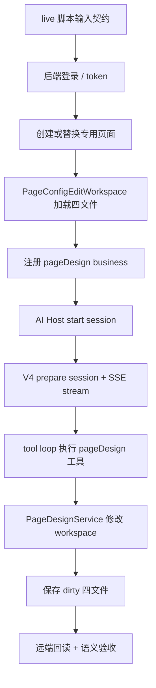

# PageDesign AI File Organization

> 记录时间：2026-05-24
>
> 范围：只覆盖“页面设计 AI 一条线”的相关文件，包含 live 评测、AI Host、V4 通信、pageDesign 业务注册、四文件编辑桥接、语义验收和源码追踪文档。
>
> 依据：注释必须遵守 `docs/ai/AI_CODE_GENERATION_BEHAVIOR.md` 的“注释规范”；本文把这些规范落到 pageDesign AI 的具体文件顺序和边界上。

## 组织原则

AI 线文件按三类顺序整理：

- 时序文件：按真实执行链路从入口到出口排列，例如 live 脚本、tool loop、SSE reader。
- 流程文件：按生命周期阶段排列，例如 session、workspace、pageDesign service。
- 功能文件：按稳定业务能力分组，例如 dataset、node-tree、payload-catalog、text-model。

注释只写边界、契约、顺序要求和风险：

- `PAGE_DESIGN_AI_TRACE[...]` 放在真实入口或职责边界首次出现处。
- 公共 API、跨包契约、生命周期钩子、V4 通信边界使用 JSDoc 或段落注释说明输入输出、失败模式和状态影响。
- DataSet、DataViewKey、script sandbox、payload props 校验等隐含约束必须在首次承载处说明。
- VCM/catalog/LLM 可见语义必须写在组件或 props 首次声明处，使用自然语言和结构化 tag。
- 不给私有小函数逐行解释，不用注释合理化静默兜底；错误应 fail-fast 或返回给 LLM 修正。

## 主时序

## 文件顺序表

| 文件 | 排序方式 | 全文结构 | 必须标注的注释边界 |
| --- | --- | --- | --- |
| `scripts/verify-page-design-leave-llm-live.mjs` | 时序 | 输入契约 -> 鉴权 -> 页面 workspace -> AI 后端会话 -> LLM turn -> 诊断摘要 -> 语义验收 -> 主编排 -> CLI 出口 | live 入口、登录边界、workspace 边界、session reset、artifact assertions、orchestrator |
| `docs/ai/PAGE_DESIGN_AI_ENGINEERING_FLOW.md` | 时序 | 总览 -> 分层 -> trace -> 完整时序 -> live 示例 -> 卡点 -> 边界 -> 验证矩阵 | 说明这是当前工程流程，不替代源码契约 |
| `docs/ai/PAGE_DESIGN_AI_TRACE_INDEX.md` | 功能 | 范围 -> trace 表 -> 清理边界 | 每个 trace 只指向一个真实职责边界 |
| `docs/ai/PAGE_DESIGN_AI_FILE_ORGANIZATION.md` | 功能 | 组织原则 -> 主时序 -> 文件顺序表 -> 重构检查 | 只定义 AI 线文件顺序，不扩到后端实现 |
| `packages/spark-ai/src/host/business/business-session.ts` | 流程 | public session options/types -> session factory -> start 生命周期 -> send 生命周期 -> release/diagnostics -> helpers | `onStartSession` 只 bootstrap 业务能力；Host 不保存页面四文件 |
| `packages/spark-ai/src/host/tool-loop/tool-loop-runner.ts` | 时序 | round 输入 -> tool 投影 -> transport.streamTurn -> tool call execute -> appendMessages -> round-limit 判定 -> diagnostics | append 后端会话历史和保存 page config 是两条链路 |
| `packages/spark-ai/src/host/transport/fetch-transport.ts` | 流程 | transport options -> prepareSession -> streamTurn -> appendMessages -> request helpers | V4 prepare/session/append 都是 AI 会话协议，不承载 pageDesign 业务 |
| `packages/spark-ai/src/host/transport/sse-stream-reader.ts` | 时序 | SSE frame 解析 -> V4 envelope 校验 -> delta/result 聚合 -> toolCalls 提取 -> error/done | V4 envelope 校验、tool call 兼容提取、stream identity mismatch |
| `packages/spark-ai/src/host/transport/fetch-response-envelope.ts` | 功能 | envelope 类型守卫 -> ok/error 解包 -> session/turn 校验 | append 响应成功不等于四文件保存成功 |
| `packages/spark-ai/src/host/transport/app-sse-events.ts` | 流程 | protocol types -> public API -> subscription flow -> request setup -> envelope normalization -> stream helpers | APP 公共 SSE 是框架无关订阅器，route/screenshot 等业务动作不下沉到 `spark-ai` |
| `packages/spark-ai/src/host/session/session-diagnostics.ts` | 流程 | diagnostic event shape -> collector -> snapshot/summary -> reset | 诊断只观测，不参与业务状态推进 |
| `packages/spark-page-config/src/ai/page-design-module.ts` | 功能 | module 常量 -> system prompt -> service bootstrap -> 子模块注册 -> business registration export | pageDesign 注册真源属于 `spark-page-config`，不是后端或 Host |
| `packages/spark-page-config/src/ai/lifecycle-tool-catalog.ts` | 流程 | metadata -> bootstrap/progress/design-flow actions -> ModuleKind factory -> helpers | 100 步流程只指导 LLM 下一步，不直接写文件 |
| `packages/spark-page-config/src/ai/dataset-tool-catalog.ts` | 功能 | params schema -> dataset actions -> ModuleKind factory -> DataSet helpers | 只能通过 `pagedata.json -> parsePageData -> DataSet` 管线修改数据模型 |
| `packages/spark-page-config/src/ai/node-tree-tool-catalog.ts` | 功能 | supported action schema -> payload guide 提取 -> props 校验 -> node actions -> ModuleKind factory -> tree helpers | 非 `r-*` 不在这里机械阻断；可执行且校验通过则交给语义验收兜底 |
| `packages/spark-page-config/src/ai/payload-catalog-tool-catalog.ts` | 功能 | catalog provider -> guide/query actions -> schema projection -> ModuleKind factory | `guidePayload` 是 LLM 参数荷载指南入口，props 错误要返回给 LLM |
| `packages/spark-page-config/src/ai/text-model-tool-catalog.ts` | 功能 | script/style action schema -> read/write actions -> ModuleKind factory | `script.js` 遵守脚本沙箱，禁止 `$data`、ESM import、window globals |
| `packages/spark-page-config/src/ai/page-design-session-diagnostics.ts` | 流程 | Host diagnostics 输入 -> pageDesign 语义归类 -> actionable summary | 只诊断 AI 线卡点，不吞掉工具执行错误 |
| `packages/spark-page-config/src/design/page-design-service.ts` | 流程 | edit host contract -> bootstrap/state -> dataset 操作 -> node-tree 操作 -> payload guide 状态 -> text model 操作 -> validators/helpers | AI 工具落到前端 live edit host 的唯一 bridge |
| `packages/spark-page-config/src/design/page-edit-workspace.ts` | 流程 | page selection -> four-file load -> document dirty state -> save -> list/create/delete page | 保存入口要 fail-fast；不要把缺失文件静默改成成功 |
| `packages/spark-page-config/src/design/artifacts/design-flow.ts` | 功能 | design-flow 数据 -> step lookup -> progress projection | 只表达流程知识，不直接操作 workspace |
| `packages/spark-utils/src/http/FileLoader.ts` | 流程 | request options -> fetch -> V4 envelope unwrap -> cache/memory storage -> result | pages-config HTTP V4 envelope 解包点，不处理 AI SSE |
| `src/services/sse-events.ts` | 流程 | event names -> payload contracts -> shared connection -> public subscription API -> lifecycle -> envelope compatibility -> typed normalization -> scalar readers | APP 壳层 SSE 单例连接；解包 V4 后按业务事件分发 |
| `src/services/ai-debug-bridge.ts` | 时序 | public contract -> route request flow -> screenshot request flow -> HTTP result reporting -> route/scope helpers -> scalar helpers | 后端 AI 调试事件在浏览器壳层执行，不能挪到框架无关包 |
| `packages/spark-component/src/components/containers/layout/RendererButton.props.ts` | 功能 | action 语义 -> DataView 目标 -> append/payload -> patch/field -> chain/message/confirm -> visual props | VCM/LLM 可见 props 必须在首声明处写自然语言语义和结构化 tag |

## 相邻边界

- `packages/spark-component/src/components/SparkComponentRenderer.vue` 是运行时渲染防线，保留 registry/global/native/fallback 等运行期兼容逻辑；AI 线只通过 payload guide 和 node-tree props 校验减少错误输入。
- `packages/spark-component/src/components/**/*.props.ts` 是 VCM/catalog 元数据源。新增或修改 LLM 可见组件能力时，纳入注释规范处理，但不把运行时渲染逻辑搬进 AI 线。
- `spark-ai-server/**` 本轮不改。Java 后端负责 V4 AI 会话、LLM 和 pages-config 持久化，pageDesign 业务生成逻辑仍在前端 AI 线。

## 重构检查

重排或清理冗余时按以下顺序检查：

1. 先用 `rg "PAGE_DESIGN_AI_TRACE"` 定位真实边界，不按文件名猜职责。
2. 确认文件属于时序、流程还是功能型，再决定是否移动代码块。
3. 移动代码块时只移动完整职责块，不拆散 trace 注释和对应入口。
4. 公共导出变化必须同步 package exports、TS path、Vite/Vitest alias 和 import smoke test。
5. 修改 V4 通信或 tool loop 后，至少跑 `@spark-view/spark-ai` 的 transport/session/tool-loop 相关测试。
6. 修改 pageDesign 工具后，至少跑 `@spark-view/spark-page-config` 的 page-design、node-tree、payload/session diagnostics 相关测试。
7. live LLM 脚本保持默认不进常规 CI；真实验收用 `pnpm run verify:ai:page-design-leave:llm`。
