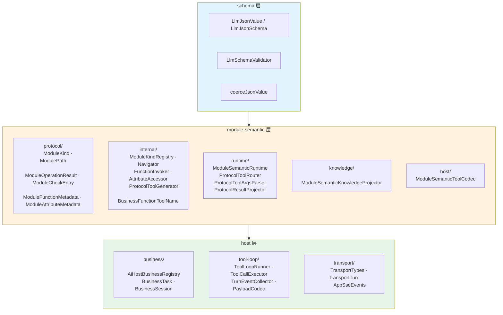
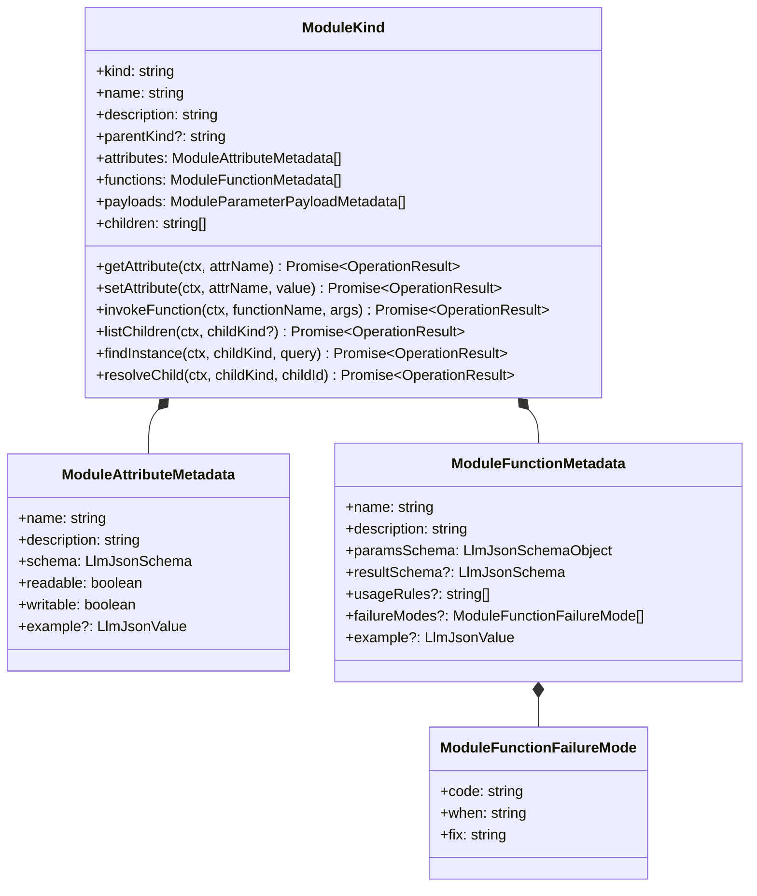
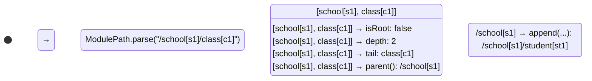
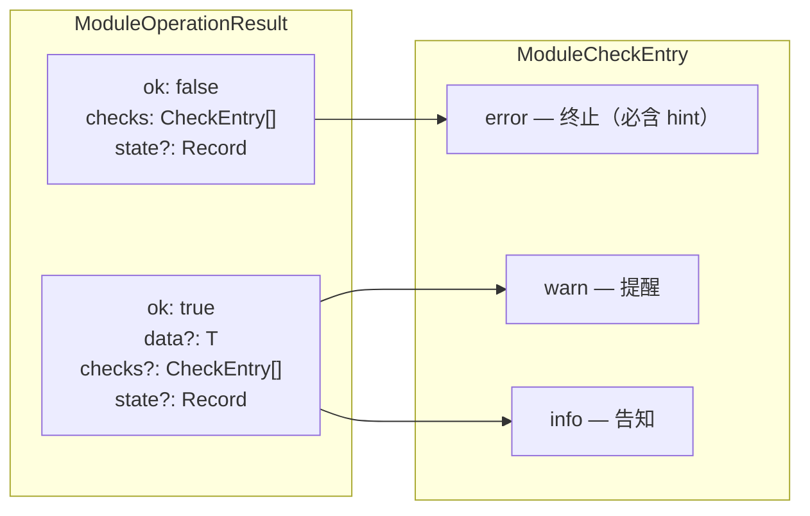
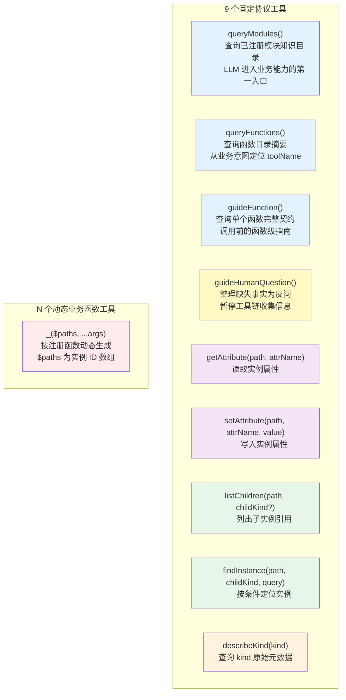
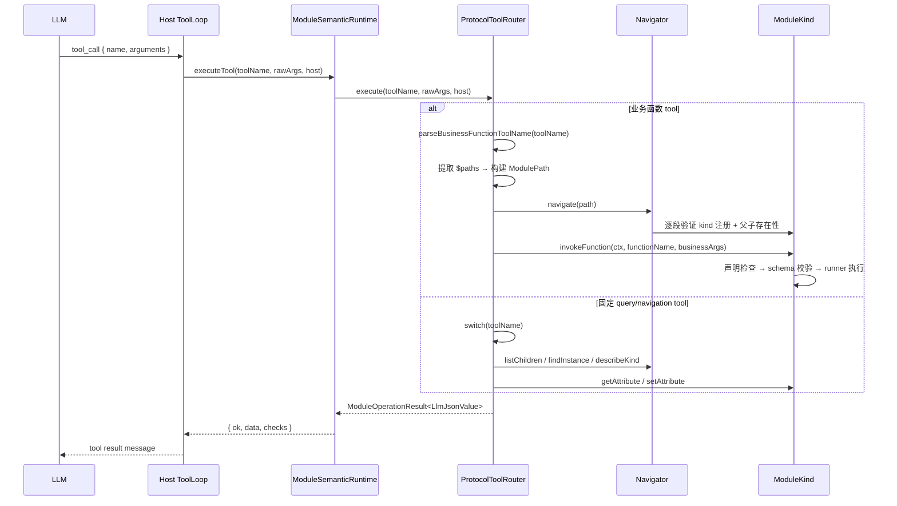
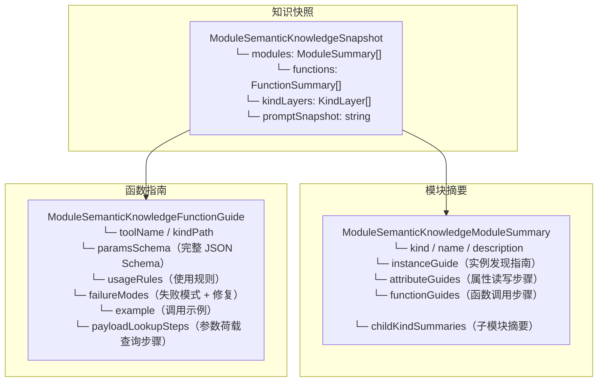
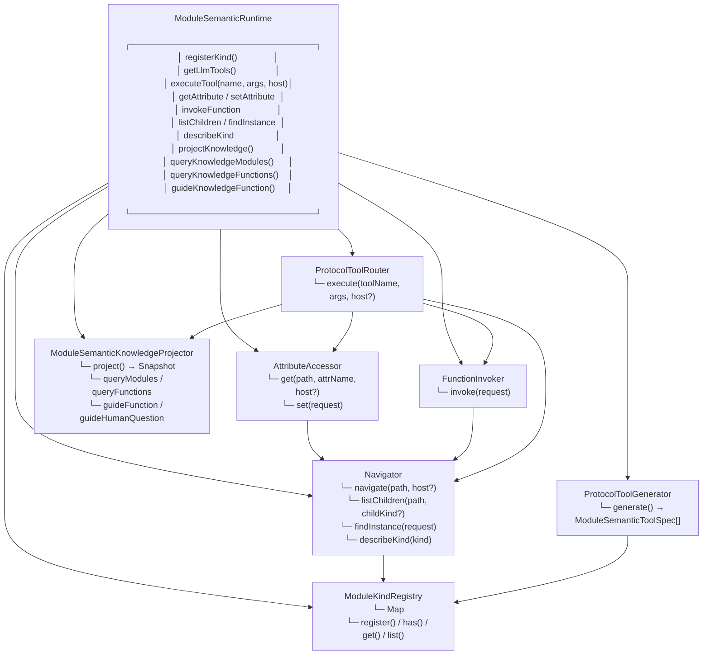

# SPARK AI 标准体系

> 代码即真相。本文从 `packages/spark-ai/src/` 源码出发，构建 SPARK AI 的完整标准体系。
> 面向 AI 编码助手、新业务接入者和架构评审。

---

## 目录

1. [三层架构](#1-三层架构)
2. [ModuleKind 协议核心](#2-modulekind-协议核心)
3. [路径系统](#3-路径系统)
4. [操作结果原语](#4-操作结果原语)
5. [工具调用协议](#5-工具调用协议)
6. [业务函数工具命名](#6-业务函数工具命名)
7. [知识投影系统](#7-知识投影系统)
8. [运行时组合根](#8-运行时组合根)
9. [Host 层工具循环](#9-host-层工具循环)
10. [业务注册模式](#10-业务注册模式)
11. [严格模式合规状态](#11-严格模式合规状态)
12. [错误码体系](#12-错误码体系)
13. [类型系统设计](#13-类型系统设计)

---

## 1. 三层架构



**依赖方向**：`schema` ← `module-semantic` ← `host`（单向，不可逆）

| 层 | 拥有 | 不拥有 |
|---|---|---|
| `schema` | JSON 值类型、JSON Schema 辅助、参数校验 | 业务语义 |
| `module-semantic` | ModuleKind 协议、路径导航、工具生成/路由、知识投影 | Host 会话、业务状态 |
| `host` | 业务注册、session、tool loop、会话历史、传输契约 | HTTP/SSE 网络 I/O、业务 live state |

**公共入口（4 个 subpath）**：

```ts
import { stringSchema, paramsSchema } from '@spark-view/spark-ai/schema'
import {
  ModuleKind,
  ModuleOperationResult,
  ModuleSemanticRuntime,
  type ModulePathContext,
} from '@spark-view/spark-ai/module-semantic'
import {
  AiHostBusinessRegistry,
  createAiHostBusinessSession,
  createAiHostBusinessTask,
} from '@spark-view/spark-ai/host'
```

---

## 2. ModuleKind 协议核心

`ModuleKind` 是协议的**中心抽象**。每个实例描述一个业务能力模块的完整契约。

### 2.1 概念模型



### 2.2 三大职责

| 职责 | 内容 | 载体 |
|---|---|---|
| **元数据声明** | 属性/函数/荷载/子模块清单 | 构造参数 `ModuleKindOptions` |
| **运行时委托** | 属性读写、函数执行、子实例发现 | `attributeAccessor` / `runner` / `list` / `find` |
| **协议级校验** | fail-fast 构造、JSON Schema 校验、值规整 | `ModuleKind` 内部方法 |

### 2.3 最小注册示例

```ts
import {
  ModuleKind,
  ModuleOperationResult,
  ModuleSemanticRuntime,
  type ModuleKindRunner,
  type ModulePathContext,
} from '@spark-view/spark-ai/module-semantic'
import type { LlmJsonValue } from '@spark-view/spark-ai/schema'

// 1. 创建运行时
const runtime = new ModuleSemanticRuntime()

// 2. 定义 runner
const runner: ModuleKindRunner = (ctx, functionName, args) => {
  if (functionName !== 'archive') {
    return ModuleOperationResult.failCode(
      'FUNCTION_NOT_DECLARED',
      `${functionName} 未实现`,
    )
  }
  return ModuleOperationResult.ok({ schoolId: ctx.segment.id, reason: args['reason'] })
}

// 3. 注册
runtime.registerKind(new ModuleKind({
  kind: 'school',
  name: 'School',
  description: '学校业务模块',
  functions: [{
    name: 'archive',
    description: '归档当前学校',
    paramsSchema: {
      type: 'object',
      required: ['reason'],
      properties: { reason: { type: 'string', description: '归档原因' } },
      additionalProperties: false,
    },
    usageRules: ['先调用 findInstance 获取当前学校 id'],
    failureModes: [{
      code: 'NOT_FOUND',
      when: '学校不存在',
      fix: '重新调用 findInstance',
    }],
    example: { reason: '测试归档' },
  }],
  runner,
  find: (ctx) => ModuleOperationResult.ok([{
    id: ctx.host?.moduleInstanceId ?? 'school-1',
    label: '当前学校',
  }]),
}))

// 4. 获取 LLM 工具列表
const tools = runtime.getLlmTools()
// → 包含 school_archive({ $paths: [string], reason: string })
```

### 2.4 构造三阶段

```
原始 options
  → 第一阶段：规范化（trim + 浅拷贝 + fail-fast 重复 name / 自引用）
  → 第二阶段：必填校验（attributes 非空时 attributeAccessor 必填）
  → 第三阶段：填充默认委托（runner/list/find 均有安全兜底）
  → ModuleKind 实例
```

### 2.5 协议方法校验链

**属性读取（5 步）**：
```
声明检查 → 可读检查 → 委托读取 → JSON 序列化 → schema 校验
```

**属性写入（4 步）**：
```
声明检查 → 可写检查 → schema 校验 → 委托写入
```

**函数调用（3 步）**：
```
声明检查 → 参数 schema 校验 → 委托执行
```

---

## 3. 路径系统

### 3.1 语法

```
/                                    → 根路径（空 segments）
/<kind>[<id>]                        → 单段路径
/<kind1>[<id1>]/<kind2>[<id2>]        → 多段路径
```

### 3.2 类型模型



### 3.3 核心 API

| 操作 | 说明 |
|---|---|
| `ModulePath.root()` | 创建根路径 `/` |
| `ModulePath.parse(raw)` | 从字符串解析（fail-fast 错误格式） |
| `ModulePath.of(segments)` | 从已有段构造 |
| `path.parent()` | 返回父路径（不修改原对象） |
| `path.append(segment)` | 追加一段（返回新实例） |
| `path.equals(other)` | 逐段深度比较 |
| `path.toString()` | 序列化为 `/kind[id]/kind[id]` |

### 3.4 路径解析错误码

| 错误码 | 触发条件 |
|---|---|
| `EMPTY` | 空字符串输入 |
| `MISSING_LEADING_SLASH` | 缺少前导 `/` |
| `INVALID_SEGMENT` | 方括号不成对或格式错误 |
| `EMPTY_KIND` | 段中 kind 为空 |
| `EMPTY_ID` | 段中 id 为空 |

---

## 4. 操作结果原语

`ModuleOperationResult<T>` 是所有协议操作的统一返回类型，借鉴 Rust `Result` 模式。

### 4.1 结构



### 4.2 工厂方法

```ts
// 成功
ModuleOperationResult.ok(data, checks?, state?)
ModuleOperationResult.ok()              // void 结果
ModuleOperationResult.ok(jsonValue)     // 数据结果

// 失败
ModuleOperationResult.failCode(code, message, hint?)              // 单 error
ModuleOperationResult.fail([error1, warn1, info1])               // 多条 checks
ModuleOperationResult.passthroughFailure(upstreamResult)          // 透传上游错误
```

### 4.3 类型参数约定

| `TData` | 用途 |
|---|---|
| `void` | `setAttribute` |
| `LlmJsonValue` | `getAttribute` / 业务函数调用 |
| `readonly ModuleInstanceRef[]` | `listChildren` / `findInstance` |
| `ModuleKindDescription` | `describeKind` |
| `never` | 失败结果（`fail()` / `failCode()`） |

---

## 5. 工具调用协议

### 5.1 完整工具集



### 5.2 LLM 推荐执行顺序

```
1. queryModules / queryFunctions     → 发现可用的 kind 和函数
2. guideFunction / describeKind      → 读取参数 schema 和调用规则
3. guideHumanQuestion                → 缺少用户事实时反问
4. listChildren("/")                 → 发现根级 kind
5. findInstance("/", kind, query)    → 定位具体实例 id
6. <kindPath>_<functionName>(...)    → 执行标准业务函数
7. 读取 result code/msg/fix          → 失败时按 failureModes 修正
8. 重试或 guideHumanQuestion         → 无法修正时反问用户
```

### 5.3 OpenAI Tool Spec 格式

每个工具投影为 OpenAI 兼容的 function tool spec：

```ts
type ModuleSemanticToolSpec = Readonly<{
  type: 'function'
  function: {
    readonly name: string        // toolName（如 "school_archive"）
    readonly description: string // 职责 + 何时使用 + 失败码
    readonly parameters: LlmJsonSchemaObject
    readonly strict?: boolean    // Host codec 显式投影
  }
}>
```

### 5.4 工具路由流程



---

## 6. 业务函数工具命名

### 6.1 命名规则

```
toolName = join(kindPath + [functionName], '_')

示例:
  kindPath = ['pageDesign', 'node-tree']
  functionName = 'getNode'
  → toolName = 'pageDesign_node-tree_getNode'
```

### 6.2 约束

| 约束 | 值 |
|---|---|
| 分隔符 | `_` |
| 最大长度 | 64 字符 |
| 段模式 | `/^[A-Za-z0-9-]+$/` |
| 最少段数 | 2（1 kind + 1 functionName） |
| 编码可逆性 | `parse → create` 往返恒等 |

### 6.3 业务参数注入

每个业务函数 tool 的 parameters 中自动注入 `$paths` 字段：

```json
{
  "$paths": {
    "type": "array",
    "items": { "type": "string" },
    "minItems": 2,
    "maxItems": 2,
    "description": "实例 ID 数组，顺序对应 kindPath: pageDesign -> node-tree"
  }
}
```

LLM 调用示例：

```json
{
  "toolName": "pageDesign_node-tree_getNode",
  "arguments": {
    "$paths": ["page-p1", "tree-t1"],
    "id": "node-n1"
  }
}
```

路由时 `$paths` 被自动转换为 `ModulePath.parse("/pageDesign[page-p1]/node-tree[tree-t1]")`，剩余字段成为业务参数。

### 6.4 防护规则

- 业务 `paramsSchema.properties` 中**禁止**包含 `$paths` 字段（fail-fast）
- 业务 `paramsSchema.required` 中**禁止**包含 `$paths`（fail-fast）
- 生成时自动合并 `{ $paths, ...businessProperties }` 和 `{ $paths, ...businessRequired }`

---

## 7. 知识投影系统

`ModuleSemanticKnowledgeProjector` 从已注册的 ModuleKind 集合中投影 LLM 可读的分层知识目录。

### 7.1 数据结构



### 7.2 四个查询入口

| 工具 | 输入 | 输出 |
|---|---|---|
| `queryModules(kind?, parentKind?, keyword?)` | 可选过滤 | `ModuleSummary[]` |
| `queryFunctions(kind?, keyword?)` | 可选过滤 | `FunctionSummary[]` |
| `guideFunction(toolName \| kind+functionName)` | 函数定位 | `FunctionGuide`（完整契约） |
| `guideHumanQuestion(context, reason)` | 上下文 + 原因 | 反问指南（shouldAskHuman + question + resumeFlow） |

### 7.3 实例发现指南

每个模块摘要包含 `instanceGuide`：

```ts
type ModuleSemanticKnowledgeInstanceGuide = Readonly<{
  refShape: string           // "root" | "parent"
  pathPattern: string        // "/pageDesign[{pageId}]"
  discoveryScope: 'root' | 'parent'
  queryFields: readonly string[]    // ["id", "label", "keyword"]
  queryExamples: ReadonlyArray<...> // [{ id: "page-1" }]
  discoverySteps: readonly string[] // 分步发现指令
  pathBuildSteps: readonly string[] // 路径构建指令
  operationSteps: readonly string[] // 操作步骤指令
}>
```

---

## 8. 运行时组合根

`ModuleSemanticRuntime` 是 module-semantic 层的顶层入口，组合所有内部组件。

### 8.1 组件组合



### 8.2 公共 API 分类

| 分类 | 方法 | 用途 |
|---|---|---|
| 注册 | `registerKind(kind)` | 启动期注册 |
| LLM 工具 | `getLlmTools()` / `executeTool()` | Host tool loop 调用 |
| 直接访问 | `getAttribute` / `setAttribute` / `invokeFunction` | 跳过工具路由 |
| 发现 | `listChildren` / `findInstance` / `describeKind` | 实例和元数据查询 |
| 知识 | `projectKnowledge` / `queryKnowledgeModules` 等 | LLM prompt 和诊断 |

---

## 9. Host 层工具循环

### 9.1 完整流程

```mermaid
sequenceDiagram
    participant User
    participant App as APP 层
    participant Session as BusinessSession
    participant Loop as ToolLoopRunner
    participant Collector as TurnEventCollector
    participant Executor as ToolCallExecutor
    participant RT as ModuleSemanticRuntime
    participant Backend as Java AI 后端

    User->>App: 输入需求
    App->>Session: createAiHostBusinessTask(kindID, input)
    Session->>Session: inputContract 校验 + normalize
    App->>Session: session.start()
    Session->>RT: getLlmTools()
    Session->>Session: 经 ModuleSemanticToolCodec 投影

    App->>Session: session.send(chatRequest)
    Session->>Loop: 启动 tool loop

    loop 每轮 LLM turn
        Loop->>Backend: executeTurn(messages, tools)
        Backend-->>Collector: APP SSE events (delta/reasoning/result/toolCalls)
        Collector-->>Loop: AiHostTransportTurnResult

        alt 有 tool_calls
            Loop->>Executor: executeToolCalls(toolCalls)
            Executor->>RT: executeTool(toolName, args, host)
            RT-->>Executor: ModuleOperationResult
            Executor-->>Loop: tool results
            Loop->>Loop: 追加 tool messages + 继续循环
        else 无 tool_calls
            Loop->>Session: 返回 final text
        end
    end

    Session-->>App: AI 回复
    App-->>User: 展示结果
```

### 9.2 聊天消息判别联合

```ts
// role='tool' 时 tool_call_id 必填；其他 role 禁止携带
type AiHostChatMessage =
  | Readonly<{ role: 'user' | 'assistant' | 'system'; content: string }>
  | Readonly<{ role: 'tool'; content: string; tool_call_id: string }>
```

### 9.3 传输层工具调用

```ts
// 所有字段必填，对齐 OpenAI 规范
type AiHostTransportToolCall = Readonly<{
  id: string
  type: 'function'
  function: {
    readonly name: string
    readonly arguments: string  // JSON 字符串
  }
}>
```

### 9.4 工具调用完整性规则

- `id` 缺失或空字符串 → 丢弃（`normalizeToolCall` 返回 null）
- `function.name` 缺失或空 → 丢弃
- `function.arguments` 非字符串 → 自动 `JSON.stringify`
- 不会为 malformed tool call 伪造 id

---

## 10. 业务注册模式

### 10.1 完整注册骨架

```ts
// 1. 定义稳定的 KIND_ID
const TODO_KIND_ID = 'todo'

// 2. 创建业务 service
class TodoService {
  bootstrap(listId: string) { /* ... */ }
  release(listId: string) { /* ... */ }
}

// 3. 创建 root ModuleKind
class TodoRootKind extends ModuleKind {
  public constructor() {
    super({
      kind: TODO_KIND_ID,
      name: 'Todo',
      description: '待办事项管理',
      children: ['todo-list'],
    })
  }
}

// 4. 创建 child ModuleKind + runner
function createTodoListRunner(service: TodoService): ModuleKindRunner {
  return (ctx, functionName, args) => {
    switch (functionName) {
      case 'addItem':
        return service.addItem(ctx.segment.id, String(args['title']))
      default:
        return ModuleOperationResult.failCode('FUNCTION_NOT_DECLARED', `${functionName} 未实现`)
    }
  }
}

// 5. 业务 definition factory
function createTodoBusinessKindDefinition(options: TodoBusinessOptions) {
  const service = new TodoService(options)
  const runtime = new ModuleSemanticRuntime()
  runtime.registerKind(new TodoRootKind())
  runtime.registerKind(new ModuleKind({
    kind: 'todo-list',
    name: 'Todo List',
    description: '待办列表',
    parentKind: TODO_KIND_ID,
    functions: [{
      name: 'addItem',
      description: '添加待办项',
      paramsSchema: paramsSchema({
        title: stringSchema('待办标题', { minLength: 1 }),
      }, ['title']),
    }],
    runner: createTodoListRunner(service),
  }))

  return {
    kindID: TODO_KIND_ID,
    name: 'Todo',
    description: '待办事项 AI',
    runtime,
    inputContract: {
      paramsSchema: paramsSchema({
        todoListId: stringSchema('待办列表 ID', { minLength: 1 }),
        userRequirement: stringSchema('用户原始需求', { minLength: 1 }),
      }, ['todoListId', 'userRequirement']),
      identityField: 'todoListId',
      normalize: (input) => ({
        ...input,
        todoListId: String(input.todoListId).trim(),
        userRequirement: String(input.userRequirement).trim(),
      }),
      toScope: (input) => ({ kindID: TODO_KIND_ID, instanceId: String(input.todoListId) }),
      toOrchestration: (input) => ({
        title: 'Todo registered task',
        userMessage: String(input.userRequirement),
        systemPrompt: '先定位实例，再只读确认进度，缺事实先反问。',
        readonlySteps: [
          'find current todo instance',
          'list existing items',
        ],
      }),
    },
    onStartSession: (context) => service.bootstrap(context.moduleInstanceId),
    releaseModuleInstance: (moduleInstanceId) => service.release(moduleInstanceId),
  }
}

// 6. 生成 registration
const registration = projectAiHostBusinessRegistration(
  createTodoBusinessKindDefinition(options),
)

// 7. 调用方入口
const task = createAiHostBusinessTask(registry, 'todo', {
  todoListId: 'list-1',
  userRequirement: '添加"买牛奶"到待办列表',
})
```

### 10.2 inputContract 职责矩阵

| 字段 | 作用 | 何时执行 |
|---|---|---|
| `paramsSchema` | 输入 JSON Schema | task 创建时、normalize 后（两次校验） |
| `identityField` | 业务实例主键 | scope 身份一致性校验 |
| `normalize()` | 去空白、规范枚举、补齐默认值 | task 创建流程 |
| `toScope()` | 输入 → `AiHostBusinessScope` | session 路由 |
| `toOrchestration()` | 生成首轮 LLM 消息 + 只读步骤 | session.send() |

### 10.3 pageDesign 注册结构

```
pageDesign (root)
├── lifecycle      — describeProgress / describeDesignFlow / completeStep
├── dataset        — createTable / addColumn / createView / ...
├── node-tree      — getNode / addNode / updateProps / ...
├── payload-catalog — getComponentPayload / listPayloadProviders / ...
└── text-model     — readScript / writeScript / readStyle / writeStyle
```

- 共 6 个 kind，72 个函数
- `instanceId` = `pageId`
- 写入顺序：dataset → node-tree → text-model

---

## 11. 严格模式合规状态

OpenAI `strict: true` 模式要求：

1. `additionalProperties` 必须为 `false` ✅
2. 所有 `properties` 必须在 `required` 中 ❌（已知 blocker）
3. `oneOf` 不能出现在 `strict: true` 的工具中 ❌（已知 blocker）
4. 可选字段需显式设为 `"type": ["string", "null"]` ❌（已知 blocker）
5. 所有嵌套对象也必须 `additionalProperties: false` ✅
6. 泛型 `type: ["string","number","boolean","object","array","null"]` ❌（已知 blocker）

### 11.1 状态矩阵

| 检查项 | 状态 | 说明 |
|---|---|---|
| 固定工具 `additionalProperties: false` | ✅ 已就绪 | 9 个固定工具全部声明 |
| 业务工具 `additionalProperties: false` | ✅ 已就绪 | `buildBusinessFunctionTool` 强制设定 |
| `required: []` 显式声明 | ✅ 已就绪 | `queryModules` / `queryFunctions` |
| `setAttribute.value` 多类型 | ✅ 已就绪 | 显式 type union |
| `$paths` minItems/maxItems | ✅ 已就绪 | 与 kindPath 长度一致 |
| `oneOf` 交叉校验 | 🔴 严格阻断 | `guideFunction` 含 `oneOf` |
| 业务可选字段未归一化 | 🔴 严格阻断 | 业务 `paramsSchema` 可选字段不在 `required` 中 |
| `instanceQueryProperty` 宽松 | 🔴 严格阻断 | `additionalProperties: true` |

### 11.2 测试覆盖

```ts
// strict-readiness: 已修复的合规项（非 true strict 问题）
it('strict-readiness: setAttribute.value 类型为显式 type union')

// strict-blocker: 真正的 strict 模式不兼容项
it('strict-blocker: guideFunction 包含 oneOf（OpenAI strict 模式禁止）')
it('strict-blocker: 业务 schema 可选字段未归一化到 required')
it('strict-blocker: findInstance.query 允许 additionalProperties')
```

---

## 12. 错误码体系

### 12.1 ModuleKind 内部错误

| 错误码 | 触发场景 |
|---|---|
| `FUNCTION_NOT_DECLARED` | kind 的 functions 表中无此函数 |
| `FUNCTION_NOT_IMPLEMENTED` | runner 未提供或未识别 functionName |
| `FUNCTION_EXECUTE_ERROR` | runner 抛出未捕获异常 |
| `ATTRIBUTE_NOT_DECLARED` | kind 的 attributes 表中无此属性 |
| `ATTRIBUTE_NOT_READABLE` | 已声明但 readable=false |
| `ATTRIBUTE_NOT_WRITABLE` | 已声明但 writable=false |
| `ATTRIBUTE_READ_FAILED` | attributeAccessor.get 异常 |
| `ATTRIBUTE_WRITE_FAILED` | attributeAccessor.set 异常 |
| `ATTRIBUTE_VALUE_NOT_FOUND` | 属性值为 undefined |
| `ATTRIBUTE_VALUE_NOT_JSON` | 属性值不可 JSON 序列化 |
| `SCHEMA_VALIDATION_FAILED` | 参数/属性值 JSON Schema 校验失败 |

### 12.2 Navigator 错误

| 错误码 | 触发场景 |
|---|---|
| `PATH_EMPTY` | 根路径用于属性/函数操作 |
| `KIND_NOT_REGISTERED` | 路径中的 kind 未注册 |
| `PATH_INVALID` | 父子关系验证失败 |
| `RESOLVE_ERROR` | resolveChild 执行出错 |
| `ROOT_LIST_REQUIRES_FIND` | 根路径 + childKind 调用 listChildren |
| `CHILD_KIND_NOT_DECLARED` | findInstance 的目标 kind 不在 children 中 |

### 12.3 Router 错误

| 错误码 | 触发场景 |
|---|---|
| `UNKNOWN_TOOL` | toolName 不在固定协议工具名集合中 |
| `INVALID_TOOL_ARGS` | 参数缺失、类型错误或格式不符 |
| `INVALID_PATH_{CODE}` | ModulePathParseError 投影（如 `INVALID_PATH_EMPTY`） |

### 12.4 稳定的契约字符串

`UNKNOWN_ACTION` 错误码**保留不变**。它是 `ModuleKind` 运行时的稳定契约字符串，已是现有业务方的错误匹配锚点。

---

## 13. 类型系统设计

### 13.1 设计原则

| 原则 | 说明 |
|---|---|
| 判别联合 | `AiHostChatMessage` 按 role 分支，禁止非法状态组合 |
| 必填字段优先 | `AiHostTransportToolCall` 全部字段必填（OpenAI 兼容） |
| 不可变 | 所有公共类型使用 `Readonly<>` |
| 宽松构造函数 | options 对象使用可选字段 + 默认值 |
| fail-fast 构造 | 非法值在构造期抛错，不允许静默回退 |

### 13.2 核心类型导出

```
schema/
  LlmJsonValue          → JSON 兼容值联合类型
  LlmJsonSchema         → JSON Schema 子集
  LlmJsonSchemaObject   → Object schema（paramsSchema 专用）
  LlmSchemaValidator    → 参数校验器

module-semantic/
  ModuleKind             → 协议中心 class
  ModulePath             → 不可变路径值对象
  ModulePathSegment      → 路径段
  ModuleOperationResult  → 统一操作结果
  ModuleCheckEntry       → 诊断条目
  ModuleSemanticRuntime  → 组合根
  ModuleFunctionMetadata → 函数元数据
  ModuleAttributeMetadata→ 属性元数据
  ModuleKindDescription  → kind 描述（describeKind 返回值）

host/
  AiHostChatMessage      → 聊天消息（判别联合）
  AiHostChatRequest      → 聊天请求
  AiHostTransportToolCall→ 传输层工具调用
  AiHostStreamEvent      → AI turn 事件
  AiHostFcCallRecord     → 工具调用记录
```

### 13.3 禁止事项

- 禁止旧 subpath：`/core`、`/protocol`、`/runtime`、`/adapter`
- 禁止 namespace 类型：`ModuleKind.PathContext`、`ModuleKind.OperationResult`
- 禁止 `interface` 滥用：单实现不建同名 interface
- 禁止匿名内联对象类型作为参数类型
- 禁止参数内嵌 JSDoc
- 禁止 4+ 个平铺参数（必须拆 options object）

---

## 附录 A：源码快速索引

| 问题 | 文件 |
|---|---|
| ModuleKind 核心 | [module-kind.ts](../packages/spark-ai/src/module-semantic/protocol/module-kind.ts) |
| 路径值对象 | [module-path.ts](../packages/spark-ai/src/module-semantic/protocol/module-path.ts) |
| 操作结果 | [module-operation.ts](../packages/spark-ai/src/module-semantic/protocol/module-operation.ts) |
| 元数据类型 | [module-metadata.ts](../packages/spark-ai/src/module-semantic/protocol/module-metadata.ts) |
| 运行时组合根 | [module-semantic-runtime.ts](../packages/spark-ai/src/module-semantic/runtime/module-semantic-runtime.ts) |
| 工具生成器 | [protocol-tool-generator.ts](../packages/spark-ai/src/module-semantic/internal/protocol-tool-generator.ts) |
| 工具路由器 | [protocol-tool-router.ts](../packages/spark-ai/src/module-semantic/runtime/protocol-tool-router.ts) |
| 业务函数命名 | [business-function-tool-name.ts](../packages/spark-ai/src/module-semantic/internal/business-function-tool-name.ts) |
| 导航器 | [navigator.ts](../packages/spark-ai/src/module-semantic/internal/navigator.ts) |
| 知识投影 | [module-semantic-knowledge.ts](../packages/spark-ai/src/module-semantic/knowledge/module-semantic-knowledge.ts) |
| 聊天类型 | [chat-types.ts](../packages/spark-ai/src/host/chat/chat-types.ts) |
| 传输类型 | [transport-types.ts](../packages/spark-ai/src/host/transport/transport-types.ts) |
| 工具循环 | [tool-loop-runner.ts](../packages/spark-ai/src/host/tool-loop/tool-loop-runner.ts) |
| 事件收集器 | [turn-event-collector.ts](../packages/spark-ai/src/host/tool-loop/turn-event-collector.ts) |
| pageDesign 注册 | [page-design-module.ts](../packages/spark-page-config/src/ai/page-design-module.ts) |

## 附录 B：命令速查

```bash
# spark-ai 包
pnpm --filter @spark-view/spark-ai run typecheck
pnpm --filter @spark-view/spark-ai run lint
pnpm --filter @spark-view/spark-ai run test:run

# spark-page-config 包
pnpm --filter @spark-view/spark-page-config run typecheck
pnpm --filter @spark-view/spark-page-config run lint

# 全量门禁
pnpm run verify:rules

# AI 端到端验收（按需）
pnpm run verify:ai:page-design-leave:llm
```

## 附录 C：术语迁移边界

| 范围 | 状态 |
|---|---|
| `spark-ai` protocol 层 action→function | ✅ 已完成 |
| `spark-ai` host 层术语统一 | ✅ 已完成 |
| `spark-ai` 测试文件同步 | ✅ 已完成 |
| `spark-page-config` 内部 `actionName` 参数 | 🔶 延后至 VCM 生成器迁移 |
| `spark-page-config` `@moduleAction` JSDoc tag | 🔶 VCM 生成器同时识别新旧 tag |
| `UNKNOWN_ACTION` 错误码 | 🔒 稳定契约，保留不变 |
