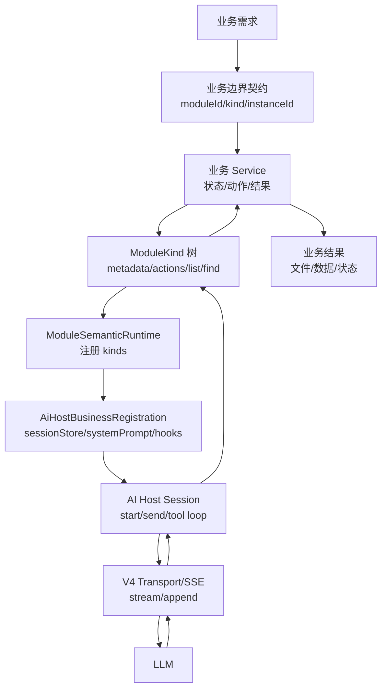

# SPARK AI 业务创建详细流程与下一版优化计划

> 记录时间：2026-05-24
>
> 范围：本文描述在 SPARK View 中新增一个 AI 业务的完整工程流程，覆盖业务边界定义、ModuleKind 设计、Host 注册、前端接入、诊断、测试和发布检查。
>
> 相关文档：
>
> - `docs/ai/AI_BUSINESS_FLOW.md`：当前 AI Host / module-semantic 总体流程
> - `docs/ai/SPARK_AI_CORE_RESPONSIBILITY_BOUNDARIES.md`：`spark-ai` 核心职责边界
> - `docs/ai/PAGE_DESIGN_AI_ENGINEERING_FLOW.md`：pageDesign AI 当前工程链路
> - `docs/ai/PAGE_DESIGN_AI_TRACE_INDEX.md`：pageDesign AI 源码 trace 索引

## 一句话原则

新增 AI 业务时，业务方只创建自己的 `ModuleSemanticRuntime`、`ModuleKind` 树、业务 service 和 `AiHostBusinessRegistration`；`spark-ai` 只负责会话、工具协议、tool loop 和 V4 通信，不承载具体业务状态或业务函数。



## 创建产物清单

一个标准 AI 业务通常需要这些产物：

| 产物 | 推荐位置 | 说明 |
| --- | --- | --- |
| 业务 service | 业务包内部，例如 `packages/spark-page-config/src/design/*` | 持有业务 live state、校验和实际执行动作。 |
| 一个或多个 `ModuleKind` | 业务包的 `src/ai/*` | 把业务能力投影成 LLM 可发现、可描述、可调用的模块。 |
| 业务注册函数 | 业务包的 `src/ai/<business>-module.ts` | 返回 `AiHostBusinessRegistration`。 |
| 公共注册门面 | 业务包 `src/ai/index.ts` | 只导出常规接入需要的少量入口。 |
| 诊断工具 | 业务包或 `spark-ai/host/session` | 通用诊断放 `spark-ai`，业务结构证据放业务包。 |
| 包级测试 | 业务包 tests | 覆盖注册、metadata、参数校验、工具执行、错误回传。 |
| live/smoke 脚本 | `scripts/` | 只负责登录、注册、启动会话、输入需求、验收结果。 |
| 文档与 trace | `docs/ai/` + 源码 `PAGE_DESIGN_AI_TRACE[...]` 类标识 | 记录真实入口和职责边界，方便后续清理冗余。 |

## 详细流程

### 1. 判断是否需要新增 AI 业务

先确认这是“可被 LLM 编排的一组业务能力”，而不是普通函数、页面按钮或后端 API 包装。

适合创建 AI 业务的场景：

- 需要多轮 LLM tool call 推进。
- 需要独立会话历史和实例隔离。
- 需要暴露多个动作、属性或子模块给 LLM 自发现。
- 需要结构化错误返回给 LLM 修正参数。
- 业务 live state 不应放在 `spark-ai` Host 中。

不适合创建 AI 业务的场景：

- 单个确定按钮动作。
- 纯 UI 展示逻辑。
- 只需要普通 HTTP 请求，不需要 LLM 工具编排。
- 业务规则会污染通用 Host、transport 或 schema 层。

### 2. 定义业务身份和会话语义

每个 AI 业务先定义稳定身份：

| 字段 | 含义 | 规则 |
| --- | --- | --- |
| `moduleId` | Host 业务注册 ID | 全局唯一，例如 `pageDesign`、`manualLeave`。 |
| root kind | ModuleKind 根节点 | 通常等于 `moduleId` 或稳定业务 kind。 |
| `instanceId` | 当前业务实例 ID | 用于会话隔离，例如 pageId、draftId、caseId。 |
| `moduleInstanceId` | 当前模块实例 ID | 对 pageDesign 等根业务通常等于 pageId。 |
| `sessionId` | 后端 AI 会话 ID | 由 Host 按 kind + instanceId 生成，业务不要自行拼。 |
| `turnId` | 单次用户输入回合 | 同一 session 内可有多个 turn。 |
| `streamKey` | 单个 SSE stream | 比 turn 更小，只属于一次模型流。 |

设计约束：

- 业务注册只关心业务身份，不直接操作 V4 session/turn/stream 协议。
- `kind + instanceId` 隔离会话。
- `kind + instanceId + turnId` 隔离对话回合。
- stream 小于 turn，不能用 stream 代替业务会话。

### 3. 设计业务 service

业务 service 是实际能力的主人，负责状态、校验、执行和资源释放。

推荐结构：

```ts
export class XxxAiService {
  private readonly states = new Map<string, XxxSessionState>()

  bootstrap(context: XxxContext): XxxResult<BootstrapData> {
    // 校验 live binding 或外部依赖。
  }

  runBusinessAction(context: XxxContext, args: unknown): XxxResult<unknown> {
    // 执行业务动作。
  }

  release(instanceId: string): void {
    this.states.delete(instanceId)
  }
}
```

service 的边界：

- 可以持有业务 live state。
- 可以访问业务包内领域对象。
- 可以返回 `{ ok:false, code, msg, fix }` 给 LLM。
- 不保存 AI Host 历史。
- 不解析 SSE。
- 不导入 `spark-ai/host/transport`。
- 不把具体业务塞到 `spark-ai` 通用层。

### 4. 设计 ModuleKind 树

`ModuleKind` 是 LLM 看见业务能力的结构化目录。

常见形态：

```text
businessRoot
├── lifecycle
├── data
├── structure
├── payload-catalog
└── text-model
```

设计步骤：

1. 先写根 kind，只负责声明子模块和实例发现。
2. 按职责拆子 kind，避免一个 kind 暴露几十个混杂动作。
3. 每个 kind 的动作必须有 `paramsSchema`、`resultSchema`、`usageRules`、`failureModes`、`example`。
4. 所有 action 参数使用标准 JSON Schema object root。
5. 读取动作和写入动作分清楚。
6. 能 fail-fast 的参数错误直接返回给 LLM，不做静默兜底。

LLM 只应该通过 6 个协议工具使用业务：

```text
listChildren
findInstance
describeKind
invokeAction
getAttribute
setAttribute
```

业务不要手写 OpenAI function schema；schema 由 `ModuleSemanticRuntime.getLlmTools()` 投影。

### 5. 为动作编写参数 schema 和错误回传

每个 action 的 schema 需要回答四个问题：

- LLM 必须传哪些字段？
- 字段类型、枚举、数组、对象嵌套是什么？
- 参数错时返回什么 code/msg/fix？
- LLM 如何查询缺失知识再重试？

推荐动作声明形态：

```ts
const ACTIONS: readonly ModuleActionMetadata[] = [
  {
    name: 'createThing',
    description: '创建业务对象。',
    paramsSchema: paramsSchema({
      name: stringSchema('业务对象名称。'),
    }, ['name']),
    resultSchema: {
      thing: 'Thing — 创建后的业务对象。',
    },
    example: { name: 'demo' },
    usageRules: [
      '创建前先读取当前状态，避免覆盖已有对象。',
    ],
    failureModes: [
      {
        code: 'DUPLICATE_NAME',
        when: '名称已存在。',
        fix: '读取现有对象后选择新的 name，或改用 update 动作。',
      },
    ],
  },
]
```

错误返回原则：

- 参数校验错误必须能被 LLM 读懂并修正。
- `code` 稳定，`msg` 描述事实，`fix` 给下一步动作建议。
- 不把错误吞掉后继续写入。
- 不把“业务验收失败”伪装成工具成功。

### 6. 实现 ModuleKind

ModuleKind 只做协议适配和 service 委托。

推荐边界：

```ts
export class XxxModuleKind extends ModuleKind {
  protected override runAction(
    ctx: ModulePathContext,
    actionName: string,
    args: Readonly<Record<string, LlmJsonValue>>,
  ): Promise<ModuleOperationResult<LlmJsonValue>> {
    if (this.findAction(actionName) === undefined) {
      throw new Error(`${this.kind} action is not declared: ${actionName}`)
    }
    const result = this.service.runAction(this.contextFactory(ctx), actionName, args)
    return Promise.resolve(this.serviceResultToOperationResult(result))
  }
}
```

ModuleKind 应负责：

- 声明 LLM 可见 metadata。
- 做 actionName 路由。
- 做必要的写入前通用约束校验。
- 把 service result 转成 ModuleOperationResult。

ModuleKind 不应负责：

- 保存 Host session。
- 调后端 LLM。
- 管 SSE stream。
- 把测试脚本里的具体验收逻辑下沉进底层。

### 7. 创建业务注册函数

业务注册函数把 service、runtime、sessionStore 和生命周期钩子组合起来。

标准骨架：

```ts
export function createXxxBusinessRegistration(options: XxxBusinessOptions): AiHostBusinessRegistration {
  const service = new XxxAiService(options)
  const runtime = new ModuleSemanticRuntime()

  runtime.registerKind(new XxxRootModuleKind())
  runtime.registerKind(new XxxLifecycleModuleKind({ service, contextFactory }))
  runtime.registerKind(new XxxActionModuleKind({ service, contextFactory }))

  return {
    moduleId: XXX_MODULE_ID,
    name: 'Xxx Business',
    description: '业务能力简述。',
    runtime,
    sessionStore: new DefaultAiHostSessionStore(),
    systemPrompt: createXxxSystemPrompt,
    onStartSession: (context) => {
      const bootstrap = service.bootstrap(toServiceContext(context))
      if (!bootstrap.ok) throw new Error(bootstrap.msg)
    },
    afterFunctionCall: (call) => {
      // 根据业务结果决定 continue / complete / abort。
      return { status: 'continue' }
    },
    releaseModuleInstance: (moduleInstanceId) => {
      service.release(moduleInstanceId)
    },
  }
}
```

system prompt 原则：

- 只写协议入口、执行纪律和边界。
- 不把大 catalog、模板、业务样例整包塞进去。
- 复杂知识通过业务工具查询，例如 `describeDesignFlow`、`guidePayload`。
- 明确“未写入不要宣称完成”。

### 8. 暴露公共入口

公共入口应窄。

推荐只导出：

```ts
export {
  XXX_MODULE_ID,
  createXxxBusinessRegistration,
  registerXxxBusiness,
} from './xxx-module'
```

不要为了测试或方便把内部 Provider、Resolver、Context、Options 全部铺到 public barrel。

如果调用方完成基础流程需要超过 1-3 个导入，要重新审视门面设计。

### 9. 接入前端或 smoke

前端或 smoke 应保持薄：

```ts
const registry = new AiHostBusinessRegistry()
registerXxxBusiness({ registry, getHost: () => host })

const session = createAiHostBusinessSession({
  registry,
  transport,
  maxToolRounds,
}, new AiHostBusinessTarget(XXX_MODULE_ID, instanceId))

await session.start()
await session.send({
  historyMsgs: [{ role: 'user', content: requestText }],
})
```

smoke 可以做：

- 登录。
- 创建/选择业务实例。
- 注册业务。
- 启动 Host/SSE。
- 输入用户需求。
- 保存结果。
- 验收业务结果。
- 输出 session transcript 和 tool result 诊断。

smoke 不应该做：

- 手写工具 schema。
- 复制业务 action 参数规则。
- 复制 ModuleKind 路由。
- 把 LLM 该查询的知识直接塞满 prompt。

### 10. 增加诊断和 trace

每条 AI 业务至少要能看到：

- LLM 收到的 systemPrompt 和 messages。
- LLM 返回的 toolCalls。
- 每个 toolCall 的 args、result、error。
- Host session history。
- spark-ai 历史会话是 Agent 能力诊断和再次接入同一会话的起点；业务 smoke 只读取摘要，不维护第二份完整历史。
- 业务产物快照。
- 业务验收失败原因。

trace 标识建议：

```ts
// PAGE_DESIGN_AI_TRACE[xxx-entry]: 描述真实职责边界。
```

trace 只放在真实入口或职责边界首次出现处，不给普通 helper 滥加。

### 11. 测试矩阵

新增 AI 业务至少覆盖：

| 测试 | 目标 |
| --- | --- |
| public import smoke | 公共入口可解析，导出面不过宽。 |
| business registration test | moduleId、runtime、sessionStore、systemPrompt、hooks 正确。 |
| ModuleKind metadata test | `describeKind` 能看到 action schema、usageRules、failureModes。 |
| action success test | 典型 tool call 能落到 service 并改变业务状态。 |
| action failure test | 参数错误返回稳定 code/msg/fix，并能回灌给 LLM。 |
| session diagnostics test | 能提取历史、tool result、失败调用。 |
| smoke script syntax | mjs 脚本可被 `node --check` 解析。 |
| package typecheck/lint | 包级类型与 lint 通过。 |

真实 LLM smoke 只在需要验收端到端效果时跑，不作为每次本地快速检查的前置。

## 当前实现分析

### 已经比较稳的部分

- `spark-ai` 已形成 `schema -> module-semantic -> host` 三层边界。
- LLM 可见工具固定为 6 个协议工具，业务 action 不直接暴露成散乱 function schema。
- Host session、tool loop、transport 和业务 live state 已经分离。
- pageDesign 已把 dataset、node-tree、payload-catalog、text-model 拆成子 kind。
- 参数错误可以通过 `{ ok:false, code, msg, fix }` 回灌给 LLM。
- smoke 已能输出真实 Agent ⇄ LLM 会话历史和 tool result。

### 当前痛点

| 痛点 | 影响 |
| --- | --- |
| 新建业务仍依赖人工照着 pageDesign 写 ModuleKind | 容易复制过多历史代码或漏掉 hook、schema、failureModes。 |
| action metadata、service 方法、测试断言之间缺少统一生成或校验 | schema 漂移时不容易第一时间发现。 |
| 公共 barrel 容易不小心导出内部 Options/Context/Provider | `verify:rules` 会报 flat public surface，维护成本上升。 |
| trace 文档和源码标识靠人工保持同步 | trace 行号或职责描述可能过期。 |
| live smoke 里容易混入业务验收以外的生成逻辑 | 会掩盖底层工具职责不清的问题。 |
| V4 通信层仍有少量类型断言历史债 | 规则门禁会持续提示，但这部分不应在业务开发时顺手乱改。 |
| 业务知识查询方式还不够标准化 | 容易退回“一次性把模板/catalog 塞给 LLM”的旧路线。 |

### 关键风险

- 把具体业务规则下沉到 `spark-ai`，会破坏通用 Host 边界。
- 把所有知识塞进 system prompt，会导致 token 膨胀、LLM 不查询工具、错误难诊断。
- smoke 如果承担业务生成逻辑，会让真实前端 Agent 和测试路线不一致。
- 只验证最终文本，不验证 tool history，会看不到“指南没喂给 LLM”“工具错误没回灌”的问题。

## 下一版优化计划

### P0：创建业务模板和检查清单

目标：让新增业务不再从 pageDesign 复制整套代码。

改进项：

- 新增 `docs/ai/AI_BUSINESS_CREATION_CHECKLIST.md`。
- 提供最小业务模板：
  - `createXxxBusinessRegistration`
  - `XxxService`
  - `XxxRootModuleKind`
  - `XxxLifecycleModuleKind`
  - `xxx-business-definition.test.ts`
- 文档明确哪些代码允许在业务包，哪些不能进 `spark-ai`。

验收标准：

- 新业务创建者可以按模板完成最小 AI 业务。
- 不需要修改 `host/tool-loop/transport`。
- package typecheck/lint/test 能通过。

### P1：业务定义收敛成单一门面

目标：减少手写 glue code 和过宽导出。

建议引入一个具体 class，而不是一组平铺 interface：

```ts
export class AiBusinessDefinition {
  // 持有 moduleId、name、runtime、service、hooks 的组合入口。
}
```

注意：这不是为了抽象而抽象；只有当 pageDesign、manualLeave 和后续业务出现稳定重复后再落地。

可先做轻量 helper：

- `createBusinessRuntime(kinds)`
- `createBusinessRegistration(definition)`
- `createRootModuleKind(children)`

验收标准：

- 常规业务注册导入不超过 3 个公共符号。
- `src/ai/index.ts` 不再导出内部 Options/Context。
- `verify:rules` 不再报业务包 flat public surface。

### P2：Action metadata 与测试自动校验

目标：action schema、usageRules、failureModes 不再靠人工检查。

改进项：

- 增加 `assertModuleKindActionMetadata(kind)` 测试 helper。
- 校验每个 action：
  - 有 `paramsSchema`
  - 有 `resultSchema`
  - 有 `example`
  - 写动作有 `failureModes`
  - 参数 schema 是 object root
- 增加 public import smoke，防止公共导出漂移。

验收标准：

- 新增 action 漏写 failureModes 时测试失败。
- action schema 不是 object root 时测试失败。
- describeKind 输出覆盖到测试快照或结构断言。

### P3：知识查询标准化

目标：所有业务都走“先查询知识，再 FC”，避免 prompt 灌知识。

建议统一三类知识入口：

| 知识类型 | 工具形态 | 示例 |
| --- | --- | --- |
| 流程知识 | `lifecycle.describeFlow({ intent })` | pageDesign 100 步、申请表单 guide |
| 参数知识 | `payload-catalog.query/guide` | 组件 props、业务 payload |
| 当前状态 | `describeProgress/readState` | 当前草稿、当前页面四文件状态 |

验收标准：

- system prompt 不包含大 catalog、完整模板或大段样例。
- smoke 能在 session history 中看到知识查询 tool call。
- 如果 LLM 没查询必要知识，smoke 应失败并输出诊断。

### P4：诊断与 replay 能力

目标：失败后能还原“LLM 看到了什么、工具返回了什么、为什么没闭环”。

改进项：

- 历史会话只保留在 `spark-ai` 的 `sessionStore` / diagnostics 能力中；它用于 Agent 能力诊断和再次接入同一会话，smoke 默认只输出摘要和当前运行验收结果，不再另存完整历史副本。
- 增加统一 `tool-result` 摘要格式。
- 支持从 smoke JSON replay 某个 tool call 参数到业务 service。
- 文档化常见失败：
  - 未 guide payload
  - paramsSchema 不匹配
  - tool round limit
  - appendMessages 成功但四文件未保存
  - sessionId/turnId/streamKey 不匹配

验收标准：

- 任意 live smoke 失败后，可通过 `spark-ai` 会话历史定位最后一个失败 tool call。
- 能区分 AI 会话持久化失败和业务成果保存失败。

### P5：源码 trace 自动一致性检查

目标：trace 文档和源码标识不再人工对齐。

改进项：

- 增加脚本扫描 `PAGE_DESIGN_AI_TRACE[...]`。
- 校验 docs trace 表中的 ID 与源码 ID 一一匹配。
- 输出缺失、多余、重复 ID。
- 可选：不强校验行号，避免普通重排导致文档频繁失效。

验收标准：

- 文档缺一个 trace ID 时 CI 报错。
- 源码新增 trace 未登记时 CI 报错。
- 重排行号不导致失败。

### P6：V4 通信层类型债单独收口

目标：清掉 `verify:rules` 中剩余的通信层类型断言，但不在业务开发中顺手改协议。

建议单独开任务处理：

- `packages/spark-ai/src/host/transport/app-sse-events.ts`
- `packages/spark-ai/src/module-semantic/protocol/module-kind.ts`
- `packages/spark-ai/src/tests/*`

验收标准：

- `pnpm run verify:rules` 全绿。
- 不改变 V4 envelope 语义。
- transport/session/tool-loop 相关测试全过。

## 下一版推荐落地顺序

1. 先做 P0/P2/P5：成本低，马上降低复制和文档漂移风险。
2. 再做 P3/P4：提升真实 LLM 失败诊断能力。
3. 最后做 P1/P6：P1 需要等更多业务重复稳定，P6 需要单独保护 V4 协议。

## 新 AI 业务完成标准

一个新 AI 业务可以认为“创建完成”，需要同时满足：

- 业务有稳定 `moduleId`、root kind、instanceId 语义。
- 业务只通过 `AiHostBusinessRegistration` 接入 Host。
- LLM 可通过 `describeKind` 看到完整 action metadata。
- 工具参数错误能结构化返回给 LLM。
- 业务 live state 不在 `spark-ai`。
- smoke 脚本不复制业务工具逻辑。
- 至少有注册、metadata、成功工具调用、失败工具调用、诊断输出测试。
- 包级 typecheck、lint、相关 vitest 通过。
- 如果新增 trace，文档台账同步更新。
