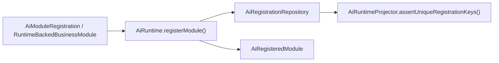
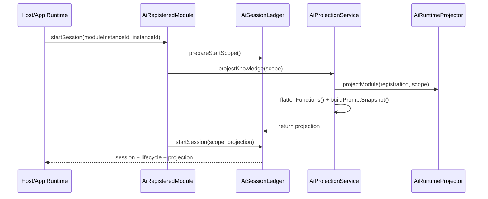
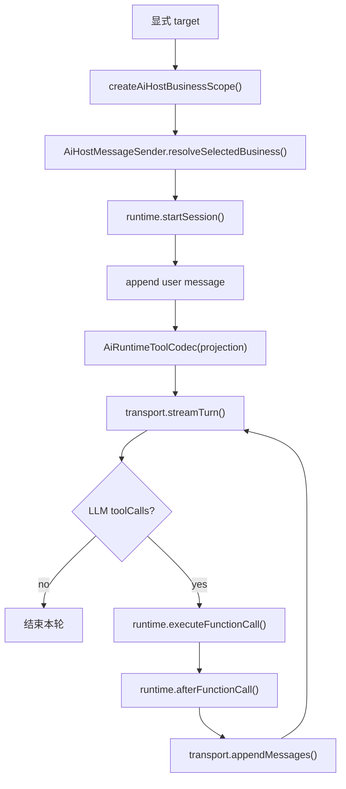
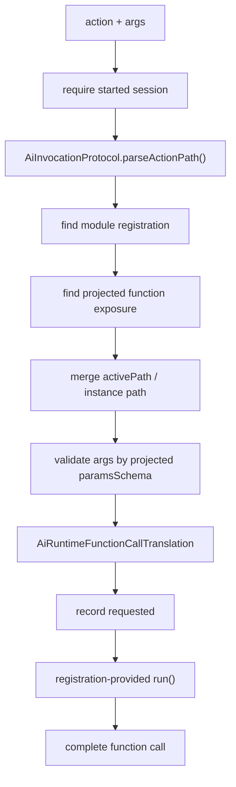

# SPARK AI Runtime 源码职责边界深读

> 本文是 `@spark-view/spark-ai` 的源码阅读笔记，重点解释 AI Runtime 的职责边界、运行链路和扩展约束。
> AI 使用入口与产品接入说明仍以 [SPARK_AI_PACKAGE_USAGE_GUIDE.md](./SPARK_AI_PACKAGE_USAGE_GUIDE.md) 为准。
> SPARK AI Platform、App AI Center、Runtime、AI Backend 和业务注册的最新定稿以 [SPARK_AI_PLATFORM_ARCHITECTURE_BOUNDARIES.md](./SPARK_AI_PLATFORM_ARCHITECTURE_BOUNDARIES.md) 为 SSOT。

## 阅读范围

本次重点阅读：

- `packages/spark-ai/src/index.ts`
- `packages/spark-ai/src/core/index.ts`
- `packages/spark-ai/src/core/protocol/*`
- `packages/spark-ai/src/core/internal/runtime/*`
- `packages/spark-ai/src/core/internal/knowledge/*`
- `packages/spark-ai/src/core/internal/invocation-helpers.ts`
- `packages/spark-ai/src/core/internal/tool-codec.ts`
- `packages/spark-ai/src/core/internal/tool-exposure-policy.ts`
- `packages/spark-ai/src/core/internal/llm-params-validator.ts`
- `packages/spark-ai/src/core/host/*`
- 对照阅读 `packages/spark-page-config/src/ai/registrations/**`、`packages/spark-ai/src/tests/*ai*.test.ts` 和 `packages/spark-page-config/src/tests/*ai*.test.ts`

一句话结论：

`@spark-view/spark-ai` 是框架无关的 AI Runtime。它负责 AI 协议、AI 注释/元数据契约、LLM 知识投影、action 翻译、函数执行编排、会话账本、SSE/host transport 契约和默认 fetch 实现；它不拥有业务 live state、不解析业务入口、不实现具体页面或请假业务，也不绑定某个前端框架或模型 SDK。

## 分层地图

| 层 | 主要文件 | 负责 | 不负责 |
| --- | --- | --- | --- |
| protocol | `core/protocol/*` | 定义模块、函数、参数 schema、会话、runtime scope、执行上下文等稳定契约 | 保存状态、执行函数、访问 UI 或业务服务 |
| runtime internal | `core/internal/runtime/*` | 组合 runtime、注册模块、投影知识、翻译 action、记录会话历史、编排函数调用 | 业务状态、业务校验语义、真实业务副作用 |
| knowledge internal | `core/internal/knowledge/*` | 保存最近一次 projection 的轻量查询视图，提供 `queryFunctions`、`queryModules`、`guideFunction` | 自动发现业务能力、生成业务策略 |
| invocation/tool helpers | `invocation-helpers.ts`、`tool-codec.ts`、`tool-exposure-policy.ts` | action 解析、tool 名称编码、provider 工具参数转换、分阶段工具暴露 | 调用模型、执行工具、决定业务结束 |
| host | `core/host/*` | 显式业务会话、业务 runtime 注册表、消息发送、工具调用循环、HTTP/SSE transport 契约与默认 fetch 实现 | 业务按钮 target 解析、Vue 面板状态、后端 LLM 具体实现 |
| page-config registrations | `packages/spark-page-config/src/ai/registrations/**` | 把具体业务服务包装为 core 可注册模块和 host runtime | core 的通用协议和账本实现 |

## Runtime 的主边界

### Runtime 拥有的东西

1. 模块注册契约

`AiModuleRegistration` 是业务能力进入 core 的唯一稳定契约。模块提供 `moduleId`、`name`、`description`、可选 `prompt`、子模块树和 `getFunctions()`。

注册校验由 `AiRegistrationRepository` 和 `AiRuntimeProjector.assertUniqueRegistrationKeys()` 完成：

- 根模块注册不能重复。
- 同一注册树内 `moduleId` 必须唯一。
- `moduleId`、`functionId`、`instanceParam.name` 不能是空值，也不能包含 `/` 或 `@`。
- 同一模块节点内 `functionId` 不能重复。

2. 模块绑定 API

`AiRuntime.registerModule()` 只返回 `AiRegisteredModule`。会话、投影、翻译、执行、历史读取都必须通过这个 module-bound handle 进入。

这条边界避免调用方绕开 `moduleId`，也是当前 class-first 清理后的核心公共路径。

3. LLM 知识投影

`AiProjectionService.projectKnowledge()` 读取注册树，把业务模块转成 `AiRuntimeKnowledgeProjection`：

- 递归生成 `AiRuntimeModuleExposure`。
- 展平 `availableFunctions`。
- 聚合模块 prompt 为 `promptSnapshot`。
- 给 instance-scoped 函数注入上下文参数 schema。
- 把 projection 更新到 `AiKnowledgeProjector`，供 knowledge 工具查询。

4. action 协议与翻译

规范 action 格式为：

```text
rootInstance[/childInstance]@moduleId@functionId
```

实例 ID 允许包含 `/` 或 `@`，但必须 URI 编码。旧格式 `module/.../function` 仍可解析，仅用于历史兼容。

`AiFunctionCallTranslator` 负责把 action 和 args 翻译成 `FunctionExecutionContext`：

- 校验会话已启动。
- 校验 action 指向当前 root module instance。
- 根据注册树找到目标模块。
- 根据 projection 找到目标函数 exposure。
- 合并 action instance path、`activePath` 和 root scope。
- 校验上下文实例 ID 是否冲突或缺失。
- 根据投影后的 JSON Schema 校验 LLM 参数。
- 把上下文参数放进 `effectiveArgs`，但从传给业务函数的 `executionArgs` 中剥离。

翻译阶段不执行业务函数。

5. 会话账本

`AiSessionLedger` 是 core 内部会话事实源：

- session key 是 `moduleId + "\0" + moduleInstanceId`。
- `instanceId` 和 `runtimeInstanceId` 是技术会话别名，不能被绑定到另一个业务 scope。
- `startSession()` 可以重启同一业务实例会话，并保留已有 history。
- `stopSession()` 把状态改为 `Stopped`，后续翻译会返回 `SESSION_STOPPED`。
- 返回给外部的 session、history、projection 都会 clone，避免调用方反向修改账本。

6. 函数执行编排

`AiFunctionCallExecutor` 不知道业务函数怎么做。它只负责：

- 调用 translator。
- 记录 `requested` 函数调用历史。
- 执行调用方传入的 `run()`。
- 执行可选 `validate()` 和 `normalizeResult()`。
- 捕获执行异常并转成 `EXECUTE_ERROR`。
- 记录 `completed` 或 `failed`。
- 生成给 LLM 的 tool result message。

真实业务副作用由注册方提供的 `run()` 持有。

### Runtime 不拥有的东西

1. 不拥有业务 live state

例如：

- 请假草稿状态在 `LeaveRequestService`。
- 页面编辑 live state 在 `PageDesignService` 和 `PageDesignEditHost`。
- 页面配置真实来源仍是 `rule.json`、`pagedata.json`、`script.js`、`style.css` 及其服务层。

Runtime 只记录 AI 会话和函数调用历史，不把业务数据复制成第二份真源。

2. 不解析业务入口

显式 target 由 App 层或按钮层决定：

```text
businessRegistrationId + businessInstanceId
```

Runtime 不根据自然语言选择业务，也不创建业务实例。host 只把显式 target 规范化成 scope。

3. 不绑定前端框架

`spark-ai` 的 runtime 和 host 都不依赖 Vue、Vue Router、Element Plus。框架接入应在 App 层完成。

4. 不绑定模型 SDK

`AiHostTransport` 是抽象传输契约。默认 `AiHostFetchTransport` 只负责 HTTP/SSE 协议形状：

- `/sessions/{sessionId}/turn/stream`
- `/sessions/{sessionId}/turn/append`
- `/upload`

模型供应商、后端推理和 provider SDK 不属于 runtime。

5. 不决定业务生命周期语义

工具调用后是否继续、完成或中止，由业务 runtime 的 `afterFunctionCall()` 返回 `AiHostBusinessLifecycleDirective` 决定。

例如 `LeaveRequestHostRuntime` 在 `submitDraft` 成功后返回 `complete`，在 `cancelDraft` 成功后返回 `abort`。Runtime 不知道这些业务含义。

## 运行链路

### 1. 注册阶段



注册只建立能力目录，不启动会话，也不触碰业务 live state。

### 2. 启动会话与投影



`startSession()` 的语义是“通知 core 某个业务实例进入 AI 会话，并生成当前 LLM 可见能力快照”，不是“创建业务对象”。

### 3. Host 发送一轮消息



Host 层只做跨框架编排。它依赖业务 runtime 暴露的 `startSession()`、`appendMessage()`、`executeFunctionCall()` 等方法，不直接访问业务服务。

### 4. 函数调用翻译与执行



这里最重要的边界是：translator 产出可执行上下文，executor 编排调用，业务模块决定实际怎么执行。

## 关键类职责

| 类 | 文件 | 职责边界 |
| --- | --- | --- |
| `AiRuntime` | `core/internal/runtime/ai-runtime.ts` | composition root，只组装 repository、ledger、projection、translator、executor 和 handle factory |
| `AiRegisteredModule` | `core/internal/runtime/ai-registered-module.ts` | module-bound API，给所有 runtime 操作自动注入 `moduleId` |
| `AiRegistrationRepository` | `core/internal/runtime/ai-registration-repository.ts` | 保存顶层模块注册，拒绝重复注册 |
| `AiRuntimeProjector` | `core/internal/runtime/ai-runtime-support.ts` | 无状态投影工具，负责模块树、prompt、函数 exposure、上下文参数注入 |
| `AiProjectionService` | `core/internal/runtime/ai-projection-service.ts` | projection 门面，协调注册、scope、projector 和 knowledge projector |
| `AiSessionLedger` | `core/internal/runtime/ai-session-ledger.ts` | AI 会话账本，维护 lifecycle、history、alias 绑定和快照 clone |
| `AiFunctionCallTranslator` | `core/internal/runtime/ai-function-call-translator.ts` | action 和 args 的准入闸，产出 `FunctionExecutionContext` |
| `AiFunctionCallExecutor` | `core/internal/runtime/ai-function-call-executor.ts` | 函数调用编排和历史落账，不实现业务逻辑 |
| `AiInvocationProtocol` | `core/internal/invocation-helpers.ts` | action 解析、错误字符串化、tool result 序列化、JSON 片段抽取、usage 归一化 |
| `AiRuntimeToolCodec` | `core/internal/tool-codec.ts` | 把 projection function exposure 转为 LLM provider 可用的 tool spec，并维护 toolName 到 action 的映射 |
| `AiKnowledgeProjector` | `core/internal/knowledge/knowledge-projection.ts` | 保存 projection 查询视图，给 knowledge 工具返回轻量目录或单函数指南 |
| `AiHostMessageSender` | `core/host/sending.ts` | 显式业务 scope 下的一轮消息发送入口 |
| `AiHostToolLoopRunner` | `core/host/tool-loop.ts` | LLM stream、tool call、tool result append 的循环 |
| `AiHostFetchTransport` | `core/host/fetch-transport.ts` | 默认 HTTP/SSE transport，实现传输协议，不实现模型推理 |
| `RuntimeBackedBusinessModule` | `packages/spark-page-config/src/ai/registrations/internal/registration-base.ts` | page-config registrations 层桥接类，把业务模块包成 core runtime-backed module |

## 重要不变量

1. Class-first 是主路径

Core 当前明确移除了旧 `I*` 注册兼容契约、`registerBusiness()`、`AiRegisteredBusinessApi`、`createAiRuntimeToolCodec()` 等旧入口。新增模块应继承或组合现有 class，不恢复旧兼容层。

2. `getFunctions()` 是函数表唯一主路径

模块函数定义从 `getFunctions()` 读取，不通过 `.functions` 兼容属性读取。

3. 参数 schema 必须是标准 JSON Schema object

`paramsSchema` 根节点必须是 `type: 'object'`。旧私有 DSL 不再合法。`LlmParamsValidator` 使用 AJV 校验反序列化后的 LLM args。

4. action 是 LLM 可见能力地址

action 同时承载业务实例路径、目标模块和函数 ID。实例路径段可以 URI 编码，模块 ID 和函数 ID 不能包含 `/` 或 `@`。

5. projection 是调用时知识快照

函数能不能调用，以当前 projection 的 `availableFunctions` 为准。直接拿注册表猜函数会绕过 schema、上下文参数注入和工具暴露策略。

6. 业务上下文参数对 LLM 可见，对业务执行隐藏

instance-scoped 子模块会把 `departmentId`、`personId` 这类上下文参数注入到 LLM schema 中，翻译通过后再从 `executionArgs` 剥离，业务函数通过 `FunctionExecutionContext.moduleInstances` 获取上下文。

7. Session ledger 是 AI 会话事实源，不是业务事实源

Ledger 只保存 AI 消息、函数调用状态、latest projection 和 lifecycle。业务数据状态仍由业务服务维护。

8. Host 只消费显式 target

`AiHostBusinessScope` 来自 `businessRegistrationId` 和 `businessInstanceId`。打开面板前必须已经解析 target。

9. Tool 暴露可能分阶段

当 projection 函数很多时，`createInitialAiToolActionSet()` 默认只暴露 `knowledge` 和 `lifecycle` 模块。`guideFunction` 成功后可通过 `addGuidedAiToolAction()` 打开被指向的 action。

10. Fail-fast 是默认风格

重复注册、未知模块、schema 非 object、会话未启动、scope mismatch、实例上下文冲突都会显式失败。少数边界处的容错用于协议适配，例如 host 层无法解析 tool args 时传 `{}`，最终仍由 schema 校验报告缺失参数。

## 新增业务模块时的推荐接入方式

1. 定义业务服务

业务服务拥有 live state 和真实副作用，例如草稿、页面编辑 host、数据保存等。

2. 定义函数注册

每个函数提供：

- `functionId`
- `description`
- 标准 JSON Schema `paramsSchema`
- 可选 `resultSchema`
- 可选 `usageRules`
- 可选 `failureModes`

3. 用 class-first 模块承载注册

优先使用：

- `StaticAiToolModule`
- `RuntimeBackedBusinessModule`
- 已有业务模块本地 class 层次

4. 在 `executeFunctionCall()` 中把 core 调用转给业务服务

业务模块通过 `executeRegisteredFunctionCall()` 提供 `validate`、`run`、`normalizeResult` 和 `errorFix`。

5. 业务服务注册 runtime

业务服务所在包把业务 module 包装成 `AiHostBusinessRuntime`，并通过契约交给 `spark-ai` 消费。App AI Center host 只启动/承载 SSE transport，不持有 registry，也不包装 page-design、leave-request 等具体业务模块。

6. 生命周期由业务 runtime 决定

如果某个函数调用后应该结束会话或释放业务实例，在 `afterFunctionCall()` 和 `endBusinessInstance()` 中表达。

## 维护时不要跨过的边界

- 不要让 core 直接导入 Vue、Element Plus、Router 或页面组件。
- 不要把业务 live state 放进 `AiSessionLedger`。
- 不要新增语义路由，让 core 根据用户文本选择业务。
- 不要从 App 层绕过 `AiRegisteredModule` 直接访问 internal repository 或 ledger。
- 不要绕过 projection 直接拼 action 或直接执行注册函数。
- 不要把 page-design 或 leave-request 的领域判断上移到 core。
- 不要恢复旧 `I*` 注册接口、旧 business API 或 `.functions` 兼容读取。
- 不要使用非标准 JSON Schema 或私有参数 DSL。

## 源码阅读后的判断

当前 `@spark-view/spark-ai` 的 runtime 边界是清楚的：

- `core` 是协议、注释元数据、会话、投影、翻译和执行编排层。
- `host` 是跨框架 AI 会话发送、SSE/HTTP transport 和工具循环层。
- `packages/spark-page-config/src/ai/registrations` 是业务适配层。
- 业务服务是 live state 和真实副作用层。
- App/UI 是 SSE 服务启动、AI 包传输、面板状态和用户交互层，不拥有业务注册。

因此，后续改动应优先判断问题属于哪一层：协议问题改 `core/protocol`，会话或 action 问题改 `core/internal/runtime`，LLM transport 问题改 `core/host`，具体业务能力问题改 `packages/spark-page-config/src/ai/registrations` 或对应业务服务。不要因为 AI 调用链跨层，就把业务语义塞回 core。
