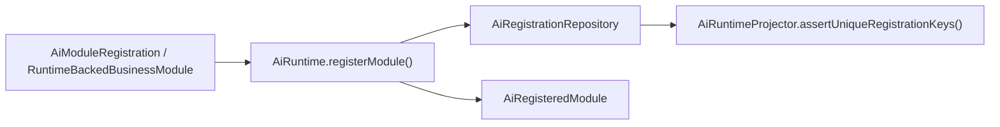
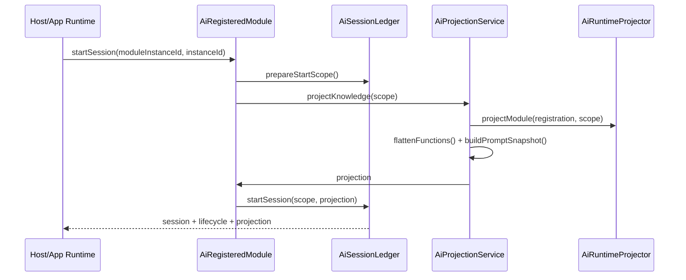
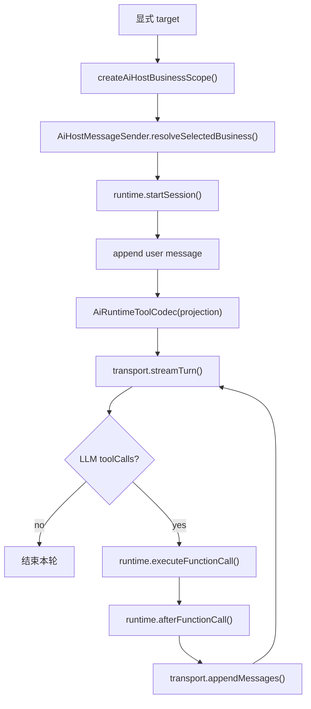
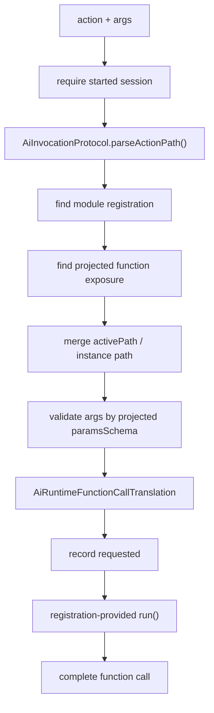

# SPARK AI Runtime Core 源码职责边界深读

> 本文是 `@spark-view/spark-ai` 当前源码的职责边界阅读笔记。
> 这里的 `core` 指运行时内核概念，不再指物理目录；当前源码已扁平为 `protocol/`、`internal/`、`host/`。
> AI 使用入口与产品接入说明仍以 [SPARK_AI_PACKAGE_USAGE_GUIDE.md](./SPARK_AI_PACKAGE_USAGE_GUIDE.md) 为准。
> SPARK AI Platform、App AI Center、Runtime、AI Backend 和业务注册的架构分工以 [SPARK_AI_PLATFORM_ARCHITECTURE_BOUNDARIES.md](./SPARK_AI_PLATFORM_ARCHITECTURE_BOUNDARIES.md) 为 SSOT。

## 一句话结论

`@spark-view/spark-ai` 是框架无关的 AI Runtime 包。它拥有协议契约、模块注册契约、知识投影、action 翻译、函数调用编排、AI 会话账本、host 工具循环和默认 HTTP/SSE transport；它不拥有页面配置语义、不拥有业务 live state、不导入 `spark-page-config`，也不绑定 Vue、Element Plus、Router 或具体模型 SDK。

当前物理分层是：

```text
packages/spark-ai/src/
├── index.ts              # 包根公共出口：protocol + host
├── protocol/             # 对外协议层与公共导出面
├── internal/             # runtime/knowledge/tool helper 内部实现
├── host/                 # 跨框架 host 会话、工具循环、transport
└── tests/                # runtime 公共面与边界守卫
```

`package.json` 中的 `./core` 仍然存在，但它只是兼容导出到包根；新代码应使用 `@spark-view/spark-ai`、`@spark-view/spark-ai/protocol`、`@spark-view/spark-ai/host`。

## 阅读范围

本次重点阅读：

- `packages/spark-ai/src/index.ts`
- `packages/spark-ai/src/protocol/index.ts`
- `packages/spark-ai/src/protocol/business-registration.ts`
- `packages/spark-ai/src/protocol/runtime-protocol.ts`
- `packages/spark-ai/src/protocol/session-events.ts`
- `packages/spark-ai/src/protocol/parameter-schema.ts`
- `packages/spark-ai/src/protocol/runtime-contracts.ts`
- `packages/spark-ai/src/internal/runtime/*`
- `packages/spark-ai/src/internal/knowledge/*`
- `packages/spark-ai/src/internal/invocation-helpers.ts`
- `packages/spark-ai/src/internal/tool-codec.ts`
- `packages/spark-ai/src/internal/tool-exposure-policy.ts`
- `packages/spark-ai/src/internal/llm-params-validator.ts`
- `packages/spark-ai/src/internal/json-schema-helpers.ts`
- `packages/spark-ai/src/host/*`
- `packages/spark-ai/src/tests/ai-runtime-public-api.test.ts`
- `packages/spark-ai/src/tests/ai-runtime-business.test.ts`
- 对照阅读 `packages/spark-page-config/src/assistant/registrations/**` 和 `packages/spark-page-config/src/page/**`

## 分层地图

| 层 | 主要文件 | 负责 | 不负责 |
| --- | --- | --- | --- |
| public entry | `packages/spark-ai/src/index.ts` | 聚合公开出口，导出 `protocol` 与 `host` | 暴露 internal 文件路径、导出具体业务注册 |
| protocol | `packages/spark-ai/src/protocol/*` | 模块注册、函数注册、参数 schema、会话事件、runtime scope、函数执行上下文、公共 helper 导出 | 保存状态、执行函数、访问 UI、访问业务服务 |
| runtime internal | `packages/spark-ai/src/internal/runtime/*` | 组合 runtime、保存注册表、投影知识、翻译 action、维护会话账本、编排函数执行 | 业务状态、业务语义校验、真实业务副作用 |
| knowledge internal | `packages/spark-ai/src/internal/knowledge/*` | 保存最新 projection 的查询视图，提供函数目录、模块目录、单函数指南 | 自动发现业务、生成领域策略、读取 page config |
| invocation/tool helpers | `packages/spark-ai/src/internal/invocation-helpers.ts`、`tool-codec.ts`、`tool-exposure-policy.ts`、`llm-params-validator.ts`、`json-schema-helpers.ts` | action 解析、tool spec 编码、分阶段 tool 暴露、AJV 参数校验、JSON Schema 构造 | 调模型、执行工具、决定业务生命周期 |
| host | `packages/spark-ai/src/host/*` | 显式业务会话、业务 runtime 注册表、turn 规整、工具调用循环、HTTP/SSE transport 契约和默认 fetch 实现 | 解析业务按钮、持有 Vue 面板状态、实现后端模型 provider |
| page-config assistant | `packages/spark-page-config/src/assistant/registrations/**` | 把具体页面配置与请假业务能力包装成 `spark-ai` 可消费的模块和 host runtime | 定义 `spark-ai` 通用协议、修改 runtime ledger |
| page-config page | `packages/spark-page-config/src/page/**` | 页面配置模型、加载、导航、workspace、编辑服务与页面文件语义 | AI runtime 的会话、action 协议、LLM tool 编码 |

## 公共导出边界

`packages/spark-ai/src/index.ts` 只做两件事：

```ts
export * from './protocol'
export * from './host'
```

`packages/spark-ai/src/protocol/index.ts` 是公共协议层的主出口。它集中导出：

- `AiModuleRegistration`、`AiFunctionRegistration`、`AiModuleRegistrationBase`
- `AiRuntime*` 会话、投影、函数调用、history 类型
- `AiInvocationProtocol`
- `AiRuntimeToolCodec`
- `createInitialAiToolActionSet()`、`addGuidedAiToolAction()`
- `LlmParamsValidator`
- JSON Schema helper
- `AiKnowledgeProjector`、`AiKnowledgeCatalog`
- `AiRuntime`、`AiRegisteredModule`

这意味着“公共导出的内容移入协议层”后的消费原则是：

- 应用与业务适配包需要 runtime 协议时，导入 `@spark-view/spark-ai/protocol`。
- 应用需要 host 会话、transport、registry 时，导入 `@spark-view/spark-ai/host`。
- 不要从 `@spark-view/spark-ai/internal/*` 导入。
- `@spark-view/spark-ai/core` 只用于旧路径兼容，不是新代码入口。

## Core Runtime 主边界

### 1. 模块注册契约

`AiModuleRegistration` 是业务能力进入 runtime 的唯一稳定契约。模块提供：

- `moduleId`
- `name`
- `description`
- 可选 `prompt`
- 可选 `instanceParam`
- 子模块树 `modules`
- 函数表 `getFunctions()`

`AiModuleRegistrationBase` 是 class-first 的基础实现。它只保存不可变 metadata，不负责执行函数。

注册校验集中在 `AiRegistrationRepository` 与 `AiRuntimeProjector.assertUniqueRegistrationKeys()`：

- 顶层 `moduleId` 不能重复。
- 同一注册树内 `moduleId` 必须唯一。
- `moduleId`、`functionId`、`instanceParam.name` 不能空，也不能包含 `/` 或 `@`。
- 同一模块节点内 `functionId` 不能重复。

注册阶段只建立能力目录，不启动会话，也不触碰业务 live state。

### 2. Module-bound API

`AiRuntime.registerModule()` 返回 `AiRegisteredModule`，外部 runtime 操作都应该从这个 module-bound handle 进入：

- `startSession()`
- `stopSession()`
- `projectKnowledge()`
- `appendMessage()`
- `recordFunctionCallRequest()`
- `completeFunctionCall()`
- `translateFunctionCall()`
- `executeFunctionCall()`
- `getSession()`、`listSessions()`、`getSessionHistory()`

这条边界把 `moduleId` 固定在 handle 上，避免调用方绕过注册边界直接操作 repository 或 ledger。

### 3. 知识投影

`AiProjectionService.projectKnowledge()` 读取注册树，把业务模块转换为 `AiRuntimeKnowledgeProjection`：

- 递归生成 `AiRuntimeModuleExposure`。
- 展平 `availableFunctions`。
- 聚合模块 prompt 为 `promptSnapshot`。
- 给 instance-scoped 子模块函数注入上下文参数 schema。
- 更新 `AiKnowledgeProjector`，供 knowledge 工具查询。

Projection 是当前会话的 LLM 可见能力快照。函数能不能被调用，以 projection 的 `availableFunctions` 为准，而不是以注册表静态猜测为准。

### 4. action 协议与翻译

规范 action 格式是：

```text
rootInstance[/childInstance]@moduleId@functionId
```

实例路径段允许通过 URI 编码包含 `/` 或 `@`。旧格式 `module/.../function` 仍可解析，但只用于历史兼容。

`AiFunctionCallTranslator` 负责把 action 和 args 翻译为 `FunctionExecutionContext`：

- 校验会话已启动，且未停止。
- 解析 action 路径。
- 校验 action 指向当前 root module instance。
- 根据注册树定位目标模块。
- 根据 projection 定位目标 function exposure。
- 合并 action instance path、`activePath` 和 root scope。
- 检查实例上下文缺失或冲突。
- 使用投影后的 JSON Schema 校验 LLM 参数。
- 产出 `effectiveArgs` 与剥离上下文参数后的 `executionArgs`。

翻译阶段不执行业务函数。它只是准入闸和上下文构造器。

### 5. 会话账本

`AiSessionLedger` 是 AI 会话事实源：

- session key 是 `moduleId + "\0" + moduleInstanceId`。
- `instanceId` 和 `runtimeInstanceId` 是技术会话别名，不能被绑定到另一个业务 scope。
- `startSession()` 可重启同一业务实例会话，并保留已有 history。
- `stopSession()` 将状态改为 `Stopped`，后续翻译返回 `SESSION_STOPPED`。
- 对外返回的 session、history、projection 都会 clone，避免外部反向修改账本。

Ledger 只保存 AI 会话事实，不保存业务实体事实。请假草稿、页面编辑状态、页面文件内容都不属于 ledger。

### 6. 函数执行编排

`AiFunctionCallExecutor` 不知道具体业务函数怎么做。它只负责：

- 调用 translator。
- 记录 `requested` 函数调用历史。
- 执行调用方提供的 `run()`。
- 执行可选 `validate()`。
- 执行可选 `normalizeResult()`。
- 捕获异常并转成 `EXECUTE_ERROR`。
- 记录 `completed` 或 `failed`。
- 生成给 LLM 的 tool result message。

真实业务副作用由注册方提供的 `run()` 持有。

## Internal Helper 边界

### `AiInvocationProtocol`

文件：`packages/spark-ai/src/internal/invocation-helpers.ts`

职责：

- 解析 action 路径。
- 容错解析 action。
- 把 unknown error 转成消息。
- 把函数结果序列化为 tool result 字符串。
- 从文本中抽取第一个完整 JSON object。
- 归一化 token usage。

它不依赖 provider SDK，也不执行函数。

### `AiRuntimeToolCodec`

文件：`packages/spark-ai/src/internal/tool-codec.ts`

职责：

- 把 `AiRuntimeKnowledgeProjection.availableFunctions` 转成 LLM tool spec。
- 将 `moduleId` 和 action 片段编码成 provider 可接受的 tool name。
- 保存 tool name 到 runtime action 的映射。
- 支持 `includeActions` 过滤。

它只做 LLM tool 描述编码，不决定哪些业务该结束，也不调用模型。

### Tool 暴露策略

文件：`packages/spark-ai/src/internal/tool-exposure-policy.ts`

职责：

- projection 函数很多时，默认只先暴露 `knowledge` 与 `lifecycle` 模块。
- `guideFunction` 成功后，把被指向的 action 加入可用工具集。

这是 LLM 工具菜单的渐进暴露策略，不是业务权限系统。

### 参数校验与 JSON Schema helper

文件：

- `packages/spark-ai/src/internal/llm-params-validator.ts`
- `packages/spark-ai/src/internal/json-schema-helpers.ts`
- `packages/spark-ai/src/protocol/parameter-schema.ts`

职责：

- `paramsSchema` 使用标准 JSON Schema object。
- 根参数必须是 JSON object。
- AJV 负责结构校验。
- validator 将 AJV error 转成中文诊断。
- helper 只提供统一构造 JSON Schema 的便捷函数。

旧的私有 DSL（如 `kind`、叶子描述字符串、简写对象根）不是合法输入。

### Knowledge 查询窗口

文件：

- `packages/spark-ai/src/internal/knowledge/knowledge-projection.ts`
- `packages/spark-ai/src/internal/knowledge/knowledge-tool-catalog.ts`

职责：

- 保存每个 scope 最近一次 projection。
- `queryFunctions()` 返回轻量函数目录。
- `queryModules()` 返回轻量模块目录。
- `guideFunction(action)` 返回单函数完整 exposure。
- `AiKnowledgeCatalog` 定义 knowledge 工具的参数、结果与失败模式说明。

Knowledge 层不自动扫描业务，也不生成业务策略。没有 projection 时会 fail-fast，要求先 `projectKnowledge()` 或 `startSession()`。

## Host 层边界

`packages/spark-ai/src/host/*` 是跨框架 AI Host。它不属于 Vue 组件层，也不是后端 LLM provider。

### Host 类型与 scope

`types.ts` 定义：

- `AiHostChatRequest`
- `AiHostBusinessScope`
- `AiHostBusinessRuntime`
- `AiHostTransport`
- `AiHostBusinessSession`
- `AiHostSelectedBusiness`

`scope.ts` 只做显式业务 target 规范化：

```text
businessRegistrationId + businessInstanceId
  -> AiHostBusinessScope
  -> AiHostBusinessRuntimeContext
```

Host 不根据自然语言选择业务，也不创建业务实例。业务 target 必须由 App 层或按钮层显式传入。

### 业务 runtime 注册表

`AiHostBusinessRegistry` 是一个简单 map：

- `register(runtime)`
- `get(moduleId)`
- `list()`

它保存的是 `AiHostBusinessRuntime`，不是业务 service 本身。

### 发送与工具循环

`AiHostMessageSender` 负责一轮 send 的业务选择：

- 根据 scope 找到 runtime。
- 启动或复用 session。
- 追加用户消息。
- 调用 `AiHostToolLoopRunner`。

`AiHostToolLoopRunner` 负责：

- 拼接 system prompt、request prompt、projection prompt。
- 用 `AiRuntimeToolCodec` 生成 tools。
- 调用 `transport.streamTurn()`。
- 将 LLM tool call 翻译回 runtime action。
- 调用 `runtime.executeFunctionCall()`。
- 调用 `runtime.afterFunctionCall()` 获取生命周期指令。
- 调用 `transport.appendMessages()` 回写 tool result。
- 在业务要求 complete/abort 时调用 `runtime.endBusinessInstance()` 并清空 selected。

Host 工具循环不直接访问业务 service，不解释业务 result 字段。

### 默认 HTTP/SSE transport

`AiHostFetchTransport` 实现 `AiHostTransport`：

- `POST /api/ai/sessions/{sessionId}/turn/stream`
- `POST /api/ai/sessions/{sessionId}/turn/append`
- `POST /api/ai/upload`

它负责：

- 构造协议请求。
- 解析 SSE block。
- 处理 `delta`、`reasoning`、`usage`、`result`、`error` 事件。
- 校验返回的 `sessionId` 与 `turnId`。

它不实现模型推理，也不绑定任何 provider SDK。

## 与 `spark-page-config` 的边界

现在的方向是：

- `spark-page-config` 相关能力移入 `packages/spark-page-config`。
- `spark-ai` 不再导入 `spark-page-config`。
- `spark-ai` 的测试守卫会扫描 `protocol/internal/host`，禁止出现 `@spark-view/spark-page-config` 或相对 page-config 导入。

业务注册当前位置：

```text
packages/spark-page-config/src/assistant/
└── registrations/
    ├── assistant-businesses.ts
    ├── internal/registration-base.ts
    ├── leave-request/
    └── page-design/
```

页面配置模型与 workspace 当前位置：

```text
packages/spark-page-config/src/page/
├── loading/
├── model/
├── navigation/
├── sandbox/
└── workspace/
```

`RuntimeBackedBusinessModule` 位于 `packages/spark-page-config/src/assistant/registrations/internal/registration-base.ts`。它组合 `AiRuntime` 和 `AiRegisteredModule`，把业务模块包装成 runtime-backed module。这个类属于 page-config 的业务适配层，不属于 `spark-ai` core。

`registerAssistantBusinesses()` 位于 `packages/spark-page-config/src/assistant/registrations/assistant-businesses.ts`。它负责把 LeaveRequest 和 PageDesign 包装成 `AiHostBusinessRuntime` 并注册到 `AiHostBusinessRegistry`。这也是业务适配职责，不应回流到 `spark-ai`。

## 运行链路

### 1. 注册阶段



注册只建立能力目录。业务 live state 仍留在业务服务中。

### 2. 启动会话与投影



`startSession()` 的语义是“某个业务实例进入 AI 会话，并生成当前 LLM 可见能力快照”，不是“创建业务对象”。

### 3. Host 发送一轮消息



Host 层只做跨框架编排。它依赖业务 runtime 暴露的方法，不直接访问业务服务。

### 4. 函数调用翻译与执行



边界重点：translator 产出可执行上下文，executor 编排调用，业务模块决定实际怎么执行。

## 关键类职责

| 类 | 文件 | 职责边界 |
| --- | --- | --- |
| `AiRuntime` | `packages/spark-ai/src/internal/runtime/ai-runtime.ts` | composition root，只组装 repository、ledger、projection、translator、executor 和 handle factory |
| `AiRegisteredModule` | `packages/spark-ai/src/internal/runtime/ai-registered-module.ts` | module-bound API，给所有 runtime 操作自动注入 `moduleId` |
| `AiRegistrationRepository` | `packages/spark-ai/src/internal/runtime/ai-registration-repository.ts` | 保存顶层模块注册，拒绝重复注册 |
| `AiRuntimeProjector` | `packages/spark-ai/src/internal/runtime/ai-runtime-support.ts` | 无状态投影工具，负责模块树、prompt、函数 exposure、上下文参数注入 |
| `AiProjectionService` | `packages/spark-ai/src/internal/runtime/ai-projection-service.ts` | projection 门面，协调注册、scope、projector 和 knowledge projector |
| `AiSessionLedger` | `packages/spark-ai/src/internal/runtime/ai-session-ledger.ts` | AI 会话账本，维护 lifecycle、history、alias 绑定和快照 clone |
| `AiFunctionCallTranslator` | `packages/spark-ai/src/internal/runtime/ai-function-call-translator.ts` | action 和 args 的准入闸，产出 `FunctionExecutionContext` |
| `AiFunctionCallExecutor` | `packages/spark-ai/src/internal/runtime/ai-function-call-executor.ts` | 函数调用编排和历史落账，不实现业务逻辑 |
| `AiInvocationProtocol` | `packages/spark-ai/src/internal/invocation-helpers.ts` | action 解析、错误字符串化、tool result 序列化、JSON 片段抽取、usage 归一化 |
| `AiRuntimeToolCodec` | `packages/spark-ai/src/internal/tool-codec.ts` | 把 projection function exposure 转为 LLM provider 可用的 tool spec，并维护 toolName 到 action 的映射 |
| `LlmParamsValidator` | `packages/spark-ai/src/internal/llm-params-validator.ts` | 用 AJV 校验反序列化后的 LLM args，并输出中文诊断 |
| `AiKnowledgeProjector` | `packages/spark-ai/src/internal/knowledge/knowledge-projection.ts` | 保存 projection 查询视图，给 knowledge 工具返回轻量目录或单函数指南 |
| `AiKnowledgeCatalog` | `packages/spark-ai/src/internal/knowledge/knowledge-tool-catalog.ts` | 定义 knowledge 工具目录、参数 schema、结果说明和失败模式 |
| `AiHostBusinessRegistry` | `packages/spark-ai/src/host/business-registry.ts` | 保存 host business runtime，不保存业务 service |
| `AiHostMessageSender` | `packages/spark-ai/src/host/sending.ts` | 显式业务 scope 下的一轮消息发送入口 |
| `AiHostToolLoopRunner` | `packages/spark-ai/src/host/tool-loop.ts` | LLM stream、tool call、tool result append 的循环 |
| `AiHostFetchTransport` | `packages/spark-ai/src/host/fetch-transport.ts` | 默认 HTTP/SSE transport，实现传输协议，不实现模型推理 |
| `RuntimeBackedBusinessModule` | `packages/spark-page-config/src/assistant/registrations/internal/registration-base.ts` | page-config 业务适配桥接类，把业务模块包成 runtime-backed module |

## 重要不变量

1. Class-first 是主路径。

新增注册模块优先继承或组合现有 class，例如 `AiModuleRegistrationBase`、`StaticAiToolModule`、`RuntimeBackedBusinessModule`，不要恢复旧 `I*` 兼容接口。

2. `getFunctions()` 是函数表唯一主路径。

模块函数定义从 `getFunctions()` 读取，不通过 `.functions` 兼容属性读取。

3. 参数 schema 必须是标准 JSON Schema object。

`paramsSchema` 根节点必须是 `type: 'object'`。`LlmParamsValidator` 使用 AJV 校验反序列化后的 LLM args。

4. action 是 LLM 可见能力地址。

action 同时承载业务实例路径、目标模块和函数 ID。实例路径段可以 URI 编码，模块 ID 和函数 ID 不能包含 `/` 或 `@`。

5. projection 是调用时知识快照。

函数能不能调用，以当前 projection 的 `availableFunctions` 为准。直接拿注册表猜函数会绕过 schema、上下文参数注入和工具暴露策略。

6. 业务上下文参数对 LLM 可见，对业务执行隐藏。

instance-scoped 子模块会把 `departmentId`、`personId` 这类上下文参数注入到 LLM schema 中，翻译通过后再从 `executionArgs` 中剥离，业务函数通过 `FunctionExecutionContext.moduleInstances` 获取上下文。

7. Session ledger 是 AI 会话事实源，不是业务事实源。

Ledger 只保存 AI 消息、函数调用状态、latest projection 和 lifecycle。业务数据状态仍由业务服务维护。

8. Host 只消费显式 target。

`AiHostBusinessScope` 来自 `businessRegistrationId` 和 `businessInstanceId`。打开面板前必须已经解析 target。

9. Tool 暴露可能分阶段。

当 projection 函数很多时，`createInitialAiToolActionSet()` 默认只暴露 `knowledge` 和 `lifecycle` 模块。`guideFunction` 成功后可通过 `addGuidedAiToolAction()` 打开被指向的 action。

10. Fail-fast 是默认风格。

重复注册、未知模块、schema 非 object、会话未启动、scope mismatch、实例上下文冲突都会显式失败。少数边界处的容错用于协议适配，例如 host 层无法解析 tool args 时传 `{}`，最终仍由 schema 校验报告缺失参数。

11. `spark-ai` 不导入 `spark-page-config`。

页面配置语义、页面设计模块、请假模块和注册函数都属于 `spark-page-config` 的 `assistant` 或 `page` 子域。`spark-ai` 只暴露协议与运行时。

## 新增业务模块的推荐接入方式

1. 在业务所在包定义业务服务。

业务服务拥有 live state 和真实副作用，例如草稿、页面编辑 host、数据保存等。

2. 定义函数注册。

每个函数提供：

- `functionId`
- `description`
- 标准 JSON Schema `paramsSchema`
- 可选 `resultSchema`
- 可选 `usageRules`
- 可选 `failureModes`

3. 用 class-first 模块承载注册。

优先使用：

- `AiModuleRegistrationBase`
- `StaticAiToolModule`
- `RuntimeBackedBusinessModule`
- 已有业务模块本地 class 层次

4. 在 `executeFunctionCall()` 中把 core 调用转给业务服务。

业务模块通过 `executeRegisteredFunctionCall()` 提供 `validate`、`run`、`normalizeResult` 和 `errorFix`。

5. 注册 host runtime。

业务服务所在包把业务 module 包装成 `AiHostBusinessRuntime`，并通过 `AiHostBusinessRegistry` 交给 host 消费。App AI Center host 只启动面板与传输，不应重新实现 page-design、leave-request 等具体业务模块。

6. 生命周期由业务 runtime 决定。

如果某个函数调用后应该结束会话或释放业务实例，在 `afterFunctionCall()` 和 `endBusinessInstance()` 中表达。

## 维护红线

- 不要让 `spark-ai` 直接或间接导入 `spark-page-config`。
- 不要让 `spark-ai` 直接导入 Vue、Element Plus、Router 或页面组件。
- 不要把业务 live state 放进 `AiSessionLedger`。
- 不要新增语义路由，让 runtime 根据用户文本选择业务。
- 不要从 App 层绕过 `AiRegisteredModule` 直接访问 internal repository 或 ledger。
- 不要绕过 projection 直接拼 action 或直接执行注册函数。
- 不要把 page-design 或 leave-request 的领域判断上移到 `spark-ai`。
- 不要恢复旧 `I*` 注册接口、旧 business API 或 `.functions` 兼容读取。
- 不要使用非标准 JSON Schema 或私有参数 DSL。
- 不要把 `@spark-view/spark-ai/core` 当作新代码入口；它只是兼容 export。

## 源码阅读后的判断

当前 `@spark-view/spark-ai` 的 runtime 边界是清楚的：

- `protocol` 是公共协议与导出面。
- `internal/runtime` 是会话、投影、翻译、执行编排内核。
- `internal/knowledge` 是 projection 查询窗口。
- `internal` 下的 tool/helper 是 LLM 调用协议配套工具。
- `host` 是跨框架 AI 会话发送、工具循环和 transport 层。
- `packages/spark-page-config/src/assistant/registrations` 是业务适配层。
- `packages/spark-page-config/src/page` 是页面配置模型与 workspace 真源。
- App/UI 是面板状态、用户交互、显式 target 解析和 transport 装配层。

因此，后续改动应先判断问题属于哪一层：协议问题改 `packages/spark-ai/src/protocol`，会话或 action 问题改 `packages/spark-ai/src/internal/runtime`，tool 编码或参数校验问题改 `packages/spark-ai/src/internal` 对应 helper，LLM transport 问题改 `packages/spark-ai/src/host`，具体页面配置或业务能力问题改 `packages/spark-page-config/src/assistant/registrations` 或 `packages/spark-page-config/src/page`。不要因为 AI 调用链跨层，就把业务语义塞回 `spark-ai`。
