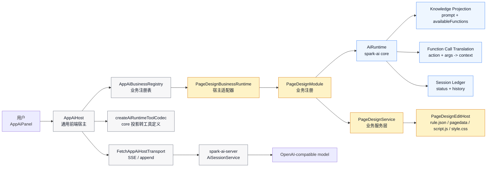
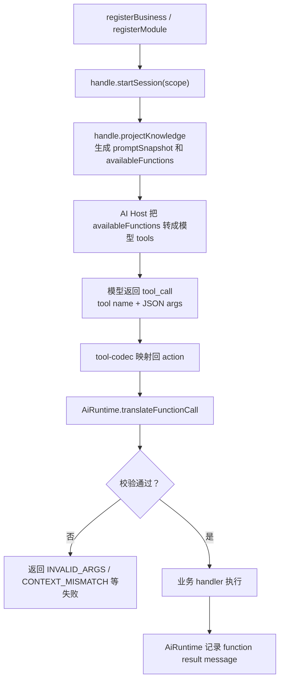
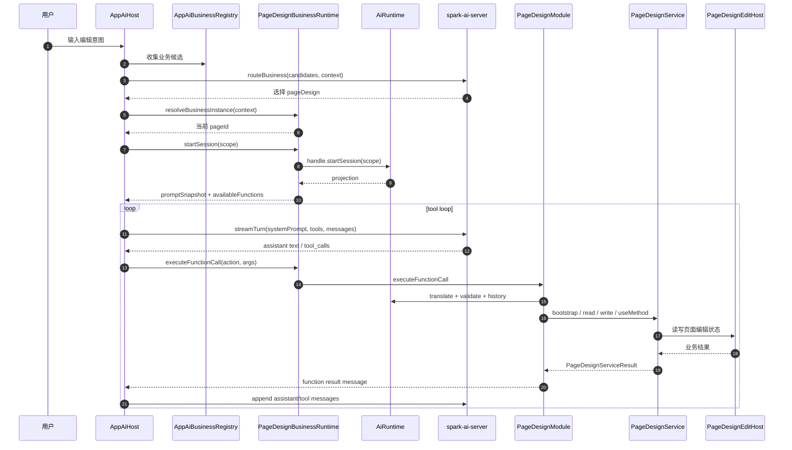
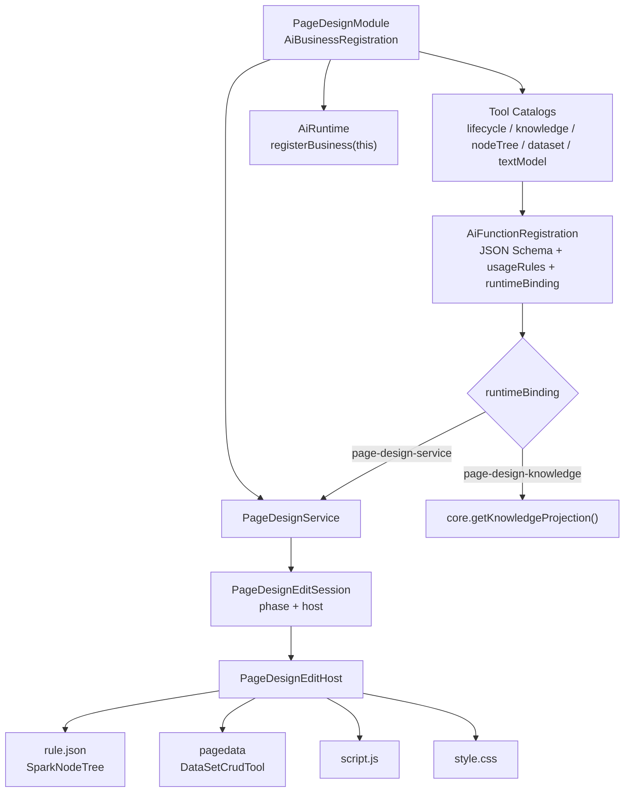
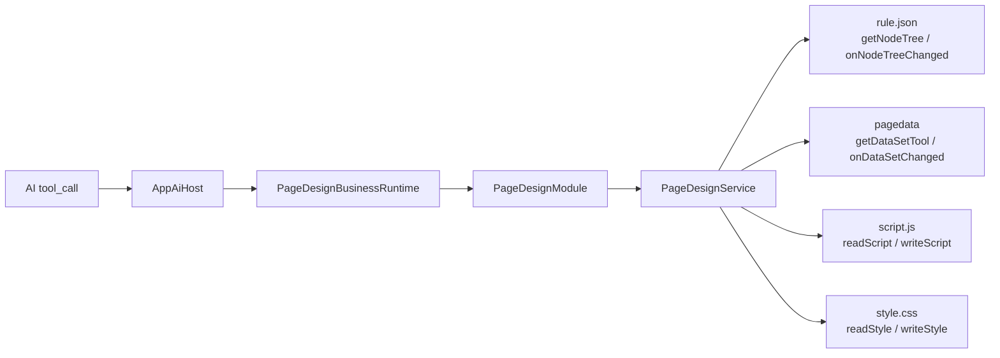
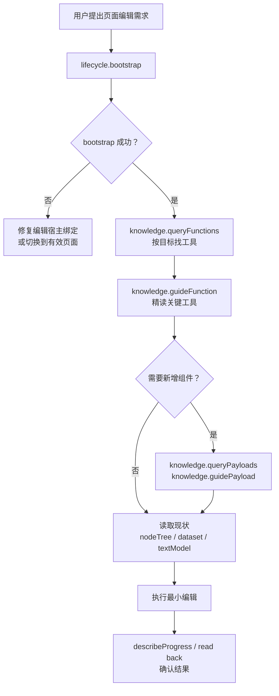

# SPARK AI 包使用指南

> 本文基于 `@spark-view/spark-ai`、前端 `AppAiHost`、`spark-ai-server` 和 PageDesign 编辑链路的源码梳理而成。目标是说明：核心层的智能边界在哪里，它和 AI HOST 通用宿主如何协作，以及 PageDesign 业务服务层如何把 AI 工具调用落到真实页面编辑。

> 文档 SSOT：本文件是当前仓库 AI core / AI 通用宿主 / AI 业务服务关系的唯一维护入口。历史 AI 设计稿、提示词散文档、包内 AI README 和早期 DM 不再单独维护；若需要更新 AI 架构或使用规则，直接修改本文。

## 1. 一张图看整体关系



这条链路有三个清晰分工：

| 层级 | 代表代码 | 主要职责 | 不负责 |
|---|---|---|---|
| `spark-ai core` | [`packages/spark-ai/src/core/internal/runtime/ai-runtime.ts`](../../packages/spark-ai/src/core/internal/runtime/ai-runtime.ts) | 注册业务知识、生成 LLM 可见投影、解析 action、校验参数、记录 AI 会话历史 | 不调用大模型，不维护页面状态，不执行业务函数 |
| AI HOST 通用宿主 | [`src/services/ai-host/app-ai-host.ts`](../../src/services/ai-host/app-ai-host.ts) | 业务路由、启动业务会话、拼系统提示词、把投影转工具、驱动模型 tool loop | 不理解 PageDesign 细节，不直接编辑 rule.json 或 pagedata |
| PageDesign 业务服务层 | [`packages/spark-ai/src/registrations/page-design/page-design-module.ts`](../../packages/spark-ai/src/registrations/page-design/page-design-module.ts), [`packages/spark-page-config/src/page-design/operations/page-design-service.ts`](../../packages/spark-page-config/src/page-design/operations/page-design-service.ts) | 把工具调用落到页面编辑宿主，读写节点树、数据集、脚本和样式 | 不和模型通信，不实现通用 AI 会话协议 |

## 2. 核心层的智能边界

`@spark-view/spark-ai/core` 是一个业务无关的 AI 运行时内核。它的“智能”不在于替业务做决策，而在于把业务能力整理成模型可安全调用的协议，并把模型返回的 function call 翻译回业务可执行上下文。

### 2.1 core 拥有什么

| 能力 | 说明 | 关键文件 |
|---|---|---|
| 注册协议 | 定义 `AiBusinessRegistration`、`AiModuleRegistration`、`AiFunctionRegistration` 等一等对象 | [`runtime-contracts.ts`](../../packages/spark-ai/src/core/protocol/runtime-contracts.ts) |
| 会话隔离 | 用 `moduleId + moduleInstanceId` 作为 AI 会话隔离键，`instanceId` 只是兼容别名 | [`ai-runtime.ts`](../../packages/spark-ai/src/core/internal/runtime/ai-runtime.ts) |
| 知识投影 | 把递归模块树投影成 `promptSnapshot`、`availableFunctions`、模块和 payload guide | [`ai-runtime-support.ts`](../../packages/spark-ai/src/core/internal/runtime/ai-runtime-support.ts), [`knowledge-projection.ts`](../../packages/spark-ai/src/core/internal/knowledge/knowledge-projection.ts) |
| action 协议 | 解析 `rootInstanceId[/childInstanceId]@moduleId@functionId` | [`invocation-helpers.ts`](../../packages/spark-ai/src/core/protocol/invocation-helpers.ts) |
| 参数校验 | 使用 JSON Schema / AJV 校验模型传入参数，并输出面向 AI 的中文错误 | [`llm-params-validator.ts`](../../packages/spark-ai/src/core/protocol/llm-params-validator.ts) |
| 历史记录 | 记录用户消息、助手消息、函数请求、函数结果和失败原因 | [`ai-runtime.ts`](../../packages/spark-ai/src/core/internal/runtime/ai-runtime.ts) |
| payload 知识 | 注册组件目录等大体量知识源，支持先查询再精读 | [`parameter-payload-contracts.ts`](../../packages/spark-ai/src/core/protocol/parameter-payload-contracts.ts), [`parameter-payload-registry.ts`](../../packages/spark-ai/src/core/internal/knowledge/parameter-payload-registry.ts) |

### 2.2 core 不拥有的事情

| 边界外事项 | 谁来负责 |
|---|---|
| 大模型请求、SSE 流式返回、`tool_calls` 拼装 | 前端 `AppAiHost` 和后端 `spark-ai-server` |
| 业务实例如何选择，例如当前编辑的是哪个页面 | `AppAiBusinessRuntime.resolveBusinessInstance` |
| 页面节点、数据集、脚本、样式的真实状态 | `PageDesignEditHost` 和 `PageDesignService` |
| 业务函数的实现和副作用 | 各业务注册层的 handler，例如 PageDesign 的 `PageDesignService` |
| 函数结果语义解释，例如是否完成、是否需要停止 | `AppAiBusinessRuntime.afterFunctionCall` 和宿主层策略 |
| 业务实例释放 | 业务 runtime 调用 `releaseModuleInstance`，core 的 `stopSession` 只更新 AI 会话状态 |

这个边界很关键：core 是“协议、投影、校验、记账”层，不是“业务执行层”。因此新增业务时，不要把业务状态塞进 core；应该让 core 看见业务能力，让业务服务自己持有和修改业务状态。

## 3. action 与投影协议

core 暴露给模型的函数不是直接的 TypeScript 函数，而是一个稳定 action：

```text
rootInstanceId[/childInstanceId]@moduleId@functionId
```

PageDesign 中常见 action 示例：

```text
home-page@lifecycle@bootstrap
home-page@knowledge@queryFunctions
home-page@nodeTree@findByType
home-page@dataset@addTable
home-page@textModel@writeScript
```

如果有子实例参数，action path 会包含子实例段；实例段会 URI 编码，避免 `/`、`@` 等字符破坏协议。

投影和执行的关系如下：



`translateFunctionCall` 只完成翻译和校验。真正执行函数的是业务注册层传入的 `run` 回调。

## 4. AI HOST 通用宿主的关系

AI HOST 是前端通用宿主，不属于 `@spark-view/spark-ai` 包。它把任意业务 runtime 包装成统一聊天体验。

本轮边界调整后的原则是“轻宿主、重核心”：AppAiHost 只保留 Vue 面板、业务选择、模型 transport 和 tool loop 编排；action 解析、函数结果序列化、projection -> tools 编码、staged tools 解锁策略都由 `spark-ai core` 提供。这样后续替换成 React、Web Component、Node server 或移动端宿主时，不需要重新实现 AI 协议层。

### 4.1 通用宿主接口

核心接口在 [`src/services/ai-host/types.ts`](../../src/services/ai-host/types.ts)：

| 接口 | 作用 |
|---|---|
| `AppAiBusinessRuntime` | 单个业务的宿主适配器，提供注册数据、启动会话、执行函数、结束实例等能力 |
| `AppAiHostTransport` | 模型通信通道，当前实现为 `FetchAppAiHostTransport` |
| `AppAiBusinessRegistry` | 收集所有业务 runtime，供路由和工具投影使用 |
| `AppAiBusinessScope` | 当前业务选择，包括 `businessRegistrationId`、`businessInstanceId`、`instanceId`、`runtimeInstanceId` |

### 4.2 宿主工作流



`AppAiHost` 做了几件特别重要的通用工作：

1. 根据用户输入和上下文路由到合适业务。
2. 调用业务 runtime 的 `startSession`，取得 core 投影。
3. 复用 core tool codec，把投影中的函数暴露转成 OpenAI tools。
4. 拼接业务 system prompt、宿主 prompt、core prompt snapshot。
5. 驱动模型循环，执行 `tool_calls`，把工具结果追加回后端会话。
6. 复用 core staged exposure policy，在工具数量过多时先开放 `knowledge` 和 `lifecycle` 模块，让模型用 `guideFunction` 逐步解锁具体工具。

后端 [`spark-ai-server`](../../spark-ai-server/README.md) 是模型会话和 SSE 通信层。它负责保存会话窗口、流式请求模型、返回 `tool_calls`，但不执行 PageDesign 工具。真实工具执行始终在前端宿主调用业务 runtime 完成。

## 5. PageDesign 业务服务层流程

PageDesign 是当前 `spark-ai` 包里最完整的业务注册示例。它把页面编辑拆成五个 AI 子模块：

| 子模块 | 代表函数 | 对应服务 |
|---|---|---|
| `lifecycle` | `bootstrap`、`describeProgress` | 检查编辑宿主是否可用，进入 editing 阶段 |
| `knowledge` | `queryFunctions`、`guideFunction`、`queryPayloads`、`guidePayload` | 查询工具和组件 payload 知识 |
| `nodeTree` | `findByType`、`addNode`、`setProps`、`removeNode` 等 | 编辑 `rule.json` 中的 `SparkNodeTree` |
| `dataset` | 表、列、视图、行、关系、聚合、表达式等 CRUD | 编辑 `pagedata` 中的 `DataSetCrudTool` |
| `textModel` | `readScript`、`writeScript`、`readStyle`、`writeStyle` | 读写 `script.js` 和 `style.css` |

### 5.1 PageDesign 内部结构



`PageDesignModule` 的职责是把 catalog 行转换成 core function registration，并把 function call 转发给正确 handler。它不直接持有页面文件状态；状态由 `PageDesignService` 通过 `PageDesignEditHost` 读取和写回。

### 5.2 四文件编辑模型



DevSystem 侧在 [`src/views/app/dev-system/useDevSystem.ts`](../../src/views/app/dev-system/useDevSystem.ts) 创建并注册 `PageDesignEditHost`。它把页面编辑状态映射成四类能力：

| Host 能力 | 对应文件/模型 | 写入后的通知 |
|---|---|---|
| `getNodeTree` | `rule.json` 的 `SparkNodeTree` | `onNodeTreeChanged` |
| `getDataSetTool` | `pagedata` 的 `DataSetCrudTool` | `onDataSetChanged` |
| `readScript` / `writeScript` | `script.js` 文本 | 直接写回文档模型 |
| `readStyle` / `writeStyle` | `style.css` 文本 | 直接写回文档模型 |

`PageDesignService.bootstrap` 会先检查这些绑定是否可用。如果当前没有活跃页面、节点树不可用、数据集不可用，或者脚本/样式读写接口缺失，AI 会得到明确失败结果，而不是继续盲写。

## 6. 开发接入指南

### 6.1 在应用入口注册 PageDesign 业务

应用入口的模式参考 [`src/App.vue`](../../src/App.vue)。核心是把 PageDesign runtime 注册进通用业务注册表，并提供当前页面的编辑宿主解析函数。

```ts
import {
  AppAiBusinessRegistry,
  AppAiHost,
  FetchAppAiHostTransport,
  registerAppAiBusinesses,
  resolvePageDesignEditHost,
  resolvePageDesignEditPageId,
} from "@/services/ai-host";

const registry = new AppAiBusinessRegistry();

registerAppAiBusinesses({
  registry,
  getPageDesignEditHost: (context) => {
    const host = resolvePageDesignEditHost(context.moduleInstanceId);
    if (host === null) {
      throw new Error("PageDesign edit host unavailable");
    }
    return host;
  },
  resolvePageDesignInstanceId: (input) => {
    return resolvePageDesignEditPageId(input.context.pageId)
      ?? input.context.pageId
      ?? null;
  },
});

const appAiHost = new AppAiHost({
  registry,
  transport: new FetchAppAiHostTransport(),
  context: () => ({ pageId: readRoutePageId(), routePath: route.path }),
});
```

注意点：

| 要点 | 原因 |
|---|---|
| `resolvePageDesignInstanceId` 必须返回当前页面 ID | core 的 AI 会话隔离键依赖 `moduleInstanceId` |
| `getPageDesignEditHost` 应优先按 `moduleInstanceId` 找宿主 | 避免 AI 把 A 页面请求写到 B 页面 |
| 没有编辑宿主时要快速失败 | 宿主层可以结束当前业务选择，避免继续 tool loop |

### 6.2 在页面编辑器里注册 EditHost

DevSystem 的注册模式可以简化成：

```ts
import { registerPageDesignEditHost } from "@/services/ai-host";

const host = createPageDesignEditHost(state);
const unregister = registerPageDesignEditHost(() => {
  const pageId = state.activePageId.value.trim();
  return pageId === "" ? null : { pageId, host };
});

onBeforeUnmount(() => unregister());
```

`PageDesignEditHost` 要提供尽可能完整的四文件能力。只提供部分能力时，`bootstrap` 会告诉 AI 哪些能力不可用。

### 6.3 直接使用 spark-ai core 接入新业务

新增业务时，推荐按 PageDesign 的结构做一个薄注册层：

```ts
import {
  AiRuntime,
  type AiBusinessRegistration,
  type AiRuntimeAction,
} from "@spark-view/spark-ai/core";

interface MyBusinessRuntimeContext {
  readonly moduleInstanceId: string;
  readonly instanceId: string;
}

export class MyBusinessModule implements AiBusinessRegistration {
  readonly moduleId = "myBusiness";

  private readonly core = new AiRuntime();
  private readonly ai = this.core.registerBusiness(this);

  getRegistrationData() {
    return this.ai.getRegistrationData();
  }

  startSession(context: MyBusinessRuntimeContext) {
    return this.ai.startSession({
      instanceId: context.instanceId,
      moduleInstanceId: context.moduleInstanceId,
      runtimeInstanceId: context.instanceId,
    });
  }

  appendMessage(options: MyBusinessRuntimeContext & {
    role: "system" | "user" | "assistant";
    content: string;
  }) {
    return this.ai.appendMessage({
      instanceId: options.instanceId,
      moduleInstanceId: options.moduleInstanceId,
      runtimeInstanceId: options.instanceId,
      role: options.role,
      content: options.content,
    });
  }

  stopSession(context: MyBusinessRuntimeContext & { reason?: string }) {
    return this.ai.stopSession({
      instanceId: context.instanceId,
      moduleInstanceId: context.moduleInstanceId,
      reason: context.reason,
    });
  }

  executeFunctionCall(input: MyBusinessRuntimeContext & {
    action: AiRuntimeAction;
    args: unknown;
  }) {
    return this.ai.executeFunctionCall({
      instanceId: input.instanceId,
      moduleInstanceId: input.moduleInstanceId,
      runtimeInstanceId: input.instanceId,
      action: input.action,
      args: input.args,
      run: async (context) => {
        return runMyBusinessHandler(context);
      },
    });
  }

  getSessionHistory(context: MyBusinessRuntimeContext) {
    return this.ai.getSessionHistory(context.moduleInstanceId);
  }

  releaseModuleInstance(moduleInstanceId: string) {
    releaseMyBusinessInstance(moduleInstanceId);
  }
}
```

新增业务的设计原则：

| 原则 | 做法 |
|---|---|
| 注册层薄 | 只描述模块、函数、参数 schema、usage rules 和 handler 映射 |
| 服务层厚 | 业务状态、事务、权限、副作用都放在业务服务里 |
| core 无状态业务 | core 只保存 AI session 和投影，不保存业务模型 |
| 参数 schema 标准化 | 根 schema 必须是 JSON object，不使用旧的 `kind` DSL |
| action 稳定 | 同一模块树内 `moduleId` 和 `functionId` 不能重复 |

### 6.4 把新业务接入 AppAiHost

实现一个 `AppAiBusinessRuntime` 适配器：

```ts
const runtime: AppAiBusinessRuntime = {
  moduleId: myBusiness.moduleId,
  getRegistrationData: () => myBusiness.getRegistrationData(),
  resolveBusinessInstance: (input) => {
    const entityId = input.context.pageId;
    if (entityId === undefined || entityId.trim() === "") {
      throw new Error("MyBusiness 需要先选中一个业务实例。");
    }
    return entityId;
  },
  startSession: (context) => myBusiness.startSession(context),
  appendMessage: (options) => myBusiness.appendMessage(options),
  executeFunctionCall: (input) => myBusiness.executeFunctionCall(input),
  getSystemPrompt: () => "你是当前业务的受约束编辑助手。",
  getSessionHistory: (context) => myBusiness.getSessionHistory(context),
  endBusinessInstance: async (context, directive) => {
    myBusiness.stopSession({
      ...context,
      reason: directive.reason ?? directive.status,
    });
    if (directive.releaseInstance === true) {
      myBusiness.releaseModuleInstance(context.moduleInstanceId);
    }
  },
};

registry.register(runtime);
```

宿主适配器要回答两个问题：

| 问题 | 适配器职责 |
|---|---|
| 这次用户输入应该绑定哪个业务实例？ | `resolveBusinessInstance` |
| 模型要求执行某个 action 时，交给谁执行？ | `executeFunctionCall` |

## 7. PageDesign 使用手册

### 7.1 推荐调用顺序



### 7.2 编辑 `rule.json`

常用函数在 `nodeTree` 模块：

| 目标 | 建议工具 |
|---|---|
| 找已有组件 | `findByType`、`getNode`、`listChildren` |
| 新增节点 | `addNode`、`addNodes` |
| 改 props | `setProps`、`setPropsBatch` |
| 移动节点 | `moveNode` |
| 替换节点 | `replaceNode`、`replaceNodes` |
| 删除节点 | `removeNode`、`removeNodes` |

操作规则：

1. 修改前先确认真实节点 ID，不要凭组件名称猜 ID。
2. 新增组件前先 `queryPayloads`，再对目标组件 `guidePayload`。
3. `guidePayload` 返回的 schema 是组件配置依据，尤其是必填 props、children 约束和事件绑定。
4. 表级容器用 `viewKey` 定位 DataView，展示组件读取 DataView 输出时才用完整 `dataKey`，不要再生成 `Table@rows` 旧写法。
5. 数据容器下的任何组件、任何 prop 都可以用 `$[fieldName]` 消费当前 `DATA_ROW` 字段；例如 `r-tag.content="$[age] 岁"`、`r-tag.tagType="$[ageBadgeType]"`。纯占位符保留原始类型，混合文本会字符串化。
6. 批量编辑优先用 batch 工具，减少多轮模型调用。

### 7.3 编辑 `pagedata`

常用函数在 `dataset` 模块：

| 目标 | 建议工具 |
|---|---|
| 查看当前数据集 | `exportDataSet`、`listTables`、`getTable` |
| 维护表结构 | `addTable`、`addColumn`、`updateColumn`、`removeColumn` |
| 维护视图 | `addView`、`updateView`、`setDefaultView` |
| 维护静态行 | `addRow`、`updateRow`、`removeRow` |
| 维护关系 | `addRelation`、`updateRelation`、`removeRelation` |
| 计算和聚合 | aggregate / computed expression 相关工具 |

操作规则：

1. `DataSet` 是 SPARK 页面数据模型，不是数据库 DDL。
2. 工具参数必须是 JSON object，字段名与 catalog 中 schema 对齐。
3. 静态行只适合页面内置初始数据；运行期远程数据不要硬编码成静态行。
4. 修改表结构后，检查相关视图、关系和组件绑定是否仍然有效。

### 7.4 编辑 `script.js` 和 `style.css`

`textModel` 模块提供四个函数：

| 文件 | 读取 | 写入 |
|---|---|---|
| `script.js` | `readScript` | `writeScript` |
| `style.css` | `readStyle` | `writeStyle` |

注意点：

1. 写入是全文替换，不是 patch。
2. `writeScript` 会做基础安全校验，禁止危险 API 和不受支持的页面伪 API。
3. 脚本应该围绕页面配置和数据模型做最小增强，不要把业务主流程塞进脚本。
4. 样式优先针对已有节点 class 或稳定结构，避免影响全局页面。

## 8. 常见失败与排查

| 失败码/现象 | 常见原因 | 处理方式 |
|---|---|---|
| `SESSION_NOT_STARTED` | 宿主未调用 `startSession`，或业务实例解析失败 | 检查 `business-selector` 和 runtime `startSession` |
| `SESSION_STOPPED` | 当前 AI 会话已停止 | 重新选择业务或重新进入页面 |
| `CONTEXT_MISMATCH` | action 的 root instance 与当前 scope 不一致 | 检查 `moduleInstanceId`、页面 ID 和 tool-codec 映射 |
| `INVALID_ARGS` | 参数不符合 JSON Schema | 根据错误信息修正 JSON object 字段 |
| `NO_NODE_TREE` | `PageDesignEditHost.getNodeTree` 不可用 | 检查 DevSystem 是否注册了当前页面 host |
| `NO_DATASET_EDIT` | `getDataSetTool` 不可用 | 检查 `pagedata` 文档模型是否初始化 |
| `NO_TEXT_MODEL` | script/style 读写接口缺失 | 检查 `createPageDesignEditHost` 绑定 |
| `PAYLOAD_NOT_FOUND` | 组件 payload ref 或组件类型不存在 | 先 `queryPayloads`，确认组件 type |
| 工具很多但模型看不到目标工具 | 宿主启用了 staged tools | 先调用 `knowledge.queryFunctions` 和 `knowledge.guideFunction` |

## 9. 维护清单

扩展 `spark-ai` 或 PageDesign 工具时，按这个顺序检查：

1. 在 catalog 里新增函数行，写清楚 `paramsSchema`、`resultSchema`、`usageRules`、`failureModes`。
2. 给函数指定正确 `runtimeBinding`。
3. 在对应 binding applier 里实现 handler 映射。
4. 参数 schema 必须是标准 JSON Schema object root。
5. 同一模块树内不要重复 `moduleId`、`functionId` 或 action 地址。
6. 如果新增组件 payload，更新 component catalog，并确认 `queryPayloads` 和 `guidePayload` 能返回可用摘要和 guide。
7. 补充测试，重点覆盖 projection、参数校验、action 翻译、业务 handler 执行。

建议本地校验命令：

```powershell
pnpm --filter @spark-view/spark-ai run typecheck
pnpm --filter @spark-view/spark-ai run test:run
pnpm run test:run -- --config vitest.spark-ai.config.ts tests/app-ai-host.test.ts tests/page-design-business-definition.test.ts
```

## 10. 源码阅读入口

| 主题 | 文件 |
|---|---|
| AI 文档 SSOT | 本文 |
| core 类型契约 | [`runtime-contracts.ts`](../../packages/spark-ai/src/core/protocol/runtime-contracts.ts) |
| core 运行时 | [`ai-runtime.ts`](../../packages/spark-ai/src/core/internal/runtime/ai-runtime.ts) |
| core 投影和校验辅助 | [`ai-runtime-support.ts`](../../packages/spark-ai/src/core/internal/runtime/ai-runtime-support.ts) |
| PageDesign 注册 | [`page-design-module.ts`](../../packages/spark-ai/src/registrations/page-design/page-design-module.ts) |
| PageDesign 服务 | [`page-design-service.ts`](../../packages/spark-page-config/src/page-design/operations/page-design-service.ts) |
| App AI Host | [`app-ai-host.ts`](../../src/services/ai-host/app-ai-host.ts) |
| Host 类型契约 | [`types.ts`](../../src/services/ai-host/types.ts) |
| 后端 AI 会话 | [`AiSessionController.java`](../../spark-ai-server/src/main/java/com/spark/ai/controller/AiSessionController.java) |
