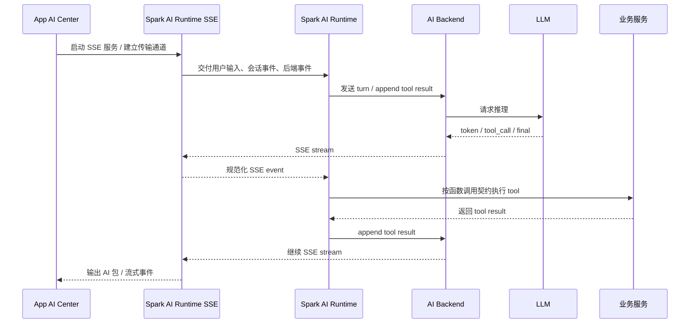

# SPARK AI Platform 架构边界

> 状态：已定稿，作为 SPARK AI Platform、`@spark-view/spark-ai`、App AI Center、AI Backend 和业务注册边界的 SSOT。
> 日期：2026-05-20

## 命名分层

| 名称 | 对应对象 | 语义 |
| --- | --- | --- |
| SPARK AI Platform / AI 平台 | 前端 APP、`spark-ai`、AI Backend、业务能力注册组成的整体 | 产品与架构总称 |
| App AI Center / AI 中心 | APP 级 AI 入口、面板、SSE host、AI 包传输 | 用户入口与应用集成层 |
| Spark AI Runtime | `@spark-view/spark-ai` 包 | 框架无关协议、SSE、tool call、session、knowledge projection 内核 |
| AI Backend | `spark-ai-server` 中的 LLM 会话、模型调用、持久化、SSE stream | 后端会话与模型网关层 |
| AI Capabilities | 业务服务注册的函数契约和知识 | 业务能力接入层 |

## 定稿结论

最终链路定为：

```text
App AI Center 启动 SSE 服务
  -> Spark AI Runtime SSE
  -> Spark AI Runtime 纯函数内核
  -> AI Backend <=> LLM
  -> AI Backend
  -> Spark AI Runtime SSE
  -> App AI Center SSE 服务
```

业务函数链路定为：

```text
业务服务 ==注册==> spark-ai ==函数调用契约<==> 业务服务函数执行
```

一句话边界：

`App AI Center` 只负责启动 SSE 服务和传输 AI 包；`Spark AI Runtime` 负责 AI 协议、SSE 协议适配、函数调用契约、会话运行时规则和知识投影；`AI Backend` 负责 LLM 会话、模型调用、持久化和 SSE 输出；`业务服务` 拥有业务状态和业务函数实现；业务编排由 LLM 决定。

## 目标拓扑



这个闭环里，App AI Center 不参与业务选择、不创建业务 runtime、不包业务服务、不维护业务状态。

## Spark AI Runtime 纯函数原则

`@spark-view/spark-ai` 是 SPARK AI Platform 的 Runtime 内核。它不叫“AI 平台”或“AI 中心”，因为它不拥有 APP 入口、业务状态、后端持久化或产品级治理。Runtime 核心应保持纯函数化：

- 输入：SSE event、业务注册快照、显式 session scope、LLM tool call、函数参数、当前 runtime state。
- 输出：新的 runtime state，以及需要外部执行的命令，例如发送后端 turn、追加 tool result、调用业务函数、向 SSE 输出事件。
- 副作用：只能通过显式传入的 port/adapter 执行，不能隐藏在全局单例、业务 service import 或框架对象里。
- 状态：AI runtime 可以定义会话账本、历史和 projection 的数据结构与状态转移规则，但持久化和真实连接生命周期必须由外部 store/host/backend 承担。
- 拷贝：对外暴露 projection、session、history 时必须是快照，不能泄漏内部可变对象。

因此 `spark-ai` 不是“业务 AI 包”，也不是整个平台本身，而是可复用的 AI 协议与运行时内核。

## 包职责边界

| 模块 | 负责 | 不负责 |
| --- | --- | --- |
| App AI Center / AI 中心 | 启动 SSE 服务；装配传输端点；把 AI 包送入或送出 UI/网络边界 | 导入 page-config；注册业务；创建业务 service；管理业务状态；编排业务 |
| Spark AI Runtime SSE | 接收、解析、规范化 SSE 事件；把后端 stream 转为 runtime event；把 runtime output 转为 SSE output | 调用具体业务 API；持久化 LLM 会话；决定业务流程 |
| Spark AI Runtime | 定义协议、会话状态转移、函数调用契约、tool codec、参数校验、知识投影、tool result 生成 | 业务 live state；页面配置编辑实现；请假/审批等具体业务服务；Vue/Element/Router |
| AI Backend | LLM 会话、模型调用、消息持久化、SSE stream、tool call 消息窗口 | 前端业务函数执行；页面 live state；APP UI 状态 |
| 业务服务 | 持有业务状态；实现业务函数；按契约注册能力；执行函数副作用 | 管理 LLM 会话；解析 SSE；重写 spark-ai 协议 |

## 函数调用契约

业务服务只通过契约进入 `spark-ai`。契约需要表达：

- `businessRegistrationId`：业务类型，例如 page design、leave request。
- `businessInstanceId`：业务实例，例如 page id、draft id。
- `moduleId/functionId`：LLM 可调用的函数定位。
- `paramsSchema`：标准 JSON Schema 参数约束。
- `description/prompt/knowledge`：供 LLM 理解能力边界。
- `invoke`：业务服务函数执行入口。
- `result`：可序列化的 tool result，不泄漏业务内部对象。

示意形状：

```ts
type AiBusinessRegistration = {
  readonly businessRegistrationId: string
  readonly modules: readonly AiBusinessModuleContract[]
}

type AiBusinessFunctionContract = {
  readonly functionId: string
  readonly description: string
  readonly paramsSchema: LlmJsonSchemaObject
  readonly invoke: (input: AiFunctionInvocation) => Promise<AiFunctionResult>
}
```

约束：

- `spark-ai` 不 import 具体业务 service。
- 业务 service 不要求 APP 代注册。
- 函数执行只从契约进入，不能从 action 字符串绕到具体 service。
- LLM 负责决定下一步调用哪个函数，`spark-ai` 只做协议校验、调用落账、结果回传。

## SSOT

| 事实源 | 唯一归属 |
| --- | --- |
| AI 协议、tool call envelope、参数 schema 规范 | `spark-ai` |
| AI runtime 会话状态转移规则 | `spark-ai` |
| LLM 会话、消息持久化、模型调用状态 | AI Backend |
| SSE 连接启动与传输生命周期 | App AI Center / host 基础设施 |
| 业务状态、业务校验、业务副作用 | 业务服务 |
| 页面配置文件与配置语义 | `spark-page-config` / 页面配置服务 |
| 业务能力注册内容 | 业务服务所在包 |

任何新代码如果需要第二份事实源，必须先证明原事实源无法承载；否则视为边界破坏。

## 禁止依赖

| 方向 | 禁止原因 |
| --- | --- |
| `spark-ai` -> `spark-page-config` | AI Runtime 不能绑定页面业务 |
| `spark-ai` -> `spark-app` | Runtime 不能反向依赖应用壳 |
| `spark-ai` -> Vue / Vue Router / Element Plus | Runtime 必须框架无关 |
| App AI Center -> page-design / leave-request 注册 | APP 只启动 SSE 服务，不能拥有业务注册 |
| App AI Center -> 具体业务 service | APP 不能成为业务编排层 |
| AI Backend -> 前端业务 service 实现 | 后端只管理 LLM 会话和 stream，不执行前端业务函数 |

## 收边清单

后续代码收边按这个顺序推进：

1. App AI Center host 删除业务 registry 入参，只保留 SSE 服务启动、传输和附件/AI 包通道。
2. `packages/spark-app/src/ai/registrations/**` 迁出 APP；业务注册回到业务服务所在包，或独立业务能力包。
3. `spark-ai` 保留协议、SSE、tool codec、session reducer、knowledge projection 和函数调用契约；移除任何业务服务 import。
4. 业务服务通过契约注册函数，函数执行由业务服务自己完成。
5. tool call 闭环统一为：后端 SSE tool_call -> `spark-ai` 校验/执行契约 -> tool result append -> 后端继续 LLM。
6. 文档、测试和导出面同步更新，避免旧的 app AI 业务注册入口和 `spark-ai/registrations` 入口复活。
