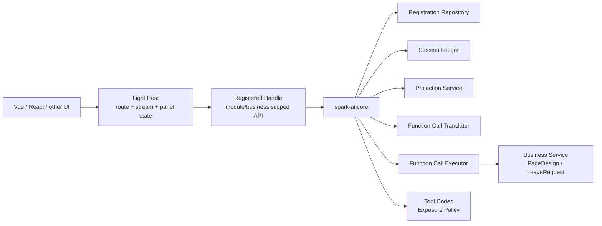

# AI 核心层概念模型

> 状态：概念模型主文档。第 1-17 章保留早期核心层推演；第 18 章合并 2026-05-15 的落地修订，记录当前实现采用的“重核心、轻宿主”、handle-first API 和 AppAiHost 拆分边界。当前代码以 `packages/spark-ai/ARCHITECTURE.md` 与本文第 18 章为准。

> 目标：定义一套纯概念层的 AI 核心模型，不绑定具体项目、协议、模型厂商或实现语言。

## 1. 设计目标

本文希望回答以下问题：

1. 业务层应该管什么，不应该管什么。
2. 核心层在不承担任何编排职责的前提下，到底负责什么。
3. 业务、模块、函数三层结构应该如何建模。
4. 为什么系统里唯一可注册物应当是业务。
5. 为什么函数执行必须显式携带业务实例 ID。
6. 会话历史、实例查询和事件机制应该由谁统一提供。

设计目标如下：

1. 业务层不关心通讯细节。
2. 业务层不关心会话流、滑动窗口、SSE、OpenAI、本地模型等差异。
3. 核心层不负责任何编排，编排交给 AI 会话宿主。
4. 核心层只负责接收、校验并执行 AI 会话宿主转交来的函数调用。
5. 业务结构遵循：业务 -> 模块 -> 函数。
6. 唯一可注册对象是业务。
7. 核心层按业务定义创建和管理业务实例。
8. 核心层统一提供通用会话历史、实例查询与事件机制。

## 2. 核心原则

### 2.1 唯一注册物原则

系统中唯一允许被注册到核心层的对象是业务定义。

模块和函数不能独立注册，它们只能作为业务定义的内部组成部分存在。

### 2.2 定义与运行分离原则

静态定义描述“系统有什么”。

运行时实例描述“当前正在发生什么”。

两者必须严格分离。

### 2.3 编排外置原则

函数选择、调用顺序、重试、追问、暂停时机、恢复时机、下一步要不要继续，这些都不属于核心层。

这些职责属于核心层外的 AI 会话宿主。

核心层只提供稳定协议与执行基础设施。

### 2.4 通讯与能力分离原则

通讯协议与模型厂商差异属于核心层外部基础设施。

业务能力属于业务、模块、函数层。

函数不应知道消息如何传输、是否流式、是否通过 SSE、HTTP 或 SDK 产生。

### 2.5 树形归属原则

函数必须归属于模块。

模块必须归属于业务。

禁止出现脱离业务上下文存在的函数或模块。

### 2.6 实例隔离原则

业务定义可以产生多个业务实例。

每个实例拥有自己的会话状态、模块运行态、可用函数集合、日志和事件流。

实例之间不得共享可变运行态。

### 2.7 模块实例订阅原则

模块运行态由核心层在业务实例启动时统一创建和持有。

业务不能主动向核心层注册模块实例，也不能把模块实例作为业务私有 SSoT 推入核心层。

业务如需感知模块运行态，应通过订阅模块运行态事件或查询业务实例详情获取。

也就是说：

- 业务定义声明有哪些模块。
- 核心层根据业务定义创建模块运行态。
- 业务层通过模块接口按 instanceId 获取模块运行态。
- subscribe 只用于感知模块运行态可用或变更，不作为第二套取实例入口。
- getInstanceDetail 只用于通用查询、调试或监控，不替代模块接口。
- 模块运行态的生命周期仍以业务实例为根，由核心层统一管理。

### 2.8 会话标识合成原则

核心层不单独再发明第三个主键。

会话 ID 的语义应由业务注册 ID 与业务实例 ID 组合得到。

也就是说：

- businessId 标识业务定义。
- instanceId 标识运行中的具体实例。
- sessionId 是 businessId + instanceId 的组合会话标识，由核心层内部派生和管理。

分隔符、序列化格式可以因实现而异，但语义上必须是组合键，而不是另一套平行身份。

**sessionId 是核心层内部标识，不对外暴露。业务层只感知 instanceId，不负责、不传递、不感知 sessionId。**

### 2.9 实例 ID 显式透传原则

所有由 AI 会话宿主转交的函数执行，都必须显式携带业务实例 ID。

action 只负责表达“要调用哪个业务模块函数”，instanceId 负责表达“要落到哪个运行中的实例”。

instanceId 是 executeFunctionCall 的调用信封字段，不进入业务 args。

核心层必须在执行前校验：

1. instanceId 对应的实例真实存在。
2. 该实例的 businessId 与 action 中解析出的 businessId 一致。
3. 目标函数确实在该实例当前可用函数集合中。

### 2.10 历史统一管理原则

会话历史属于核心层通用能力，不应由各个业务各自维护一套私有历史 SSoT。

核心层统一负责：

1. 历史追加。
2. 历史查询。
3. 历史裁剪或归档。
4. 按 sessionId 回放。

### 2.11 事件只读原则

事件机制用于观测、协作和扩展。

事件监听器默认只读，不应直接篡改核心执行流的内部状态。

### 2.12 TS 内部交易契约原则

TypeScript 接口只定义业务系统与 AI 核心层之间的内部交易契约。

它回答的是：业务系统向核心层交付哪些业务定义、模块门面、函数目录、运行态访问入口和执行函数。

它不回答、也不约束 LLM 与 AI 核心层之间如何通讯。

因此：

- TS 接口不是 LLM tool schema。
- TS 接口不是模型消息协议。
- TS 接口不是 system prompt 的最终投喂格式。
- TS 接口不负责 SSE、HTTP、OpenAI function calling、本地模型调用或任何模型厂商协议。
- LLM <-> AI 核心层之间的协议由核心层外的 AI 会话宿主 / 协议投影层负责。
- 业务系统 <-> AI 核心层之间的稳定类型边界才由 TS 接口负责。

## 3. 总体概念结构

业务定义
-> 生成多个业务实例

业务定义
-> 包含多个模块定义

模块定义
-> 包含多个函数定义

业务实例
-> 持有多个模块运行态

核心层
-> 创建并持有模块运行态

业务层
-> 通过模块门面按 instanceId 获取模块运行态

业务实例
-> 派生 sessionId

业务实例
-> 持有当前可用函数集合快照

核心层
-> 统一维护通用会话历史

核心层
-> 接收并执行 AI 会话宿主转交来的函数调用

核心层
-> 通过事件总线向外发出事件

AI 会话宿主
-> 读取提示词快照、历史与可用函数集合

AI 会话宿主
-> 决定下一条消息、下一次函数调用、是否暂停或停止

### 3.1 最小闭环流程图

```mermaid
flowchart TD
  business[业务系统]
  host[AI 会话宿主]
  core[AI 核心层]
  registry[业务定义目录]
  instance[业务实例 instanceId]
  runtime[模块运行态]
  exposure[提示词快照 + 可用函数集合]
  history[统一历史与事件]

  business -->|registerBusiness(IBusinessDefinition)| core
  core -->|保存业务定义| registry
  host -->|startSession(businessId)| core
  core -->|创建并管理| instance
  core -->|创建并索引| runtime
  core -->|汇总模块提示词和函数目录| exposure
  core -->|返回 instanceId + 快照| host
  host -->|appendMessages(instanceId, messages)| core
  host -->|executeFunctionCall(instanceId, action, args)| core
  core -->|定位运行态并执行函数| runtime
  core -->|写入函数结果| history
  host -->|stopSession(instanceId, pause/stop)| core
```

这张图只表达最小业务闭环：业务系统负责注册业务定义，AI 会话宿主负责推进对话，AI 核心层负责实例、模块运行态、函数执行、历史与事件。

## 4. 一等概念对象

### 4.1 业务定义

业务定义表示一种业务类型，是系统唯一的注册单位。

它回答的问题是：

1. 我是谁。
2. 我有哪些模块。
3. 在静态定义层面，我向核心层暴露了哪些能力分区。

建议属性：

- businessId
- name
- description
- modules

说明：

- businessId 用于标识业务定义本身。
- 业务定义是静态对象，不承载运行中的状态。
- 业务定义不负责直接执行函数。
- 业务定义不内嵌 createInstance、destroyInstance、metadata 这类运行期或扩展性字段。
- 实例创建、恢复、暂停、停止都应通过核心层统一 API 完成，而不是挂在业务定义对象上。

### 4.2 业务实例

业务实例表示某个业务定义的一次具体运行。

它是核心层所有运行态的根对象。

建议属性：

- instanceId
- businessId
- sessionId
- status
- sessionState
- modulesRuntime
- availableFunctions
- eventBus

说明：

- instanceId 是运行实体的唯一标识。
- businessId 用于回溯其来源业务定义。
- sessionId 是 businessId + instanceId 组合得到的会话标识。
- 一个 businessId 可以对应多个并行 instanceId。
- 业务实例只承载运行态，不承担任何编排策略。

### 4.3 模块定义

模块定义是业务内部的能力分区，用于表达同一业务下的不同上下文域。

它回答的问题是：

1. 这个业务内部有哪些能力域。
2. 某个能力域下有哪些函数。
3. 该能力域有哪些局部规则。

建议属性：

- moduleId
- name
- description
- functionCatalog
- createRuntime
- destroyRuntime
- guards
- metadata

说明：

- 模块不参与全局注册。
- 模块只能存在于某个业务定义内部。
- 模块是函数的直接归属层。
- 模块通过函数目录接口声明函数集合，而不是向核心层逐个注册函数。
- 模块定义可以声明运行态工厂，但不能主动向核心层注册模块运行态实例。

### 4.4 模块运行态

模块运行态是模块在某个业务实例中的活体。

模块运行态由核心层根据业务定义创建、索引和销毁。

业务层只能通过模块门面按 instanceId 获取模块运行态；subscribe 只通知模块可用或变更，getInstanceDetail 只服务通用查询、调试和监控。

建议属性：

- moduleId
- state
- onStart
- onStop
- beforeExecute
- afterExecute
- metadata

说明：

- 模块运行态只存在于业务实例内部。
- 它承载局部状态和局部钩子。
- 它不应该承担跨业务的职责。
- 它的生命周期由核心层统一驱动。

### 4.5 函数定义

函数定义是 AI 会话宿主可转交给核心层执行的最小业务能力单元。

它回答的问题是：

1. 这个函数做什么。
2. 它接受什么参数。
3. 如何校验参数。
4. 如何执行。
5. 会返回什么结果。
6. 它交给 AI 会话宿主使用时的执行语义是什么。

建议属性：

- functionId
- description
- paramsSchema
- resultSchema
- maxExecutionMs
- execute
- metadata

说明：

- 函数必须属于某个模块。
- functionId 是函数在模块内的稳定路由 ID。
- action 由 businessId、moduleId、functionId 组合得到，不需要再维护第二套函数名路由。
- 函数不关心会话流。
- 函数不关心底层模型厂商。
- 函数只关心业务动作本身。
- AI 会话宿主转交函数调用时，调用信封必须显式携带 instanceId。
- instanceId 不进入业务 args，业务 args 只表达函数自身参数。
- 参数校验优先由 paramsSchema 和核心执行网关统一完成，避免每个函数重复实现一套校验入口。
- maxExecutionMs 在这里是能力元数据，用于向 AI 会话宿主描述执行模型，而不是核心层内部的编排指令。

### 4.6 会话历史管理器

核心层应提供通用的会话历史记录管理，而不是把历史记录散落在各个业务里各自维护。

它至少负责：

1. 记录由 appendMessages 追加的 user、assistant 消息。
2. 记录由 executeFunctionCall 写入的 tool / function result。
3. 记录每次函数调用的 action、instanceId、参数、结果与时间戳。
4. 记录 pause、resume、stop、fail 等生命周期节点。
5. 记录每次提供给 AI 会话宿主的函数集合快照。

建议属性：

- sessionId
- messages
- functionCalls
- lifecycleMarkers
- functionExposureSnapshots

说明：

- 这是核心层的通用能力，不应由业务层自行重复造轮子。
- 历史结构应保持业务无关，只存统一协议，不存业务私有内部对象。

### 4.7 函数可用集解析器

核心层需要一个稳定能力来回答：某个业务实例在当前状态下，AI 会话宿主可以转交哪些函数调用。

它负责：

1. 读取业务定义与模块运行态。
2. 结合实例状态过滤不可用函数。
3. 生成当前可提供给 AI 会话宿主的函数集合。
4. 生成对外可查询的函数摘要或 schema。

说明：

- 它只回答“能用什么函数”，不决定“下一步该用哪个函数”。
- 它属于核心层。

### 4.8 函数执行网关

函数执行网关是核心层的执行中枢。

它负责：

1. 接收 executeFunctionCall 请求。
2. 根据 instanceId 派生 sessionId，并校验 instanceId、businessId、action 的一致性。
3. 定位目标模块运行态和目标函数。
4. 执行前置守卫、参数校验、业务正文和后置校验。
5. 将函数调用与函数结果写入统一历史。
6. 发出函数执行事件与必要的函数可用集事件。
7. 返回统一结果。

说明：

- 它不负责任何编排。
- 它不决定下一步调用哪个函数。
- 它不做重试、循环、追问或多步计划。

### 4.9 事件总线

事件总线是核心层与业务层、UI 层、日志层、监控层交互的统一出口。

它用于：

1. 暴露生命周期变化。
2. 暴露函数可用集合变化。
3. 暴露函数执行过程。
4. 暴露历史写入、告警与错误。
5. 支持观察与调试。

说明：

- 事件总线是交互面，不是执行面。
- 事件监听器失败不应打断主流程。
- 事件格式必须稳定。

### 4.10 AI 会话宿主

AI 会话宿主是业务侧能理解的“AI 对话入口”。

它不是会话本身，也不是核心层内部对象。

从业务层面看，它可以是一个聊天面板、一个后端 AI 接口、一个自动化任务，负责围绕某个业务实例发起和推进 AI 对话。

它和会话的关系是：

- 会话状态、历史、可用函数集合和生命周期由核心层围绕 instanceId 管理。
- AI 会话宿主只持有 instanceId，并调用核心层 API 推进这次对话。
- AI 会话宿主不保存 sessionId，不维护会话历史 SSoT。
- 一个业务实例可以被恢复后继续对话；恢复时仍然通过 instanceId 找回核心层里的会话状态。

它负责：

1. 读取提示词快照。
2. 读取历史。
3. 读取当前可用函数集合。
4. 决定是继续输出文本还是调用函数。
5. 决定函数调用顺序、重试与追问。
6. 决定何时暂停、何时恢复、何时停止。

说明：

- 它是业务系统中的 AI 会话入口，不是核心层新增的一等业务对象。
- 它负责跟模型通讯，把提示词快照、历史和可用函数集合转成模型能理解的输入。
- 但无论实现形态如何，它都不应把编排职责重新压回核心层。

### 4.11 业务与模块接口约定（TypeScript）

本节所有 TS 接口都只描述业务系统 <-> AI 核心层的内部交易契约。

它们不是 LLM <-> AI 核心层的通讯协议，也不是最终暴露给模型的 tool schema 或 prompt 格式。

业务也需要 TS 门面，但这个门面只能是业务定义门面，不是业务运行态门面。

业务定义门面只负责表达业务身份与模块集合。它是核心层唯一注册入口的类型约束，不承载实例创建、恢复、停止、历史、sessionId 或编排能力。

#### IBusinessDefinition

```typescript
interface IBusinessDefinition {
  readonly businessId: string;
  readonly name: string;
  readonly description: string;
  readonly modules: ReadonlyArray<IModule>;
}
```

说明：

- `IBusinessDefinition` 是 `registerBusiness` 的唯一入参形状。
- `modules` 持有模块门面集合，模块仍然不能绕过业务被独立注册。
- 业务门面不提供 `createInstance`、`destroyInstance`、`startSession`、`stopSession`、`getSessionHistory` 或任何 sessionId 相关字段。
- 实例生命周期仍由核心层 `startSession` / `stopSession` 等统一 API 驱动。

#### IModule

模块对外应表现为一个稳定门面。这个门面只做三件事：提供提示词、声明函数目录、按业务实例 ID 获取本模块运行态。

不要再拆出业务注册、模块注册、函数注册、运行态注册多条入口；否则业务 -> 模块 -> 函数 -> 实例的链路会变成多套 SSoT。

#### IModulePromptProvider

模块通过 TS 接口向核心层贡献提示词片段。核心层在启动、恢复或函数集合刷新后，汇总各模块贡献并生成提示词快照；提示词快照如何作为 system prompt 投喂给模型，属于 AI 会话宿主 / 协议投影层职责。

```typescript
type JsonSchema = Record<string, unknown>;

interface IModulePromptProvider {
  getPrompt(context: ModulePromptContext): string | null;
}

interface ModulePromptContext {
  readonly instanceId: string;
  readonly businessId: string;
  readonly moduleId: string;
}
```

#### IModuleInstanceAccessor

业务层按业务实例 ID 获取本模块运行态，而不是主动持有或注册模块实例。

```typescript
interface IModuleInstanceAccessor<TRuntime extends ModuleRuntime = ModuleRuntime> {
  getInstance(instanceId: string): TRuntime | null;
}
```

#### IFunctionCatalogProvider

模块通过 TS 接口向核心层声明函数目录。核心层通过此接口构建当前实例的可用函数集合；可用函数集合如何投影为 LLM tool schema，属于 AI 会话宿主 / 协议投影层职责。

```typescript
interface IFunctionCatalogProvider {
  getFunctions(): ReadonlyArray<IFunctionDefinition>;
}

interface IFunctionDefinition<TArgs = unknown, TResult = unknown> {
  readonly functionId: string;
  readonly description: string;
  readonly paramsSchema: JsonSchema;
  readonly resultSchema?: JsonSchema;
  readonly maxExecutionMs?: number;

  execute(args: TArgs, context: FunctionExecutionContext): TResult | Promise<TResult>;
}

interface FunctionExecutionContext {
  readonly instanceId: string;
  readonly businessId: string;
  readonly moduleId: string;
  readonly moduleRuntime: ModuleRuntime;
}
```

说明：

- 模块门面同时实现 `IModulePromptProvider`、`IModuleInstanceAccessor` 与 `IFunctionCatalogProvider`。
- `getPrompt` 只返回本模块的提示词片段；最终拼装顺序由核心层统一决定。
- `getInstance(instanceId)` 只委托核心层 `ModuleRuntimeDirectory` 查询运行态，不在模块内维护第二份运行态 SSoT。
- `getFunctions()` 是核心层构建函数可用集合的唯一函数目录入口。
- `IFunctionDefinition.execute` 接收的 args 已经由核心层按 `paramsSchema` 校验通过。
- `paramsSchema` / `resultSchema` 是业务系统交给核心层的内部函数契约，可被协议投影层读取，但它本身不是 LLM tool schema。
- 三个接口合并为一个模块门面：

```typescript
type IModule<TRuntime extends ModuleRuntime = ModuleRuntime> =
  IModulePromptProvider &
  IModuleInstanceAccessor<TRuntime> &
  IFunctionCatalogProvider;
```

### 4.12 最小业务范例

下面用“请假申请”说明最小业务如何接入核心层。

这个范例只展示业务系统 <-> AI 核心层的 TS 内部交易，不展示模型通讯、tool schema 投影或 SSE。

`runtimeReader` 表示核心层提供的模块运行态读取视图，不是业务系统自建的运行态目录。

```typescript
interface LeaveFormRuntime extends ModuleRuntime {
  draft: {
    reason: string | null;
    days: number | null;
  };
}

interface ModuleRuntimeReader {
  get<TRuntime extends ModuleRuntime>(instanceId: string, moduleId: string): TRuntime | null;
}

interface SetLeaveReasonArgs {
  reason: string;
}

interface SetLeaveDaysArgs {
  days: number;
}

function createLeaveFormModule(runtimeReader: ModuleRuntimeReader): IModule<LeaveFormRuntime> {
  return {
    getPrompt() {
      return '协助用户填写请假申请，只收集请假原因和请假天数。';
    },

    getInstance(instanceId: string) {
      return runtimeReader.get<LeaveFormRuntime>(instanceId, 'form');
    },

    getFunctions() {
      return [
        {
          functionId: 'setReason',
          description: '填写请假原因。',
          paramsSchema: {
            type: 'object',
            properties: {
              reason: { type: 'string' },
            },
            required: ['reason'],
          },
          execute(args: SetLeaveReasonArgs, context: FunctionExecutionContext) {
            const runtime = context.moduleRuntime as LeaveFormRuntime;
            runtime.draft.reason = args.reason;
            return { accepted: true };
          },
        },
        {
          functionId: 'setDays',
          description: '填写请假天数。',
          paramsSchema: {
            type: 'object',
            properties: {
              days: { type: 'number' },
            },
            required: ['days'],
          },
          execute(args: SetLeaveDaysArgs, context: FunctionExecutionContext) {
            const runtime = context.moduleRuntime as LeaveFormRuntime;
            runtime.draft.days = args.days;
            return { accepted: true };
          },
        },
      ];
    },
  };
}

function createLeaveBusiness(runtimeReader: ModuleRuntimeReader): IBusinessDefinition {
  return {
    businessId: 'leaveApproval',
    name: '请假申请',
    description: '帮助用户完成一张请假申请单。',
    modules: [createLeaveFormModule(runtimeReader)],
  };
}
```

最小调用闭环：

1. 业务系统调用 `registerBusiness(createLeaveBusiness(runtimeReader))`。
2. AI 会话宿主调用 `startSession({ businessId: 'leaveApproval' })`。
3. 核心层返回 `instanceId`、提示词快照和当前可用函数集合。
4. AI 会话宿主把提示词快照和可用函数集合投喂给模型。
5. 模型建议调用函数时，AI 会话宿主转成 `executeFunctionCall({ instanceId, action, args })`。
6. 核心层按 `instanceId` 找到请假申请实例和表单模块运行态，执行函数并写入统一历史。

这个范例里没有 `sessionId`、没有业务侧实例注册、没有模块独立注册，也没有 LLM 侧协议细节。

## 5. 业务、模块、函数三层语义

### 5.1 业务层语义

业务回答的是“AI 正在做什么事”。

例如：

- 页面设计
- 报表分析
- 客服问答
- 表单构建
- 工作流建模

业务关注点：

- 对外身份
- 生命周期
- 模块集合

### 5.2 模块层语义

模块回答的是“这个业务内部有哪些能力域或上下文分区”。

例如：

- 生命周期模块
- 节点树模块
- 数据集模块
- 文本模块

模块关注点：

- 局部状态
- 局部守卫
- 函数归属
- 局部钩子

### 5.3 函数层语义

函数回答的是“AI 会话宿主可在某个模块下转交什么业务动作”。

例如：

- 初始化
- 查询节点
- 添加节点
- 更新字段
- 导出配置

函数关注点：

- 参数
- 校验
- 执行
- 结果
- 执行语义元数据

## 6. 注册模型

### 6.1 注册阶段

注册阶段只允许发生一件事：注册业务定义。

注册接口概念上应只有：

- registerBusiness(IBusinessDefinition)
- getBusinessDefinition
- listBusinesses

不得提供：

- registerModule
- registerFunction
- registerPrompt

这些对象都应是业务定义的内部结构，而不是外部注册入口。

### 6.2 注册后的内部索引

虽然对外唯一注册物是业务，但核心层内部可以在实例启动后构建这些只读索引：

- moduleId -> ModuleDefinition
- moduleId + functionId -> FunctionDefinition
- moduleId -> ModuleRuntime
- instanceId -> BusinessInstance

注意：

这些索引只是运行时内部优化结构，不构成新的对外注册机制。

## 7. 会话标识与通用历史

### 7.1 会话标识

核心层中的会话主标识应采用组合语义：

- businessId：业务注册 ID。
- instanceId：运行实例 ID。
- sessionId：businessId + instanceId。

这里最关键的不是字符串长什么样，而是语义上不能脱离 businessId 与 instanceId 单独存在。

### 7.2 通用历史管理

核心层应统一提供：

1. 历史追加。
2. 历史查询。
3. 历史裁剪或归档。
4. 按 sessionId 回放。

业务层不应该自己维护另一套“私有会话历史 SSoT”。

## 8. 核心公共 API 建议

### 8.1 startSession

业务层通过核心 API 发起启动，startSession 同时覆盖“冷启动”和“恢复”。

建议输入：

- businessId
- instanceId，可选
- restoreContext，可选

建议输出：

- instanceId
- 当前状态快照
- 当前提示词快照
- 当前可用函数集合

关键点：

- 不传 instanceId 时表示新建实例。
- 传 instanceId 时表示恢复既有实例。
- 启动或恢复完成后，核心层必须明确告诉 AI 会话宿主“此刻应使用哪些提示词片段、可以转交哪些函数调用”。

### 8.2 stopSession

业务层通过核心 API 发起停止，stopSession 同时覆盖“暂停”和“最终停止”。

建议输入：

- instanceId
- mode：pause 或 stop
- reason，可选

建议输出：

- 最新实例状态
- 最新历史快照

关键点：

- pause 是可恢复终止点。
- stop 是终态清理。
- 两者都属于核心层通用生命周期能力。

### 8.3 appendMessages

AI 会话宿主应通过 appendMessages 向通用历史追加 user / assistant 消息。

tool / function result 不通过 appendMessages 二次写入，而由 executeFunctionCall 在核心层统一写入。

建议输入：

- instanceId
- messages

建议输出：

- 最新历史版本号或历史快照

### 8.4 getAvailableFunctions

核心层应提供通用函数查询能力：给定 instanceId，返回当前 AI 会话宿主可以使用的函数集合。

建议输出至少包含：

- action
- description
- paramsSchema
- resultSchema
- maxExecutionMs

### 8.5 executeFunctionCall

核心层应提供单次函数执行能力，而不是多步编排能力。

建议输入：

- instanceId
- action
- args

说明：

- instanceId 是调用信封字段。
- args 只包含函数业务参数，不重复包含 instanceId。
- sessionId 由核心层根据 businessId + instanceId 内部派生，不经由外部传入。

建议输出：

- result
- warnings，可选
- latestHistorySnapshot

关键点：

- 这里执行的是“一次函数调用”，不是“一轮编排”。
- 下一步调用哪个函数，完全由 AI 会话宿主决定。

### 8.6 实例与历史查询

核心层应提供通用查询能力：

- listInstances：查询业务实例列表。
- getInstanceDetail：按 instanceId 查询实例详情，包含模块运行态视图。
- getSessionHistory：按 instanceId 查询通用会话历史；核心层内部以 sessionId 作为存储键，调用方只需传 instanceId。

这些能力应保持业务无关，供 UI、调试层、监控层或系统内置函数直接复用。

说明：

- sessionId 是历史存储的内部键，对查询调用方不可见。
- 调用方始终使用 instanceId 作为定位依据。

### 8.7 subscribe

核心层应提供统一订阅能力，用于观察实例事件、模块运行态事件和全局系统事件。

业务层获取模块运行态实例的推荐方式是：

1. subscribe 订阅 module.available。
2. 在回调中拿到 instanceId 与 moduleId。
3. 通过对应模块门面的 getInstance(instanceId) 获取模块运行态。
4. 必要时通过 getInstanceDetail 重新查询当前实例详情。

关键点：

- subscribe 是观察入口，不是注册入口。
- 业务层不能通过 subscribe 反向注入或持有模块运行态 SSoT。
- 模块运行态的创建、索引和销毁仍由核心层统一负责。

## 9. 生命周期状态机

建议的实例状态如下：

- Starting
- Ready
- Executing
- Paused
- Resuming
- Stopping
- Stopped
- Failed

状态迁移：

Starting
-> Ready

Ready
-> Executing
-> Ready

Ready
-> Paused

Executing
-> Paused，仅当执行期间登记了 pendingPause，且当前函数已完成结算

Paused
-> Resuming
-> Ready

Ready
-> Stopping
-> Stopped

Executing
-> Stopping
-> Stopped

任意关键阶段
-> Failed

说明：

- Starting 阶段完成模块运行态装配、sessionId 建立与历史初始化。
- Executing 表示核心层正在处理一次函数调用，不表示核心层在做多步编排。
- Paused 表示当前会话已被显式挂起，等待外部恢复。
- Resuming 表示正在恢复会话资源和重新暴露函数集合。
- Failed 用于表示不可恢复异常。
- Created 若存在，只能是 startSession 内部瞬态，不作为外部可观察状态。

## 10. 函数执行模型

函数执行必须是一个稳定流水线：

1. 接收 executeFunctionCall 请求。
2. 校验 AI 会话宿主转交的函数调用信封中是否显式传入 instanceId。
3. 由 instanceId 定位业务实例，并校验 businessId 一致性。
4. 定位所属模块运行态。
5. 运行函数前守卫。
6. 参数校验。
7. 执行业务正文。
8. 后置校验。
9. 写入函数调用 / tool 结果历史，并发出函数执行事件。
10. 返回统一结果给调用方。

统一执行结果建议至少区分：

- 成功
- 失败
- 警告
- 长时执行提示或等待外部输入提示

关于 maxExecutionMs 的建议：

- 0：同步有界。
- 非 0：可能长时或异步。

这里最关键的约束是：

核心层不根据 maxExecutionMs 自动做编排决策。

它只把这项元数据暴露给 AI 会话宿主，由 AI 会话宿主决定是否等待、是否暂停、是否追问或是否恢复。

## 11. AI 会话宿主边界

核心层不负责任何编排。

因此以下职责全部属于 AI 会话宿主：

- 读取提示词快照作为模型 system prompt 输入。
- 读取哪些历史消息喂给模型。
- 选择当前要不要调用函数。
- 选择调用哪个函数。
- 决定多步顺序。
- 失败后是否重试。
- 是否向用户追问。
- 是否暂停会话。
- 是否恢复会话。

核心层只提供以下稳定面：

- startSession
- stopSession
- appendMessages
- getAvailableFunctions
- executeFunctionCall
- listInstances
- getInstanceDetail
- getSessionHistory
- subscribe

## 12. 事件机制模型

事件机制应至少覆盖以下六类事件。

### 12.1 实例生命周期事件

- instance.starting
- instance.started
- instance.ready
- instance.paused
- instance.resuming
- instance.stopping
- instance.stopped
- instance.failed

### 12.2 模块运行态事件

- module.starting
- module.started
- module.available
- module.stopping
- module.stopped

### 12.3 函数可用集事件

- functions.exposed

### 12.4 函数事件

- function.before
- function.succeeded
- function.failed

### 12.5 历史事件

- history.message.appended
- history.functionCall.appended
- history.functionExposure.snapshot
- history.archived

### 12.6 系统事件

- warning
- error
- debug

统一事件基础字段建议至少包含：

- eventId
- timestamp
- businessId
- instanceId
- sessionId
- moduleId，可选
- functionId，可选
- payload

事件机制约束：

1. 事件用于观测，不直接承载核心控制逻辑。
2. 监听器默认只读。
3. 监听器异常不应中断主流程。
4. 事件顺序应稳定。
5. 事件格式应可复用于 UI、日志、监控和调试。

## 13. 核心层与业务层的交互边界

核心层提供：

- 业务定义注册
- 业务实例生命周期管理
- 模块运行态创建、索引与订阅
- 模块提示词快照汇总
- 模块函数目录读取
- 通用会话历史管理
- 当前可用函数集合查询
- 单次函数执行网关
- 统一事件总线
- 通用实例查询能力

业务层提供：

- 业务定义
- 业务定义门面接口实现
- 模块定义
- 函数定义
- 模块运行态工厂声明
- 模块门面接口实现
- 业务私有状态模型

AI 会话宿主提供：

- 模型通讯
- 消息送模
- 函数选择
- 调用顺序
- 重试与纠错
- 暂停与恢复时机判断

业务层不提供：

- 通讯协议处理
- 多步编排
- 会话历史 SSoT
- 模型厂商适配

## 14. 最小可行概念接口

如果只保留最小闭环，核心概念接口可以压缩为以下集合：

### 静态定义层

- BusinessDefinition
- ModuleDefinition
- FunctionDefinition

### 运行时实例层

- BusinessInstance
- ModuleRuntime
- InstanceManager
- ModuleRuntimeDirectory
- SessionHistoryManager

### 执行层

- FunctionAvailabilityResolver
- FunctionExecutionGateway

### 交互观察层

- EventBus
- Logger
- Metrics

### 核心层外会话层

- AI 会话宿主

## 15. 推荐的最小工作流

### 15.1 注册阶段

1. 注册业务定义。
2. 核心层保存业务目录。

### 15.2 启动阶段

1. 根据 businessId 启动业务实例。
2. 核心层创建模块运行态并建立模块运行态目录。
3. 生成 sessionId 并初始化通用历史。
4. 通过模块门面读取提示词片段与函数目录。
5. 计算当前提示词快照和可用函数集合。
6. 发出 module.available、started 与 ready 事件。

### 15.3 交互阶段

1. AI 会话宿主使用提示词快照作为 system prompt 输入。
2. AI 会话宿主向通用历史追加 user 或 assistant 消息。
3. AI 会话宿主读取当前可用函数集合。
4. AI 会话宿主决定要不要调用函数。
5. 若要调用，则调用 executeFunctionCall，并显式传 instanceId。
6. 核心层执行函数并写入函数调用 / tool 结果历史。
7. AI 会话宿主根据结果决定下一步。

### 15.4 结束阶段

1. 调用 stopSession，选择 pause 或 stop。
2. 刷新并归档会话历史。
3. 销毁模块运行态。
4. 发出 stopped 事件。
5. 清理实例。

## 16. 反模式

以下设计应尽量避免。

### 16.1 全局函数注册

问题：

- 会打穿实例隔离。
- 容易出现跨实例污染。
- 最终只能依赖 reset 清理。

### 16.2 模块独立注册

问题：

- 破坏“唯一注册物是业务”。
- 模块归属关系变松散。
- 容易失去 SSoT。

### 16.3 业务主动注册模块实例

问题：

- 会让模块运行态从核心层 SSoT 变成业务私有对象。
- 启动、恢复和销毁时容易出现实例目录与业务侧引用不一致。
- 多实例并行时容易把模块实例注册到错误业务实例下。

正确做法是：核心层创建并持有模块运行态，业务层通过模块门面 getInstance(instanceId) 获取模块运行态；subscribe 只负责通知可用或变更。

### 16.4 在核心层内实现编排器

问题：

- 会把函数选择和调用顺序重新塞回核心层。
- 核心层边界会再次膨胀。
- 后续替换 AI 会话宿主或协议投影策略会变得很重。

### 16.5 函数直接操纵会话流

问题：

- 函数从业务能力退化为编排能力。
- 核心层很难保持统一历史与统一事件。
- 实例恢复与查询会变脆。

### 16.6 把 instanceId 做成隐式上下文

问题：

- AI 会话宿主转交调用时会失去明确的实例落点。
- 多实例并行时容易串实例。
- 核心层很难做严格校验。

正确做法是：每次函数调用都在调用信封中显式传 instanceId。

### 16.7 让业务层自管一套私有会话历史

问题：

- 会出现多份历史 SSoT。
- 调试与回放会分裂。
- 核心层的 listInstances / getSessionHistory 会失真。

### 16.8 业务层直接使用 sessionId

问题：

- sessionId 是核心层根据 businessId + instanceId 内部派生的组合键，不是外部身份。
- 业务层若直接持有或传递 sessionId，意味着它在感知核心层内部存储结构，违反封装边界。
- 多实例并行时容易绕开 instanceId 的显式落点校验，直接用 sessionId 操作历史，导致实例串线。

正确做法是：业务层只使用 instanceId，核心层内部自行派生和管理 sessionId。

## 17. 最终结论

这套概念模型的核心可以浓缩为一句话：

核心层只注册业务定义，只管理业务实例，只暴露当前可用函数，只执行 AI 会话宿主转交来的函数调用，只维护统一历史和事件；任何编排都交给 AI 会话宿主。

如果继续收敛成最关键的四条：

1. 唯一注册物是业务定义。
2. 唯一运行根是业务实例。
3. 唯一能力树是业务 -> 模块 -> 函数。
4. 编排不在核心层，核心层只执行并记录。

## 18. 2026-05-15 落地修订：重核心、轻宿主

本章记录当前 `@spark-view/spark-ai` 的实际落地边界。它覆盖前文早期概念中“Core 创建并持有模块运行态”“裸 core API 管理实例”等设计。当前实现中 Core 是 AI 协议内核和会话账本，不再拥有业务运行态；业务服务自管页面、数据集、节点树、文本模型等领域状态。

### 18.1 本轮结论

本轮采用“重核心、轻宿主”的架构方向：所有与前端框架无关的 AI 协议、注册、会话账本、知识投影、函数调用翻译、执行链路、tool codec、工具暴露策略和结果序列化都沉入 `spark-ai core`；`AppAiHost` 只保留业务选择、模型 transport、tool loop 编排、SSE 诊断事件和面板状态适配。

这是一轮 breaking change，不保留旧裸 API 兼容层。



### 18.2 为什么必须拆

拆分前 `AiRuntime` 同时承担 registration repository、session ledger、projection、translator、executor、registered API factory、business/module 互转和协议工具职责。它既是组合根，又直接暴露裸会话方法，导致三个问题：

- SRP 被破坏：注册、会话、投影、翻译、执行和 API 工厂混在同一个类。
- SSOT 分散：action 解析、result stringify、tool exposure 等逻辑在 core 和 host 之间重复。
- 难以跨宿主复用：Vue AppAiHost 中沉淀了部分通用 AI 协议逻辑，未来 React、Web Component、Node server 宿主会被迫复制。

因此本轮不是“小重构”，而是把 core 明确改成 AI runtime 内核，把 host 降为薄适配层。

### 18.3 责任边界

| 层级 | 负责 | 不负责 |
|---|---|---|
| `spark-ai core` | 注册 SSOT、session/history ledger、knowledge projection、action 翻译、参数校验、函数调用执行链路、tool codec、工具暴露策略、结果序列化 | 大模型请求、SSE、UI 状态、业务实例生命周期、业务结果编排决策 |
| `AppAiHost` | 业务选择、scope 创建、调用 runtime.startSession、streamTurn、tool loop、多轮 pending messages、诊断事件、面板状态 | PageDesign 细节、action 解析细节、tool schema 生成策略、函数结果序列化 |
| 业务注册层 | 声明业务/模块/函数知识，绑定真实业务 handler，管理业务服务实例 | 模型通信、通用 AI 会话账本、通用 tool loop 协议 |

### 18.4 Handle-First Public API

`AiRuntime` 现在只作为组合根：

```ts
const runtime = new AiRuntime()
const pageDesign = runtime.registerBusiness(pageDesignRegistration)

const projection = await pageDesign.startSession({
  moduleInstanceId: 'page-1',
  instanceId: 'pageDesign:page-1',
})

await pageDesign.executeFunctionCall({
  moduleInstanceId: 'page-1',
  instanceId: 'pageDesign:page-1',
  runtimeInstanceId: 'pageDesign:page-1',
  action: 'page-1@textModel@writeScript',
  args: { content: 'export default {}' },
  projection,
  run: ({ functionRegistration, args, context }) => {
    return runBusinessHandler(functionRegistration, args, context)
  },
})
```

删除的旧裸入口：

- `AiRuntime.startInstance`
- `AiRuntime.stopInstance`
- `AiRuntime.projectModule`
- `AiRuntime.appendMessage`
- `AiRuntime.translateFunctionCall`
- `AiRuntime.executeFunctionCall`
- `AiRuntime.getSession`
- `AiRuntime.getSessionHistory`

新入口全部通过 `registerModule()` / `registerBusiness()` 返回的绑定 handle 使用：

- `startSession`
- `stopSession`
- `projectKnowledge`
- `appendMessage`
- `translateFunctionCall`
- `executeFunctionCall`
- `getSession(moduleInstanceId)`
- `getSessionHistory(moduleInstanceId)`

### 18.5 Core 内部服务拆分

| 服务 | 单一职责 |
|---|---|
| `AiRegistrationRepository` | module/business 注册、注册数据快照、store snapshot、business/module 互转、payload provider 注册 |
| `AiSessionLedger` | sessions、alias index、history seq、start/stop、append/record/complete、session 查询和 clone |
| `AiProjectionService` | `projectKnowledge()`、`AiRuntimeProjector` 与 `AiKnowledgeProjector` 协作、knowledge projection 更新 |
| `AiFunctionCallTranslator` | action 解析、projection scope 校验、模块/函数定位、activePath 合并、上下文参数准备和 schema 校验 |
| `AiFunctionCallExecutor` | translate -> record requested -> run -> normalize -> complete failed/completed |
| `AiRegisteredApiFactory` | 创建 module/business scoped handle |

### 18.6 迁移规则

| 旧写法 | 新写法 |
|---|---|
| `this.ai.startInstance(...)` | `this.ai.startSession(...)` |
| `this.ai.stopInstance(...)` | `this.ai.stopSession(...)` |
| `this.ai.projectModule(...)` | `this.ai.projectKnowledge(...)` |
| `getSessionByModuleInstance(id)` | `getSession(id)` |
| `getSessionHistoryByModuleInstance(id)` | `getSessionHistory(id)` |
| `AiRuntime.*` 裸会话调用 | registered handle 调用 |

注意：`startSession` / `stopSession` 只表示 AI session 生命周期，不释放业务服务实例。PageDesign、LeaveRequest 这类业务实例释放仍由业务 runtime 自己决定。

### 18.7 AppAiHost 拆分

`app-ai-host.ts` 保留 facade：

- selected state
- panel config
- sender 入口

拆出的 helper：

- `business-selector.ts`：latest user input、routing、scope 创建、session start。
- `tool-loop.ts`：streamTurn、tool calls、多轮 pending messages、complete/abort 收尾。
- `diagnostics.ts`：`llm-request`、`llm-append`、`tool-result` SSE envelope。
- `turn-utils.ts`：turn metadata 与当前轮消息归一。
- `tool-codec.ts` / `tool-exposure-policy.ts`：只保留应用层薄适配，实际实现来自 core。

### 18.8 验证要求

本轮 AI 相关验证命令：

```bash
pnpm --filter @spark-view/spark-ai run typecheck
pnpm run test:run -- --config vitest.spark-ai.config.ts tests/ai-runtime-business.test.ts tests/app-ai-host.test.ts tests/protocol-parser-json-extract.test.ts tests/page-design-business-definition.test.ts
```

全仓 `pnpm run typecheck` 可能受非 AI 改动影响；判断本轮拆分是否可合入时，以以上 AI 范围命令为最低门禁。
