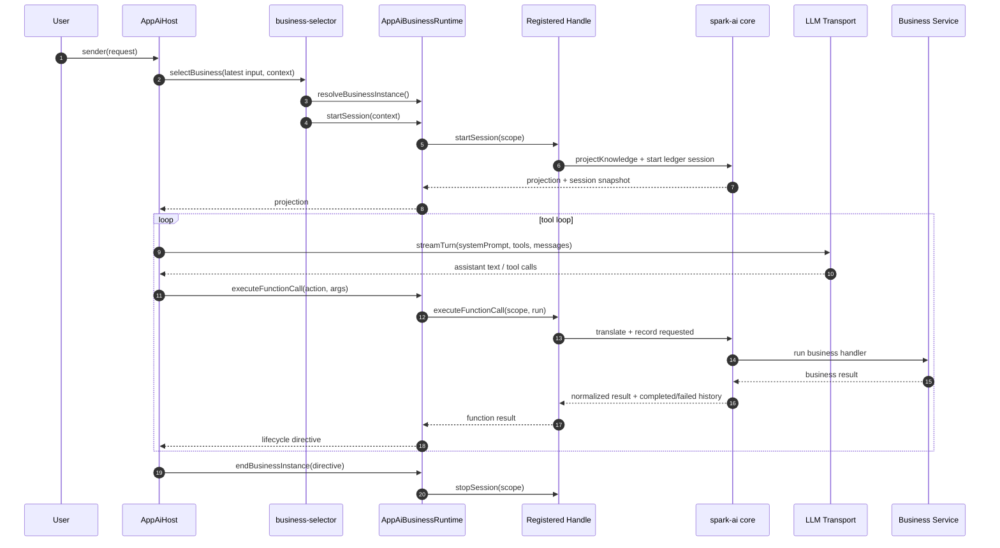

# AI 核心层生命周期与事件时序设计

> 状态：生命周期与时序主文档。第 1-19 章保留早期状态机推演；第 20 章合并 2026-05-15 的落地修订，记录当前实现中 core session ledger、registered handle、AppAiHost tool loop 的真实生命周期边界。当前代码以 `packages/spark-ai/ARCHITECTURE.md` 与本文第 20 章为准。

> 目标：定义业务实例从创建到销毁的稳定状态机，以及在“AI 会话宿主负责下一步交互决策、核心层只负责执行与记录”的前提下，核心层应该如何处理启动、执行、暂停、恢复、停止与事件时序。

## 1. 文档目标

本文只讨论概念模型，不讨论具体工程挂接、语言实现、协议选型或厂商适配。

本文解决的问题是：

1. 业务实例从创建到销毁，生命周期如何定义。
2. AI 会话宿主与核心层的边界到底在哪里。
3. 核心层如何处理一次函数执行，而不是一轮编排。
4. 通用历史、实例查询和事件时序如何稳定化。

## 2. 参与角色

| 角色 | 职责 |
|---|---|
| BusinessRegistry | 保存业务定义，提供按业务 ID 查询能力 |
| InstanceManager | 创建、查询、恢复、暂停、停止业务实例 |
| SessionHistoryManager | 统一管理 sessionId、对话历史、函数执行历史与生命周期标记 |
| FunctionAvailabilityResolver | 从模块函数目录计算当前实例可提供给 AI 会话宿主的函数集合 |
| FunctionExecutionGateway | 接收并执行单次函数调用 |
| ModuleRuntime | 承载模块级运行态和局部钩子 |
| ModuleRuntimeDirectory | 保存核心层创建的模块运行态索引，向业务层提供订阅和查询视图 |
| EventBus | 统一向外发布生命周期、函数、历史、系统事件 |
| AI 会话宿主 | 业务系统中的 AI 对话入口，负责围绕某个 instanceId 推进模型对话 |

核心原则：

1. BusinessRegistry 只保存定义，不保存运行态。
2. InstanceManager 才是实例生命周期入口。
3. SessionHistoryManager 负责通用历史，不由业务层重复维护。
4. FunctionExecutionGateway 只执行一次函数调用，不做任何编排。
5. FunctionAvailabilityResolver 只回答“当前能用哪些函数”，不回答“下一步该用哪个函数”。
6. 模块运行态由核心层创建并索引，业务层通过模块门面 getInstance(instanceId) 获取运行态；subscribe 只负责通知可用或变更。
7. AI 会话宿主才负责下一步交互决策。
8. EventBus 是统一观测面，不是控制面。
9. TS 接口只约束业务系统 <-> AI 核心层的内部交易；LLM <-> AI 核心层的消息、tool schema、system prompt 投喂格式由 AI 会话宿主 / 协议投影层负责。

## 3. 实例状态机

建议使用以下状态：

| 状态 | 含义 | 可接受动作 |
|---|---|---|
| Starting | 正在创建模块运行态、sessionId 和通用历史 | 无外部业务动作 |
| Ready | 已就绪，可接收历史追加、函数查询和函数执行请求 | appendMessages、getAvailableFunctions、executeFunctionCall、stopSession |
| Executing | 核心层正在执行单次函数调用 | stopSession(mode=pause，登记 pendingPause)、stopSession(mode=stop)、abortSession |
| Paused | 当前实例被显式挂起，等待外部恢复 | startSession(恢复)、stopSession、abortSession |
| Resuming | 正在恢复实例资源并重新暴露函数集合 | 无外部业务动作 |
| Stopping | 正在清理模块运行态和归档历史 | 无外部业务动作 |
| Stopped | 正常终止，终态 | 无 |
| Failed | 异常终止，终态 | query |

推荐状态迁移：

1. Starting -> Ready
2. Ready -> Executing -> Ready
3. Ready -> Paused
4. Executing -> Paused，仅当执行期间登记了 pendingPause，且当前函数已完成结算
5. Paused -> Resuming -> Ready
6. Ready -> Stopping -> Stopped
7. Executing -> Stopping -> Stopped
8. Paused -> Stopping -> Stopped
9. Starting、Executing、Resuming、Stopping 均可进入 Failed

约束：

1. 一个实例同一时刻只能有一个活跃的 Executing。
2. 终态之后不得再发起新的业务动作。
3. Ready 代表实例可继续服务，但不代表核心层在做多步编排。
4. Paused 不是失败，而是外部显式控制下的可恢复静止态。
5. Created 若存在，只能是 startSession 内部瞬态，不作为外部可观察状态。

## 4. 核心公共 API

核心层对外建议收敛为以下通用 API：

| API | 说明 |
|---|---|
| startSession | 启动新实例；若携带 instanceId，则表示恢复 |
| stopSession | 请求实例暂停或停止，mode 决定是 pause 还是 stop |
| abortSession | 强制中止实例，优先回收资源 |
| appendMessages | 向通用会话历史追加 user / assistant 消息 |
| getAvailableFunctions | 查询当前实例可提供给 AI 会话宿主的函数集合 |
| executeFunctionCall | 执行一次函数调用 |
| listInstances | 查询业务实例列表 |
| getInstanceDetail | 按 ID 查询实例详情，包含模块运行态视图 |
| getSessionHistory | 按 instanceId 查询通用会话历史；核心层内部以 sessionId 作为存储键 |
| subscribe | 订阅实例事件、模块运行态事件或全局事件 |

语义约束：

1. startSession 的输出必须包含 instanceId、当前提示词快照与当前可用函数集合；sessionId 由核心层内部派生，不出现在对外输出中。
2. stopSession 可以对 Ready、Executing、Paused 发起，且必须显式区分 pause 与 stop。
3. executeFunctionCall 必须在调用信封中显式传 instanceId。
4. appendMessages 只负责写 user / assistant 历史，不触发任何核心层编排。
5. getAvailableFunctions 与 executeFunctionCall 是 AI 会话宿主对接核心层的主入口。

## 5. 会话身份与历史

建议采用组合会话身份：

- businessId：业务注册 ID。
- instanceId：业务实例 ID。
- sessionId：businessId + instanceId，由核心层内部派生和管理，不对外暴露。

业务层与外部调用方均只感知 instanceId，不感知 sessionId。

SessionHistoryManager 至少应统一管理：

1. 由 appendMessages 写入的 user / assistant 消息历史。
2. 由 executeFunctionCall 写入的 tool / function result 历史。
3. 每次函数暴露集合快照。
4. 每次函数调用的 instanceId、action、参数与结果。
5. pause / resume / stop / fail 等生命周期标记。

## 6. 事件模型

推荐事件类型：

| 类别 | 事件 |
|---|---|
| 实例生命周期 | instance.starting、instance.started、instance.ready、instance.paused、instance.resuming、instance.stopping、instance.stopped、instance.failed |
| 模块运行态 | module.starting、module.started、module.available、module.stopping、module.stopped |
| 函数可用集 | functions.exposed |
| 函数执行 | function.before、function.succeeded、function.failed |
| 历史事件 | history.message.appended、history.functionCall.appended、history.functionExposure.snapshot、history.archived |
| 系统事件 | warning、error、debug |

统一事件包结构建议至少包含以下字段：

| 字段 | 含义 |
|---|---|
| eventId | 全局唯一事件 ID |
| seq | 实例内单调递增序号 |
| timestamp | 事件发生时间 |
| type | 事件类型 |
| businessId | 所属业务定义 ID |
| instanceId | 所属实例 ID |
| sessionId | 所属组合会话 ID |
| moduleId | 所属模块 ID，可选 |
| functionId | 所属函数 ID，可选 |
| causeEventId | 直接原因事件 ID，可选 |
| payload | 事件正文 |

约束：

1. 同一实例内事件顺序必须稳定。
2. 跨实例之间不保证全局顺序。
3. 监听器异常不得打爆主流程。
4. 终态之后不得继续发出实例生命周期事件。
5. 事件是观测面，不直接驱动内部状态突变。

## 7. 启动时序

### 7.1 目标

启动阶段的目标是把“业务定义”变成“可运行实例”，并在结束时把“当前提示词快照”和“当前可用函数集合”稳定交给 AI 会话宿主。

### 7.2 标准流程

1. 外部调用 startSession，传入 businessId。
2. InstanceManager 查询 BusinessRegistry，定位业务定义。
3. InstanceManager 分配 instanceId，创建实例骨架，状态置为 Starting。
4. 基于 businessId + instanceId 生成 sessionId。
5. SessionHistoryManager 初始化该 sessionId 的通用历史。
6. EventBus 发出 instance.starting。
7. 依次创建各模块的 ModuleRuntime。
8. 每个模块创建前后可发出 module.starting、module.started。
9. ModuleRuntimeDirectory 索引核心层创建的模块运行态，并发出 module.available。
10. 业务层如需感知模块运行态，通过 subscribe 接收 module.available，再通过模块门面的 getInstance(instanceId) 获取模块运行态。
11. 核心层通过模块门面读取提示词片段和函数目录。
12. FunctionAvailabilityResolver 计算当前可用函数集合。
13. SessionHistoryManager 记录函数暴露集合快照。
14. 状态切换为 Ready。
15. EventBus 依次发出 instance.started、functions.exposed、instance.ready。
16. 向调用方返回 instanceId、当前提示词快照、当前状态快照与可用函数集合。

### 7.3 启动阶段的关键约束

1. 启动失败时不能留下半初始化实例。
2. 若部分模块已启动，失败时必须反向清理。
3. 启动完成前不能接受 executeFunctionCall。
4. 恢复场景下不得重新分配新的 sessionId。
5. 业务层不得在启动过程中主动注册模块运行态实例。
6. 提示词快照和函数目录必须来自模块门面接口，不得从第二套目录读取。
7. 模块门面接口是业务系统 <-> AI 核心层的内部契约，不是 LLM tool schema 或模型消息协议。

## 8. AI 会话驱动交互时序

### 8.1 目标

这里描述的不是核心层内部编排，而是“AI 会话宿主如何围绕一个 instanceId 与核心层交互”。

AI 会话宿主不是会话本身。会话状态、历史、函数集合和生命周期仍由核心层保存；AI 会话宿主只是业务系统里驱动这次对话的入口。

### 8.2 标准流程

1. AI 会话宿主使用 startSession 返回的提示词快照作为模型 system prompt 输入。
2. AI 会话宿主通过 appendMessages 写入 user 或 assistant 消息。
3. 核心层写入历史，并发出 history.message.appended。
4. AI 会话宿主调用 getAvailableFunctions，读取当前可用函数集合。
5. 核心层返回可用函数集合快照。
6. AI 会话宿主自行决定下一步：继续输出文本，还是发起 executeFunctionCall。
7. 若 AI 会话宿主选择调用函数，则进入单次函数执行时序。
8. 若 AI 会话宿主选择暂停，则调用 stopSession(mode=pause)。
9. 若 AI 会话宿主选择结束，则调用 stopSession(mode=stop)。

### 8.3 关键约束

1. 函数调用顺序由 AI 会话宿主决定，不属于核心层。
2. 核心层不负责循环、重试、追问或多步计划。
3. AI 会话宿主转交给核心层的函数调用信封中必须显式传 instanceId。
4. AI 会话宿主负责把 user / assistant 文本写回统一历史。
5. tool / function result 由 executeFunctionCall 在核心层统一写入历史。

## 9. 单次函数执行时序

### 9.1 目标

函数执行是核心层内部唯一需要稳定化的主路径，它处理的是一次调用，而不是一轮编排。

### 9.2 标准流程

1. 外部调用 executeFunctionCall(instanceId, action, args)；sessionId 不由外部传入，由核心层内部派生。
2. InstanceManager 校验实例当前必须处于 Ready。
3. 状态切换为 Executing。
4. FunctionExecutionGateway 校验 instanceId 是否存在。
5. 校验 action 中的 businessId 是否与实例 businessId 一致。
6. 根据 instanceId 派生 sessionId（核心层内部使用，不经由外部传入）。
7. 校验目标函数是否在当前可用函数集合中。
8. 读取对应 ModuleRuntime。
9. 发出 function.before。
10. 执行模块级前置钩子。
11. 执行函数参数校验。
12. 执行业务正文。
13. 执行函数后置校验。
14. 执行模块级后置钩子。
15. 将函数调用与 tool / function result 写入 SessionHistoryManager。
16. 根据结果发出 function.succeeded 或 function.failed。
17. 如有必要，重新计算可用函数集合，写入函数暴露集合快照，并发出 functions.exposed。
18. 若执行期间存在 pendingPause，写入 pause 生命周期标记并切换为 Paused。
19. 若执行期间存在 pendingStop，进入 Stopping。
20. 否则状态切回 Ready。
21. 向调用方返回统一函数结果与最新历史快照。

### 9.3 失败分层

函数失败并不自动等价于实例失败。

建议区分三层失败：

| 失败层级 | 含义 |
|---|---|
| Function Failed | 单次函数执行失败 |
| Conversation Interaction Failed | AI 会话宿主这一轮交互无法继续 |
| Instance Failed | 实例进入不可恢复终态 |

### 9.4 钩子语义建议

1. 前置钩子可阻止函数执行。
2. 后置钩子不应覆盖原始成功结果，最多附加警告。
3. 模块钩子失败默认先降级为警告，只有明确声明为致命时才升级为实例失败。

## 10. 暂停时序

### 10.1 暂停触发条件

建议允许以下三类暂停源：

1. AI 会话宿主明确决定暂停。
2. 某次函数结果要求等待外部输入或异步条件。
3. 业务策略或用户操作明确要求暂停。

### 10.2 标准流程

1. 外部调用 stopSession(mode=pause)。
2. InstanceManager 校验实例当前处于 Ready 或 Executing 的可暂停状态。
3. 若实例处于 Ready，状态切换为 Paused。
4. 若实例处于 Executing，只登记 pendingPause，不直接切换为 Paused。
5. SessionHistoryManager 写入 pause 请求或 pause 生命周期标记。
6. Ready 直接暂停时，EventBus 发出 instance.paused。
7. Executing 登记 pendingPause 时，等当前函数结算后再写入最终 pause 标记并发出 instance.paused。
8. 当前调用链把控制权交还外部。

### 10.3 Paused 状态的语义

Paused 的本质不是“编排卡住”，而是“核心层把实例维持在可恢复静止态，等待外部下一次恢复请求”。

在 Paused 状态下，建议只允许：

1. startSession，携带 instanceId 执行恢复。
2. stopSession。
3. abortSession。
4. getInstanceDetail。
5. getSessionHistory。

## 11. 恢复时序

### 11.1 目标

恢复不是继续核心层内部编排，而是把一个 Paused 的实例重新带回 Ready，并重新暴露当前可用函数集合。

### 11.2 标准流程

1. 外部调用 startSession，传入 instanceId 和恢复上下文。
2. InstanceManager 校验实例当前必须处于 Paused。
3. 状态切换为 Resuming。
4. EventBus 发出 instance.resuming。
5. SessionHistoryManager 写入 resume 生命周期标记。
6. 如有必要，恢复模块运行态资源。
7. ModuleRuntimeDirectory 重新确认模块运行态索引，并按需发出 module.available。
8. 核心层重新读取模块提示词片段和函数目录。
9. FunctionAvailabilityResolver 重新计算当前可用函数集合。
10. SessionHistoryManager 写入函数暴露集合快照。
11. 状态切换为 Ready。
12. EventBus 发出 functions.exposed 与 instance.ready。
13. 向调用方返回最新提示词快照、状态快照与可用函数集合。

### 11.3 恢复的关键约束

1. 恢复必须绑定原实例 ID，不得生成新实例。
2. 恢复必须沿用原 sessionId。
3. 同一个暂停点不得被重复恢复为两条并行执行流。
4. 只有 Paused 状态允许恢复，Ready 状态不得重复恢复。

## 12. 停止时序

### 12.1 正常停止

正常停止适用于用户主动关闭实例、业务完成或资源回收。

标准流程：

1. 外部调用 stopSession(mode=stop)。
2. InstanceManager 将状态切换为 Stopping。
3. EventBus 发出 instance.stopping。
4. 若当前有可取消的函数执行，则先请求取消。
5. 依次停止各模块运行态。
6. 对各模块发出 module.stopping、module.stopped，并从 ModuleRuntimeDirectory 移除索引。
7. SessionHistoryManager 写入 stop 生命周期标记并完成归档。
8. 清理实例快照与暂停槽位。
9. 状态切换为 Stopped。
10. EventBus 发出 history.archived 与 instance.stopped。

### 12.2 强制中止

强制中止适用于：

1. 外部取消。
2. 超时。
3. 不可恢复错误。
4. 紧急资源回收。

语义差异：

1. 正常停止追求有序清理。
2. 强制中止优先尽快释放资源。
3. 中止后可直接进入 Stopped 或 Failed，取决于系统定义。

## 13. 失败时序

### 13.1 失败来源

失败可能来自以下区域：

1. 启动失败。
2. 模块运行态创建失败。
3. 函数执行网关内部异常。
4. 不可恢复的函数执行错误。
5. 清理阶段失败。

### 13.2 标准流程

1. 任一关键阶段抛出不可恢复错误。
2. 核心层记录失败原因和失败位置。
3. EventBus 发出 error。
4. EventBus 发出 instance.failed。
5. 尝试做最小必要清理。
6. 实例进入 Failed 终态。

### 13.3 建议的失败策略

1. 可恢复错误优先留在函数级。
2. AI 会话宿主是否继续交互，由外部自己决定。
3. 不可恢复错误才升级到实例级。
4. Failed 终态应保留最后快照和失败上下文，便于诊断。

## 14. 取消时序

取消是一个独立于失败的控制路径。

建议显式区分：

| 概念 | 含义 |
|---|---|
| Cancel | 外部主动要求终止当前流程 |
| Fail | 系统因异常无法继续 |
| Pause | 系统主动进入可恢复静止态 |

取消的推荐流程：

1. 外部发起 abortSession 或 stopSession。
2. 若当前在 Executing，优先向函数执行器发出取消信号。
3. 记录取消来源和取消原因。
4. 完成清理后进入 Stopped。
5. 若取消过程中出现不可恢复异常，可升级为 Failed。

## 15. 事件顺序约束

为了让 UI、日志、监控、调试都能稳定消费事件，建议明确以下顺序规则：

1. instance.starting 必须先于任何 module.starting。
2. instance.started 必须晚于所有必要模块启动成功。
3. module.available 必须晚于对应的 module.started。
4. functions.exposed 必须晚于 instance.started 或任何导致可用集变化的状态切换。
5. instance.ready 必须晚于 functions.exposed。
6. function.before 必须早于 function.succeeded 或 function.failed。
7. history.message.appended 必须反映真实写入顺序。
8. instance.paused 必须晚于对应的 pause 生命周期标记写入。
9. instance.stopping 必须早于任何 module.stopping。
10. history.archived 必须晚于 stop 生命周期标记写入。
11. instance.stopped 或 instance.failed 必须是实例生命周期最后事件之一。
12. 同一实例内的 seq 必须严格单调递增。

## 16. 一致性约束

### 16.1 实例级隔离

1. 一个实例只能有一个当前活动函数执行。
2. 一个模块在一个实例中只能有一个 ModuleRuntime。
3. ModuleRuntime 必须由核心层创建并登记到 ModuleRuntimeDirectory。
4. 业务层只能通过模块门面 getInstance(instanceId) 获取模块运行态，不得主动注册模块运行态实例。
5. 实例之间不得共享可变暂停槽位和可变模块状态。
6. 每个 sessionId 都必须只对应一个 instanceId。

### 16.2 幂等性建议

1. stopSession 应该天然幂等。
2. 同一 pauseToken 的 startSession(恢复) 只能成功一次。
3. 重复的 abortSession 应直接返回当前终态。
4. 启动失败后的清理应可重复执行。
5. Executing 期间重复 stopSession(mode=pause) 应复用同一个 pendingPause。

### 16.3 可观测性建议

1. 所有关键状态切换必须有事件。
2. 每个失败必须记录失败点。
3. 每个暂停必须记录暂停原因和恢复协议。
4. 每个终态必须保留最后快照。
5. 每个 sessionId 都必须能回查到统一历史。

## 17. 最小时序闭环

如果把整套系统压缩成一个最小闭环，时序可以概括为：

1. 注册业务定义。
2. 启动实例，进入 Ready，并返回提示词快照与可用函数集合。
3. 业务层通过 subscribe 感知模块可用，再通过模块门面 getInstance(instanceId) 获取模块运行态。
4. AI 会话宿主使用提示词快照，追加消息并读取可用函数集合。
5. AI 会话宿主发起一次 executeFunctionCall。
6. 核心层执行函数并写入函数调用 / tool 结果历史。
7. 若 AI 会话宿主决定暂停，则调用 stopSession(mode=pause)。
8. 若 AI 会话宿主决定恢复，则调用 startSession(instanceId)。
9. 若 AI 会话宿主决定结束，则调用 stopSession(mode=stop)。

这就是一套稳定的核心层生命周期闭环。

## 18. 与概念模型文档的衔接

[AI_CORE_LAYER_CONCEPT_MODEL.md](AI_CORE_LAYER_CONCEPT_MODEL.md) 定义了静态对象边界：

1. 业务定义。
2. 业务实例。
3. 模块定义。
4. 函数定义。
5. 会话历史管理器。
6. 函数可用集解析器。
7. 函数执行网关。
8. 模块运行态目录。
9. 事件总线。
10. AI 会话宿主。

本文定义的是这些对象在时间维度上的组织方式，也就是：

1. 什么时候创建。
2. 什么时候暴露函数集合。
3. 什么时候执行一次函数调用。
4. 什么时候暂停。
5. 什么时候恢复。
6. 什么时候停止。
7. 哪些状态合法。
8. 哪些顺序不能破坏。

## 19. 结论

这套生命周期与时序设计的核心结论可以压缩为四句话：

1. 业务定义是静态目录，业务实例是运行根。
2. Ready、Executing、Paused 是三个必须区分的核心运行态。
3. 核心层只执行一次函数调用并记录结果，不负责任何编排。
4. AI 会话宿主负责下一步交互决策，核心层负责状态、可用函数、历史与事件。

## 20. 2026-05-15 落地修订：当前实现的生命周期边界

本章覆盖前文早期概念中“Core 创建 ModuleRuntime”“Core 提供 pause/resume/abort/listInstances/subscribe”等设计。当前实现已经收敛为：core 管 AI session 和函数调用账本，业务服务管业务实例状态，AppAiHost 管模型交互轮次。

### 20.1 当前三层生命周期

| 层级 | 生命周期对象 | 启动 | 结束 | 状态持有者 |
|---|---|---|---|---|
| `spark-ai core` | AI session | `handle.startSession()` | `handle.stopSession()` | `AiSessionLedger` |
| `AppAiHost` | 一轮模型交互 / tool loop | `sender(request)` | tool loop complete / abort / max rounds / signal aborted | `AppAiToolLoopRunner` 与宿主 transport |
| 业务服务 | 真实业务实例，如 PageDesign 页面编辑会话、LeaveRequest 草稿 | `resolveBusinessInstance()` 后业务 runtime 自行准备 | `endBusinessInstance()` / `releaseModuleInstance()` | 业务服务自身 |

核心变化：

1. `startSession` / `stopSession` 只表示 AI session 生命周期，不释放业务服务实例。
2. 业务实例 ID 使用 `moduleInstanceId` 表达；`instanceId` 是 AI 会话 envelope/alias。
3. Core 不再创建或索引 `ModuleRuntime`，也不维护业务运行态目录。
4. Pause/resume/abort 不是 core 公共 API；是否完成、暂停或释放由业务 runtime 与 AppAiHost lifecycle directive 决定。
5. Core 只负责函数调用链路：translate -> requested -> run -> normalize -> completed/failed。

### 20.2 当前最小时序



### 20.3 与早期状态机的映射

| 早期概念 | 当前实现 |
|---|---|
| `Starting` | `business-selector` 选择业务并调用 runtime `startSession`；core 创建/恢复 AI session ledger 记录 |
| `Ready` | 已取得 projection，AppAiHost 可以发起 `streamTurn` |
| `Executing` | `AiFunctionCallExecutor.executeFunctionCall()` 单次执行期间 |
| `Paused` / `Resuming` | 不再是 core 可观察状态；由宿主或业务 runtime 自行表达 |
| `Stopping` / `Stopped` | `handle.stopSession()` 只把 AI session 标记为 `Stopped`；业务服务释放另行处理 |
| `Failed` | 函数调用失败写入 functionCall failed；是否终止业务由 lifecycle directive 决定 |

### 20.4 当前 API 收敛

保留在 registered handle 上的生命周期相关入口：

- `startSession(options)`
- `stopSession(options)`
- `projectKnowledge(options)`
- `appendMessage(options)`
- `executeFunctionCall(options)`
- `getSession(moduleInstanceId)`
- `getSessionHistory(moduleInstanceId)`

删除或不再作为当前 core 公共 API 的早期建议：

- `startSession({ businessId })` 这种裸 core 入口。
- `getAvailableFunctions`，当前由 `projectKnowledge().availableFunctions` 承接。
- `appendMessages`，当前 handle 使用单条 `appendMessage`，AppAiHost 负责 transport append messages。
- `pauseSession` / `abortSession` / `resumeSession`。
- `listInstances` / `getInstanceDetail`。
- `subscribe` / `EventBus`。
- 对外暴露 `sessionId`。

### 20.5 事件与诊断的当前位置

早期文档中的 EventBus 没有进入当前 core。当前诊断事件在 AppAiHost 边界产生：

- `llm-request`：发起 `streamTurn` 前记录 system prompt、tools、messages、round、scope。
- `llm-append`：业务完成/中止后，把 assistant/tool messages append 到 transport 前记录。
- `tool-result`：每次工具调用完成后记录 action、result、streamKey、scope。

这些事件是宿主诊断 envelope，不是 core 控制面。Core 的可追溯事实仍然是 `AiSessionLedger` 中的 message / functionCall history。

### 20.6 验证要求

本轮 AI 生命周期相关验证命令：

```bash
pnpm --filter @spark-view/spark-ai run typecheck
pnpm run test:run -- --config vitest.spark-ai.config.ts tests/ai-runtime-business.test.ts tests/app-ai-host.test.ts tests/protocol-parser-json-extract.test.ts tests/page-design-business-definition.test.ts
```
