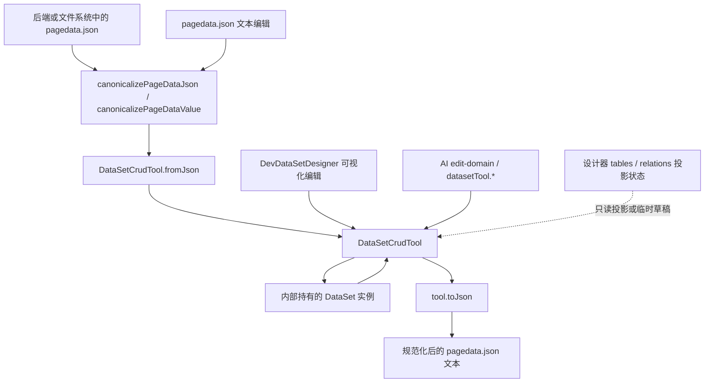
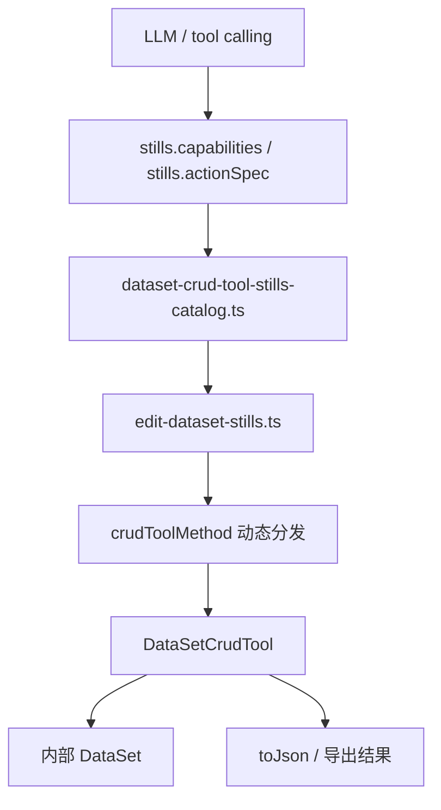
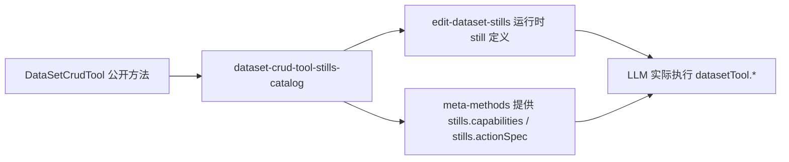

# DevSystem DataSetCrudTool SSoT 关系说明

> 目的：把 `pagedata.json`、`DataSet`、`DataSetCrudTool`、DevSystem 可视化设计器、AI 细粒度编辑目录之间的职责边界理顺，避免再次出现“UI 直改投影状态”或“改了工具层但没同步 AI 能力目录”的分层漂移。

## 一句话结论

当前实现里，**唯一允许承担页面数据编辑写入口的对象是 `DataSetCrudTool`**。

这意味着：

- `pagedata.json` 是页面数据的**序列化格式**，不是运行时直接编辑边界。
- `DataSet` 是 `DataSetCrudTool` 内部持有和维护的**模型实例**，不是 DevSystem UI 直接操作的主入口。
- `DevDataSetDesigner`、`pagedata.json` 文本编辑、AI stills 编辑，都应该收敛到 `DataSetCrudTool`。
- 如果修改了 `DataSetCrudTool` 的公开编辑能力，且希望 AI 也能使用，必须同步更新 `packages/spark-ai/src/business/page-design/stills/dataset-crud-tool-stills-catalog.ts`。

## 先把几个对象分清楚

### 1. `pagedata.json`

职责：持久化文件格式。

它的意义是：

- 从磁盘或后端加载时，提供页面数据的 JSON 表达。
- 保存时，承接 `DataSetCrudTool.toJson()` 的结果。
- 文本编辑器模式下，允许用户直接编辑 JSON，但保存/结构化编辑前仍要重新进入工具层归一化。

它**不是**：

- UI 内部的主状态对象。
- AI 的直接能力目录。
- 可视化设计器的事实源。

### 2. `DataSet`

职责：数据模型本体。

它负责：

- 表、列、视图、关系、依赖等运行时模型。
- `toJson()` / `fromJson()` 的序列化与反序列化基础能力。
- 底层模型一致性与局部结构操作。

它**不是**当前 DevSystem 分层下推荐的 UI 直接写入口。

原因不是 `DataSet` 不能改，而是：

- DevSystem 需要历史、撤销/重做、归一化、批量替换等编辑语义。
- AI stills 需要稳定、显式、对象参数签名的方法边界。
- UI 直接改 `DataSet` 或直接改投影状态，都会绕过工具层的统一写入口。

### 3. `DataSetCrudTool`

职责：页面数据编辑的唯一写入口。

它负责：

- 持有当前正在编辑的 `DataSet` 实例。
- 对外暴露显式编辑动作，例如建表、改列、删关系、改依赖、重命名表/列。
- 统一历史、替换、reconcile、撤销/重做等编辑语义。
- 对 AI 提供稳定的方法目录基础。

所以，`DataSetCrudTool` 才是 DevSystem 和 AI 的 SSoT 写边界。

### 4. DevSystem 的 UI 投影状态

例如：

- 设计器里的 `tables`
- `relations`
- 当前选中表 / 列
- 关系编辑弹窗草稿对象

这些对象的职责应该是：

- 渲染
- 临时输入缓存
- 交互态

它们不应该承担：

- 持久化写入口
- 模型合法性最终判定
- 与 `pagedata.json` 并行竞争的另一份事实源

## 当前实现的正确分层

这张图里最关键的点有两个：

1. `pagedata.json` 进入运行时后，不应再直接成为 UI 写入口，而是先转成 `DataSetCrudTool`。
2. 设计器和 AI 都不应该绕开 `DataSetCrudTool` 直接改 `DataSet` 或直接改 UI 投影状态。

## DevSystem 链路怎么走

### 文本编辑链路

`pagedata.json` 文本编辑的正确路径是：

1. 用户编辑 JSON 文本。
2. `useDevState` 调用 `canonicalizePageDataJson()`。
3. `canonicalizePageDataJson()` 内部通过 `DataSetCrudTool.fromJson()` 归一化。
4. `useDevState` 持有 `pageDataTool`，而不是直接持有一个裸 `DataSet` 作为编辑核心。
5. 保存时再从 `pageDataTool.toJson()` 回写为规范 JSON。

也就是说，文本编辑虽然表面上是在改 JSON，**真正进入系统的仍然是工具层语义**。

### 可视化设计器链路

`DevDataSetDesigner` 的正确路径是：

1. 从 `pageDataTool` 或导入内容构造/复用 `historyTool`。
2. 所有持久化字段修改，都通过 `applyMutationWithHistory()` 调用 `DataSetCrudTool` 方法。
3. UI 内部的 `tables` / `relations` 只是基于工具层状态生成出来的投影。
4. 投影刷新后再反映到界面。

因此，像下面这类行为属于错误方向：

- `v-model="table.tableName"` 直接改投影，再让工具层事后追认。
- `v-model="col.name"` 直接改列名。
- UI 先自己判断数据结构是否合法，再决定要不要交给工具层。

正确方向是：

- 表名修改 -> `tool.renameTable(...)`
- 列名修改 -> `tool.renameColumn(...)`
- 列标签/类型/主键等修改 -> `tool.updateColumn(...)`
- 表语义修改 -> `tool.updateTable(...)`

## AI 链路怎么走

AI 不是直接“会调用 `DataSetCrudTool` 所有公开方法”。

AI 真正走的是下面这条链：

这条链说明了一个非常容易遗漏的事实：

**AI 可见能力，不等于 `DataSetCrudTool` 里存在的方法集合；AI 可见能力，等于 stills catalog 里声明出来的方法集合。**

也就是说：

- 你在 `DataSetCrudTool` 新增了 `renameTable()`，不代表 AI 立刻会用。
- 只有把它补进 `dataset-crud-tool-stills-catalog.ts`，AI 才能在能力目录、参数说明、运行时分发里看到它。

## 为什么“改工具层时要同步能力目录”

原因很简单：AI 运行时不是靠 TypeScript 反射自动枚举公开方法，而是靠**目录表**来工作。

目录表承担三件事：

1. 给 LLM 暴露可用动作名，例如 `datasetTool.renameColumn`。
2. 给 LLM 暴露参数 schema、示例、使用规则、失败模式。
3. 给运行时 still 执行器提供 `crudToolMethod` 映射。

因此，`DataSetCrudTool` 与 AI 目录的关系是：

如果只改了 A，不改 B，就会出现下面的问题：

- UI 可用，但 AI 不可用。
- 运行时方法存在，但 `stills.capabilities` 看不到。
- `stills.actionSpec` 不知道参数怎么传。
- LLM 无法稳定生成正确调用。

## 当前代码中的职责映射

### DevSystem 前端

- `src/views/app/dev-system/useDevState.ts`
  - 持有 `pageDataTool`
  - 负责文本编辑状态、规范化、保存链路
- `src/views/app/dev-system/policies/pageDataJsonSchema.ts`
  - 负责把原始 JSON 归一化为 `DataSetCrudTool`
  - structured editor schema 术语与 stills 目录保持一致
- `src/views/app/dev-system/DevDataSetDesigner.vue`
  - 负责设计器 UI、交互和投影渲染
  - 持久化修改应统一经 `DataSetCrudTool`

### spark-data

- `packages/spark-data/src/dataset.ts`
  - 负责底层数据模型
- `packages/spark-data/src/dataset-crud-tool.ts`
  - 负责唯一编辑入口
  - 对 UI 和 AI 暴露稳定动作边界

### spark-ai

- `packages/spark-ai/src/business/page-design/stills/edit/edit-domain.ts`
  - `edit.bootstrap` 时构造 `state.datasetEdit = DataSetCrudTool.fromJson(...)`
- `packages/spark-ai/src/business/page-design/stills/dataset-crud-tool-stills-catalog.ts`
  - AI 能力目录事实源
- `packages/spark-ai/src/business/page-design/stills/edit/tools/edit-dataset-stills.ts`
  - 根据目录表动态分发到 `DataSetCrudTool`
- `packages/spark-ai/src/stills/meta-methods.ts`
  - 把目录表暴露为 `stills.capabilities` / `stills.actionSpec` 等元查询能力

## 维护规则

### 规则 1

新增或修改 `DataSetCrudTool` 的公开编辑方法时，先判断它是不是“正式能力边界”。

如果答案是是，那么它不应只停留在 `spark-data` 内部，而应继续判断：

- DevSystem UI 是否需要走这个方法。
- AI 是否也需要走这个方法。

### 规则 2

只要 AI 需要使用该方法，就必须同步更新：

- `packages/spark-ai/src/business/page-design/stills/dataset-crud-tool-stills-catalog.ts`

通常要补的内容包括：

- `action`
- `crudToolMethod`
- `paramsSchema`
- `resultSchema`
- `example`
- `usageRules`
- `failureModes`

### 规则 3

不要让 UI 投影状态承担“第二写入口”。

如果发现某个输入控件是：

- 直接 `v-model` 到 `table.*` / `column.*` / `relation.*`
- 然后再试图把结果同步回工具层

这通常意味着分层已经开始漂移，应该改为：

- 临时草稿对象允许本地 `v-model`
- 点击确认时，统一调用 `DataSetCrudTool`

### 规则 4

`pagedata.json` 的结构兼容、规范化与合法性判断，优先下沉到模型层或工具层，不放在 UI 层做先验拦截。

## 变更检查清单

以后只要改到 `DataSetCrudTool`，都建议过一遍这张表：

| 问题 | 应该回答什么 |
|------|--------------|
| 这个改动是内部实现细节，还是新的正式编辑能力？ | 如果是正式能力，要继续看 AI 目录是否需要同步 |
| DevSystem UI 是否已经通过工具层调用它？ | 不允许 UI 直接改投影状态绕过它 |
| `pagedata.json` 文本链路是否仍然会回到工具层？ | 应该始终回到 `DataSetCrudTool.fromJson()/toJson()` |
| AI 的 `datasetTool.*` 是否需要新增动作？ | 需要时同步 stills catalog |
| `stills.capabilities` / `stills.actionSpec` 能否看到这个动作？ | 看不到就说明目录没同步 |

## 最终约束

可以把这套关系压缩成一句维护规则：

> `pagedata.json` 是序列化格式，`DataSet` 是内部模型，`DataSetCrudTool` 是唯一写入口，`dataset-crud-tool-stills-catalog` 是 AI 对该写入口的能力目录投影。

谁绕过了这条线，谁就在制造第二事实源。
