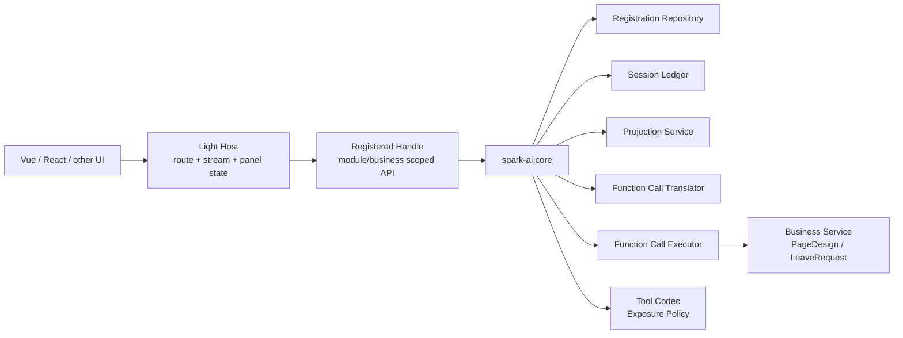

# SPARK AI Core 与 AppAiHost 边界决策记录

> 记录日期：2026-05-15  
> 适用范围：`@spark-view/spark-ai` core、`src/services/ai-host`、PageDesign / LeaveRequest 业务注册层。

## 结论

本轮采用“重核心、轻宿主”的架构方向：所有与前端框架无关的 AI 协议、注册、会话账本、知识投影、函数调用翻译、执行链路、tool codec、工具暴露策略和结果序列化都沉入 `spark-ai core`；`AppAiHost` 只保留业务选择、模型 transport、tool loop 编排、SSE 诊断事件和面板状态适配。

这是一轮 breaking change，不保留旧裸 API 兼容层。

## 为什么要拆

拆分前 `AiRuntime` 同时承担 registration repository、session ledger、projection、translator、executor、registered API factory、business/module 互转和协议工具职责，单文件已经超过千行。它既是组合根，又直接暴露裸会话方法，导致三个问题：

- SRP 被破坏：注册、会话、投影、翻译、执行和 API 工厂混在同一个类。
- SSOT 分散：action 解析、result stringify、tool exposure 等逻辑在 core 和 host 之间重复。
- 难以跨宿主复用：Vue AppAiHost 中沉淀了部分通用 AI 协议逻辑，未来 React、Web Component、Node server 宿主会被迫复制。

因此本轮不是“小重构”，而是把 core 明确改成 AI runtime 内核，把 host 降为薄适配层。

## 责任边界



| 层级 | 负责 | 不负责 |
|---|---|---|
| `spark-ai core` | 注册 SSOT、session/history ledger、knowledge projection、action 翻译、参数校验、函数调用执行链路、tool codec、工具暴露策略、结果序列化 | 大模型请求、SSE、UI 状态、业务实例生命周期、业务结果编排决策 |
| `AppAiHost` | 业务选择、scope 创建、调用 runtime.startSession、streamTurn、tool loop、多轮 pending messages、诊断事件、面板状态 | PageDesign 细节、action 解析细节、tool schema 生成策略、函数结果序列化 |
| 业务注册层 | 声明业务/模块/函数知识，绑定真实业务 handler，管理业务服务实例 | 模型通信、通用 AI 会话账本、通用 tool loop 协议 |

## Public API 决策

`AiRuntime` 只作为组合根：

```ts
const runtime = new AiRuntime()
const pageDesign = runtime.registerBusiness(pageDesignRegistration)

const projection = await pageDesign.startSession({
  moduleInstanceId: 'page-1',
  instanceId: 'pageDesign:page-1',
})

await pageDesign.executeFunctionCall({
  moduleInstanceId: 'page-1',
  instanceId: 'pageDesign:page-1',
  runtimeInstanceId: 'pageDesign:page-1',
  action: 'page-1@textModel@writeScript',
  args: { content: 'export default {}' },
  projection,
  run: ({ functionRegistration, args, context }) => {
    return runBusinessHandler(functionRegistration, args, context)
  },
})
```

删除的旧裸入口：

- `AiRuntime.startInstance`
- `AiRuntime.stopInstance`
- `AiRuntime.projectModule`
- `AiRuntime.appendMessage`
- `AiRuntime.translateFunctionCall`
- `AiRuntime.executeFunctionCall`
- `AiRuntime.getSession`
- `AiRuntime.getSessionHistory`

新入口全部通过 `registerModule()` / `registerBusiness()` 返回的绑定 handle 使用：

- `startSession`
- `stopSession`
- `projectKnowledge`
- `appendMessage`
- `translateFunctionCall`
- `executeFunctionCall`
- `getSession(moduleInstanceId)`
- `getSessionHistory(moduleInstanceId)`

## Core 内部拆分

| 服务 | 单一职责 |
|---|---|
| `AiRegistrationRepository` | module/business 注册、注册数据快照、store snapshot、business/module 互转、payload provider 注册 |
| `AiSessionLedger` | sessions、alias index、history seq、start/stop、append/record/complete、session 查询和 clone |
| `AiProjectionService` | `projectKnowledge()`、`AiRuntimeProjector` 与 `AiKnowledgeProjector` 协作、knowledge projection 更新 |
| `AiFunctionCallTranslator` | action 解析、projection scope 校验、模块/函数定位、activePath 合并、上下文参数准备和 schema 校验 |
| `AiFunctionCallExecutor` | translate -> record requested -> run -> normalize -> complete failed/completed |
| `AiRegisteredApiFactory` | 创建 module/business scoped handle |

## 迁移规则

| 旧写法 | 新写法 |
|---|---|
| `this.ai.startInstance(...)` | `this.ai.startSession(...)` |
| `this.ai.stopInstance(...)` | `this.ai.stopSession(...)` |
| `this.ai.projectModule(...)` | `this.ai.projectKnowledge(...)` |
| `getSessionByModuleInstance(id)` | `getSession(id)` |
| `getSessionHistoryByModuleInstance(id)` | `getSessionHistory(id)` |
| `AiRuntime.*` 裸会话调用 | registered handle 调用 |

注意：`startSession` / `stopSession` 只表示 AI session 生命周期，不释放业务服务实例。PageDesign、LeaveRequest 这类业务实例释放仍由业务 runtime 自己决定。

## AppAiHost 拆分

`app-ai-host.ts` 保留 facade：

- selected state
- panel config
- sender 入口

拆出的 helper：

- `business-selector.ts`：latest user input、routing、scope 创建、session start。
- `tool-loop.ts`：streamTurn、tool calls、多轮 pending messages、complete/abort 收尾。
- `diagnostics.ts`：`llm-request`、`llm-append`、`tool-result` SSE envelope。
- `turn-utils.ts`：turn metadata 与当前轮消息归一。
- `tool-codec.ts` / `tool-exposure-policy.ts`：只保留应用层薄适配，实际实现来自 core。

## 验证要求

本轮 AI 相关验证命令：

```bash
pnpm --filter @spark-view/spark-ai run typecheck
pnpm run test:run -- --config vitest.spark-ai.config.ts tests/ai-runtime-business.test.ts tests/app-ai-host.test.ts tests/protocol-parser-json-extract.test.ts tests/page-design-business-definition.test.ts
```

全仓 `pnpm run typecheck` 可能受非 AI 改动影响；判断本轮拆分是否可合入时，以以上 AI 范围命令为最低门禁。
