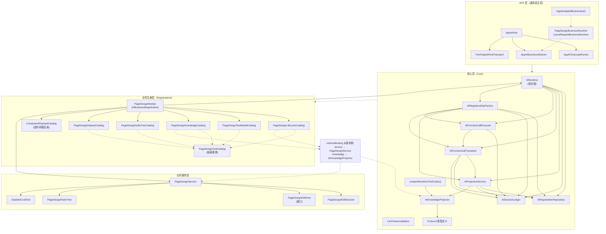
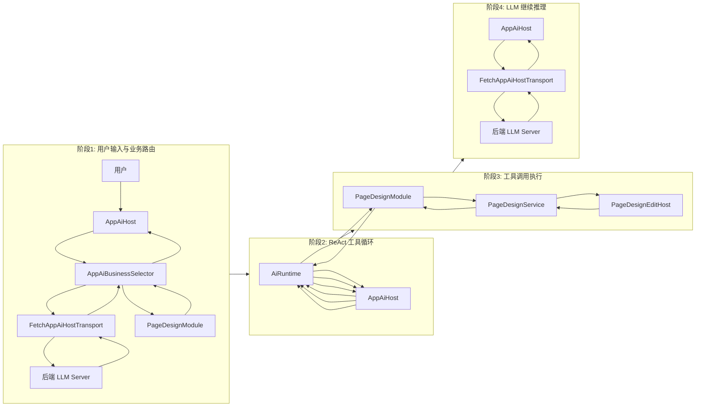
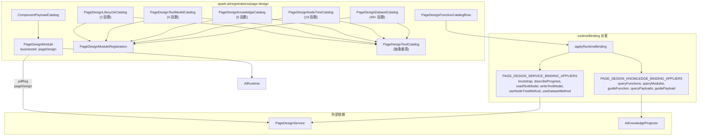

# spark-ai 前端 TypeScript 架构图

## 图 1：分层架构



---

## 图 2：ReAct 工具循环数据流



---

## 图 3：核心层内部组件关系

```mermaid
flowchart TB
    subgraph runtime["runtime"]
        direction TB
        aiRuntime["AiRuntime<br/>(组合根)"]
        repo["AiRegistrationRepository"]
        ledger["AiSessionLedger"]
        projection["AiProjectionService"]
        translator["AiFunctionCallTranslator"]
        executor["AiFunctionCallExecutor"]
        apiFactory["AiRegisteredApiFactory"]
        projector["AiRuntimeProjector"]
    end

    subgraph knowledge["knowledge"]
        knowledgeProj["AiKnowledgeProjector"]
    end

    subgraph protocol["protocol"]
        direction TB
        api1["AiRuntimeApi"]
        api2["AiRegisteredModuleApi"]
        api3["AiRegisteredBusinessApi"]
        api4["AiKnowledgeProjection"]
        validator["LlmParamsValidator"]
        invocation["AiInvocationProtocol"]
    end

    %% Composition
    aiRuntime *-- repo
    aiRuntime *-- ledger
    aiRuntime *-- projection
    aiRuntime *-- translator
    aiRuntime *-- executor
    aiRuntime *-- apiFactory
    aiRuntime *-- projector
    projection *-- knowledgeProj

    %% Dependencies
    apiFactory --> repo
    apiFactory --> ledger
    apiFactory --> projection
    apiFactory --> translator
    apiFactory --> executor
    translator --> repo
    translator --> ledger
    translator --> projection
    executor --> ledger
    executor --> translator
    projection --> repo
    projection --> ledger

    %% Interface implementation
    aiRuntime -.-> api1
    apiFactory -.-> api2
    apiFactory -.-> api3
    knowledgeProj -.-> api4
    validator -.-> executor
```

---

## 图 4：业务注册层模块关系与 runtimeBinding 派发



---

## 关键文件索引

| 层 | 文件 | 说明 |
|---|---|---|
| APP 层 | [src/services/ai-host/app-ai-host.ts](src/services/ai-host/app-ai-host.ts) | AI 宿主入口 |
| APP 层 | [src/services/ai-host/transport.ts](src/services/ai-host/transport.ts) | HTTP 传输 |
| APP 层 | [src/services/ai-host/register-app-ai-businesses.ts](src/services/ai-host/register-app-ai-businesses.ts) | 业务注册桥接 |
| 核心层 | [packages/spark-ai/src/core/index.ts](packages/spark-ai/src/core/index.ts) | 核心层导出 |
| 核心层 | [packages/spark-ai/src/core/internal/runtime/ai-runtime.ts](packages/spark-ai/src/core/internal/runtime/ai-runtime.ts) | 组合根 |
| 业务注册 | [packages/spark-ai/src/registrations/page-design/page-design-module.ts](packages/spark-ai/src/registrations/page-design/page-design-module.ts) | 业务模块 |
| 业务服务 | [packages/spark-page-config/src/page-design/operations/page-design-service.ts](packages/spark-page-config/src/page-design/operations/page-design-service.ts) | 服务层 |
| 业务服务 | [packages/spark-page-config/src/page-design/editing/edit-session.ts](packages/spark-page-config/src/page-design/editing/edit-session.ts) | EditHost 接口 |
