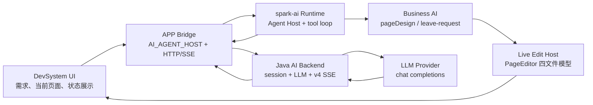
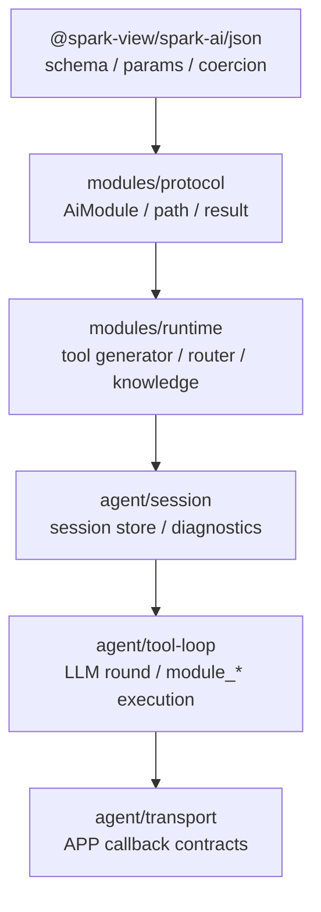
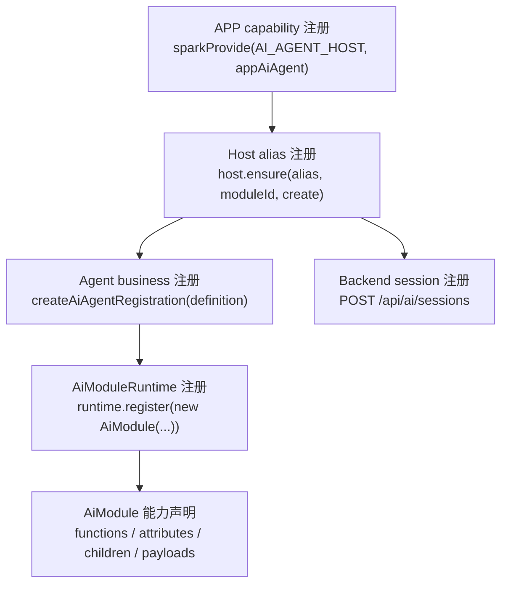
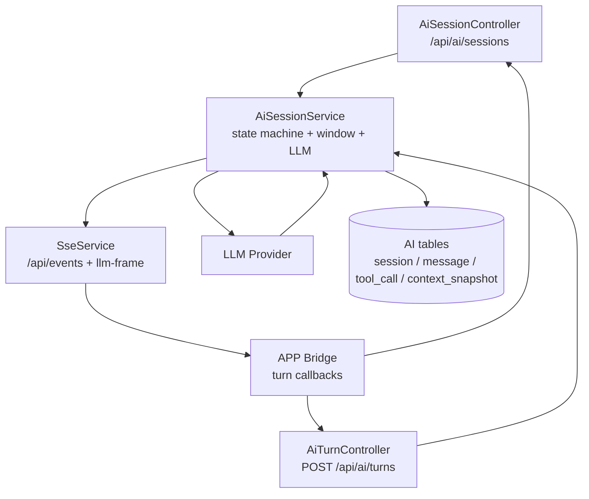
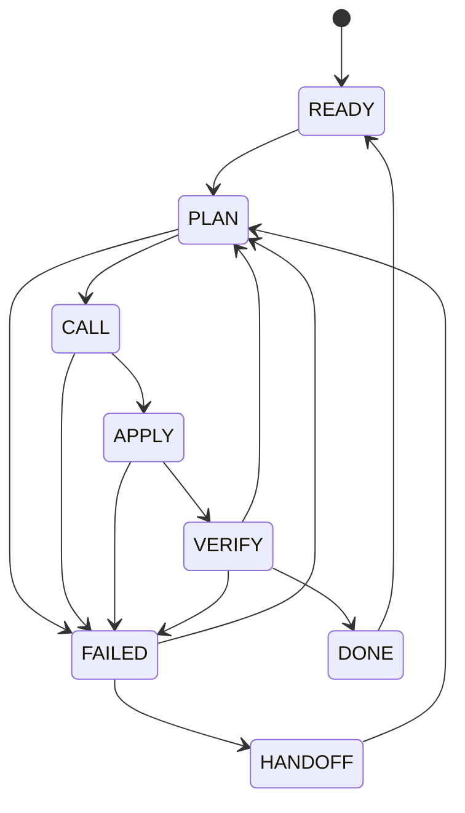
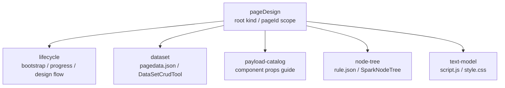
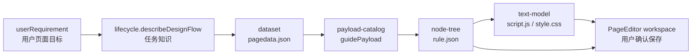
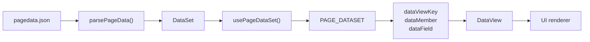

# SPARK AI Complete Guide

> 代码即真相。本文是 AI 中台升级后的唯一入口，覆盖 `@spark-view/spark-ai` Runtime、APP AI Host、Java AI Backend、LLM 固定工具协议、业务注册和 pageDesign 页面编辑链路。旧 `core/runtime/protocol/adapter` 时代的文档和路径不再作为设计依据。

## 定位

SPARK AI Platform 是产品与架构总称，不等于某一个包。它由五层组成：

| 层 | 真源 | 职责 | 不负责 |
| --- | --- | --- | --- |
| AI Runtime | `packages/spark-ai` | JSON schema、AiModule 协议、模块/业务注册协议、Agent Host、tool loop、传输回调契约 | 业务状态、浏览器 I/O、Java HTTP 实现 |
| Business AI | `packages/spark-page-config/src/ai` | pageDesign / leave-request 等业务注册、工具 schema、业务 service 落点 | APP SSE、OpenAI 调用、全局页面存储 |
| APP Bridge | `src/services/ai-host.ts`、`src/services/ai-turn-bridge.ts` | 创建全局 `AI_AGENT_HOST`、把 Agent 回调接到 HTTP 和 APP SSE | 定义业务工具、维护业务会话历史 |
| AI Backend | `spark-ai-server/src/main/java/com/spark/ai` | 会话、消息、工具调用、上下文快照持久化、LLM 调用、SSE envelope | 执行前端 live pageDesign 工具 |
| DevSystem UI | `src/views/app/dev-system` | 收集用户需求、绑定当前 PageEditor、展示推理和工具调用状态 | 绕过 AI Host 直接改四文件 |

这五层的边界是中台升级后的核心：AI 不直接“生成并写文件”，而是通过业务注册的能力树、固定工具协议、后端 turn 会话和 live edit host 受控地工作。

图 1 — AI 中台分层总览：



## 公共入口

`@spark-view/spark-ai` 只暴露四个 public subpath：

- `@spark-view/spark-ai`
- `@spark-view/spark-ai/json`
- `@spark-view/spark-ai/modules`
- `@spark-view/spark-ai/agent`

新代码优先从 focused subpath 导入。根入口只是小 facade。

禁止使用旧入口：

- `@spark-view/spark-ai/core`
- `@spark-view/spark-ai/protocol`
- `@spark-view/spark-ai/runtime`
- `@spark-view/spark-ai/adapter`
- 旧动态业务函数工具名
- 旧 `$paths` / 协议身份数组
- 旧 `ModuleKind.*` namespace 类型

## Runtime 分层

`packages/spark-ai` 分三层：

| Public entry | Responsibility | Must not own |
| --- | --- | --- |
| `@spark-view/spark-ai/json` | JSON value/schema、参数 schema helper、参数校验、JSON 规整 | 业务语义、会话、transport |
| `@spark-view/spark-ai/modules` | `AiModule` 元数据、实例路径、固定工具 spec、工具路由、知识投影 | Agent 会话、HTTP/SSE、业务 live state |
| `@spark-view/spark-ai/agent` | 业务注册、输入校验、session store、tool loop、turn callbacks、transcript/summary | 页面四文件持久化、后端网络实现 |

依赖方向固定：



`spark-ai` 必须保持框架无关。它不能导入 `spark-page-config`、Vue、Element Plus、Router、Pinia 或 APP UI。

## 注册协议

AI 中台有五层注册，必须区分清楚。`spark-ai` 内核只定义协议和校验，不拥有具体业务实例。

图 2 — 注册协议分层：



### 1. APP Capability 注册

APP 启动时创建唯一 `AiAgentHost`，并通过 capability 暴露：

```ts
export const appAiAgent = createAiAgentHost({
  turnCallbacks: createAiAgentTurnCallbacks(),
  maxToolRounds: 16,
})

sparkProvide(AI_AGENT_HOST, appAiAgent)
```

规则：

- 业务入口通过 `consumeCapability(AI_AGENT_HOST)` 获取 Host。
- 业务能力使用 `sparkProvide` / `sparkConsume`，不要改用 Vue `provide/inject`。
- APP capability 只注册 Host，不注册具体 pageDesign 工具。

### 2. Host Alias 注册

`AiAgentHost` 用 alias 把业务入口暴露给调用方：

```ts
const pageDesignHost = ensurePageDesignBusiness({
  host: aiAgentHost,
  getPageDesignEditHost,
})

await pageDesignHost.run('pageDesign', input)
```

底层协议是：

```ts
host.ensure(alias, {
  moduleId,
  create: () => createAiAgentRegistration(definition),
})
```

规则：

- `alias` 是 APP 调用名，例如 `"pageDesign"`。
- `moduleId` 是业务注册 ID，必须等于 registration 的 `moduleId`。
- 同一个 alias 不能绑定两个 moduleId。
- 同一个 moduleId 不能被两个 alias 重复注册。
- `ensure()` 可重复调用，但只允许同 alias + 同 moduleId 的幂等注册。
- `host.run(alias, input)` 只能运行已注册 alias；未注册直接 fail-fast。

### 3. Agent Business 注册

业务包用 `createAiAgentRegistration()` 把一个业务定义投影到 Host：

```ts
createAiAgentRegistration({
  kindID: 'pageDesign',
  name: 'Page Design',
  description: '页面四文件编辑。',
  runtime,
  inputContract,
  sessionStore: new DefaultAiAgentSessionStore(),
  systemPrompt,
  onStartSession,
  afterFunctionCall,
  onEndBusinessInstance,
  releaseModuleInstance,
})
```

必填项：

- `kindID`：业务注册 ID；投影后成为 `AiAgentRegistration.moduleId`。
- `name` / `description`：LLM 可见业务说明。
- `runtime`：已注册 AiModule 能力树的 `AiModuleRuntime`。
- `inputContract`：业务输入协议。
- `sessionStore`：显式注入的 Agent 会话历史存储。

可选生命周期：

- `systemPrompt(context)`：每轮开始前追加业务提示词。
- `onStartSession(context)`：Agent session 启动时调用；pageDesign 在这里 bootstrap live binding。
- `afterFunctionCall(options)`：每次工具调用后决定 continue / complete / abort。
- `onEndBusinessInstance(context, directive)`：业务实例结束回调。
- `releaseModuleInstance(moduleInstanceId)`：释放业务实例资源。

规则：

- registry 不自动创建默认 store；内存存储也必须由业务显式传入。
- `systemPrompt` 保持短；大知识走 `module_query` / `module_guide` / 业务工具按需查询。
- 生命周期不能替代业务函数 schema；模型可调用能力仍以 AiModule metadata 为准。

### 4. Input Contract 注册

`AiAgentInputContract` 是 `host.run(alias, input)` 的入口协议：

```ts
type AiAgentInputContract<TInput> = {
  paramsSchema: AiJsonSchemaObject
  identityField: keyof TInput & string
  normalize(input: AiJsonParams): TInput
  toScope(normalizedInput: TInput): AiAgentScope
  toOrchestration(normalizedInput: TInput): AiAgentOrchestrationPlan
}
```

规则：

- `paramsSchema` 先校验原始输入，再校验 normalize 后输入。
- `identityField` 必须是非空字符串字段，例如 pageDesign 的 `pageId`。
- `toScope()` 生成的 `businessRegistrationId` 必须等于 `kindID`。
- `toScope()` 生成的 `businessInstanceId` 必须等于 identityField 值。
- `toOrchestration()` 必须返回非空 `userMessage` 和非空 `systemPrompt`。
- 输入只能是 JSON-serializable object；函数、class 实例、循环引用都不允许进入 input。

### 5. AiModule Kind 注册

`AiModuleRuntime` 只接受已经构造完成的 `AiModule`：

```ts
const runtime = new AiModuleRuntime()
runtime.register(new PageDesignRootAiModule())
runtime.register(new PageDesignLifecycleAiModule(options))
runtime.register(new PageDesignNodeTreeAiModule(options))
```

`AiModuleOptions` 的声明项：

- `kind`：模块类型 ID，同一个 runtime 内唯一。
- `name` / `description`：LLM 可见模块说明。
- `parentKind`：父模块 kind；根模块不设置。
- `attributes`：可读写属性声明。
- `functions`：可调用函数声明。
- `payloads`：外部参数荷载引用声明。
- `children`：允许的子模块 kind 列表。

`AiModuleOptions` 的执行委托：

- `attributeAccessor`：声明 `attributes` 时必填。
- `runner` 或覆盖 `runFunction()`：声明 `functions` 时必填。
- `list`：声明 `children` 时必填。
- `find`：根模块或声明 `children` 的模块必填。

函数注册协议：

```ts
{
  name: 'addNode',
  description: '向指定层级插入一个新节点。',
  paramsSchema,
  resultSchema,
  usageRules,
  failureModes,
  example,
}
```

规则：

- `paramsSchema` 必须是 object root。
- `usageRules` 写调用前规则，不写实现细节。
- `failureModes` 写可恢复错误码、触发条件和修复建议。
- 运行失败返回 `AiModuleResult.failCode(code, message, hint)`，不要抛给 LLM 猜。
- `children` / `parentKind` 必须能组成可导航能力树，不能让 path 指向未注册 kind。

### 6. Payload Provider 注册

组件 props、数据源列表这类“大知识”不进系统提示词，而是通过 payload provider 注册：

```ts
const registry = new AiModulePayloadRegistry()
registry.register({
  moduleKind: 'node-tree',
  payloadRef: 'spark.component',
  description: 'SparkNode 组件 props 参数目录。',
  queryPayloads,
  guidePayload,
})
```

规则：

- `queryPayloads()` 返回摘要，服务搜索和候选选择。
- `guidePayload(key)` 返回单条完整 paramsSchema，服务精确写入。
- AiModule 的 `payloads` 只声明依赖关系；provider registry 才提供实际查询。
- pageDesign 写目录组件前必须显式 `guidePayload`，node-tree 写入边界仍会二次校验 props。

### 7. Backend Session 注册

后端 session 由 APP turn bridge 在 turn 前准备：

```http
POST /api/ai/sessions
```

关键字段：

- `sessionId`：前端 `AiAgentSession.sessionId`，格式来自 kind + instanceId。
- `systemPrompt`：业务 prompt + 编排 prompt + runtime knowledge snapshot。
- `tools`：`AiModuleRuntime.getTools()` 投影出的固定工具。
- `scope`：`moduleId`、`moduleInstanceId`、`instanceId`、`runtimeInstanceId`。
- `reuseScopeSession: false`：APP 主路径显式按当前前端 session 准备后端会话。

规则：

- 后端 session 注册的是 LLM 会话和 tools，不注册业务工具实现。
- 业务工具实现仍在前端 `AiModuleRuntime.executeTool()` 内执行。
- scope 不匹配时后端返回 `SESSION_SCOPE_MISMATCH`，前端应重新 prepare session。

## 端到端链路

当前 pageDesign 主链路：

```mermaid
sequenceDiagram
  participant UI as DevSystem UI
  participant App as APP Bridge
  participant Host as AiAgentHost
  participant Loop as Tool Loop
  participant Backend as AI Backend
  participant Bus as APP SSE
  participant LLM as LLM Provider
  participant Live as Live Edit Host

  UI->>App: runPageDesignAiSession(pageId, requirement)
  App->>Host: run("pageDesign", input)
  Host->>Loop: start session + first turn
  Loop->>Backend: POST /api/ai/sessions
  Loop->>Backend: POST /api/ai/turns
  Backend->>LLM: chat completions with fixed tools
  LLM-->>Backend: text + tool_calls
  Backend-->>Bus: llm-frame message.completed
  Bus-->>Loop: createTurnEventCollector result
  Loop->>Live: execute module_call via Business AI
  Live-->>Loop: structured result
  Loop->>Backend: append assistant(tool_calls)+tool messages
  Loop->>Backend: next POST /api/ai/turns
```

同一条链路的文字版：

```text
DevSystem UI
  -> runPageDesignAiSession()
  -> consumeCapability(AI_AGENT_HOST)
  -> ensurePageDesignBusiness()
  -> AiAgentHost.run('pageDesign', input)
  -> AiAgentTask(inputContract normalize + schema validate + toScope + toOrchestration)
  -> AiAgentSession.start()
  -> AiAgentToolLoopRunner
  -> APP turnCallbacks.prepareSession()
  -> POST /api/ai/sessions
  -> APP turnCallbacks.executeTurn()
  -> POST /api/ai/turns
  -> Java AiSessionService calls LLM
  -> /api/events emits llm-frame
  -> createTurnEventCollector() aggregates result
  -> tool loop executes module_* in frontend runtime
  -> append assistant(tool_calls)+tool messages
  -> POST /api/ai/sessions/{id}/turn/append
  -> next LLM round
```

模型只看到固定工具和知识投影。业务写入发生在前端 live edit host 中，后端只负责 LLM 会话和消息历史。

## APP AI Host

APP 只创建一个全局 Host：

```ts
export const appAiAgent = createAiAgentHost({
  turnCallbacks: createAiAgentTurnCallbacks(),
  maxToolRounds: 16,
})
```

`src/App.vue` 通过 `sparkProvide(AI_AGENT_HOST, appAiAgent)` 暴露 capability。业务入口必须通过 `sparkConsume` / `consumeCapability(AI_AGENT_HOST)` 获取，不要用 Vue `provide/inject` 承载业务能力。

`src/services/ai-turn-bridge.ts` 是 APP I/O 边界：

- `prepareSession` 调 `POST /api/ai/sessions`，显式传 `sessionId`、`systemPrompt`、`tools`、`scope`，并设置 `reuseScopeSession: false`。
- `executeTurn` 调 `POST /api/ai/turns` 启动后端 turn，并用 `createTurnEventCollector()` 等待 `/api/events` 的 `llm-frame`。
- `appendMessages` 调 `POST /api/ai/sessions/{sessionId}/turn/append`，把前端已执行的 `assistant(tool_calls)` 和 `tool` 消息追加回后端会话。

APP bridge 可以做 HTTP 和 SSE，`spark-ai` 包本身不能做这些 I/O。

## Backend AI Center

Java 后端中台的主文件：

- `AiSessionController`：`/api/ai/sessions` 会话创建、同步 turn、append、conversation、destroy。
- `AiTurnController`：`POST /api/ai/turns`，启动一次异步 posted turn。
- `AiSessionService`：会话内存态、DB 持久化、滑动窗口、LLM 调用、posted turn 幂等、APP SSE `llm-frame`。
- `SseService`：`GET /api/events` 公共 APP SSE，总线事件全部用 v4 envelope。
- `AiSessionEntity`、`AiMessageEntity`、`AiToolCallEntity`、`AiContextSnapshotEntity`：AI 会话持久化表。
- `AiSessionRetentionJob`：按 `spark.ai.session.retention-days` 清理过期会话及子表。

图 3 — 后端会话、LLM 与持久化边界：



后端协议边界：

- HTTP JSON 响应由 `ApiEnvelopeAdvice` 包装成 v4 envelope。
- APP SSE 统一走 `/api/events`，AI turn 模型帧事件名是 `llm-frame`。
- `POST /api/ai/turns` 只是启动命令，不是 SSE 通道。
- posted turn 以 `sessionId + turnId + input hash` 做幂等；同一 turnId 不允许复用不同输入。
- `POST /api/ai/turns` 不重新提交 tools，tools 来自已准备好的后端 session；tool-capable turn 必须从 session 取工具列表发给 provider。
- APP 主路径以 `llm-frame` 的 `message.completed.toolCalls` 作为前端 tool loop 输入。
- 当模型返回 tool_calls 时，后端不自动写入 assistant(tool_calls) 到 conversation；前端 tool loop 执行工具后通过 append 接口写回，避免出现无匹配 tool 消息的历史。

AI 会话状态机：



后端会话持久化的是 LLM conversation、tools、scope、上下文快照和工具调用审计；前端 `AiAgentSessionStore` 持久化的是 Agent 工具循环的本地 transcript 和诊断。两者相关但不是同一个对象。

## Fixed Tool Protocol

Runtime 只向 transport 输出固定工具：

- `module_query`
- `module_guide`
- `module_find`
- `module_attr`
- `module_call`
- `human_question`

业务函数全部通过 `module_call` 调用：

```json
{
  "path": "/pageDesign[page-a]/node-tree[page-a]",
  "functionName": "addNode",
  "args": {
    "parentComponentId": "page__0",
    "node": {
      "type": "r-text",
      "id": "name",
      "props": {}
    }
  }
}
```

实例身份只来自 `path + 当前 session scope`。模型必须先定位实例，再读指南，再调用业务函数：

1. `module_query` 查当前 runtime 注册了哪些 kind / function。
2. `module_find` 从 `/` 找根实例，再找子实例。
3. `module_guide` 读取 kind 或 function 的完整 schema、usageRules、failureModes。
4. `module_call` 执行具体业务函数。
5. 缺少用户事实时用 `human_question` 生成反问指南，暂停猜测。

图 4 — 固定工具协议的推荐调用顺序：

```mermaid
flowchart LR
  query["module_query<br/>查能力目录"]
  findRoot["module_find<br/>定位根实例"]
  guide["module_guide<br/>读 schema / failureModes"]
  call["module_call<br/>执行业务函数"]
  fail["ok:false<br/>读 code / msg / fix / checks"]
  ask["human_question<br/>缺事实时反问用户"]
  result["structured result<br/>回灌给 LLM"]

  query --> findRoot
  findRoot --> guide
  guide --> call
  call --> result
  call --> fail
  fail --> guide
  guide --> ask
```

`module_call.path` 不能是根路径 `/`。需要先用 `module_find` 得到具体实例 path。

## AiModule 规则

业务只注册已经构造好的 `AiModule`：

```ts
const runtime = new AiModuleRuntime()
runtime.register(new PageDesignNodeTreeAiModule(options))
```

`AiModule` 是声明和委托的装配点：

- `attributes` 声明属性，需要 `attributeAccessor`。
- `functions` 声明函数，需要 `runner` 或覆盖 `runFunction()`。
- `children` 声明子模块，需要 `list` 和 `find`。
- 根模块需要 `find`，用于 `module_find({ path: "/", childKind, query })` 定位当前业务实例。

所有业务失败返回结构化结果：

```ts
AiModuleResult.failCode(code, message, hint)
```

LLM 会收到 `ok:false`、`code`、`msg`、`fix`、`checks`，再按错误码修正调用。不要用静默兜底掩盖缺失 API、无效配置或状态不一致。

参数 schema 必须是 JSON Schema object root。业务函数参数用具名对象，不用位置参数。

## Agent Host

`AiAgentHost` 暴露：

- `register(alias, registration)`
- `ensure(alias, { moduleId, create })`
- `has(alias)`
- `run(alias, input, chat?)`

业务注册必须显式注入 `sessionStore`。registry 不会自动创建默认 store；如果只需要内存实现，业务包自己传 `new DefaultAiAgentSessionStore()`。

推荐接入形态：

```ts
const host = createAiAgentHost({ turnCallbacks, maxToolRounds: 8 })
const pageDesignHost = ensurePageDesignBusiness({
  host,
  getPageDesignEditHost,
})

await pageDesignHost.run('pageDesign', {
  pageId: 'page-a',
  userRequirement: '新增申请表单',
})
```

`AiAgentInputContract` 是升级后的业务入口契约：

- `paramsSchema` 校验外部输入。
- `identityField` 声明业务实例身份字段。
- `normalize(input)` 规整输入。
- `toScope(normalizedInput)` 生成 `AiAgentScope`。
- `toOrchestration(normalizedInput)` 生成首轮用户消息和任务级系统提示。

如果 scope 与 identity 不一致，Host 必须 fail-fast。

## Session History

会话历史是一等能力，不是可删缓存。

`AiAgentSessionStore` 需要保留：

- user message、assistant message。
- tool call args/result/error/status。
- lifecycle stop reason。
- turn/session/module identifiers。

行为约束：

- `startSession` 复用同一业务实例历史。
- `send` 追加新 turn。
- `stopSession` 只标记 lifecycle，不清空历史。
- 业务包只能读取 transcript/summary/diagnostics，不维护第二份历史。

调试入口：

- `createAiAgentSessionTranscript(record)`
- `summarizeAiAgentSessionRecord(record)`
- session store 的 `getSession()` / `getSessionHistory()`。

## pageDesign 业务

`packages/spark-page-config/src/ai/page-design-module.ts` 是 pageDesign AI 的唯一业务注册入口。

业务标识：

- `PAGE_DESIGN_MODULE_ID = "pageDesign"`
- Host alias 默认也是 `"pageDesign"`
- 输入身份字段是 `pageId`

能力树：



pageDesign 启动输入：

```ts
type PageDesignRunInput = {
  pageId: string
  userRequirement: string
  mode?: 'create' | 'modify' | 'fix' | 'data' | 'style'
  allowedOperations?: {
    addTables?: boolean
    addComponents?: boolean
    editScript?: boolean
    editStyle?: boolean
  }
  preserveExistingInteractions?: boolean
}
```

首轮编排固定：

1. `module_find({"path":"/","childKind":"pageDesign","query":{"id":pageId}})`
2. `module_call` 调 `lifecycle.describeProgress`
3. `module_call` 调 `lifecycle.describeDesignFlow({ intent: userRequirement })`
4. 按任务知识推进 dataset、node-tree、text-model
5. 缺业务事实时先 `human_question`

pageDesign 写入顺序：

1. 数据优先：先用 `dataset` 建表、列、视图、关系、行、聚合和计算列。
2. 再用 `node-tree` 写 `rule.json` 节点和组件 props。
3. 组件 props 先用 `payload-catalog.queryPayloads` / `guidePayload`，不要猜目录组件参数。
4. 最后才用 `text-model` 覆盖 `script.js` 或 `style.css`。

图 5 — pageDesign 受控写入路径：



`PageDesignService` 只连接 live edit host，不保存 AI Host 会话历史，也不直接订阅 APP SSE。四文件真正变更通过 `PageEditor.createPageDesignEditHost()` 绑定：

- `getNodeTree()` / `onNodeTreeChanged()`
- `getDataSetTool()` / `onDataSetChanged()`
- `readScript()` / `writeScript()`
- `readStyle()` / `writeStyle()`

后端 Java 不直接写 pageDesign live 四文件。AI 工具改完后，DevSystem 仍提示用户保存，保存链路属于 PageEditor / workspace。

## pageDesign 工具边界

`lifecycle`：

- `bootstrap` 由 Host 启动会话时自动执行，常规流程不要主动调用。
- `describeProgress` 只读 live binding 和编辑阶段。
- `describeDesignFlow` 返回页面设计 100 步流程和按 intent 命中的任务知识，不倾倒全量 prompt。

`payload-catalog`：

- `queryPayloads` 只返回摘要。
- `guidePayload` 返回单组件 props 的完整 paramsSchema。
- 组件目录来自构建产物 `component-catalog.json`，不要把完整目录拼进系统提示词。

`node-tree`：

- 所有写操作作用于 `SparkNodeTree/rule.json` live 模型。
- `componentId` 必须是节点顶层 `id`，绝不能把 `r-table`、`r-tabs` 等组件类型名当作 id。
- 新增或替换目录组件前必须显式 `guidePayload`。
- `setProps` 默认合并；除非完整带回原有关键绑定，否则不要 `merge=false`。
- 目录外未知业务 type 在写入边界拦截；原生 HTML tag 按 allowlist 处理。

`dataset`：

- 直接作用于 `DataSetCrudTool/pagedata.json`。
- DataTable、DataView、关系、依赖、聚合、计算列都用 schema 化 action。
- UI 绑定必须使用新版 DataViewKey 格式。

`text-model`：

- `writeScript` / `writeStyle` 是全量覆盖，不支持 patch。
- `writeScript` 会校验运行时 API 合同，禁止 `$page.getDataSet()`、`$page.getTableRows()`、`$page.confirm()`、`DataView.setSummaryRow()` 等伪 API。
- script handler 默认最多 3 个位置参数；4 个及以上改 options 对象或从 `$dataSet` / `$query` / `$components` 读取上下文。

## DataViewKey 与脚本边界

DataViewKey 绑定格式：

- `dataViewKey`: `table@viewId` 或 `#scope@table@viewId`
- `dataMember`: `rows`、`currentRow`、`aggregateResult` 等 DataView 成员枚举字符串
- `dataField`: 可选对象字段路径，例如 `customer.name`

图 6 — 数据绑定管线：



不要使用旧的成员拼接键或点号数据路径。不要通过 `pageData` 或 `$data` 旁路绕开 DataSet 管线。

`script.js` 沙箱允许的全局变量：

- `$page`
- `$route`
- `$dataSet`
- `$query`
- `SparkData`
- `h`

禁止：

- `$data`
- ESM `import`
- `window.xxx` globals
- direct `ElMessage` / `ElMessageBox`
- direct Vue Router imports

配置优先：优先使用 `rule.json`、`pagedata.json` 和现有渲染器能力。只有配置无法表达行为时才使用 `script.js`。

## 新增业务 AI 的方式

新增业务不要改 `spark-ai` 内核，除非公共协议确实缺能力。推荐步骤：

1. 在业务包内创建 service，拥有业务状态、业务校验和执行落点。
2. 用 `AiModule` 声明根 kind、子 kind、functions、attributes、payloads、children。
3. 在 `AiModuleRuntime` 注册这些模块。
4. 定义 `AiAgentInputContract`，明确 `paramsSchema`、`identityField`、`normalize`、`toScope`、`toOrchestration`。
5. 用 `createAiAgentRegistration()` 创建 registration，并显式注入 `sessionStore`。
6. 提供 `ensureXxxBusiness({ host, ... })` 门面，调用 `host.ensure(alias, { moduleId, create })`。
7. APP 层通过 capability 获取 `AI_AGENT_HOST`，不要直接 new 业务 runtime。

业务工具设计原则：

- 小系统提示词，大知识走工具按需查询。
- 函数名表达业务动作，不暴露内部实现细节。
- 参数都是 JSON object，复杂参数提取具名 schema。
- 失败必须给 `code/msg/fix/checks`。
- 不要为了一个业务函数新增一个动态 OpenAI tool；固定协议不变。

## 中台升级后废弃的做法

不要再做这些事：

- 在业务包里手写 OpenAI tool schema 并直接传给后端。
- 让 Java 后端直接执行 pageDesign 四文件写入。
- 在 prompt 中塞完整组件目录、完整 100 步流程或完整页面配置。
- 绕开 `AiAgentHost.run()` 直接调用后端 `/api/ai/turns` 做业务编辑。
- 绕开 `module_find`，直接猜 path 或实例 id。
- 把 `sessionStore` 当成临时 UI 缓存，或由业务再复制一份完整历史。
- 用旧 `pageData` / `$data` / 点号数据路径绕过 DataSet。
- 在 `spark-utils`、`spark-data`、`spark-page-config` 中引入 Vue、Router、Element Plus。

## Diagnostics

排查 pageDesign AI 时优先看这些位置：

- 前端状态消息：`src/views/app/dev-system/useDevState.ts`
- APP turn bridge：`src/services/ai-turn-bridge.ts`
- APP SSE 解包：`src/services/sse-events.ts`
- Agent tool loop：`packages/spark-ai/src/agent/tool-loop/tool-loop-runner.ts`
- 工具调用执行：`packages/spark-ai/src/agent/tool-loop/tool-call-executor.ts`
- pageDesign 注册：`packages/spark-page-config/src/ai/page-design-module.ts`
- pageDesign service：`packages/spark-page-config/src/design/page-design-service.ts`
- Java turn 启动：`spark-ai-server/src/main/java/com/spark/ai/controller/AiTurnController.java`
- Java 会话服务：`spark-ai-server/src/main/java/com/spark/ai/service/AiSessionService.java`
- SSE envelope：`spark-ai-server/src/main/java/com/spark/ai/service/SseService.java`

常用诊断问题：

- `APP_SSE_NOT_CONNECTED`：浏览器 `/api/events` 未连接，先恢复 APP SSE。
- `SESSION_NOT_FOUND`：前端 prepare session 未成功或 session 被清理，重新创建 session。
- `TURN_ID_REUSED`：同一 turnId 被不同输入复用，生成新 turnId。
- `SESSION_SCOPE_MISMATCH`：后端 session scope 与当前业务实例不一致，重新 prepare session。
- `PAYLOAD_GUIDE_REQUIRED`：写目录组件前没有显式 `guidePayload`。
- `NODE_PAYLOAD_SCHEMA_INVALID`：组件 props 不符合 guidePayload 返回的 schema。
- `NO_NODE_TREE` / `NO_DATASET_EDIT` / `NO_TEXT_MODEL`：DevSystem 未打开或未绑定当前页面 live edit host。

## AI 代码生成行为

生成或修改代码时遵守以下约束：

- 不默认用 `interface` 表达一切；只有稳定契约、跨模块能力、DTO/config/payload 或多个实现共享协议才使用 `interface`。
- 优先按“契约 -> class 基础/默认实现 -> 具体 class -> 必要子类”的层次组织代码。
- 如果只有一个实现，默认使用具体 class 或普通函数。
- 新增泛型、工具类型和公共导出前必须有真实重复、稳定扩展点或跨模块契约。
- 函数/方法签名默认最多 3 个位置参数；4 个及以上改成具名 options/command 对象。
- 参数类型不要内联大对象或深层泛型；提取具名 type/class。
- 参数列表里不要写 JSDoc；说明放到 options type、class 字段或函数上方。
- 注释只解释契约、约束、优先级和风险。
- VCM/LLM 可见语义必须在首次声明处用自然语言注释和结构化 tag 标注。

更细的代码生成规则见 `docs/ai/ai-code-generation-behavior.md`，验证器以 `tools/verify-ai-codegen-rules.mjs` 为准。

## Verification

只改 AI 文档时运行：

```bash
pnpm run verify:docs
```

修改 `packages/spark-ai` 后至少运行：

```bash
pnpm --filter @spark-view/spark-ai run typecheck
pnpm --filter @spark-view/spark-ai run lint
pnpm --filter @spark-view/spark-ai run test:run
```

涉及 pageDesign、leave-request 或业务消费代码时补跑：

```bash
pnpm --filter @spark-view/spark-page-config run typecheck
pnpm --filter @spark-view/spark-page-config run lint
pnpm --filter @spark-view/spark-page-config exec vitest run tests/page-design-business-definition.test.ts tests/page-design-node-tree-module-semantic.test.ts tests/leave-request-module.test.ts tests/leave-application-page-design.test.ts
pnpm run typecheck
```

涉及 Java AI Backend 时再跑对应 Java 测试；不要为了纯前端或纯文档任务运行完整 Maven install。

`verify:rules` 可能暴露历史债；当前改动不能扩大债务，若直接阻塞本次变更则一并修复。
