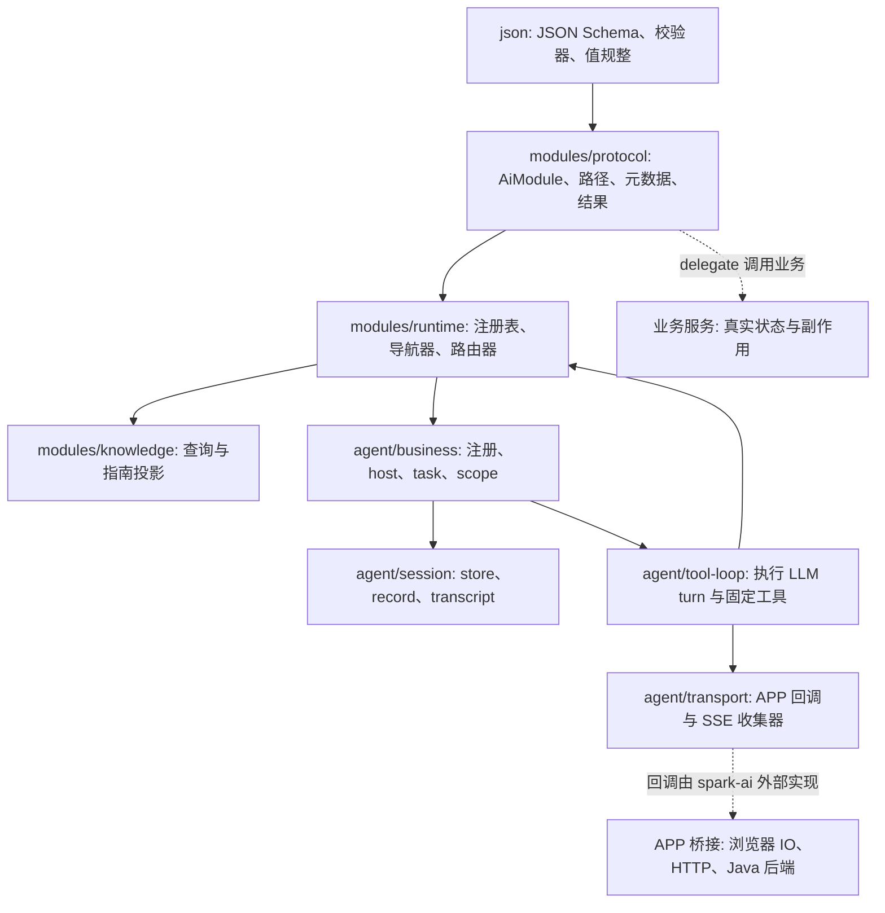
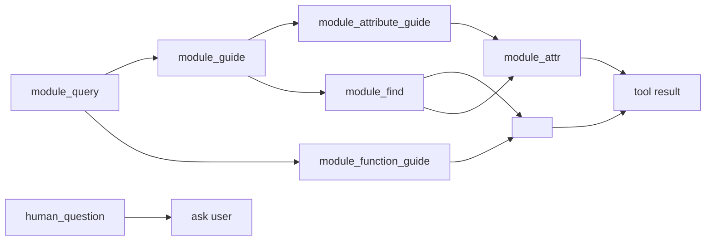
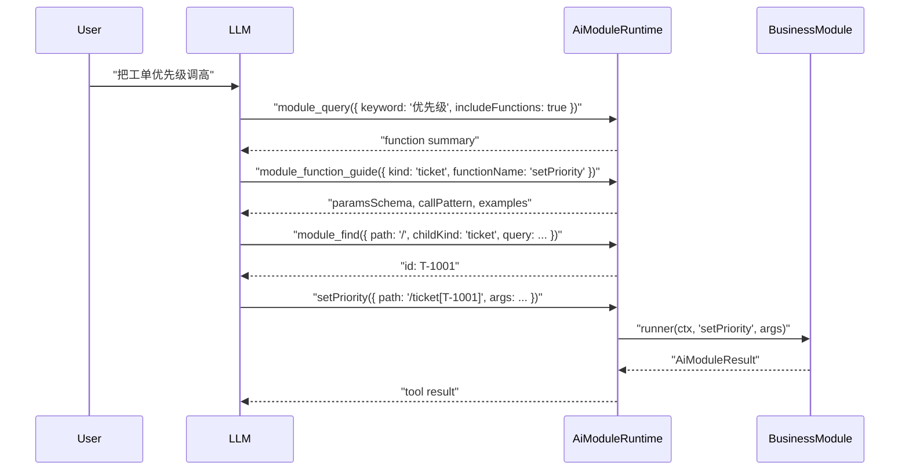
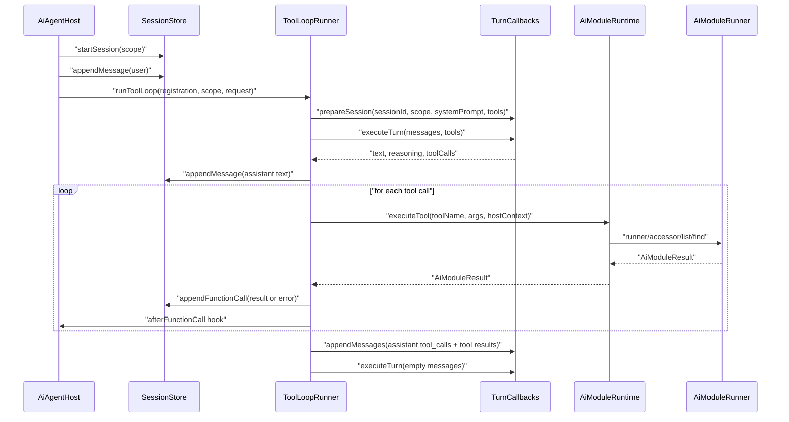
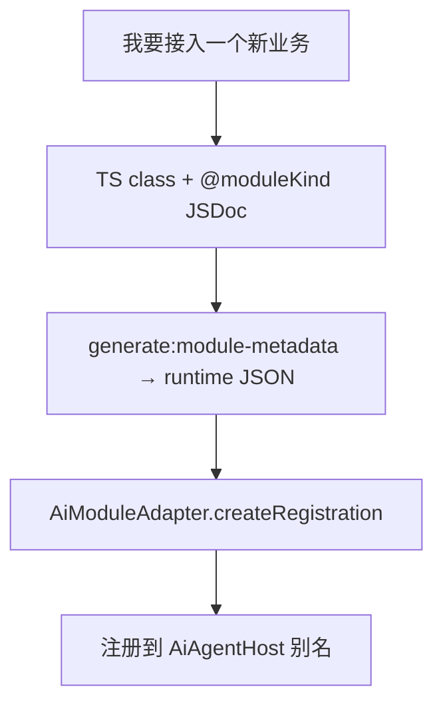

# SPARK AI 完整指南

> 代码即真相。本文只描述 `packages/spark-ai` 当前源码已经实现并测试覆盖的能力；未落地的设想不会写成现有 API。

## 1. 一句话定位

`@spark-appworks/spark-ai` 是 SPARK AppWorks 的 AI 运行时包，职责是把业务能力声明成可被 LLM 安全发现、校验并调用的生产线协议。

它负责：

- JSON Schema 与 JSON 值规整。
- `AiModule` 能力声明、实例路径、属性和函数执行协议。
- `AiModuleRuntime` 协议工具路由与 OpenAI direct function 路由。
- `AiAgentRegistration` / `AiAgentHost` 注册与运行入口。
- Agent session history、tool loop、APP 传输回调契约。
- 调试诊断、runtime inspect、session transcript。

它不负责：

- 业务状态本身。
- 浏览器 DOM / UI I/O。
- Java HTTP 后端实现。
- Vue、Router、Element Plus 或页面配置渲染。
- LLM provider SDK 的真实网络请求。

边界口径：

- SPARK AI 只定义协议与运行时内核。
- 业务 AI 在消费层注册业务模块、输入、生命周期和副作用。
- `pageDesign` 是业务 AI 的业务层案例，不是 `packages/spark-ai` 物料。
- 旧 `core` / `runtime` / `protocol` / `adapter` 入口只作为禁止旧入口出现。

## 2. 包入口与公共 API

`packages/spark-ai/package.json` 只暴露四个 public subpath：

```text
@spark-appworks/spark-ai
@spark-appworks/spark-ai/json
@spark-appworks/spark-ai/modules
@spark-appworks/spark-ai/agent
```

根入口是小门面，只导出：

```ts
export {
  AiJsonSchemaValidator,
  noParamsSchema,
  paramsSchema,
  AiModule,
  AiModuleResult,
  AiModuleRuntime,
  DefaultAiAgentSessionStore,
  createAiAgentHost,
  createAiAgentRegistration,
  startAiAgentRegistrationSession,
} from '@spark-appworks/spark-ai'
```

新代码优先从细分入口导入：

```ts
import { paramsSchema, stringSchema } from '@spark-appworks/spark-ai/json'
import { AiModule, AiModuleResult, AiModuleRuntime } from '@spark-appworks/spark-ai/modules'
import { createAiAgentHost, AiModuleAdapter, createSimpleInputContract } from '@spark-appworks/spark-ai/agent'
```

## 3. 总体架构



核心边界：

- `json` 是最底层。
- `modules` 只懂业务能力协议，不保存业务状态。
- `agent` 只编排注册、会话、tool loop 和传输回调，不实现浏览器或 HTTP。
- 业务 service 由业务包持有；`AiModule` 通过 runner/accessor/list/find delegate 调用它。

## 4. JSON 层

### 4.1 JSON 值类型

`@spark-appworks/spark-ai/json` 使用标准 JSON 值：

```ts
type AiJsonValue =
  | string
  | number
  | boolean
  | null
  | readonly AiJsonValue[]
  | AiJsonObject

type AiJsonParams = Readonly<Record<string, AiJsonValue>>
```

`AiJsonParamShape<T>` 用来在 `AiJsonParams` 基础上保留字段键名，常见于业务输入：

```ts
type TicketInput = AiJsonParams & Readonly<{
  ticketId: string
  message: string
}>
```

### 4.2 Schema 构造器

Schema 是标准 JSON Schema 子集，不是旧 DSL。

常用 helper：

```ts
import {
  anySchema,
  arraySchema,
  booleanSchema,
  enumSchema,
  noParamsSchema,
  numberSchema,
  objectSchema,
  paramsSchema,
  stringSchema,
} from '@spark-appworks/spark-ai/json'

const inputSchema = paramsSchema({
  ticketId: stringSchema('工单 ID'),
  message: stringSchema('用户消息'),
}, ['ticketId', 'message'])
```

约束：

- 工具参数 schema 根节点必须是 `type: 'object'`。
- `noParamsSchema()` 等价于无必填参数的 object schema。
- `paramsSchema(shape, required)` 只设置 object/properties/required；需要禁止额外字段时请显式写 `additionalProperties: false`。

### 4.3 校验与规整

`AiJsonSchemaValidator.validateDeserializedParams(params, schema)`：

- 要求 `params` 是 JSON object。
- 要求 schema 根节点是 object。
- 使用 AJV 2020 校验。
- 返回中文诊断，路径形如 `$.priority`、`$.items[0]`。

值规整有两种：

```ts
import { coerceJsonValue, coerceStrictJsonValue } from '@spark-appworks/spark-ai/json'
```

- `coerceJsonValue` 尽量把运行时值转成 JSON：`Date` 转 ISO、`BigInt` 转字符串、TypedArray 转数组、Map/Set 转对象或数组，循环引用会被丢弃。
- `coerceStrictJsonValue` 只接受严格 JSON 安全值，遇到 `BigInt`、`Symbol`、`NaN`、`Infinity`、循环引用或无效日期返回 `undefined`。

Agent 输入用 strict 模式；模块输出用宽松规整后再按 schema 校验。

## 5. AiModule 协议

### 5.1 模块是什么

> **业务方**：不要手工 `new AiModule` 注册业务能力；见 §9.5 `AiModuleAdapter`。以下示例说明协议构造规则，供内核测试参考。

`AiModule` 是一个已构造的业务能力节点。它包含两类内容：

- 元数据：kind、name、description、attributes、functions、children、resultApis。
- 运行 delegate：attributeAccessor、runner、list、find。

最小 root module：

```ts
import {
  AiModule,
  AiModuleResult,
  type AiModuleInstanceRef,
} from '@spark-appworks/spark-ai/modules'

const ticketModule = new AiModule({
  kind: 'ticket',
  name: '工单',
  description: '工单根模块。',
  find: (_ctx, childKind, query) => {
    if (childKind !== 'ticket') return AiModuleResult.ok<readonly AiModuleInstanceRef[]>([])
    const id = typeof query['ticketId'] === 'string' ? query['ticketId'] : 'T-1001'
    return AiModuleResult.ok([{ id, label: `工单 ${id}` }])
  },
})
```

构造期 fail-fast：

- `kind`、`name`、`description` 不能为空。
- 函数名、属性名、children 不能重复。
- `parentKind` 不能等于自身 kind。
- 声明 `functions` 必须提供 runner 或覆写 `runFunction`。
- 声明 readable/writable `attributes` 必须提供 `attributeAccessor`。
- 声明 `children` 必须提供 `list` 和 `find`。
- root module 需要 `find`，用于 `module_find({ path: "/", childKind, query })` 定位实例。

### 5.2 Result 与错误结构

模块所有操作返回 `AiModuleResult<T>`。

```ts
return AiModuleResult.ok({ priority: 'high' })

return AiModuleResult.failCode(
  'TICKET_NOT_FOUND',
  '工单不存在',
  '请先调用 module_find 重新定位工单实例。',
)
```

失败结果必须携带至少一条 error check。Agent tool loop 会把模块失败投影成：

```ts
{
  ok: false,
  code: 'TICKET_NOT_FOUND',
  msg: '工单不存在',
  fix: '请先调用 module_find 重新定位工单实例。',
  checks: [...]
}
```

这个结构会作为 tool message 回灌给 LLM，方便下一轮自动修复。

### 5.3 Path 协议

模块实例路径是固定格式：

```text
/
/ticket[T-1001]
/ticket[T-1001]/detail[T-1001]
```

推荐使用 helper，避免 `]`、`/` 等字符导致解析问题：

```ts
import {
  appendAiModulePath,
  buildAiModulePath,
  parseAiModulePath,
} from '@spark-appworks/spark-ai/modules'

const rootPath = buildAiModulePath([{ kind: 'ticket', id: 'ticket/a' }])
// /ticket[ticket%2Fa]

const childPath = appendAiModulePath(rootPath, { kind: 'detail', id: 'detail]main' })
// /ticket[ticket%2Fa]/detail[detail%5Dmain]

parseAiModulePath(childPath)
// [{ kind: 'ticket', id: 'ticket/a' }, { kind: 'detail', id: 'detail]main' }]
```

`AiModulePath.parse()` 是底层 path parser；helper 会做 URI 编码/解码，更适合业务和测试代码。

### 5.4 函数 metadata

函数元数据是 LLM 能否正确调用的主要依据：

```ts
functions: [{
  name: 'setPriority',
  description: '设置当前工单优先级。',
  paramsSchema: paramsSchema({
    priority: enumSchema(['low', 'medium', 'high'], '优先级'),
  }, ['priority']),
  usageRules: ['只能修改当前 path 指向的工单。'],
  requiredBeforeCall: ['如果还没有工单 path，先调用 module_find。'],
  failureModes: [{
    code: 'INVALID_PRIORITY',
    when: 'priority 不在枚举范围内',
    fix: '调用 module_function_guide 查看 setPriority 的 paramsSchema。',
  }],
  examples: [{
    intent: '用户要求调高优先级',
    args: { priority: 'high' },
  }],
  antiExamples: [{
    user: '我看看当前状态',
    reason: '只是查询状态，不能调用 setPriority。',
  }],
}]
```

`module_function_guide({ kind, functionName })` 会把这些字段投影给 LLM：

- `toolName: '<functionName>'`
- `kindPath`
- `callPattern`
- `paramsSchema`
- `requiredParamNames`
- `usageRules`
- `requiredBeforeCall`
- `failureModes`
- `recoveryHints`
- `examples`
- `antiExamples`

### 5.5 属性 metadata

属性通过 `module_attr` 读取或写入：

```ts
attributes: [{
  name: 'title',
  description: '工单标题。',
  schema: { type: 'string' },
  readable: true,
  writable: true,
}]
```

声明属性后必须提供 `attributeAccessor`。读取结果会规整成 JSON，再按属性 schema 校验；写入前也会按 schema 校验。

### 5.6 子模块与 find/list

> **业务嵌套 API**：由 VCM `resultApis` 自动投影为 guide-only 子 kind，执行走 `module_script`，不手写 `children` 树。以下示例描述协议层静态子模块树，仅用于理解 inspect 与 path 规则。

有子模块时：

```ts
new AiModule({
  kind: 'ticket',
  name: '工单',
  description: '工单根能力。',
  children: ['detail'],
  list: (ctx, childKind) => AiModuleResult.ok([{ id: 'T-1001', label: '工单详情' }]),
  find: (ctx, childKind, query) => AiModuleResult.ok([{ id: 'T-1001', label: '工单详情' }]),
})

new AiModule({
  kind: 'detail',
  parentKind: 'ticket',
  name: '工单详情',
  description: '工单详情能力。',
  functions: [...],
  runner,
})
```

runtime 会检查：

- child 是否已注册。
- child 的 `parentKind` 是否与父模块声明一致。
- 父模块是否声明了对应 child kind。
- path 中每一段是否能从父级解析到子级。

## 6. 运行时与工具协议

### 6.1 运行时组合根

`AiModuleRuntime` 是 modules 层组合根。业务注册经 `AiModuleAdapter` 内部创建 runtime 并注册模块；业务代码不应直接 `runtime.register` 手写模块。

协议层直接使用示例（测试 / factory）：

```ts
const runtime = new AiModuleRuntime()
runtime.register(ticketModule)

const tools = runtime.getTools()
const result = await runtime.executeTool('setPriority', {
  path: '/ticket[T-1001]',
  args: { priority: 'high' },
})
```

还提供直接 API：

- `describeKind(kind)`
- `listChildren(path, childKind?)`
- `findInstance(path, childKind, query)`
- `getAttribute(path, attrName)`
- `setAttribute(path, attrName, value)`
- `invokeFunction(path, functionName, args)`
- `queryKnowledgeModules(filter)`
- `queryKnowledgeFunctions(filter)`
- `guideFunction(input)`
- `projectKnowledge()`
- `inspect()`

### 6.2 工具列表

LLM 会看到稳定协议工具，以及从已注册 AiModule 函数投影出的 OpenAI direct function tools：

```text
module_query
module_guide
module_attribute_guide
module_function_guide
module_find
module_attr
module_call
human_question
<functionName>
```

业务函数优先直接调用 `functionName({ path, args })`。`module_call({ path, functionName, args })`
保留为旧协议兼容；旧式 `$paths` 不再是公共兼容面。



### 6.3 `module_query`

用途：查询已注册模块和函数摘要。

常用参数：

```json
{
  "kind": "ticket",
  "keyword": "优先级",
  "includeFunctions": true
}
```

返回：

- `modules`: 模块摘要，含 kind、name、description、pathPattern、children、functionNames 等。
- `functions`: 当 `includeFunctions: true` 时返回函数摘要。

### 6.4 `module_guide`

用途：读取模块 kind 的用途、属性/函数目录概要。

模块指南：

```json
{ "kind": "ticket" }
```

### 6.5 `module_attribute_guide`

用途：读取具体属性 schema、读写权限和示例。LLM 应先从 `module_guide({ kind })` 的属性目录中选定真实 `attrName`，再调用本工具。

```json
{ "kind": "ticket", "attrName": "title" }
```

属性指南会明确告诉 LLM：读写属性必须通过 `module_attr({ op, path, attrName, value })` 执行。

### 6.6 `module_function_guide`

用途：读取具体函数调用指南。

```json
{ "kind": "ticket", "functionName": "setPriority" }
```

函数指南会明确告诉 LLM：业务函数优先通过 `functionName({ path, args })` 执行；
`module_call({ path, functionName, args })` 只作为旧协议兼容。

### 6.7 `module_find`

用途：定位实例 path 所需的 id。

根发现：

```json
{ "path": "/" }
```

返回 root kinds 作为实例引用。

查找 root 实例：

```json
{
  "path": "/",
  "childKind": "ticket",
  "query": { "ticketId": "T-1001" }
}
```

查找子实例：

```json
{
  "path": "/ticket[T-1001]",
  "childKind": "detail",
  "query": { "id": "T-1001" }
}
```

如果带 `query`，必须提供 `childKind`。

### 6.8 `module_attr`

用途：读写属性。

```json
{
  "op": "get",
  "path": "/ticket[T-1001]",
  "attrName": "title"
}
```

```json
{
  "op": "set",
  "path": "/ticket[T-1001]",
  "attrName": "title",
  "value": "高优先级工单"
}
```

### 6.9 `<functionName>` direct tool

用途：执行业务函数。

```json
{
  "path": "/ticket[T-1001]",
  "args": { "priority": "high" }
}
```

规则：

- `path` 不能是 `/`。
- `args` 必须是 JSON object。
- tool name 必须是 path 尾部 kind 的 metadata 中声明的函数名。
- 执行前会按该函数的 `paramsSchema` 校验。
- runner 接收到 `AiModulePathContext`，包含 path segments 和 host context。

`module_call({ path, functionName, args })` 执行同一条运行时路由，但只作为旧协议兼容。

### 6.10 `human_question`

用途：当缺少事实或需要确认时，要求 LLM 停止继续工具调用并追问用户。

```json
{
  "context": "关闭工单",
  "reason": "关闭前必须确认",
  "missingFacts": ["用户是否确认关闭"],
  "candidateOptions": ["确认关闭", "暂不关闭"]
}
```

返回的是追问指南，不会修改 session history。

## 7. 知识投影

`AiModuleKnowledgeProjector` 是 runtime 的知识投影器。它从注册表读取模块元数据，生成：

- module summary。
- function summary。
- attribute guide。
- function guide。
- human question guide。
- prompt snapshot。

prompt snapshot 很短，只包含固定工具路线、root kinds 和流程提醒。它不是完整业务知识库；详细信息应由 LLM 通过 `module_query`、`module_guide`、`module_attribute_guide` 和 `module_function_guide` 获取。

典型推荐流程：



## 8. 运行时 Inspect

`runtime.inspect()` 用于注册期完整性诊断。

```ts
const report = runtime.inspect()
```

报告包含：

- `ok`
- `status: 'ok' | 'warning' | 'error'`
- `rootKinds`
- `modules`
- `findings`

当前检查项包括：

- 没有注册模块：`NO_MODULES_REGISTERED`
- 没有 root module：`NO_ROOT_MODULE`
- parent kind 未注册：`PARENT_KIND_NOT_REGISTERED`
- 父模块缺少 child 声明：`PARENT_MISSING_CHILD_DECLARATION`
- child kind 未注册：`CHILD_KIND_NOT_REGISTERED`
- child parentKind 不匹配：`CHILD_PARENT_KIND_MISMATCH`
- function params schema 根节点不是 object：`FUNCTION_PARAMS_SCHEMA_NOT_OBJECT`
- 高风险函数缺少 usageRules / failureModes：warning

建议在业务注册测试和 APP 启动日志中都输出 inspect 结果。

## 9. Agent 注册协议

### 9.1 关键概念

```text
businessId: 业务注册 ID，最终映射为 registration.moduleId
alias: Host 对外运行入口名
businessInstanceId: 当前业务主实例 ID
moduleInstanceId: module runtime host context 中的主实例 ID
instanceId / runtimeInstanceId: 当前 Agent session 实例标识
```

高阶注册只使用 `businessId`。底层 `createAiAgentRegistration` 仍保留 `kindID` 字段，因为它是注册协议与 `registration.moduleId` 的直接映射，不作为业务侧推荐 API。

### 9.2 注册项组成

`AiAgentRegistration` 包含：

- `moduleId`
- `name`
- `description`
- `runtime`
- `inputContract`
- `sessionStore`
- `systemPrompt?`
- `afterFunctionCall?`
- `onStartSession?`
- `onEndBusinessInstance?`
- `releaseModuleInstance?`

底层 `createAiAgentRegistration` 必须显式注入 `sessionStore`。`AiModuleAdapter.createRegistration` 在未传入时会创建 `DefaultAiAgentSessionStore`。

### 9.3 InputContract

`inputContract` 是 Host 从业务输入创建 Agent task 的协议：

```ts
inputContract: {
  paramsSchema,
  identityField: 'ticketId',
  normalize: (input) => ({
    ticketId: String(input['ticketId']),
    message: String(input['message']),
  }),
  toScope: (input) => createAiAgentScope('ticket', input.ticketId),
  toOrchestration: (input) => ({
    userMessage: input.message,
    systemPrompt: `当前工单：${input.ticketId}`,
  }),
}
```

`createAiAgentTask` 的真实校验顺序：

1. raw input 必须是 plain JSON object。
2. 每个字段用 `coerceStrictJsonValue` 规整。
3. raw input 按 `paramsSchema` 校验。
4. 调用 `normalize`。
5. normalized input 再按同一个 `paramsSchema` 校验。
6. `identityField` 必须是非空字符串。
7. `scope.businessRegistrationId` 必须等于注册 ID。
8. `scope.businessInstanceId` 必须等于 identity 值。
9. `orchestration.userMessage` 和 `orchestration.systemPrompt` 不能为空。

### 9.4 createSimpleInputContract

底层注册或高度定制业务可使用构造器显式创建 `inputContract`：

```ts
import { createSimpleInputContract } from '@spark-appworks/spark-ai/agent'

const inputContract = createSimpleInputContract<TicketInput>({
  businessId: 'ticket',
  paramsSchema: paramsSchema({
    ticketId: stringSchema('工单 ID'),
    message: stringSchema('用户消息'),
  }, ['ticketId', 'message']),
  identityField: 'ticketId',
  messageField: 'message',
  systemPrompt: (input) => `当前工单：${input.ticketId}。按固定 module_* 工具协议处理。`,
})
```

默认行为：

- `normalize` 默认返回已通过 schema 校验的 JSON 输入；需要类型转换时显式传入 `normalize`。
- `toScope` 使用 `createAiAgentScope(businessId, identity)`。
- `toOrchestration.userMessage` 读取 `messageField`。

### 9.5 AiModuleAdapter（业务注册唯一入口）

普通业务必须使用 `AiModuleAdapter` + VCM 生成的 `AiModuleMetadataJson`。禁止在业务层手工 `new AiModule` 或已移除的 `createAiBusinessKit`。

构建期：`TS class + @moduleKind JSDoc` → `pnpm run generate:module-metadata` → `*.runtime.generated.json`。

```ts
import { AiModuleAdapter, createSimpleInputContract } from '@spark-appworks/spark-ai/agent'
import { resolveModuleMetadataJson } from '@spark-appworks/spark-ai/modules'
import type { AiModuleMetadataJson } from '@spark-appworks/spark-ai/modules'

type TicketInput = AiJsonParams & Readonly<{ ticketId: string; message: string }>

const registration = AiModuleAdapter.createRegistration({
  moduleClass: TicketService,
  metadata: ticketRuntimeMetadata, // AiModuleMetadataJson，来自生成 JSON
  options: {
    moduleId: 'ticket',
    instance: ticketService,
    jsonSchemaDefs: ticketRuntimeDocument.$defs,
    inputContract: createSimpleInputContract<TicketInput>({
      businessId: 'ticket',
      paramsSchema: paramsSchema({
        ticketId: stringSchema('工单 ID'),
        message: stringSchema('用户消息'),
      }, ['ticketId', 'message']),
      identityField: 'ticketId',
      messageField: 'message',
      systemPrompt: (input) => `当前工单：${input.ticketId}`,
    }),
    systemPrompt: (_instance, context) => '使用固定 module_* 工具协议处理工单。',
  },
})
```

它会：

1. `resolveModuleMetadataJson` 展开 `apiRegistry` `$ref`。
2. `validateApiObjectMetadata` fail-fast 校验 root API。
3. 构造 root `AiModule`（`directCallable: true`）并绑定 `TicketService` 方法。
4. 从 `resultApis` 自动投影 guide-only 子 kind（仅指南，执行走 `module_script`）。
5. `runtime.inspect()`；非 ok 时构造期抛错。
6. 创建 `AiAgentRegistration`；未传 `sessionStore` 时使用 `DefaultAiAgentSessionStore`。

注册到 Host：

```ts
const host = createAiAgentHost({ turnCallbacks, maxToolRounds: 8 })
  .register('ticketAssistant', registration)
// 或幂等：host.ensure('ticketAssistant', { moduleId: 'ticket', create: () => registration })
```

## 10. Host 注册与运行

### 10.1 创建 Host

```ts
import { createAiAgentHost } from '@spark-appworks/spark-ai/agent'

const host = createAiAgentHost({
  turnCallbacks,
  maxToolRounds: 8,
})
```

`turnCallbacks` 是 APP 必须实现的传输 I/O，详见第 13 节。

### 10.2 register

```ts
const nextHost = host.register('ticketAssistant', registration)
```

规则：

- alias 会 trim，但不允许前后有空白。
- alias 不能重复。
- registration.moduleId 不能重复。
- registration 必须带 sessionStore。
- Host 方法返回新的 `AiAgentHost` 实例，但内部共享 registry/map 状态。

### 10.3 ensure

`ensure` 用于幂等注册：

```ts
const ensured = host.ensure('ticketAssistant', {
  moduleId: 'ticket',
  create: () => AiModuleAdapter.createRegistration({ /* 同上 */ }),
})
```

规则：

- alias 已存在且 moduleId 相同：直接复用。
- alias 已存在但 moduleId 不同：报错。
- moduleId 已绑定其他 alias：报错。
- create 返回的 registration.moduleId 必须等于 command.moduleId。

### 10.4 list / describe / unregister / dryRun

```ts
host.has('ticketAssistant')
host.listRegistrations()
host.describe('ticketAssistant')
host.unregister('ticketAssistant')
```

`dryRun` 不调用 LLM：

```ts
const result = host.dryRun('ticketAssistant', {
  ticketId: 'T-1001',
  message: '查看状态',
})
```

成功返回：

- `normalizedInput`
- `scope`
- `orchestration`
- `tools`
- `inspectReport`

这适合接入新业务时做 CI 和启动自检。

### 10.5 run

```ts
await host.run('ticketAssistant', {
  ticketId: 'T-1001',
  message: '把优先级调高',
}, {
  onDelta: console.log,
  onToolCall: console.log,
})
```

`host.run` 内部会：

1. 根据 alias 找 registration。
2. 调用 `createAiAgentTask`。
3. 创建/复用 `AiAgentSession`。
4. 启动 session。
5. 写入当前用户消息。
6. 进入 tool loop。

## 11. 会话 Store 与诊断

### 11.1 会话 Store 契约

`AiAgentSessionStore` 是抽象类，不是 interface。业务可继承它实现 localStorage、IndexedDB 或服务端持久化。

必须实现：

- `startSession(context)`
- `stopSession(context, reason?)`
- `getSession(context)`
- `listSessions()`
- `getSessionHistory(context)`
- `appendMessage(options)`
- `appendFunctionCall(options)`

默认实现：

```ts
import { DefaultAiAgentSessionStore } from '@spark-appworks/spark-ai/agent'

const sessionStore = new DefaultAiAgentSessionStore()
```

默认 store 特点：

- 纯内存，不持久化。
- session key 是 `moduleId + "\0" + moduleInstanceId`。
- 同一业务实例再次 `startSession` 会复用历史并重置为 `Started`。
- `stopSession` 只标记停止，不清空 transcript。
- 对外返回 clone，避免外部直接修改内部记录。

### 11.2 历史条目

Session history 包含两类：

- `message`: user / assistant / system。
- `functionCall`: toolName、args、status、result/error、metadata。

工具调用失败会保留：

```ts
{
  ok: false,
  code: string,
  msg: string,
  fix: string,
  checks?: [...]
}
```

### 11.3 转录与摘要

诊断工具：

```ts
import {
  createAiAgentSessionTranscript,
  summarizeAiAgentSessionRecord,
} from '@spark-appworks/spark-ai/agent'

const record = session.getSessionRecord()
const summary = summarizeAiAgentSessionRecord(record)
const transcript = createAiAgentSessionTranscript(record, { contentLimit: 4000 })
```

`summary` 包含：

- status
- historyCount
- messageCount
- toolCallCount
- failedToolCallCount
- functionNames
- lastAssistantText

`transcript` 是只读调试视图，不是第二份历史存储。

## 12. 工具循环真实执行流



每轮 round：

1. 拼接 system prompt：
   - `registration.systemPrompt?.(runtimeContext)`
   - `request.systemPrompt`
   - `registration.runtime.projectKnowledge().promptSnapshot`
2. 首轮消息只取最新用户输入。
3. 调用 `turnCallbacks.prepareSession?`。
4. 调用 `turnCallbacks.executeTurn`。
5. 如果有 assistant text，写入 sessionStore。
6. 如果没有 toolCalls，自然结束。
7. 逐个执行 toolCalls。
8. 每个工具结果写入 sessionStore，并回调 `request.onToolCall`。
9. 发送诊断 stream event。
10. 调用 `turnCallbacks.appendMessages` 把 assistant tool_calls 和 tool result 同步到 APP 后端会话。
11. 若生命周期仍是 `continue`，下一轮用空 messages 让后端基于 session conversation 续写。

终止条件：

- LLM 不再返回 toolCalls。
- `afterFunctionCall` 返回 `complete` 或 `abort`。
- 达到 `maxToolRounds`。
- `AbortSignal` 被取消。

当前生命周期状态只有：

```ts
type AiAgentLifecycleStatus = 'continue' | 'complete' | 'abort'
```

没有 `pause`。

## 13. 传输回调契约

spark-ai 不实现 HTTP，也不直接连 Java 后端。APP 层必须注入：

```ts
type AiAgentTurnCallbacks = Readonly<{
  prepareSession?: (input: AiAgentPrepareSessionInput) => Promise<void>
  executeTurn: (input: AiAgentStreamTurnInput) => Promise<AiAgentStreamTurnResult>
  appendMessages: (input: AiAgentAppendMessagesInput) => Promise<void>
}>
```

### 13.1 prepareSession

可选。用于在 turn 前显式确保后端 session 存在：

```ts
prepareSession({
  sessionId,
  scope,
  systemPrompt,
  tools,
  signal,
})
```

### 13.2 executeTurn

必填。启动一次模型 turn，返回聚合结果：

```ts
executeTurn({
  sessionId,
  scope,
  turn,
  systemPrompt,
  tools,
  messages,
  signal,
  onDelta,
  onReasoning,
  onUsage,
  onStreamEvent,
})
```

返回：

```ts
{
  text: string
  reasoning?: string
  toolCalls: readonly AiAgentTransportToolCall[]
}
```

`AiAgentTransportToolCall` 对齐 OpenAI tool call：

```ts
{
  id: string
  type: 'function'
  function: {
    name: string
    arguments: string
  }
}
```

`arguments` 必须是 JSON object 字符串。解析失败会变成工具失败结果并回灌给 LLM。

### 13.3 appendMessages

必填。工具执行后，tool loop 会把本轮 assistant tool_calls 和 tool result 同步给 APP 后端会话：

```ts
appendMessages({
  sessionId,
  scope,
  turn,
  messages,
})
```

### 13.4 createTurnEventCollector

如果 APP 的 LLM 结果来自公共 SSE，可使用收集器：

```ts
import { createTurnEventCollector } from '@spark-appworks/spark-ai/agent'

const collector = createTurnEventCollector({
  input,
  source: appSseEventSource,
})

const result = await collector.result
```

收集器只监听 `llm-frame`：

- `message.delta` + `part: 'content'` → delta。
- `message.delta` + `part: 'reasoning'` → reasoning。
- `message.completed` → result。
- `done` → 用当前累积状态完成。
- `error` / timeout / abort → reject。

它会过滤 sessionId/turnId 不匹配的事件。畸形 tool call 如果缺少 `id` 会被丢弃，不会自动造 id。

### 13.5 turnKey / streamKey

```ts
import { createAiAgentTransportTurn } from '@spark-appworks/spark-ai/agent'

const identity = createAiAgentTransportTurn(input, 'llm-stream')
```

返回：

```ts
{
  turnId: 'turn-1',
  turnKey: 'businessId::businessInstanceId::turn-1',
  streamKey: 'businessId::businessInstanceId::turn-1::llm-stream',
}
```

内部会对 key 片段做 URI 编码。

## 14. 诊断事件

tool loop 会通过 `request.onStreamEvent` 发诊断事件：

- `llm-request`: 发起 LLM 请求前，包含 systemPrompt、tools、messages。
- `llm-append`: appendMessages 前，包含要同步的消息。
- `tool-result`: 工具调用完成，包含成功或失败结果。

事件包含：

- `turnKey`
- `streamKey`
- `scope.businessRegistrationId`
- `scope.businessInstanceId`
- `scope.eventModuleId`
- `scope.turnId`

`eventModuleId` 推断规则：

- `module_guide` / `module_attribute_guide` / `module_function_guide` / `module_query` 优先取 `args.kind`。
- 带 path 的工具取 path 尾段 kind。
- 否则回退为 toolName。

## 15. 新业务接入模板

### 15.1 业务服务

```ts
type Ticket = {
  ticketId: string
  priority: 'low' | 'medium' | 'high'
}

class TicketService {
  private readonly tickets = new Map<string, Ticket>()

  public find(ticketId: string): Ticket | null {
    return this.tickets.get(ticketId) ?? null
  }

  public setPriority(ticketId: string, priority: Ticket['priority']): Ticket {
    const current = this.tickets.get(ticketId) ?? { ticketId, priority: 'medium' }
    const next = { ...current, priority }
    this.tickets.set(ticketId, next)
    return next
  }
}
```

### 15.2 业务 class 与 VCM metadata

业务 class 实现 VCM 声明的 `methodName`；metadata 由构建期生成（示例为内联 JSON）：

```ts
import { AiModuleResult } from '@spark-appworks/spark-ai/modules'
import { enumSchema, paramsSchema, stringSchema } from '@spark-appworks/spark-ai/json'
import type { AiModuleMetadataJson } from '@spark-appworks/spark-ai/modules'

/** @moduleKind ticket @moduleName 工单 */
class TicketService {
  private readonly tickets = new Map<string, Ticket>()

  /** @usageRule 只能修改 path 指向的工单。 */
  public setPriority(args: Readonly<{ priority: Ticket['priority'] }>, ticketId: string): AiModuleResult<Ticket> {
    const current = this.tickets.get(ticketId)
    if (current === undefined) {
      return AiModuleResult.failCode('TICKET_NOT_FOUND', '工单不存在', '重新调用 module_find 定位工单。')
    }
    const next = { ...current, priority: args.priority }
    this.tickets.set(ticketId, next)
    return AiModuleResult.ok(next)
  }
}

const ticketRuntimeMetadata: AiModuleMetadataJson = {
  schemaVersion: 1,
  rootApi: {
    kind: 'ticket',
    name: '工单',
    description: '当前工单的读取和修改能力。',
    actions: [{
      name: 'setPriority',
      methodName: 'setPriority',
      description: '设置当前工单优先级。',
      paramsSchema: paramsSchema({
        priority: enumSchema(['low', 'medium', 'high'], '优先级'),
      }, ['priority']),
      usageRules: ['只能修改 path 指向的工单。'],
      failureModes: [{
        code: 'TICKET_NOT_FOUND',
        when: '工单不存在',
        fix: '重新调用 module_find 定位工单。',
      }],
    }],
  },
}
```

生产环境应使用 `pnpm run generate:module-metadata` 产出 `*.runtime.generated.json`，不要长期维护手写 JSON。

### 15.3 AiModuleAdapter 注册

```ts
import {
  AiModuleAdapter,
  createSimpleInputContract,
} from '@spark-appworks/spark-ai/agent'

type TicketInput = AiJsonParams & Readonly<{
  ticketId: string
  message: string
}>

const service = new TicketService()
const registration = AiModuleAdapter.createRegistration({
  moduleClass: TicketService,
  metadata: ticketRuntimeMetadata,
  options: {
    moduleId: 'ticket',
    instance: service,
    inputContract: createSimpleInputContract<TicketInput>({
      businessId: 'ticket',
      paramsSchema: paramsSchema({
        ticketId: stringSchema('工单 ID'),
        message: stringSchema('用户消息'),
      }, ['ticketId', 'message']),
      identityField: 'ticketId',
      messageField: 'message',
      systemPrompt: (input) => `当前工单：${input.ticketId}。关闭、删除、提交等高风险操作必须先确认。`,
    }),
  },
})
```

### 15.4 Host 注册

```ts
const host = createAiAgentHost({
  turnCallbacks,
  maxToolRounds: 8,
}).register('ticketAssistant', registration)

const dryRun = host.dryRun('ticketAssistant', {
  ticketId: 'T-1001',
  message: '查看状态',
})

if (!dryRun.ok) {
  throw new Error(dryRun.error.message)
}
```

### 15.5 运行

```ts
await host.run('ticketAssistant', {
  ticketId: 'T-1001',
  message: '把优先级调高',
}, {
  onDelta: (delta) => {
    // APP UI 自己展示文本增量
  },
  onToolCall: (record) => {
    // APP UI 自己展示工具调用轨迹
  },
})
```

## 16. 注册决策树



## 17. 常见失败与修复

| 现象 | 来源 | 修复 |
| --- | --- | --- |
| `UNKNOWN_TOOL` | LLM 调用了未注册或冲突的工具名 | 先用 `module_query/module_function_guide` 确认真实函数；可直连时使用 `functionName({ path, args })`，否则退回 `module_call` 兼容路由 |
| `INVALID_TOOL_ARGS` | 工具参数不是 object 或字段类型不对 | 让 LLM 重新调用，并先查 `module_query` 或 `module_function_guide` |
| `TOOL_ARGS_INVALID_JSON` | OpenAI tool call 的 `function.arguments` 不是 JSON 字符串 | APP 传输层必须保留合法 JSON object 字符串 |
| `FUNCTION_NOT_FOUND` | functionName 未声明 | 检查 `functions` metadata 与 runner 分发一致 |
| `SCHEMA_VALIDATION_FAILED` | args 不符合 paramsSchema | paramsSchema 写清 required 和 enum，guide 提供 examples |
| `CHILD_KIND_NOT_REGISTERED` | VCM `resultApis` 引用的 kind 未在 apiRegistry 注册 | 重新生成 metadata，确保嵌套 API class 有 `@moduleKind` |
| `CHILD_PARENT_KIND_MISMATCH` | guide-only 子 kind 的 parentKind 与 VCM 图不一致 | 检查生成器 resultApis 与 adapter 投影 |
| `ROOT_KIND_REQUIRED` | 在 root 下查找了非 root kind | 先定位 root path，再找 child |
| 达到 `maxToolRounds` | LLM 在错误路径上反复重试 | 增强 error fix、usageRules、failureModes，必要时降低上限 |

## 18. 测试契约

`packages/spark-ai/src/tests` 是行为契约的一部分：

- `root-public-surface.test.ts`: 根入口只保留小门面。
- `host-public-surface.test.ts`: agent 公共 barrel 只导出稳定 API。
- `schema-validator.test.ts`: JSON Schema 校验和诊断。
- `module-semantic-isolation.test.ts`: JSON coercion、registry、knowledge、inspect、path helper。
- `module-semantic-runtime.test.ts`: 协议工具、direct function、module_query/guide/attribute_guide/function_guide/find/attr/call、未知工具拒绝。
- `module-semantic-host.test.ts`: Host register/ensure/run/dryRun、AiModuleAdapter 注册、session history。
- `session-diagnostics.test.ts`: summary/transcript。
- `turn-event-collector.test.ts`: APP SSE 聚合、过滤、错误、超时、turnKey/streamKey。

建议每个新业务至少写三类测试：

```text
Module runtime 测试:
  module_find, module_guide, module_attribute_guide, module_function_guide, direct function, module_call 兼容, module_attr, schema 错误路径

Agent registration 测试:
  inputContract normalize, scope, orchestration, sessionStore, inspect

Host tool-loop 测试:
  mock executeTurn 返回 toolCalls, 断言工具执行、appendMessages、afterFunctionCall
```

## 19. 验证命令

只改 AI 文档时运行：

```bash
pnpm run verify:docs
```

修改 `packages/spark-ai` 后至少运行：

```bash
pnpm --filter @spark-appworks/spark-ai typecheck
pnpm --filter @spark-appworks/spark-ai lint
pnpm --filter @spark-appworks/spark-ai test:run
```

涉及跨包消费代码时，再按变更范围补跑根级检查：

```bash
pnpm run typecheck
pnpm run lint
pnpm run test
```

纯前端或纯文档任务不要为了验证 `spark-ai` 而运行完整 Maven install。

## 20. AI 代码生成行为

本节是 Codex / LLM 修改 SPARK AI 代码时必须遵守的工程约束。

### 20.1 抽象层次

优先按这个顺序组织代码：

```text
接口契约 -> class 基础/默认实现 -> 具体 class -> 必要子类
```

只有这些情况才新增 `interface`：

- 稳定契约。
- 跨模块能力。
- DTO / config / payload。
- 多个实现共享协议。

如果只有一个实现，默认使用具体 class、type 或普通函数。不要机械创建 `XxxInterface` / `XxxImpl`。

### 20.2 类型和泛型

- 泛型、工具类型和公共导出必须收敛。
- 新增抽象前必须有真实重复、稳定扩展点或跨模块契约。
- 函数/方法签名默认最多 3 个位置参数。
- 4 个及以上参数必须改成具名 options/command 对象。
- 参数类型不要内联大对象或深层泛型；提取具名 type/class。
- 参数列表里不要写 JSDoc；说明放到 options type、class 字段或函数上方。

### 20.3 注释与 LLM 可见语义

- 注释只解释契约、约束、优先级和风险。
- 不写“把值赋给变量”这类空注释。
- VCM/LLM 可见语义必须优先在首次声明处用自然语言注释表达；只有机器无法从类型、签名、命名或 summary 稳定推断的语义才补结构化 tag。
- `AiModule` metadata 不得承诺未注册的函数、属性或子模块。
- 复杂参数必须通过 JSON Schema、属性指南或 resultApis 暴露，不能让模型猜实现代码。

### 20.4 spark-ai 边界

- `spark-ai` 不导入 Vue、Router、Element Plus、`spark-project-model` 或 APP UI。
- JSON/modules/agent 保持框架无关。
- 业务状态属于业务 service。
- session history 属于 Agent 诊断与续接，不要在业务冒烟检查中复制第二份完整历史。
- 协议参数必须是标准 JSON Schema object root。

## 21. 当前不属于代码事实的事项

以下不是当前 `packages/spark-ai` 已实现 API，不能写入业务代码当作可用能力：

- `pause` 生命周期状态。
- Host 内置重复 tool call 策略。
- 带类型约束的 function runner 构造器。
- 结构化 `human_question.candidateOptions` object 协议。
- 权限模型 `requiredPermissions`。
- Java HTTP executeTurn 实现。
- 浏览器 UI 渲染实现。

这些可以作为后续优化方向，但不是本指南的当前契约。
