# SPARK AI 完整指南

> 代码即真相。本文按 `packages/spark-ai/src/`、`packages/spark-page-config/src/ai/`、`src/services/ai-turn-bridge.ts` 和 `spark-ai-server` 的真实实现整理，是 SPARK AI 业务、Host、LLM 工具协议、pageDesign 页面设计 AI、AI 代码生成行为和验证入口的唯一说明文档。

## 一句话结论

SPARK AI 的核心不是“把一堆工具塞给模型”，而是先把业务封装成稳定的 `kindID + inputContract + ModuleKind 能力树`，再由 App 创建 `AiHost` 单例并通过 `AI_HOST` 能力传给业务层，最后业务按 alias 调 `host.run[alias](input)` 让 LLM 完成发现、反问、读写和验证。

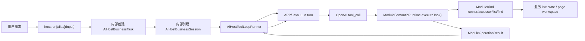

## 先看总图

SPARK AI 分三层，所有依赖都向下，业务和网络 I/O 都在包外接入。

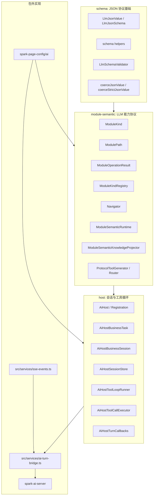

| 层 | 拥有 | 不拥有 |
| --- | --- | --- |
| `spark-ai/schema` | JSON 值域、JSON Schema 构造、AJV 参数校验、JSON 安全规整 | 业务语义 |
| `spark-ai/module-semantic` | `ModuleKind`、路径导航、知识投影、工具生成、工具路由 | Host 会话、HTTP、页面四文件 |
| `spark-ai/host` | 业务注册、task 输入校验、session、工具循环、会话历史、APP turn 回调契约 | 网络实现、SSE 订阅、业务 live state |
| `spark-page-config/ai` | pageDesign / manualLeave 业务注册真源 | LLM HTTP、APP SSE |
| `src/services` | APP 的 HTTP 命令、公共 SSE 单例、turn 聚合接入 | 业务工具实现 |
| `spark-ai-server` | Java AI 会话、模型调用、SSE frame、后端 conversation | 前端业务工具执行 |

## 公共入口

`@spark-view/spark-ai` 只暴露四个 public subpath：

```text
@spark-view/spark-ai
@spark-view/spark-ai/json
@spark-view/spark-ai/modules
@spark-view/spark-ai/agent
```

推荐导入方式：

```ts
import { paramsSchema, stringSchema } from '@spark-view/spark-ai/json'
import {
  ModuleKind,
  ModuleOperationResult,
  ModuleSemanticRuntime,
  type ModulePathContext,
} from '@spark-view/spark-ai/modules'
import {
  AI_HOST,
  createAiHost,
  type AiHostBusinessRegistration,
} from '@spark-view/spark-ai/agent'
```

不要恢复旧 `core`、`protocol`、`runtime`、`adapter` subpath，也不要从包内深路径跨包导入。

## Schema 层

Schema 层是 LLM 参数和工具结果的最底座，源码在 `packages/spark-ai/src/json/`。

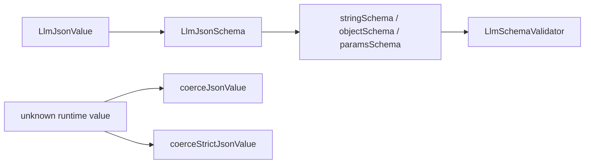

| 文件 | 作用 |
| --- | --- |
| `types.ts` | 定义 `LlmJsonValue`、`LlmJsonObject`、`LlmJsonSchemaObject` |
| `helpers.ts` | 提供 `stringSchema`、`numberSchema`、`objectSchema`、`paramsSchema`、`noParamsSchema` |
| `validator.ts` | 用 AJV 2020 校验反序列化后的参数，输出中文诊断 |
| `coercion.ts` | 把运行时值规整成 JSON 安全值，严格模式拒绝不安全值 |

关键规则：

- 函数参数根节点必须是标准 JSON Schema object，不能再用私有 DSL。
- `paramsSchema()` 是函数参数根入口，`noParamsSchema()` 用于无参数动作。
- LLM 参数先 JSON.parse，再由 `LlmSchemaValidator.validateLlmDeserializedParams()` 校验。
- task 输入用 `coerceStrictJsonValue()`，遇到 `BigInt`、`Symbol`、循环引用、非有限数字等会 fail-fast。
- ModuleKind 属性读取用 `coerceJsonValue()`，会尽力把 Date、URL、Map、Set 等投影成 JSON。

## ModuleKind 是协议核心

`ModuleKind` 同时承载两件事：LLM 可见的元数据，以及运行时委托入口。

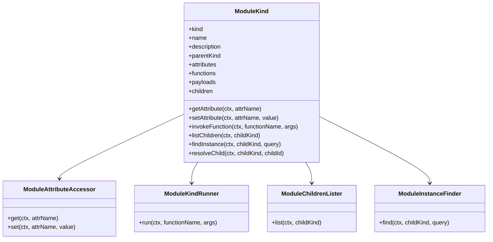

构造期做三件事：

| 阶段 | 行为 |
| --- | --- |
| 规范化 | trim `kind/name/description`，复制 metadata，拒绝空值、重复字段、自引用 |
| 校验 | 声明 `attributes` 时必须提供 `attributeAccessor` |
| 默认委托 | 未提供 runner/list/find 时返回明确失败或空列表，不偷偷执行业务 |

协议方法的防线：

| 方法 | 防线 |
| --- | --- |
| `getAttribute` | 属性已声明、可读、委托返回值存在、JSON 可序列化、符合属性 schema |
| `setAttribute` | 属性已声明、可写、写入值符合 schema、委托成功 |
| `invokeFunction` | 函数已声明、args 符合 `paramsSchema`、runner 成功 |
| `resolveChild` | 子 kind 已声明、`findInstance({ id })` 能找到目标实例 |

失败统一返回 `ModuleOperationResult.failCode(code, message, hint)`，LLM 会收到 `code/msg/fix/checks` 后修正调用，而不是靠猜。

## 路径系统

模块实例路径由 `ModulePath` 表达，语法固定：

```text
/                              根路径
/<kind>[<id>]                  单段实例路径
/<kind1>[<id1>]/<kind2>[<id2>] 多段实例路径
```

`Navigator` 是路径真相来源：

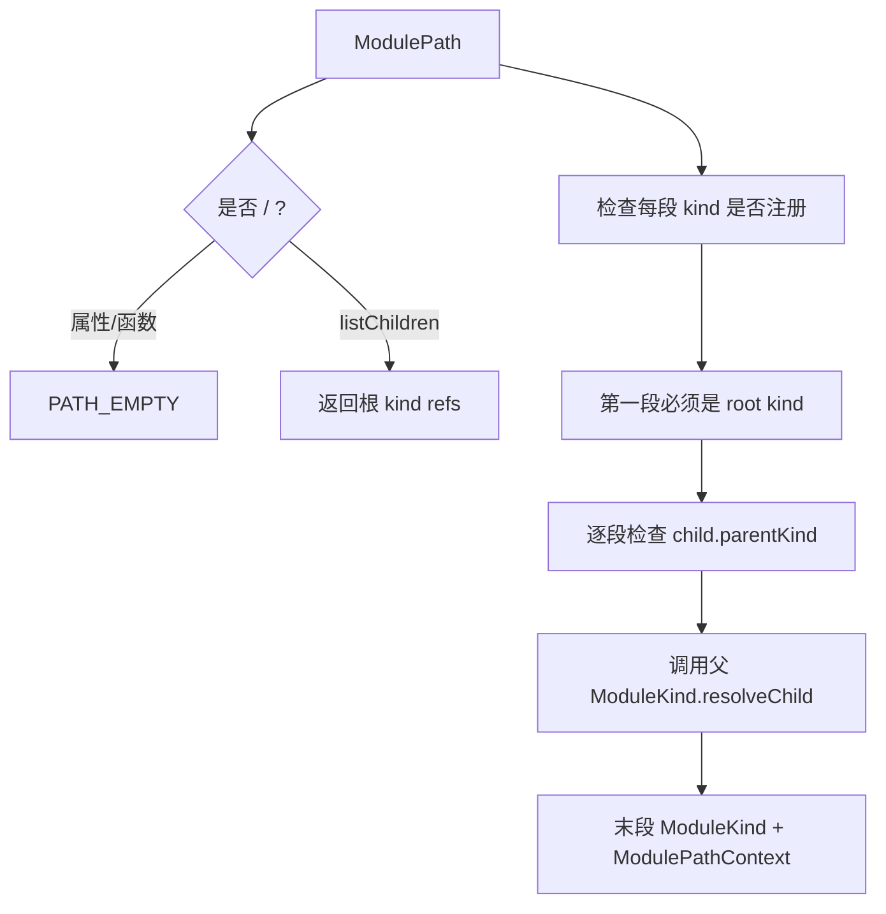

根路径用于发现入口，具体实例路径用于读写属性和执行函数。

常见失败码：

| 失败码 | 说明 |
| --- | --- |
| `PATH_EMPTY` | 属性或函数调用不能对根路径执行 |
| `KIND_NOT_REGISTERED` | 路径中 kind 未注册 |
| `ROOT_KIND_REQUIRED` | 子 kind 被当根路径访问 |
| `PARENT_KIND_MISMATCH` | 路径拓扑和 `parentKind` 不一致 |
| `PATH_INVALID` | 父实例下找不到目标子实例 |
| `CHILD_KIND_NOT_DECLARED` | 父 kind 未声明该 child kind |

## 运行时组合根

`ModuleSemanticRuntime` 是 module-semantic 的组合根，源码在 `runtime/module-semantic-runtime.ts`。

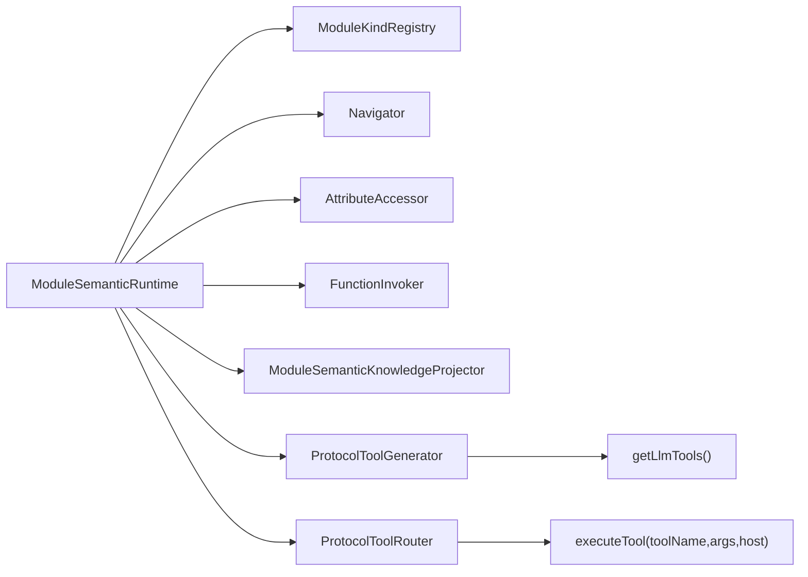

`registerKind()` 是唯一 ModuleKind 注册入口，可接收已构造实例，也可接收 `ModuleKind` subclass 构造器和构造参数；运行时最终只保存实例，不持有业务状态，业务状态必须留在业务 service 或 workspace 里。

直接调用入口：

| 方法 | 用途 |
| --- | --- |
| `getLlmTools()` | 生成 OpenAI function tool 规约 |
| `executeTool()` | Host 执行 LLM tool_call 的统一入口 |
| `getAttribute()` / `setAttribute()` | 编程式属性读写 |
| `invokeFunction()` | 编程式函数调用 |
| `listChildren()` / `findInstance()` | 编程式实例发现 |
| `describeKind()` | 查询 kind 元数据 |
| `projectKnowledge()` | 投影给 LLM 的知识快照 |

## LLM 工具协议

LLM 看到两类工具：固定协议工具，以及按业务函数动态生成的 OpenAI function tool。

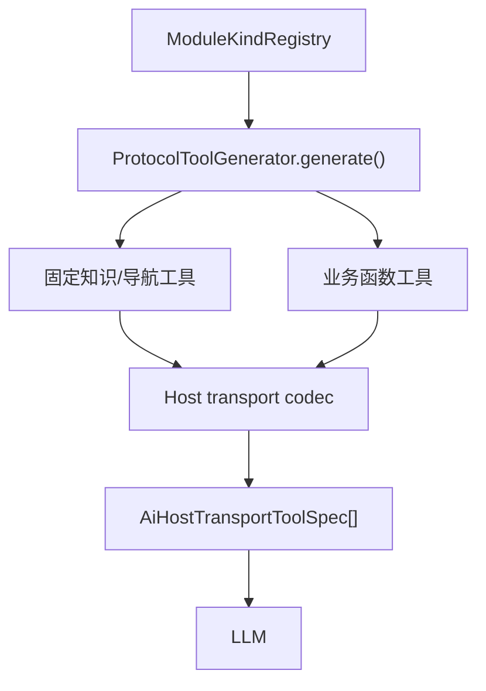

固定工具：

| 工具 | 用途 |
| --- | --- |
| `queryModules` | 查询 ModuleKind 分层知识目录 |
| `queryFunctions` | 查询业务函数目录，定位 toolName |
| `guideFunction` | 查询单个函数完整契约、schema、规则和失败模式 |
| `guideHumanQuestion` | 缺少用户事实时生成最小反问指南 |
| `getAttribute` | 读取具体实例末段 kind 的属性 |
| `setAttribute` | 写入具体实例末段 kind 的属性 |
| `listChildren` | 列出根入口或父实例下的子实例 |
| `findInstance` | 按业务条件查询实例 |
| `describeKind` | 精确读取 kind 原始元数据 |

业务函数工具名来自 `createBusinessFunctionToolName(kindPath, functionName)`：

```text
<kindPath segments joined by "_">_<functionName>

pageDesign_lifecycle_describeProgress
node-tree_getNode
manual-leave_submitDraft
```

业务函数参数会被包装成：

```json
{
  "$paths": ["<rootInstanceId>", "<childInstanceId>"],
  "...businessArgs": "..."
}
```

`$paths` 是协议保留字段，长度必须等于 `kindPath.length`。业务 `paramsSchema` 不能声明 `$paths`。

LLM 推荐调用顺序：

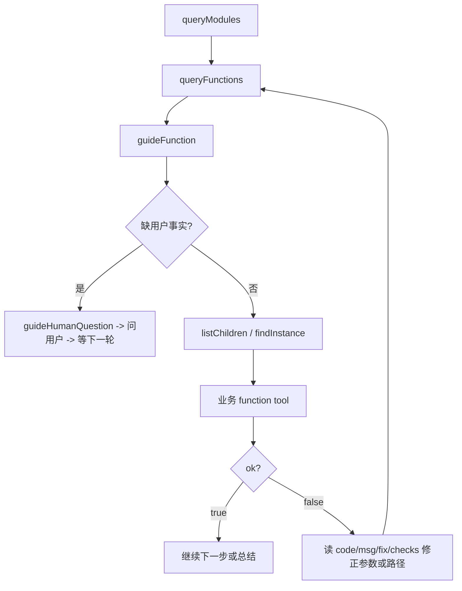

## 知识投影和 Payload

`ModuleSemanticKnowledgeProjector` 把注册表投影成 LLM 可查询的知识，而不是把所有业务细节一次性塞进 prompt。

| 投影 | 说明 |
| --- | --- |
| `queryModules()` | 返回模块摘要、路径模式、实例发现步骤、属性/函数指南、子 kind 摘要 |
| `queryFunctions()` | 返回函数摘要、toolName、必填参数、失败码、payload lookup steps |
| `guideFunction()` | 返回完整 `paramsSchema`、`usageRules`、`failureModes`、示例和 payload 需求 |
| `guideHumanQuestion()` | 把缺失事实收敛成用户可回答的问题，并要求停止写工具 |
| `project().promptSnapshot` | 小型系统提示快照，只列路由规则和根 kind 索引 |

Payload 是“构造复杂参数前必须查询的外部知识”。例如 pageDesign 写组件 props 前，需要通过 payload-catalog 查询组件参数指南。

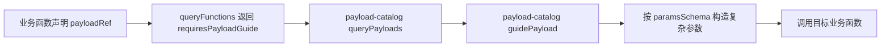

如果某个 `ModuleKind` 声明了 payloadRef，但没有注册带 `queryPayloads` 和 `guidePayload` 的 payload catalog kind，知识投影会 fail-fast。

## Host 注册模型

Host 层把业务 runtime 注册成可会话化的 AI 能力。

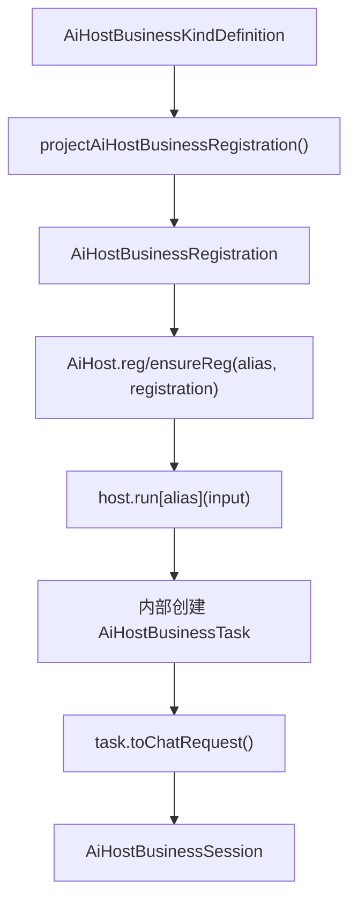

`AiHostBusinessKindDefinition` 是新增业务的真源：

| 字段 | 说明 |
| --- | --- |
| `kindID` | Host registry 中的业务 ID |
| `runtime` | 已注册 ModuleKind 能力树的 `ModuleSemanticRuntime` |
| `inputContract.paramsSchema` | task 输入 schema |
| `inputContract.identityField` | 顶层业务实例主键 |
| `inputContract.normalize()` | 规范输入并保持 JSON 安全 |
| `inputContract.toScope()` | 输入投影为 `AiHostBusinessScope` |
| `inputContract.toOrchestration()` | 生成首轮用户消息和系统编排提示 |
| `sessionStore` | 可选，会话历史存储；registry 会补默认内存 store |
| `systemPrompt` | 每轮拼接到 LLM system prompt 的业务动态提示 |
| `afterFunctionCall` | 每次工具调用后决定 `continue/complete/abort` |
| `onStartSession` | 会话启动时绑定业务 live state |
| `releaseModuleInstance` | 会话结束时释放业务实例资源 |

`host.run[alias]()` 内部创建 task 时做六个硬校验：

1. `kindID` 必须已注册。
2. registration 必须有 `inputContract`。
3. 原始 input 必须是 JSON object。
4. 原始 input 必须通过 `paramsSchema`。
5. `normalize()` 结果必须仍是 JSON object 且再次通过 schema。
6. `identityField`、`toScope()` 和 `kindID` 必须一致。

task 生成的 system prompt 只包含非用户正文的输入字段，用户原始需求作为 `historyMsgs[0]` 进入 LLM。

## 注册后如何开启具体业务

注册不是业务启动。注册只把一类业务能力交给 `AiHost`；真正开启某个业务实例，业务层只消费 `AI_HOST` 能力，然后按 alias 调 `host.run[alias](input)`。

标准消费链路固定为：

```text
App 壳 createAiHost({ turnCallbacks, maxToolRounds })
  -> sparkProvide(rootContext, AI_HOST, appAiHost)
  -> 业务层 sparkConsume(context, AI_HOST)
  -> ensurePageDesignBusiness({ host, getPageDesignEditHost })
  -> host.run.pageDesign({ pageId, userRequirement })
  -> Host 内部创建 task/session
  -> AiHostToolLoopRunner
  -> registration.runtime.executeTool(toolName, args, hostContext)
```

注册后有两个阶段：

| 阶段 | Host API | 含义 |
| --- | --- | --- |
| App 组合期 | `createAiHost()` + `sparkProvide(AI_HOST, host)` | 创建宿主壳单例，并通过框架无关能力体系传输 |
| 业务挂载期 | `host.ensureReg(alias, { moduleId, create })` | 按 alias 把业务注册到 Host，重复注册幂等复用 |
| 运行期 | `host.run[alias](input, chat?)` | 校验输入、打开具体业务实例，并让 LLM 消费工具 |

业务代码不再直接装配 registry。App 壳创建一个 `AiHost` 单例，并通过 `spark-utils` 的能力体系提供出去；具体业务消费 `AI_HOST` 后只做两件事：确保自己的业务入口已注册，然后按 alias 运行。

```ts
import {
  AI_HOST,
  createAiHost,
} from '@spark-view/spark-ai/agent'
import { ensurePageDesignBusiness } from '@/services/page-design-business'
import { sparkConsume, sparkProvide } from '@spark-view/spark-utils'
import { createAiHostTurnCallbacks } from '@/services/ai-turn-bridge'

// App 壳：启动时创建一次，并放入 root CapabilityContext。
const appAiHost = createAiHost({
  turnCallbacks: createAiHostTurnCallbacks(),
  maxToolRounds: 16,
})
sparkProvide(rootContext, AI_HOST, appAiHost)

// 业务层：从能力体系消费 Host，注册并运行 pageDesign。
await workspace.ensureActivePageFilesLoaded({ allowMissingAsEmpty: true })

const host = sparkConsume(businessContext, AI_HOST)
if (host === null) throw new Error('AI_HOST capability is not provided')

// pageDesign business registration is owned by the app integration layer.
// DevSystem editing state should still enter spark-page-config through PageEditor.
const pageDesignHost = ensurePageDesignBusiness({
  host,
  getPageDesignEditHost: () => workspace.createPageDesignEditHost(),
})

await pageDesignHost.run.pageDesign({
  pageId,
  userRequirement,
}, {
  onDelta: renderTextDelta,
  onReasoning: renderReasoningDelta,
  onStreamEvent: renderDiagnosticEvent,
  onToolCall: renderToolCall,
})
```

`PageDesignRunInput` 是 `paramsSchema` 对应的 TS 参数形态，使用 `LlmJsonParamShape` 保留 `pageId`、`userRequirement` 等具名字段。`host.run.pageDesign({ pageId })` 会在 TS 层失败，运行时仍由 `PAGE_DESIGN_INPUT_SCHEMA = paramsSchema(...)` 做最终校验。

启动责任分工：

| 角色 | 负责什么 | 不负责什么 |
| --- | --- | --- |
| App 壳 | 创建 `AiHost` 单例，配置 `turnCallbacks/maxToolRounds`，通过 `AI_HOST` 能力提供 | 不知道 pageDesign 子工具结构 |
| 业务包 | 暴露 `ensurePageDesignBusiness()` / `createXxxBusinessRegistration()` 和 ModuleKind 工具 | 不发 HTTP、不管理 LLM turn |
| 调用方/UI | 消费 `AI_HOST`，提供 `PageDesignRunInput`，调用 `run.pageDesign()` | 不手写工具 schema、不绕过 inputContract |
| `turnCallbacks` | 准备后端 session、启动 LLM turn、追加 assistant/tool 消息 | 不执行业务工具 |
| `AiHostToolLoopRunner` | 调 LLM、收 tool_calls、执行工具、回灌工具结果 | 不知道 pageDesign 四文件细节 |
| `ModuleSemanticRuntime` | 把 toolName 路由到 query/navigation/function runner | 不持久化 APP 页面文件 |
| `PageDesignService` | 通过 `PageDesignEditHost` 读写 rule/pagedata/script/style 的内存模型 | 不保存 AI 会话历史 |

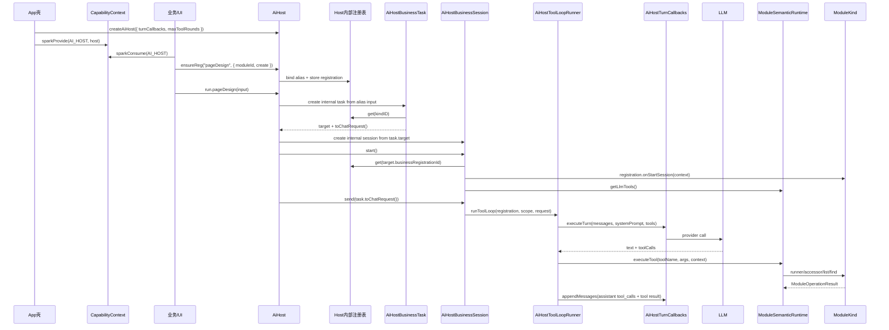

> `ModuleKind` 后面的具体实现属于注册项内部。Host 层只认 `registration.runtime.executeTool()` 这个协议边界。

注册项在 Host 内部被四个框架消费者接力使用。下表是实现机制，不是业务层推荐入口：

| 消费者 | 消费什么 | 发生时间 |
| --- | --- | --- |
| `host.run[alias]()` 内部 task 创建 | `inputContract` | 把外部 JSON input 校验、归一化，并投影成 `target + orchestration` |
| `AiHostBusinessSession.start()` / `startRegistrationSession()` | `onStartSession`、`sessionStore`、`runtime.getLlmTools()` | 接入具体实例，创建 session 记录，生成 LLM tools |
| `AiHostToolLoopRunner` | `systemPrompt`、`runtime`、`sessionStore`、`afterFunctionCall` | 每个 `send()` 中驱动 LLM round 和工具循环 |
| `ModuleSemanticRuntime.executeTool()` | `ModuleKind` 元数据和委托 | 执行 LLM 返回的 tool_call，并得到 `ModuleOperationResult` |

这段代码只有 `definition` 和 `turnCallbacks` 需要由宿主装配：

| 装配物 | 来源 | Host 如何消费 |
| --- | --- | --- |
| `definition` / `registration` | 业务包或插件提供 | 通过 `host.reg()` / `host.ensureReg()` 进入 Host 后，被 task/session/runner/runtime 消费 |
| `turnCallbacks` | APP/服务端适配层提供 | Host 调用它准备 session、启动 LLM turn、追加 assistant/tool 消息 |

`createAiHost()` 是框架启动器：

```ts
type CreateAiHostOptions = {
  turnCallbacks: AiHostTurnCallbacks
  maxToolRounds?: number
}
```

各对象边界：

- `host.reg()` / `host.ensureReg()` 只是登记业务能力，不会调用模型，也不会执行工具。
- `kindID` 选择业务类型，`identityField` 对应的值选择具体业务实例。
- `host.run[alias]()` 是业务层打开某个注册业务实例的唯一推荐入口。
- `task.target` 决定 session 指向哪个业务实例，格式是 `{ businessRegistrationId, businessInstanceId }`。
- `task.toChatRequest()` 决定本轮给 LLM 的用户消息和编排提示。
- `session.start()` 会调用 `startRegistrationSession()`，内部执行 `onStartSession()`、`sessionStore.startSession()` 和 `runtime.getLlmTools()`。
- `session.send()` 才是真正消费工具的入口，它启动 `AiHostToolLoopRunner`。
- LLM 不直接拿 registry；LLM 只拿本轮 `tools`。当前源码每轮都从 `runtime.getLlmTools()` 重新投影全量工具，行动收敛依赖 `inputContract.toOrchestration()`、工具说明、`guideFunction()`、业务 fail-fast 和 `afterFunctionCall`。
- LLM 返回 `tool_calls` 后，由 `AiHostToolCallExecutor` 解析参数，再调用 `registration.runtime.executeTool()`。

换句话说，SPARK AI 的标准运行公式是：

```text
AI_HOST capability
  + alias
  + JSON input
  => host.run[alias]()
  => runtime.executeTool()
```

不要在注册阶段偷跑业务，也不要绕过 `host.run[alias]()` 手写裸 `AiHostBusinessTarget`。裸 target 只能表达“去哪儿”，不能执行 `inputContract` 校验、归一化和编排提示生成。

## Session 与 Tool Loop

`AiHostBusinessSession` 是对外会话入口，`AiHostToolLoopRunner` 是工具循环核心。

```mermaid
sequenceDiagram
  participant UI as UI/业务入口
  participant Session as AiHostBusinessSession
  participant Loop as AiHostToolLoopRunner
  participant App as AiHostTurnCallbacks
  participant Java as spark-ai-server
  participant Runtime as ModuleSemanticRuntime
  participant Store as AiHostSessionStore

  UI->>Session: start()
  Session->>Store: startSession(context)
  Session->>Runtime: getLlmTools()
  UI->>Session: send(task.toChatRequest())
  Session->>Store: appendMessage(user)
  Session->>Loop: runToolLoop()
  Loop->>App: prepareSession()
  App->>Java: POST /api/ai/sessions
  Loop->>App: executeTurn()
  App->>Java: POST /api/ai/turns
  Java-->>App: /api/events llm-frame
  App-->>Loop: text + toolCalls
  Loop->>Runtime: executeTool(toolName,args,host)
  Runtime-->>Loop: ModuleOperationResult
  Loop->>Store: appendFunctionCall()
  Loop->>App: appendMessages(assistant tool_calls + tool result)
  App->>Java: POST /api/ai/sessions/{id}/turn/append
```

每轮 `runToolLoop()` 的真实流程：

1. 拼接 system prompt：`registration.systemPrompt(context)`、`request.systemPrompt`、`runtime.projectKnowledge().promptSnapshot`。
2. 用 `runtime.getLlmTools()` 取本轮工具，并通过 Host transport codec 投影为 transport tool spec。
3. `prepareSession()` 把后端 session、tools、systemPrompt 准备好。
4. 首轮只发送最新用户消息，后续轮次依赖后端 conversation，不重复发送上一轮工具消息。
5. `executeTurn()` 带上本轮 `tools`，返回文本和 toolCalls。
6. 文本非空则写入 Host sessionStore。
7. 无 toolCalls 时自然结束。
8. 有 toolCalls 时逐个交给 `AiHostToolCallExecutor`。
9. executor 解析 arguments、调用 runtime、映射结果、写 sessionStore、触发 `afterFunctionCall`。
10. runner 把 `assistant(tool_calls)` 和 `tool` 消息追加到后端。
11. lifecycle directive 为 `complete/abort` 时停止会话、发送最终消息、释放实例。
12. 达到 `maxToolRounds` 时向前端输出“工具调用轮次已达上限”。

生命周期指令：

| status | 行为 |
| --- | --- |
| `continue` | 进入下一轮 LLM |
| `complete` | 业务完成，停止 session，可发送最终助手消息 |
| `abort` | 业务终止，停止 session，可释放实例 |

工具结果映射：

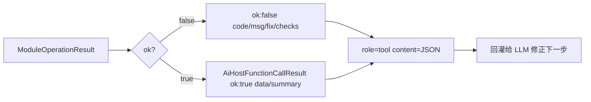

## APP Turn Bridge 与 Java 后端

`spark-ai` 不发 HTTP，不创建 EventSource。APP 层在 `src/services/ai-turn-bridge.ts` 注入三个回调：

| 回调 | 当前实现 |
| --- | --- |
| `prepareSession` | `POST /api/ai/sessions`，提交 `protocolVersion=4`、systemPrompt、tools、scope |
| `executeTurn` | 建立 `createTurnEventCollector()`，再 `POST /api/ai/turns` 提交 `sessionId/turnId/messages/systemPrompt/tools` 启动后端异步 turn |
| `appendMessages` | `POST /api/ai/sessions/{sessionId}/turn/append`，追加 assistant/tool 消息 |

公共 SSE 单例在 `src/services/sse-events.ts`，只连接 `/api/events`，解包 v4 envelope 后按事件名分发。AI turn collector 只监听 `llm-frame`，并过滤不同 `sessionId/turnId` 的事件。

Java 端当前链路：

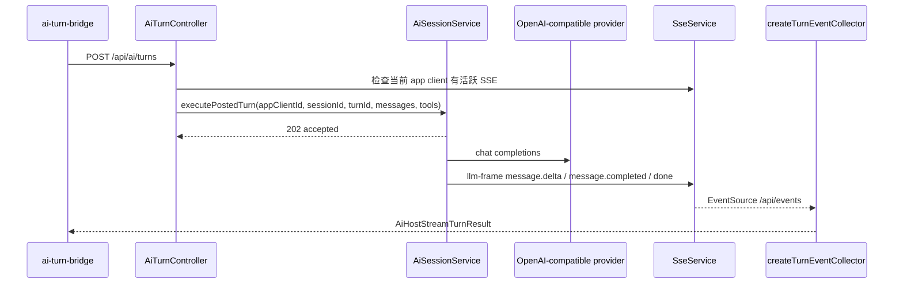

后端要点：

- `AiSessionService` 按 sessionId 维护 conversation、tools、systemPrompt、scope 和滑动窗口。
- `POST /api/ai/turns` 是启动命令，不是 SSE 通道。
- 后端通过 `SPARK_APP_CLIENT_ID` cookie 定位当前浏览器 SSE 连接。
- function-calling turn 会优先拿完整 assistant message，再通过 `llm-frame` 发 `message.completed`，避免 provider streaming tool_calls 差异。
- 有 tool_calls 时，后端不自动把 assistant(tool_calls) 写入 conversation；前端 Host 执行工具后通过 `appendMessages` 写入 assistant + tool 结果，避免无配对 tool message 的非法历史。
- `buildWindowedMessages()` 会保留 tool_calls 块完整性，避免窗口裁剪切断 assistant/tool 成对消息。

## pageDesign 业务图

pageDesign 真源是 `packages/spark-page-config/src/ai/page-design-module.ts`。

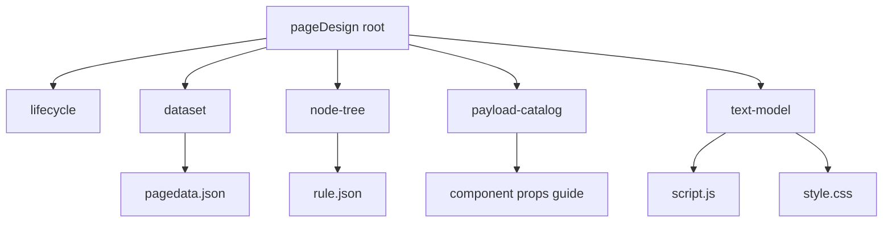

注册内容：

| 项 | 值 |
| --- | --- |
| `kindID` | `pageDesign` |
| root kind | `pageDesign` |
| child kinds | `lifecycle`、`text-model`、`payload-catalog`、`node-tree`、`dataset` |
| identity field | `pageId` |
| required input | `pageId`、`userRequirement` |
| optional input | `mode`、`allowedOperations`、`preserveExistingInteractions` |
| sessionStore | `DefaultAiHostSessionStore` |
| tool exposure | 当前每轮全量暴露 `runtime.getLlmTools()`；首轮动作由 `createPageDesignOrchestration()` 提示收敛 |
| live state | `PageDesignService` + `PageDesignEditHost` |

pageDesign 的路径约定是：

```text
/pageDesign[pageId]/lifecycle[pageId]
/pageDesign[pageId]/dataset[pageId]
/pageDesign[pageId]/node-tree[pageId]
/pageDesign[pageId]/payload-catalog[pageId]
/pageDesign[pageId]/text-model[pageId]
```

所以子工具通常使用：

```json
{
  "$paths": ["pageId", "pageId"]
}
```

首轮编排由 `createPageDesignOrchestration()` 生成：

```text
findInstance("/", "pageDesign", { id: pageId })
  -> pageDesign_lifecycle_describeProgress({ $paths: [ref.id, ref.id] })
  -> pageDesign_lifecycle_describeDesignFlow({ $paths: [ref.id, ref.id], intent: userRequirement })
  -> 缺事实时 guideHumanQuestion
```

pageDesign 写入顺序：

| 顺序 | 模块 | 文件 | 说明 |
| --- | --- | --- | --- |
| 1 | `dataset` | `pagedata.json` | 先准备 DataTable/DataView，不能绕开 DataSet 管线 |
| 2 | `node-tree` | `rule.json` | 再写组件树，复杂 props 先查 payload guide |
| 3 | `text-model` | `script.js` / `style.css` | 最后补脚本和样式，遵守脚本沙箱 |

四文件边界：

| 文件 | AI 入口 | 禁止 |
| --- | --- | --- |
| `pagedata.json` | dataset ModuleKind | 旧成员拼接键、绕开 `parsePageData() -> DataSet` |
| `rule.json` | node-tree ModuleKind | 未校验组件 type/props 直接写入 |
| `script.js` | text-model ModuleKind | `$data`、ESM `import`、`window.xxx`、直接 Vue Router / Element Plus |
| `style.css` | text-model ModuleKind | 全局污染式兜底 |

高风险缺事实必须反问：

- 用户未说明业务范围、字段含义或目标页面。
- 相对日期、审批状态、默认选项等不能唯一推断。
- 需要删除、覆盖或重排已有交互。
- 需要新增表、脚本、组件，但输入没有授权。
- 当前页面状态和用户需求冲突。

## manualLeave 示例

`packages/spark-page-config/src/ai/leave-request.ts` 是一个小而完整的业务样例。它展示了：

- service 自管草稿 live state。
- root kind `manual-leave` 暴露 `describeDraft`、`setDraftFields`、`submitDraft`、`cancelDraft`。
- child kind `leave-person` 只读暴露人员属性。
- `afterFunctionCall` 在提交成功后返回 `complete`，取消后返回 `abort`。
- 相对日期必须基于 system prompt 注入的当前日期，无法确定时用 `guideHumanQuestion`。

它是新增业务时最适合作为骨架参考的源码。

## 新增业务步骤

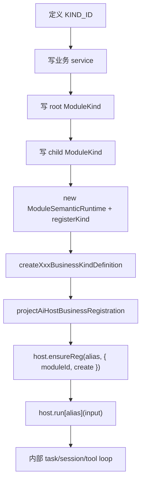

最小骨架：

```ts
export function createTodoBusinessKindDefinition(options: TodoBusinessOptions) {
  const service = new TodoService(options)
  const runtime = new ModuleSemanticRuntime()
  runtime.registerKind(TodoRootKind)
  runtime.registerKind(TodoListKind, { service, parentKind: TODO_KIND_ID })

  return {
    kindID: TODO_KIND_ID,
    name: 'Todo',
    description: '待办事项 AI',
    runtime,
    inputContract: {
      paramsSchema: paramsSchema({
        todoListId: stringSchema('待办列表 ID', { minLength: 1 }),
        userRequirement: stringSchema('用户原始需求', { minLength: 1 }),
      }, ['todoListId', 'userRequirement']),
      identityField: 'todoListId',
      normalize: normalizeTodoInput,
      toScope: (input) => createAiHostBusinessScope(TODO_KIND_ID, String(input.todoListId)),
      toOrchestration: createTodoOrchestration,
    },
    onStartSession: (context) => service.bootstrap(context.moduleInstanceId),
    releaseModuleInstance: (moduleInstanceId) => service.release(moduleInstanceId),
  }
}
```

Checklist：

- 每个 function 都写 `paramsSchema`、`usageRules`、`failureModes`。
- 业务 service 返回结构化成功/失败，再用 `serviceResultToOperationResult()` 投影。
- root kind 的 `find("/", ownKind, query)` 能定位当前业务实例。
- child kind 的 `parentKind` 和父 kind `children` 必须双向一致。
- 复杂参数先声明 payloadRef，再注册 payload-catalog kind。
- task 输入必须有稳定 identityField。
- lifecycle 只在 `afterFunctionCall` 决定，不放进 LLM prompt 猜。
- 补 `spark-ai` 或业务包测试，至少覆盖 task、tool schema、成功调用、失败回灌、生命周期。

## 调试地图

| 想查什么 | 入口文件 |
| --- | --- |
| 公共导出 | `packages/spark-ai/src/index.ts` |
| schema 构造和校验 | `packages/spark-ai/src/json/` |
| ModuleKind 协议 | `packages/spark-ai/src/modules/protocol/module-kind.ts` |
| 路径导航 | `packages/spark-ai/src/modules/internal/navigator.ts` |
| 工具生成 | `packages/spark-ai/src/modules/internal/protocol-tool-generator.ts` |
| 工具路由 | `packages/spark-ai/src/modules/runtime/protocol-tool-router.ts` |
| 知识投影 | `packages/spark-ai/src/modules/knowledge/module-semantic-knowledge.ts` |
| Host task | `packages/spark-ai/src/agent/business/business-task.ts` |
| Host session | `packages/spark-ai/src/agent/business/business-session.ts` |
| 工具循环 | `packages/spark-ai/src/agent/tool-loop/tool-loop-runner.ts` |
| 单次工具执行 | `packages/spark-ai/src/agent/tool-loop/tool-call-executor.ts` |
| SSE turn 聚合 | `packages/spark-ai/src/agent/tool-loop/turn-event-collector.ts` |
| APP HTTP bridge | `src/services/ai-turn-bridge.ts` |
| APP SSE 单例 | `src/services/sse-events.ts` |
| Java turn API | `spark-ai-server/src/main/java/com/spark/ai/controller/AiTurnController.java` |
| Java session API | `spark-ai-server/src/main/java/com/spark/ai/controller/AiSessionController.java` |
| Java LLM session | `spark-ai-server/src/main/java/com/spark/ai/service/AiSessionService.java` |
| Java SSE | `spark-ai-server/src/main/java/com/spark/ai/service/SseService.java` |
| pageDesign 注册 | `packages/spark-page-config/src/ai/page-design-module.ts` |
| pageDesign workspace | `packages/spark-page-config/src/design/page-edit-workspace.ts` |

源码里可用这些 trace 快速定位：

```bash
rg "PAGE_DESIGN_AI_TRACE|PAGE_DESIGN_REFACTOR_SOURCE" packages src scripts
```

## 常见问题

| 现象 | 优先检查 |
| --- | --- |
| LLM 不知道该调用哪个业务函数 | `queryFunctions` / `guideFunction` 是否返回目标函数 |
| 工具参数校验失败 | function `paramsSchema`、`$paths` 长度、JSON object 根节点 |
| 路径不存在 | `findInstance` 是否拿到真实 ref.id，父子 `parentKind/children` 是否一致 |
| tool result 没回灌 | `appendMessages` 是否成功写入后端 conversation |
| 后端 turn 一直等不到结果 | `/api/events` 是否已连接，`SPARK_APP_CLIENT_ID` cookie 是否对应当前浏览器 |
| pageDesign 找不到 edit host | 是否在开发系统打开并选中目标配置页面 |
| payloadLookupSteps 抛错 | 声明了 payloadRef 但没有注册 payload-catalog kind |
| OpenAI strict schema 拒收 | 当前 codec 显式 `strict:false`；不要手动打开 strict，除非补齐 strict normalizer |

## AI 代码生成行为

Codex 或其它 AI 编码助手修改本仓库时，必须按“稳定契约 -> class 基础/默认实现 -> 具体 class -> 必要子类”的层次组织代码。不要把系统扁平化成大量平级 `interface`、泛型、工具类型和随处导出的符号。

强制规则：

- 先复用已有 class、registry、factory、capability key 和领域对象，再新增结构。
- 不要默认为每个 class 创建同名 `interface`。
- 不要使用 `Ixxx`、`XxxInterface`、`XxxImpl` 这类机械命名。
- 只有稳定契约、跨模块能力、DTO/config/payload 或多个实现共享协议才使用 `interface`。
- 如果只有一个实现，默认使用具体 class 或普通函数。
- class 用于承载状态、生命周期、缓存、不变量和默认行为。
- 子类只表达明确的“是一种”关系，不为复用几个方法而继承。
- 泛型只在调用方能获得真实类型收益时使用；超过两个泛型参数时优先改成具名业务类型或 class。
- 函数/方法签名必须短：默认最多 3 个位置参数；4 个及以上改成具名 options object、command object 或领域对象。
- 多个回调、多个上下文值或多个可选项不要平铺进参数列表；用一个具名 type/class 收束，并在字段处说明契约。
- 参数类型不要写匿名内联对象、深层泛型或大联合类型；提取为具名 `type` 或已有领域 class。
- 参数列表里禁止内嵌 JSDoc；注释放到函数上方、options type 字段或 class 字段。
- 可选参数使用 `foo?: T`，不要写成 `foo?: T | undefined`，除非 `undefined` 属于嵌套函数返回值等不同语义。
- 公共导出必须有明确消费者；内部 helper、context、options、provider、resolver 不要为了测试或未来扩展导出。
- 常规业务流程最好只需要 1-3 个公共导入；如果调用方要导入一串内部零件，先收敛门面。
- 不要新增静默兜底掩盖缺失 API、无效配置或状态不一致；错误应 fail-fast 或返回给 LLM 修正。
- 修改公共入口时，同步更新 package exports、TS paths、Vite/Vitest alias 和 import smoke test。

硬门禁：

- `pnpm run verify:rules` 必须通过。
- 禁止非 allowlist `interface`、`Interface/Impl` 机械命名、TypeScript `namespace`。
- 禁止非 `as const` 类型断言和尖括号类型断言。
- 公共 barrel 禁止 `export *`，必须显式 export。
- 禁止旧 `@spark-view/spark-ai/core`、`/protocol`、`/runtime`、`/adapter` 等 subpath。
- 禁止旧 `ModuleKind.PathContext`、`ModuleKind.OperationResult` 等 namespace 类型。
- 框架无关包禁止导入 Vue、Vue Router、Element Plus、VueUse 或 Pinia。
- workspace 包之间禁止绕过 `@spark-view/*` 的跨包相对导入。

注释规范：

- 注释只解释契约、约束、优先级和风险，不逐行解释显而易见的代码。
- VCM/LLM 可见语义必须在首次声明处用自然语言注释和结构化 tag 标注。
- 不用注释合理化静默兜底；缺失能力、非法配置和状态冲突要显式失败。

## 验证命令

纯文档改动：

```bash
pnpm run verify:docs
```

改 `packages/spark-ai` 后：

```bash
pnpm --filter @spark-view/spark-ai run typecheck
pnpm --filter @spark-view/spark-ai run lint
pnpm --filter @spark-view/spark-ai run test:run
pnpm run verify:rules
```

改 pageDesign AI 后：

```bash
pnpm --filter @spark-view/spark-page-config run typecheck
pnpm --filter @spark-view/spark-page-config run lint
pnpm --filter @spark-view/spark-page-config exec vitest run tests/page-design-business-definition.test.ts tests/page-design-node-tree-module-semantic.test.ts tests/leave-request-module.test.ts tests/public-api-imports.test.ts
pnpm run verify:rules
```

真实 LLM 页面设计验收按需跑：

```bash
pnpm run verify:ai:page-design-leave:llm
```

## 文档维护规则

- AI 业务流程、Host、LLM 工具协议、pageDesign、代码生成行为和验证入口统一维护在本文。
- 不新增同主题 AI 手册，避免和本文分叉。
- 代码改变公开入口、协议、工具 schema、pageDesign 流程或后端 turn 合同时，同步更新本文。
- 需要局部源码说明时，可在源码邻近 README 写边界，但必须回链本文。
