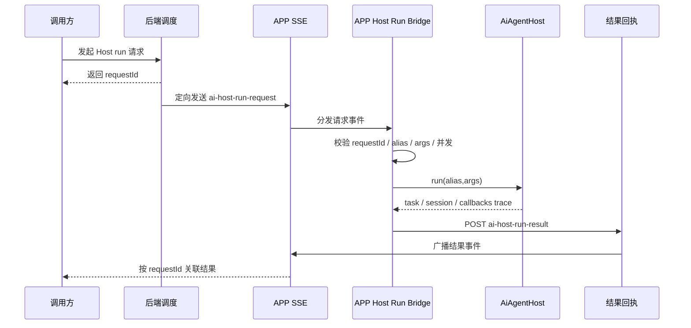

# Spark AI Host 分布式调用方案

> 本文是方案文档，不描述已经完成的实现。范围只包含平台协议、Host 运行入口、SSE 分布式调度、分层边界和后续实施顺序；不包含任何具体业务内容、业务别名、业务字段、业务流程或迁移案例。

## 1. 背景与目标

`AiAgentHost.run(alias,args)` 应成为 AI 能力运行的唯一平台入口。注册方只负责按 `spark-ai` 协议暴露能力、输入契约、函数面和知识面，调用方只认识 `alias + args`，不需要知道能力内部如何组织模块、函数、会话或副作用。

SPARK AI 的根定位必须保持清晰：它不接管业务状态，不替业务编排流程，不把业务实现写进平台内核。它负责把注册方提供的业务实现逻辑、流程方法、函数能力、约束、风险和验证方式投影成 LLM 可理解的知识体系与可调用工具协议。LLM 根据用户需求和这套知识体系制定工作流程，选择并调用函数，执行过程检验，最后完成成果验证。

当前前端 APP 已经具备一个长期在线的运行时环境：它持有 Host、注册表、浏览器上下文、用户态能力和 APP SSE 连接。后端具备统一请求入口、SSE 推送和回执接收能力。因此可以把 APP 壳层视为分布式执行节点：服务端通过 SSE 定向下发一次 Host run 请求，APP 壳层执行 `AiAgentHost.run(alias,args)`，再用 HTTP 回传结果，形成异步、可观察、可诊断的调用闭环。

本方案目标：

- 统一运行入口：所有远程 AI 调用都收敛为 `AiAgentHost.run(alias,args)`。
- 补齐远程闭环：请求、投递、执行、完成、失败、超时、繁忙都必须有协议表达。
- 保持内核克制：`spark-ai` 不实现 SSE、HTTP、DOM、Router 或浏览器副作用。
- 保持编排主体明确：SPARK AI 只投影知识和函数协议，LLM 负责编排工作流程、过程检查和成果验证。
- 明确分层边界：SSE bridge 位于 APP 壳层，不进入配置加载层、编译层或纯协议层。
- 为声明式注册铺路：先让 Host run 链路稳定，再收敛注册方代码量。

## 2. 痛点与断点

### 2.1 注册链断点

当前注册表能表达“已注册”，但“可运行”不是一等状态。Host run 实际依赖输入契约、会话存储、运行时工具规约和生命周期回调等条件；如果这些条件没有被统一诊断，系统会出现“看起来已注册，但运行时才失败”的状态。

目标状态是：

- Host 能明确区分 `registered` 与 `runnable`。
- 不可运行条目不能进入远程调用链。
- `describe`、`dryRun`、注册摘要和远程回执都能暴露不可运行原因。

### 2.2 调用链断点

如果某些调用路径绕过 `AiAgentHost.run(alias,args)`，平台就无法统一输入校验、会话记录、工具循环、生命周期、错误码和审计。长期看，这会让每个入口都沉淀自己的 runner 和胶水逻辑。

目标状态是：

- 远程调用只触发 Host run。
- 本地 UI 或调试入口也优先复用同一 Host run 语义。
- 能力内部实现不泄漏给调用方。

### 2.3 远程触发链断点

现有 SSE 可以把服务端事件送到浏览器，但通用 Host run 需要更完整的分布式调用协议。单纯“收到事件就执行”不够，因为服务端还需要知道是否投递成功、是否被执行、何时完成、失败原因是什么。

目标状态是：

- 每个远程请求都有 `requestId`。
- 服务端能定向投递到一个 APP 客户端。
- 前端无论成功、失败、超时、繁忙都必须回执。
- 结果事件能按 `requestId` 被调用方关联。
- 远程执行不依赖某个 UI 页面已经打开；需要运行上下文时，由 APP 壳层按协议准备 headless 上下文。

### 2.4 结果回执链断点

`host.run()` 的返回值主要表达 task/session 创建和执行入口完成，而最终文本、推理片段、工具调用记录来自 chat callbacks。远程调用如果不挂 trace collector，服务端只能知道“调用结束”，无法得到可用结果。

目标状态是：

- APP bridge 在调用 Host run 时统一挂载 trace collector。
- 回执包含聚合后的文本、推理、工具调用摘要、会话标识和耗时。
- 回执结构不包含具体业务字段。

### 2.5 诊断链断点

未知 alias、输入非法、不可运行注册、节点繁忙、超时、执行异常等状态需要统一错误码。否则调用方只能解析自然语言错误，无法做稳定处理。

目标状态是：

- 错误码稳定、短小、平台级。
- 错误对象包含 `code`、`message`、可选 `details`。
- 失败路径也会产生 result 回执。

### 2.6 分层边界断点

SSE bridge 需要同时接触 APP SSE、Host 实例、HTTP 回执和浏览器运行态。它不属于配置加载链，也不属于 `spark-ai` 内核。如果放错层，会破坏包边界，让纯协议包承担 I/O 或浏览器副作用。

目标状态是：

- `spark-ai` 只定义运行时内核和类型契约。
- APP 壳层负责接入 SSE、调用 Host、提交回执。
- 后端负责定向投递和结果广播。
- 配置加载、编译、数据、组件渲染等层不承载分布式调用职责。

## 3. 目标架构



四层职责如下：

| 层 | 职责 | 不负责 |
| --- | --- | --- |
| `spark-ai` 内核 | Host、注册、输入契约、知识投影、函数协议、task/session、tool loop、transport 类型 | SSE、HTTP、业务状态、业务流程编排、浏览器副作用、后端控制器 |
| APP 壳层 bridge | 订阅 request、校验载荷、调用 Host、收集 trace、提交 result | 定义具体能力、持久化结果、理解能力内部逻辑 |
| 后端调度 | 接收发起请求、定向 SSE、接收回执、广播结果 | 执行 Host run、解释具体能力、访问浏览器状态 |
| 注册方协议 | 声明可运行能力、输入契约、函数能力、知识投影材料、检验与验证语义 | 处理 SSE、HTTP、分布式投递、结果广播 |

## 4. 通用协议

### 4.1 请求事件：`ai-host-run-request`

该事件由后端通过 APP SSE 定向发送到一个 APP 客户端。

| 字段 | 类型 | 必填 | 说明 |
| --- | --- | --- | --- |
| `requestId` | string | 是 | 单次远程调用 ID，由发起方或后端生成 |
| `alias` | string | 是 | Host 注册别名，只作为平台定位键 |
| `args` | object | 是 | JSON object，交给 Host 输入契约校验 |
| `timestamp` | number | 是 | 服务端发起时间 |
| `timeoutMs` | number | 否 | 单次执行超时；缺省使用平台默认值 |
| `reason` | string | 否 | 平台级发起原因，用于日志和诊断 |

请求事件只表达平台运行指令，不携带任何具体业务协议。

### 4.2 结果事件：`ai-host-run-result`

该事件由 APP bridge 先 POST 给后端，再由后端广播。调用方通过 `requestId` 关联结果。

| 字段 | 类型 | 必填 | 说明 |
| --- | --- | --- | --- |
| `requestId` | string | 是 | 对应请求 ID |
| `alias` | string | 是 | 对应 Host 注册别名 |
| `status` | string | 是 | 执行状态 |
| `durationMs` | number | 是 | APP 节点观察到的执行耗时 |
| `clientTimestamp` | number | 是 | APP 回执时间 |
| `serverTimestamp` | number | 是 | 后端接收回执时间 |
| `sessionId` | string | 否 | Host session 标识 |
| `text` | string | 否 | 聚合后的 assistant 文本 |
| `reasoning` | string | 否 | 聚合后的推理文本 |
| `toolCalls` | array | 否 | 工具调用摘要 |
| `error` | object | 否 | 失败时的错误对象 |

推荐状态：

| 状态 | 含义 |
| --- | --- |
| `completed` | Host run 正常完成 |
| `failed` | Host run 抛出异常或工具循环失败 |
| `timeout` | 超过请求或平台默认超时 |
| `busy` | 当前 APP 节点达到并行上限，或同一 `requestId` 已在运行 |
| `unknown_alias` | Host 未注册该 alias |
| `non_runnable` | 注册存在，但缺少可运行契约或诊断未通过 |
| `invalid_args` | `args` 不是 JSON object，或输入契约校验失败 |
| `cancelled` | 调用在执行完成前被主动取消 |

推荐错误码：

| 错误码 | 适用状态 |
| --- | --- |
| `AI_HOST_RUN_INVALID_REQUEST` | `invalid_args` |
| `AI_HOST_RUN_UNKNOWN_ALIAS` | `unknown_alias` |
| `AI_HOST_RUN_NON_RUNNABLE` | `non_runnable` |
| `AI_HOST_RUN_BUSY` | `busy` |
| `AI_HOST_RUN_TIMEOUT` | `timeout` |
| `AI_HOST_RUN_CANCELLED` | `cancelled` |
| `AI_HOST_RUN_FAILED` | `failed` |
| `AI_HOST_RUN_RESULT_POST_FAILED` | 本地提交回执失败时记录到 APP 诊断日志 |

### 4.3 后端发起接口

后端提供通用发起入口，接收平台级请求并定向投递到指定 APP 客户端。接口语义是异步接受，不等待 Host run 完成。

要求：

- 校验目标 APP 客户端在线。
- 校验 `alias` 非空。
- 校验 `args` 为 JSON object。
- 生成或沿用 `requestId`。
- 定向发送 `ai-host-run-request`。
- 返回 `202 Accepted` 与 `requestId`。

### 4.4 前端回执接口

APP bridge 执行完成后提交 result。后端只补齐服务端时间、记录基础日志、广播 `ai-host-run-result`，不解释具体能力结果。

要求：

- 接受所有终态结果。
- 保留 `requestId` 关联能力。
- 不要求业务字段。
- result 事件可被任意调用方按 `requestId` 订阅或过滤。

### 4.5 并发、超时与幂等

v1 策略：

- 单 APP 节点允许有界并行执行多个远程 Host run，默认并行度由 APP bridge 配置。
- 达到并行上限时立即回执 `busy`。
- 同一 `requestId` 正在运行时立即回执 `busy`。
- 重复 `requestId` 不重复执行；如果已有终态结果，返回或广播已有终态。
- 默认超时由平台配置，单次请求可用 `timeoutMs` 收紧或放宽。
- 超时后 bridge abort 本地 run，并回执 `timeout`。
- 服务端不做阻塞等待，不把远程 Host run 包装成同步 RPC。

## 5. 分层边界

### 5.1 `spark-ai` 内核边界

`spark-ai` 可以定义：

- Host run 类型。
- 注册和可运行诊断类型。
- 知识投影与函数调用协议。
- APP SSE 事件名类型。
- transport callback 类型。
- trace/result 的平台级结构。

`spark-ai` 不可以实现：

- `EventSource` 连接。
- `fetch` 回执。
- 后端 API endpoint。
- DOM、Router、UI 通知。
- 任何具体能力的装配逻辑。
- 业务状态持有和业务流程编排。

### 5.2 APP 壳层边界

APP 壳层可以实现：

- SSE 单例连接复用。
- `ai-host-run-request` 订阅。
- Host 实例注入。
- 按协议准备 headless 运行上下文。
- trace collector。
- result POST。
- 本地超时、并行上限、繁忙、取消控制。
- 开发态日志和诊断。

APP 壳层不应该实现：

- 具体能力协议。
- 注册方内部执行细节。
- 后端结果存储策略。

### 5.3 后端边界

后端可以实现：

- 发起请求 API。
- APP 客户端在线校验。
- 定向 SSE 投递。
- result 接收和广播。
- 请求 ID、时间戳、基础审计。

后端不应该实现：

- 前端 Host run。
- 浏览器上下文访问。
- 具体能力函数分发。
- 对 result 中平台以外字段的解释。

### 5.4 禁止落点

以下位置不承载 Host run 分布式调用：

- 页面配置 loader。
- 页面配置 compiler。
- 数据模型层。
- 组件渲染层。
- 纯 JSON Schema 或 module protocol 层。

这些层可以被 Host run 间接使用，但不拥有 SSE bridge。

## 6. 实施路线

### 阶段 1：补齐远程调用闭环

目标是先形成最小可用的分布式调用链：

- 定义 request/result 事件类型。
- APP 壳层增加 Host Run Bridge。
- 后端增加发起和回执接口。
- 每个请求都有终态回执。
- 支持成功、失败、未知 alias、非法输入、超时、繁忙。

完成后，调用链应稳定为：

```text
request -> directed SSE -> APP bridge -> AiAgentHost.run(alias,args) -> result POST -> result SSE
```

### 阶段 2：强化 Host 可运行契约

目标是消除“已注册但不可运行”的模糊状态：

- 注册摘要暴露 runnable 状态。
- `describe` 输出不可运行诊断。
- `dryRun` 在不触发 LLM 的情况下验证输入、scope、orchestration 和工具规约。
- 远程 bridge 在 run 前执行轻量可运行检查。
- 不可运行条目统一回执 `non_runnable`。

### 阶段 3：收敛调用入口

目标是让平台入口语义统一：

- 远程调用只使用 Host run。
- 本地入口优先复用 Host run。
- 直接绕过 Host 的 runner 逐步退场。
- trace collector 和错误码复用同一套平台结构。

### 阶段 4：推进声明式注册

目标是减少注册方手写胶水：

- 定义声明式注册 manifest。
- 由 manifest 生成 Host registration 所需结构。
- 固化输入契约、函数能力、知识投影材料、过程检验语义和成果验证语义。
- 注册方只描述 LLM 需要理解和调用的协议面，不关心 Host run 远程调度。
- LLM 基于投影知识自行制定流程并调用函数，平台不把业务流程写死成中心编排。

## 7. 验收标准

方案验收：

- 文档能回答为什么做、断在哪里、放在哪一层、协议是什么、失败怎么表达、后续怎么落地。
- 文档不包含任何具体业务示例。
- 文档不要求 `spark-ai` 承担 SSE 或 HTTP 实现。
- 文档明确 SPARK AI 只投影知识和函数协议，不接管业务状态或业务流程编排。
- 文档明确配置加载层不是 bridge 落点。

实现验收：

- 服务端发起请求后立即得到 `requestId`。
- 目标 APP 客户端收到 request 后调用 `AiAgentHost.run(alias,args)`。
- 每次请求最终都有 `completed`、`failed`、`timeout`、`busy`、`unknown_alias`、`non_runnable`、`invalid_args` 或 `cancelled` 之一。
- result 能按 `requestId` 与 request 关联。
- Host 能区分已注册与可运行。
- 回执中没有具体业务字段要求。
- 单 APP 节点有界并发策略明确且可测试。

测试验收：

- 请求载荷校验覆盖缺字段、空 alias、非 object args。
- Host 状态覆盖未知 alias、不可运行、输入契约失败。
- 执行状态覆盖成功、异常、超时、繁忙、取消。
- 回执链路覆盖 POST result 和 result SSE 广播。
- 类型检查、lint 和单元测试通过。

## 8. 非目标

- v1 不做阻塞 RPC。
- v1 不广播执行同一请求。
- v1 不要求结果持久化。
- v1 不定义具体能力 manifest 的最终完整形态。
- v1 不改写具体注册方。
- v1 不把 SSE bridge 下沉到非 APP 壳层。
