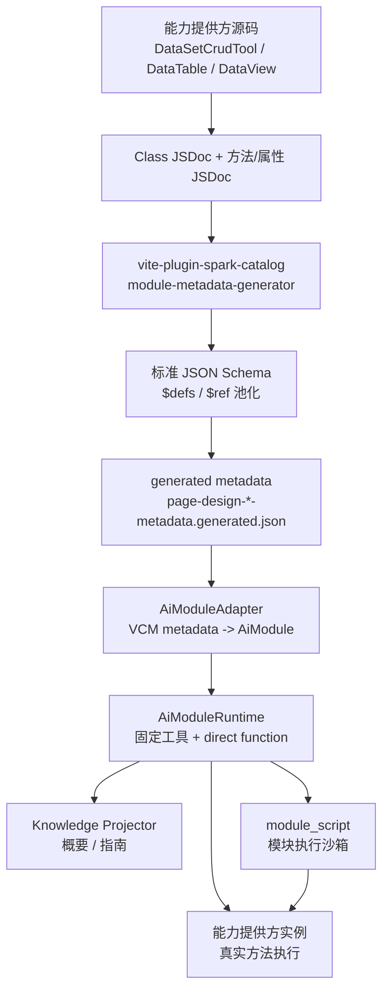

# SPARK 新 AI 体系总览

> 目标：让 LLM 像人工开发者一样先理解能力，再按真实业务 API 编程；元数据来自能力提供方源码，而不是 page-design 硬编码。

## 一句话定位

新 AI 体系由三条链路组成：

1. **元数据链路**：领域 class 的 JSDoc + TypeScript 类型 → VCM 思路提取 → 标准 JSON Schema → generated metadata。
2. **知识链路**：metadata → `module_query` 概要 → `module_*_guide` 细节 → LLM 分层理解能力。
3. **执行链路**：OpenAI function calling 处理单步动作，`module_script` 处理组合编程；pageDesign 写模型以 `module_script` 为主通道。

核心口径：

- `spark-ai` 不持有业务 live state。
- `this` 是模块本身；pageDesign 脚本里可以写 `const page = await this.openPageDesign({ pageId })`，再通过 `page.editDataSet(...)` / `page.editNodeTree(...)` 改模型。
- 子模块来自返回值和属性定义的元数据，不额外合成 `children`、父模块、实例 id、`_handles` 或 `schemaPath`。
- 复杂类型必须池化、去重、`$ref` 化，避免递归展开死循环。

## 总体结构



## 1. 元数据链路

元数据提取由 `packages/vite-plugin-spark-catalog/src/module-metadata-generator.ts` 负责。

输入是能力提供方 class，例如：

- `packages/spark-data/src/dataset-crud-tool.ts`
- `packages/spark-data/src/data-table.ts`
- `packages/spark-data/src/data-view.ts`

输出是：

- `src/services/page-design/page-design-ability-metadata.generated.json`
- `src/services/page-design/page-design-module-metadata.generated.json`

提取原则：

- 只按 class 提取能力边界。
- class 级 `@moduleKind` / `@moduleName` 定义 API 对象身份。
- public 方法是 action；public 属性/getter 是 attribute。
- `@internal` 不进入元数据。
- `@moduleAction` 不再作为必要条件。
- 返回值中的已标注 class 按 `resultApis` 暴露为后续可操作 API。
- `resultPath: []` 表示返回值本身就是子模块。

诊断命令：

```powershell
pnpm exec tsx --no-cache packages/vite-plugin-spark-catalog/src/module-metadata-cli.ts --diagnose-only --trace --extract-results
```

生成命令：

```powershell
pnpm exec tsx --no-cache packages/vite-plugin-spark-catalog/src/module-metadata-cli.ts --extract-results
```

## 2. Schema 链路

VCM 原始 schema 不是最终契约。新体系会把它转换为标准 JSON Schema 子集：

- `type`
- `properties`
- `required`
- `items`
- `enum`
- `additionalProperties`
- `$defs`
- `$ref`

公共池化逻辑在：

- `packages/vite-plugin-spark-catalog/src/json-schema-pool.ts`
- `packages/vite-plugin-spark-catalog/src/ts-type-to-json-schema.ts`

为什么必须池化：

- `DataSet -> DataTable -> DataView -> DataSet` 这类类型关系天然可能递归。
- 不池化会导致 schema 展开爆炸或死循环。
- `$ref` 让复杂参数可以分层查，而不是一次塞给 LLM。

## 3. LLM 知识体系

LLM 知识体系不是“把所有 metadata 一次塞进 prompt”。它是一套按人类编程过程组织的分层知识协议：

```text
入口提示 -> 目录概要 -> 模块指南 -> 函数/属性细节 -> 临时记忆 -> 复杂 schema/ref -> 执行/脚本 -> 错误恢复
```

核心目标：

- 让 LLM 先查目录，再读契约，最后执行。
- 让大而复杂的元数据按需展开，而不是淹没上下文。
- 让 LLM 面对错误时能回到知识层自我修复。
- 让 page-design 能从能力提供方元数据获得知识，而不是维护硬编码知识表。

### 3.1 知识分层

新体系把 LLM 可见知识分成四层：

| 层级 | 目标 | 代表工具 | 内容 |
| --- | --- | --- | --- |
| Prompt Snapshot | 初始导航 | system prompt | 固定工具路线、root kind 索引、禁止猜测规则 |
| Directory | 选择真实对象 | `module_query` | kind/function/attribute 名称、摘要、计数、可继续查询的入口 |
| Overview | 理解模块用途 | `module_guide` | 模块用途、属性目录、函数目录、payload、下一步路线 |
| Detail | 构造调用 | `module_function_guide` / `module_attribute_guide` | schema、规则、失败模式、脚本模式、结果 API |
| Scratchpad | 暂存当前任务选择 | `module_memory` / `this.memory` | 选中的 kind/function、guide 摘要、草稿 args、诊断结论 |

知识层级的约束：

- Prompt Snapshot 只负责“怎么查”，不负责承载完整业务知识。
- Directory 只负责“有什么”，不负责给完整参数结构。
- Overview 只负责“这个模块怎么用”，不负责展开复杂参数。
- Detail 才能用于构造 `args`、读写属性或写脚本。
- Scratchpad 只能暂存当前任务的推理产物，不是业务状态，也不是长期记忆。

### 3.2 知识来源

LLM 知识只来自三类真源：

1. **能力提供方源码**  
   class、方法、属性、JSDoc summary、少量结构化 tag。

2. **TypeScript 类型**  
   参数类型、返回类型、属性类型，经过 JSON Schema 转换与 `$ref` 池化。

3. **运行时注册表**  
   `AiModuleRuntime` 中已经注册的 `AiModule`、payload provider 和 direct function tools。

不允许作为知识真源：

- page-design hardcode 能力表。
- LLM 自己猜出来的 functionName / attrName。
- 运行时合成的 `_handles`。
- 非元数据路径，例如 `schemaPath` 或 page-design path。

### 3.3 查询协议

LLM 的基本查询顺序：

```text
module_query({ keyword, includeFunctions })
-> module_guide({ kind })
-> module_function_guide({ kind, functionName })
-> module_script 或 direct function（pageDesign 写模型优先 module_script）
```

属性读写顺序：

```text
module_query({ kind })
-> module_guide({ kind })
-> module_attribute_guide({ kind, attrName })
-> module_attr({ op, path, attrName, value })
```

脚本编程顺序：

```text
module_query 查能力
-> module_function_guide 查方法契约和 resultApis
-> module_memory 暂存已确认的 kind/function/草稿参数
-> 必要时继续查返回 API 的 kind/function
-> module_script 编写原生 JS 方法链
```

pageDesign 写模型的固定顺序：

```text
readPlanningProjection 确认 pageId / effectiveDescription
-> module_function_guide 确认 openPageDesign / editDataSet / editNodeTree / addNode 契约
-> module_script 生成并执行原生 JS
-> 返回 ruleJson / pageDataJson / script / style
-> runner 读取四文件 projection，可选 saveDirtyPageFiles
```

失败恢复顺序：

```text
FUNCTION_NOT_DECLARED / ATTRIBUTE_NOT_DECLARED
-> 回到 module_query / module_guide 重新选择真实名称

SCHEMA_VALIDATION_FAILED
-> 回到 module_function_guide / module_attribute_guide 重新读取 schema

SCRIPT_EXECUTION_FAILED
-> 按脚本行号定位
-> 对照 guide 修正方法名、参数或链式调用
```

### 3.4 临时记忆体

LLM 需要一个临时记忆体来模拟人工编程时的草稿纸。

它用于保存：

- 已确认的 `kind` / `functionName` / `attrName`。
- 已读过的 guide 摘要。
- 正在构造的复杂 `args` 草稿。
- 脚本出错后的行号、错误码和修复假设。
- 多步任务中的阶段性选择，例如“当前目标表是 orders”。

它不能保存：

- 业务 live state。
- 需要持久化的用户事实。
- 页面配置最终结果。
- 大型 generated metadata 全文。

使用方式：

```text
module_memory({ op: "set", key: "selectedFunction", value: "getTable" })
module_memory({ op: "get", key: "selectedFunction" })
module_memory({ op: "list" })
module_memory({ op: "clear" })
```

脚本里也可以用：

```js
this.memory.set("draftArgs", { tableName: "orders" })
const draftArgs = this.memory.get("draftArgs")
return await this.getTable(draftArgs).getView({ viewId: "default" })
```

记忆体作用域：

- 按当前 module host scope 隔离。
- runtime-local，进程或 runtime 重建后可丢失。
- 不进入 generated metadata。
- 不替代 session history；session history 是对话记录，临时记忆体是当前任务 scratchpad。

### 3.5 函数知识

函数不是一个名字，而是一份完整契约。

`module_function_guide` 必须提供：

- `paramsSchema`：构造 `args` 的唯一依据。
- `requiredParamNames`：必须填写的参数。
- `resultSchema`：普通返回值结构。
- `resultApis`：返回值中继续可操作的 API 对象。
- `scriptPattern`：脚本里如何调用。
- `programmingFlow`：推荐的编程步骤。
- `usageRules`：使用限制。
- `failureModes` / `recoveryHints`：失败后的修复路线。

LLM 在调用函数前必须确认：

- functionName 来自目录或指南。
- args 完全来自 schema。
- 复杂参数已经按 `$ref` / resultApis / 属性指南继续查过。
- 写操作满足 usageRules 和 requiredBeforeCall。

### 3.6 属性知识

属性不是旧意义的“子模块挂载点”，而是能力提供方声明的字段契约。

`module_attribute_guide` 必须回答：

- 属性是否 readable / writable。
- 属性 schema 是什么。
- 属性如何读写。
- 示例值是什么。

复杂属性的处理口径：

- 先读属性指南，不直接猜字段。
- schema 中的对象字段按 JSON Schema 理解。
- 如果属性 schema 引用了 `$defs`，LLM 应继续按引用结构理解。
- 属性本身如果返回 API-bearing 对象，才进入子模块链式语义。

### 3.7 复杂 Schema 知识

复杂 schema 的知识必须“分次查、分层读”。

对 LLM 的要求：

- 看到 `$ref` 时，不把 `$ref` 当普通字符串参数。
- 看到 `required` 时，必须补齐必填字段。
- 看到 `additionalProperties: false` 时，不添加 schema 外字段。
- 看到 enum 时，只能选枚举值。
- 遇到对象数组时，先理解 item schema，再构造数组元素。

对生成器的要求：

- 命名复杂类型进入 `$defs`。
- 重复类型复用 `$ref`。
- 递归类型必须池化，不能无限展开。
- 空 schema 节点必须进入 diagnostics。

### 3.8 结果 API 知识

`resultApis` 是 LLM 编程能力的关键。

它表示“函数返回值里哪些位置继续是 API 对象”：

```json
{
  "resultPath": [],
  "kind": "data-table",
  "actions": [{ "name": "getView" }]
}
```

含义：

- `resultPath: []`：返回值本身就是子模块。
- `resultPath: ["views", "default"]`：返回值的嵌套字段是子模块。
- `kind`：下一段 API 的模块类型。
- `actions`：下一段可调用方法概要。

脚本里的对应形式：

```js
return await this.getTable({ tableName: "orders" })
  .getView({ viewId: "default" })
  .loadFromServer({})
```

注意：

- `resultApis` 只提供元数据与链式代理能力。
- 它不注册运行时子模块。
- 它不创建实例 id。
- 它不生成 handle。

### 3.9 组件与复杂参数知识

组件 type、SparkNode、props schema 与复杂参数结构都必须来自 VCM 生成 metadata 或 JSON Schema。

pageDesign 不再把 Vue 组件目录注册成并列 AiModule。LLM 的主路径是：

```text
module_function_guide({ kind: "project", functionName: "openPageDesign" })
-> module_function_guide({ kind: "config-page", functionName: "editNodeTree" })
-> module_function_guide({ kind: "node-tree", functionName: "addNode" })
-> module_script 生成 page.openPageDesign(...).editNodeTree(...) 原生链式代码
```

复杂参数不走额外目录工具，也不走实例 id path 链。schema 信息必须在函数契约、属性契约、resultApis 或 `$defs` 中暴露，模型按这些结构生成代码。
### 3.10 Prompt Snapshot

Prompt Snapshot 的职责是让 LLM 知道“怎么查知识”，而不是携带完整知识。

它应该包含：

- 固定协议工具路线。
- root kind 索引。
- 目录优先规则。
- 不猜 functionName / attrName 的约束。
- function calling 与 `module_script` 的选择规则。
- `module_memory` 只能作为临时 scratchpad 的约束。

它不应该包含：

- 大型 schema。
- 完整 generated metadata。
- 全量 resultApis 明细。
- page-design hardcode 知识。

### 3.11 知识体系的成功标准

一套知识体系合格的标志：

- LLM 可以从空白意图开始，自己查到真实 kind/function/attr。
- LLM 可以不读源码，只靠 guide 构造合法参数。
- LLM 可以通过 resultApis 写出自然脚本链。
- LLM 出错后能根据错误码和脚本行号回到正确 guide。
- LLM 可以用临时记忆体保存中间选择，但不会把它当业务状态。
- 能力新增或修改时，只改能力提供方注解/类型并重新生成 metadata。

## 4. 执行链路

新体系支持两种入口，但本质进入同一个能力上下文。

### 4.1 Function Calling

OpenAI direct function 工具仍然可用：

```json
{
  "name": "getTable",
  "arguments": {
    "path": "/dataset[page-a]",
    "args": { "tableName": "customer" }
  }
}
```

这适合单个明确动作，不是 pageDesign 结构修改的主入口。

### 4.2 Script Calling

`module_script` 用于组合、条件、循环和多步编程：

```js
return await this.getTable({ tableName: "customer" })
  .getView({ viewId: "default" })
  .loadFromServer({})
```

pageDesign 的目标脚本形态：

```js
const page = await this.openPageDesign({ pageId })

await page.editDataSet(async (ds) => {
  const table = ds.getTable({ tableName: "orders" }) ?? ds.createTable({
    tableName: "orders",
    columns: [{ name: "orderNo", type: "string" }],
  })
  void table
})

await page.editNodeTree(async (tree) => {
  tree.addNode({
    parentComponentId: null,
    node: {
      id: "orders-table",
      type: "r-table",
      props: { dataViewKey: "orders@default", dataMember: "rows" },
    },
  })
})

return {
  ruleJson: page.getFileText("rule.json"),
  pageDataJson: page.getFileText("pagedata.json"),
  script: page.getFileText("script.js"),
  style: page.getFileText("style.css"),
}
```

脚本上下文规则：

- `this` 就是模块上下文自身。
- `ctx === this`。
- 协议 helper 同时挂在 `this.$tools`，避免和业务方法重名。
- callback mutator 可直接传函数：`page.editDataSet(async ds => ...)`，无需把 `{ run }` 作为推荐写法。
- 单对象参数会按 VCM 生成的参数名自动补包，例如 `ds.createTable({ tableName, columns })` 会映射到 `createTable(options)`。
- 脚本错误会暴露脚本行号。
- 返回值必须可 JSON 序列化。
- 中间子模块是链式代理；推荐最终 `await` 整条调用链。

`module_script` 位于：

- `packages/spark-ai/src/modules/runtime/module-script-sandbox.ts`

能力提供方代理位于：

- `packages/spark-ai/src/agent/business/ai-api-script-context.ts`

## 5. 子模块语义

子模块不是运行时合成对象，也不是 page-design path。

它只来自元数据声明：

- 属性返回复杂 API 对象。
- 方法返回复杂 API 对象。
- `resultApis.resultPath` 指明返回值里的 API-bearing 位置。

示例：

```ts
DataSetCrudTool.getTable(...) -> DataTable
DataTable.getView(...) -> DataView
DataView.loadFromServer(...)
```

LLM 脚本里的自然形态是：

```js
return await this.getTable({ tableName: "orders" })
  .getView({ viewId: "default" })
  .loadFromServer({})
```

注意：

- 不生成 `_handles`。
- 不生成 `schemaPath`。
- 不生成实例 id。
- 不把子模块塞进父模块 `children`。
- 只忠实暴露能力提供方声明出来的元数据。

## 6. Agent Host 链路

`packages/spark-ai/src/agent` 负责业务注册、会话、tool loop 和传输。

主要层次：

- `agent/business`：`AiAgentHost`、registration、business session、scope。
- `agent/session`：session store、run trace、diagnostics。
- `agent/tool-loop`：执行 LLM tool calls，映射结果。
- `agent/transport`：APP SSE / 回调契约。

`AiModuleAdapter` 的职责是把生成的 `AiModuleMetadataJson` 和业务 class 实例桥接成 `AiModuleRuntime`。

它不做：

- 不保存 live state。
- 不生成 handle registry。
- 不注册动态子模块。
- 不替代业务 class。

## 7. Page Design 迁移方向

目标是取代 page-design 里的硬编码能力目录，并把最终修改动作收敛为“LLM 生成代码，运行时执行代码”。

旧方向：

```text
page-design hardcode -> LLM 工具/指南
```

新方向：

```text
能力提供方 class -> JSDoc/类型 -> generated metadata -> AiModuleAdapter -> LLM 工具/指南/脚本
```

也就是说，DataSet/DataTable/DataView 的能力真源应该在源码 class 和注解里；LLM 只通过指南查契约，最终用 `module_script` 修改 `ConfigPageNode` 四文件模型。

有问题时：

1. 改能力 class 的 JSDoc 或类型。
2. 重新生成 metadata。
3. 用 diagnostics / generated JSON 诊断。
4. LLM 自动获得新的概要、指南和脚本能力。

## 8. 当前验证面

关键测试：

- `packages/spark-ai/src/tests/module-semantic-runtime.test.ts`
- `packages/spark-ai/src/tests/ai-module-adapter.test.ts`
- `packages/spark-ai/src/tests/host-public-surface.test.ts`
- `packages/spark-ai/src/tests/ai-api-script-context.test.ts`
- `tests/page/page-design-business.test.ts`
- `tests/page/page-design-ai-runner.test.ts`
- `packages/vite-plugin-spark-catalog/src/tests/module-metadata-generator.test.ts`
- `packages/vite-plugin-spark-catalog/src/tests/dataset-crud-tool-reflection.test.ts`
- `packages/vite-plugin-spark-catalog/src/tests/vcm-schema-json-schema.test.ts`

推荐验证：

```powershell
pnpm --filter @spark-appworks/spark-ai run typecheck
pnpm --filter @spark-appworks/vite-plugin-spark-catalog run typecheck
pnpm exec vitest run packages/spark-ai/src/tests/module-semantic-runtime.test.ts packages/spark-ai/src/tests/ai-module-adapter.test.ts packages/spark-ai/src/tests/ai-api-script-context.test.ts tests/page/page-design-business.test.ts tests/page/page-design-ai-runner.test.ts packages/vite-plugin-spark-catalog/src/tests/module-metadata-generator.test.ts
```

## 9. 已落地重点

1. **构造函数提取**：VCM 生成器提取 class constructor 参数，写入 `constructorSignature`，避免和 JS 原型 `constructor` 字段冲突。
2. **错误透传**：`module_script` 链式调用失败时，原始 `AiModuleResult` checks 保持在前，`SCRIPT_EXECUTION_FAILED` 只作为脚本定位补充。
3. **复杂属性分层查询**：`module_attribute_guide` 支持 `property` 查询局部 schema，并返回 `childProperties` 与下一步查询建议。
4. **生成物瘦身策略**：保留诊断版 generated JSON，同时输出 `.runtime.generated.json` 供运行时接入消费。
5. **page-design 直接代码执行**：VCM 从 `ProjectModel.openPageDesign` 进入 `ConfigPageNode`；LLM 生成 `module_script`，运行时执行 `editDataSet` / `editNodeTree` / `setFileText`，最终得到 `rule.json`、`pagedata.json`、`script.js`、`style.css`。
6. **runner 四文件 projection**：`runPageDesignAiSession` 返回当前页面四文件和 dirty 文件列表，自动化场景可打开 `saveDirtyFilesAfterRun` 保存 dirty 四文件。

## 10. 剩余边界

- ConfigPageNode / NodeTree / DataSet 能力按同一套 generated metadata 接入；pageDesign 只保留业务 runner、闸门和保存策略。
- 运行版 generated metadata 后续可继续裁剪长描述和非运行字段，但不能影响诊断版完整性。
- 构造函数 metadata 已可见；是否让 LLM 自动创建实例仍由消费层注册策略决定。
