# Spark AI 生产线哲学：哲学 > 逻辑 > 代码

> 本文是 `spark-ai` 的全新总纲梳理，目标不是再写一份 API 手册，而是把系统为什么这样设计、如何形成逻辑闭环、最后怎样落到当前代码说清楚。
>
> 当前口径以 `packages/spark-ai` 源码为准。`ProjectModel` / `PageNode` 只是页面设计业务的 SSOT 范例，不是 `spark-ai` 核心概念；页面设计代码只作为业务落地样例来校准哲学。

## 1. 一句话定位

`spark-ai` 不是“让 LLM 自由写业务代码”的系统，而是把 LLM 放进一条可注册、可执行、可检测、可复盘的业务生产线。

LLM 的职责是依据用户需求和已注册的业务能力，自动推理下一道工序，选择真实工具调用，并根据工具结果继续调整路线。程序的职责是把事实、规则、函数、组件、检查器和最终验收做成稳定标准件。

治理优先级必须明确：理念 > 逻辑 > AI 生成代码规则 > SSOT || SOLID > 该删则删 || 该合则合 || 该拆则拆 > 兼容。
也就是说，兼容不是最高约束；当旧公共面、旧协议或旧路径阻碍生产线逻辑与代码生成规则收敛时，优先按理念和规则删、合、拆，再评估是否提供明确迁移路径。规则如果误伤理念或逻辑，先修正规则；如果只是伤到旧兼容层，该删则删。

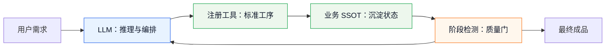

核心判断：

| 问题 | `spark-ai` 的答案 |
| --- | --- |
| LLM 是事实源吗 | 不是。事实来自业务 SSOT、注册知识、工具结果和阶段检测。 |
| LLM 是代码生成器吗 | 不是优先目标。它首先是生产线调度员和工艺推理器。 |
| 工具越少越好吗 | 不是。稳定生产需要足够细的标准件，但每个标准件必须可执行、可校验。 |
| 多轮查询是浪费吗 | 不一定。多轮目录/指南/验证能减少猜测，最终降低错误 token 和返工成本。 |
| 业务层要管每一步吗 | 不需要。业务层抓阶段成果和最终验收，具体路线允许 LLM 推理。 |

核心与范例边界：

| 层级 | 属于 `spark-ai` 核心 | 只是业务范例 |
| --- | --- | --- |
| SSOT | 任何业务自己的单一事实源，例如 DomainModel、Draft、WorkflowState | 页面设计里的 ProjectModel / PageNode |
| 工艺路线 | 目录查询、函数指南、工具调用、阶段检测、最终验收 | 页面设计 100 步 |
| 标准件 | `AiModule`、函数、属性、payload、lifecycle hook | 页面组件、DataView、页面导航配置 |
| 投影物 | 通用工具结果、session transcript、diagnostic events | `rule.json`、`pagedata.json`、`script.js` 等页面配置文件 |

## 2. 哲学层：把 LLM 从“写作者”变成“工艺员”

### 2.1 第一性原则

1. **确定性优先于聪明**
   凡是可以通过程序逻辑抵达的内容，不交给 LLM 猜。函数内部逻辑、组件默认行为、数据规则、格式校验、文件投影，都应该预制成标准件。

2. **SSOT 优先于过程文本**
   业务最终状态必须沉淀到业务自己的单一事实源。这个事实源可以是订单草稿、审批流状态、页面设计里的 ProjectModel / PageNode，也可以是任何业务 Domain Model；它不是 `spark-ai` 内核的一部分。

3. **注册优先于约定俗成**
   LLM 只消费已经注册的模块、函数、属性、payload、组件和阶段检测。没有注册的能力，在生产线上等于不存在。

4. **工具调用优先于自然语言正文**
   只要下一步需要查询、校验、写入、修复或完成任务，LLM 必须走真实 OpenAI tool call。正文不能冒充工具调用。

5. **闭环优先于一次性生成**
   生产不是一次回答，而是：观察 → 推理 → 调用标准件 → 得到结构化结果 → 阶段检测 → 修正 → 验收。

### 2.2 工业生产线映射

| 工业概念 | Spark AI 概念 | 当前代码落点 |
| --- | --- | --- |
| 工件 | 业务实例、业务模型草稿、领域对象 | `AiAgentScope`、业务 service、业务 SSOT |
| 工艺单 | `inputContract.toOrchestration()` 输出的用户任务和系统编排 | `business-task.ts` |
| 标准件 | 业务函数、组件、payload guide、数据操作 | `AiModule.functions`、业务模块 |
| 工位 | 一个 `AiModule` kind 或一个阶段函数 | `AiModuleRuntime.register()` |
| 工具柜 | OpenAI tools 规约 | `ProtocolToolGenerator.getTools()` |
| 调度员 | LLM | `AiAgentToolLoopRunner` 调用的后端模型 |
| 质检员 | `beforeFunctionCall`、`afterFunctionCall`、业务 stage detector | `lifecycle-types.ts` |
| 生产记录 | session history、tool result、diagnostic event | `AiAgentSessionStore`、`diagnostic-events` |
| 交付验收 | `agent_complete({ summary })` + 业务最终检查 | `agent_complete`、业务 final gate |

这个映射的关键是：LLM 不直接“造产品”，而是在生产线里选择工位、调用标准件、读质检反馈。

## 3. 逻辑层：三条闭环

### 3.1 信息闭环

信息闭环解决“LLM 不知道就去查，而不是猜”的问题。

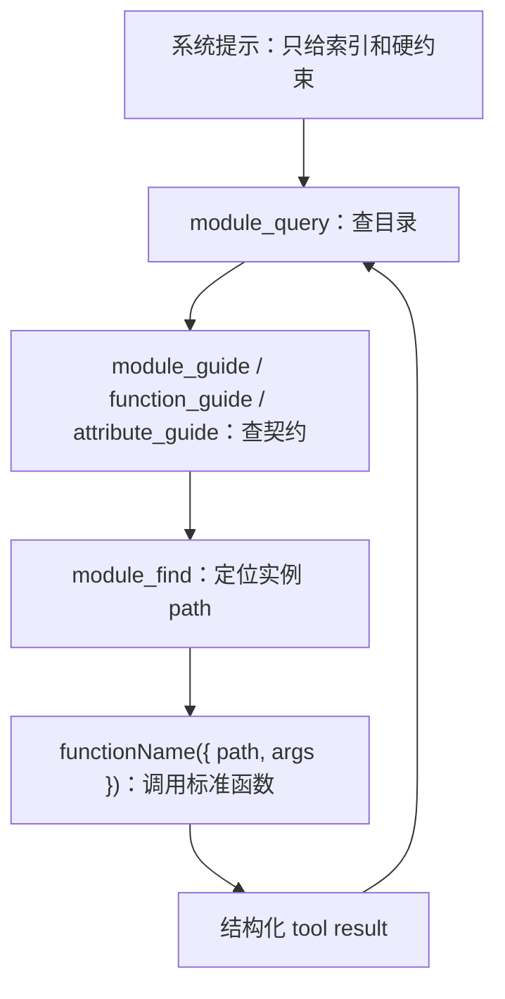

物理可行点：

| 环节 | 可行性来源 |
| --- | --- |
| 目录查询 | `AiModuleKnowledgeProjector.queryModules/queryFunctions()` 从注册表投影。 |
| 契约查询 | `guideFunction/guideAttribute()` 返回 schema、规则、失败恢复。 |
| 实例定位 | `Navigator` 通过 path 和 `find/list` 委托定位实例。 |
| 函数调用 | `FunctionInvoker` 校验 kindPath 后委托 `AiModule.invokeFunction()`。 |
| 结果回灌 | `tool-call-executor` 把 `AiModuleResult` 转成 tool message。 |

### 3.2 执行闭环

执行闭环解决“每一步都能落到真实函数”的问题。

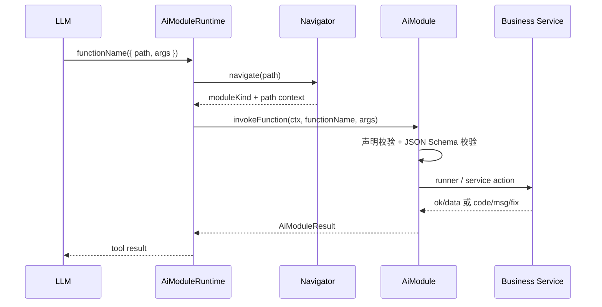

执行闭环的要点：

| 控制点 | 作用 |
| --- | --- |
| `path` | 防止 LLM 把函数用在错误实例上。 |
| `kindPath` 校验 | 防止跨模块误调用。 |
| `paramsSchema` | 防止参数形状靠猜。 |
| `AiModuleResult` | 成功和失败都结构化，便于下一轮恢复。 |
| `failureModes/recoveryHints` | 把失败恢复路线注册成知识，不靠临场发挥。 |

### 3.3 控制闭环

控制闭环解决“业务生产线不会失控”的问题。

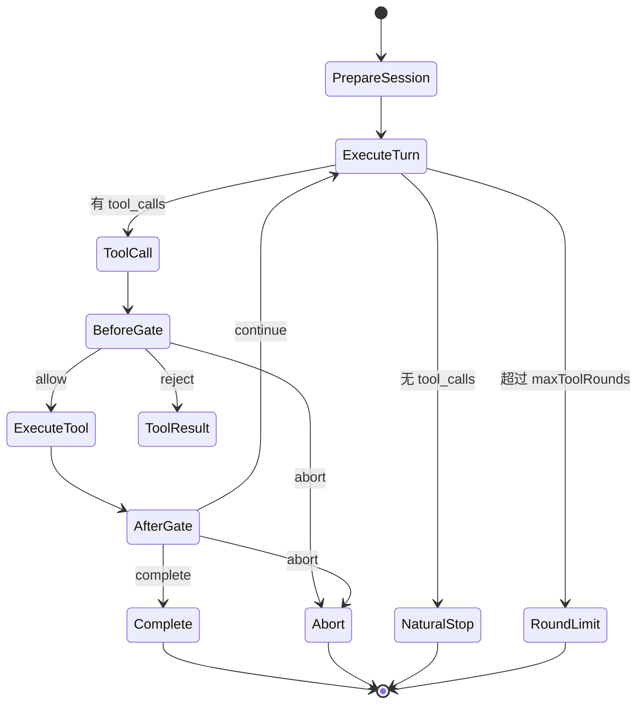

控制闭环的代码支点：

| 支点 | 文件 | 说明 |
| --- | --- | --- |
| 回合上限 | `packages/spark-ai/src/agent/tool-loop/tool-loop-runner.ts` | `maxToolRounds` 是安全阀。 |
| 工具前置裁决 | `packages/spark-ai/src/agent/tool-loop/tool-call-executor.ts` | `beforeFunctionCall` 可 reject/abort。 |
| 工具后阶段判断 | `packages/spark-ai/src/agent/tool-loop/tool-call-executor.ts` | `afterFunctionCall` 返回 continue/complete/abort。 |
| 工具化收尾 | `packages/spark-ai/src/modules/runtime/protocol-tool-router.ts` | `agent_complete` 把完成动作也变成工具调用。 |
| 会话记录 | `packages/spark-ai/src/agent/session/session-types.ts` | 记录消息、函数调用、失败和停止原因。 |

## 4. 注册层：把业务变成标准件

注册层的使命是把“业务能做什么”变成 LLM 可发现、可校验、可调用的工业物料。

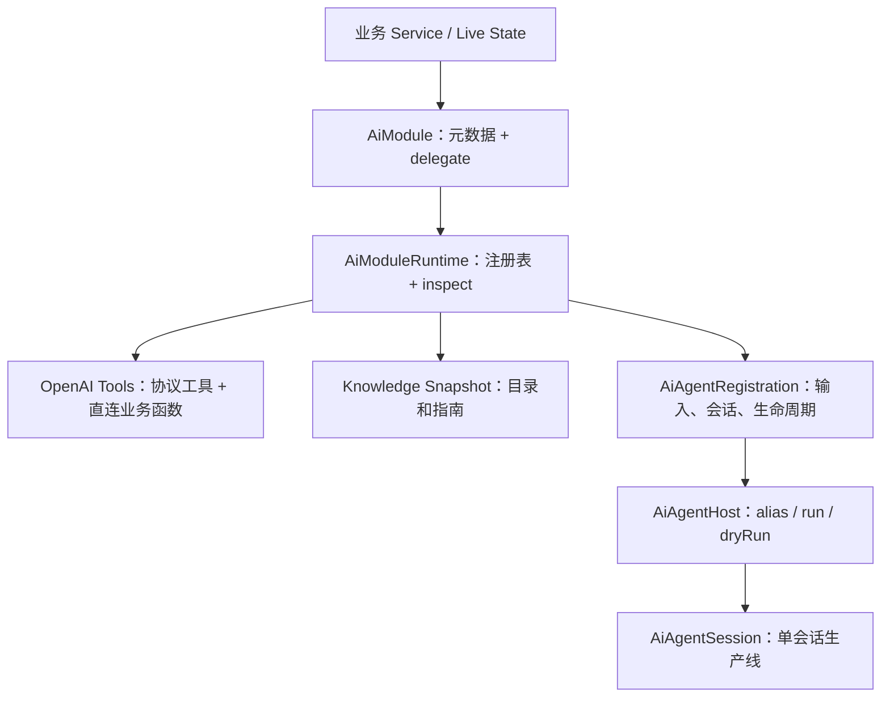

### 4.1 注册什么

| 层 | 注册内容 | 物理可行要求 | 逻辑闭环要求 | 流程控制要求 |
| --- | --- | --- | --- | --- |
| JSON | 参数 schema、输入 schema | schema 根必须是 object | 输入和函数参数都能校验 | 校验失败必须 fail-fast |
| AiModule | kind、函数、属性、子模块、payload | 声明函数必须有 runner；声明属性必须有 accessor | metadata 和实现一致 | usageRules/failureModes 描述调用边界 |
| Runtime | 模块树 | root kind 存在，父子关系一致 | `inspect()` 能证明注册图完整 | 启动期错误阻断运行 |
| Agent Registration | inputContract、sessionStore、生命周期 | 输入能转 scope 和 orchestration | scope 与业务实例一致 | before/after/end/release 控制生产线 |
| Host | alias 到 registration | alias/moduleId 不冲突 | `dryRun()` 可检查入口 | `maxToolRounds` 限制回合 |

### 4.2 OpenAI 标准函数协议

当前源码已经从旧的四元素：

```text
module_call({ path, functionName, args })
```

推进为 OpenAI 标准直连业务函数：

```text
functionName({ path, args })
```

这意味着：

| 项 | 新协议 |
| --- | --- |
| OpenAI `function.name` | 直接等于业务 `functionName` |
| OpenAI `function.arguments` | 只包含 `{ path, args }` |
| `functionName` 是否还放在参数里 | 不放。函数名已经在 OpenAI tool name 上。 |
| `module_call` | 保留为兼容旧协议，不是优先路线。 |
| 直连函数生成条件 | 函数名符合 OpenAI 命名规则，且在当前 runtime 内唯一。 |

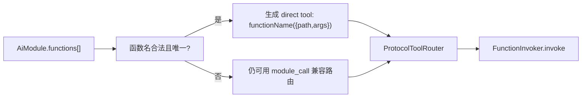

这件事的哲学意义是：语义上仍然是“调用某个模块路径上的函数”，但对外协议更贴近 OpenAI 原生 tool calling，减少一个冗余参数，也减少 LLM 在参数中重复拼 functionName 的错误空间。

### 4.3 注册不是模块绝对隔离

模块不是为了把流程切碎到彼此隔绝，而是为了在推理过程中沉淀数据。

例如某个复杂业务生产线会出现跨阶段沉淀；页面设计只是其中一个例子：

| 推理阶段 | 沉淀到哪里 | 后续如何消费 |
| --- | --- | --- |
| 数据策划 | 表、字段、关系 | 后续 UI 设计决定哪些关系需要 DataView |
| UI 设计 | 布局、区域、组件意图 | 后续输入界面决定 DataView 依赖 |
| 输入界面 | 表单字段、联动、校验 | 后续 rule/script 投影 |
| 交互设计 | 事件、状态、导航 | 后续写入业务 SSOT 的 action / navigation 片段 |
| 最终投影 | 业务 SSOT 到目标产物 | 验证运行时、绑定、导航完整性 |

所以流程不是“数据模块完了才允许 UI 模块开始”，而是每次推理都把阶段性事实沉淀进 SSOT，再由后续工序读取。

## 5. 运行时层：单会话工具生产线

运行时层的核心是单个会话内的工具闭环。

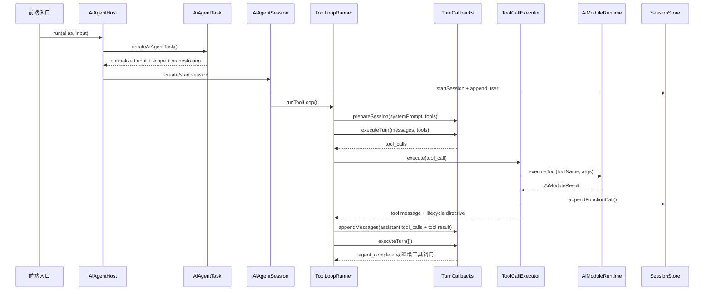

### 5.1 工具生产线硬约束

`AiAgentToolLoopRunner` 当前会把以下硬约束注入系统提示：

```text
只要下一步需要查询、校验、写入、修复或完成任务，就必须发起真实 OpenAI tool_call。
工具回合的 assistant.content 必须为空。
每轮最多调用一个 tool_call。
任务完成时调用 agent_complete({ summary })。
```

这些约束服务三个目标：

| 目标 | 解释 |
| --- | --- |
| 降低 token | 不让 LLM 在工具回合输出计划、解释、伪 JSON。 |
| 降低猜测 | 每次只做一个真实工具动作，读结果再判断。 |
| 降低失控 | 完成也必须工具化，生命周期可以被代码捕获。 |

### 5.2 前端 Agent 与后端边界

`spark-ai` 本身不直接请求模型，也不实现 Java 后端。它只要求 APP 层注入 `turnCallbacks`：

| 回调 | 职责 |
| --- | --- |
| `prepareSession` | 把 systemPrompt 和 tools 同步给后端会话。 |
| `executeTurn` | 发起一次 LLM turn，并收集 OpenAI tool calls。 |
| `appendMessages` | 把 assistant tool_calls 和 tool result 追加回后端会话。 |

因此，前端 Agent 的改造重点应该放在：

1. 注册更清晰的业务能力。
2. 让工具调用更标准。
3. 让阶段检测更强。
4. 让 SSE / append / retry 只作为传输层稳定性问题处理。

不要把业务生产线稳定性的责任转移到后端临时逻辑里。

## 6. 阶段检测：抓大放小

阶段检测不是让业务层把每一步写死，而是在关键阶段检查“工件是否达到进入下一道工序的条件”。

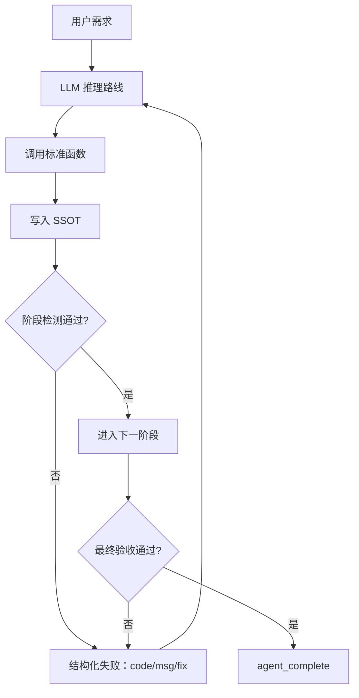

### 6.1 阶段检测应该检查什么

| 阶段 | 检查重点 | 不该检查什么 |
| --- | --- | --- |
| 输入理解 | 业务目标、范围、主实例 ID 是否明确 | 不规定 LLM 的自然语言计划措辞 |
| 数据策划 | 表、字段、关系是否满足业务查询和录入 | 不要求一次性列完所有 UI 细节 |
| UI 规划 | 关键视图、主次信息、组件职责是否成立 | 不把布局像素级细节写死 |
| 输入界面 | DataView 依赖、字段联动、校验关系是否完整 | 不让 LLM 手写可推导的内部逻辑 |
| 交互/导航 | 页面入口、导航属性、事件流是否闭合 | 不依赖旧 4 文件顺序作为真相 |
| 投影与验证 | 业务 SSOT 能否生成目标产物并通过运行检查 | 不把聊天总结当交付物 |

### 6.2 检测函数的形态

阶段检测应该返回机器可读结果，而不是只给一段评价。

```ts
type StageCheckResult = Readonly<{
  ok: boolean
  stage: string
  passed: readonly string[]
  failed: ReadonlyArray<{
    code: string
    message: string
    fix: string
  }>
  nextAllowedFunctions: readonly string[]
}>
```

这个形态可以直接变成 `AiModuleResult`：

| 检测结果 | 生产线行为 |
| --- | --- |
| `ok: true` | 允许进入下一阶段。 |
| `ok: false` | 作为 tool result 回灌给 LLM，要求按 `fix` 修复。 |
| `nextAllowedFunctions` | 约束后续可用标准件，减少游离路线。 |

## 7. 业务 SSOT 与页面设计范例

`spark-ai` 核心只要求“有业务 SSOT”。至于这个 SSOT 叫 ProjectModel、PageNode、OrderDraft、WorkflowState 还是别的名字，属于业务注册层自行定义。

页面设计业务可以采用这样的口径：

```text
ProjectModel 策划 -> PageNode 交付 -> 100 步工艺路线 -> 文件/配置投影
```

不是：

```text
100 步文本 -> 旧 4 文件 -> 反推 PageNode -> 反推 ProjectModel
```

### 7.1 ProjectModel 是项目级 SSOT，PageNode 是页面级 SSOT

ProjectModel / PageNode 不属于 `spark-ai` 内核。它们是页面设计业务为了承接项目策划和页面交付所定义的业务模型，而不是只承接旧的 4 文件。

项目级事实先进入 ProjectModel：

| ProjectModel 片段 | 作用 |
| --- | --- |
| `nodes` | 项目内模块、页面、子页面结构；后端 API 仍叫 navigation，但领域语义是项目节点树。 |
| `planning` | 项目策划、模块策划、页面策划。 |
| config page cache | 已打开配置页节点缓存，不是项目结构 SSOT。 |

项目节点 `description` 是功能描述和用户需求。所有父级与本级 `description` 会形成当前页面的需求约束链。

页面级事实再进入 PageNode：

| PageNode 片段 | 作用 |
| --- | --- |
| `navigation` | 页面入口、路径、上下文、权限入口等页面挂载配置。 |
| `rule` | 页面节点树、布局区域、列表/表单/详情/统计结构。 |
| `dataSet` | 表、字段、DataView、关系、请求、计算列和聚合。 |
| `script` | 配置无法表达的少量行为。 |
| `style` | 页面级样式。 |

旧的 `rule.json`、`pagedata.json`、`script.js` 和 `style.css` 应当是 PageNode 的投影物，而不是决策源。

### 7.2 100 步的正确位置

“页面设计 100 步”更像工艺卡，而不是事实库。

| 角色 | 定位 |
| --- | --- |
| ProjectModel | 项目策划和平铺项目节点集合。 |
| PageNode | 单页面设计业务的产品图纸和当前工件状态。 |
| 100 步 | 工序路线、阶段目标、检查点。 |
| 文件编辑 | 把 PageNode 投影到运行时配置。 |
| E2E 评估 | 验证投影后的成品是否达到目标。 |

100 步可以很细，但不应该“造”。每一步必须满足：

1. 能对应到 ProjectModel 或 PageNode 的某个片段。
2. 能对应到一个或多个已注册函数。
3. 能有阶段检测或最终检测。
4. 失败后能给出明确修复函数和修复方向。

### 7.3 学生成绩管理页的单会话生产线示例

先降低难度，只做“学生成绩管理”单页时，可以形成这样的阶段：

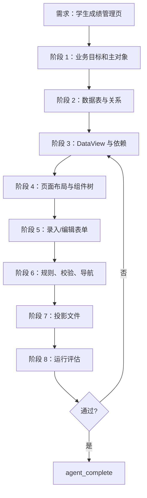

关键闭环：

| 阶段 | 必须沉淀的事实 | 检测点 |
| --- | --- | --- |
| 业务目标 | 学生、成绩、课程、班级、学期等对象 | 主对象和管理动作明确。 |
| 数据表 | `student`、`course`、`score`、关系字段 | 成绩能关联学生和课程。 |
| DataView | 列表、筛选、当前行、统计视图 | UI 每个数据消费点都有 DataView。 |
| 页面布局 | 表格、筛选区、编辑区、统计区 | 组件职责清晰且不重叠。 |
| 输入界面 | 成绩录入、批量编辑、字段校验 | DataView 依赖和校验闭合。 |
| 模块树/导航规则 | 项目模块位置、页面入口、返回、编辑状态 | 用户工作流能闭合。 |
| 投影验证 | 配置可渲染、绑定可解析 | E2E 评估通过。 |

这体现用户前面强调的点：数据策划阶段只需要到“表 + 关系”，DataView 的依赖关系要等 UI 和输入界面推理出来后再沉淀。

## 8. 当前代码落点

### 8.1 `spark-ai` 层级

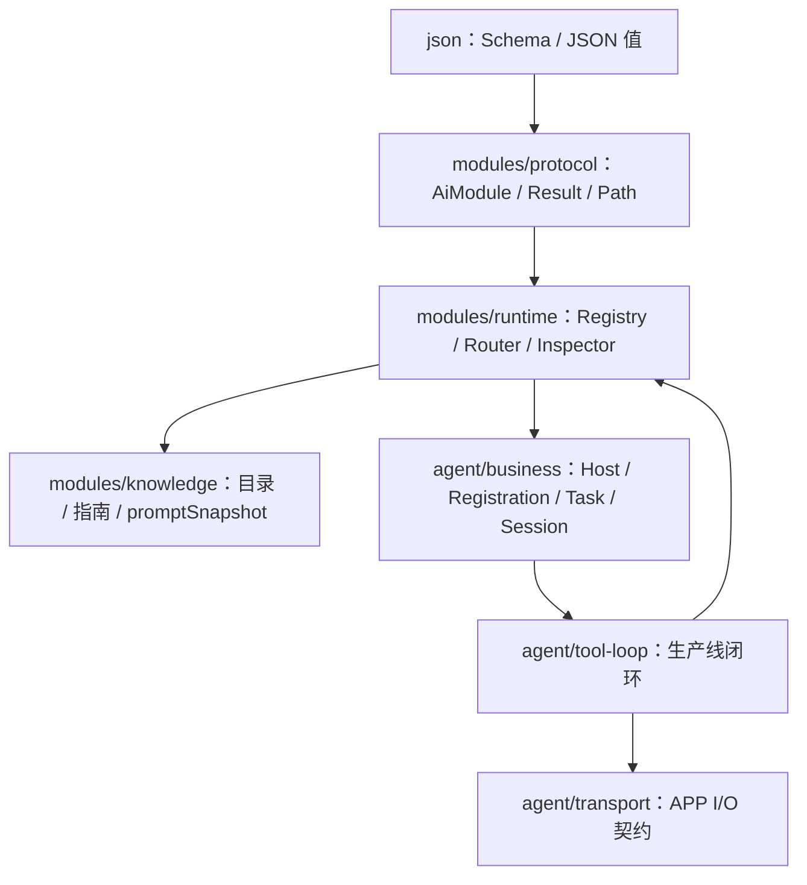

### 8.2 关键源码映射

| 代码 | 职责 |
| --- | --- |
| `packages/spark-ai/src/modules/protocol/ai-module.ts` | 标准件的元数据、delegate、schema 校验、函数执行。 |
| `packages/spark-ai/src/modules/runtime/ai-module-runtime.ts` | 模块运行时组合根，暴露 `getTools()` 和 `executeTool()`。 |
| `packages/spark-ai/src/modules/internal/protocol-tool-generator.ts` | 生成协议工具和直连业务函数工具。 |
| `packages/spark-ai/src/modules/runtime/protocol-tool-router.ts` | 路由 `module_*`、`human_question`、`agent_complete` 和业务函数名。 |
| `packages/spark-ai/src/modules/knowledge/ai-module-knowledge.ts` | 将注册表投影为目录、指南和 prompt 快照。 |
| `packages/spark-ai/src/modules/runtime/runtime-inspector.ts` | 启动期注册图完整性检查。 |
| `packages/spark-ai/src/agent/business/business-task.ts` | 输入契约、scope、orchestration。 |
| `packages/spark-ai/src/agent/business/registration-types.ts` | 业务注册合约和生命周期钩子。 |
| `packages/spark-ai/src/agent/business/ai-host.ts` | Host alias、register、ensure、dryRun、run。 |
| `packages/spark-ai/src/agent/tool-loop/tool-loop-runner.ts` | 单会话工具循环、tool-only prompt、回合控制。 |
| `packages/spark-ai/src/agent/tool-loop/tool-call-executor.ts` | 单次工具执行、before/after gate、结果回灌。 |

### 8.3 当前工具事实

当前协议工具包括：

```text
module_query
module_guide
module_attribute_guide
module_function_guide
module_find
module_attr
module_call
human_question
agent_complete
```

此外，`ProtocolToolGenerator` 会从已注册 `AiModule.functions` 里生成直连业务函数工具：

```text
<functionName>({ path, args })
```

路由策略：

| tool name | 路由 |
| --- | --- |
| `module_query` 等协议工具 | `ProtocolToolRouter` 内部分支。 |
| `agent_complete` | 返回 lifecycle complete。 |
| 唯一且合法的业务函数名 | `routeDirectModuleFunction()`。 |
| `module_call` | 兼容旧协议。 |
| 未注册工具 | `UNKNOWN_TOOL` 结构化失败。 |

## 9. 每层验收清单

### 9.1 哲学验收

| 检查项 | 通过标准 |
| --- | --- |
| LLM 是否只做推理编排 | 函数内部逻辑、校验、投影不靠 LLM 自由生成。 |
| 是否有 SSOT | 阶段结果沉淀到业务自己的 Domain Model，而不是聊天文本。 |
| 是否有标准件 | 每个生产动作都能映射到注册函数或组件。 |
| 是否允许多路径到达终点 | 业务只管阶段门和最终验收，不写死所有中间路线。 |

### 9.2 注册验收

| 检查项 | 通过标准 |
| --- | --- |
| runtime inspect | `runtime.inspect().ok === true`。 |
| function schema | 所有函数 `paramsSchema.type === "object"`。 |
| function metadata | 高风险函数有 usageRules 和 failureModes。 |
| direct tool | 业务函数名合法且尽量唯一。 |
| inputContract | 输入能 normalize、校验、转 scope、生成非空 orchestration。 |
| dryRun | `host.dryRun(alias, input)` 能输出 tools、scope、inspectReport。 |

### 9.3 运行验收

| 检查项 | 通过标准 |
| --- | --- |
| tool-only | 工具回合 assistant.content 为空，不输出伪工具 JSON。 |
| append | 每轮 assistant tool_calls 和 tool result 都追加到后端会话。 |
| stage gate | afterFunctionCall 能根据阶段结果 continue/complete/abort。 |
| final gate | 完成时调用 `agent_complete`，最终消息由 lifecycle 接管。 |
| transcript | sessionStore 可复盘每次函数调用和失败原因。 |

### 9.4 页面设计范例验收

| 检查项 | 通过标准 |
| --- | --- |
| ProjectModel SSOT | 作为页面设计业务范例，项目策划和平铺项目节点集合完整沉淀在 ProjectModel。 |
| PageNode SSOT | 单页面事实完整沉淀在 PageNode。 |
| DataView 时机 | DataView 在 UI/输入依赖明确后沉淀，不在数据策划阶段硬造。 |
| 项目节点树 | navigation API 在领域语义上是项目节点树，不是单纯菜单。 |
| 页面导航属性 | navigation 是 PageNode 一等片段，不是后期补丁。 |
| 文件投影 | 文件只从 PageNode 投影，不能反过来作为主决策源。 |
| E2E 评估 | 渲染、绑定、交互、视觉布局和业务目标均通过。 |

## 10. 推荐落地路线

短期先把生产线跑稳：

1. 新业务只做单会话、单目标，例如“学生成绩管理页”。
2. 优先注册业务 SSOT 读写、阶段检测和最终验收函数；页面设计业务中项目级 SSOT 是 ProjectModel，页面级 SSOT 是 PageNode。
3. 强制工具调用优先，完成必须 `agent_complete`。
4. 每个阶段函数返回结构化 `ok/code/msg/fix`。
5. 用 `dryRun + transcript + E2E` 复盘每次失败。

中期增强可控性：

1. 为每个业务建立 stage detector。
2. 把 100 步变成可机器检查的工艺卡。
3. 为直连业务函数建立命名规范，避免函数名冲突退回 `module_call`。
4. 持续防回归：旧文档不得再回到旧协议优先的过期口径。

长期目标是稳定生产线：

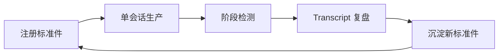

稳定不是让 LLM 少思考，而是让它在正确轨道上充分推理：用户给目标，业务给标准件，运行时给闭环，检测器给质量门，最终交付由 SSOT 和评估证明。
