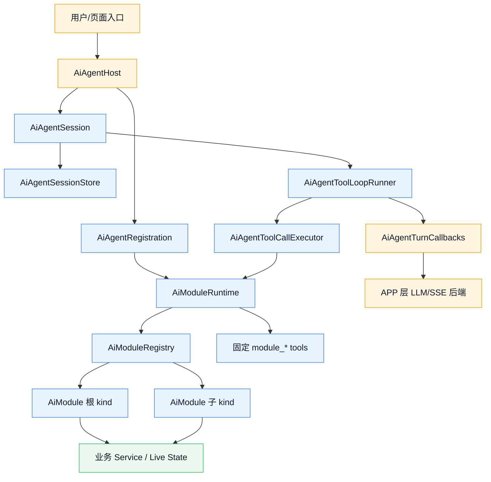
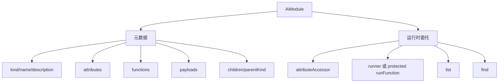
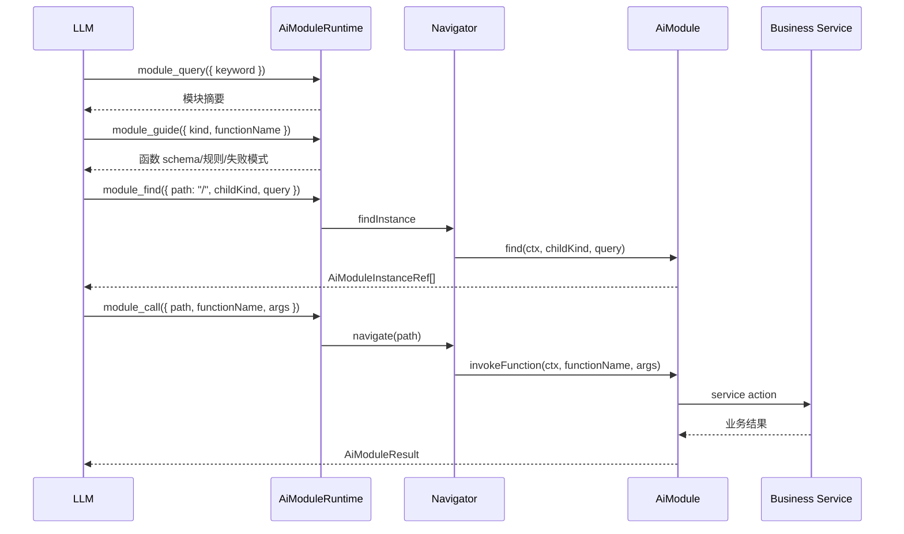
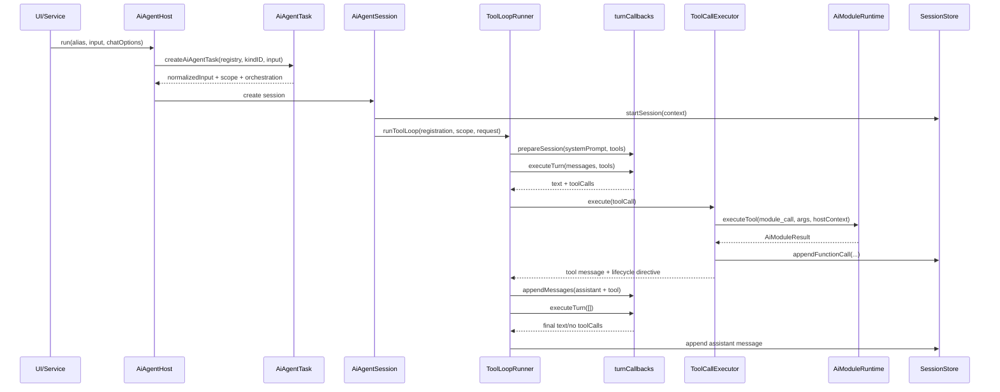
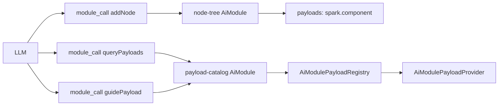

# SPARK AI 注册与使用指南

> 适用范围：`packages/spark-ai` 当前实现。本文重点说明架构原理、注册什么、为什么注册、如何注册，以及注册完成后如何使用。

## 1. 一句话模型

`@spark-view/spark-ai` 把业务能力拆成两级注册：

1. **AiModule 注册**：把一个业务领域的能力声明成 LLM 可发现、可校验、可调用的模块树。
2. **AiAgent 注册**：把一棵模块树包装成一个可运行的业务助手，并接入会话历史、生命周期和 APP 层 AI turn I/O。

业务函数不会变成动态 tool 名。LLM 永远只看到六个固定工具：

```text
module_query, module_guide, module_find, module_attr, module_call, human_question
```

真正的业务函数通过 `module_call({ path, functionName, args })` 执行。

## 2. 总体架构图



关键边界：

| 层 | 负责 | 不负责 |
| --- | --- | --- |
| `json` | JSON 值、JSON Schema、参数校验 | 业务语义、会话 |
| `modules` | 模块元数据、路径导航、固定工具路由、函数/属性调用 | 业务 live state、LLM 网络请求 |
| `agent` | Host 注册、任务输入契约、会话历史、工具循环、生命周期 | 具体业务函数实现、APP 网络请求 |
| APP/业务包 | 注册业务模块、实现 service、实现 `turnCallbacks` | 改写 `spark-ai` 内部协议 |

## 3. 公开入口

新代码优先从子路径导入：

```ts
import {
  AiModule,
  AiModuleResult,
  AiModuleRuntime,
} from '@spark-view/spark-ai/modules'

import {
  createAiAgentHost,
  createAiAgentRegistration,
  DefaultAiAgentSessionStore,
} from '@spark-view/spark-ai/agent'

import {
  noParamsSchema,
  paramsSchema,
  stringSchema,
} from '@spark-view/spark-ai/json'
```

根入口 `@spark-view/spark-ai` 只是小门面。源码公开面见：

- `packages/spark-ai/src/index.ts`
- `packages/spark-ai/src/modules/index.ts`
- `packages/spark-ai/src/agent/index.ts`

## 4. 两级注册关系

```mermaid
flowchart LR
  M1[1. new AiModule(...)] --> M2[2. runtime.register(module)]
  M2 --> A1[3. createAiAgentRegistration({ runtime, inputContract, sessionStore })]
  A1 --> H1[4. host.register(alias, registration)]
  H1 --> R1[5. host.run(alias, input)]

  R1 --> T1[创建 AiAgentTask]
  T1 --> T2[启动 AiAgentSession]
  T2 --> T3[调用 LLM]
  T3 --> T4[执行 module_* tool]
  T4 --> M2
```

| 注册点 | API | 注册 key | 注册内容 | 消费方 |
| --- | --- | --- | --- | --- |
| 模块类型注册 | `AiModuleRuntime.register(module)` | `module.kind` | `AiModule` 实例 | `module_query/module_find/module_call` |
| Agent 业务注册 | `createAiAgentRegistration(...)` | `kindID/moduleId` | runtime、输入契约、sessionStore、生命周期 | `AiAgentHost` |
| Host 运行别名注册 | `host.register(alias, registration)` 或 `host.ensure(alias, command)` | `alias` | 一个业务助手入口 | 页面/服务调用方 |

## 5. AiModule 注册详解

`AiModule` 是 modules 层中心抽象。它由两部分组成：

- **元数据**：告诉 LLM 有什么。
- **委托**：告诉运行时如何执行。



### 5.1 注册内容清单

| 字段 | 是否 LLM 可见 | 作用 | 什么时候必填 |
| --- | --- | --- | --- |
| `kind` | 是 | 模块类型 ID，全局唯一 | 总是 |
| `name` | 是 | 人类可读名称 | 总是 |
| `description` | 是 | 模块边界和用途说明 | 总是 |
| `parentKind` | 是 | 声明当前 kind 的父 kind | 子模块必填 |
| `attributes` | 是 | 可读写属性声明 | 有属性能力时 |
| `functions` | 是 | 可调用业务函数声明 | 有函数能力时 |
| `payloads` | 是 | 复杂参数外部知识引用 | 函数参数需要查 catalog 时 |
| `children` | 是 | 允许挂载的子 kind | 有子模块时 |
| `attributeAccessor` | 否 | 属性实际读写 | 声明 `attributes` 时必填 |
| `runner` / `runFunction` | 否 | 函数实际执行 | 声明 `functions` 时必填 |
| `list` | 否 | 列出子实例 | 声明 `children` 时必填 |
| `find` | 否 | 查询实例 | 根模块必填；声明 `children` 时也必填 |

构造期会 fail-fast：

- 重复 `kind/function/attribute/payloadRef` 会抛错。
- 根模块没有 `find` 会抛错。
- 声明 `functions` 但没有 runner 或覆写 `runFunction` 会抛错。
- 声明 `attributes` 但没有 `attributeAccessor` 会抛错。
- 声明 `children` 但没有 `list/find` 会抛错。

### 5.2 路径模型

模块实例用路径定位：

```text
/                                      # 根路径
/<kind>[<id>]                          # 根实例
/<rootKind>[<rootId>]/<childKind>[id]  # 子实例
```

示例：

```text
/pageDesign[page-a]
/pageDesign[page-a]/node-tree[page-a]
/manual-leave[leaveDraft:123]/leave-person[E1001]
```

LLM 不应传旧式 `$paths` 或动态工具名。实例身份只来自 `path` 和当前 Host session scope。

### 5.3 固定工具协议

| 工具 | 参数 | 用途 |
| --- | --- | --- |
| `module_query` | `{ kind?, parentKind?, keyword?, includeFunctions? }` | 查已注册模块摘要 |
| `module_guide` | `{ kind, functionName? }` | 查 kind 元数据或函数完整指南 |
| `module_find` | `{ path, childKind?, query? }` | 从根或父路径查实例 |
| `module_attr` | `{ op, path, attrName, value? }` | 读写声明的属性 |
| `module_call` | `{ path, functionName, args }` | 调用声明的业务函数 |
| `human_question` | `{ context, reason, missingFacts?, candidateOptions? }` | 需要用户补事实时生成追问 |

典型执行顺序：



## 6. AiModule 最小示例

下面示例注册一个 `support-ticket` 根模块，暴露：

- 一个只读/可写属性：`status`
- 三个函数：`describeTicket`、`setPriority`、`closeTicket`
- 根实例查询：`module_find({ path: "/", childKind: "support-ticket", query: { id } })`

```ts
import {
  AiModule,
  AiModuleResult,
  type AiModuleFunctionMetadata,
  type AiModuleInstanceRef,
  type AiModulePathContext,
} from '@spark-view/spark-ai/modules'
import {
  noParamsSchema,
  paramsSchema,
  stringSchema,
  type AiJsonValue,
} from '@spark-view/spark-ai/json'

const SUPPORT_TICKET_KIND = 'support-ticket'

class TicketService {
  private readonly tickets = new Map<string, { status: string; priority: string }>()

  describe(ticketId: string) {
    const ticket = this.ensure(ticketId)
    return AiModuleResult.ok({ ticketId, ...ticket })
  }

  setPriority(ticketId: string, priority: string) {
    const ticket = this.ensure(ticketId)
    ticket.priority = priority
    return AiModuleResult.ok({ ticketId, priority })
  }

  close(ticketId: string) {
    const ticket = this.ensure(ticketId)
    ticket.status = 'closed'
    return AiModuleResult.ok({ ticketId, status: ticket.status })
  }

  getStatus(ticketId: string) {
    return this.ensure(ticketId).status
  }

  setStatus(ticketId: string, status: string) {
    this.ensure(ticketId).status = status
    return AiModuleResult.ok<void>()
  }

  private ensure(ticketId: string) {
    const existing = this.tickets.get(ticketId)
    if (existing !== undefined) return existing
    const created = { status: 'open', priority: 'normal' }
    this.tickets.set(ticketId, created)
    return created
  }
}

const TICKET_FUNCTIONS: readonly AiModuleFunctionMetadata[] = [
  {
    name: 'describeTicket',
    description: '读取当前工单状态和优先级。',
    paramsSchema: noParamsSchema(),
    usageRules: ['当用户询问当前工单状态或下一步时调用。'],
    failureModes: [],
  },
  {
    name: 'setPriority',
    description: '设置当前工单优先级。',
    paramsSchema: paramsSchema({
      priority: stringSchema('优先级，例如 low、normal、high。', { minLength: 1 }),
    }, ['priority']),
    usageRules: ['只在用户明确要求调整优先级时调用。'],
    failureModes: [],
  },
  {
    name: 'closeTicket',
    description: '关闭当前工单。',
    paramsSchema: noParamsSchema(),
    usageRules: ['只有用户确认问题已解决或明确要求关闭时调用。'],
    failureModes: [
      { code: 'NOT_CONFIRMED', when: '用户未确认关闭', fix: '先向用户确认是否关闭。' },
    ],
  },
]

export class SupportTicketAiModule extends AiModule {
  private readonly service: TicketService

  public constructor(service: TicketService) {
    super({
      kind: SUPPORT_TICKET_KIND,
      name: 'Support Ticket',
      description: '帮助用户查看、调整并关闭当前支持工单。',
      attributes: [
        {
          name: 'status',
          description: '工单状态。',
          schema: { type: 'string' },
          readable: true,
          writable: true,
          example: 'open',
        },
      ],
      functions: TICKET_FUNCTIONS,
      attributeAccessor: {
        get: (ctx, attrName) => {
          if (attrName !== 'status') {
            return AiModuleResult.failCode('ATTRIBUTE_NOT_SUPPORTED', attrName)
          }
          return AiModuleResult.ok(service.getStatus(ticketIdFromCtx(ctx)))
        },
        set: (ctx, attrName, value) => {
          if (attrName !== 'status' || typeof value !== 'string') {
            return AiModuleResult.failCode('INVALID_STATUS', 'status 必须是字符串。')
          }
          return service.setStatus(ticketIdFromCtx(ctx), value)
        },
      },
      find: (ctx, childKind, query) => {
        if (ctx.segments.length !== 0 || childKind !== SUPPORT_TICKET_KIND) {
          return AiModuleResult.ok<readonly AiModuleInstanceRef[]>([])
        }
        const id = typeof query['id'] === 'string'
          ? query['id']
          : ctx.host?.moduleInstanceId ?? 'ticket-1'
        return AiModuleResult.ok([{ id, label: `工单 ${id}` }])
      },
    })
    this.service = service
  }

  protected override runFunction(
    ctx: AiModulePathContext,
    functionName: string,
    args: Readonly<Record<string, AiJsonValue>>,
  ): AiModuleResult<AiJsonValue> {
    const ticketId = ticketIdFromCtx(ctx)
    switch (functionName) {
      case 'describeTicket':
        return this.service.describe(ticketId)
      case 'setPriority':
        return this.service.setPriority(ticketId, String(args['priority']))
      case 'closeTicket':
        return this.service.close(ticketId)
      default:
        return AiModuleResult.failCode(
          'FUNCTION_NOT_IMPLEMENTED',
          `未实现函数：${functionName}`,
          '检查 functions 元数据和 runFunction 分支是否一致。',
        )
    }
  }
}

function ticketIdFromCtx(ctx: AiModulePathContext): string {
  return ctx.host?.moduleInstanceId ?? ctx.segment?.id ?? ''
}
```

注册到 runtime：

```ts
import { AiModuleRuntime } from '@spark-view/spark-ai/modules'

const service = new TicketService()
const runtime = new AiModuleRuntime()

runtime.register(new SupportTicketAiModule(service))
```

注册后可以直接编程式调用：

```ts
await runtime.executeTool('module_find', {
  path: '/',
  childKind: 'support-ticket',
  query: { id: 'T-1001' },
})

await runtime.executeTool('module_call', {
  path: '/support-ticket[T-1001]',
  functionName: 'setPriority',
  args: { priority: 'high' },
})
```

## 7. AiAgentRegistration 注册详解

`AiAgentRegistration` 把 `AiModuleRuntime` 包装成一个可运行业务。它补齐：

- 启动输入如何校验。
- 输入如何定位业务实例。
- 输入如何变成首轮用户消息和系统编排提示。
- 会话历史存在哪里。
- 工具调用之后如何处理生命周期。

### 7.1 注册内容清单

| 字段 | 作用 | 注意 |
| --- | --- | --- |
| `kindID` / `moduleId` | Agent 业务 ID，和 scope 的 `businessRegistrationId` 对齐 | `createAiAgentRegistration` 接收 `kindID`，底层转换为 `moduleId` |
| `name` | 面向 LLM 和诊断的业务名 | 不等于 Host alias |
| `description` | 业务描述 | 说明整体能力边界 |
| `runtime` | 已注册好 AiModule 的运行时 | 工具列表从这里投影 |
| `inputContract.paramsSchema` | 启动输入 JSON Schema | `host.run(alias, input)` 会校验 |
| `inputContract.identityField` | 哪个输入字段是业务实例 ID | 必须是非空字符串 |
| `inputContract.normalize` | 输入规整 | 规整后会再次校验 schema |
| `inputContract.toScope` | 输入转 `AiAgentScope` | scope 的 ID 必须和 kindID、identityField 匹配 |
| `inputContract.toOrchestration` | 输入转首轮 user/system prompt | `userMessage` 和 `systemPrompt` 不能为空 |
| `sessionStore` | 会话历史存储 | 必须显式注入 |
| `systemPrompt` | 每轮动态系统提示 | 可注入当前业务上下文 |
| `afterFunctionCall` | 工具调用后生命周期判断 | 返回 `continue/complete/abort` |
| `onStartSession` | session 启动回调 | 可初始化业务 live state |
| `onEndBusinessInstance` | 生命周期结束回调 | 可审计或保存 |
| `releaseModuleInstance` | 释放业务实例资源 | 当 directive `releaseInstance=true` 时调用 |

### 7.2 Agent 注册示例

```ts
import {
  AiAgentScope,
  DefaultAiAgentSessionStore,
  createAiAgentRegistration,
  type AiAgentRegistration,
} from '@spark-view/spark-ai/agent'
import {
  paramsSchema,
  stringSchema,
  type AiJsonParamShape,
  type AiJsonParams,
} from '@spark-view/spark-ai/json'
import { AiModuleRuntime } from '@spark-view/spark-ai/modules'

export const SUPPORT_TICKET_MODULE_ID = 'supportTicket'

export type TicketRunInput = AiJsonParamShape<{
  ticketId: string
  message: string
}>

const TICKET_RUN_INPUT_SCHEMA = paramsSchema({
  ticketId: stringSchema('当前工单 ID。', { minLength: 1 }),
  message: stringSchema('用户本轮诉求。', { minLength: 1 }),
}, ['ticketId', 'message'])

export function createSupportTicketRegistration(
  service = new TicketService(),
): AiAgentRegistration<TicketRunInput> {
  const runtime = new AiModuleRuntime()
  runtime.register(new SupportTicketAiModule(service))

  return createAiAgentRegistration<TicketRunInput>({
    kindID: SUPPORT_TICKET_MODULE_ID,
    name: 'Support Ticket Assistant',
    description: '帮助处理支持工单。',
    runtime,
    sessionStore: new DefaultAiAgentSessionStore(),
    inputContract: {
      paramsSchema: TICKET_RUN_INPUT_SCHEMA,
      identityField: 'ticketId',
      normalize: normalizeTicketInput,
      toScope: (input) => new AiAgentScope(
        SUPPORT_TICKET_MODULE_ID,
        input.ticketId,
        input.ticketId,
        input.ticketId,
      ),
      toOrchestration: (input) => ({
        userMessage: input.message,
        systemPrompt: [
          '按固定 module_* 工具协议处理工单。',
          `首轮先 module_find({ path: "/", childKind: "support-ticket", query: { id: "${input.ticketId}" } })。`,
          '关闭工单前必须确认用户意图。',
        ].join('\n'),
      }),
    },
    systemPrompt: (context) => `当前工单实例：${context.moduleInstanceId}。`,
    onStartSession: (context) => {
      service.describe(context.moduleInstanceId)
    },
    afterFunctionCall: (call) => {
      const functionName = readModuleCallFunctionName(call.args)
      if (functionName === 'closeTicket' && call.result.ok) {
        return {
          status: 'complete',
          reason: 'ticket closed',
          finalAssistantMessage: '工单已关闭。',
          releaseInstance: true,
        }
      }
      return { status: 'continue' }
    },
    releaseModuleInstance: (ticketId) => {
      // 可在这里释放临时连接、缓存或编辑锁。
      void ticketId
    },
  })
}

function normalizeTicketInput(input: AiJsonParams): TicketRunInput {
  return {
    ticketId: requireText(input, 'ticketId'),
    message: requireText(input, 'message'),
  }
}

function requireText(input: AiJsonParams, fieldName: 'ticketId' | 'message'): string {
  const value = input[fieldName]
  if (typeof value !== 'string' || value.trim().length === 0) {
    throw new Error(`ticket input.${fieldName} must be a non-empty string.`)
  }
  return value.trim()
}

function readModuleCallFunctionName(args: AiJsonParams): string | null {
  const value = args['functionName']
  return typeof value === 'string' ? value : null
}
```

## 8. AiAgentHost 注册与使用

Host 是 APP 侧的业务助手入口。它做三件事：

1. 保存 `alias -> moduleId -> registration`。
2. 注入 APP 层 `turnCallbacks`。
3. 提供 `host.run(alias, input, chatOptions)` 一站式运行入口。

```ts
import { createAiAgentHost } from '@spark-view/spark-ai/agent'

const host = createAiAgentHost({
  turnCallbacks: createAiAgentTurnCallbacks(),
  maxToolRounds: 8,
})

const ticketHost = host.register(
  'ticketAssistant',
  createSupportTicketRegistration(),
)

await ticketHost.run('ticketAssistant', {
  ticketId: 'T-1001',
  message: '请把这个工单优先级调高，然后告诉我当前状态。',
}, {
  onDelta: (text) => {
    console.log(text)
  },
  onToolCall: (record) => {
    console.log(record.toolName, record.status)
  },
})
```

已有代码里的真实入口形态：

- `src/services/ai-host.ts` 创建全局 `appAiAgent`。
- `packages/spark-page-config/src/ai/page-design-module.ts` 通过 `ensurePageDesignBusiness()` 把 pageDesign 注册到 Host。
- `src/services/page-design-ai-runner.ts` 从 `AI_AGENT_HOST` capability 取 Host，然后调用 `host.run(...)`。

## 9. turnCallbacks 怎么接

`spark-ai` 不直接请求模型，也不直接实现 SSE。APP 层必须提供：

| 回调 | 作用 |
| --- | --- |
| `prepareSession` | 可选。让后端提前创建/同步 session、systemPrompt、tools |
| `executeTurn` | 必填。发起一次模型 turn，返回文本和 toolCalls |
| `appendMessages` | 必填。把 assistant tool_calls 和 tool 结果追加到后端会话 |

最小测试回调：

```ts
import type { AiAgentTurnCallbacks } from '@spark-view/spark-ai/agent'

const callbacks: AiAgentTurnCallbacks = {
  prepareSession: async (input) => {
    console.log(input.sessionId, input.tools.map((tool) => tool.function.name))
  },
  executeTurn: async (input) => {
    if (input.messages.length > 0) {
      return {
        text: '',
        toolCalls: [{
          id: 'call-1',
          type: 'function',
          function: {
            name: 'module_call',
            arguments: JSON.stringify({
              path: '/support-ticket[T-1001]',
              functionName: 'describeTicket',
              args: {},
            }),
          },
        }],
      }
    }
    return { text: '已读取工单状态。', toolCalls: [] }
  },
  appendMessages: async (input) => {
    console.log('append', input.messages.length)
  },
}
```

生产环境通常把这三个回调接到 APP 的 AI turn bridge，由 bridge 和后端 LLM/SSE 协议对接。

## 10. 注册完成后的运行时调用链



### 会话历史

`sessionStore` 是一等状态，不是临时缓存。它记录：

- 用户消息。
- 助手消息。
- 工具调用参数、结果、错误。
- session 生命周期状态和停止原因。

常用诊断 API：

```ts
import {
  createAiAgentSessionTranscript,
  summarizeAiAgentSessionRecord,
} from '@spark-view/spark-ai/agent'

const record = session.getSessionRecord()
const summary = summarizeAiAgentSessionRecord(record)
const transcript = createAiAgentSessionTranscript(record)
```

## 11. Payload 注册什么时候用

`payloads` 描述“某个函数构造复杂参数前必须查阅的外部知识”。例如 pageDesign 的 `node-tree` 写组件 props 前，要先查组件目录。

模式如下：



注册内容：

```ts
runtime.register(new PageDesignNodeTreeAiModule({
  service,
  contextFactory: toServiceContext,
  parentKind: 'pageDesign',
  payloads: [
    {
      payloadRef: 'spark.component',
      description: 'SparkNode 组件 props 参数目录。',
      requiredForFunctions: ['addNode', 'replaceNode', 'setProps'],
    },
  ],
}))
```

同时要注册一个可被 LLM 调用的 catalog 模块，例如 pageDesign 的 `payload-catalog`，它暴露：

- `queryPayloads`
- `guidePayload`

`AiModulePayloadRegistry` 本身不是 LLM tool。它通常被 catalog AiModule 持有，catalog AiModule 再用 `module_call` 暴露查询能力。

## 12. 真实代码对照

### pageDesign

pageDesign 是复杂业务的代表：

```text
pageDesign
├── lifecycle
├── text-model
├── payload-catalog
├── node-tree
└── dataset
```

注册位置：

- `packages/spark-page-config/src/ai/page-design-module.ts`

它的装配特点：

- `runtime.register(new PageDesignRootAiModule())`
- `runtime.register(new PageDesignLifecycleAiModule(...))`
- `runtime.register(new PageDesignTextModelAiModule(...))`
- `runtime.register(new PageDesignPayloadCatalogAiModule(...))`
- `runtime.register(new PageDesignNodeTreeAiModule(...))`
- `runtime.register(new PageDesignDatasetAiModule(...))`
- `inputContract.identityField = 'pageId'`
- `sessionStore = new DefaultAiAgentSessionStore()`
- `onStartSession` 里 bootstrap 当前页面编辑 host
- `afterFunctionCall` 里发现 edit host 不可用时 abort

### leave-request

leave-request 是较小业务的代表：

```text
manual-leave
└── leave-person
```

注册位置：

- `packages/spark-page-config/src/ai/leave-request.ts`

它的装配特点：

- 根模块 `manual-leave` 暴露 `describeDraft/setDraftFields/submitDraft/cancelDraft`。
- 子模块 `leave-person` 暴露人员目录属性。
- `afterFunctionCall` 在 `submitDraft` 成功后返回 `complete`，在 `cancelDraft` 成功后返回 `abort`。
- `releaseModuleInstance` 释放草稿 live state。

## 13. 常见错误与修复

| 现象 | 原因 | 修复 |
| --- | --- | --- |
| `runner for "x" is required` | 声明了 `functions` 但没有 runner 或覆写 `runFunction` | 补 `runner` 或子类覆写 `protected runFunction` |
| `find for "x" is required` | 根模块没有 `find` | 根模块必须支持从 `/` 查询当前业务实例 |
| `Duplicate AI host run alias` | Host alias 重复 | 换 alias，或用 `ensure` 幂等注册 |
| `requires explicit sessionStore` | Agent registration 没有 sessionStore | 注入 `new DefaultAiAgentSessionStore()` 或自定义 store |
| `UNKNOWN_TOOL` | LLM 使用了旧动态工具名 | 改用固定 `module_call` |
| `PATH_INVALID` | path 中某段实例不存在 | 先 `module_find` 查询父子实例 |
| `CHILD_KIND_NOT_DECLARED` | 父模块未声明该子 kind | 检查父模块 `children` 和子模块 `parentKind` |
| `SCHEMA_VALIDATION_FAILED` | args 或 attribute value 不符合 schema | 先 `module_guide` 查看 schema 后重试 |

## 14. 注册新业务的步骤清单

1. 定义业务 live service。
2. 设计模块树：根 kind、子 kind、路径规则。
3. 为每个 kind 写 `AiModule`：
   - 元数据只描述业务能力。
   - 复杂参数写清 `paramsSchema`、`usageRules`、`failureModes`。
   - 函数实现走 service，不把 live state 存在 runtime 里。
4. 创建 `AiModuleRuntime` 并逐个 `runtime.register(module)`。
5. 调用 `runtime.inspect()` 做注册完整性检查；有 `error` 时应阻断启动。
6. 创建 `inputContract`：
   - `paramsSchema`
   - `identityField`
   - `normalize`
   - `toScope`
   - `toOrchestration`
7. 创建 `AiAgentRegistration`，显式注入 `sessionStore`。
8. 在 APP Host 上 `register` 或 `ensure`。
9. 通过 `host.run(alias, input, chatOptions)` 启动。
10. 用 `getSessionRecord()`、`summarizeAiAgentSessionRecord()` 和 transcript 检查工具调用历史。

## 15. 设计原则

- 模块注册要显式，不要隐藏默认行为。
- 元数据不能承诺未注册的函数、属性或子模块。
- 复杂参数不要让 LLM 猜，给 schema 或 payload catalog。
- 失败结果要给 `code/msg/fix/checks`，让 LLM 能恢复。
- 业务 live state 属于业务 service，Agent sessionStore 只存对话和诊断。
- `spark-ai` 保持框架无关，不导入 Vue、Router、Element Plus 或 page-config。

## 16. 源码定位

核心源码：

- `packages/spark-ai/src/modules/protocol/ai-module.ts`
- `packages/spark-ai/src/modules/protocol/module-metadata.ts`
- `packages/spark-ai/src/modules/protocol/module-context.ts`
- `packages/spark-ai/src/modules/runtime/ai-module-runtime.ts`
- `packages/spark-ai/src/modules/internal/protocol-tool-generator.ts`
- `packages/spark-ai/src/modules/runtime/protocol-tool-router.ts`
- `packages/spark-ai/src/agent/business/registration-types.ts`
- `packages/spark-ai/src/agent/business/business-task.ts`
- `packages/spark-ai/src/agent/business/ai-host.ts`
- `packages/spark-ai/src/agent/business/business-session.ts`
- `packages/spark-ai/src/agent/tool-loop/tool-loop-runner.ts`
- `packages/spark-ai/src/agent/tool-loop/tool-call-executor.ts`
- `packages/spark-ai/src/agent/session/session-types.ts`

使用样例：

- `packages/spark-ai/src/tests/module-semantic-runtime.test.ts`
- `packages/spark-ai/src/tests/module-semantic-host.test.ts`
- `packages/spark-page-config/src/ai/page-design-module.ts`
- `packages/spark-page-config/src/ai/leave-request.ts`
- `src/services/ai-host.ts`
- `src/services/page-design-ai-runner.ts`
