# SPARK Communication Protocol v4

> 面向 SPARK View 全栈团队的统一通信协议规范。本文档覆盖前端与 Java 后端之间的双通道通信机制、统一信封格式、连接生命周期、典型交互模式及兼容策略。

---

## 1. 架构总览：双通道模型

SPARK View 前后端之间存在**两条独立的通信通道**，各司其职。

### 1.1 核心规则

**前端请求体永远不包装 V4 信封，V4 是后端响应和 SSE 数据帧的统一格式。**

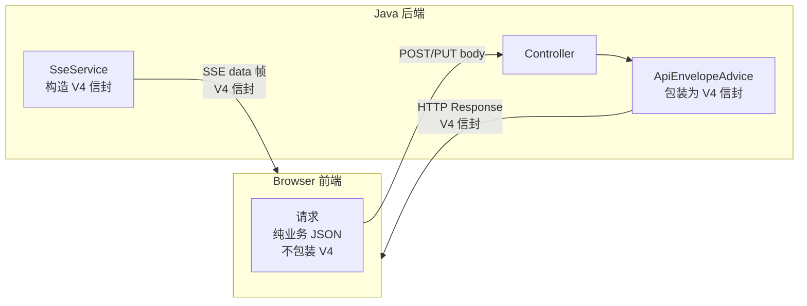
```mermaid
flowchart LR
    subgraph 前端["Browser 前端"]
        direction LR
        req["请求<br/>纯业务 JSON<br/>不包装 V4"]
    end

    subgraph 后端["Java 后端"]
        direction LR
        controller["Controller"]
        advice["ApiEnvelopeAdvice<br/>包装为 V4 信封"]
        sse["SseService<br/>构造 V4 信封"]
    end

    req -->|"POST/PUT body"| controller
    controller --> advice -->|"HTTP Response<br/>V4 信封"| 前端
    sse -->|"SSE data 帧<br/>V4 信封"| 前端
```

### 1.2 双通道架构图

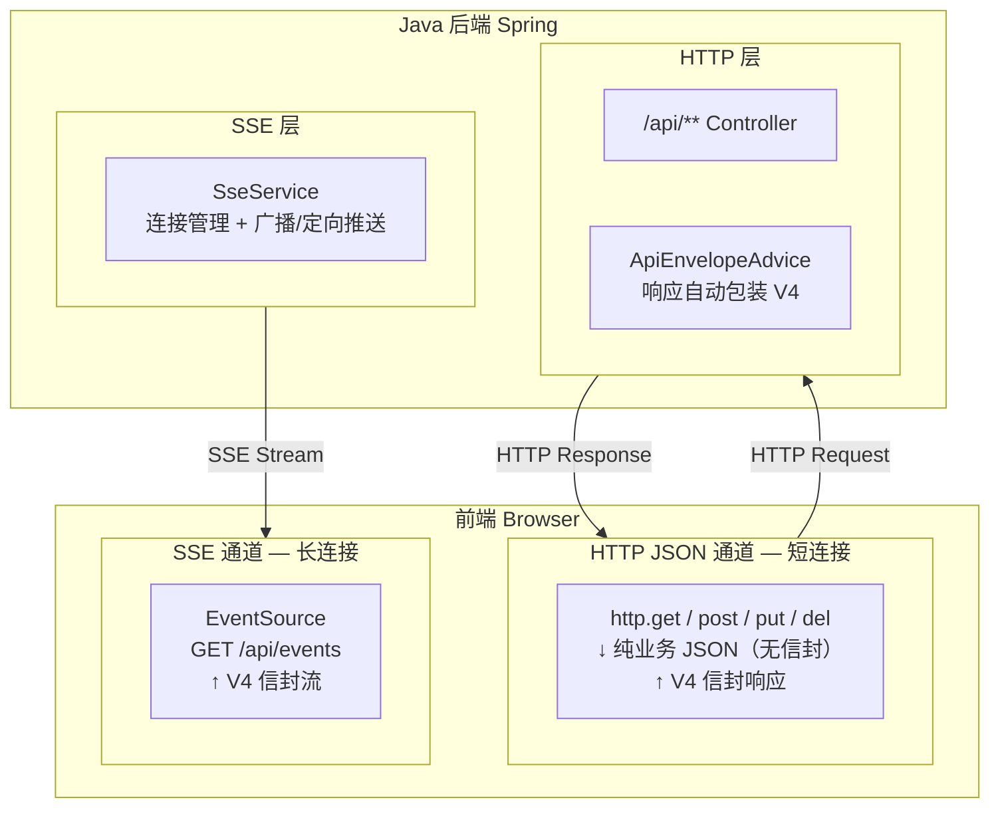
```mermaid
flowchart TB
    subgraph Browser["前端 Browser"]
        direction TB

        subgraph HTTP通道["HTTP JSON 通道 — 短连接"]
            httpClient["http.get / post / put / del<br/>↓ 纯业务 JSON（无信封）<br/>↑ V4 信封响应"]
        end

        subgraph SSE通道["SSE 通道 — 长连接"]
            eventSource["EventSource<br/>GET /api/events<br/>↑ V4 信封流"]
        end
    end

    subgraph Backend["Java 后端 Spring"]
        direction TB

        subgraph HTTP后端["HTTP 层"]
            controller2["/api/** Controller"]
            advice2["ApiEnvelopeAdvice<br/>响应自动包装 V4"]
        end

        subgraph SSE后端["SSE 层"]
            sseService["SseService<br/>连接管理 + 广播/定向推送"]
        end
    end

    HTTP通道 -->|"HTTP Request"| HTTP后端
    HTTP后端 -->|"HTTP Response"| HTTP通道
    SSE后端 -->|"SSE Stream"| SSE通道
```

| 通道 | 方向 | 请求格式 | 响应/推送格式 | 连接类型 | 端点 |
|------|------|----------|---------------|----------|------|
| **HTTP JSON** | 前端 ⇄ 后端 | 纯业务 JSON（**不包装 V4**） | V4 信封 | 短连接（请求-响应） | `/api/**` |
| **APP 公共 SSE** | 后端 → 前端 | —（EventSource GET 不带 body） | V4 信封 | 长连接（服务端推送） | `GET /api/events` |

**关键设计原则：**

- 前端所有请求（GET/POST/PUT/DELETE）的 body 都是纯业务 JSON，**不需要也不应该**包装 V4 信封。
- V4 信封只出现在后端→前端方向：HTTP 响应 body 和 SSE `data:` 帧。
- AI turn 的模型流式输出复用 APP 公共 SSE，以 `llm-frame` 事件下发，不另建通道。
- 两个通道共享同一套 V4 信封结构，`event.transport` 字段区分 `"http"` 与 `"sse"`。

---

## 2. 统一信封结构 `SparkEnvelope<T>`

所有 HTTP JSON 响应 body 和 SSE `data:` 字段均使用此结构。v4 是当前唯一有效的 wire 格式。

### 2.1 结构总览

```mermaid
block-beta
    columns 1

    block:envelope["SparkEnvelope&lt;T&gt;"]
        columns 6

        pv["protocolVersion<br/>固定为 4"]

        block:ok["ok: boolean"]
        end

        block:data["data: T | null<br/>业务载荷"]
        end

        block:error["error: Error | null<br/>错误载荷"]
        end

        block:ctx["context<br/>请求/连接元数据"]
            columns 1
            ctx1["requestId (必填)"]
            ctx2["tenantId / projectId / username"]
            ctx3["scope: { moduleId, moduleInstanceId, ... }"]
            ctx4["session: { sessionId }"]
            ctx5["turn: { turnId, turnKey, seq, ... }"]
            ctx6["stream: { streamId, streamKey }"]
        end

        block:evt["event<br/>传输层描述"]
            columns 1
            evt1["transport: 'http' | 'sse'"]
            evt2["name: 事件名"]
            evt3["terminal: 是否最后一帧"]
            evt4["sequence?: 序号"]
        end
    end
```

### 2.2 TypeScript 类型定义

```ts
type SparkEnvelope<T> = {
  protocolVersion: 4          // 协议版本，固定为 4
  ok: boolean                 // 本次响应/事件是否成功
  data: T | null              // 业务载荷（ok=true 时有效）
  error: SparkEnvelopeError | null  // 错误载荷（ok=false 时有效）
  context: SparkEnvelopeContext     // 请求/连接上下文
  event: SparkEnvelopeEvent         // 传输层事件描述
}

type SparkEnvelopeContext = {
  requestId: string                // 请求追踪 ID
  tenantId?: string                // 租户标识
  projectId?: string               // 项目标识
  username?: string                // 当前用户
  scope?: {
    moduleId?: string              // wire 层模块注册 ID
    moduleInstanceId?: string      // wire 层模块实例 ID
    instanceId?: string            // 页面实例 ID
    runtimeInstanceId?: string     // 运行时实例 ID
  }
  session?: { sessionId?: string }
  turn?: {
    turnId?: string
    turnKey?: string
    seq?: number                   // 流式帧序号
    baseRevision?: number
  }
  stream?: {
    streamId?: string
    streamKey?: string
  }
}

type SparkEnvelopeEvent = {
  transport: 'http' | 'sse'   // 传输类型
  name: string                 // HTTP="response"; SSE=业务事件名
  terminal: boolean            // HTTP 始终 true; SSE 末帧为 true
  sequence?: number            // 乱序检测序号
}

type SparkEnvelopeError = {
  code: string                 // 机器可读错误码
  message: string              // 人类可读描述
  category: string             // 错误分类
  severity: 'error' | 'warning' | string
  retryPolicy?: string         // 建议重试策略
  details?: Record<string, unknown>
}
```

### 2.3 后端 Java 对应类型

| 前端 TS 类型 | 后端 Java Record | 源文件 |
|-------------|-----------------|--------|
| `SparkEnvelope<T>` | `ApiEnvelope<T>` | `ApiEnvelope.java` |
| `SparkEnvelopeError` | `ApiError` | `ApiError.java` |
| 工厂方法 | `ApiResponseFactory` | `ApiResponseFactory.java` |
| 自动包装 | `ApiEnvelopeAdvice` | `ApiEnvelopeAdvice.java` |

---

## 3. 前端连接建立

### 3.1 HTTP JSON 通道 — 短连接

前端 HTTP 客户端是一个**懒初始化单例**，所有 API 调用共享同一个实例。

**实现文件：** [src/services/http.ts](src/services/http.ts)

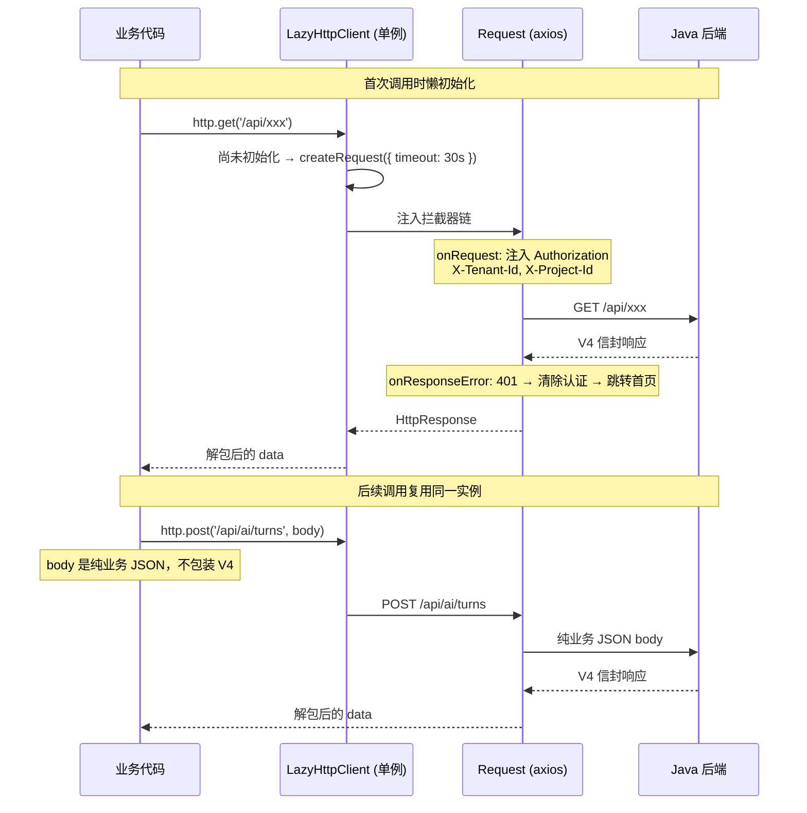
```mermaid
sequenceDiagram
    participant App as 业务代码
    participant Lazy as LazyHttpClient (单例)
    participant Req as Request (axios)
    participant Backend as Java 后端

    Note over App,Backend: 首次调用时懒初始化

    App->>Lazy: http.get('/api/xxx')
    Lazy->>Lazy: 尚未初始化 → createRequest({ timeout: 30s })
    Lazy->>Req: 注入拦截器链
    Note over Req: onRequest: 注入 Authorization<br/>X-Tenant-Id, X-Project-Id
    Req->>Backend: GET /api/xxx
    Backend-->>Req: V4 信封响应
    Note over Req: onResponseError: 401 → 清除认证 → 跳转首页
    Req-->>Lazy: HttpResponse
    Lazy-->>App: 解包后的 data

    Note over App,Backend: 后续调用复用同一实例

    App->>Lazy: http.post('/api/ai/turns', body)
    Note over App: body 是纯业务 JSON，不包装 V4
    Lazy->>Req: POST /api/ai/turns
    Req->>Backend: 纯业务 JSON body
    Backend-->>Req: V4 信封响应
    Req-->>App: 解包后的 data
```

**请求拦截器自动注入的请求头：**

| Header | 来源 | 说明 |
|--------|------|------|
| `Authorization: Bearer <token>` | `auth.getToken()` | 用户认证令牌 |
| `X-Tenant-Id` | `auth.getUser().tenantId` | 当前租户 |
| `X-Project-Id` | `auth.getUser().defaultProjectId` | 当前项目 |

**响应拦截器行为：**
- HTTP 401 且非 `/api/auth/` 路径：清除认证状态，重定向到首页 `/`。
- 其他错误：原样抛出，由调用方处理。

**关键特性：**

| 特性 | 说明 |
|------|------|
| 连接类型 | 短连接（或 HTTP/1.1 keep-alive 复用），**不是长连接** |
| 请求体格式 | 纯业务 JSON，**不包装 V4 信封** |
| 响应体格式 | 由 `ApiEnvelopeAdvice` 自动包装为 V4 信封 |
| 超时 | 30 秒 |
| GET 缓存 | 内存级，TTL 可配 |
| 重试 | 支持自动重试 |
| 取消 | 支持 AbortSignal |

### 3.2 SSE 通道 — 长连接

SSE 通道采用**模块级单例 + 按需连接**模式：有订阅者时自动建立连接，无订阅者时自动关闭。

**实现文件：** [src/services/sse-events.ts](src/services/sse-events.ts)

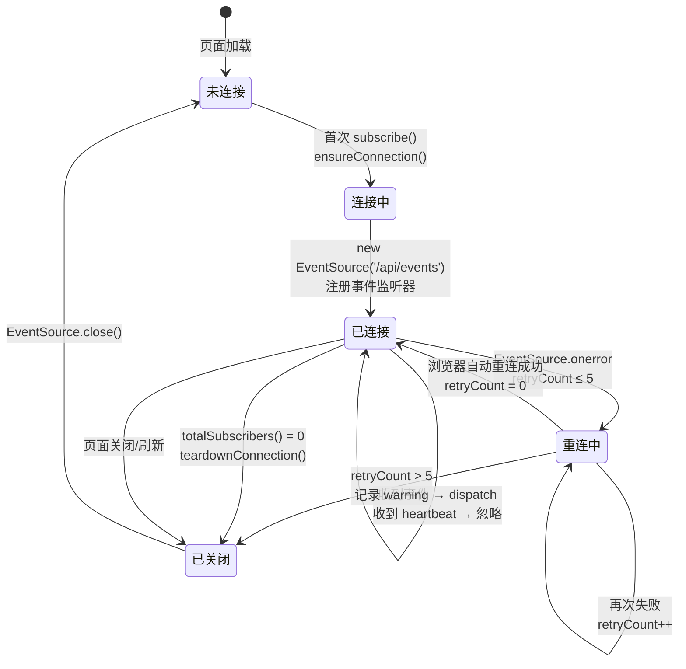
```mermaid
stateDiagram-v2
    [*] --> 未连接: 页面加载

    未连接 --> 连接中: 首次 subscribe()<br/>ensureConnection()
    连接中 --> 已连接: new EventSource('/api/events')<br/>注册事件监听器

    已连接 --> 已连接: 收到事件 → dispatch<br/>收到 heartbeat → 忽略
    已连接 --> 重连中: EventSource.onerror<br/>retryCount ≤ 5

    重连中 --> 已连接: 浏览器自动重连成功<br/>retryCount = 0
    重连中 --> 重连中: 再次失败<br/>retryCount++
    重连中 --> 已关闭: retryCount > 5<br/>记录 warning

    已连接 --> 已关闭: totalSubscribers() = 0<br/>teardownConnection()
    已连接 --> 已关闭: 页面关闭/刷新
    已关闭 --> 未连接: EventSource.close()
```

**连接关闭条件（任一满足即关闭）：**
- 所有订阅者调用 unsubscribe 回调，`totalSubscribers() === 0`
- 重试次数超过 5 次
- 页面关闭/刷新（浏览器自动断开）

**关键参数：**

| 参数 | 值 | 说明 |
|------|-----|------|
| SSE URL | `/api/events` | 由 Vite 代理到 Java 后端 |
| 最大重试次数 | 5 | 超过后放弃连接并告警 |
| 后端 emitter 超时 | 30 分钟 | 超时后后端关闭连接，前端 EventSource 自动重连 |
| 后端心跳间隔 | 25 秒 | SSE comment 帧（`: heartbeat`），保持连接活跃 |
| 后端 outbound 队列容量 | 512 | 每连接，溢出则断开该连接 |

**Vite 开发代理特殊处理（[vite.config.ts](vite.config.ts)）：**

| 处理 | 原因 |
|------|------|
| 移除 `Accept-Encoding` 请求头 | 防止代理层压缩导致缓冲 |
| 设置 `X-Accel-Buffering: no` | 禁用 nginx 缓冲 |
| 设置 `Cache-Control: no-cache, no-transform` | 禁用缓存和转换 |

**SSE 订阅分发（两层模式）：**

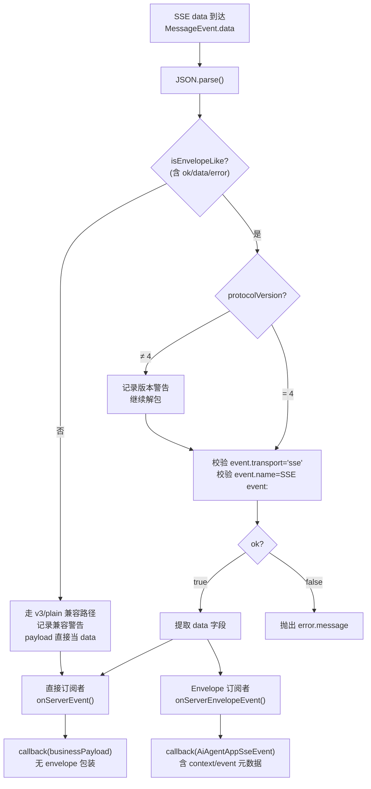
```mermaid
flowchart TD
    sse["SSE data 到达<br/>MessageEvent.data"]

    sse --> parse["JSON.parse()"]
    parse --> check{"isEnvelopeLike?<br/>(含 ok/data/error)"}
    check -->|"否"| legacy["走 v3/plain 兼容路径<br/>记录兼容警告<br/>payload 直接当 data"]
    check -->|"是"| version{"protocolVersion?"}
    version -->|"≠ 4"| warnVer["记录版本警告<br/>继续解包"]
    version -->|"= 4"| validate["校验 event.transport='sse'<br/>校验 event.name=SSE event:"]

    warnVer --> validate
    validate --> ok{"ok?"}
    ok -->|"true"| extract["提取 data 字段"]
    ok -->|"false"| throw["抛出 error.message"]

    extract --> dispatch1["直接订阅者<br/>onServerEvent()"]
    extract --> dispatch2["Envelope 订阅者<br/>onServerEnvelopeEvent()"]

    dispatch1 --> cb1["callback(businessPayload)<br/>无 envelope 包装"]
    dispatch2 --> cb2["callback(AiAgentAppSseEvent)<br/>含 context/event 元数据"]

    legacy --> dispatch1
```

**使用示例：**
```ts
import { onServerEvent, onServerEnvelopeEvent } from '@/services/sse-events'

// 直接订阅 — 只关心业务 payload
const unsub1 = onServerEvent('notification', (data) => {
  console.log('通知内容:', data)
})

// Envelope 订阅 — 需要 context/event 元数据（AI turn 使用）
const unsub2 = onServerEnvelopeEvent('llm-frame', (event) => {
  console.log('turnId:', event.context?.turn?.turnId)
  console.log('frame:', event.data)
})

// 取消订阅 → 所有订阅者取消后 EventSource 自动关闭
unsub1()
```

### 3.3 AppClientId 机制

后端通过 Cookie `SPARK_APP_CLIENT_ID` 标识浏览器客户端，用于 SSE 定向推送。

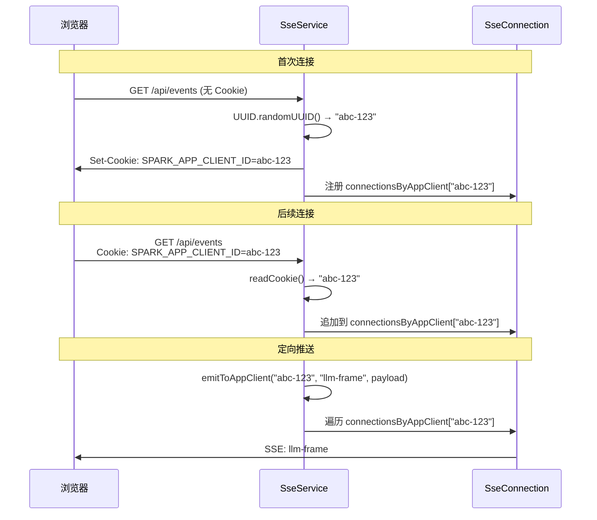
```mermaid
sequenceDiagram
    participant Browser as 浏览器
    participant Backend as SseService
    participant Conn as SseConnection

    Note over Browser,Conn: 首次连接

    Browser->>Backend: GET /api/events (无 Cookie)
    Backend->>Backend: UUID.randomUUID() → "abc-123"
    Backend->>Browser: Set-Cookie: SPARK_APP_CLIENT_ID=abc-123
    Backend->>Conn: 注册 connectionsByAppClient["abc-123"]

    Note over Browser,Conn: 后续连接

    Browser->>Backend: GET /api/events<br/>Cookie: SPARK_APP_CLIENT_ID=abc-123
    Backend->>Backend: readCookie() → "abc-123"
    Backend->>Conn: 追加到 connectionsByAppClient["abc-123"]

    Note over Browser,Conn: 定向推送

    Backend->>Backend: emitToAppClient("abc-123", "llm-frame", payload)
    Backend->>Conn: 遍历 connectionsByAppClient["abc-123"]
    Conn->>Browser: SSE: llm-frame
```

| 属性 | 值 |
|------|-----|
| Cookie 名 | `SPARK_APP_CLIENT_ID` |
| 生成方式 | `UUID.randomUUID()` |
| 作用域 | `Path=/api`，`SameSite=Lax` |
| 有效期 | 30 天 |
| HttpOnly | 是（前端 JS 不可读） |

---

## 4. HTTP JSON 通道详解

### 4.1 请求-响应模式

```mermaid
sequenceDiagram
    participant FE as 前端 http client
    participant Controller as Java Controller
    participant Advice as ApiEnvelopeAdvice

    Note over FE,Advice: 请求方向：纯业务 JSON

    FE->>Controller: POST /api/ai/sessions<br/>Authorization: Bearer &lt;token&gt;<br/>X-Tenant-Id: lmspark<br/>X-Project-Id: demo
    Note right of FE: body: { "sessionId": "s1", ... }<br/>↑ 纯业务 JSON，无 V4 包装

    Controller->>Controller: 处理业务逻辑
    Controller-->>Advice: return result

    Note over Advice: beforeBodyWrite()
    Advice->>Advice: ApiResponseFactory.ok(body, requestId)<br/>构造 V4 信封

    Advice-->>FE: HTTP 200
    Note left of Advice: {<br/>  protocolVersion: 4,<br/>  ok: true,<br/>  data: { sessionId: "s1" },<br/>  context: { requestId: "req-1", ... },<br/>  event: {<br/>    transport: "http",<br/>    name: "response",<br/>    terminal: true<br/>  }<br/>}
```

**HTTP 通道固定特征：**

| 字段 | 固定值 | 说明 |
|------|--------|------|
| `event.transport` | `"http"` | 标识 HTTP JSON 通道 |
| `event.name` | `"response"` | 所有 HTTP 响应统一事件名 |
| `event.terminal` | `true` | HTTP 响应只有一帧，始终为 terminal |

### 4.2 成功与错误响应对比

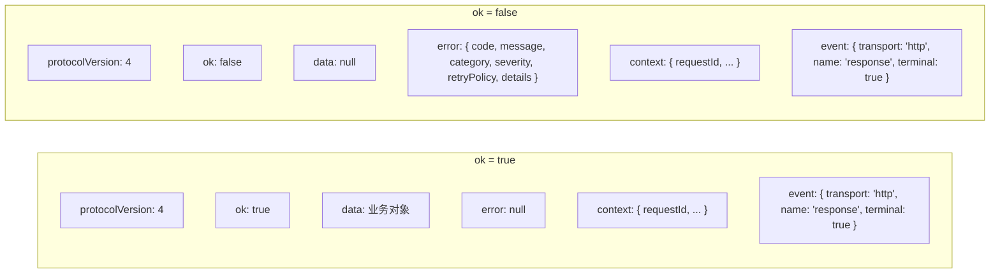
```mermaid
flowchart LR
    subgraph 成功["ok = true"]
        direction TB
        s1["protocolVersion: 4"]
        s2["ok: true"]
        s3["data: 业务对象"]
        s4["error: null"]
        s5["context: { requestId, ... }"]
        s6["event: { transport: 'http', name: 'response', terminal: true }"]
    end

    subgraph 失败["ok = false"]
        direction TB
        e1["protocolVersion: 4"]
        e2["ok: false"]
        e3["data: null"]
        e4["error: { code, message, category, severity, retryPolicy, details }"]
        e5["context: { requestId, ... }"]
        e6["event: { transport: 'http', name: 'response', terminal: true }"]
    end
```

**错误响应示例：**
```json
{
  "protocolVersion": 4,
  "ok": false,
  "data": null,
  "error": {
    "code": "SESSION_SCOPE_MISMATCH",
    "message": "后端 AI 会话与当前模块实例不匹配",
    "category": "session-scope",
    "severity": "error",
    "retryPolicy": "recreate-session"
  },
  "context": { "requestId": "req-err-001" },
  "event": { "transport": "http", "name": "response", "terminal": true }
}
```

HTTP 状态码仍遵循 REST 语义（200/400/404/500 等），V4 信封中的 `error` 提供结构化诊断信息。

### 4.3 ApiEnvelopeAdvice 包装规则

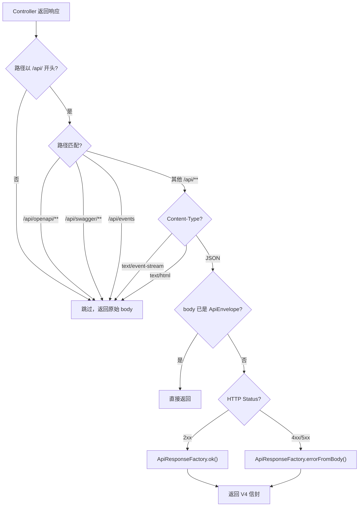
```mermaid
flowchart TD
    resp["Controller 返回响应"] --> check{"路径以 /api/ 开头?"}
    check -->|"否"| skip["跳过，返回原始 body"]
    check -->|"是"| path{"路径匹配?"}

    path -->|"/api/openapi/**"| skip
    path -->|"/api/swagger/**"| skip
    path -->|"/api/events"| skip
    path -->|"其他 /api/**"| ct{"Content-Type?"}

    ct -->|"text/event-stream"| skip
    ct -->|"text/html"| skip
    ct -->|"JSON"| body{"body 已是 ApiEnvelope?"}

    body -->|"是"| pass["直接返回"]
    body -->|"否"| status{"HTTP Status?"}

    status -->|"2xx"| wrapOk["ApiResponseFactory.ok()"]
    status -->|"4xx/5xx"| wrapErr["ApiResponseFactory.errorFromBody()"]

    wrapOk --> v4["返回 V4 信封"]
    wrapErr --> v4
```

---

## 5. SSE 通道详解

### 5.1 服务端推送流程

SSE 通道是**纯后端→前端**的单向推送通道。前端上行统一走 HTTP JSON。

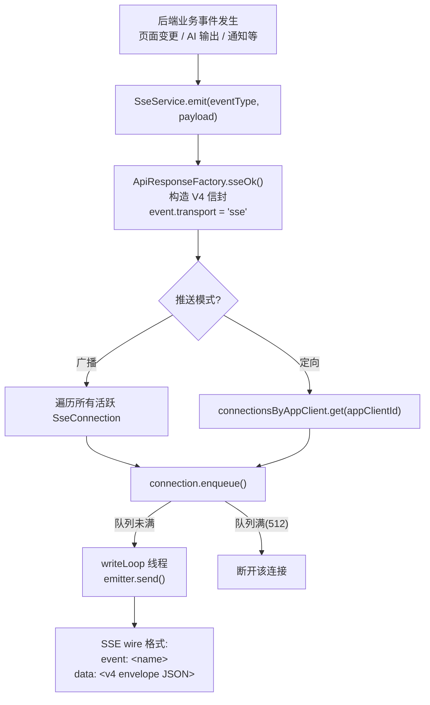
```mermaid
flowchart TD
    event["后端业务事件发生<br/>页面变更 / AI 输出 / 通知等"]

    event --> emit["SseService.emit(eventType, payload)"]
    emit --> factory["ApiResponseFactory.sseOk()<br/>构造 V4 信封<br/>event.transport = 'sse'"]

    factory --> mode{"推送模式?"}
    mode -->|"广播"| all["遍历所有活跃 SseConnection"]
    mode -->|"定向"| target["connectionsByAppClient.get(appClientId)"]

    all --> enqueue["connection.enqueue()"]
    target --> enqueue

    enqueue -->|"队列未满"| write["writeLoop 线程<br/>emitter.send()"]
    enqueue -->|"队列满(512)"| drop["断开该连接"]

    write --> sse["SSE wire 格式:<br/>event: &lt;name&gt;<br/>data: &lt;v4 envelope JSON&gt;"]
```

### 5.2 SSE 有线格式

```
event: llm-frame
data: {"protocolVersion":4,"ok":true,"data":{...},"error":null,"context":{...},"event":{"transport":"sse","name":"llm-frame","terminal":false}}

event: llm-frame
data: {"protocolVersion":4,"ok":true,"data":{...},"error":null,"context":{...},"event":{"transport":"sse","name":"llm-frame","terminal":true}}

: heartbeat
```

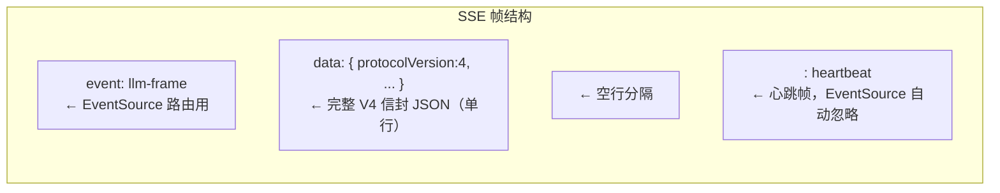
```mermaid
flowchart LR
    subgraph SSE帧结构["SSE 帧结构"]
        direction TB
        evtLine["event: llm-frame<br/>← EventSource 路由用"]
        dataLine["data: { protocolVersion:4, ... }<br/>← 完整 V4 信封 JSON（单行）"]
        blank["← 空行分隔"]
        heartbeat[": heartbeat<br/>← 心跳帧，EventSource 自动忽略"]
    end
```

**关键规则：**
- SSE `event:` 字段与 `data.event.name` **必须一致**，前端 `validateEnvelopeEventName()` 做校验。
- `data` 必须是完整 V4 信封 JSON（单行，不含换行）。
- 帧之间以空行分隔（标准 SSE 协议）。
- 心跳帧为 SSE comment（`: heartbeat`），不含 `data:`，浏览器 `EventSource` 自动忽略。

### 5.3 SSE 事件类型全景

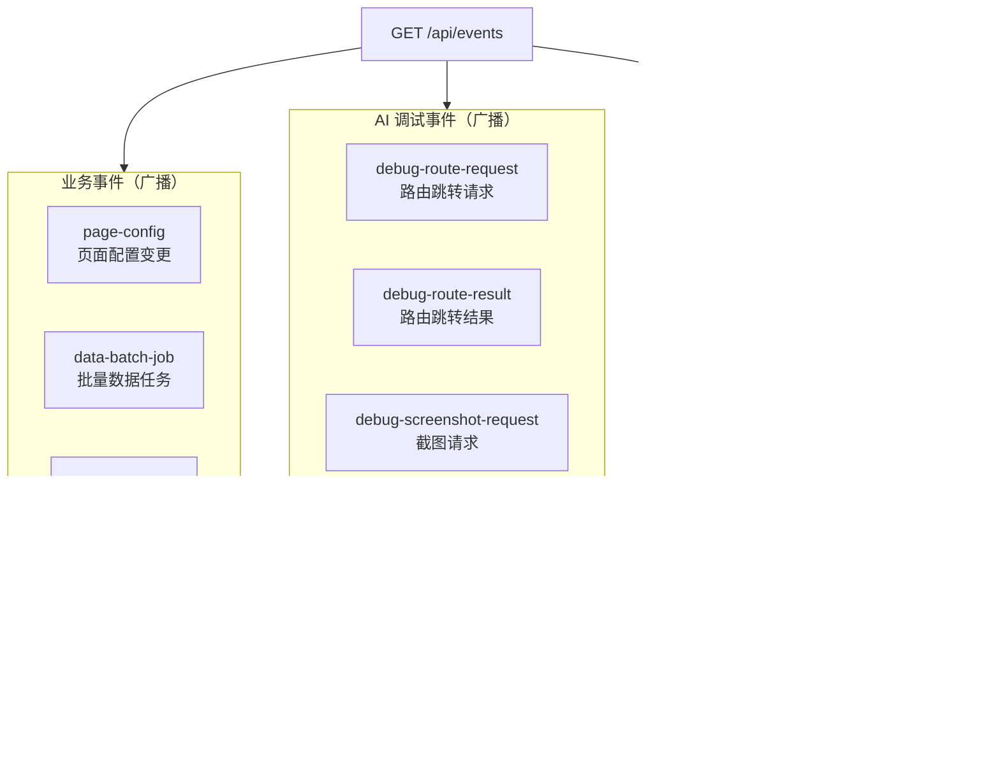
```mermaid
flowchart TD
    subgraph 业务事件["业务事件（广播）"]
        pc["page-config<br/>页面配置变更"]
        dbj["data-batch-job<br/>批量数据任务"]
        dc["data-change<br/>数据表变更"]
        notif["notification<br/>通用通知"]
    end

    subgraph 调试事件["AI 调试事件（广播）"]
        drr["debug-route-request<br/>路由跳转请求"]
        drres["debug-route-result<br/>路由跳转结果"]
        dsr["debug-screenshot-request<br/>截图请求"]
        dsres["debug-screenshot-result<br/>截图结果"]
        fcerr["debug-fc-error-report<br/>函数调用错误"]
    end

    subgraph AI事件["AI Turn 事件（定向推送）"]
        llm["llm-frame<br/>模型流式帧<br/>delta / reasoning / result / error / done"]
    end

    sseUrl["GET /api/events"] --> 业务事件
    sseUrl --> 调试事件
    sseUrl --> AI事件
```

| 事件名 | 推送方式 | 消费方 |
|--------|----------|--------|
| `page-config` | 广播 | `useDevSystem`, `useNotifications` |
| `data-batch-job` | 广播 | 数据面板 |
| `data-change` | 广播 | 视图刷新 |
| `notification` | 广播 | `useNotifications` |
| `debug-route-request` | 广播 | `ai-debug-bridge` |
| `debug-route-result` | 广播 | MJS 测试脚本 / 诊断面板 |
| `debug-screenshot-request` | 广播 | `ai-debug-bridge` |
| `debug-screenshot-result` | 广播 | MJS 测试脚本 / 诊断面板 |
| `debug-fc-error-report` | 广播 | 诊断面板 |
| `llm-frame` | **定向** (`emitToAppClient`) | `turn-event-collector` |

### 5.4 后端连接管理数据结构

**实现文件：** [SseService.java](spark-ai-server/src/main/java/com/spark/ai/service/SseService.java)

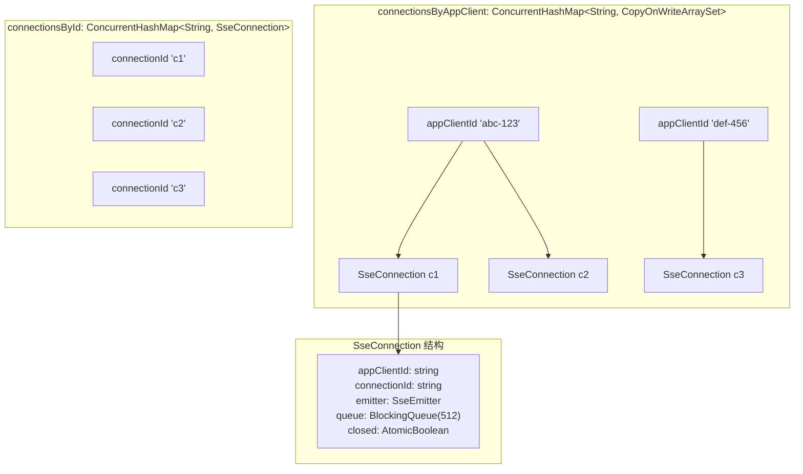
```mermaid
flowchart TB
    subgraph connectionsByAppClient["connectionsByAppClient: ConcurrentHashMap&lt;String, CopyOnWriteArraySet&gt;"]
        c1["appClientId 'abc-123'"]
        c1 --> conn1["SseConnection c1"]
        c1 --> conn2["SseConnection c2"]
        c2["appClientId 'def-456'"]
        c2 --> conn3["SseConnection c3"]
    end

    subgraph connectionsById["connectionsById: ConcurrentHashMap&lt;String, SseConnection&gt;"]
        id1["connectionId 'c1'"]
        id2["connectionId 'c2'"]
        id3["connectionId 'c3'"]
    end

    subgraph SseConnection["SseConnection 结构"]
        direction LR
        fields["appClientId: string<br/>connectionId: string<br/>emitter: SseEmitter<br/>queue: BlockingQueue(512)<br/>closed: AtomicBoolean"]
    end

    conn1 --> fields
```

**推送模式：**

| 方法 | 目标 | 场景 |
|------|------|------|
| `emit(eventType, payload)` | 所有活跃连接 | page-config、notification 等广播事件 |
| `emitToAppClient(appClientId, ...)` | 指定客户端的所有连接 | AI turn llm-frame 定向推送 |

**连接清理触发条件：**
- `SseEmitter.onCompletion()` — 前端主动断开
- `SseEmitter.onTimeout()` — 30 分钟无活动
- `SseEmitter.onError()` — 写入失败
- Outbound queue overflow — 队列满 512 条，断开该连接

---

## 6. 双通道协同：关键交互模式

### 6.1 AI Turn 完整流程

AI turn 是最典型的双通道协同场景：**HTTP 发起 → SSE 流式接收 → HTTP 追加消息**。

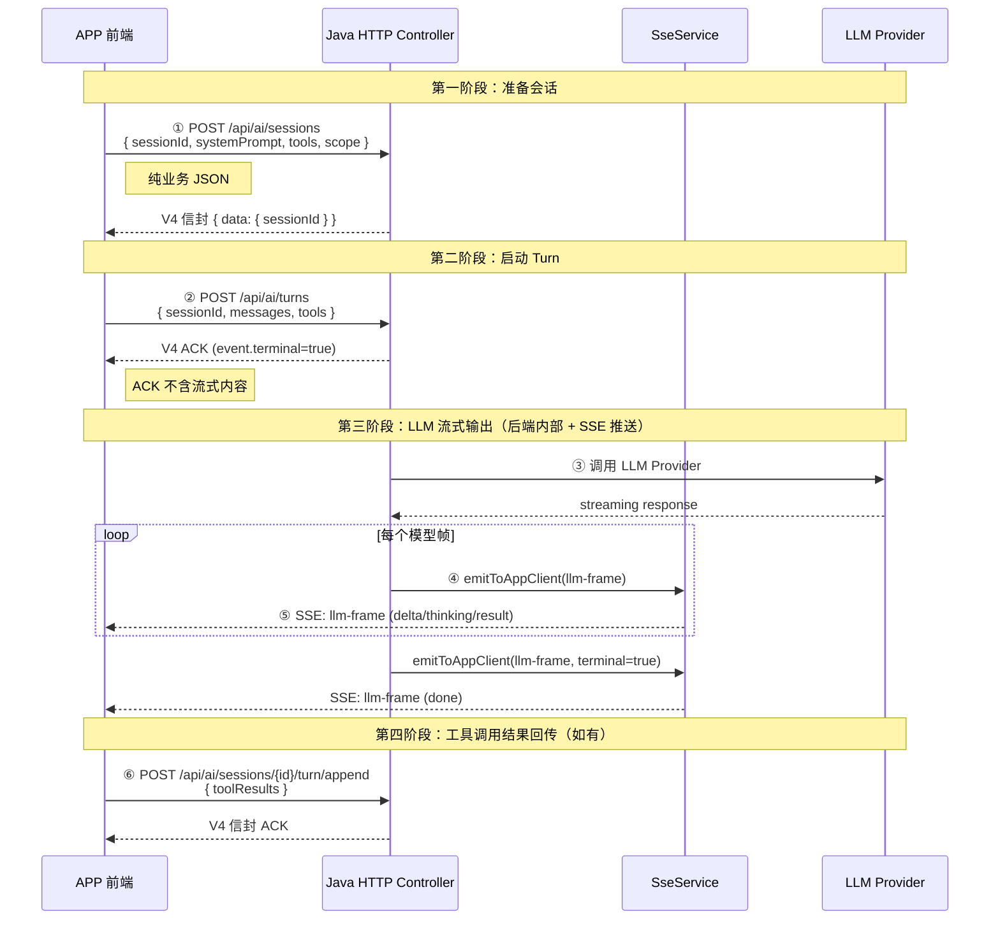
```mermaid
sequenceDiagram
    participant APP as APP 前端
    participant HTTP as Java HTTP Controller
    participant SSE as SseService
    participant LLM as LLM Provider

    Note over APP,LLM: 第一阶段：准备会话

    APP->>HTTP: ① POST /api/ai/sessions<br/>{ sessionId, systemPrompt, tools, scope }
    Note right of APP: 纯业务 JSON
    HTTP-->>APP: V4 信封 { data: { sessionId } }

    Note over APP,LLM: 第二阶段：启动 Turn

    APP->>HTTP: ② POST /api/ai/turns<br/>{ sessionId, messages, tools }
    HTTP-->>APP: V4 ACK (event.terminal=true)
    Note right of APP: ACK 不含流式内容

    Note over APP,LLM: 第三阶段：LLM 流式输出（后端内部 + SSE 推送）

    HTTP->>LLM: ③ 调用 LLM Provider
    LLM-->>HTTP: streaming response

    loop 每个模型帧
        HTTP->>SSE: ④ emitToAppClient(llm-frame)
        SSE-->>APP: ⑤ SSE: llm-frame (delta/thinking/result)
    end

    HTTP->>SSE: emitToAppClient(llm-frame, terminal=true)
    SSE-->>APP: SSE: llm-frame (done)

    Note over APP,LLM: 第四阶段：工具调用结果回传（如有）

    APP->>HTTP: ⑥ POST /api/ai/sessions/{id}/turn/append<br/>{ toolResults }
    HTTP-->>APP: V4 信封 ACK
```

**步骤详解：**

| 步骤 | 通道 | 端点 | 请求体格式 | 响应格式 |
|------|------|------|-----------|----------|
| ① prepareSession | HTTP | `POST /api/ai/sessions` | 纯业务 JSON | V4 信封 |
| ② executeTurn | HTTP | `POST /api/ai/turns` | 纯业务 JSON | V4 信封 ACK |
| ③ LLM 调用 | 后端内部 | — | — | — |
| ④ emit frame | SSE | `GET /api/events` | — | V4 信封 (定向) |
| ⑤ 前端接收 | SSE | `GET /api/events` | — | V4 信封流 |
| ⑥ appendMessages | HTTP | `POST /api/ai/sessions/{id}/turn/append` | 纯业务 JSON | V4 信封 |

**前端实现文件：**
- [ai-turn-bridge.ts](src/services/ai-turn-bridge.ts) — APP 层桥接，实现 `AiAgentTurnCallbacks`
- [turn-event-collector.ts](packages/spark-ai/src/agent/tool-loop/turn-event-collector.ts) — 纯聚合层，收集 `llm-frame` 并返回 Promise

### 6.2 AI 调试闭环

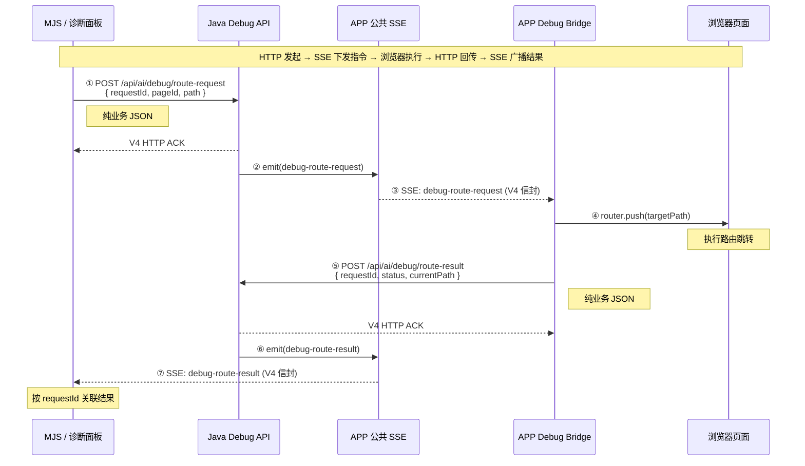
```mermaid
sequenceDiagram
    participant Tester as MJS / 诊断面板
    participant API as Java Debug API
    participant Bus as APP 公共 SSE
    participant Bridge as APP Debug Bridge
    participant Page as 浏览器页面

    Note over Tester,Page: HTTP 发起 → SSE 下发指令 → 浏览器执行 → HTTP 回传 → SSE 广播结果

    Tester->>API: ① POST /api/ai/debug/route-request<br/>{ requestId, pageId, path }
    Note right of Tester: 纯业务 JSON
    API-->>Tester: V4 HTTP ACK

    API->>Bus: ② emit(debug-route-request)
    Bus-->>Bridge: ③ SSE: debug-route-request (V4 信封)

    Bridge->>Page: ④ router.push(targetPath)
    Note over Page: 执行路由跳转

    Bridge->>API: ⑤ POST /api/ai/debug/route-result<br/>{ requestId, status, currentPath }
    Note right of Bridge: 纯业务 JSON
    API-->>Bridge: V4 HTTP ACK

    API->>Bus: ⑥ emit(debug-route-result)
    Bus-->>Tester: ⑦ SSE: debug-route-result (V4 信封)
    Note over Tester: 按 requestId 关联结果
```

截图调试流程同理：`debug-screenshot-request` → 浏览器截图上传 → `debug-screenshot-result`。

### 6.3 页面配置变更 & 通知推送（纯 SSE 广播）

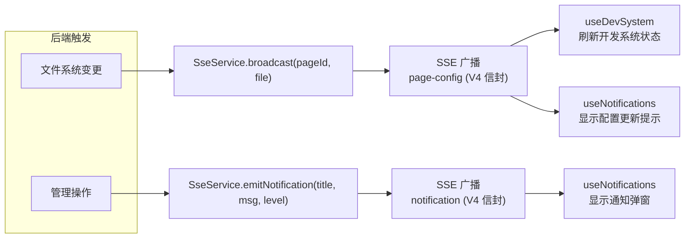
```mermaid
flowchart LR
    subgraph 触发源["后端触发"]
        fs["文件系统变更"]
        admin["管理操作"]
    end

    fs --> broadcast["SseService.broadcast(pageId, file)"]
    admin --> notif["SseService.emitNotification(title, msg, level)"]

    broadcast --> sse["SSE 广播<br/>page-config (V4 信封)"]
    notif --> sse2["SSE 广播<br/>notification (V4 信封)"]

    sse --> consumers1["useDevSystem<br/>刷新开发系统状态"]
    sse --> consumers2["useNotifications<br/>显示配置更新提示"]
    sse2 --> consumers3["useNotifications<br/>显示通知弹窗"]
```

---

## 7. 命名差异：前端业务 ID vs Wire 模块 ID

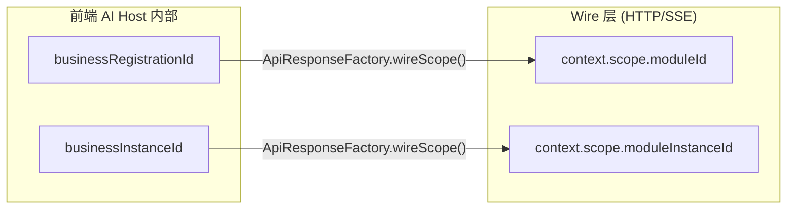
```mermaid
flowchart LR
    subgraph 前端内部["前端 AI Host 内部"]
        brId["businessRegistrationId"]
        biId["businessInstanceId"]
    end

    subgraph Wire层["Wire 层 (HTTP/SSE)"]
        mId["context.scope.moduleId"]
        miId["context.scope.moduleInstanceId"]
    end

    brId -->|"ApiResponseFactory.wireScope()"| mId
    biId -->|"ApiResponseFactory.wireScope()"| miId
```

这是刻意保留的边界：前端业务注册表继续使用 `business*`，所有 wire payload 只暴露 `module*`。

---

## 8. 兼容策略

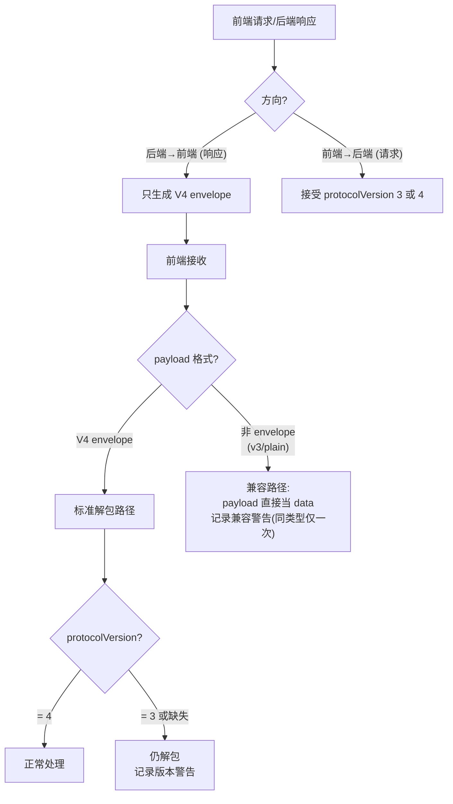
```mermaid
flowchart TD
    req["前端请求/后端响应"] --> dir{"方向?"}

    dir -->|"后端→前端 (响应)"| v4only["只生成 V4 envelope"]
    dir -->|"前端→后端 (请求)"| accept["接受 protocolVersion 3 或 4"]

    v4only --> feRecv["前端接收"]

    feRecv --> check{"payload 格式?"}
    check -->|"V4 envelope"| std["标准解包路径"]
    check -->|"非 envelope<br/>(v3/plain)"| compat["兼容路径:<br/>payload 直接当 data<br/>记录兼容警告(同类型仅一次)"]

    std --> verCheck{"protocolVersion?"}
    verCheck -->|"= 4"| normal["正常处理"]
    verCheck -->|"= 3 或缺失"| warnCompat["仍解包<br/>记录版本警告"]
```

| 层级 | v3 处理 | v4 处理 |
|------|---------|---------|
| **后端响应** | 不再生成 v3 响应 | 所有新响应均为 V4 envelope |
| **后端请求接收** | 接受 `protocolVersion: 3` | 接受 `protocolVersion: 4` |
| **前端 HTTP 解包** | 兼容读取 v3 顶层 `requestId` | 优先用 `context.requestId` |
| **前端 SSE 解包** | 兼容 v3/plain payload | 标准路径：检查 `ok`/`data`/`error` |
| **前端 AI reader** | 兼容旧格式 | 优先用 `data.sessionId`/`data.turnId` |

---

## 9. MJS SSE 验证

Node MJS live 脚本测试 AI turn 时，由脚本层 HTTP 客户端订阅 `/api/events`，再用 HTTP JSON 启动 turn。

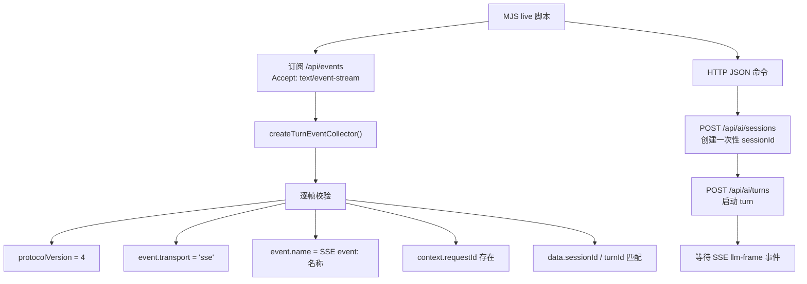
```mermaid
flowchart TD
    script["MJS live 脚本"] --> sseSub["订阅 /api/events<br/>Accept: text/event-stream"]
    script --> httpCmd["HTTP JSON 命令"]

    httpCmd --> createSession["POST /api/ai/sessions<br/>创建一次性 sessionId"]
    createSession --> startTurn["POST /api/ai/turns<br/>启动 turn"]
    startTurn --> wait["等待 SSE llm-frame 事件"]

    sseSub --> collector["createTurnEventCollector()"]
    collector --> validate["逐帧校验"]
    validate --> assert1["protocolVersion = 4"]
    validate --> assert2["event.transport = 'sse'"]
    validate --> assert3["event.name = SSE event: 名称"]
    validate --> assert4["context.requestId 存在"]
    validate --> assert5["data.sessionId / turnId 匹配"]
```

```ts
import { createTurnEventCollector } from '@spark-view/spark-ai'

const collector = createTurnEventCollector({
  input,
  source: appOwnedEventSource,
  timeoutMs: 300_000,
})
```

**验证入口：**
```bash
pnpm run debug:sse:loop
pnpm run verify:ai:page-design-form:llm
pnpm run verify:ai:page-design-leave:llm
```

---

## 10. 关键源文件索引

```mermaid
flowchart LR
    subgraph 后端["Java 后端"]
        factory["ApiResponseFactory.java<br/>V4 工厂 PROTOCOL_VERSION=4"]
        envelope["ApiEnvelope.java<br/>ApiEnvelope&lt;T&gt; record"]
        error["ApiError.java<br/>ApiError record"]
        advice["ApiEnvelopeAdvice.java<br/>@ControllerAdvice 自动包装"]
        sseService["SseService.java<br/>SSE 连接管理 + 推送"]
    end

    subgraph 前端["前端 TypeScript"]
        httpTs["src/services/http.ts<br/>HTTP 客户端单例"]
        sseTs["src/services/sse-events.ts<br/>SSE 单例 + 解包 + 分发"]
        turnBridge["src/services/ai-turn-bridge.ts<br/>AI turn HTTP+SSE 桥接"]
        debugBridge["src/services/ai-debug-bridge.ts<br/>AI 调试 HTTP+SSE 桥接"]
        types["packages/spark-utils/src/http/types.ts<br/>ApiEnvelope 类型定义"]
        sseTypes["packages/spark-ai/.../app-sse-events.ts<br/>SSE 事件类型契约"]
        transportTypes["packages/spark-ai/.../transport-types.ts<br/>AI turn 传输接口"]
        collector["packages/spark-ai/.../turn-event-collector.ts<br/>llm-frame 聚合器"]
    end
```

---

> **版本历史：**
> - v4 是当前唯一活跃的 wire 协议版本。v3/plain payload 仅保留前端读取兼容，不再作为后端新响应格式。
> - 本文档 v3.0 — 全面 Mermaid 图表化：双通道架构、连接生命周期、数据流向、交互时序、兼容降级路径。
