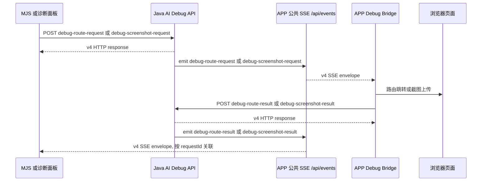

# SPARK Communication Envelope v4

本文件定义 SPARK View 前端、Java 后端、SSE 流之间唯一的 wire 信封。v4 是新的通信真源；v3/plain payload 只保留前端解析兼容，不再作为后端新响应格式。

## 统一结构

```ts
type SparkEnvelope<T> = {
  protocolVersion: 4
  ok: boolean
  data: T | null
  error: SparkEnvelopeError | null
  context: {
    requestId: string
    tenantId?: string
    projectId?: string
    username?: string
    scope?: {
      moduleId?: string
      moduleInstanceId?: string
      instanceId?: string
      runtimeInstanceId?: string
    }
    session?: { sessionId?: string }
    turn?: {
      turnId?: string
      turnKey?: string
      seq?: number
      baseRevision?: number
    }
    stream?: {
      streamId?: string
      streamKey?: string
    }
  }
  event: {
    transport: 'http' | 'sse'
    name: string
    terminal: boolean
    sequence?: number
  }
}

type SparkEnvelopeError = {
  code: string
  message: string
  category: string
  severity: 'error' | 'warning' | string
  retryPolicy?: string
  details?: Record<string, unknown>
}
```

## HTTP 响应

所有 `/api/**` JSON REST 响应由 `ApiEnvelopeAdvice` 包装为 v4。OpenAPI、Swagger、HTML、二进制下载、SSE 连接本身不包装。

HTTP 固定事件层级：

```json
{
  "protocolVersion": 4,
  "ok": true,
  "data": { "sessionId": "session-1" },
  "error": null,
  "context": {
    "requestId": "req-1",
    "tenantId": "lmspark",
    "projectId": "demo",
    "username": "admin"
  },
  "event": {
    "transport": "http",
    "name": "response",
    "terminal": true
  }
}
```

错误响应同样使用 v4：

```json
{
  "protocolVersion": 4,
  "ok": false,
  "data": null,
  "error": {
    "code": "SESSION_SCOPE_MISMATCH",
    "message": "后端 AI 会话与当前模块实例不匹配",
    "category": "session-scope",
    "severity": "error",
    "retryPolicy": "recreate-session"
  },
  "context": { "requestId": "req-err" },
  "event": { "transport": "http", "name": "response", "terminal": true }
}
```

## SSE 响应

SSE 的 `event:` 名称保持原样用于 EventSource 路由，并同步写入 `envelope.event.name`。SSE `data:` 必须是完整 v4 envelope。

### SSE 归属规则

v4 信封字段不区分业务域，事件归属由 endpoint 约定：

- APP 公共事件总线：`GET /api/events`。只建立一个应用级 EventSource，用于页面配置、数据任务、数据变更、通知消息、AI 调试控制、诊断广播和 AI turn 模型事件。当前事件名包括 `page-config`、`data-batch-job`、`data-change`、`notification`、`debug-route-request`、`debug-route-result`、`debug-screenshot-request`、`debug-screenshot-result`、`debug-fc-error-report`、`ai-turn-delta`、`ai-turn-reasoning`、`ai-turn-usage`、`ai-turn-result`、`ai-turn-error`、`ai-turn-done`。
- AI turn 启动命令：`POST /api/ai/sessions/{sessionId}/turn/stream`。这是 HTTP JSON 命令，不是客户端 SSE 通道；后端可以内部消费 provider stream，但对 APP 只通过 `/api/events` 广播 `ai-turn-*` 事件。
- 普通命令、状态查询、会话创建、消息追加、调试请求发起和调试结果回传全部走 HTTP JSON，不使用 SSE。前端只对 `/api/events` 发送 `Accept: text/event-stream`。

### 最终分层矩阵

| 层 | Endpoint/API | 传输 | 事件名 | 职责边界 |
| --- | --- | --- | --- | --- |
| HTTP JSON | `/api/**` JSON REST | `http` | `response` | 命令、查询、会话创建、消息追加、AI turn 启动、调试请求发起、调试结果回传；响应统一 v4 envelope |
| APP 公共 SSE | `GET /api/events` | `sse` | 原始业务事件名 | 应用级广播：页面配置、数据任务、数据变更、通知、AI 调试请求和结果、诊断事件、AI turn 模型事件 |
| AI turn 启动 | `POST /api/ai/sessions/{sessionId}/turn/stream` | `http` | `response` | 启动单次模型调用并返回 accepted ACK；不作为客户端 SSE 通道 |
| AI 包 turn collector | `createTurnEventCollector()` | 回调事件源 | `ai-turn-*` | 只聚合调用方提供的 APP SSE 事件，不订阅网络、不发 HTTP |
| APP/MJS 业务处理层 | `src/services/sse-events.ts`、`src/services/ai-turn-bridge.ts`、`src/services/ai-debug-bridge.ts`、MJS live 脚本 | HTTP + APP SSE | 业务事件名 | 执行模型 turn 命令、路由跳转、截图上传、通知展示、脚本等待和断言；不改写 wire envelope |

`@spark-view/spark-ai` 对 APP SSE 的职责只有“接收调用方已订阅到的事件并聚合 AI turn”。它不内置浏览器网络订阅、route、screenshot、notification 的业务处理 API；这些处理由 APP 壳层或 MJS 调用层基于事件自行实现。这样 MJS 测试可以接入同一个 APP SSE 事件源，又不会把网络 I/O、浏览器路由、截图和通知 UI 下沉到框架无关的 AI 包。

### 通信分流流程图

```mermaid
flowchart LR
  caller["前端调用方<br/>APP / MJS / AI Host"]
  httpController["Java /api/** Controller"]
  envelopeAdvice["ApiEnvelopeAdvice<br/>v4 HTTP envelope"]
  httpClient["前端 HTTP 层<br/>解包 data 或 rawEnvelope"]

  sseService["SseService.emit()"]
  appEvents["GET /api/events<br/>APP 公共 SSE"]
  appSseReader["src/services/sse-events.ts<br/>APP EventSource"]
  turnCollector["spark-ai createTurnEventCollector()<br/>pure aggregation"]
  businessHandlers["APP / MJS 业务处理<br/>通知、调试、诊断"]

  aiBridge["APP ai-turn bridge<br/>turnCallbacks.executeTurn()"]
  aiTurnCommand["AI turn command<br/>POST /api/ai/sessions/{id}/turn/stream"]
  provider["LLM provider"]
  toolLoop["AI tool loop"]

  caller -->|"普通命令、查询、会话、调试发起和回执<br/>绝大多数请求走 HTTP JSON"| httpController
  httpController --> envelopeAdvice -->|"event.transport=http<br/>event.name=response"| httpClient

  httpController -->|"需要广播时"| sseService
  sseService -->|"v4 data envelope<br/>event.name=业务事件名"| appEvents
  appEvents --> appSseReader --> businessHandlers
  appEvents --> appSseReader --> turnCollector

  caller --> aiBridge
  aiBridge -->|"HTTP JSON 启动 turn"| aiTurnCommand
  aiTurnCommand --> provider
  provider -->|"后端内部 stream"| aiTurnCommand
  aiTurnCommand -->|"emit ai-turn-*"| sseService
  appEvents --> appSseReader --> turnCollector --> toolLoop
```



AI 调试闭环遵循“HTTP 发起、APP SSE 下发、HTTP 回执、APP SSE 广播回执”：

1. 调用方 `POST /api/ai/debug/route-request` 或 `POST /api/ai/debug/screenshot-request`。
2. 后端通过 `/api/events` 广播 `debug-route-request` 或 `debug-screenshot-request`。
3. APP 壳层订阅公共 SSE，执行路由跳转或截图上传。
4. APP 壳层 `POST /api/ai/debug/route-result` 或 `POST /api/ai/debug/screenshot-result`。
5. 后端通过 `/api/events` 广播 `debug-route-result` 或 `debug-screenshot-result`，脚本和诊断面板按 `requestId` 关联结果。



AI turn APP SSE 示例（经 `/api/events` 下发）：

```text
event: ai-turn-delta
data: {"protocolVersion":4,"ok":true,"data":{"delta":"你好"},"error":null,"context":{"requestId":"req-1","scope":{"moduleId":"demoRuntime","moduleInstanceId":"page-a","instanceId":"page-a"},"session":{"sessionId":"session-1"},"turn":{"turnId":"turn-1","turnKey":"demoRuntime::page-a::turn-1","seq":1,"baseRevision":0},"stream":{"streamId":"llm-stream","streamKey":"demoRuntime::page-a::turn-1::llm-stream"}},"event":{"transport":"sse","name":"ai-turn-delta","terminal":false}}

event: ai-turn-result
data: {"protocolVersion":4,"ok":true,"data":{"text":"你好"},"error":null,"context":{"requestId":"req-1","session":{"sessionId":"session-1"},"turn":{"turnId":"turn-1"},"stream":{"streamId":"llm-stream","streamKey":"demoRuntime::page-a::turn-1::llm-stream"}},"event":{"transport":"sse","name":"ai-turn-result","terminal":false}}

event: ai-turn-done
data: {"protocolVersion":4,"ok":true,"data":{"done":true},"error":null,"context":{"requestId":"req-1","session":{"sessionId":"session-1"},"turn":{"turnId":"turn-1"},"stream":{"streamId":"llm-stream","streamKey":"demoRuntime::page-a::turn-1::llm-stream"}},"event":{"transport":"sse","name":"ai-turn-done","terminal":true}}
```

SSE 业务载荷只放在 `data`。`sessionId`、`turnId`、`streamKey` 等定位信息统一放入 `context`，不再散落在业务 payload 中。旧 v3 payload 仍由前端兼容读取。

平台事件总线 `/api/events` 示例：

```text
event: page-config
data: {"protocolVersion":4,"ok":true,"data":{"pageId":"home","file":"rule.json","timestamp":1770000000000},"error":null,"context":{"requestId":"req-2"},"event":{"transport":"sse","name":"page-config","terminal":false}}

event: debug-route-request
data: {"protocolVersion":4,"ok":true,"data":{"requestId":"debug-1","pageId":"dynamic-columns","timestamp":1770000000000},"error":null,"context":{"requestId":"req-3"},"event":{"transport":"sse","name":"debug-route-request","terminal":false}}

event: notification
data: {"protocolVersion":4,"ok":true,"data":{"title":"构建完成","message":"组件元数据已上传","level":"success","timestamp":1770000000000},"error":null,"context":{"requestId":"req-4"},"event":{"transport":"sse","name":"notification","terminal":false}}
```

页面配置、数据任务、数据变更、通知、AI 调试订阅者仍监听原事件名。前端事件总线先解 v4 envelope，再把 `data` 分发给业务回调。

## 命名差异

前端 AI Host 内部仍使用历史业务命名：

- `businessRegistrationId`
- `businessInstanceId`

wire 层统一投影到后端模块命名：

- `context.scope.moduleId`
- `context.scope.moduleInstanceId`

这是刻意保留的边界：前端业务注册表继续使用 `business*`，所有 HTTP/SSE wire payload 只暴露 `module*`。

## 兼容策略

- 新后端响应只生成 v4 envelope。
- Java AI session 请求暂时接受 `protocolVersion: 3` 和 `protocolVersion: 4`，响应统一为 v4 envelope。
- 前端 HTTP 层同时识别 v4 `context.requestId` 与旧 v3 顶层 `requestId`。
- 前端 AI SSE reader 优先用 `context.session/turn/stream` 校验会话、轮次和流，旧 v3 `data.sessionId/data.turnId/data.streamKey` 继续兼容。
- 前端遇到 v3/plain SSE payload 时继续解析，并通过诊断事件或 logger 记录一次协议兼容警告。

## MJS SSE 验证

Node MJS live 脚本测试 AI turn 时先由脚本层 HTTP 客户端订阅 `/api/events`，再用 HTTP JSON `POST /api/ai/sessions/{sessionId}/turn/stream` 启动 turn；`POST /turn/stream` 本身不返回 SSE。

APP 公共 SSE 测试在脚本层订阅 `/api/events`，再把 `ai-turn-*` 事件交给 `createTurnEventCollector()`；`spark-ai` 不提供网络订阅 API：

```ts
import {
  createTurnEventCollector,
} from '@spark-view/spark-ai'

const collector = createTurnEventCollector({
  input,
  source: appOwnedEventSource,
  timeoutMs: 300_000,
})
```

验证脚本必须满足：

- 会话创建、消息追加、AI turn 启动、调试请求等普通接口只发 HTTP JSON。
- 只有 `/api/events` 设置 `Accept: text/event-stream`。
- 每次 live 测试使用一次性 `sessionId` 或 `reuseScopeSession=false`，避免复用旧模型历史。
- SSE parser 按空行切帧，收集 `event:` 和多行 `data:`；每帧 `data` 必须解析为 v4 envelope。
- 对每帧断言 `protocolVersion=4`、`event.transport='sse'`、`event.name` 等于 SSE `event:`、`context.requestId` 存在。
- AI turn 事件额外断言 `context.session.sessionId`、`context.turn.turnId`、`context.stream.streamKey` 与本次请求一致。

现有 live 验证入口：

```bash
pnpm run debug:sse:loop
pnpm run verify:ai:page-design-form:llm
pnpm run verify:ai:page-design-leave:llm
```
