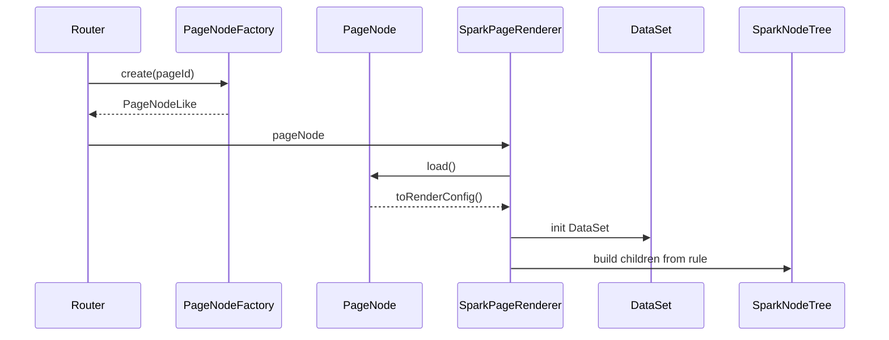

# SPARK 数据流架构

> 当前数据流从项目需求开始，经 `ProjectModel.design` 与 `ConfigPageNode` 进入稳定渲染运行时。四文件、navigation API 和 Vue 组件都是投影或消费层，不是理念入口。

## 主链路

```text
项目需求
  -> ProjectModel.design (ProjectDesign / NavigationDesign)
  -> ConfigPageNode (page / sub-page)
  -> PageNodeRenderConfig
  -> SparkPageRenderer
  -> DataSet / SparkNodeTree / script / style
  -> UI
```

## 项目节点

**存储真源**是 DB navigation 平铺行；**领域模型**用 `NavigationDesign` 持有 `nodesById` 与 `NavigationIndex`。`root`、`children`、导航树是为 UI、路由和策划遍历生成的投影，不必与表结构同构。

```text
flat node
  id
  pid
  title
  description
  nodeKind
  path
  icon
  ...
```

父子规则：

```text
项目 => 子模块 || 页面
子模块 => 子模块 || 页面
页面 => 子页面 => 子页面
```

## 页面节点

配置页节点 class：

```text
ConfigPageNode
  nodeKind = page | sub-page
  design: PageDesign (rule / dataSet / script / style)
  runtime: PageRuntime
```

导航元数据属于 `ProjectNode` 基类；`ConfigPageNode` 只扩展页面内容与运行投影。`sub-page` 不是第二套模型。系统页面走 `SystemPageNode`，只保存节点事实和组件路径，不承载四文件。

## 功能约束

每个节点的 `description` 是用户需求。生成某个页面时，父级和本级描述共同形成约束：

```text
effectiveUserRequirement =
  project.description
  + parent module descriptions
  + parent page descriptions
  + current node.description
```

消费层统一读取 `ProjectEditor.readSnapshot().pageFeatures`，不要自行拼约束链。

## 运行态



运行态边界：

- Router 只创建 `PageNodeLike`。
- Renderer 只消费 `PageNodeRenderConfig`。
- Loader、compiler、file-api、版本和导航 client 不进入 App/Renderer。
- 缺少必需四文件或配置非法时 fail-fast。

## 设计态

```text
DevSystem
  -> createProjectEditor()
  -> ProjectEditor
      -> ProjectModel.design
      -> ConfigPageNode
      -> 后端 DB + file
```

DevSystem 是消费层。它可以传入 HTTP、API path、认证头，但不能直接绕过 `ProjectEditor` 操作 DB 节点、页面文件、版本或跨项目引用。

## AI

```text
AI Host
  -> ensurePageDesignBusiness()
  -> ProjectEditor.project
  -> ProjectModel.nodes.openConfigPage(pageId)
  -> ConfigPageNode
  -> 配置页节点子模型
```

AI 写入只进入内存 PageNode 并标 dirty。保存、版本、路由刷新和发布由显式用户动作触发。

## DataSet / DataView

`pagedata.json` 进入 `ConfigPageNode.design.dataSet`，再由 Renderer 初始化 `DataSet`。组件读取必须走：

```text
dataViewKey + dataMember + dataField
```

`dataViewKey` 只定位视图：

```text
Users@grid
#scope@Users@grid
```

不要使用旧的成员拼接键、点号数据路径、`pageData` 或 `$data` 旁路。

## 不变约束

1. `spark-project-model` 保持纯模型。
2. 存储真源是 DB + 四文件；领域模型可用树与索引，树是投影。
3. `page` 和 `sub-page` 同属 `ConfigPageNode`。
4. 系统页面是 `SystemPageNode` 子类，不反向决定数据结构。
5. 四文件是页面内容投影，落盘锚点明确即可。
6. DataSet 管线单向：`pagedata.json -> DataSet -> DataViewKey -> DataView -> UI`。
