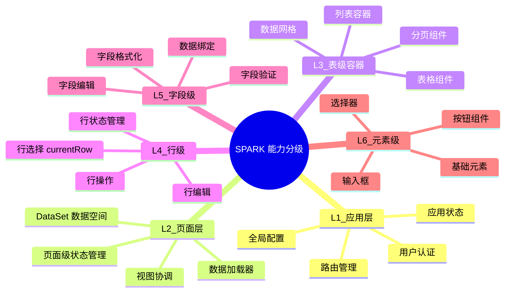
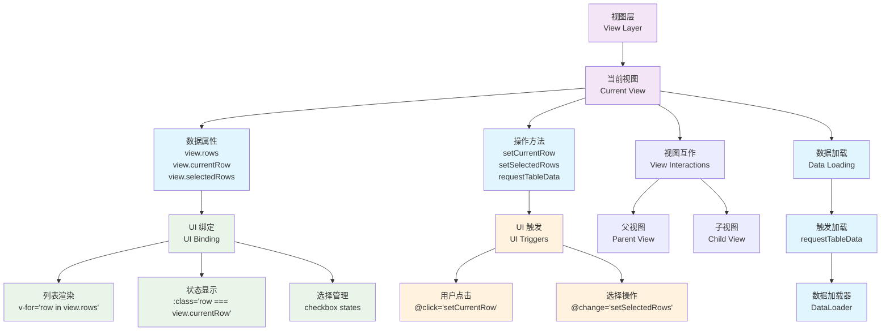
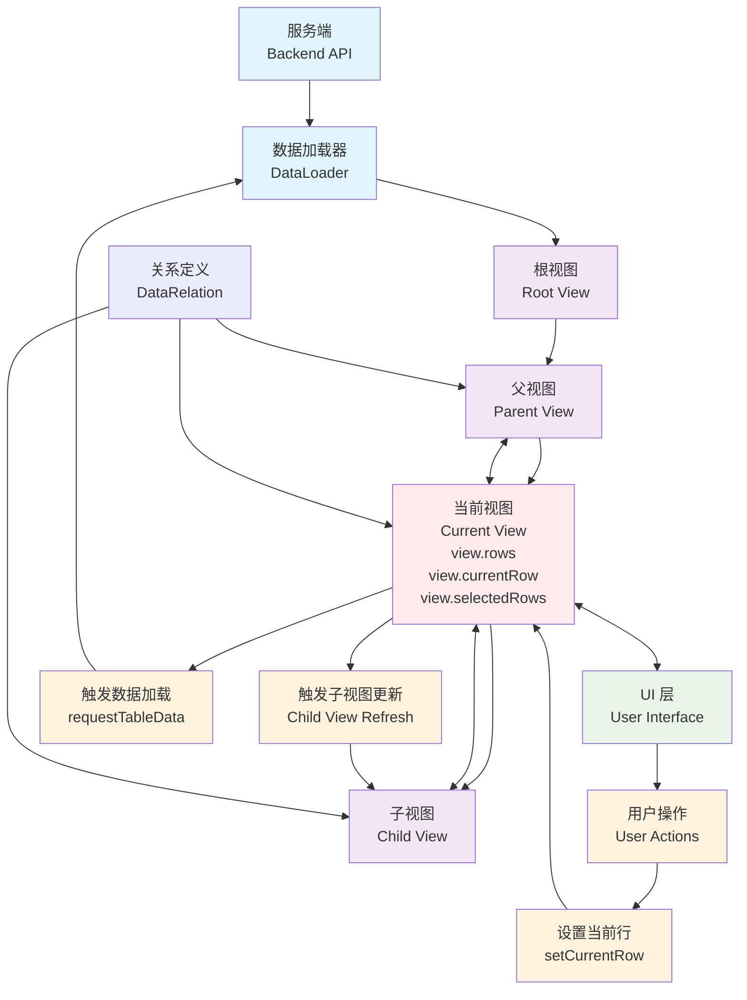

# SPARK 数据流架构 - 服务端/视图/UI 关系详解

## 📖 概述

本文档详细阐述 SPARK DataSet 架构中**服务端、视图、父视图、子视图和 UI** 之间的关系，以及数据在这些层级之间如何流动。

## 🎯 核心概念

### 能力分级体系

SPARK 架构采用分层能力体系，从应用级到元素级提供不同粒度的功能：



- **L1 应用层**：全局配置、路由、认证等应用级能力
- **L2 页面层**：DataSet 数据空间、页面级状态管理
- **L3 表级容器**：表格组件、列表容器等表级 UI 组件
- **L4 行级**：行选择、行编辑、行操作等行级交互
- **L5 字段级**：字段验证、字段格式化、字段编辑等
- **L6 元素级**：按钮、输入框等基础 UI 元素

## 🎯 视图与UI关系图

以下流程图专门展示视图层与UI层的关系，突出数据绑定和职责分工：



**视图与UI关系说明：**
- **视图层**：数据和业务逻辑的载体
- **当前视图**：UI直接绑定的视图实例 ⭐
- **数据属性**：视图暴露给UI的数据（rows、currentRow、selectedRows）
- **操作方法**：视图提供给UI的方法（setCurrentRow、setSelectedRows）
- **UI绑定**：UI通过响应式绑定显示数据和状态
- **UI触发**：UI通过事件触发视图方法
- **视图互作**：当前视图与其他视图的交互
- **数据加载**：视图层面触发的异步数据加载

## 🔗 架构依赖关系图

以下流程图展示了服务端、根视图、父视图、子视图、UI 之间的依赖关系和数据流向：



**依赖关系说明：**
- **服务端** ← **数据加载器**：通过 API 调用获取原始数据
- **数据加载器** → **根视图**：填充根视图数据
- **根视图** → **父视图** → **当前视图** → **子视图**：视图层级链
- **当前视图** ↔ **UI 层**：双向绑定 ⭐（UI 只与当前视图互作）
  - `view.rows` → UI 列表渲染
  - `view.currentRow` → UI 选中状态显示
  - `view.selectedRows` → UI 多选状态管理
  - UI 操作 → 视图状态更新
  - **重要**：UI 只能操作它所绑定的当前视图
- **当前视图** ↔ **父视图**：父子视图互作
- **当前视图** ↔ **子视图**：父子视图互作
- **视图层面触发数据加载**：当前视图调用 `requestTableData` ⭐
- **UI 层** → **用户操作**：响应交互但不直接触发数据加载
- **关系定义** ↔ **视图**：配置视图间的依赖规则

### 1. 服务端（Backend API）
- **职责**：提供原始数据源
- **特征**：
  - 无状态（Stateless）
  - RESTful API 或 GraphQL
  - 返回完整数据集（不负责过滤）
- **数据加载器**：前端通过 `dataLoader` 函数调用服务端API
  ```typescript
  // DataSet 配置中的数据加载器
  const dataSet = SparkData.createDataSet(config, async (tableName) => {
    const response = await fetch(`/api/${tableName}`)
    return response.json()
  })
  ```
- **示例**：
  ```typescript
  GET /api/departments → [{id:1, name:'IT'}, {id:2, name:'HR'}]
  GET /api/users → [{id:1, name:'Alice', departmentId:1}, ...]
  ```

### 2. DataSet（数据空间）
- **职责**：管理页面级数据视图，协调数据流
- **特征**：
  - 页面级别实例（每个业务页面一个 DataSet）
  - 管理视图实例（tables: Record<string, DataView>）
  - 定义视图关系（relations: DataRelation[]）
  - 协调 5 个核心引擎
- **核心方法**：
  ```typescript
  dataSet.getTable(tableName)           // 获取视图
  dataSet.requestTableData(tableName)   // 请求加载数据
  dataSet.addRelations([...])           // 定义关系
  dataSet.on('viewStateChanged', ...)   // 监听状态变化
  ```

### 3. 父视图（Parent View）
- **定义**：在关系定义中作为 `parentTable` 的视图，可以有自己的父视图
- **特征**：
  - 在至少一个 `DataRelation` 中作为父方
  - 管理 `currentRow`（当前选中行）
  - `currentRow` 变化会触发子视图更新
  - 可以是其他视图的子视图（多层级关系）
- **示例**：
  ```typescript
  // Departments 是父视图（但可能有自己的父视图）
  const deptView = dataSet.getTable('Departments')
  deptView.currentRow = {id: 1, name: 'IT'}  // 触发子视图更新
  ```

### 3.1 根视图（Root View）
- **定义**：最顶层的视图，没有任何父视图的视图
- **特征**：
  - 不作为任何关系的 `childTable`
  - 可以独立加载数据，无需依赖其他视图
  - 通常是数据层级结构的起点
- **示例**：
  ```typescript
  // Company 是根视图（没有任何父视图）
  const companyView = dataSet.getTable('Company')
  // 加载根视图数据
  await dataSet.requestTableData('Company')
  ```

### 4. 子视图（Child View / Dependent View）
- **定义**：依赖父视图 `currentRow` 的视图
- **特征**：
  - 有 `dependencies`（依赖父视图）
  - 数据需要过滤（根据父视图的 currentRow）
  - 父视图 `currentRow` 变化时自动更新
  - 父视图 `currentRow` 为空时清空数据
- **示例**：
  ```typescript
  // Users 是子视图（依赖 Departments）
  const usersView = dataSet.getTable('Users')
  // 当 Departments.currentRow.id = 1 时
  // Users.rows 只包含 departmentId = 1 的用户
  ```

### 5. 关系定义（Relation）
- **定义**：描述父子视图之间的依赖关系
- **配置**：
  ```typescript
  {
    parentTable: 'Departments',      // 父表名
    parentContextId: 'deptGrid',     // 父视图ID（默认'default'）
    childTable: 'Users',             // 子表名
    childContextId: 'userGrid',      // 子视图ID（默认'default'）
    dependencyType: 'currentRow',    // 依赖类型：currentRow|selectedRows|allRows|pagedRows
    filterExpression: {              // 过滤表达式（定义如何过滤子视图）
      field: 'departmentId',
      op: '==',
      value: { func: 'parentRow.id', args: [] }
    },
    autoLoad: true,                  // 自动加载子表
    cascadeDelete: true,             // 级联删除
    relationName: 'dept-users'       // 关系名称（可选）
  }
  ```
- **作用**：
  - 定义依赖条件（通过 filterExpression）
  - 自动过滤子视图数据
  - 触发级联加载和删除

### 6. UI 层
- **职责**：展示数据，响应用户操作
- **特征**：
  - 订阅视图状态变化（`viewStateChanged`）
  - 响应式渲染（Vue/React）
  - 触发数据加载（`requestTableData`）
  - 触发选中操作（`setCurrentRow`、`setSelectedRows`）
- **重要原则**：UI 只能操作它所绑定的视图，即当前视图 ⭐
  - 每个 UI 组件绑定到一个特定的视图实例
  - UI 操作（如点击、选择）只会影响当前绑定的视图
  - 视图状态变化只会更新绑定该视图的 UI 组件
- **绑定属性**：
  - `view.rows` ⭐ **最常用** - 数据行数组，用于渲染列表
  - `view.currentRow` ⭐ **最常用** - 当前选中行，用于显示选中状态
  - `view.selectedRows` - 选中的多行数据
  - `view.isLoading` - 加载状态
  - `view.totalCount` - 总记录数
- **示例**：
  ```vue
  <template>
    <div>
      <!-- ⭐ 最常用：绑定 view.rows 渲染列表 -->
      <ul v-if="!view.isLoading">
        <li v-for="row in view.rows" :key="row.id" 
            :class="{ 
              active: row === view.currentRow,  <!-- ⭐ 当前行状态 -->
              selected: view.selectedRows.includes(row)  <!-- 选择行状态 -->
            }">
          
          <!-- 选择行复选框 -->
          <input type="checkbox" 
                 :checked="view.selectedRows.includes(row)"
                 @change="toggleRowSelection(row)" />
          
          <!-- 行内容，点击设置当前行 -->
          <span @click="view.setCurrentRow(row)">
            {{ row.name }}
          </span>
        </li>
      </ul>
      
      <!-- 当前行信息 -->
      <div v-if="view.currentRow">
        当前选中：{{ view.currentRow.name }}
      </div>
      
      <!-- 选择行信息及操作 -->
      <div v-if="view.selectedRows.length > 0">
        已选择 {{ view.selectedRows.length }} 项
        <button @click="clearSelection">清空选择</button>
        <button @click="selectAll">全选</button>
      </div>
    </div>
  </template>
  
  <script setup>
  const toggleRowSelection = (row) => {
    if (view.selectedRows.includes(row)) {
      view.setSelectedRows(view.selectedRows.filter(r => r !== row))
    } else {
      view.setSelectedRows([...view.selectedRows, row])
    }
  }
  
  const clearSelection = () => {
    view.setSelectedRows([])
  }
  
  const selectAll = () => {
    view.setSelectedRows([...view.rows])
  }
  </script>
  ```

## 🔄 数据流向

### 完整流程（19 步）

```
┌─────────────────────────────────────────────────────────────┐
│ 📱 用户操作：点击"加载部门"按钮                              │
└────────────┬────────────────────────────────────────────────┘
             ▼
┌─────────────────────────────────────────────────────────────┐
│ 1️⃣ UI 层调用：dataSet.requestTableData('Departments')        │
└────────────┬────────────────────────────────────────────────┘
             ▼
┌─────────────────────────────────────────────────────────────┐
│ 2️⃣ DataLoader：检查依赖（调用 DependencyAnalyzer）           │
│    结果：Departments 无依赖，可以直接加载                     │
└────────────┬────────────────────────────────────────────────┘
             ▼
┌─────────────────────────────────────────────────────────────┐
│ 3️⃣ 父视图状态：Departments.setLoading()                      │
│    - isLoading = true                                        │
│    - 创建 AbortController                                    │
│    - 调用 onBeforeLoad 钩子                                  │
└────────────┬────────────────────────────────────────────────┘
             ▼
┌─────────────────────────────────────────────────────────────┐
│ 4️⃣ 触发事件：emit('viewStateChanged', {state:'loading'})    │
└────────────┬────────────────────────────────────────────────┘
             ▼
┌─────────────────────────────────────────────────────────────┐
│ 5️⃣ UI 响应：显示 Loading Spinner                             │
└────────────┬────────────────────────────────────────────────┘
             ▼
┌─────────────────────────────────────────────────────────────┐
│ 6️⃣ DataLoader 调用：dataLoader('Departments')                │
│    → 服务端 API: GET /api/departments                        │
└────────────┬────────────────────────────────────────────────┘
             ▼
┌─────────────────────────────────────────────────────────────┐
│ 7️⃣ 服务端返回：[{id:1, name:'IT'}, {id:2, name:'HR'}]        │
└────────────┬────────────────────────────────────────────────┘
             ▼
┌─────────────────────────────────────────────────────────────┐
│ 8️⃣ 更新父视图数据：Departments.rows = [...]                  │
└────────────┬────────────────────────────────────────────────┘
             ▼
┌─────────────────────────────────────────────────────────────┐
│ 9️⃣ 父视图状态：Departments.setReady()                        │
│    - isLoading = false                                       │
│    - 计算 loadDuration                                       │
│    - 调用 onAfterLoad 钩子                                   │
└────────────┬────────────────────────────────────────────────┘
             ▼
┌─────────────────────────────────────────────────────────────┐
│ 🔟 触发事件：emit('viewStateChanged', {state:'ready'})      │
└────────────┬────────────────────────────────────────────────┘
             ▼
┌─────────────────────────────────────────────────────────────┐
│ 1️⃣1️⃣ UI 响应：渲染部门列表                                    │
└────────────┬────────────────────────────────────────────────┘
             ▼
┌─────────────────────────────────────────────────────────────┐
│ 📱 用户操作：点击"IT 部门"                                    │
└────────────┬────────────────────────────────────────────────┘
             ▼
┌─────────────────────────────────────────────────────────────┐
│ 1️⃣2️⃣ 父视图选中：Departments.setCurrentRow({id:1, name:'IT'})│
└────────────┬────────────────────────────────────────────────┘
             ▼
┌─────────────────────────────────────────────────────────────┐
│ 1️⃣3️⃣ 触发通知：SubscriptionManager.notifySubscribers()       │
└────────────┬────────────────────────────────────────────────┘
             ▼
┌─────────────────────────────────────────────────────────────┐
│ 1️⃣4️⃣ 子视图检查：Users 检查依赖条件                           │
│    条件：Departments.currentRow !== null                     │
│    结果：✅ 依赖满足                                          │
└────────────┬────────────────────────────────────────────────┘
             ▼
┌─────────────────────────────────────────────────────────────┐
│ 1️⃣5️⃣ 子视图加载：Users.setLoading()                          │
└────────────┬────────────────────────────────────────────────┘
             ▼
┌─────────────────────────────────────────────────────────────┐
│ 1️⃣6️⃣ DataLoader 调用：dataLoader('Users')                    │
│    → 服务端 API: GET /api/users                              │
└────────────┬────────────────────────────────────────────────┘
             ▼
┌─────────────────────────────────────────────────────────────┐
│ 1️⃣7️⃣ 服务端返回：所有用户数据                                 │
│    [{id:1, name:'Alice', deptId:1}, {id:2, name:'Bob', ...}] │
└────────────┬────────────────────────────────────────────────┘
             ▼
┌─────────────────────────────────────────────────────────────┐
│ 1️⃣8️⃣ 应用过滤规则：根据 Relation 定义过滤                     │
│    过滤条件：user.departmentId === dept.currentRow.id        │
│    结果：只保留 departmentId = 1 的用户                       │
└────────────┬────────────────────────────────────────────────┘
             ▼
┌─────────────────────────────────────────────────────────────┐
│ 1️⃣9️⃣ 子视图完成：Users.setReady()                            │
│    → UI 渲染：显示 IT 部门的用户列表                          │
└─────────────────────────────────────────────────────────────┘
```

## 🏗️ 架构层级

### 从上到下的层级关系

```
┌──────────────────────────────────────┐
│          UI 层（Vue/React）            │  ← 用户交互，响应式渲染
│  • 订阅视图状态                        │
│  • 触发数据加载                        │
│  • 响应状态变化                        │
└──────────┬───────────────────────────┘
           │ 订阅/通知
           ▼
┌──────────────────────────────────────┐
│       视图状态管理层（DataView）        │  ← 状态机，生命周期
│  • 状态管理（loading/ready/error）     │
│  • 生命周期钩子                        │
│  • 取消/重试逻辑                       │
│  • 性能统计                            │
└──────────┬───────────────────────────┘
           │ 委托调用
           ▼
┌──────────────────────────────────────┐
│      数据协调层（DataSet + 引擎）       │  ← 协调器，策略层
│  • DataLoader: 智能加载                │
│  • DependencyAnalyzer: 依赖分析        │
│  • RelationEngine: 关系处理            │
│  • SubscriptionManager: 订阅管理       │
│  • EventManager: 事件系统              │
└──────────┬───────────────────────────┘
           │ 数据请求
           ▼
┌──────────────────────────────────────┐
│          数据源层（Backend API）       │  ← 无状态，纯数据
│  • RESTful API                         │
│  • GraphQL                             │
│  • 返回原始数据                        │
└──────────────────────────────────────┘
```

## 🔗 父子视图依赖链

### 单层依赖

```
Departments (父视图)
    ↓ currentRow 变化
    ├─→ Users (子视图)
    └─→ Projects (子视图)
```

### 多层依赖

```
Departments (根视图)
    ↓ currentRow 变化
    ├─→ Users (第1层子视图)
    │      ↓ currentRow 变化
    │      └─→ UserDetails (第2层子视图)
    │
    └─→ Projects (第1层子视图)
           ↓ currentRow 变化
           └─→ Tasks (第2层子视图)
                  ↓ currentRow 变化
                  └─→ Comments (第3层子视图)
```

### 依赖检查逻辑

```typescript
// 伪代码
function checkDependency(childView: DataView): boolean {
  const relation = findRelation(childView.tableName)
  const parentView = getTable(relation.parentTable)
  
  // 关键判断：父视图是否有 currentRow
  if (parentView.currentRow === null) {
    // ❌ 依赖不满足 → 清空子视图
    childView.clearAll()
    return false
  }
  
  // ✅ 依赖满足 → 加载并过滤数据
  return true
}
```

## 🎨 状态传播机制

### 父视图状态变化 → 子视图响应

```
父视图.setCurrentRow(row)
    ↓
SubscriptionManager.notifySubscribers('ParentTable')
    ↓
遍历所有子视图: for (childView of childViews)
    ↓
childView.checkDependency()
    ↓
    ├─→ 依赖满足: childView.reload()
    │      ↓
    │   从服务端加载数据
    │      ↓
    │   应用过滤规则 (filterExpression)
    │      ↓
    │   childView.setReady()
    │
    └─→ 依赖不满足: childView.clearAll()
           ↓
        childView.rows = []
           ↓
        childView.currentRow = null
```

### 级联清空

```
// 场景：用户取消父视图选中
Departments.setCurrentRow(null)
    ↓
Users.clearAll()  // 子视图清空
    ↓
UserDetails.clearAll()  // 孙视图也清空
    ↓
UI 显示"请先选择部门"
```

## 💻 实战示例

### 1. 定义父子关系

```typescript
import { DataSet } from '@spark-view/spark-data'

const dataSet = new DataSet({
  dataSetName: 'HR System',
  dataLoader: async (tableName) => {
    const response = await fetch(`/api/${tableName}`)
    return response.json()
  }
})

// 定义关系：Departments → Users
dataSet.addRelations([
  {
    parentTable: 'Departments',
    childTable: 'Users',
    dependencyType: 'currentRow',
    filterExpression: {
      field: 'departmentId',
      op: '==',
      value: { func: 'parentRow.id', args: [] }
    },
    autoLoad: true  // 父视图选中时自动加载子视图
  }
])
```

### 2. UI 组件：父视图（部门列表）

```vue
<template>
  <div class="department-list">
    <h3>部门列表</h3>
    
    <!-- Loading 状态 -->
    <div v-if="deptView.isLoading" class="loading">
      <spinner />
      <p>加载中...</p>
    </div>
    
    <!-- 数据展示 -->
    <ul v-else>
      <li v-for="dept in deptView.rows" 
          :key="dept.id"
          :class="{ active: dept.id === deptView.currentRow?.id }"
          @click="selectDept(dept)">
        {{ dept.name }}
      </li>
    </ul>
  </div>
</template>

<script setup>
import { computed, onMounted } from 'vue'
import { useDataSet } from '@spark-view/spark-data'

const dataSet = useDataSet()
const deptView = computed(() => dataSet.getTable('Departments'))

// 选中部门
function selectDept(dept) {
  deptView.value.setCurrentRow(dept)
  // 🔔 这会触发 Users 子视图自动加载
}

// 组件挂载时加载数据
onMounted(() => {
  dataSet.requestTableData('Departments')
})
</script>
```

### 3. UI 组件：子视图（用户列表）

```vue
<template>
  <div class="user-list">
    <h3>员工列表</h3>
    
    <!-- 父视图未选中 -->
    <div v-if="!deptView.currentRow" class="empty">
      <p>请先选择部门</p>
    </div>
    
    <!-- Loading 状态 -->
    <div v-else-if="usersView.isLoading" class="loading">
      <spinner />
      <p>加载员工...</p>
    </div>
    
    <!-- 数据展示 -->
    <ul v-else>
      <li v-for="user in usersView.rows" :key="user.id">
        {{ user.name }} - {{ user.position }}
      </li>
      
      <p class="info">
        共 {{ usersView.rows.length }} 名员工
      </p>
    </ul>
  </div>
</template>

<script setup>
import { computed } from 'vue'
import { useDataSet } from '@spark-view/spark-data'

const dataSet = useDataSet()
const deptView = computed(() => dataSet.getTable('Departments'))
const usersView = computed(() => dataSet.getTable('Users'))

// 🔔 无需手动加载，子视图会自动响应父视图变化
</script>
```

### 4. 高级场景：带生命周期钩子

```typescript
const usersView = dataSet.getTable('Users')

// 加载前：检查权限
usersView.onBeforeLoad = async (context) => {
  const dept = dataSet.getTable('Departments').currentRow
  
  // 检查是否有查看该部门员工的权限
  const hasPermission = await checkPermission('view_users', dept.id)
  if (!hasPermission) {
    throw new Error(`无权查看 ${dept.name} 的员工信息`)
  }
}

// 加载后：缓存数据
usersView.onAfterLoad = async (context, success) => {
  if (success) {
    const dept = dataSet.getTable('Departments').currentRow
    localStorage.setItem(
      `users_cache_${dept.id}`,
      JSON.stringify(context.rows)
    )
  }
}

// 加载失败：使用缓存兜底
usersView.onLoadError = async (context, error) => {
  const dept = dataSet.getTable('Departments').currentRow
  const cachedData = localStorage.getItem(`users_cache_${dept.id}`)
  
  if (cachedData && context.retryCount >= context.maxRetries) {
    console.log('使用缓存数据兜底')
    context.rows.splice(0, context.rows.length, ...JSON.parse(cachedData))
    await context.setReady()
  }
}
```

## 🎯 设计原则

### 1. 单向数据流
```
服务端 → DataLoader → 父视图 → 子视图 → UI
```
- 数据只能从上游流向下游
- 避免循环依赖
- 易于追踪和调试

### 2. 依赖驱动
- 子视图**完全依赖**父视图的 `currentRow`
- 父视图变化，子视图自动更新
- 父视图清空，子视图自动清空

### 3. 非阻塞加载
- UI 请求后立即返回
- 数据异步加载
- 状态变化触发 UI 更新

### 4. 事件驱动
- 所有状态变化通过事件通知
- UI 订阅事件进行响应式渲染
- 解耦视图层和 UI 层

### 5. 关注点分离

| 层级 | 职责 |
|------|------|
| 服务端 | 提供数据 |
| DataLoader | 加载策略 |
| DataView | 状态管理 |
| RelationEngine | 关系处理 |
| SubscriptionManager | 通知管理 |
| UI | 展示和交互 |

## 📊 性能优化

### 1. 智能缓存
```typescript
// 父视图数据缓存在 originalRows
const deptView = dataSet.getTable('Departments')
console.log(deptView.originalRows)  // 完整数据（未过滤）
console.log(deptView.rows)          // 当前显示数据
```

### 2. 按需加载
```typescript
// 子视图只在父视图选中时才加载
dataSet.addRelations([{
  parentTable: 'Departments',
  childTable: 'Users',
  autoLoad: true  // 仅在父视图有 currentRow 时才加载
}])
```

### 3. 防重入保护
```typescript
// DataLoader 自动防止重复加载
dataSet.requestTableData('Users')  // 第一次：正常加载
dataSet.requestTableData('Users')  // 第二次：如果正在加载，跳过
```

### 4. 增量更新
```typescript
// 只在数据真正变化时才通知 UI
if (DataLoader.areRowsEqual(existingRows, newRows)) {
  console.log('数据未变化，跳过通知')
  return
}
```

## 🚀 最佳实践

### ✅ 推荐做法

1. **明确父子关系**：在 DataSet 初始化时定义所有 Relations
2. **订阅状态变化**：UI 组件订阅 `viewStateChanged` 事件
3. **使用生命周期钩子**：在钩子中处理权限、缓存等逻辑
4. **非阻塞操作**：避免在 UI 层使用 `await dataLoader()`
5. **清晰的状态展示**：loading/error/empty/ready 四种状态都要处理

### ❌ 避免的做法

1. **直接修改 rows**：应使用 DataLoader 加载数据
2. **手动过滤子视图**：依赖 RelationEngine 自动过滤
3. **循环依赖**：A 依赖 B，B 又依赖 A
4. **忽略错误状态**：不处理 loadingError
5. **阻塞 UI**：在 UI 线程中等待数据加载

## 📚 相关文档

- [视图状态管理基础](./VIEW_STATE_MANAGEMENT.md)
- [视图状态高级特性](./VIEW_STATE_ADVANCED.md)
- [SPARK 架构概览](../SPARK_ARCHITECTURE.md)
- [依赖分析器](../../packages/spark-data/src/core/dependency-analyzer.ts)
- [关系引擎](../../packages/spark-data/src/core/relation-engine.ts)

## 🎉 总结

SPARK 数据流架构通过**清晰的层级划分**和**事件驱动机制**，实现了：

| 特性 | 实现方式 | 价值 |
|------|---------|------|
| **父子依赖** | Relation + DependencyAnalyzer | 自动级联加载，零代码实现 |
| **非阻塞体验** | 异步加载 + 状态管理 | UI 流畅，响应迅速 |
| **状态透明** | viewStateChanged 事件 | 状态可见，便于调试 |
| **解耦设计** | 分层架构 + 事件驱动 | 易于维护，可扩展 |
| **智能过滤** | RelationEngine 自动处理 | 减少冗余代码 |

通过理解**服务端 → 父视图 → 子视图 → UI** 的数据流，开发者可以构建出高效、健壮、易维护的数据驱动应用。
