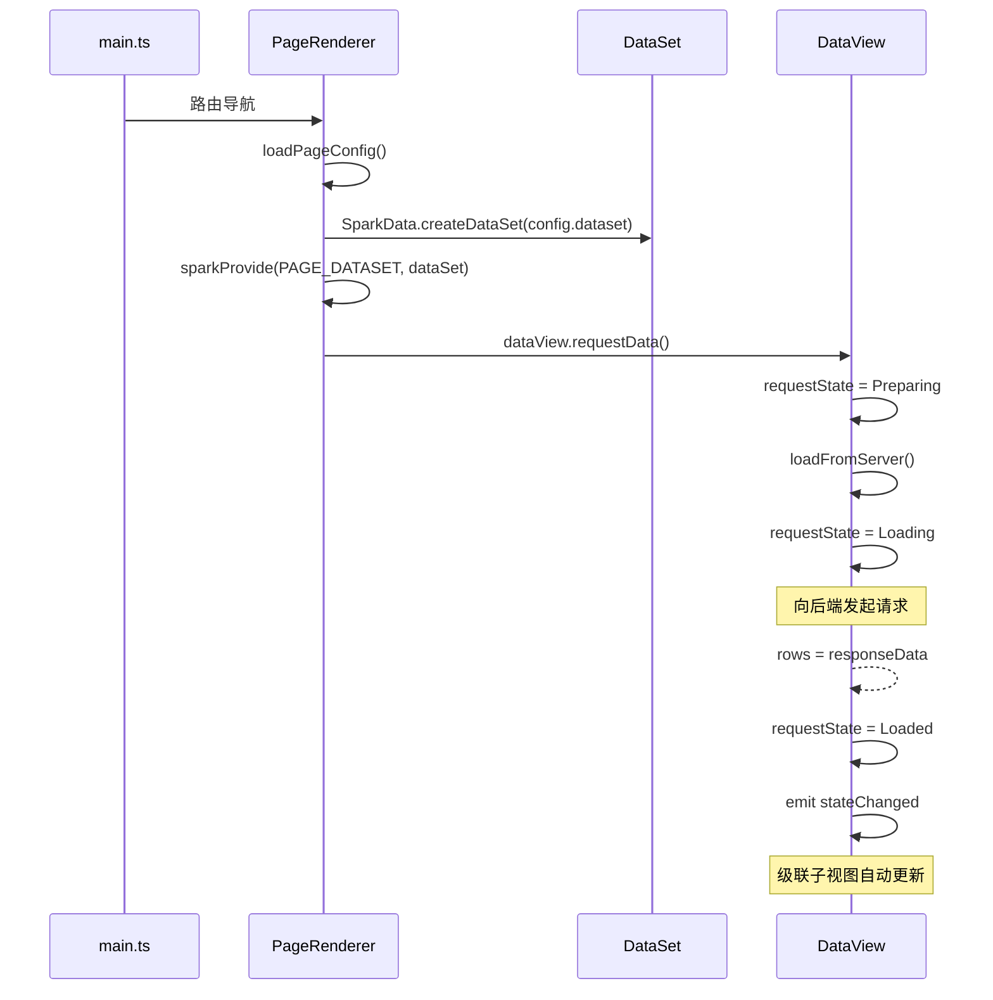

# SPARK 数据流架构

> 本文档基于实际源码描述 SPARK 从应用启动到 UI 渲染的完整数据流。

## 核心层级

```
App / main.ts
  ↓  app.use(Spark.createPlugin())
SparkPlugin
  ↓  Vue DI: SPARK_REGISTRY_KEY, internal root capability context
PageRenderer (SparkPageRenderer + useRendererSetup)
  ↓  sparkProvide(APP_SERVICES, ...)    SPARK 能力系统
  ↓  sparkProvide(PAGE_DATASET, ...)
Table容器 (e.g. r-table)
  ↓  sparkConsume(PAGE_DATASET) → DataSet
  ↓  resolveDataKeyBinding(config.dataKey, dataSet) → DataView
  ↓  sparkProvide(DATA_SOURCE, dataView)
  ↓  sparkProvide(SELECTION, ...)
Row组件 (e.g. r-row)
  ↓  sparkConsume(DATA_SOURCE) → DataView
  ↓  sparkConsume(SELECTION) → 选择状态
```

---

## 1. 应用启动（SparkPlugin）

```typescript
// main.ts
import { Spark } from '@spark-view/spark-component'
import App from './App.vue'

const app = createApp(App)
app.use(Spark.createPlugin())    // 唯一 Vue 插件，极简，只做 DI
app.mount('#app')
```

`SparkPlugin.install()` 只做两件事（见 `packages/spark-component/src/plugin.ts`）：

| 操作 | 注入键 | 内容 |
|------|--------|------|
| `app.provide(SPARK_REGISTRY_KEY, registry)` | Symbol | 组件注册表（全局单例）|
| `app.provide(INTERNAL_PARENT_CAPABILITY_CONTEXT_KEY, rootContext)` | Symbol | 根能力上下文（内部 DI）|

> **注意**：`SparkPlugin` 不提供任何业务能力（如路由、logger）。这些由应用层的 `PageRenderer` 填充。

---

## 2. 组件注册

```typescript
import { Spark } from '@spark-view/spark-component'

// 单个注册（同步）
Spark.register('my-grid', MyGrid)

// 单个注册（懒加载，推荐生产环境）
Spark.register('my-grid', () => import('./MyGrid.vue'))

// 批量注册（推荐大型项目）
const reg = Spark.createRegister(import.meta.glob('./components/*.vue'))
reg.registerAll({
  'r-table': './RendererTable.vue',
  'r-form': './RendererForm.vue',
})
```

---

## 3. 页面渲染层（PageRenderer）

`PageRenderer` 通过 `useRendererSetup` composable 完成页面级协调
（见 `packages/spark-component/src/page/useRendererSetup.ts`）：

```typescript
// SparkPageRenderer 内部（简化）
const { provideCapability } = useRendererSetup('page-renderer', pageLogger)

// 1. 注入应用服务（路由、logger、租户等）
provideCapability(APP_SERVICES, buildAppServices(router, pageLogger))

// 2. 加载页面配置并创建 DataSet
const dataSet = SparkData.createDataSet(pageConfig.dataset)

// 3. 向下提供 PAGE_DATASET
provideCapability(PAGE_DATASET, dataSet)
```

所有子组件都可通过 `sparkConsume(APP_SERVICES)` 和 `sparkConsume(PAGE_DATASET)` 获取这两个关键能力。

---

## 4. 数据层（DataSet / DataTable / DataView）

### 架构图

```
DataSet（数据空间协调器）
  ├── DataTable（表，含列定义和原始数据）
  │   ├── DataView "default"        ← 每表至少一个 DataView
  │   ├── DataView "grid"
  │   └── DataView "form"
  └── relations[]                   ← 父子视图级联关系
```

**引用链**（单向，子持有父引用）：
```
DataView → DataTable → DataSet
```
DataSet 不持有 DataView 引用，不直接操控 DataView 状态。

### DataKey 绑定键

统一格式（无 scope，SPA 单 DataSet）：`tableName@viewId@field`

```typescript
// 3段（完整）
'Users@grid@rows'
// 2段（viewId 默认 'default'）
'Users@rows'
```

| 段 | 含义 | 示例 |
|----|------|------|
| `tableName` | DataTable 的键名 | `Users` |
| `viewId` | DataView 的 viewId | `grid`、`default` |
| `field` | 绑定字段 | `rows`、`currentRow`、`selectedRows` |

```typescript
import { SparkData } from '@spark-view/spark-data'

// 解析（渲染层首选）
const binding = SparkData.resolveDataKeyBinding('Users@grid@rows', dataSet)
if (binding?.kind === 'view') {
  const dataSource: IDataSource = binding.source
}

// 构建
const key = SparkData.buildDataKey('Users', 'rows', 'grid')
// → 'Users@grid@rows'
```

### DataView 请求状态机

```
Idle ──requestData()──▶ Preparing ──loadFromServer()──▶ Loading
                                                               │
                                               ┌──────────────┴──────────────┐
                                             Loaded                        Failed
```

`requestData()` 的调用是**幂等**的：当 `requestState !== Idle` 时直接返回，无需额外保护。

### 级联加载

子视图订阅父视图的 `stateChanged` 事件（子依赖父，父不知子）：

```typescript
// DataView 内部（setupCascade）
parentView.events.on('stateChanged', (event) => {
  if (event.currentRow != null) {
    this.requestData()   // 父行变化 → 子重新加载
  }
})
```

---

## 5. 表容器（Table Container）

表容器组件（如 `RendererTable`）建立数据层与 UI 层的桥接：

```typescript
// RendererTable.vue setup（简化）
const { sparkConsume, sparkProvide } = useSparkComponent(props.config)

// 消费页面级 DataSet
const dataSet = sparkConsume(PAGE_DATASET)

// 解析 dataKey → DataView
const binding = SparkData.resolveDataKeyBinding(props.config.dataKey, dataSet)
const dataView = binding?.kind === 'view' ? binding.source : null

// 向子组件提供数据源和选择能力
sparkProvide(DATA_SOURCE, dataView)
sparkProvide(SELECTION, {
  getSelected: () => dataView?.selectedRows ?? [],
  setSelected: (rows) => { if (dataView) dataView.selectedRows = rows }
})
```

---

## 6. 能力传递链

所有能力通过 **SPARK 能力系统**（基于 `ComponentContext.capabilities` Map + 向上查找链）传递，而非 Vue DI。

```
rootContext (SparkPlugin 创建)
  capabilities = Map { }     ← 空，应用服务由 PageRenderer 填充
    ↓
PageRenderer context
  capabilities = Map {
    APP_SERVICES → { router, logger }
    PAGE_DATASET → DataSet
  }
    ↓
r-table context
  capabilities = Map {
    DATA_SOURCE  → DataView
    SELECTION    → { getSelected, setSelected }
  }
    ↓
r-row 或 r-cell context
  capabilities = Map { }      ← 叶节点，向上 lookup
```

`sparkConsume(KEY)` 沿 `parent` 链向上查找，直到根节点。返回 `null` 是正常情况（延迟绑定），不是错误。

---

## 7. 能力键一览

| 键 | 定义包 | 类型 | 提供者 | 消费者 |
|---|---|---|---|---|
| `APP_SERVICES` | `spark-utils` | `IAppServicesCapability` | PageRenderer | 任意业务组件 |
| `LOGGER` | `spark-utils` | `LoggerApi` | 自定义父组件 | `useSparkComponent`（自动）|
| `PAGE_SERVICE` | `spark-utils` | `IPageServiceCapability` | — | — |
| `PAGE_DATASET` | `spark-component` | `IDataSet` | PageRenderer | 表容器 |
| `DATA_SOURCE` | `spark-component` | `IDataSource` | 表容器 | 行/单元格 |

> `LOGGER` 的优先级由 `useSparkComponent` 内部处理：  
> `sparkConsume(ctx, LOGGER)` → `sparkConsume(ctx, APP_SERVICES).logger` → `fallback console`

---

## 8. Logger 体系

```typescript
import { LOGGER, APP_SERVICES } from '@spark-view/spark-utils'

// 覆盖子树 logger（如需自定义日志行为）
const { sparkProvide } = useSparkComponent(props.config)
sparkProvide(LOGGER, myCustomLogger)

// 应用层统一 logger（PageRenderer 已自动注入）
sparkProvide(APP_SERVICES, { logger: appLogger, router })
```

每个组件调用 `logger.info()` 时，`useSparkComponent` 内部的代理会自动解析优先级最高的可用 logger，无需手动消费。

---

## 9. Vue DI vs SPARK 能力系统

| 机制 | 实现 | 用途 |
|------|------|------|
| **SPARK 能力系统** | `ctx.capabilities` Map + `lookup()` 向上查找 | 所有业务能力 |
| **Vue DI（仅基础设施）** | `app.provide()` / `inject()` | 仅 `SPARK_REGISTRY_KEY`（注册表）和内部根能力上下文 |

`useSparkComponent` 的 `sparkProvide()` / `sparkConsume()` 是 SPARK 能力系统，**不是** Vue 的 `provide/inject`。

---

## 10. 数据加载完整时序


