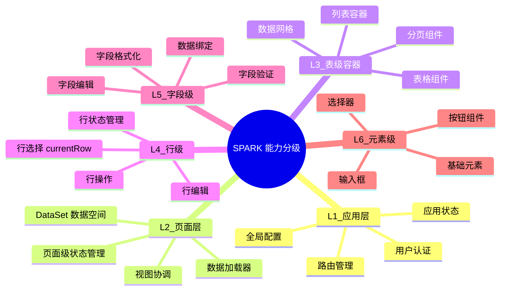
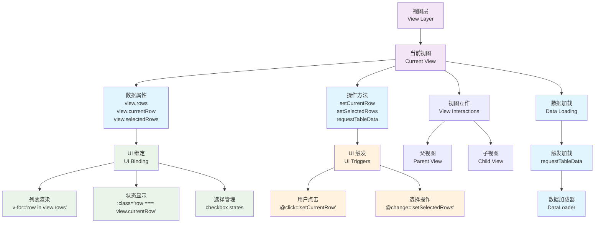
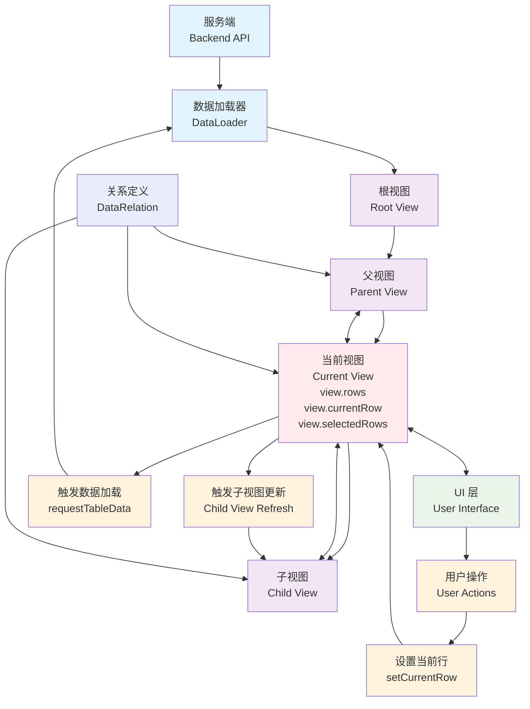

# SPARK 数据流架构 - 服务端/视图/UI 关系详解

## 📖 概述

本文档详细阐述 SPARK DataSet 架构中**服务端、视图、父视图、子视图和 UI** 之间的关系，以及数据在这些层级之间如何流动。

## 🎯 核心概念

### 能力分级体系

SPARK 架构采用分层能力体系，从应用级到元素级提供不同粒度的功能：



### 层级调用关系

```
用户代码/框架 ← 调用 → L1 应用层 ← 调用 → L2 页面层 ← 调用 → L3 表级容器 ← 调用 → L4 行级 ← 调用 → L5 字段级 ← 调用 → L6 元素级
     ↑                      ↑              ↑              ↑              ↑              ↑              ↑
   外部系统              应用就绪        页面逻辑       表格操作        行操作         字段操作       元素交互
   测试代码              配置变化        数据加载       行选择         字段编辑       基础交互
   集成工具              用户登录        状态管理       分页排序       验证格式       样式控制
```

**应用层（L1）作为顶层：**
- **向下提供**：给 L2-L6 层使用的全局能力
- **向上提供**：给**用户代码、框架、外部系统**使用的应用接口

### 应用层的消费者

**1. 用户业务代码**
```typescript
// main.ts - 用户代码调用应用层
const app = SparkApp.create()
app.getConfig()  // 获取应用配置
app.navigateTo('/users')  // 路由跳转
app.setTheme('dark')  // 设置主题

// 监听应用事件
app.on('appReady', () => console.log('应用就绪'))
app.on('userLogin', (user) => console.log('用户登录:', user))
```

**2. 框架代码**
```typescript
// 框架内部调用应用层
const app = getCurrentApp()
await app.init()  // 初始化应用
app.emit('configChanged', newConfig)  // 触发配置变化
```

**3. 外部集成系统**
```typescript
// 第三方插件或微前端
const app = window.SPARK_APP
app.navigateTo('/dashboard')  // 跨应用导航
app.on('userLogin', handleLogin)  // 监听登录事件
```

**4. 测试代码**
```typescript
// 单元测试
const mockApp = createMockApp()
mockApp.getConfig.mockReturnValue(testConfig)
mockApp.navigateTo.mockImplementation((path) => { /* 断言 */ })
```

### 完整的接口定义

```typescript
interface ApplicationLayer {
  // 标准方法（给用户代码/框架调用）
  getConfig(): AppConfig
  navigateTo(path: string): Promise<void>
  setTheme(theme: 'light' | 'dark'): void
  login(credentials: LoginData): Promise<User>
  logout(): Promise<void>
  
  // 事件（给用户代码/框架监听）
  on(event: 'appReady', handler: () => void): void
  on(event: 'configChanged', handler: (config: AppConfig) => void): void
  on(event: 'userLogin', handler: (user: User) => void): void
  on(event: 'userLogout', handler: () => void): void
  
  // 内部方法（框架使用）
  init(): Promise<void>
  destroy(): Promise<void>
}
```

### 具体示例

**L6 元素级** → **给 L5 字段级调用**
```typescript
// 元素级提供标准方法
interface ElementLayer {
  setValue(value: any): void
  getValue(): any
  setDisabled(disabled: boolean): void
  focus(): void
}

// 字段级调用元素级方法
class FieldLayer {
  constructor(private element: ElementLayer) {}
  
  // 字段级业务逻辑
  validateAndSetValue(value: any) {
    if (this.isValid(value)) {
      this.element.setValue(value)  // 调用下层方法
    }
  }
}
```

**L5 字段级** → **给 L4 行级调用**
```typescript
// 字段级提供标准方法
interface FieldLayer {
  setFieldValue(value: any): void
  getFieldValue(): any
  validate(): ValidationResult
  setReadOnly(readOnly: boolean): void
}

// 行级调用字段级方法
class RowLayer {
  constructor(private fields: FieldLayer[]) {}
  
  // 行级业务逻辑
  saveRow() {
    const isValid = this.fields.every(f => f.validate().isValid)
    if (isValid) {
      this.fields.forEach(f => f.setReadOnly(true))  // 调用下层方法
    }
  }
}
```

**L4 行级** → **给 L3 表级容器调用**
```typescript
// 行级提供标准方法
interface RowLayer {
  selectRow(): void
  editRow(): void
  deleteRow(): void
  getRowData(): DataRow
}

// 表级容器调用行级方法
class TableContainerLayer {
  constructor(private rows: RowLayer[]) {}
  
  // 表级业务逻辑
  selectAllRows() {
    this.rows.forEach(row => row.selectRow())  // 调用下层方法
  }
}
```

**以此类推：**
- **L3 表级容器** → 给 L2 页面层调用
- **L2 页面层** → 给 L1 应用层调用
- **L1 应用层** → 给用户代码/框架调用

### 设计原则

1. **上层调用下层**：标准方法由上层调用，下层实现
2. **下层向上层发送事件**：状态变化通过事件通知上层
3. **接口标准化**：每层提供统一的调用接口
4. **依赖倒置**：上层依赖抽象接口，不依赖具体实现

## 🎯 视图与UI关系图

以下流程图专门展示视图层与UI层的关系，突出数据绑定和职责分工：



**视图与UI关系说明：**
- **视图层**：数据和业务逻辑的载体
- **当前视图**：UI直接绑定的视图实例 ⭐
- **数据属性**：视图暴露给UI的数据（rows、currentRow、selectedRows）
- **操作方法**：视图提供给UI的方法（setCurrentRow、setSelectedRows）
- **UI绑定**：UI通过响应式绑定显示数据和状态
- **UI触发**：UI通过事件触发视图方法
- **视图互作**：当前视图与其他视图的交互
- **数据加载**：视图层面触发的异步数据加载

## 🔗 架构依赖关系图

以下流程图展示了服务端、根视图、父视图、子视图、UI 之间的依赖关系和数据流向：



**依赖关系说明：**
- **服务端** ← **数据加载器**：通过 API 调用获取原始数据
- **数据加载器** → **根视图**：填充根视图数据
- **根视图** → **父视图** → **当前视图** → **子视图**：视图层级链
- **当前视图** ↔ **UI 层**：双向绑定 ⭐（UI 只与当前视图互作）
  - `view.rows` → UI 列表渲染
  - `view.currentRow` → UI 选中状态显示
  - `view.selectedRows` → UI 多选状态管理
  - UI 操作 → 视图状态更新
  - **重要**：UI 只能操作它所绑定的当前视图
- **当前视图** ↔ **父视图**：父子视图互作
- **当前视图** ↔ **子视图**：父子视图互作
- **视图层面触发数据加载**：当前视图调用 `requestTableData` ⭐
- **UI 层** → **用户操作**：响应交互但不直接触发数据加载
- **关系定义** ↔ **视图**：配置视图间的依赖规则

### 1. 服务端（Backend API）
- **职责**：提供原始数据源
- **特征**：
  - 无状态（Stateless）
  - RESTful API 或 GraphQL
  - 返回完整数据集（不负责过滤）
- **数据加载器**：前端通过 `dataLoader` 函数调用服务端API
  ```typescript
  // DataSet 配置中的数据加载器
  const dataSet = SparkData.createDataSet(config, async (tableName) => {
    const response = await fetch(`/api/${tableName}`)
    return response.json()
  })
  ```
- **示例**：
  ```typescript
  GET /api/departments → [{id:1, name:'IT'}, {id:2, name:'HR'}]
  GET /api/users → [{id:1, name:'Alice', departmentId:1}, ...]
  ```

### 2. DataSet（数据空间）
- **职责**：管理页面级数据视图，协调数据流
- **特征**：
  - 页面级别实例（每个业务页面一个 DataSet）
  - 管理视图实例（tables: Record<string, DataView>）
  - 定义视图关系（relations: DataRelation[]）
  - 协调 5 个核心引擎
- **核心方法**：
  ```typescript
  dataSet.getTable(tableName)           // 获取视图
  dataSet.requestTableData(tableName)   // 请求加载数据
  dataSet.addRelations([...])           // 定义关系
  dataSet.on('viewStateChanged', ...)   // 监听状态变化
  ```

### 3. 父视图（Parent View）
- **定义**：在关系定义中作为 `parentTable` 的视图，可以有自己的父视图
- **特征**：
  - 在至少一个 `DataRelation` 中作为父方
  - 管理 `currentRow`（当前选中行）
  - `currentRow` 变化会触发子视图更新
  - 可以是其他视图的子视图（多层级关系）
- **示例**：
  ```typescript
  // Departments 是父视图（但可能有自己的父视图）
  const deptView = dataSet.getTable('Departments')
  deptView.currentRow = {id: 1, name: 'IT'}  // 触发子视图更新
  ```

### 3.1 根视图（Root View）
- **定义**：最顶层的视图，没有任何父视图的视图
- **特征**：
  - 不作为任何关系的 `childTable`
  - 可以独立加载数据，无需依赖其他视图
  - 通常是数据层级结构的起点
- **示例**：
  ```typescript
  // Company 是根视图（没有任何父视图）
  const companyView = dataSet.getTable('Company')
  // 加载根视图数据
  await dataSet.requestTableData('Company')
  ```

### 4. 子视图（Child View / Dependent View）
- **定义**：依赖父视图 `currentRow` 的视图
- **特征**：
  - 有 `dependencies`（依赖父视图）
  - 数据需要过滤（根据父视图的 currentRow）
  - 父视图 `currentRow` 变化时自动更新
  - 父视图 `currentRow` 为空时清空数据
- **示例**：
  ```typescript
  // Users 是子视图（依赖 Departments）
  const usersView = dataSet.getTable('Users')
  // 当 Departments.currentRow.id = 1 时
  // Users.rows 只包含 departmentId = 1 的用户
  ```

### 5. 关系定义（Relation）
- **定义**：描述父子视图之间的依赖关系
- **配置**：
  ```typescript
  {
    parentTable: 'Departments',      // 父表名
    parentViewId: 'deptGrid',        // 父视图ID（默认'default'）
    childTable: 'Users',             // 子表名
    childViewId: 'userGrid',         // 子视图ID（默认'default'）
    dependencyType: 'currentRow',    // 依赖类型：currentRow|selectedRows|allRows|pagedRows
    filterExpression: {              // 过滤表达式（定义如何过滤子视图）
      field: 'departmentId',
      op: '==',
      value: { func: 'parentRow.id', args: [] }
    },
    autoLoad: true,                  // 自动加载子表
    cascadeDelete: true,             // 级联删除
    relationName: 'dept-users'       // 关系名称（可选）
  }
  ```
- **作用**：
  - 定义依赖条件（通过 filterExpression）
  - 自动过滤子视图数据
  - 触发级联加载和删除

### 6. UI 层
- **职责**：展示数据，响应用户操作
- **特征**：
  - 订阅视图状态变化（`viewStateChanged`）
  - 响应式渲染（Vue/React）
  - 触发数据加载（`requestTableData`）
  - 触发选中操作（`setCurrentRow`、`setSelectedRows`）
- **重要原则**：UI 只能操作它所绑定的视图，即当前视图 ⭐
  - 每个 UI 组件绑定到一个特定的视图实例
  - UI 操作（如点击、选择）只会影响当前绑定的视图
  - 视图状态变化只会更新绑定该视图的 UI 组件
- **绑定属性**：
  - `view.rows` ⭐ **最常用** - 数据行数组，用于渲染列表
  - `view.currentRow` ⭐ **最常用** - 当前选中行，用于显示选中状态
  - `view.selectedRows` - 选中的多行数据
  - `view.requestState` - 请求状态（`RequestState.Idle/Loading/Loaded/Failed`）
  - `view.totalCount` - 总记录数
- **示例**：
  ```vue
  <template>
    <div>
      <!-- ⭐ 最常用：绑定 view.rows 渲染列表 -->
      <ul v-if="view.requestState !== 'loading'">
        <li v-for="row in view.rows" :key="row.id" 
            :class="{ 
              active: row === view.currentRow,  <!-- ⭐ 当前行状态 -->
              selected: view.selectedRows.includes(row)  <!-- 选择行状态 -->
            }">
          
          <!-- 选择行复选框 -->
          <input type="checkbox" 
                 :checked="view.selectedRows.includes(row)"
                 @change="toggleRowSelection(row)" />
          
          <!-- 行内容，点击设置当前行 -->
          <span @click="view.setCurrentRow(row)">
            {{ row.name }}
          </span>
        </li>
      </ul>
      
      <!-- 当前行信息 -->
      <div v-if="view.currentRow">
        当前选中：{{ view.currentRow.name }}
      </div>
      
      <!-- 选择行信息及操作 -->
      <div v-if="view.selectedRows.length > 0">
        已选择 {{ view.selectedRows.length }} 项
        <button @click="clearSelection">清空选择</button>
        <button @click="selectAll">全选</button>
      </div>
    </div>
  </template>
  
  <script setup>
  const toggleRowSelection = (row) => {
    if (view.selectedRows.includes(row)) {
      view.setSelectedRows(view.selectedRows.filter(r => r !== row))
    } else {
      view.setSelectedRows([...view.selectedRows, row])
    }
  }
  
  const clearSelection = () => {
    view.setSelectedRows([])
  }
  
  const selectAll = () => {
    view.setSelectedRows([...view.rows])
  }
  </script>
  ```

## 🔄 数据流向

### 完整流程（19 步）

```
┌─────────────────────────────────────────────────────────────┐
│ 📱 用户操作：点击"加载部门"按钮                              │
└────────────┬────────────────────────────────────────────────┘
             ▼
┌─────────────────────────────────────────────────────────────┐
│ 1️⃣ UI 层调用：dataSet.requestTableData('Departments')        │
└────────────┬────────────────────────────────────────────────┘
             ▼
┌─────────────────────────────────────────────────────────────┐
│ 2️⃣ DataSet.requestTableData：检查依赖                         │
│    结果：Departments 无依赖，可以直接加载                     │
└────────────┬────────────────────────────────────────────────┘
             ▼
┌─────────────────────────────────────────────────────────────┐
│ 3️⃣ 父视图状态：Departments 开始加载                           │
│    - requestState = RequestState.Loading                     │
│    - 创建 AbortController                                    │
│    - 调用 onBeforeLoad 钩子                                  │
└────────────┬────────────────────────────────────────────────┘
             ▼
┌─────────────────────────────────────────────────────────────┐
│ 4️⃣ 触发事件：emit('viewStateChanged', {state:'loading'})    │
└────────────┬────────────────────────────────────────────────┘
             ▼
┌─────────────────────────────────────────────────────────────┐
│ 5️⃣ UI 响应：显示 Loading Spinner                             │
└────────────┬────────────────────────────────────────────────┘
             ▼
┌─────────────────────────────────────────────────────────────┐
│ 6️⃣ 视图加载：Departments.loadFromServer()                     │
│    → 服务端 API: GET /api/departments                        │
└────────────┬────────────────────────────────────────────────┘
             ▼
┌─────────────────────────────────────────────────────────────┐
│ 7️⃣ 服务端返回：[{id:1, name:'IT'}, {id:2, name:'HR'}]        │
└────────────┬────────────────────────────────────────────────┘
             ▼
┌─────────────────────────────────────────────────────────────┐
│ 8️⃣ 更新父视图数据：Departments.rows = [...]                  │
└────────────┬────────────────────────────────────────────────┘
             ▼
┌─────────────────────────────────────────────────────────────┐
│ 9️⃣ 父视图状态：Departments 加载完成                           │
│    - requestState = RequestState.Loaded                      │
│    - 计算 loadDuration                                       │
│    - 调用 onAfterLoad 钩子                                   │
└────────────┬────────────────────────────────────────────────┘
             ▼
┌─────────────────────────────────────────────────────────────┐
│ 🔟 触发事件：emit('viewStateChanged', {state:'ready'})      │
└────────────┬────────────────────────────────────────────────┘
             ▼
┌─────────────────────────────────────────────────────────────┐
│ 1️⃣1️⃣ UI 响应：渲染部门列表                                    │
└────────────┬────────────────────────────────────────────────┘
             ▼
┌─────────────────────────────────────────────────────────────┐
│ 📱 用户操作：点击"IT 部门"                                    │
└────────────┬────────────────────────────────────────────────┘
             ▼
┌─────────────────────────────────────────────────────────────┐
│ 1️⃣2️⃣ 父视图选中：Departments.setCurrentRow({id:1, name:'IT'})│
└────────────┬────────────────────────────────────────────────┘
             ▼
┌─────────────────────────────────────────────────────────────┐
│ 1️⃣3️⃣ 触发通知：events.emit('stateChanged')                   │
└────────────┬────────────────────────────────────────────────┘
             ▼
┌─────────────────────────────────────────────────────────────┐
│ 1️⃣4️⃣ 子视图检查：Users 检查依赖条件                           │
│    条件：Departments.currentRow !== null                     │
│    结果：✅ 依赖满足                                          │
└────────────┬────────────────────────────────────────────────┘
             ▼
┌─────────────────────────────────────────────────────────────┐
│ 1️⃣5️⃣ 子视图加载：Users requestState → Loading               │
└────────────┬────────────────────────────────────────────────┘
             ▼
┌─────────────────────────────────────────────────────────────┐
│ 1️⃣6️⃣ 视图加载：Users.loadFromServer()                        │
│    → 服务端 API: GET /api/users                              │
└────────────┬────────────────────────────────────────────────┘
             ▼
┌─────────────────────────────────────────────────────────────┐
│ 1️⃣7️⃣ 服务端返回：所有用户数据                                 │
│    [{id:1, name:'Alice', deptId:1}, {id:2, name:'Bob', ...}] │
└────────────┬────────────────────────────────────────────────┘
             ▼
┌─────────────────────────────────────────────────────────────┐
│ 1️⃣8️⃣ 应用过滤规则：根据 Relation 定义过滤                     │
│    过滤条件：user.departmentId === dept.currentRow.id        │
│    结果：只保留 departmentId = 1 的用户                       │
└────────────┬────────────────────────────────────────────────┘
             ▼
┌─────────────────────────────────────────────────────────────┐
│ 1️⃣9️⃣ 子视图完成：Users.setReady()                            │
│    → UI 渲染：显示 IT 部门的用户列表                          │
└─────────────────────────────────────────────────────────────┘
```

## 🏗️ 架构层级

### 从上到下的层级关系

```
┌──────────────────────────────────────┐
│          UI 层（Vue/React）            │  ← 用户交互，响应式渲染
│  • 订阅视图状态                        │
│  • 触发数据加载                        │
│  • 响应状态变化                        │
└──────────┬───────────────────────────┘
           │ 订阅/通知
           ▼
┌──────────────────────────────────────┐
│       视图状态管理层（DataView）        │  ← 状态机，生命周期
│  • 状态管理（loading/ready/error）     │
│  • 生命周期钩子                        │
│  • 取消/重试逻辑                       │
│  • 性能统计                            │
└──────────┬───────────────────────────┘
           │ 委托调用
           ▼
┌──────────────────────────────────────┐
│      数据协调层（DataSet + 引擎）       │  ← 协调器，策略层
│  • DataView.setupCascade: 级联联动      │
│  • DataView.respondToParentChange       │
│  • DataEventHub: 统一事件中枢           │
└──────────┬───────────────────────────┘
           │ 数据请求
           ▼
┌──────────────────────────────────────┐
│          数据源层（Backend API）       │  ← 无状态，纯数据
│  • RESTful API                         │
│  • GraphQL                             │
│  • 返回原始数据                        │
└──────────────────────────────────────┘
```

## 🔗 父子视图依赖链

### 单层依赖

```
Departments (父视图)
    ↓ currentRow 变化
    ├─→ Users (子视图)
    └─→ Projects (子视图)
```

### 多层依赖

```
Departments (根视图)
    ↓ currentRow 变化
    ├─→ Users (第1层子视图)
    │      ↓ currentRow 变化
    │      └─→ UserDetails (第2层子视图)
    │
    └─→ Projects (第1层子视图)
           ↓ currentRow 变化
           └─→ Tasks (第2层子视图)
                  ↓ currentRow 变化
                  └─→ Comments (第3层子视图)
```

### 依赖检查逻辑

```typescript
// 伪代码
function checkDependency(childView: DataView): boolean {
  const relation = findRelation(childView.tableName)
  const parentView = getTable(relation.parentTable)
  
  // 关键判断：父视图是否有 currentRow
  if (parentView.currentRow === null) {
    // ❌ 依赖不满足 → 清空子视图
    childView.clearAll()
    return false
  }
  
  // ✅ 依赖满足 → 加载并过滤数据
  return true
}
```

## 🎨 状态传播机制

### 父视图状态变化 → 子视图响应

```
父视图.setCurrentRow(row)
    ↓
events.emit('stateChanged', { changeType: 'currentRow' })
    ↓
级联子视图: respondToParentChange()
    ↓
childView.checkDependency()
    ↓
    ├─→ 依赖满足: childView.reload()
    │      ↓
    │   从服务端加载数据
    │      ↓
    │   应用过滤规则 (filterExpression)
    │      ↓
    │   childView.setReady()
    │
    └─→ 依赖不满足: childView.clearAll()
           ↓
        childView.rows = []
           ↓
        childView.currentRow = null
```

### 级联清空

```
// 场景：用户取消父视图选中
Departments.setCurrentRow(null)
    ↓
Users.clearAll()  // 子视图清空
    ↓
UserDetails.clearAll()  // 孙视图也清空
    ↓
UI 显示"请先选择部门"
```

## 💻 实战示例

### 1. 定义父子关系

```typescript
import { DataSet } from '@spark-view/spark-data'

const dataSet = new DataSet({
  dataSetName: 'HR System',
  dataLoader: async (tableName) => {
    const response = await fetch(`/api/${tableName}`)
    return response.json()
  }
})

// 定义关系：Departments → Users
dataSet.addRelations([
  {
    parentTable: 'Departments',
    childTable: 'Users',
    dependencyType: 'currentRow',
    filterExpression: {
      field: 'departmentId',
      op: '==',
      value: { func: 'parentRow.id', args: [] }
    },
    autoLoad: true  // 父视图选中时自动加载子视图
  }
])
```

### 2. UI 组件：父视图（部门列表）

```vue
<template>
  <div class="department-list">
    <h3>部门列表</h3>
    
    <!-- Loading 状态 -->
    <div v-if="deptView.requestState === 'loading'" class="loading">
      <spinner />
      <p>加载中...</p>
    </div>
    
    <!-- 数据展示 -->
    <ul v-else>
      <li v-for="dept in deptView.rows" 
          :key="dept.id"
          :class="{ active: dept.id === deptView.currentRow?.id }"
          @click="selectDept(dept)">
        {{ dept.name }}
      </li>
    </ul>
  </div>
</template>

<script setup>
import { computed, onMounted } from 'vue'
import { useDataSet } from '@spark-view/spark-data'

const dataSet = useDataSet()
const deptView = computed(() => dataSet.getTable('Departments'))

// 选中部门
function selectDept(dept) {
  deptView.value.setCurrentRow(dept)
  // 🔔 这会触发 Users 子视图自动加载
}

// 组件挂载时加载数据
onMounted(() => {
  dataSet.requestTableData('Departments')
})
</script>
```

### 3. UI 组件：子视图（用户列表）

```vue
<template>
  <div class="user-list">
    <h3>员工列表</h3>
    
    <!-- 父视图未选中 -->
    <div v-if="!deptView.currentRow" class="empty">
      <p>请先选择部门</p>
    </div>
    
    <!-- Loading 状态 -->
    <div v-else-if="usersView.requestState === 'loading'" class="loading">
      <spinner />
      <p>加载员工...</p>
    </div>
    
    <!-- 数据展示 -->
    <ul v-else>
      <li v-for="user in usersView.rows" :key="user.id">
        {{ user.name }} - {{ user.position }}
      </li>
      
      <p class="info">
        共 {{ usersView.rows.length }} 名员工
      </p>
    </ul>
  </div>
</template>

<script setup>
import { computed } from 'vue'
import { useDataSet } from '@spark-view/spark-data'

const dataSet = useDataSet()
const deptView = computed(() => dataSet.getTable('Departments'))
const usersView = computed(() => dataSet.getTable('Users'))

// 🔔 无需手动加载，子视图会自动响应父视图变化
</script>
```

### 4. 高级场景：带生命周期钩子

```typescript
const usersView = dataSet.getTable('Users')

// 加载前：检查权限
usersView.onBeforeLoad = async (context) => {
  const dept = dataSet.getTable('Departments').currentRow
  
  // 检查是否有查看该部门员工的权限
  const hasPermission = await checkPermission('view_users', dept.id)
  if (!hasPermission) {
    throw new Error(`无权查看 ${dept.name} 的员工信息`)
  }
}

// 加载后：缓存数据
usersView.onAfterLoad = async (context, success) => {
  if (success) {
    const dept = dataSet.getTable('Departments').currentRow
    localStorage.setItem(
      `users_cache_${dept.id}`,
      JSON.stringify(context.rows)
    )
  }
}

// 加载失败：使用缓存兜底
usersView.onLoadError = async (context, error) => {
  const dept = dataSet.getTable('Departments').currentRow
  const cachedData = localStorage.getItem(`users_cache_${dept.id}`)
  
  if (cachedData && context.retryCount >= context.maxRetries) {
    console.log('使用缓存数据兜底')
    context.rows.splice(0, context.rows.length, ...JSON.parse(cachedData))
    await context.setReady()
  }
}
```

## 🎯 设计原则

### 1. 单向数据流
```
服务端 → DataLoader → 父视图 → 子视图 → UI
```
- 数据只能从上游流向下游
- 避免循环依赖
- 易于追踪和调试

### 2. 依赖驱动
- 子视图**完全依赖**父视图的 `currentRow`
- 父视图变化，子视图自动更新
- 父视图清空，子视图自动清空

### 3. 非阻塞加载
- UI 请求后立即返回
- 数据异步加载
- 状态变化触发 UI 更新

### 4. 事件驱动
- 所有状态变化通过事件通知
- UI 订阅事件进行响应式渲染
- 解耦视图层和 UI 层

### 5. 关注点分离

| 层级 | 职责 |
|------|------|
| 服务端 | 提供数据 |
| DataView | 状态管理 + 加载 |
| DataView.setupCascade | 级联联动 |
| DataEventHub | 事件通知 |
| UI | 展示和交互 |

## 📊 性能优化

### 1. 智能缓存
```typescript
// 父视图数据
const deptView = dataSet.getTable('Departments')
console.log(deptView.rows)          // 当前显示数据
```

### 2. 按需加载
```typescript
// 子视图只在父视图选中时才加载
dataSet.addRelations([{
  parentTable: 'Departments',
  childTable: 'Users',
  autoLoad: true  // 仅在父视图有 currentRow 时才加载
}])
```

### 3. 防重入保护
```typescript
// DataLoader 自动防止重复加载
dataSet.requestTableData('Users')  // 第一次：正常加载
dataSet.requestTableData('Users')  // 第二次：如果正在加载，跳过
```

### 4. 增量更新
```typescript
// 只在数据真正变化时才通知 UI
if (DataLoader.areRowsEqual(existingRows, newRows)) {
  console.log('数据未变化，跳过通知')
  return
}
```

## 🚀 最佳实践

### ✅ 推荐做法

1. **明确父子关系**：在 DataSet 初始化时定义所有 Relations
2. **订阅状态变化**：UI 组件订阅 `viewStateChanged` 事件
3. **使用生命周期钩子**：在钩子中处理权限、缓存等逻辑
4. **非阻塞操作**：避免在 UI 层使用 `await dataLoader()`
5. **清晰的状态展示**：loading/error/empty/ready 四种状态都要处理

### ❌ 避免的做法

1. **直接修改 rows**：应使用 `DataView.loadFromServer()` 加载数据
2. **手动过滤子视图**：依赖 `setupCascade` / `respondToParentChange` 自动处理
3. **循环依赖**：A 依赖 B，B 又依赖 A
4. **忽略错误状态**：不处理 loadingError
5. **阻塞 UI**：在 UI 线程中等待数据加载

## 📚 相关文档

- [数据管理指南（含视图状态）](../guides/DATA_MANAGEMENT.md)
- [数据视图](../../packages/spark-data/src/data-view.ts)（含 `setupCascade` / `respondToParentChange`）
- [事件中枢](../../packages/spark-data/src/core/DataEventHub.ts)

## 🎉 总结

SPARK 数据流架构通过**清晰的层级划分**和**事件驱动机制**，实现了：

| 特性 | 实现方式 | 价值 |
|------|---------|------|
| **父子依赖** | Relation + setupCascade | 自动级联加载，零代码实现 |
| **非阻塞体验** | 异步加载 + 状态管理 | UI 流畅，响应迅速 |
| **状态透明** | viewStateChanged 事件 | 状态可见，便于调试 |
| **解耦设计** | 分层架构 + 事件驱动 | 易于维护，可扩展 |
| **智能过滤** | RelationEngine 自动处理 | 减少冗余代码 |

通过理解**服务端 → 父视图 → 子视图 → UI** 的数据流，开发者可以构建出高效、健壮、易维护的数据驱动应用。

## 🔄 响应式选择管理器设计

基于你的程序化控制思路，我们可以设计一个更精细的响应式选择管理器：

```typescript
// 响应式选择集合
interface ReactiveSelection {
  // 添加选择
  add(rowIndex: number): void
  
  // 删除选择  
  del(rowIndex: number): void
  
  // 批量设置
  set(indices: number[]): void
  
  // 清空选择
  clear(): void
  
  // 获取当前选择
  get(): number[]
  
  // 选择变化事件
  onChange(handler: (selectedIndices: number[]) => void): void
}

// L3 表级容器的选择管理
interface TableContainerLayer {
  // 响应式选择管理器
  readonly selection: ReactiveSelection
  
  // 选择相关的业务方法
  selectAll(): void
  selectNone(): void
  invertSelection(): void
}

// 使用示例
const table = createTableContainer(config)

// 程序化控制
table.selection.add(0)    // 选择第1行
table.selection.add(2)    // 选择第3行  
table.selection.del(0)    // 取消选择第1行

// UI自动响应
table.selection.onChange((selectedIndices) => {
  console.log('当前选择:', selectedIndices)
  // UI自动更新选中状态
})

// 依赖通知子视图
table.selection.onChange((selectedIndices) => {
  // 根据DataRelation配置，通知相关子视图
  notifyDependentViews(selectedIndices)
})
```

### 依赖通知机制

**自动依赖分析**：
```typescript
interface DependencyAnalyzer {
  // 分析选择变化对子视图的影响
  analyzeSelectionImpact(
    tableName: string, 
    selectedIndices: number[]
  ): DependentViewUpdate[]
  
  // 执行级联更新
  executeUpdates(updates: DependentViewUpdate[]): Promise<void>
}

interface DependentViewUpdate {
  viewId: string
  action: 'reload' | 'filter' | 'refresh'
  params?: any
}
```

**工作流程**：
```
用户选择行 → table.selection.add() → 触发onChange → 
UI自动更新 → 依赖分析器分析影响 → 通知子视图更新
```

这个设计既保持了精细的控制能力，又具备了自动响应和依赖通知的特性。

## 🎯 按视图逻辑的状态管理

基于SPARK的DataSet + View架构，我们应该按视图逻辑来划分状态管理范围：

### 视图状态 (View State)

**每个视图管理自己的业务状态**：

```typescript
interface ViewState {
  // 核心视图状态 - 由视图自身管理
  currentRow: DataRow | null          // 当前行 ⭐
  selectedRows: DataRow[]             // 选中行 ⭐
  filterExpression: FilterExpression  // 过滤条件
  sortExpression: SortExpression      // 排序条件
  pagination: PaginationState         // 分页状态
  
  // 视图配置状态
  viewConfig: ViewConfig              // 视图配置
  viewId: string                      // 视图ID
  
  // 视图运行状态
  isLoading: boolean                  // 加载状态
  loadingError: Error | null          // 错误状态
}
```

**视图状态的特点**：
- **业务相关**：直接影响数据展示和用户交互
- **持久化**：可序列化保存和恢复
- **共享性**：多个UI组件可绑定同一视图状态

### UI状态 (UI State) 

**界面显示相关的临时状态**：

```typescript
interface UIState {
  // 交互状态 - 由UI组件管理
  isExpanded: boolean        // 展开/折叠
  isFocused: boolean         // 焦点状态
  isHovered: boolean         // 悬停状态
  
  // 显示状态 - 由UI组件管理
  displayMode: 'table' | 'card' | 'list'
  columnWidths: Record<string, number>
  scrollPosition: { x: number, y: number }
  
  // 临时状态 - 不持久化
  dragState: DragState | null
  animationState: AnimationState | null
}
```

**UI状态的特点**：
- **临时性**：组件卸载时丢失
- **本地性**：每个UI实例独立
- **不持久化**：只在内存中存在

### 数据状态 (Data State)

**原始数据和关系定义**：

```typescript
interface DataState {
  // 原始数据 - 由DataSet管理
  rows: DataRow[]                    // 行数据
  
  // 数据结构 - 相对稳定
  columns: DataColumn[]              // 列定义
  relations: DataRelation[]          // 关系定义
  
  // 数据元信息
  totalCount: number                 // 总数
  hasChanges: boolean                // 是否有变更
  version: number                    // 数据版本
}
```

### 选择管理器的重新定位

基于视图逻辑，选择管理器应该是**视图状态的一部分**：

```typescript
// 选择管理器集成到视图状态中
interface ViewState {
  // ... 其他视图状态
  
  // 选择管理器 - 视图的核心功能
  selection: {
    selectedIndices: number[]
    selectionMode: 'single' | 'multiple'
    
    // 方法
    add(index: number): void
    del(index: number): void
    clear(): void
    set(indices: number[]): void
    
    // 事件
    onChange(handler: (indices: number[]) => void): void
  }
}
```

**选择状态的流转**：
```
用户操作 → UI事件 → 视图选择管理器 → 触发onChange → 
更新视图状态 → 通知绑定UI → 通知依赖视图
```

这样设计更符合SPARK的架构理念：**视图是数据的控制器，UI是数据的展示器**。

## 💡 视图是能力组件的抽象

你的理念非常深刻！视图应该是**能力组件的抽象层**，定义"能做什么"而不是"怎么显示"。

### 能力组件 vs 视图抽象

**能力组件**（Capability Components）：
```typescript
// 表格组件 - 具体的UI实现
class DataGridComponent {
  // 具体的能力实现
  renderRows(): JSX.Element
  handleRowClick(row: DataRow): void
  showLoadingSpinner(): void
  applySorting(column: string): void
}

// 表单组件 - 具体的UI实现  
class FormComponent {
  renderFields(): JSX.Element
  validateField(field: string): boolean
  submitForm(): Promise<void>
  showValidationError(field: string, message: string): void
}
```

**视图抽象**（View Abstraction）：
```typescript
// 视图 - 能力的抽象定义
interface DataView {
  // 抽象的能力声明
  readonly capabilities: ViewCapabilities
  
  // 状态管理（抽象）
  getCurrentRow(): DataRow | null
  setCurrentRow(row: DataRow | null): void
  getSelectedRows(): DataRow[]
  selectRows(rows: DataRow[]): void
  
  // 数据操作（抽象）
  loadData(): Promise<void>
  filterData(criteria: FilterCriteria): Promise<void>
  sortData(sortBy: SortCriteria): Promise<void>
  
  // 事件定义（抽象）
  onDataChanged(handler: (data: DataRow[]) => void): void
  onSelectionChanged(handler: (selected: DataRow[]) => void): void
  onLoadingStateChanged(handler: (loading: boolean) => void): void
}

// 视图能力声明
interface ViewCapabilities {
  canSelectRows: boolean
  canEditRows: boolean
  canSortData: boolean
  canFilterData: boolean
  canPaginate: boolean
  supportsBulkOperations: boolean
}
```

### 视图抽象的核心价值

**1. 解耦数据逻辑和UI实现**
```typescript
// 视图抽象 - 只关心数据和业务逻辑
const userView = createDataView({
  capabilities: {
    canSelectRows: true,
    canEditRows: true,
    canSortData: true
  },
  dataSource: 'users'
})

// UI组件 - 只关心如何显示
// 可以是表格
const tableUI = new DataGridComponent(userView)
// 也可以是卡片列表
const cardUI = new DataCardComponent(userView)
// 或者自定义组件
const customUI = new MyCustomComponent(userView)
```

**2. 统一的状态管理**
```typescript
// 无论UI怎么变化，视图状态始终一致
userView.setCurrentRow(selectedUser)

// 所有绑定的UI都会自动更新
tableUI.refresh()  // 表格更新选中行
cardUI.refresh()   // 卡片列表更新选中项
customUI.refresh() // 自定义组件更新显示
```

**3. 能力驱动的组件选择**
```typescript
// 根据视图能力自动选择合适的UI组件
function selectUIComponent(view: DataView): UIComponent {
  if (view.capabilities.canEditRows && view.capabilities.canSelectRows) {
    return new AdvancedDataGrid(view)
  } else if (view.capabilities.canSelectRows) {
    return new SimpleDataGrid(view)
  } else {
    return new ReadOnlyDataList(view)
  }
}
```

### 视图抽象的实现层次

**L2-L5 层共同构成视图抽象**：

| 层级 | 抽象职责 | 具体实现 |
|------|---------|----------|
| **L2 页面层** | 视图编排和协调 | DataSet管理多个视图 |
| **L3 表级容器** | 数据展示能力抽象 | 表格/列表/卡片等容器 |
| **L4 行级** | 行操作能力抽象 | 选择/编辑/展开等行操作 |
| **L5 字段级** | 字段处理能力抽象 | 验证/格式化/编辑等字段操作 |

**L6 元素级**：纯UI实现，不参与抽象。

### 视图抽象的好处

**1. 可替换性**：同一视图可以绑定不同UI组件
**2. 可扩展性**：新增UI组件只需实现视图接口
**3. 可测试性**：视图逻辑独立于UI实现
**4. 一致性**：相同能力在不同UI中有统一行为

这个理念完美诠释了**"视图是能力的抽象，UI是能力的实现"**。你觉得这个理解准确吗？需要调整哪个部分？ 

## 📊 状态管理范围界定

在讨论响应式选择管理器之前，我们需要明确各层级的状态管理范围：

### 状态分类体系

| 状态类型 | 定义 | 管理层级 | 示例 |
|---------|------|---------|------|
| **应用状态** | 全局应用级状态 | L1 应用层 | 用户登录状态、路由状态、主题配置 |
| **页面状态** | 页面级业务状态 | L2 页面层 | DataSet状态、页面配置、导航状态 |
| **容器状态** | UI容器级状态 | L3 表级容器 | 表格排序、分页参数、列配置、**选择状态** |
| **组件状态** | 组件交互状态 | L4-L5 行级/字段级 | 行展开状态、字段编辑状态、验证状态 |
| **元素状态** | 基础UI元素状态 | L6 元素级 | 按钮禁用、输入焦点、悬停状态 |
| **数据状态** | 业务数据本身 | 贯穿各层 | 行数据、字段值、关系数据 |

### 选择管理器的状态范围

**✅ 应该管理的状态**：
```typescript
interface SelectionState {
  // 核心选择状态
  selectedIndices: number[]        // 当前选中的行索引
  selectionMode: 'single' | 'multiple' // 选择模式
  
  // 选择历史（用于撤销/重做）
  selectionHistory: number[][]
  historyIndex: number
  
  // 选择配置
  allowEmptySelection: boolean     // 是否允许空选择
  maxSelectionCount?: number       // 最大选择数量
}
```

**❌ 不应该管理的状态**：
```typescript
interface NonSelectionState {
  // 数据内容 - 由数据层管理
  rowData: Row[]
  
  // UI显示 - 由UI层管理  
  rowStyles: Record<number, CSSStyleDeclaration>
  loadingStates: Record<number, boolean>
  
  // 业务逻辑 - 由业务层管理
  canSelectRow: (row: Row) => boolean
  onSelectionChange: (selected: Row[]) => void
}
```

### 状态管理原则

**1. 状态所有权原则**
- 每个状态有明确的"所有者"层级
- 其他层级只能通过标准接口访问

**2. 状态流向原则**  
- 上层可以读取下层状态
- 下层状态变化通过事件通知上层
- 避免双向绑定导致的状态混乱

**3. 状态持久化原则**
- 应用状态：本地存储/服务端
- 页面状态：URL参数/session存储  
- 容器状态：组件内部状态
- 元素状态：DOM状态

**4. 状态同步原则**
- 同一状态在不同层级的表现必须一致
- 通过事件机制保持状态同步

## 🏗️ 架构师 vs 程序员/AI 的职责分工

基于"视图是能力组件的抽象"理念，SPARK架构明确了不同角色的职责分工：

### 架构师的职责：视图抽象层 (L1-L5)

**定义能力的抽象接口**：
```typescript
// 架构师定义：数据视图的能力抽象
interface DataView {
  // 核心能力声明
  readonly capabilities: {
    canSelectRows: boolean
    canEditRows: boolean
    canSortData: boolean
    canFilterData: boolean
    supportsBulkOperations: boolean
  }
  
  // 状态管理抽象
  getCurrentRow(): DataRow | null
  setCurrentRow(row: DataRow | null): void
  getSelectedRows(): DataRow[]
  
  // 数据操作抽象
  loadData(): Promise<void>
  filterData(criteria: FilterCriteria): Promise<void>
  sortData(sortBy: SortCriteria): Promise<void>
  
  // 事件抽象
  onDataChanged(handler: (data: DataRow[]) => void): void
  onSelectionChanged(handler: (selected: DataRow[]) => void): void
}
```

**架构师关注的问题**：
- ✅ 业务能力如何抽象？
- ✅ 状态管理如何设计？
- ✅ 层级依赖如何建立？
- ✅ 接口如何标准化？

### 程序员/AI的职责：UI实现层 (L6)

**实现具体的UI组件**：
```typescript
// 程序员/AI实现：具体的UI组件
class DataGridComponent implements UIComponent {
  constructor(private view: DataView) {
    // 绑定视图事件
    view.onDataChanged(data => this.renderRows(data))
    view.onSelectionChanged(selected => this.updateSelection(selected))
  }
  
  // 实现UI交互
  private handleRowClick(row: DataRow) {
    this.view.setCurrentRow(row)  // 调用视图抽象
  }
  
  private renderRows(data: DataRow[]) {
    // 具体的渲染逻辑（程序员/AI实现）
    return data.map(row => <tr className={this.getRowClass(row)}>...</tr>)
  }
  
  private getRowClass(row: DataRow): string {
    // 具体的样式逻辑
    return row === this.view.getCurrentRow() ? 'selected' : ''
  }
}
```

**程序员/AI关注的问题**：
- ✅ 如何渲染UI组件？
- ✅ 如何处理用户交互？
- ✅ 如何优化性能？
- ✅ 如何适配不同设备？

### 分工的价值

**1. 并行开发**
- 架构师定义接口，程序员/AI并行实现UI
- AI可以根据抽象接口生成代码

**2. 职责分离**
- 架构师关注"做什么"（业务能力）
- 程序员/AI关注"怎么做"（技术实现）

**3. 可维护性**
- 视图抽象稳定，UI实现可替换
- 架构师保证业务一致性，程序员/AI保证技术质量

**4. AI友好**
- 清晰的抽象接口，AI更容易理解和实现
- 标准化接口，AI生成代码更一致

### 实施建议

**架构师的工作流**：
1. 定义业务领域模型
2. 设计视图能力抽象
3. 制定接口规范
4. 验证抽象的完整性

**程序员/AI的工作流**：
1. 实现UI组件
2. 绑定视图接口
3. 处理UI交互
4. 优化用户体验

这个职责分工让SPARK架构既保持了架构的严谨性，又具备了实现的灵活性。
