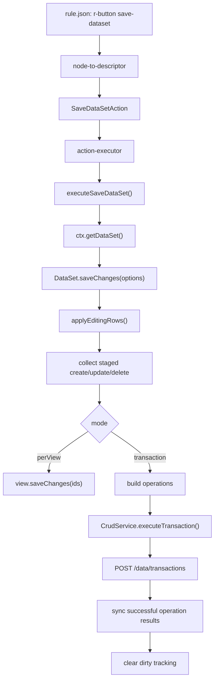
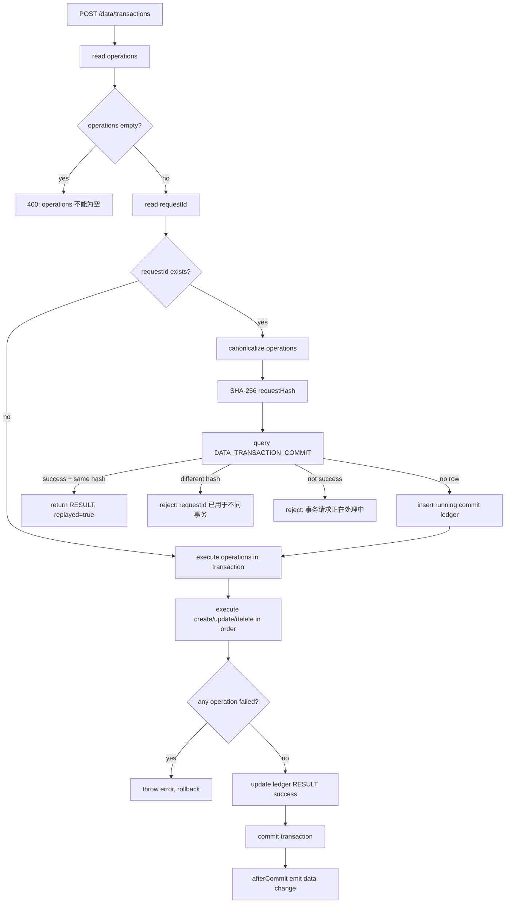
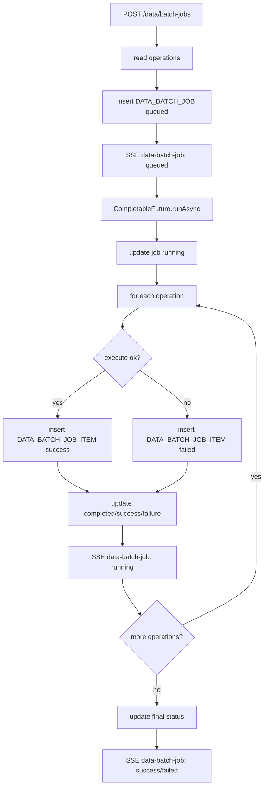
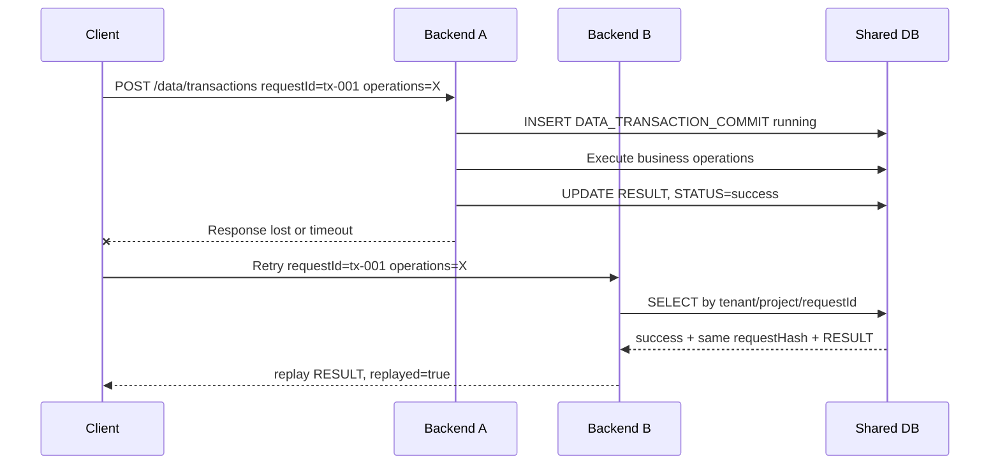

# 分布式重试、批量提交与跨数据库 XA 事务原理分析

## 背景与结论

SPARK View 当前有三条容易混淆的数据提交链路：

- 同步事务提交：前端 `save-dataset` 触发 `DataSet.saveChanges()`，把 staged 变更统一 POST 到 `/data/transactions`。后端在一个数据库事务中执行全部 `operations`，任意一步失败则整体回滚，并通过 `requestId` 做幂等 replay。
- 异步批处理：客户端 POST `/data/batch-jobs` 后立即获得 `jobId`。后端后台逐项执行 `operations`，通过 `DATA_BATCH_JOB` / `DATA_BATCH_JOB_ITEM` 记录进度，通过 SSE 推送 `data-batch-job` 和 `data-change`。
- 跨数据库 XA 事务：`/data/transactions` 在 `spark.datasource.mode=jta-jndi` 且所有动态库都是容器托管 `JNDI_XA` 数据源时，允许 MySQL/PostgreSQL 多库强原子提交。

可行性结论：

- 单共享数据库、多后端实例的重试幂等可行，因为 `DATA_TRANSACTION_COMMIT` 是共享幂等账本。
- 默认 `direct` 模式下跨数据库事务会 fail-fast；`jta-jndi` 模式下依赖 WildFly/JBoss 的 JTA/XA 事务管理器提供真正全有或全无。
- SSE 当前是单进程内存广播，多实例部署下需要 outbox、消息队列或事件总线才能做到跨实例 fan-out。

## 前端原理

页面配置不直接写 `script.js`，而是通过 `rule.json` 的内置动作声明保存行为。典型入口是 `r-button.props.action = "save-dataset"`。

前端链路如下：

1. `rule.json` 被编译成 SparkNode 树。
2. `node-to-descriptor` 把 `save-dataset` 节点解析为 `SaveDataSetAction`。
3. `action-executor` 分发到 `executeSaveDataSet()`。
4. `executeSaveDataSet()` 从上下文读取当前 `DataSet`，组装 `DataSetSaveChangesOptions`。
5. `DataSet.saveChanges()` 先应用 `editingRows`，再收集 staged create/update/delete。
6. `transaction` 模式把变更组装为统一 `operations`，一次调用事务 endpoint。
7. 后端成功返回后，前端按 `operationId` 清理 dirty tracking，并同步 create/update 后的服务端行数据。



关键源码：

- `packages/spark-component/src/page/actions/action-data.ts`：`executeSaveDataSet()` 读取 `mode`、`requestId`、`views`、`applyEditingRows` 并调用 `dataSet.saveChanges()`。
- `packages/spark-data/src/dataset.ts`：`DataSet.saveChanges()`、`saveChangesInTransaction()`、`collectTransactionOperations()` 实现前端事务组包与提交后状态同步。

## 后端事务原理

同步事务入口是：

```text
POST /api/tenants/{tenantId}/projects/{projectId}/data/transactions
```

请求体核心结构：

```json
{
  "requestId": "tx-config-retry-v1",
  "operations": [
    {
      "operationId": "SparkTxOrders@default:create:9001",
      "tableName": "SparkTxOrders",
      "op": "create",
      "data": {
        "id": 9001,
        "orderNo": "TX-BE-001"
      }
    }
  ]
}
```

后端 `DynamicDataController.executeTransaction()` 转发到 `DynamicDataService.executeTransaction()`。该方法先解析所有 operation 的表定义和 `databaseId`，再通过 `TransactionTemplate` 使用当前 `PlatformTransactionManager` 包住业务表变更和幂等账本更新。

单库事务可以继续使用普通 `DataSourceTransactionManager`。跨数据库事务必须满足：

- `spark.datasource.mode=jta-jndi`。
- Spring 当前事务管理器是 `JtaTransactionManager`。
- 所有非主库动态数据库都是 `CONNECTION_MODE='JNDI_XA'`。
- 每个 `JNDI_XA` 数据库都有可 lookup 的 `JNDI_NAME`。

幂等核心是 `DATA_TRANSACTION_COMMIT`：

- `REQUEST_ID`：客户端传入的幂等键。
- `REQUEST_HASH`：对规范化后的 `operations` 计算 SHA-256。
- `STATUS`：当前请求状态，成功后为 `success`。
- `RESULT`：已提交事务的响应快照，用于 replay。



关键源码：

- `spark-ai-server/src/main/java/com/spark/ai/service/DynamicDataService.java`：`executeTransaction()`、`insertTransactionCommit()`、`completeTransactionCommit()`、`readCommittedTransaction()`。
- `spark-ai-server/src/main/resources/db/migration/V1__production_baseline.sql`：`DATA_TRANSACTION_COMMIT` 表结构。

## 批量提交原理

异步批处理入口是：

```text
POST /api/tenants/{tenantId}/projects/{projectId}/data/batch-jobs
```

它和 `/data/transactions` 的语义不同：

- `/data/transactions` 是同步、原子、失败回滚。
- `/data/batch-jobs` 是异步、逐项执行、允许部分失败。

后端提交 job 后会：

1. 写入 `DATA_BATCH_JOB`，状态为 `queued`。
2. 发送 `data-batch-job` queued 事件。
3. 使用 `CompletableFuture.runAsync()` 后台执行。
4. 每个 operation 成功或失败后写入 `DATA_BATCH_JOB_ITEM`。
5. 更新 job 的 completed/success/failure 计数。
6. 持续发送 SSE 进度，最后发送 success 或 failed。



## 分布式重试原理

“分布式重试”在这里指：客户端第一次请求可能打到后端实例 A，响应丢失后重试可能打到后端实例 B。只要两个实例连接同一个业务数据库，B 就能从 `DATA_TRANSACTION_COMMIT` 中读到 A 已提交的结果。



拒绝冲突的原因同样来自共享账本：如果实例 B 收到相同 `requestId` 但 `operations` 不同，计算出的 hash 与账本不同，后端必须拒绝，避免把不同业务请求误判成重试。

## 跨数据库 XA 事务

`/data/transactions` 在跨 `databaseId` 提交时只支持容器托管 XA DataSource。应用侧不创建 XA 连接池，也不把 Hikari 直连池加入分布式事务。

默认 `spark.datasource.mode=direct` 保持原行为：普通 CRUD、单库事务和 batch 可用；跨库事务会失败并提示启用 `jta-jndi`。

### 应用配置

WildFly/JBoss 部署使用 WAR 包，并由容器提供主库和动态业务库的 XA DataSource：

```yaml
spring:
  datasource:
    jndi-name: java:/jdbc/SparkMetaXa
  jta:
    enabled: true

spark:
  datasource:
    mode: jta-jndi
```

主库也必须是 XA DataSource，因为 `DATA_TRANSACTION_COMMIT` 幂等账本需要和业务库写入处于同一个 JTA 事务。

### 元数据约定

`DATA_SOURCE_DATABASE` 增加两个字段：

- `CONNECTION_MODE`: `DIRECT` 或 `JNDI_XA`。
- `JNDI_NAME`: 容器中 XA DataSource 的 JNDI 名称，例如 `java:/jdbc/SparkOrdersXa`。

数据库注册接口同步支持：

```json
{
  "serverId": 1,
  "databaseName": "orders",
  "connectionMode": "JNDI_XA",
  "jndiName": "java:/jdbc/SparkOrdersXa",
  "isolationMode": "PROJECT_ISOLATED",
  "createNew": false
}
```

跨库事务要求所有非主库 `databaseId` 都是 `JNDI_XA` 且 `jndiName` 可被容器 lookup。否则 fail-fast。

### WildFly XA DataSource 示例

MySQL：

```bash
/subsystem=datasources/xa-data-source=SparkOrdersXa:add(
  jndi-name=java:/jdbc/SparkOrdersXa,
  driver-name=mysql,
  xa-datasource-class=com.mysql.cj.jdbc.MysqlXADataSource,
  user-name=spark,
  password=spark
)
/subsystem=datasources/xa-data-source=SparkOrdersXa/xa-datasource-properties=ServerName:add(value=127.0.0.1)
/subsystem=datasources/xa-data-source=SparkOrdersXa/xa-datasource-properties=PortNumber:add(value=3306)
/subsystem=datasources/xa-data-source=SparkOrdersXa/xa-datasource-properties=DatabaseName:add(value=orders)
/subsystem=datasources/xa-data-source=SparkOrdersXa:enable
```

PostgreSQL：

```bash
/subsystem=datasources/xa-data-source=SparkItemsXa:add(
  jndi-name=java:/jdbc/SparkItemsXa,
  driver-name=postgresql,
  xa-datasource-class=org.postgresql.xa.PGXADataSource,
  user-name=spark,
  password=spark
)
/subsystem=datasources/xa-data-source=SparkItemsXa/xa-datasource-properties=ServerName:add(value=127.0.0.1)
/subsystem=datasources/xa-data-source=SparkItemsXa/xa-datasource-properties=PortNumber:add(value=5432)
/subsystem=datasources/xa-data-source=SparkItemsXa/xa-datasource-properties=DatabaseName:add(value=items)
/subsystem=datasources/xa-data-source=SparkItemsXa:enable
```

### 失败语义

- `direct` 模式跨库：`跨数据库事务需要启用 jta-jndi 模式`。
- 有动态库不是 `JNDI_XA`：`跨数据库事务要求所有数据库为 JNDI_XA`。
- 缺少 JNDI 名称：`databaseId=... 缺少 jndiName`。
- 容器 lookup 失败：`JNDI 数据源 lookup 失败 databaseId=..., jndiName=...`。

以上失败都发生在业务 SQL 执行前，不会产生部分写入。

## 业务页面 0 代码配置模板

“0 代码”指业务页面不写 `script.js`，也不写前后端业务逻辑代码；平台/运维仍需要先配置 WildFly/JBoss XA DataSource，并在 DBMS 中把数据库注册为 `JNDI_XA`。

`pagedata.json` 中配置事务提交端点：

```json
{
  "saveChanges": {
    "mode": "transaction",
    "transaction": {
      "endpoint": {
        "url": "/data/transactions",
        "method": "POST"
      }
    }
  }
}
```

`rule.json` 中使用内置按钮动作：

```json
{
  "type": "r-button",
  "props": {
    "label": "提交事务",
    "action": "save-dataset",
    "mode": "transaction",
    "requestIdStrategy": "auto",
    "successMessage": "事务提交成功",
    "failureMessage": "事务提交失败"
  }
}
```

`requestIdStrategy: "auto"` 会在每次点击时自动生成唯一 `requestId`，并只用于本次 `/data/transactions` 请求，不写入业务行数据。固定 `requestId` 仅建议用于 replay/conflict 验证页；生产页面不要配置固定值，否则连续提交会被 replay 或 conflict 保护拦截。

## 当前限制

- 跨数据库强原子只支持 WildFly/JBoss 托管 JNDI XA DataSource；嵌入式 Tomcat + Hikari direct 模式不会尝试跨库原子提交。
- MySQL/PostgreSQL 真实 XA commit/rollback 需要在 WildFly/JBoss 中配置实际 `java:/jdbc/...` XA DataSource 后做环境集成测试。
- SSE 不是分布式广播。`SseService` 维护的是当前 JVM 内存中的 `SseEmitter` 列表，多实例部署时只能通知连到当前实例的客户端。
- `/data/batch-jobs` 当前没有像 `/data/transactions` 一样的 requestId replay 语义，`REQUEST_ID` 只是记录字段。

## 已修复问题与验证

已验证命令：

```powershell
pnpm run typecheck
pnpm run lint
pnpm run test
cd spark-ai-server
mvn -q "-Dtest=DynamicDataServiceTest,DataSourceMetadataServiceTest" test
mvn -q -DskipTests package
```

验证结果：

- `pnpm run typecheck` 通过。
- `pnpm run lint` 通过。
- `pnpm run test` 通过。
- `DynamicDataServiceTest` / `DataSourceMetadataServiceTest` 通过。
- `spark-ai-server` 可打包生成 WAR。

已修复：

- 统一 `DatabaseDialect`，解除 Java 编译阻断。
- H2 测试 schema 与生产迁移对齐，补齐动态数据源、关系、事务与批处理元数据表。
- `DATABASE_ID` 已进入表定义和 CRUD/查询/树查询/事务执行路径。
- `/data/transactions` 单库保持原子事务；跨库在 `direct` 模式 fail-fast，在 `jta-jndi + JNDI_XA` 条件下放行。
- batch 和 transaction 使用内部 no-emit CRUD，避免重复发送 `data-change`。
- `tx-transaction-retry` 验证页可稳定覆盖 replay/conflict。
