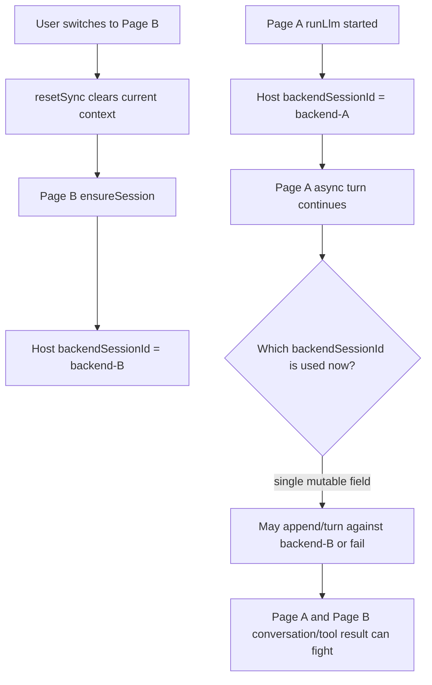
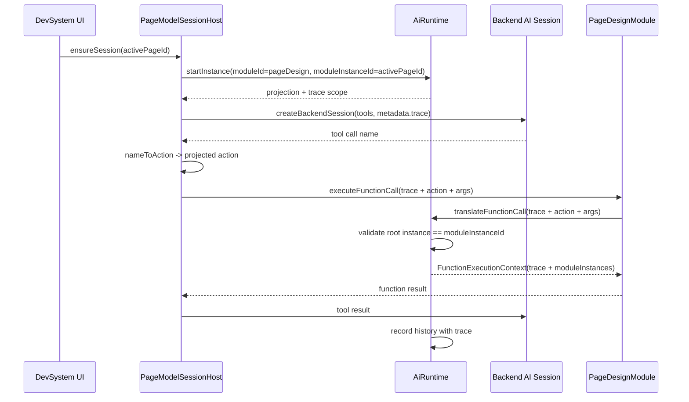
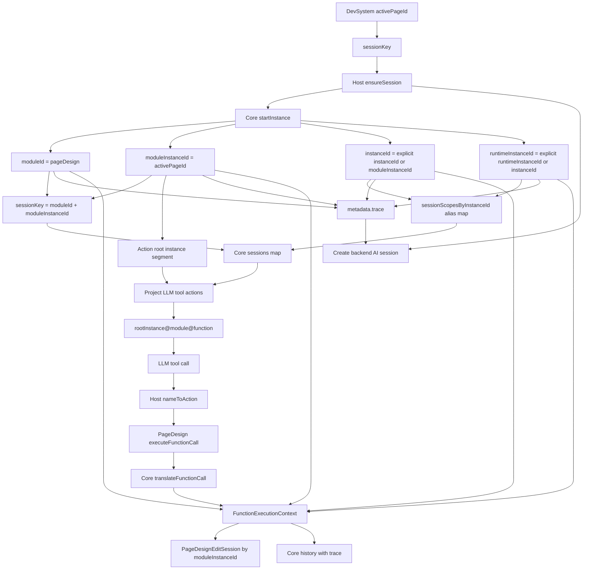
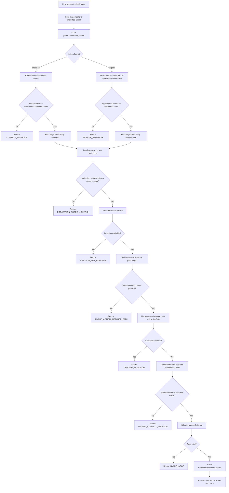
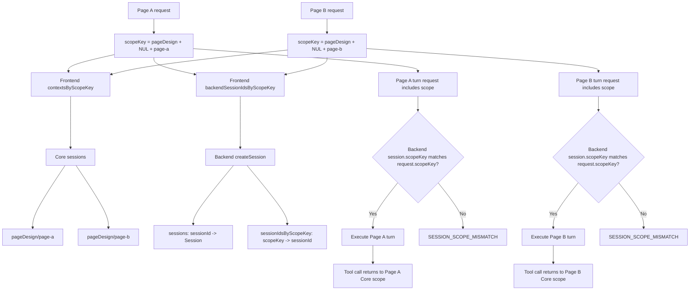
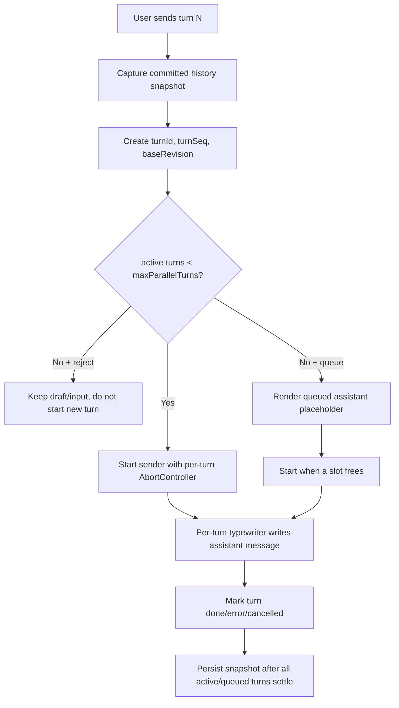

# DM: spark-ai Core 模块实例 ID 追踪方案

> **状态**：已实施前后端 scope-aware 非流式会话链路，持续验证  
> **日期**：2026-05-10  
> **范围**：`packages/spark-ai/src/core`、`packages/spark-ai/src/business/page-design`、`src/views/app/dev-system`  
> **目标**：把 AI Core 中 `moduleInstanceId`、`instanceId`、`runtimeInstanceId` 的职责彻底分清，并建立从前端宿主、后端 AI session、LLM tool call、Core history 到业务函数执行上下文的一致追踪方案。

---

## 1. 一句话结论

AI Core 的模块实例追踪应以 **`moduleId + moduleInstanceId`** 作为唯一业务隔离键；`instanceId` 只能作为 AI 会话技术 envelope / alias，不能决定业务实例、不能进入函数 args、不能由 LLM 自行拼接。

当前 Core 主体实现已经遵循这个方向，但前端 PageModel 宿主仍有旧 action 硬编码和后端 session 元数据缺失，需要补齐。

本轮已落地：

- 前端 `usePageModelSessionHost` 改为按 `scopeKey = moduleId + "\0" + moduleInstanceId` 保存 Core context 与 backend session。
- 前端 `createBackendSession` / `appendBackendMessages` / `executeBackendTurn` 均携带 scope。
- 前端 `usePageModelEditSession.bootstrap()` 不再硬编码 legacy action，改为从 Core 投影函数中查找 `lifecycle@bootstrap`。
- 后端 `AiSessionService.Session` 保存 scope，并维护 `sessionIdsByScopeKey`。
- 后端非流式 `turn` 与 `append` 校验请求 scope，不匹配返回 `SESSION_SCOPE_MISMATCH`。
- 流式 `/turn/stream` 仍是后续项：当前 DevSystem PageModel 使用非流式 `/turn`。

---

## 2. ID 语义边界

| 字段 | 语义 | 归属 | 是否参与业务隔离 | 是否给 LLM 自行拼接 |
|------|------|------|------------------|---------------------|
| `moduleId` | 顶层 AI 模块注册 ID，例如 `pageDesign` | Core registry | 是，和 `moduleInstanceId` 组成隔离键 | 否 |
| `moduleInstanceId` | 根业务模块实体 ID，例如当前页面 ID | 宿主/业务域 | 是 | 否，只通过 Core 投影进入 action |
| `instanceId` | AI 会话技术 envelope ID / alias | 宿主/Core | 否 | 否 |
| `runtimeInstanceId` | 执行上下文中的运行时会话别名，通常等于 `instanceId` | Core/业务函数上下文 | 否 | 否 |
| `activePath[].instanceId` | 子模块当前活动业务实例 ID | 宿主/Core translate | 只参与本次函数上下文 | 否，只通过 action 或 activePath 绑定 |

核心规则：

1. `moduleInstanceId` 是业务真相，通常来自当前页面、表单、任务、部门等业务实体 ID。
2. `instanceId` 是技术真相，通常来自前端 AI 会话、后端 session、trace envelope。
3. LLM 看到的 tool action 必须由 Core 投影生成，不允许业务层或 prompt 手写拼接。
4. 函数实现读取实例上下文时，使用 `FunctionExecutionContext.moduleInstanceId` 或 `context.moduleInstances`，不要从 args 中重新解释 `instanceId`。

---

## 3. 当前源码追踪

### 3.1 合约层

文件：`packages/spark-ai/src/core/protocol/business-contracts.ts`

关键定义：

- `AiRuntimeInstanceScope` 定义 `moduleId`、`moduleInstanceId`、`instanceId`、`runtimeInstanceId`。
- `AiRuntimeModuleInstanceScope` 只包含 `moduleId`、`moduleInstanceId`，用于按业务实例定位。
- `AiRuntimeSessionRecord` 注释已经明确：会话隔离键由 `moduleId + moduleInstanceId` 决定，`instanceId` 只是技术 alias。
- `FunctionExecutionContext` 同时携带四个 ID，并把 active path 汇总为 `moduleInstances`。

这说明合约层已经不是“一个 instanceId 走天下”的模型。

### 3.2 Core 会话表

文件：`packages/spark-ai/src/core/runtime/ai-runtime.ts`

当前实现：

```ts
private readonly sessions = new Map<string, AiRuntimeSessionRecord>()
private readonly sessionScopesByInstanceId = new Map<string, string>()
```

语义：

- `sessions` 的主键是 `moduleId + moduleInstanceId`。
- `sessionScopesByInstanceId` 是技术 `instanceId` 到业务隔离键的兼容索引。
- `getSession(instanceId)` 会先通过 alias 找业务隔离键。
- `getSessionByModuleScope({ moduleId, moduleInstanceId })` 直接按业务隔离键读取。

这条线是正确的：业务隔离不由 `instanceId` 决定。

### 3.3 start/stop 生命周期

文件：`packages/spark-ai/src/core/runtime/ai-runtime.ts`

`startInstance(options)` 当前流程：

1. 校验模块已注册。
2. 用 `moduleId + moduleInstanceId` 计算 `sessionKey`。
3. 通过 `normalizeStartScope` 补齐 `instanceId`、`runtimeInstanceId`。
4. 投影当前模块知识。
5. 写入 session record。

默认行为：

```text
instanceId = options.instanceId ?? previous?.instanceId ?? moduleInstanceId
runtimeInstanceId = options.runtimeInstanceId ?? previous?.runtimeInstanceId ?? instanceId
```

因此当宿主没有显式传入技术会话 ID 时，Core 会把 `moduleInstanceId` 作为兼容默认值。这是可接受的兼容策略，但不应被误读为两者语义相同。

`stopInstance(options)` 当前仍按 `moduleId + moduleInstanceId` 定位 session，然后更新技术 ID 快照。

### 3.4 action 投影

文件：`packages/spark-ai/src/core/runtime/ai-runtime.ts`

LLM 可见 action 由 `actionOf` 生成：

```text
rootInstance[/childInstance]@module@function
```

关键点：

- 根实例段来自 `scope.moduleInstanceId`，不是 `scope.instanceId`。
- 业务实例 ID 会 URI 编码，允许页面 ID 这类值包含 `/` 或 `@`。
- 子实例未知时用 `{paramName}` 占位，例如：

```text
dept-1/{personId}@basicInfo@update
```

这保证 LLM 只能使用 Core 投影出的 action，而不是猜测业务路径。

### 3.5 action 解析与 translate

文件：`packages/spark-ai/src/core/protocol/invocation-helpers.ts`  
文件：`packages/spark-ai/src/core/runtime/ai-runtime.ts`

`AiInvocationProtocol.parseActionPath` 支持两种格式：

1. 新格式：`rootInstance[/childInstance]@module@function`
2. 旧格式：`module/.../function`，仅用于历史兼容

`translateFunctionCall(options)` 的关键校验：

```ts
if (address.format === 'instance' && address.instanceIds[0] !== session.moduleInstanceId) {
  return CONTEXT_MISMATCH
}
```

然后继续：

1. 定位目标模块注册。
2. 校验 projection scope 与当前 scope 一致。
3. 定位函数 exposure。
4. 校验 action 实例路径长度与上下文参数一致。
5. 将 action 中的实例路径合并为 activePath。
6. 生成 `FunctionExecutionContext`。

最终业务函数拿到：

```ts
{
  instanceId: session.instanceId,
  runtimeInstanceId: session.runtimeInstanceId,
  moduleId: session.moduleId,
  moduleInstanceId: session.moduleInstanceId,
  moduleInstances,
  activePath
}
```

这条链路已经把“技术会话 ID”和“业务根实例 ID”拆开了。

### 3.6 activePath 与子模块实例

文件：`packages/spark-ai/src/core/runtime/ai-runtime-support.ts`

`AiRuntimeProjector.createActivePathSnapshot` 当前返回：

```ts
{
  instanceId: scope.instanceId,
  bindings,
  moduleInstances
}
```

`moduleInstances` 是 `paramName -> instanceId` 映射，例如：

```json
{
  "departmentId": "dept-1",
  "personId": "person-9"
}
```

现状可用，但建议后续把 `moduleId`、`moduleInstanceId`、`runtimeInstanceId` 也放入 activePath snapshot 或统一 trace envelope，避免排查日志时只看到技术 `instanceId`。

### 3.7 PageDesign 业务层

文件：`packages/spark-ai/src/business/page-design/page-design-business.ts`

当前实现：

- `startSession` 把 `context.moduleInstanceId` 传给 Core。
- `translateFunctionCall` 把 `moduleInstanceId`、`instanceId`、`runtimeInstanceId` 传给 Core。
- `getSession` / `getSessionHistory` 按 `moduleInstanceId` 读取。
- `PageDesignEditSession` 状态表按 `context.moduleInstanceId` 保存。
- `releaseModuleInstance(moduleInstanceId)` 也按业务根实例释放。

这说明 page-design 业务状态没有绑死技术 `instanceId`，方向正确。

### 3.8 DevSystem 前端宿主

文件：`src/views/app/dev-system/usePageModelSessionHost.ts`

当前 `ensureSession()`：

```ts
const session = await core.startInstance({
  moduleId: PageDesignModule.moduleId,
  moduleInstanceId: sessionKey,
})
```

其中 `sessionKey = getSessionKey()`，当前就是 active page id。

这意味着：

- 前端以页面 ID 作为 `moduleInstanceId`。
- 未显式传 `instanceId`，Core 默认 `instanceId = moduleInstanceId`。
- 这在单前端本地会话里可用，但如果要和后端 session、诊断日志、跨轮 resume 对齐，需要显式 trace metadata。

---

## 4. 当前问题与风险

### 4.1 前端仍有旧 action 硬编码

文件：`src/views/app/dev-system/usePageModelEditSession.ts`

`bootstrap()` 当前写死：

```ts
action: 'pageDesign/lifecycle/bootstrap'
```

这是旧格式。它绕过了 Core 投影出来的根实例 action，例如：

```text
{pageId}@lifecycle@bootstrap
```

风险：

- bootstrap 调用没有携带根业务实例段。
- 与 prompt 中“函数调用必须使用当前 tool schema 投影出的 action”不一致。
- 后续如果关闭 legacy action 兼容，这里会直接失败。

处理方式：bootstrap 也必须从 `context.availableFunctions` 中查找 `moduleId === 'lifecycle' && functionId === 'bootstrap'` 的 action。

### 4.2 后端 AI session 缺少 Core trace 元数据

文件：`src/views/app/dev-system/usePageModelSessionHost.ts`

`createBackendSession()` 当前只传：

```json
{
  "protocolVersion": 3,
  "systemPrompt": "...",
  "userPrompt": "...",
  "windowSize": 30,
  "mode": "function",
  "tools": []
}
```

缺少：

```json
{
  "moduleId": "pageDesign",
  "moduleInstanceId": "current-page-id",
  "instanceId": "technical-session-id",
  "runtimeInstanceId": "technical-session-id"
}
```

风险：

- 后端 session 日志无法直接关联 Core session。
- FC 诊断、SSE 事件、Core history 三者只能靠页面状态推断。
- 多轮 resume 时，后端 session ID 与 Core instance alias 的关系不清晰。

### 4.3 activePath snapshot 信息偏少

当前 `activePath` 顶层只有 `instanceId`，没有 `moduleId` / `moduleInstanceId`。当函数调用历史被单独导出时，只看 active path 不容易判断它属于哪个根业务实体。

建议不破坏现有结构，新增 trace envelope 或在 snapshot 中扩展可选字段。

### 4.4 alias 生命周期需要明确

`sessionScopesByInstanceId` 会阻止同一个技术 `instanceId` 绑定到另一个 `moduleInstanceId`，这对防串会话是好事。

但它也意味着：如果长期运行的前端 runtime 想复用同一个 `instanceId` 到另一个业务根实例，会被拒绝。建议保持拒绝策略，并在文档和错误提示里明确：技术会话 ID 必须全局唯一或只绑定同一业务 scope。

### 4.5 后端与前端隔离键端到端对齐

审计时发现：**AI Core 已经按 `moduleId + moduleInstanceId` 隔离，但后端 AI session 与前端 session host 尚未完全按这个组合键管理。**

本轮已经把 DevSystem PageModel 使用的非流式链路改为 scope-aware；以下“后端现状/前端现状”保留为审计记录，后面的“目标结构”对应当前已落地的方向。

#### 后端审计记录

文件：`spark-ai-server/src/main/java/com/spark/ai/service/AiSessionService.java`

审计时后端会话表是：

```java
private final ConcurrentHashMap<String, Session> sessions = new ConcurrentHashMap<>();
```

`createSession(...)` 内部生成随机 `sessionId`：

```java
String sessionId = UUID.randomUUID().toString();
sessions.put(sessionId, session);
```

`executeTurn(sessionId)`、`appendMessage(sessionId, ...)`、`getConversationFull(sessionId)` 都只按 `sessionId` 查找。

审计时后端 `Session` 字段包含：

```java
String systemPrompt;
int windowSize;
long lastActiveTime;
String mode;
SessionState state;
int consecutiveFailures;
int roundCounter;
Set<String> idempotencyLedger;
List<Map<String, Object>> tools;
List<Message> conversation;
```

当时缺少：

- `moduleId`
- `moduleInstanceId`
- `instanceId`
- `runtimeInstanceId`
- `scopeKey`

因此后端当时只能做到“随机 sessionId 物理隔离”，不能验证“这个后端 session 是否属于当前 pageDesign/pageId”。当前实现已补充 scope 字段、scope 索引和非流式 turn/append 校验。

#### 前端审计记录

文件：`src/views/app/dev-system/usePageModelSessionHost.ts`

审计时前端宿主只有一个当前上下文和一个当前后端会话：

```ts
const context = shallowRef<PageModelFunctionContext | null>(null)
let backendSessionId: string | undefined
```

`ensureSession()` 在 active page 切换时会 reset 旧 session：

```ts
if (context.value !== null) {
  await reset()
}
```

文件：`src/views/app/dev-system/useDevPageModelSession.ts`

页面切换时也会清空当前宿主：

```ts
watch(() => state.activePageId.value, (pageId, previousPageId) => {
  if (pageId !== previousPageId) {
    sessionHost.resetSync()
    editSession.reset()
  }
})
```

这说明审计时实现只保证“单活动页面串行编辑”安全；如果同一个前端宿主里同时跑多个页面构建任务，单个 `backendSessionId` 会成为竞争点。当前实现已改为按 scopeKey 保存 context 与 backend session。

#### 风险场景



如果未来支持多个页面设计并发执行，必须把前端和后端都改成 scope-aware。

---

## 5. 目标实现方案

### 5.1 建立统一 Trace Scope

新增或收敛一个只读结构，供 lifecycle、history、backend metadata、diagnostics 复用：

```ts
export interface AiRuntimeTraceScope {
  readonly moduleId: AiRuntimeModuleId
  readonly moduleInstanceId: AiRuntimeModuleInstanceId
  readonly instanceId: string
  readonly runtimeInstanceId: string
}
```

可选扩展：

```ts
export interface AiRuntimeFunctionTraceScope extends AiRuntimeTraceScope {
  readonly action: AiRuntimeAction
  readonly modulePath: AiRuntimeModulePath
  readonly functionId: AiRuntimeFunctionId
  readonly activePath: AiRuntimeActivePathSnapshot
}
```

原则：不新增第二套 ID 语义，只把已有四元组标准化为 trace envelope。

### 5.2 前端 context 显式携带 trace

`PageModelFunctionContext` 建议扩展：

```ts
export interface PageModelFunctionContext {
  sessionKey: string
  moduleId: string
  moduleInstanceId: string
  instanceId: string
  runtimeInstanceId: string
  availableFunctions: readonly AiRuntimeFunctionExposure[]
}
```

`createContext()` 从 `AiRuntimeStartInstanceResult` 中取值，避免调用侧重新推断。

### 5.3 后端 session 创建携带 metadata

`createBackendSession()` 在请求体中追加：

```ts
metadata: {
  source: 'dev-system-page-model',
  moduleId: current.moduleId,
  moduleInstanceId: current.moduleInstanceId,
  instanceId: current.instanceId,
  runtimeInstanceId: current.runtimeInstanceId,
}
```

调用前需要确保已有 `context.value`。如果没有，先 `ensureSession()`。

后端如果暂时不消费 metadata，也可以先透传保存；这一步对前端兼容性影响较小。

### 5.4 所有本地函数调用都使用投影 action

增加一个小工具函数：

```ts
function findProjectedAction(
  functions: readonly AiRuntimeFunctionExposure[],
  moduleId: string,
  functionId: string,
): string {
  const found = functions.find(item => item.moduleId === moduleId && item.functionId === functionId)
  if (found === undefined) {
    throw new Error(`AI 工具未投影: ${moduleId}@${functionId}`)
  }
  return found.action
}
```

将 bootstrap 从：

```ts
action: 'pageDesign/lifecycle/bootstrap'
```

改为：

```ts
action: findProjectedAction(context.availableFunctions, 'lifecycle', 'bootstrap')
```

这样 bootstrap 与 LLM tool call 使用同一套 action 来源。

### 5.5 Core history 统一记录 trace

当前 `AiRuntimeHistoryEntryBase` 已经继承 `AiRuntimeInstanceScope`，所以每条 history 已经有四元组。

建议补充：

- history entry 的 `metadata.trace` 可选字段由宿主传入后保留。
- function call history 的 `activePath` snapshot 增加根 trace 字段，或关联 `AiRuntimeTraceScope`。

不要把后端 session ID 混入 `moduleInstanceId`；后端 session ID 应进入 metadata。

### 5.6 PageDesign activePath 预留透传

当前 page-design 子模块主要是语义模块，不是实例子模块；但 Core 已支持 `activePath`。

建议给 `PageDesignExecuteFunctionCallOptions` 预留：

```ts
activePath?: readonly AiModuleInstanceBinding[]
```

并在 `translateFunctionCall` 中透传。这样未来 page-design 如果出现“页面内选中某个节点/表/字段作为子实例”的工具，不需要再改 Core。

### 5.7 端到端 Scope Key 对齐

为了避免多个页面设计任务并发时互相污染，前端、后端、Core 必须共享同一业务隔离键：

```text
scopeKey = moduleId + "\0" + moduleInstanceId
```

对外日志可使用可读形式：

```text
scopeLabel = moduleId + "/" + moduleInstanceId
```

注意：`scopeKey` 是业务隔离键，不是后端 `sessionId`。后端 `sessionId` 仍是 transport 会话 ID，但必须绑定到唯一 scope。

#### 前端目标结构

`usePageModelSessionHost` 不应只维护单个 `context` 和单个 `backendSessionId`，应改成按 scope 保存：

```ts
const contextsByScopeKey = new Map<string, PageModelFunctionContext>()
const backendSessionIdsByScopeKey = new Map<string, string>()
```

每次 run 开始时先捕获当前 scope：

```ts
const context = await ensureSession()
const scopeKey = createScopeKey(context.moduleId, context.moduleInstanceId)
```

后续 `createBackendSession`、`appendBackendMessages`、`executeBackendTurn`、`executeFunctionCall` 都使用这个被捕获的 `scopeKey`，不要再读全局可变的当前 active page。

如果需要保留当前活动页面便捷 API，可以让默认参数来自 `context.value`，但内部真实查找必须走 `scopeKey`。

#### 后端目标结构

后端 `Session` 增加 scope 字段：

```java
String moduleId;
String moduleInstanceId;
String instanceId;
String runtimeInstanceId;
String scopeKey;
Map<String, Object> metadata;
```

后端 `AiSessionService` 增加 scope 索引：

```java
private final ConcurrentHashMap<String, Session> sessions = new ConcurrentHashMap<>();
private final ConcurrentHashMap<String, String> sessionIdsByScopeKey = new ConcurrentHashMap<>();
```

创建会话时：

1. 从请求体读取 `metadata.trace` 或 `scope`。
2. 计算 `scopeKey = moduleId + "\0" + moduleInstanceId`。
3. 创建随机 `sessionId`。
4. 写入 `sessions.put(sessionId, session)`。
5. 写入 `sessionIdsByScopeKey.put(scopeKey, sessionId)`。

如果同一 `scopeKey` 已经存在：

- 默认建议复用旧后端 session，避免同一页面同一 AI 会话被重复创建。
- 如果产品需要“同一页面并行多个分支构建”，必须显式引入 `runId` 或 `branchId`，不能偷换 `moduleInstanceId` 语义。

#### turn/append 必须校验 scope

仅通过 `/api/ai/sessions/{sessionId}/turn` 不能防止前端误用旧 `sessionId`。因此 turn/append 请求体也应带 scope：

```json
{
  "protocolVersion": 3,
  "scope": {
    "moduleId": "pageDesign",
    "moduleInstanceId": "page-a",
    "instanceId": "page-a",
    "runtimeInstanceId": "page-a"
  }
}
```

后端执行前校验：

```text
request.scopeKey == session.scopeKey
```

不匹配时返回：

```json
{
  "error": {
    "code": "SESSION_SCOPE_MISMATCH",
    "message": "后端 AI 会话与当前模块实例不匹配"
  }
}
```

这个校验是防止“同时构建多个页面设计时打架”的最后一道闸。

---

## 6. 推荐调用链



### 6.1 模块实例 ID 全链路流程图



### 6.2 tool call 实例校验流程图



### 6.3 并发页面设计的目标隔离流程图



### 6.4 同一 UI 会话内的并发 turn 流程图

通用 `AiChatWidget` 需要同时支持两类隔离：

1. 不同业务实例通过 `moduleId + moduleInstanceId` 隔离。
2. 同一 UI 会话内多个未完成 turn 通过 `turnId + turnSeq + baseRevision` 隔离显示与上下文快照。

默认行为仍是 `maxParallelTurns = 1` 且 `overflow = reject`，保持旧串行语义；业务显式配置后才允许并发或排队。



上下文快照规则：

- 新 turn 构造 `historyMsgs` 时，只读取已提交消息。
- `queued` / `running` 的 user 与 assistant 消息都不会进入后续 turn 的上下文。
- 如果 turn 2 在 turn 1 未返回时发送，turn 2 的基础上下文与 turn 1 相同，再追加 turn 2 自己的用户输入。
- UI 按发送顺序保留多条 assistant 占位，每条响应独立流式更新。

---

## 7. 测试计划

### 7.1 Core 单测

已有覆盖：

- `tests/ai-runtime-business.test.ts`
  - 会话按 `moduleId + moduleInstanceId` 隔离。
  - action 使用根业务实体 ID 编码。
  - 重复技术 alias 绑定到不同业务实体会失败。
  - activePath 子实例会注入到 `context.moduleInstances`。
  - activePath 冲突会返回 `CONTEXT_MISMATCH`。

建议补充：

1. `startInstance` 不传 `instanceId` 时，默认 `instanceId === moduleInstanceId`，但 session key 仍是业务 scope。
2. `history` 中每条 entry 都包含 `moduleId`、`moduleInstanceId`、`instanceId`、`runtimeInstanceId`。
3. `activePath` snapshot 中保留根 trace 信息。
4. legacy action 只作为兼容路径，不应出现在新投影 action 中。

### 7.2 PageDesign 单测

已有覆盖：

- `tests/page-design-business-definition.test.ts`
  - pageDesign startSession 投影 `page-designer@lifecycle@bootstrap` 等 action。
  - executeFunctionCall 可以通过投影 action 执行业务函数。
  - history 记录 message 和 functionCall。

建议补充：

1. `PageDesignModule` 的状态 map 按 `moduleInstanceId` 隔离。
2. 同一个 `instanceId` 不应让两个页面共享 `PageDesignEditSession`。
3. `translateFunctionCall` 透传 activePath。

### 7.3 DevSystem 前端单测

文件：`tests/use-page-model-session-host.test.ts`

建议补充：

1. `ensureSession()` 用 active page id 作为 `moduleInstanceId`。
2. `createBackendSession()` 请求体包含 `metadata.trace`。
3. 页面切换时 reset 旧 session，新的 backend metadata 使用新 `moduleInstanceId`。
4. 两个不同 `moduleInstanceId` 并发 run 时，各自读写自己的 `backendSessionId`。
5. 页面 A 的异步 turn 未完成时切到页面 B，页面 A 后续 append/turn 仍使用页面 A 捕获的 `scopeKey`。

文件：`usePageModelEditSession` 对应测试建议：

1. bootstrap 不再调用旧 action `pageDesign/lifecycle/bootstrap`。
2. bootstrap 从 `context.availableFunctions` 中选择投影 action。
3. 当缺少 `lifecycle/bootstrap` 投影时给出明确错误。

### 7.4 通用 AI Chat turn 并发单测

文件：`tests/ai-chat-widget-persistence.test.ts`

1. 默认不配置时仍拒绝并发发送，保持旧行为。
2. `turnConcurrency.maxParallelTurns = 2` 时可同时启动两轮 sender。
3. 第二轮 sender 收到的 `historyMsgs` 不包含第一轮未完成的 user/assistant 消息。
4. `overflow = queue` 时 UI 显示排队状态，并在空闲槽位出现后启动下一轮。

---

## 8. 验收标准

完成后应满足：

1. 新建 AI 会话时，Core、前端 context、后端 session metadata 都能看到同一组 trace 四元组。
2. 所有新函数调用 action 都来自 Core projection，格式为 `rootInstance[/childInstance]@module@function`。
3. `moduleInstanceId` 是唯一业务隔离键，任何业务状态不得按技术 `instanceId` 存储。
4. `instanceId` 不进入 LLM-facing args，不由 LLM 拼接。
5. 后端 session ID 不替代 `instanceId` 或 `moduleInstanceId`，只作为 transport/session metadata。
6. 旧格式 `module/.../function` 只保留迁移兼容，不再由新代码主动产生。
7. Core history、FC 诊断、SSE 事件能通过 trace metadata 对齐到同一页面实例。
8. 后端 `turn` / `append` 必须校验请求 scope 与 session scope 一致，不一致返回 `SESSION_SCOPE_MISMATCH`。
9. 前端不再用单个全局 `backendSessionId` 承载多个页面任务；backend session 必须按 `scopeKey` 索引。

---

## 9. 分阶段落地顺序

### P0：修正前端旧 action

- 修改 `usePageModelEditSession.bootstrap()`。
- 增加 `findProjectedAction`。
- 补测试防止再次硬编码旧 action。

### P1：前端 trace metadata

- 扩展 `PageModelFunctionContext`。
- `createBackendSession()` 自动带上 trace metadata。
- 更新 `tests/use-page-model-session-host.test.ts`。

### P2：前端 scope-aware backend session

- 引入 `createScopeKey(moduleId, moduleInstanceId)`。
- `usePageModelSessionHost` 内部改为 `contextsByScopeKey` 和 `backendSessionIdsByScopeKey`。
- `runLlm` 开始时捕获 scope，后续异步流程不再读取全局活动页作为会话定位依据。
- 补并发页面 run 测试。

### P3：后端 scope-aware session

- `POST /api/ai/sessions` 接收 scope / metadata.trace。
- `Session` 保存 `moduleId`、`moduleInstanceId`、`instanceId`、`runtimeInstanceId`、`scopeKey`。
- `AiSessionService` 增加 `sessionIdsByScopeKey`。
- `turn` / `append` 校验请求 scope。
- 补 Java controller/service 测试。

### P4：Core trace envelope

- 引入 `AiRuntimeTraceScope`。
- 统一 lifecycle、history、translation context 的 trace 构造。
- 不改变现有字段，只增加复用类型和辅助函数。

### P5：activePath 扩展

- 扩展 `AiRuntimeActivePathSnapshot` 或 function trace。
- PageDesign execute options 透传 activePath。
- 补子实例调用测试。

### P6：收紧 legacy action

- 保持 parser 兼容旧历史。
- 新投影、新前端调用、新 prompt 示例都不得再出现 `module/.../function`。
- 如需强制收口，可在 DevSystem 环境对 legacy action 输出 warning。

---

## 10. 不做的事

1. 不修改页面配置文件协议。页面配置是跨前端框架设计，不应放入 Vue 或 AI session 技术 ID。
2. 不把后端 session ID 当成 `moduleInstanceId`。
3. 不让 LLM 自行从 prompt 拼 action。
4. 不把 `instanceId` 写进函数 args schema。
5. 不通过重建 page-design 状态来解决会话追踪；业务状态仍由 `moduleInstanceId` 管理。

---

## 11. 关键源码索引

| 文件 | 作用 |
|------|------|
| `packages/spark-ai/src/core/protocol/business-contracts.ts` | ID 合约、session record、function context、history envelope |
| `packages/spark-ai/src/core/protocol/invocation-helpers.ts` | action path 解析 |
| `packages/spark-ai/src/core/runtime/ai-runtime.ts` | session 隔离、start/stop、action 投影、translate、history |
| `packages/spark-ai/src/core/runtime/ai-runtime-support.ts` | module projection、activePath snapshot、context param 注入 |
| `packages/spark-ai/src/business/page-design/page-design-business.ts` | pageDesign 业务模块、状态隔离、函数执行 |
| `packages/spark-ai/src/business/page-design/prompts/edit-runtime-prompt.ts` | prompt 中对 action 和 instanceId 语义的说明 |
| `src/views/app/dev-system/usePageModelSessionHost.ts` | 前端 Core session 与后端 AI session 桥接 |
| `src/views/app/dev-system/usePageModelEditSession.ts` | 前端 LLM 轮次、tool projection、bootstrap 和函数调用 |
| `packages/spark-component/src/components/ai/useAiChat.ts` | 通用 AI Chat 消息、turn 并发、上下文快照与持久化 |
| `packages/spark-component/src/components/ai/AiChatWidget.vue` | turn 并发配置透传与发送入口 |
| `packages/spark-component/src/components/ai/AiChatShell.vue` | 多 turn 并发/排队 UI 展示 |
| `tests/ai-runtime-business.test.ts` | Core 实例隔离与 action/activePath 测试 |
| `tests/page-design-business-definition.test.ts` | PageDesign 模块执行与 history 测试 |
| `tests/use-page-model-session-host.test.ts` | DevSystem session host transport 测试 |
