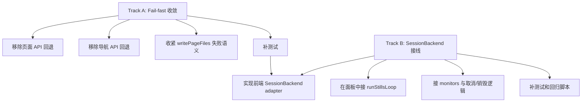

# SPARK AI 改造执行清单

更新时间：2026-04-07

## 1. 目标

这份清单用于把 [SPARK_AI_PACKAGE_FULL_DESIGN.md](SPARK_AI_PACKAGE_FULL_DESIGN.md) 的结论拆成可以直接开工的工程任务，当前只聚焦两条优先主线：

1. fail-fast 收敛。
2. `SessionBackend` 接入主应用。

设计原则：

- 先收紧契约，再扩功能。
- 先把能力接线，再谈 UI 扩展。
- 每项都给出涉及文件、验收标准和依赖关系。

---

## 2. 工作流总览

推荐顺序：先完成 Track A，再进入 Track B。

原因：

- Track A 能先清掉“配置漏了但没立刻报错”的基础风险。
- Track B 依赖更长的调用链，适合在契约已经收紧之后接入。

---

## 3. Track A：Fail-fast 收敛

### A1. 移除页面 API 默认回退

- 目标：当应用层没有注入 `getPageApiUrl` 时，页面生成链路必须立即报错，而不是回退到 `/api/pages-config`。
- 涉及文件：[../../packages/spark-ai/src/runtime/ai-loop.ts](../../packages/spark-ai/src/runtime/ai-loop.ts)
- 改动点：
  1. 将内部 `getPageApiUrl()` 改为：未配置时直接抛出配置错误。
  2. 错误信息要明确指出需通过 `configureAILoopHttp({ getPageApiUrl })` 注入。
  3. 确认 `readPageFile`、`readPageFiles`、`writePageFiles`、`AIPageLoop._callAI/_callAIStream` 都能在首次调用时 fail-fast。
- 验收标准：
  1. 漏配时首次读写页面文件立即失败。
  2. 错误文本可直接指导调用方修复。
  3. 现有主应用启动路径不受影响，因为 [../../src/main.ts](../../src/main.ts) 已注入 `getPageApi`。

### A2. 移除导航 API 默认回退

- 目标：导航自动注册未配置 `getNavApiUrl` 时必须立即报错，而不是回退到 `/api/navigation`。
- 涉及文件：[../../packages/spark-ai/src/runtime/nav-register.ts](../../packages/spark-ai/src/runtime/nav-register.ts)
- 改动点：
  1. 将内部 `getNavApiUrl()` 改为未配置即抛错。
  2. 错误信息明确要求通过 `configureNavRegister()` 或 `configureAILoopHttp({ getNavApiUrl })` 注入。
- 验收标准：
  1. 任何直接调用 `registerPageNavigation()` 但未配置导航 API 的路径都会立即失败。
  2. 现有 [../../tests/nav-register.test.ts](../../tests/nav-register.test.ts) 可继续通过，因为测试里已经显式配置了 `configureNavRegister()`。

### A3. 收紧页面文件写入失败语义

- 目标：页面文件写入失败时不再只走 `onError`，而应显式向调用方暴露失败。
- 涉及文件：[../../packages/spark-ai/src/runtime/ai-loop.ts](../../packages/spark-ai/src/runtime/ai-loop.ts)
- 建议方案：
  1. 方案 1：`_postProcess()` 遇到 `writePageFiles()` 失败时直接抛出异常。
  2. 方案 2：若需要保留 AIResponse，可引入显式字段，例如 `writeStatus: 'success' | 'failed'` 与 `writeError?: string`。
  3. 当前推荐方案 1，因为仓库当前偏好 fail-fast，且“AI 成功但磁盘未写入”是高风险不一致状态。
- 验收标准：
  1. 文件写入失败时，UI 能明确拿到失败而不是继续误判成功。
  2. `onError` 可保留，但只能作为旁路日志，不再代替主失败语义。

### A4. 为 Track A 补测试

- 目标：为 fail-fast 行为补最小回归测试，避免以后再被“方便兜底”改回去。
- 建议新增 / 更新测试：
  1. 更新 [../../tests/nav-register.test.ts](../../tests/nav-register.test.ts)，增加“未配置导航 API 时抛错”断言。
  2. 新增 `ai-loop` 相关测试，覆盖未注入 `getPageApiUrl`、写文件失败传播、流式错误传播。
- 建议落点：新建仓库根测试，例如 `tests/ai-loop-fail-fast.test.ts`。
- 验收标准：漏配和写失败都能稳定回归。

---

## 4. Track B：SessionBackend 接入主应用

### B1. 实现前端 SessionBackend adapter

- 目标：把 [../../packages/spark-ai/src/runtime/session-orchestrator.ts](../../packages/spark-ai/src/runtime/session-orchestrator.ts) 中的 `SessionBackend` 真正接到 `spark-ai-server` 的 `/api/sap/stills/*`。
- 建议新增文件：`src/services/stills-session-backend.ts`
- 要实现的方法：
  1. `createSession(systemPrompt, userPrompt, windowSize)`
  2. `executeTurn(sessionId)`
  3. `appendMessages(sessionId, messages)`
  4. `getConversation(sessionId)`
  5. `destroySession(sessionId)`
  6. `destroyAllSessions()`
- 实现约束：
  1. 本地维护一个 `Set<string>` 记录当前客户端创建的 sessionId。
  2. `destroyAllSessions()` 调用 `/api/sap/stills/destroy-batch` 时发送该集合。
  3. 所有请求统一复用认证头创建函数。
- 依赖后端接口：[../../spark-ai-server/src/main/java/com/spark/ai/controller/SapController.java](../../spark-ai-server/src/main/java/com/spark/ai/controller/SapController.java)
- 验收标准：
  1. adapter 完整实现 `SessionBackend`。
  2. 单会话和批量销毁行为都可跑通。

### B2. 在面板中接入 runStillsLoop

- 目标：把 stills 工作流从“本地 `executeStill()` 演示模式”升级成“后端 LLM 会话 + 前端本地状态编排”的标准路径。
- 优先接入点：[../../src/components/SapChatPanel.vue](../../src/components/SapChatPanel.vue)
- 改动建议：
  1. 保留现有 `sap` 模式。
  2. 为 `stills` 模式接入 `registerAllStills()`、`createSession()`、`runStillsLoop()` 与 `stills-session-backend.ts`。
  3. 面板展示编排轮次、当前 action、warnings 和 abort reason。
- 验收标准：
  1. stills 模式不再直接用“AI 返回一个块 -> 本地立刻 executeStill”的简化路径。
  2. 能跑完整轮次，直到 `exportCompleted` 或 abort。

### B3. 接 monitors、取消与销毁逻辑

- 目标：让编排链路具备最小生产级控制面，而不是只会一直跑到 maxRounds。
- 涉及能力：`createRepeatDetectionMonitor`、`createBlueprintOrchestrationMonitor`、`createTerminalActionsMonitor`。
- 改动建议：
  1. 默认组合至少接入重复检测和终止动作监控。
  2. UI 点击取消时，停止本地编排循环并调用 `destroySession()`。
  3. 组件卸载时，兜底执行 `destroyAllSessions()` 或当前会话销毁。
- 验收标准：
  1. 用户可取消。
  2. 面板关闭或组件卸载不会遗留会话。
  3. 重复输出或终止动作能正确影响 loop。

### B4. 为 Track B 补测试与验证脚本

- 目标：在接入后端会话链路后，必须补足最小回归，避免只靠手工点面板。
- 建议测试层次：
  1. 单元测试：mock `SessionBackend`，验证 `runStillsLoop()` 的回合、follow-up、abort 行为。
  2. 适配器测试：mock `/api/sap/stills/*` 响应，验证 adapter 的 session 集合维护。
  3. UI 测试：验证 `SapChatPanel` stills 模式切换和取消行为。
- 建议落点：
  1. `tests/session-orchestrator.test.ts`
  2. `tests/stills-session-backend.test.ts`
  3. 必要时再补组件级测试。

---

## 5. Issue 拆分建议

建议按以下顺序拆 issue：

1. `spark-ai: 移除页面/导航 API 默认回退并补 fail-fast 测试`
2. `spark-ai: 收紧 writePageFiles 失败语义`
3. `app: 新增 stills SessionBackend adapter`
4. `app: SapChatPanel 接入 runStillsLoop`
5. `app: stills monitors + cancel/destroy 生命周期接入`
6. `tests: 补 AI loop 和 session orchestrator 回归`

这样拆的好处是：

- 每个 PR 都有清晰验收面。
- 前两项先把底层契约收紧，不会拖住后续编排接线。
- SessionBackend 接入可以独立推进，不必和提示词收敛绑死在一个 PR。

---

## 6. 完成定义

### Track A 完成定义

- 页面 API / 导航 API 漏配即失败。
- 页面文件写入失败不再默默吞掉。
- 有对应测试兜底。

### Track B 完成定义

- 主应用存在正式 `SessionBackend` adapter。
- stills 模式面板走 `runStillsLoop` 标准路径。
- 会话创建、追加、销毁和取消逻辑完整。
- 有最小自动化回归。
