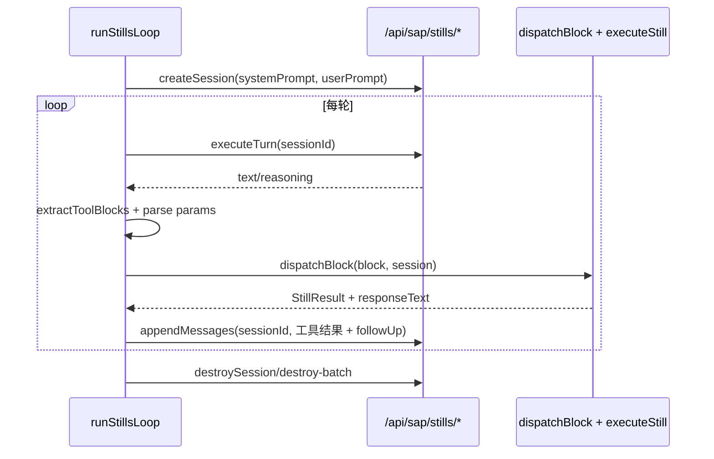

# SPARK AI 包完整设计方案（含后端关联）

更新时间：2026-04-06

## 1. 文档目标

本方案面向 `packages/spark-ai` 的维护者，给出一份“可实施”的完整设计说明，覆盖：

- 当前代码真实结构（不是历史设想）。
- 与 Java 后端的接口、事件、数据契约关联。
- 现状风险与设计缺口。
- 分阶段落地路线图（可作为后续 issue / PR 拆分依据）。

说明：本方案遵循 API-first 与 fail-fast 原则，优先通过现有后端 API 对接，不默认新增后端接口。

## 2. 当前基线（代码事实）

### 2.1 规模基线

- `packages/spark-ai/src`：32 个源码文件。
- `packages/spark-ai/src/stills`：12 个源码文件。
- `packages/spark-ai/src/runtime`：8 个源码文件。
- `spark-ai-server/src/main/java/com/spark/ai/controller`：9 个控制器。
- `spark-ai-server/src/main/java/com/spark/ai/service`：10 个服务类。

### 2.2 包内分层现状

`packages/spark-ai` 已形成 5 层结构：

1. 协议层：`src/protocol.ts`
2. 运行时层：`src/runtime/*`（AI loop、cache、nav、orchestrator、monitors）
3. 工具执行层：`src/stills/*`（dispatcher + domain）
4. 桥接层：`src/sap-runtime.ts`
5. 提示词与目录层：`src/prompts/*` + `src/catalog/*`

### 2.3 关键职责摘要

- `AIPageLoop`：页面生成/迭代主循环、SSE 消费、文件写入后处理、自动导航注册、日志诊断收集。
- `session-orchestrator`：会话级 stills 工具循环编排（依赖注入后端通信接口，不耦合具体 HTTP）。
- `stills`：原子动作引擎（guard/validate/execute），提供 domain 化动作集合。
- `protocol`：统一 `@@` 协议块解析与流式协议辅助。
- `prompt-builder`：前端提示词拼接 SSoT（当前处于并存阶段，未完全替代后端拼接逻辑）。

## 3. 模块深度分析

### 3.1 AI 页面闭环（AIPageLoop）

核心文件：`packages/spark-ai/src/runtime/ai-loop.ts`

主流程：

1. `generate/iterate`（同步）调用 `/api/ai/chat`。
2. `generateStream/iterateStream`（流式）调用 `/api/ai/chat/stream-page`。
3. 收到 `AIResponse` 后进入 `_postProcess`：
   - 配置校验 `validateGeneratedConfig`。
   - 可选 `onResponseProcessed` 钩子。
   - `writePageFiles` 写入页面文件。
   - `registerPageNavigation`（仅 generate）。
4. 通过 `setupHotReload` 监听 `page-config` SSE，触发缓存清理与页面刷新。

现有实现特点：

- 已支持租户头注入与作用域 API 前缀注入（`configureAILoopHttp`）。
- SSE 消费具备 fail-fast：流结束但无 `result` 会抛错。
- 写文件失败不抛出到主流程（只走 `onError`），属于“软失败”策略。

### 3.2 Stills 引擎（领域化动作系统）

核心文件：

- `packages/spark-ai/src/stills/dispatcher.ts`
- `packages/spark-ai/src/stills/domain.ts`
- `packages/spark-ai/src/stills/dataset-domain.ts`
- `packages/spark-ai/src/stills/blueprint-domain.ts`
- `packages/spark-ai/src/stills/pageconfig-domain.ts`

当前域与动作数量：

- dataset domain：24 个动作。
- blueprint domain：7 个动作。
- pageconfig domain：18 个动作。
- meta actions：3 个动作。

合计：52 个 still actions。

说明：现有 `packages/spark-ai/ARCHITECTURE.md` 中“31 个 stills”统计已过期，应以源码为准。

### 3.3 会话编排器（Session Orchestrator）

核心文件：`packages/spark-ai/src/runtime/session-orchestrator.ts`

特点：

- 抽象 `SessionBackend`，将后端通信反转为接口，编排器不直接耦合 API 路径。
- 标准循环：`executeTurn -> extract block -> dispatch -> appendMessages -> monitors -> terminate`。
- 支持监控器插件：
  - `repeat-detection-monitor`
  - `blueprint-orchestration-monitor`
  - `terminal-actions-monitor`
- 支持 warnings 转 follow-up 自动注入。

### 3.4 Prompt 双轨现状

- 前端：`packages/spark-ai/src/prompts/prompt-builder.ts` + `page-system-prompt.ts`。
- 后端：`AiPageService.buildSystemPrompt()` 仍在做拼接与相关 skill 检测。

结论：当前属于“前后端并存”阶段，尚未完成单一来源收敛。

## 4. 与后端关联关系（接口矩阵）

### 4.1 页面生成与文件闭环

| 能力 | spark-ai 入口 | 后端接口 | 后端实现 | 契约要点 |
|---|---|---|---|---|
| 非流式生成/迭代 | `AIPageLoop._callAI` | `POST /api/ai/chat` | `AiChatController.chat -> AiPageService.processRequest` | 请求含 action/pageId/prompt/feedback/currentFiles/logs/skillCatalog |
| 流式生成/迭代 | `AIPageLoop._callAIStream` | `POST /api/ai/chat/stream-page` | `AiChatController.chatStreamPage -> AiPageService.processRequestStream` | SSE 事件：phase/delta/reasoning/usage/result/done/error |
| 页面文件读取 | `readPageFile/readPageFiles` | `GET /api/pages-config/{pageId}/{filename}`（或 scoped） | `PageConfigController.getFile* -> PageConfigService.readFile` | 支持 timestamp/notModified 协议 |
| 页面文件写入 | `writePageFiles` | `PUT /api/pages-config/{pageId}/{filename}`（或 scoped） | `PageConfigController.putFile* -> PageConfigService.writeFile` | 单文件写入后广播 `page-config` SSE |
| 页面热更新 | `setupHotReload` | `GET /api/events` | `PageConfigController.unifiedEvents -> SseService.subscribe` | 消费 `page-config` 事件并清缓存 |

### 4.2 导航自动注册

| 能力 | spark-ai 入口 | 后端接口 | 后端实现 | 契约要点 |
|---|---|---|---|---|
| 生成后注册导航 | `registerPageNavigation` | `POST /api/tenants/{tenantId}/projects/{projectId}/navigation/nodes` | `NavigationController.addNode` | 重复 ID 视为 alreadyExists（前端非错误） |

### 4.3 通用流式对话

| 能力 | 前端入口 | 后端接口 | 后端实现 | 契约要点 |
|---|---|---|---|---|
| 多轮/单轮通用对话 | `src/services/ai-protocol.ts -> streamAiChatText` | `POST /api/ai/chat/stream` | `AiChatController.chatStream -> AiStreamService.streamChat` | SSE 事件：delta/reasoning/usage/done/error |

### 4.4 SAP / Stills 通道

| 能力 | spark-ai 入口 | 后端接口 | 后端实现 | 契约要点 |
|---|---|---|---|---|
| 协议直执（非会话） | 前端 `SapChatPanel` | `POST /api/sap/execute` | `SapController.execute` | 请求体 `text/plain`，返回 `@@result/@@error` 文本 |
| 会话创建 | `SessionBackend.createSession` | `POST /api/sap/stills/session` | `SapController.createStillsSession -> StillsSessionService.createSession` | 返回 sessionId |
| 单轮 LLM | `SessionBackend.executeTurn` | `POST /api/sap/stills/turn` | `SapController.executeStillsTurn` | 返回 text/reasoning |
| 追加工具结果 | `SessionBackend.appendMessages` | `POST /api/sap/stills/append` | `SapController.appendStillsMessage` | 追加 role/content |
| 会话历史 | `SessionBackend.getConversation` | `POST /api/sap/stills/conversation` | `SapController.getStillsConversation` | 返回 conversation[] |
| 销毁会话 | `SessionBackend.destroySession` | `POST /api/sap/stills/destroy` | `SapController.destroyStillsSession` | 单会话清理 |
| 批量销毁 | `SessionBackend.destroyAllSessions` | `POST /api/sap/stills/destroy-batch` | `SapController.destroyStillsSessions` | 切用户/清理遗留会话 |

### 4.5 调试 SSE 通道

| 能力 | 后端触发接口 | SSE 事件 | 前端消费位点 |
|---|---|---|---|
| 远程截图请求 | `POST /api/ai/debug/screenshot-request` | `debug-screenshot-request` | SSE 订阅层（spark-utils + Dev 面板） |
| 截图回执 | `POST /api/ai/debug/screenshot-result` | `debug-screenshot-result` | `DevAiPanel` |
| 远程路由请求 | `POST /api/ai/debug/route-request` | `debug-route-request` | debug bridge + UI 层 |
| 路由回执 | `POST /api/ai/debug/route-result` | `debug-route-result` | `DevAiPanel` |

## 5. 关键时序

### 5.1 页面生成闭环

```mermaid
sequenceDiagram
  participant UI as AiChatPanel/DevAiPanel
  participant Loop as AIPageLoop
  participant AI as AiChatController/AiPageService
  participant Page as PageConfigController/PageConfigService
  participant SSE as SseService(/api/events)

  UI->>Loop: generate(pageId, prompt)
  Loop->>AI: POST /api/ai/chat 或 /chat/stream-page
  AI-->>Loop: AIResponse(files, explanation, needsIteration)
  Loop->>Loop: validateGeneratedConfig + onResponseProcessed
  Loop->>Page: PUT pages-config/{pageId}/{filename} (逐文件)
  Page->>SSE: emit page-config
  SSE-->>UI: event page-config
  UI->>Loop: clear cache + trigger refresh
```

### 5.2 Stills 会话编排闭环



## 6. 现状风险与设计缺口

1. 文档与代码漂移。

- `ARCHITECTURE.md` 中 stills 数量与当前源码不一致，容易误导后续开发。

2. 端点回退策略偏“静默”。

- `AIPageLoop.getPageApiUrl()` 默认回退 `/api/pages-config`。
- `nav-register.getNavApiUrl()` 默认回退 `/api/navigation`（后端主路由实际是 scoped）。
- 若应用层漏配，可能在运行时才暴露问题。

3. 文件写入是“逐文件 PUT + 软失败”。

- `_postProcess` 在写入失败时只触发 `onError`，不阻断整体返回。
- 会出现“AI 回复成功但磁盘部分未写入”的一致性风险。

4. Prompt 组装双轨并存。

- 前端已有 SSoT 设计，但后端仍保留完整拼接逻辑，增加维护成本。

5. 包内测试覆盖不足。

- `packages/spark-ai/tests` 当前为空，主要依赖仓库根测试与运行时验证。

## 7. 完整设计方案（目标态）

### 7.1 总体原则

- API-first：优先消费现有后端 API，不先动后端。
- Fail-fast：关键依赖缺失时立即抛错，不做静默回退。
- Single Source of Truth：提示词与协议规则逐步收敛到单源。
- 可观测性优先：每条 AI 调用链可追踪 requestId/sessionId/pageId。

### 7.2 目标分层

1. Core（`packages/spark-ai`）

- 保留协议、编排、stills、校验、缓存等纯能力。
- 通过显式配置注入端点与 headers。

2. Adapter（应用层）

- 在 `src/main.ts` / `src/services/*` 完成租户路径、认证头、后端会话适配。
- Core 不再假设默认 URL。

3. Backend（`spark-ai-server`）

- 继续作为 LLM 代理 + 配置文件落盘 + SSE 广播 + stills 会话存储层。

### 7.3 分阶段落地计划

#### Phase A：契约收敛与 fail-fast（优先）

- 目标：去除高风险静默回退。
- 变更建议：
  - `AIPageLoop` 未注入 `getPageApiUrl` 时直接抛配置错误。
  - `nav-register` 未注入 `getNavApiUrl` 时直接抛配置错误。
- 验收：
  - 漏配场景在启动期或首次调用即报错。
  - 不再出现误打到无效端点。

#### Phase B：写入一致性强化

- 目标：避免“部分写入成功”导致页面状态分裂。
- 方案优先级：
  1. 前端改为“失败即整体失败”策略（先做）。
  2. 中期引入后端批量写入端点（可选，若确有原子性需求）。
- 验收：
  - 任何文件写入失败都能返回明确失败状态并可重试。

#### Phase C：会话编排标准化接入

- 目标：把 `runStillsLoop` 从“能力可用”升级为“应用标准路径”。
- 变更建议：
  - 在应用层提供统一 `SessionBackend` 实现，复用 `/api/sap/stills/*`。
  - 将 monitor 组合配置化（按场景启用）。
- 验收：
  - AI Studio/Dev 面板可切换到统一编排器通道。

#### Phase D：Prompt SSoT 收敛

- 目标：前后端提示词逻辑不重复维护。
- 变更建议：
  - 前端 `prompt-builder` 作为主拼接器。
  - 后端保留“兜底模板 + 元数据附加”最小能力。
- 验收：
  - 同一上下文下，前后端拼接结果差异可控且可追踪。

#### Phase E：质量基线补齐

- 目标：为包内核心能力建立可回归测试。
- 变更建议：
  - 新增 `packages/spark-ai/tests`：
    - protocol 解析。
    - AI loop SSE 消费与异常分支。
    - orchestrator + monitors 终止逻辑。
    - stills domain guard/validate 关键路径。
- 验收：
  - PR 级可自动验证核心行为，不依赖手工回归。

## 8. 实施清单（建议直接转 issue）

1. 修正文档漂移：更新 `packages/spark-ai/ARCHITECTURE.md` 的 stills 统计与分层描述。
2. 增加 fail-fast：移除/限制默认端点回退。
3. 强化写入事务语义：先前端 fail-fast，再评估后端 batch 写入。
4. 统一 SessionBackend 适配器并在面板中接入。
5. 推进 Prompt SSoT 收敛，明确前后端职责边界。
6. 补齐 `packages/spark-ai` 包内测试。

## 9. 结论

`packages/spark-ai` 当前已具备完整 AI 运行时能力，不是单纯“协议工具库”。它在架构上已经覆盖：

- 页面生成闭环（请求、流式、落盘、刷新、导航）。
- stills 原子动作系统（多 domain + guard + patch log）。
- 会话级工具编排器（可插拔监控器）。
- 与后端的清晰接口层（AI、SSE、PageConfig、Navigation、SAP/Stills）。

下一阶段重点不是“再扩功能面”，而是“契约收敛 + 一致性增强 + 测试基线补齐”。这三项完成后，`spark-ai` 才能稳定承载更复杂的 AI 设计链路。