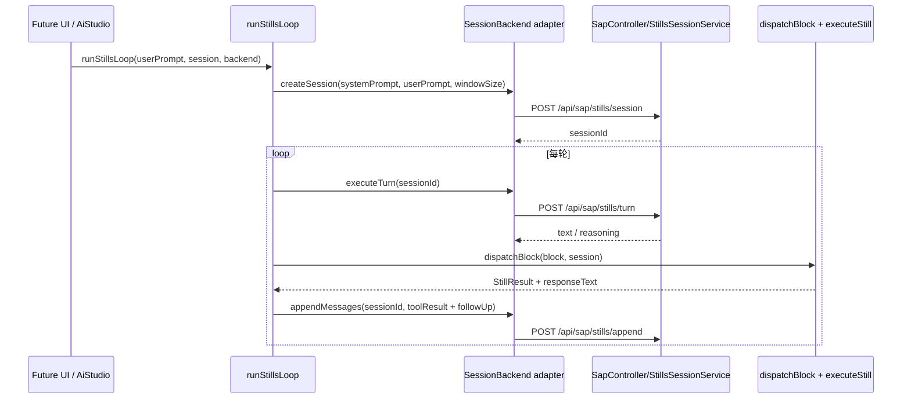

# SPARK AI 包完整设计方案（含后端关联）

更新时间：2026-04-07

## 1. 文档目标

本文档基于当前源码，对 `packages/spark-ai` 给出一份可直接用于后续重构、评审和 issue 拆分的完整设计说明，覆盖四件事：

- 当前包的真实职责、边界与模块分层。
- 主应用如何消费该包，而不是只看包内实现。
- 与 `spark-ai-server` 的控制器、服务、SSE、文件存储、会话机制之间的真实关联关系。
- 当前技术债、目标态设计以及分阶段落地路线。

本文档遵循两条原则：

- 以当前代码为准，不以历史设想或旧文档为准。
- 优先 API-first 与 fail-fast，不默认通过兜底路径掩盖配置缺失。

## 2. 当前代码基线

### 2.1 包定位

`packages/spark-ai` 不是一个“通用 AI SDK”，也不是“让 AI 直接接管代码仓库”的 agent 层。当前代码里，它更准确的定位是：

- 页面配置生成闭环协调层。
- SAP / Stills 协议运行时层。
- AI 提示词、组件目录、配置校验的桥接层。
- 页面热更新、导航注册、日志诊断收集的运行时支撑层。

它依赖但不替代以下能力：

- `@spark-view/spark-data`：DataSet / DataTable / DataView 的运行时模型。
- `@spark-view/spark-component`：SparkNode、组件类型和页面渲染契约。
- `@spark-view/spark-utils`：HTTP、日志、SSE 事件桥、导航类型等基础设施。
- `spark-ai-server`：LLM 调用、页面文件持久化、版本管理、导航存储、SSE 广播、SAP 会话存储。

### 2.2 当前目录骨架

```text
packages/spark-ai/
├── README.md
├── ARCHITECTURE.md
├── src/
│   ├── index.ts
│   ├── protocol.ts
│   ├── sap-runtime.ts
│   ├── catalog/
│   ├── prompts/
│   ├── runtime/
│   ├── stills/
│   └── validation/
└── tests/
```

其中真正的功能核心集中在四块：

1. `runtime/`：页面生成闭环、缓存、导航、会话编排、监控器。
2. `stills/`：动作注册、领域状态、参数校验、执行与补丁日志。
3. `protocol.ts` + `sap-runtime.ts`：协议解析与块分发桥接。
4. `prompts/` + `catalog/` + `validation/`：提示词、组件知识、配置校验。

### 2.3 导出面分类

`src/index.ts` 当前把公开 API 分成以下几组：

| 分组 | 代表能力 |
|---|---|
| 协议层 | `extractToolBlocks`、`parseToolPayload`、`formatTokenUsage` |
| 页面闭环 | `AIPageLoop`、`initAILoop`、`readPageFiles`、`writePageFiles` |
| 缓存与导航 | `setConfigLoader`、`clearPageCache`、`registerPageNavigation` |
| 配置校验 | `validateGeneratedConfig` |
| 提示词与目录 | `PAGE_SYSTEM_PROMPT`、`buildPageSystemPrompt`、`COMPONENT_CATALOG` |
| Stills 引擎 | `registerAllStills`、`executeStill`、`createSession` |
| 会话编排 | `runStillsLoop`、`SessionBackend`、`SessionMonitor` |

这说明 `spark-ai` 已经不是“只有页面生成”的单功能包，而是同时承载两条 AI 运行时主线：

- 页面配置生成闭环。
- SAP / Stills 工具编排闭环。

### 2.4 当前可审计基线

以下基线已按源码核对：

- DataSet 域 stills：24 个。
- Blueprint 域 stills：8 个。
- PageConfig 域 stills：18 个。
- Meta stills：3 个。
- 当前总 still actions：53 个。
- `packages/spark-ai/tests/` 目录当前为空。
- 包级能力主要由仓库根测试覆盖，如 `tests/prompt-builder.test.ts`、`tests/nav-register.test.ts`、`tests/config-validation-report.test.ts`。

这也意味着：`packages/spark-ai/ARCHITECTURE.md` 中“19 个源文件、31 个 stills”的统计已经不再准确，不能继续作为完整设计基线。

## 3. 总体架构

### 3.1 分层视图

```mermaid
graph TB
    subgraph App[主应用层]
        MAIN[src/main.ts]
        AIPANEL[AiChatPanel]
        SAPPANEL[SapChatPanel]
        AIPROTO[src/services/ai-protocol.ts]
    end

    subgraph PKG[@spark-view/spark-ai]
        PROMPTS[prompts/ + catalog/]
        VALID[validation/]
        PROTOCOL[protocol.ts]
        SAPRT[sap-runtime.ts]
        STILLS[stills/]
        LOOP[runtime/ai-loop.ts]
        CACHE[runtime/page-cache.ts]
        NAV[runtime/nav-register.ts]
        ORCH[runtime/session-orchestrator.ts]
        MONITORS[runtime/monitors]
    end

    subgraph Data[@spark-view/spark-data]
        DATASET[DataSet / DataTable / DataView]
    end

    subgraph Server[spark-ai-server]
        AICTRL[AiChatController]
        PCTRL[PageConfigController]
        NCTRL[NavigationController]
        SAPCTRL[SapController]
        AIPS[AiPageService]
        PCS[PageConfigService]
        SSE[SseService]
        STS[StillsSessionService]
    end

    MAIN --> LOOP
    MAIN --> CACHE
    MAIN --> NAV
    AIPANEL --> LOOP
    SAPPANEL --> PROTOCOL
    SAPPANEL --> STILLS
    AIPROTO --> PROTOCOL

    LOOP --> VALID
    LOOP --> CACHE
    LOOP --> NAV
    ORCH --> PROTOCOL
    ORCH --> SAPRT
    ORCH --> MONITORS
    SAPRT --> STILLS
    STILLS --> DATASET
    PROMPTS --> LOOP

    LOOP --> AICTRL
    LOOP --> PCTRL
    LOOP --> NCTRL
    LOOP --> SSE
    ORCH -. 目标接入 .-> SAPCTRL
    AICTRL --> AIPS
    PCTRL --> PCS
    PCTRL --> SSE
    SAPCTRL --> STS
```

### 3.2 关键边界

当前架构边界是清晰的：

- `spark-ai` 负责“协调”和“解释”，不负责持久化页面文件、会话历史或导航树。
- `spark-ai` 负责本地 stills 状态与执行，不负责 LLM 会话窗口与远端对话存储。
- `spark-ai` 负责页面配置校验和提示词拼接能力，但当前“完整系统提示词”仍由后端 `AiPageService` 最终拼装。
- `spark-ai` 依赖 `spark-data` 做真实数据模型变更，自己不重写一套数据空间。

## 4. 模块深度分析

### 4.1 协议解析层：`protocol.ts`

这是整个包的低层基础原语，职责非常单纯：

- 解析通用 `@@type:name` 块。
- 解析工具 `@@type:action#id` 块。
- 清理协议块文本。
- 解析 JSON body。
- 解析和格式化 token usage。
- 提供通用 `StreamCallbacks` 类型，复用于页面流式生成和通用聊天流。

设计特点：

- 纯函数、无副作用。
- 是仓库中统一的 `@@` 协议解析入口，避免各处各写一套正则。
- 被 `sap-runtime.ts`、`session-orchestrator.ts` 和主应用 `src/services/ai-protocol.ts` 共同复用。

### 4.2 SAP 桥接层：`sap-runtime.ts`

这一层把“协议块”桥接到“stills 执行”。主链路是：

1. `extractToolBlocks()` 提取块。
2. `parseToolPayload()` 解析 JSON。
3. `executeStill()` 执行动作。
4. `formatResponseBlock()` 返回 `@@result` 或 `@@error`。

这里的设计判断很明确：

- `sap-runtime.ts` 只做桥接，不做领域决策。
- 默认遵守“一轮一块”，`processSapBlocks()` 默认只处理第一个块。
- `INVALID_BLOCK_TYPE`、`INVALID_JSON` 等错误在桥接层就被标准化，避免错误直接漏到上层面板。

### 4.3 Stills 引擎层：`stills/`

这是 `spark-ai` 的第二个核心。

#### 4.3.1 基础设施

- `dispatcher.ts`：全局 action registry + 统一执行管线。
- `domain.ts`：领域注册表 + `createSession()` 工厂。
- `types.ts`：`StillDefinition`、`IStillSession`、`PatchEntry`、guard/phase 等类型。

执行顺序固定为：

1. lookup still
2. guard
3. validate
4. execute
5. postValidate
6. request 成功后写 patch log

这保证了 stills 是“有纪律的原子动作系统”，而不是任意函数集合。

#### 4.3.2 域划分

| 域 | 动作数 | 作用 |
|---|---:|---|
| DataSet | 24 | DataSet 初始化、表结构、视图、关系、依赖、schema lock |
| Blueprint | 8 | 蓝图创建、推进、修订、覆盖校验、自检 |
| PageConfig | 18 | 组件树、脚本、样式、页面导出与校验 |
| Meta | 3 | 能力目录、自省、session.describe |

#### 4.3.3 DataSet 域

`dataset-domain.ts` 提供 24 个动作，分为 6 个命名空间：

- `dataset.*`：初始化、描述、校验、导出、重置。
- `datatable.*`：建表、列维护、API 设置、加行。
- `relation.*`：关系增删查。
- `schema.*`：锁定与解锁结构阶段。
- `dataview.*`：建视图、配置聚合和树配置。
- `dependency.*`：视图依赖增删。

它的职责不是替代 `spark-data`，而是把 DataSet 的可变更面包装成 AI 可理解、可验证、可回放的 still 动作。

#### 4.3.4 Blueprint 域

`blueprint-domain.ts` 当前已有 8 个动作：

- `blueprint.create`
- `blueprint.describe`
- `blueprint.advance`
- `blueprint.item.advance`
- `blueprint.revise`
- `blueprint.validateCoverage`
- `blueprint.selfCheck`

外加域注册与状态工厂。

蓝图域的定位不是存业务数据，而是把“多步设计任务”编译成检查点和 plan item。它负责流程骨架，不负责具体业务实体内容。

#### 4.3.5 PageConfig 域

`pageconfig-domain.ts` 管理四份页面记忆体：

- `rule`：SparkNode 树，对应 `rule.json`。
- `scriptMap`：函数体映射，导出时拼为 `script.js`。
- `scriptVars`：顶层变量映射，导出时拼为 `script.js` 的 `let` 声明。
- `styleMap`：选择器到声明块，导出时拼为 `style.css`。

这一域把页面设计拆成三个受控平面：

- 结构平面：`rule.*`
- 行为平面：`script.*`
- 样式平面：`style.*`

再通过 `pageconfig.export` 输出最终 4 文件。

这正是“AI 在受约束配置空间里工作”的核心落点。

### 4.4 校验层：`validation/config-validator.ts`

这一层负责对 AI 产出的文件做结构化质量门，而不是简单 JSON 解析。

当前校验点已覆盖：

- 组件类型是否合法。
- `dataKey` 是否符合当前规范。
- `Render*` 函数是否在 `script.js` 中存在。
- 事件处理函数是否存在。
- 样式 / class 是否错误写在顶层。
- aggregates 配置是否合法。

这层当前已经有仓库根测试覆盖，是页面生成闭环里最重要的 fail-fast 防线之一。

### 4.5 提示词与目录层：`prompts/` + `catalog/`

当前代码里有两类知识面：

- 静态系统提示词：`page-system-prompt.ts`、`sap-prompts.ts`、`nav-planner-prompt.ts`
- 动态组件知识：`component-props-catalog.ts`、`component-catalog.json`

`prompt-builder.ts` 已经把后端 `AiPageService.buildSystemPrompt()` 的核心策略迁入前端，包括：

- 根据 prompt / feedback / currentFiles / logs 检测相关 skill 类型。
- 优先追加 Skill Index + 定向 skill 详情。
- 其次使用 compact prompt。
- 最后 fallback 到请求体里的 `skillCatalog`。

但这里有一个重要现状：

- `prompt-builder.ts` 已存在并有测试。
- `AIPageLoop` 当前仍然只把 `skillCatalog` 塞进请求体。
- 真正的“完整系统提示词拼装”仍在后端 `AiPageService.buildSystemPrompt()` 里执行。

也就是说，提示词现在是“双轨并存”，尚未完全收敛到单一来源。

### 4.6 页面闭环层：`runtime/ai-loop.ts`

这是页面生成能力的中枢。

#### 4.6.1 入口能力

- `generate(pageId, prompt)`
- `iterate(pageId, feedback)`
- `generateStream(pageId, prompt, callbacks)`
- `iterateStream(pageId, feedback, callbacks)`

#### 4.6.2 核心机制

- `configureAILoopHttp()` 注入认证头、页面 API、导航 API。
- `PageLogCollector` 收集日志并生成诊断摘要。
- `consumeSSEStream()` 消费 `/api/ai/chat/stream-page` 的 `phase/delta/reasoning/result/done/error`。
- `_postProcess()` 做统一后处理。

后处理顺序固定为：

1. `withValidationReport()` 追加配置校验结果。
2. `onResponseProcessed` 钩子。
3. `writePageFiles()` 逐文件 `PUT` 写入页面文件。
4. `registerPageNavigation()` 在 generate 后自动注册导航。

#### 4.6.3 当前设计特点

- 已支持租户 / 项目作用域端点注入。
- 已支持自动迭代期间跳过 `reload()`，避免页面整刷杀掉面板状态。
- `readPageFiles()` 和 `writePageFiles()` 使用的是页面文件 API，而不是直接操作本地磁盘。

#### 4.6.4 当前设计缺口

- `getPageApiUrl()` 没注入时会回退 `/api/pages-config`。
- `getNavApiUrl()` 没注入时会回退 `/api/navigation`。
- `writePageFiles()` 失败后只走 `onError`，主流程仍返回 AI 响应。

这三点都偏“软失败”，与仓库当前更偏好的 fail-fast 风格不一致。

### 4.7 缓存与导航层：`page-cache.ts` + `nav-register.ts`

这两块属于页面闭环的配套基础设施。

#### 4.7.1 `page-cache.ts`

职责很纯：

- 存储 `ConfigLoader` 引用。
- 清页面缓存。
- 清全部缓存。
- 提供缓存统计。

它不做 AI 逻辑、不做 SSE 连接、不做文件读写。

#### 4.7.2 `nav-register.ts`

职责也很清楚：

- 将生成完成的页面自动注册成导航节点。
- 后端返回“节点已存在”时，不当成失败，而是返回 `alreadyExists=true`。

这意味着导航注册是“副作用增强能力”，而不是页面生成主事务的一部分。

### 4.8 会话编排层：`session-orchestrator.ts` + `runtime/monitors/`

这是 `spark-ai` 里最值得注意、但当前尚未完全接入业务的能力。

#### 4.8.1 设计目标

`runStillsLoop()` 通过 `SessionBackend` 接口把职责拆开：

- 后端负责：会话存储、滑动窗口、LLM 调用。
- 前端 / 本地负责：块提取、still 执行、follow-up 注入、终止判断。

#### 4.8.2 当前监控器

- `repeat-detection-monitor`
- `blueprint-orchestration-monitor`
- `terminal-actions-monitor`

它们通过 `SessionMonitor` 插件接口接入，不需要修改编排器主体。

#### 4.8.3 当前落地状态

源码层面已经导出：

- `runStillsLoop`
- `SessionBackend`
- `SessionMonitor`

但主应用里还没有任何地方真正实例化 `SessionBackend` 并接入 `runStillsLoop`。当前状态是：

- 能力已经实现。
- 业务还没有把它作为标准路径使用。

这应被视为“目标态预备件”，而不是“已完成接入能力”。

## 5. 主应用消费现状

### 5.1 消费矩阵

| 位置 | 当前使用方式 | 说明 |
|---|---|---|
| `src/main.ts` | 初始化 `AIPageLoop`、注入 headers / page API / nav API、接上 `ConfigLoader`、注册热更新 | 是 `spark-ai` 在主应用中的统一装配点 |
| `src/components/AiChatPanel.vue` | 页面生成、迭代、调试、自动迭代、日志采样、文件读取、刷新触发 | 页面闭环的主 UI |
| `src/components/SapChatPanel.vue` | `sap` 模式走 `/api/ai/chat/stream`；`stills` 模式在前端本地 `registerAllStills()` + `createSession()` + `executeStill()` | 目前没有使用 `runStillsLoop` |
| `src/services/ai-protocol.ts` | 复用 `spark-ai` 的协议解析，同时提供 `/api/ai/chat/stream` 的 SSE 传输 | 传输与解析分离 |
| `src/AppPageRendererBridge.vue` | 监听 `onPageRefresh` 触发当前页面组件重建 | 页面局部刷新桥 |
| `src/App.vue` / `src/views/tenant/CacheManager.vue` | 调用 `clearAllCache()`、`getCacheStats()` | 侧重运维与诊断 |

### 5.2 `src/main.ts` 的接入方式

主应用在 `afterMount` 中完成了以下操作：

1. 动态加载 `@spark-view/spark-ai`。
2. 动态加载 `virtual:spark-skill-catalog`，生成紧凑 Skill Catalog。
3. 调用 `configureAILoopHttp()`，注入：
   - `createAuthHeaders`
   - `getPageApi`
   - `getNavApi`
4. 调用 `initAILoop()` 初始化全局 AI loop。
5. 用页面路由里的 `configLoader` 调用 `setConfigLoader()`。
6. 调用 `setupHotReload()`，在 page-config SSE 到来后触发页面组件重建。

这说明 `src/main.ts` 实际承担了 `spark-ai` 的“应用适配器层”，把纯运行时包接到了租户作用域、认证体系和页面刷新机制上。

### 5.3 `AiChatPanel.vue` 的特殊地位

`AiChatPanel.vue` 不只是个聊天输入框，它实际承担了：

- 页面生成与调试 UX。
- 自动迭代控制。
- 页面日志收敛判定。
- 页面是否存在、该走 generate 还是 iterate 的策略。
- 与 `page.auto` / `page.debug` 这类高层协议动作的 UI 适配。

这意味着页面闭环当前不是“纯包内能力”，而是“`spark-ai` + `AiChatPanel` 联合实现”。

### 5.4 `SapChatPanel.vue` 的现状含义

`SapChatPanel.vue` 当前呈现了两种模式：

- `sap`：走通用 AI 对话流接口 `/api/ai/chat/stream`。
- `stills`：直接在浏览器内注册 stills 并本地执行。

这说明当前 SAP / Stills 仍处于“双通道”并存状态：

- 一条是“纯后端 AI 对话”。
- 一条是“前端本地 stills 执行”。

而 `SessionOrchestrator + SessionBackend` 设计的“前后端分层协作通道”还没有成为默认使用路径。

## 6. 与后端的关联关系

### 6.1 能力映射总表

| `spark-ai`/应用入口 | HTTP / SSE | Controller | Service | 当前作用 |
|---|---|---|---|---|
| `AIPageLoop.generate` / `iterate` | `POST /api/ai/chat` | `AiChatController.chat` | `AiPageService.processRequest` | 非流式页面生成 / 迭代 |
| `AIPageLoop.generateStream` / `iterateStream` | `POST /api/ai/chat/stream-page` | `AiChatController.chatStreamPage` | `AiPageService.processRequestStream` | 流式页面生成 / 迭代 |
| `streamAiChatText` | `POST /api/ai/chat/stream` | `AiChatController.chatStream` | `AiStreamService.streamChat` | 通用多轮/单轮聊天流 |
| `readPageFile` / `readPageFiles` | `GET /api/tenants/{tenantId}/projects/{projectId}/pages-config/{pageId}/{filename}` | `PageConfigController.getFile` | `PageConfigService.readFile` | 读取当前页面文件 |
| `writePageFiles` | `PUT /api/tenants/{tenantId}/projects/{projectId}/pages-config/{pageId}/{filename}` | `PageConfigController.putFile` | `PageConfigService.writeFile` | 写当前工作文件 |
| `setupHotReload` | `GET /api/events` | `PageConfigController.unifiedEvents` | `SseService.subscribe` | 接收 page-config / debug 事件 |
| `registerPageNavigation` | `POST /api/tenants/{tenantId}/projects/{projectId}/navigation/nodes` | `NavigationController.addNode` | `ProjectNavigationTreeService.addNode` | 生成后自动注册导航 |
| 组件元数据链路 | `POST/GET /api/ai/component-metadata` | `AiChatController` | `ComponentMetadataService` | 后端存储 Skill Index / Compact Prompt |
| `SessionBackend` 目标适配 | `POST /api/sap/stills/*` | `SapController` | `StillsSessionService` | 会话存储、窗口裁剪、LLM 调用 |
| 调试桥 | `POST /api/ai/debug/*` + `/api/events` | `AiChatController` + `PageConfigController` | `SseService` | 路由跳转 / 截图远程调试 |

### 6.2 页面生成闭环时序

```mermaid
sequenceDiagram
    participant UI as AiChatPanel
    participant Loop as AIPageLoop
    participant AI as AiChatController/AiPageService
    participant Page as PageConfigController/PageConfigService
    participant Nav as NavigationController
    participant SSE as SseService(/api/events)

    UI->>Loop: generate / iterate
    alt 非流式
        Loop->>AI: POST /api/ai/chat
        AI-->>Loop: AIResponse
    else 流式
        Loop->>AI: POST /api/ai/chat/stream-page
        AI-->>Loop: phase/delta/reasoning/result/done
    end

    Loop->>Loop: validateGeneratedConfig
    Loop->>Page: PUT pages-config/{pageId}/{filename}
    Page->>SSE: emit page-config
    opt generate 且开启自动注册
        Loop->>Nav: POST navigation/nodes
    end
    SSE-->>UI: page-config
    UI->>Loop: clear cache + trigger refresh
```

### 6.3 Stills 编排目标时序

当前代码已经有了如下目标路径，但主应用尚未真正接入：



### 6.4 后端侧几个关键事实

#### 6.4.1 `AiPageService` 仍是页面提示词的最终拼装者

`AiPageService.buildSystemPrompt()` 当前仍负责：

- 先取后端 `ComponentMetadataService` 保存的 Skill Index。
- 再根据 request 内容检测相关 skill 类型。
- 再取相关 skill 详情或 compact prompt。
- 最后才回退到 request body 中的 `skillCatalog`。

这与前端 `prompt-builder.ts` 的算法基本同构，但它们目前是两套实现，不是单一来源。

#### 6.4.2 `PageConfigService.writeFile()` 是“当前工作文件写入”，不是事务性批量提交

后端页面文件写入行为目前是：

- 单文件写入当前工作文件。
- 不自动升版。
- 页面文件版本通过 `createFileVersion()` 显式创建。
- 每次写入后通过 `SseService.broadcast(pageId, filename)` 广播 `page-config` 事件。

这与前端 `writePageFiles()` 的逐文件 `PUT` 正好一一对应。

#### 6.4.3 `SseService` 当前是全局广播

`SseService` 维护一个全局 `CopyOnWriteArrayList<SseEmitter>`，当前广播的事件包括：

- `page-config`
- `debug-screenshot-request`
- `debug-screenshot-result`
- `debug-route-request`
- `debug-route-result`

它当前没有 tenant / project / user 级别的 emitter 分桶，这意味着：

- 页面文件变更事件是全局广播。
- 调试事件也是全局广播。

前端要靠 payload 自己做进一步判断，而不能依赖服务端已隔离。

#### 6.4.4 `StillsSessionService` 当前按 `sessionId` 管会话

当前代码中：

- `StillsSessionService` 用 `ConcurrentHashMap<String, Session>` 以 `sessionId -> Session` 存储会话。
- 会话里维护：`systemPrompt`、`windowSize`、`lastActiveTime`、`conversation`。
- 窗口裁剪由后端执行。
- 过期清理由后端执行。

也就是说，当前源码里的 stills 会话隔离依据是 `sessionId`，不是更复杂的 userId 嵌套结构。后续任何方案设计都应以这一事实为准。

## 7. 当前架构判断

### 7.1 `spark-ai` 已经形成两条产品线，但成熟度不同

当前包内存在两条能力线：

1. 页面生成闭环：已经真正接入主应用。
2. Stills 会话编排：能力已经实现，但尚未形成主应用标准路径。

因此，对它的评价不能笼统写成“AI 包已经完整接入”，准确表述应是：

- 页面闭环已生产化。
- Stills 编排已具备核心能力，但仍属于待接入阶段。

### 7.2 提示词、协议、校验三者已经开始形成统一设计

这是当前架构里最有价值的部分：

- 协议层统一 `@@` 解析。
- stills 层统一动作执行与守卫。
- validator 层统一结果质量门。
- prompt-builder 开始把提示词拼接从后端迁向前端单源。

说明系统已经从“堆功能”过渡到“形成运行时协议”。

### 7.3 主问题不是缺功能，而是收敛不足

当前最大问题并不是还没有 enough APIs，而是以下几类“收口不彻底”：

- 页面 API / 导航 API 仍允许静默回退。
- Prompt 仍是前后端双轨。
- Stills 编排器还没有应用级适配器。
- 包内测试面不完整。
- 包内旧文档与当前实现漂移。

## 8. 当前风险与技术债

### 8.1 文档漂移

`packages/spark-ai/ARCHITECTURE.md` 当前仍在描述旧统计口径，这会导致：

- 审查 stills 能力时低估当前复杂度。
- 后续做设计决策时误判哪些能力已经存在。

### 8.2 端点兜底路径过软

`AIPageLoop` 与 `nav-register` 在没注入作用域 API 时会回退到扁平路径。这在多租户项目里容易出现“配置漏了但没第一时间报错”的情况。

### 8.3 页面文件写入不是强一致路径

前端当前行为是：

- AI 返回成功。
- 写文件失败时只回调 `onError`。
- 调用方仍能拿到 AIResponse。

这会制造一种危险状态：

- 对话层认为成功。
- 磁盘状态却未同步。

### 8.4 会话编排器与主应用脱节

`runStillsLoop()` 已经抽象得足够好，但主应用尚未提供正式 `SessionBackend` 实现。这使得：

- `SapChatPanel` 只能在“通用聊天流”和“本地 stills 执行”之间切换。
- 还没有真正把“后端 LLM 会话 + 前端本地 stills 状态”拼成完整产品链路。

### 8.5 Prompt 单源尚未完成

前后端现在都能做技能检测和系统提示词拼接。这会导致：

- 相同上下文下的 prompt 结果可能分叉。
- 变更规则需要双端同步维护。

### 8.6 测试分布不均

当前已有根测试覆盖：

- prompt-builder
- nav-register
- config-validator

但还缺少对以下关键路径的包级回归：

- `AIPageLoop` 的流式消费与错误分支。
- `session-orchestrator` 的终止条件和监控器协作。
- `pageconfig-domain` / `blueprint-domain` 的关键 guard 与导出路径。

### 8.7 SSE 广播粒度过粗

当前 `SseService` 为全局 emitter 列表，虽然能工作，但对于未来更复杂的 AI Studio / 调试面板，会带来：

- 事件过滤成本上升。
- 多页面 / 多租户 / 多标签页并行调试时噪音增大。

## 9. 目标态设计

### 9.1 总体原则

目标态应坚持以下原则：

1. Core / Adapter / Backend 明确分层。
2. 作用域 API 采用 fail-fast，而不是静默回退。
3. Prompt 逐步收敛为单一来源。
4. 页面文件写入要么强失败、要么显式返回部分失败，不允许“悄悄吞掉”。
5. Stills 编排路径要从“导出能力”升级为“主应用标准路径”。

### 9.2 目标分层

#### 9.2.1 Core：`packages/spark-ai`

保留：

- 协议解析
- stills 引擎
- 会话编排器
- 配置校验
- 提示词拼接
- 页面闭环运行时

不承担：

- 路由、租户、认证、具体 UI 的硬编码
- 后端 URL 假设
- 文件持久化事务

#### 9.2.2 Adapter：主应用

主应用负责：

- 注入作用域端点和 headers。
- 实现 `SessionBackend`。
- 把 `runStillsLoop()` 接到 AI Studio / Sap 面板。
- 把页面刷新、面板状态、取消机制做好 UX 封装。

#### 9.2.3 Backend：`spark-ai-server`

继续负责：

- LLM 调用
- Component metadata 存储
- 页面文件与版本链
- 导航树存储
- stills 会话存储与窗口裁剪
- SSE 广播

## 10. 分阶段落地路线

### Phase A：基线收敛

目标：先让文档、统计和主线能力描述与源码一致。

建议动作：

- 更新完整设计文档与包内架构文档口径。
- 把 stills 总数、Blueprint 域动作数、PageConfig 域口径校正为当前源码值。

### Phase B：端点 fail-fast 与写入语义收紧

目标：消除“漏配还能跑”的假象。

建议动作：

- `AIPageLoop` 未注入 `getPageApiUrl` 时直接抛错。
- `nav-register` 未注入 `getNavApiUrl` 时直接抛错。
- `writePageFiles()` 失败时向调用方显式暴露失败，而不是仅 `onError`。

### Phase C：正式接入 `SessionBackend`

目标：让 `runStillsLoop()` 成为真正的业务入口，而不是导出但闲置的能力。

建议动作：

- 在主应用中实现一个面向 `/api/sap/stills/*` 的 `SessionBackend` adapter。
- 将 `SapChatPanel` 或 AI Studio 面板切换到编排器路径。
- 统一本地 stills 状态与后端会话生命周期。

### Phase D：Prompt 单源收敛

目标：避免前后端都维护一份 `buildSystemPrompt` 逻辑。

建议动作：

- 明确谁是系统提示词的主拼接器。
- 若前端主拼接，则后端退化为执行与 fallback。
- 若后端主拼接，则前端 `prompt-builder` 保留为测试和镜像实现，不再宣称 SSoT。

### Phase E：测试与可观测性补齐

目标：让核心链路具备稳定回归能力。

建议动作：

- 增补 `AIPageLoop` 的同步/流式错误分支测试。
- 增补 `runStillsLoop` + monitors 的集成测试。
- 增补 `pageconfig.export`、`blueprint.selfCheck` 等关键动作测试。
- 统一 `pageId`、`sessionId`、`requestId` 在日志和错误信息里的透传。

## 11. 结论

当前的 `packages/spark-ai` 已经具备完整 AI 运行时雏形，而且页面闭环这条线已经真正落地到主应用；但它还没有完全完成“统一 AI 平台层”的收口。真正需要推进的，不是再横向扩更多功能，而是纵向把以下四件事做实：

- 文档与实现收敛。
- 作用域端点与写入语义 fail-fast。
- `SessionBackend` 正式接入主应用。
- Prompt 与测试体系收口为稳定基线。

这四件事完成后，`spark-ai` 才能从“已经很强的运行时工具层”升级成“稳定可演进的 AI 设计平台底座”。

## 12. 关键核对文件

以下文件是本文档的主要事实来源：

- `packages/spark-ai/src/index.ts`
- `packages/spark-ai/src/runtime/ai-loop.ts`
- `packages/spark-ai/src/runtime/nav-register.ts`
- `packages/spark-ai/src/runtime/page-cache.ts`
- `packages/spark-ai/src/runtime/session-orchestrator.ts`
- `packages/spark-ai/src/runtime/monitors/*`
- `packages/spark-ai/src/protocol.ts`
- `packages/spark-ai/src/sap-runtime.ts`
- `packages/spark-ai/src/stills/dispatcher.ts`
- `packages/spark-ai/src/stills/domain.ts`
- `packages/spark-ai/src/stills/dataset-domain.ts`
- `packages/spark-ai/src/stills/blueprint-domain.ts`
- `packages/spark-ai/src/stills/pageconfig-domain.ts`
- `packages/spark-ai/src/stills/meta-methods.ts`
- `packages/spark-ai/src/prompts/prompt-builder.ts`
- `src/main.ts`
- `src/components/AiChatPanel.vue`
- `src/components/SapChatPanel.vue`
- `src/services/ai-protocol.ts`
- `spark-ai-server/src/main/java/com/spark/ai/controller/AiChatController.java`
- `spark-ai-server/src/main/java/com/spark/ai/controller/PageConfigController.java`
- `spark-ai-server/src/main/java/com/spark/ai/controller/NavigationController.java`
- `spark-ai-server/src/main/java/com/spark/ai/controller/SapController.java`
- `spark-ai-server/src/main/java/com/spark/ai/service/AiPageService.java`
- `spark-ai-server/src/main/java/com/spark/ai/service/PageConfigService.java`
- `spark-ai-server/src/main/java/com/spark/ai/service/SseService.java`
- `spark-ai-server/src/main/java/com/spark/ai/sap/StillsSessionService.java`
- `tests/prompt-builder.test.ts`
- `tests/nav-register.test.ts`
- `tests/config-validation-report.test.ts`