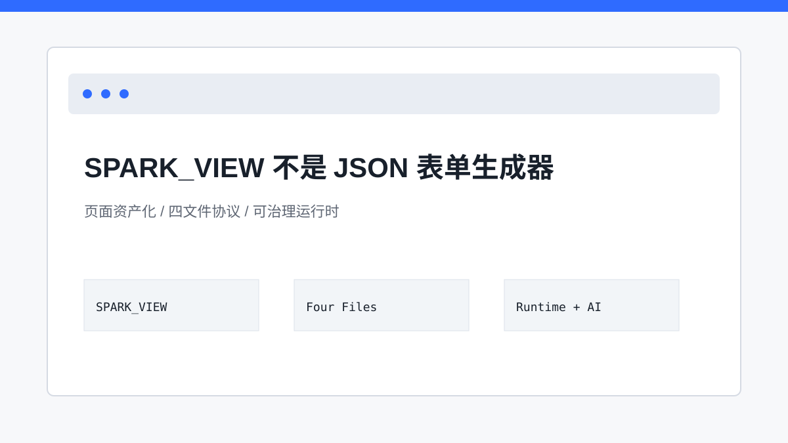

# 别再叫它 JSON 表单：SPARK_VIEW 的页面资产化野心

> SPARK_VIEW 的目标不是把表单写成 JSON，而是把企业后台页面变成可治理的软件资产。

## 开篇

很多团队第一次看到配置化页面，会自然把它归类成“JSON 表单生成器”。这个判断很容易理解：都有 JSON，都能渲染字段，都在减少手写 Vue。但只要页面进入真实后台场景，复杂度立刻变了。你要处理主从表、字段权限、树形数据、聚合行、脚本行为、版本回滚，还要让 AI 能安全地修改页面。此时问题已经不是“少写几行组件代码”，而是“页面作为长期资产，如何被描述、执行、审计和演进”。

## 从表单到页面资产

普通表单生成器关心的是字段如何渲染，SPARK_VIEW 关心的是页面资产如何长期维护。页面结构进入 `rule.json`，数据模型进入 `pagedata.json`，行为脚本进入 `script.js`，样式进入 `style.css`。这四个文件让一个页面可以被加载、预览、保存、版本化，也可以被 AI 按工具链修改。它不是把 Vue 模板换成 JSON，而是把页面拆成可治理的事实。

这个差异会改变很多工程选择。页面结构不再只是组件嵌套，而是 SparkNode 树；数据不再散在组件状态里，而是进入 DataSet/DataView；权限不再是前端本地判断，而是后端下发 `_modelPerm` / `_perm` 快照后由前端做装饰性消费。配置资产化以后，页面才可能被长期管理，而不是每次需求变更都重新生成一份代码。

## 稳定运行时，而不是一次性生成代码

代码生成路线的优势是自由，但自由也意味着修改之后很难持续审计。SPARK_VIEW 选择保留稳定运行时：`SparkPageRenderer` 解释页面级资产，`SparkComponentRenderer` 递归解释 SparkNode，DataSet/DataView 承担数据状态。这样页面的“可运行性”来自同一套运行时，而不是每次生成一份新的散落代码。

这套运行时让页面从“代码结果”变成“可解释资产”。当配置加载失败、脚本执行失败、组件未注册或 DataKey 无效时，系统可以在统一链路上暴露错误。DevSystem 也能复用同一套解释链路做预览，而不是造一个只在设计器里成立的模拟环境。

## AI 为什么能进来

AI 能安全参与，不是因为模型足够聪明，而是因为它被限制在配置资产和工具函数内。Page Design AI 修改的是 `rule.json`、`pagedata.json`、`script.js`、`style.css`，并通过 `nodeTree`、`dataset`、`textModel`、`jsonDoc` 等工具完成动作。它不能绕过运行时随意改源码，这正是可审计的前提。

这种设计让 AI 的每一步都能记录：用户输入、模型回复、函数调用、参数、执行结果和失败修复建议都会进入 session history。对于企业后台平台来说，这比“生成一段看似能跑的代码”更重要，因为页面会长期维护，AI 的修改也必须能回看和追责。

## 关键链路

## 源码锚点

- [../../README.md](../../README.md)
- [../../package.json](../../package.json)
- [../SPARK_VIEW_PROJECT_DEEP_DIVE_ZH.md](../SPARK_VIEW_PROJECT_DEEP_DIVE_ZH.md)
- [../../packages/README.md](../../packages/README.md)

## 小结

所以，本系列的第一步不是介绍某个组件怎么写，而是先把 SPARK_VIEW 看成一套页面资产治理系统。下一篇我们从最小资产单元开始，看四文件协议为什么会成为整条链路的地基。
