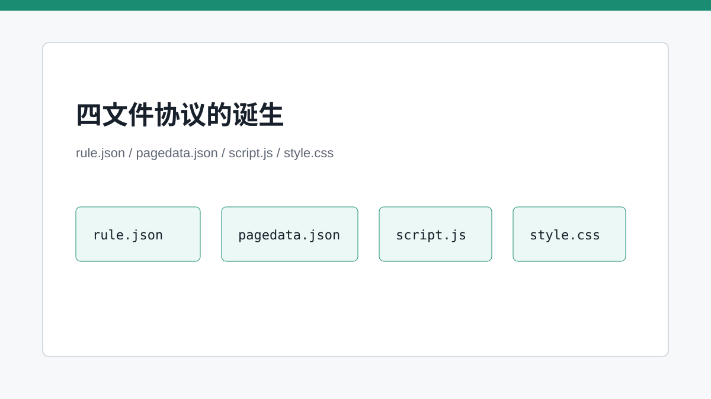
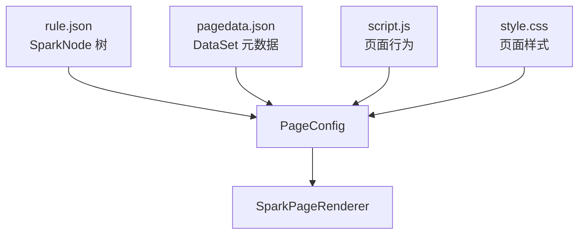

# 四文件协议：把一个页面拆成可治理的生产资料

> `rule.json`、`pagedata.json`、`script.js`、`style.css` 是 SPARK_VIEW 页面可治理的最小资产单元。

## 开篇

一个页面如果只有一个大 JSON，短期看省事，长期看会变成另一个巨大组件。结构、数据、行为和样式的变化频率不同，责任也不同。SPARK_VIEW 把它们拆成四个文件：结构归结构，数据归数据，行为归行为，样式归样式。这个拆分让页面可以被单独加载、局部编辑、独立回滚，也让 AI 修改时知道自己在碰哪一层。

## `rule.json`：组件树而不是模板

`rule.json` 描述的是 SparkNode 树。每个节点至少有 `type`，可以有顶层 `id`、`props` 和 `children`。它不是 Vue SFC，也不直接表达 DOM；真正的组件解析发生在 `spark-component` 的 registry 和 renderer 中。这种间接性让配置具备跨运行时、跨编辑器和跨 AI 工具复用的可能。

当前 SparkNode 语义已经收紧：`type` 必须是非空字符串，`id` 是顶层结构字段，业务属性只能进入 `props`。这让 AI 生成和 DevSystem 编辑都有明确边界，避免把定位字段和组件属性混成一团。

## `pagedata.json`：页面数据空间

`pagedata.json` 描述 DataSet 元数据，而不是后端数据库结构。表、列、视图、关系、依赖、聚合配置都可以进入这个文件。运行时再把它解释成 DataSet/DataTable/DataView。这样组件只绑定 DataViewKey，不需要知道接口细节或数据联动脚本。

这个文件的价值在于，它把页面级数据结构从组件 props 中剥离出来。同一个 DataTable 可以有多个 DataView，主从表可以通过依赖关系联动，聚合结果也能作为 DataViewKey 被组件消费。

## 脚本和样式的边界

`script.js` 和 `style.css` 保留了必要扩展能力，但它们不是无限自由区。脚本运行在页面上下文内，应该通过 `$dataSet`、`$components`、`$page` 等受支持入口操作运行时；样式则按页面作用域落地。Loader 负责文件从哪里来，Compiler 负责文件如何成为运行时模型，两者分离，预览和远程加载才能复用同一解释链路。

DevSystem 中这四个文件也被注册成 PageFileDocument。手工编辑、模型化编辑和 AI 编辑读写的是同一组文档，这保证了 dirty 状态、版本和预览不会分叉。

## 关键链路

## 源码锚点

- [../../packages/spark-page-config/src/config/page-config-loader.ts](../../packages/spark-page-config/src/config/page-config-loader.ts)
- [../../packages/spark-page-config/src/config/page-config-compiler.ts](../../packages/spark-page-config/src/config/page-config-compiler.ts)
- [../../spark-ai-server/src/main/java/com/spark/ai/controller/PageConfigController.java](../../spark-ai-server/src/main/java/com/spark/ai/controller/PageConfigController.java)
- [../../packages/spark-page-config/src/design/page-file-document.ts](../../packages/spark-page-config/src/design/page-file-document.ts)

## 小结

四文件协议把页面拆成了能被治理的资产边界。下一篇继续往下看：这些资产为什么没有全部塞在根应用里，而是分布到 monorepo 的多个包中。
