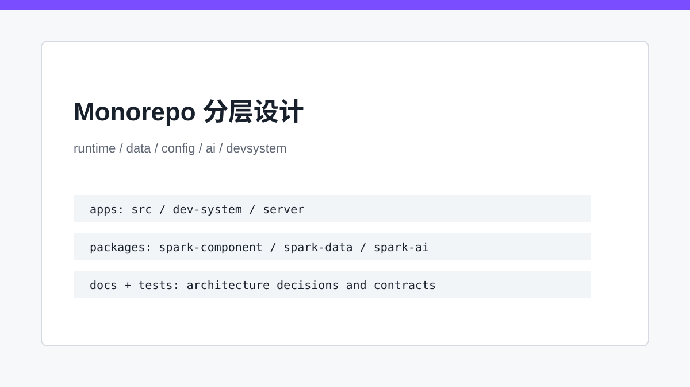
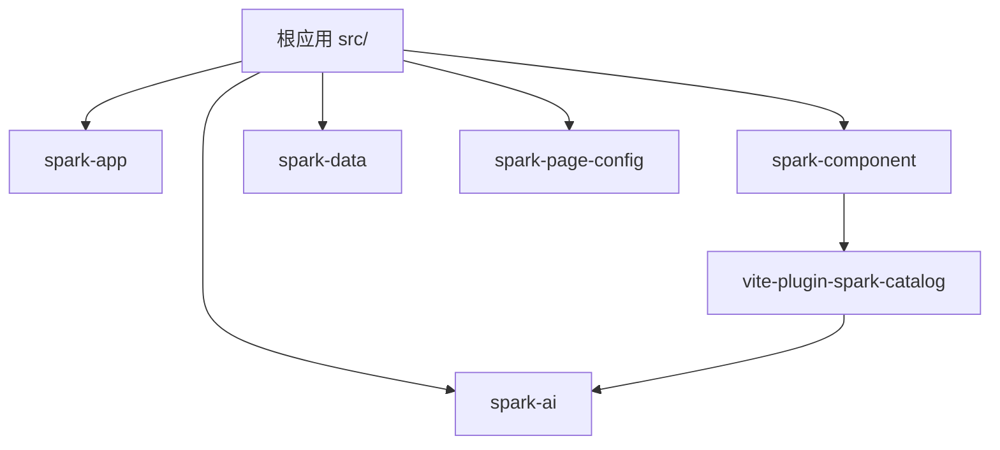

# Monorepo 的骨架：运行时、数据层与 AI 如何各就各位

> SPARK_VIEW 的 monorepo 不是目录拆分，而是把应用启动、组件解释、数据内核、AI 能力和构建知识库拆成可独立演进的层。

## 开篇

低代码平台最容易走坏的一条路，是所有能力最后都长在根应用里：页面加载写一处，组件注册写一处，数据处理写一处，AI 再临时接一处。短期功能能跑，长期没有边界。SPARK_VIEW 的 monorepo 把运行时、数据、配置、AI 和构建知识库拆成包，让根应用负责集成，而不是吞掉所有通用内核。

## 根应用是装配层

根应用的 `src/main.ts`、路由和 DevSystem 负责把能力装起来。它可以决定启动哪些插件、加载哪些导航、如何接入后端，却不应该沉淀通用组件渲染或数据模型。否则每个业务功能都会绕过包边界，后续抽取和测试都会变难。

这也是为什么系列写作不能只盯 `src/views`。根应用看到的是最终产品界面，但页面解释、数据联动、AI 协议、配置编译都来自 packages。读代码时要先判断“这是集成代码，还是可复用内核”。

## 运行时包各司其职

`spark-app` 管应用启动、路由和导航；`spark-component` 管 SparkNode 到 Vue 组件的解释；`spark-data` 管 DataSet/DataView；`spark-page-config` 管配置加载与编译。这些包组合起来，才是一条完整页面运行链。新增能力时先判断它属于哪层，而不是默认写进根应用。

例如 DataViewKey 解析应该在数据包里，组件注册应该在组件包里，页面文件如何加载应该在配置包里。边界清晰以后，测试也能按包聚焦，不需要每个小机制都启动整个应用。

## AI 与构建知识库独立演进

`spark-ai` 不直接依赖页面运行时去执行渲染，它定义 AI 会话、模块注册和函数调用翻译。`vite-plugin-spark-catalog` 则把组件知识提取成 catalog，供业务智能模块和设计时工具查询。这样 AI 能力扩展时，不需要反向污染组件运行时。

构建知识库还有一个隐藏价值：它让组件系统对 AI 可见。模型不是凭空猜一个 `r-table` 应该有哪些 props，而是通过 catalog 和 payload guide 获取结构化知识。monorepo 分层最终服务的是可演进性，而不是目录洁癖。

## 关键链路

## 源码锚点

- [../../packages/README.md](../../packages/README.md)
- [../../package.json](../../package.json)
- [../../packages/spark-app/src/start.ts](../../packages/spark-app/src/start.ts)
- [../../packages/spark-component/src/system/spark.ts](../../packages/spark-component/src/system/spark.ts)
- [../../packages/vite-plugin-spark-catalog/src/plugin.ts](../../packages/vite-plugin-spark-catalog/src/plugin.ts)

## 小结

分层不是为了目录好看，而是为了让每个机制有自己的演进空间。下一篇我们顺着启动链路，看这些包是如何在应用启动时被装配起来的。
