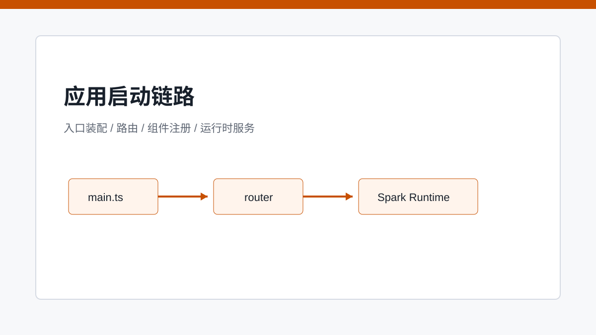
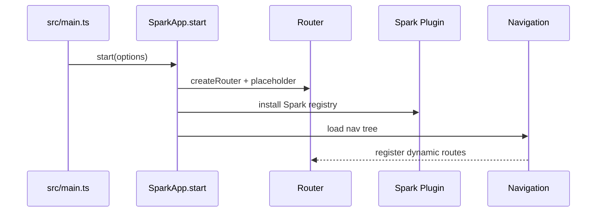

# 从 main.ts 到首屏：SPARK_VIEW 如何点亮一个应用

> SPARK_VIEW 的启动过程是在装配一个“可解释页面”的运行环境，而不只是挂载 Vue 应用。

## 开篇

普通 Vue 应用启动后得到的是组件树。SPARK_VIEW 启动后要得到的是一个能加载、解释、渲染配置页面的运行环境。这个环境需要路由、导航、组件注册、页面配置加载器、权限模式、主题和应用服务。`src/main.ts` 与 `SparkApp.start` 的关系，正是从业务入口到运行时容器的装配过程。

## `main.ts` 的角色

`src/main.ts` 负责读取环境、准备导航和配置入口，并把根应用交给 `SparkApp.start`。它不应该直接实现页面解释逻辑，而是把配置加载器、导航源、路由模式、插件等装成启动参数。这样正式运行、Demo 和 DevSystem 可以共享同一套启动模型。

启动入口还会处理一些产品级事务，例如租户路径、默认导航、缓存清理和异常兜底。这些属于应用集成层，而不是组件解释层。文章讲这里时，可以把 `main.ts` 看成“运行时容器的配置表”。

## `SparkApp.start` 装配运行环境

`SparkApp.start` 创建 Vue app、router、UI 插件和 Spark 插件。它先提供一个最小可启动的根路由，再根据导航树注册真实路由。占位路由保证应用能先起来，动态路由保证页面入口可以由后端或本地导航驱动。

这一步不是简单 `createApp(App).mount()`。SPARK_VIEW 启动时要把页面加载器、服务对象、导航模型、认证状态和组件注册系统同时放进运行时。少了其中任何一块，配置页都可能无法解释。

## 组件注册与虚拟模块

运行时要根据 SparkNode.type 找组件，所以启动时必须完成组件注册。仓库通过 `virtual:spark-components` 与 catalog 插件把组件扫描结果接入运行时。这个机制让新增组件能被 registry 发现，也让 AI 能拿到组件知识。

组件注册和 catalog 生成是同一件事的两个侧面：前者服务运行时渲染，后者服务设计时和 AI。启动链路把它们串起来后，页面才能既能跑，又能被工具理解。

## 关键链路

## 源码锚点

- [../../src/main.ts](../../src/main.ts)
- [../../packages/spark-app/src/start.ts](../../packages/spark-app/src/start.ts)
- [../../packages/spark-app/src/router/dynamic.ts](../../packages/spark-app/src/router/dynamic.ts)
- [../../packages/spark-component/src/components/register-renderers.ts](../../packages/spark-component/src/components/register-renderers.ts)

## 小结

启动链路把运行时容器准备好了，但页面入口来自哪里？下一篇进入导航树，看看它如何成为 SPARK_VIEW 的路由源。
