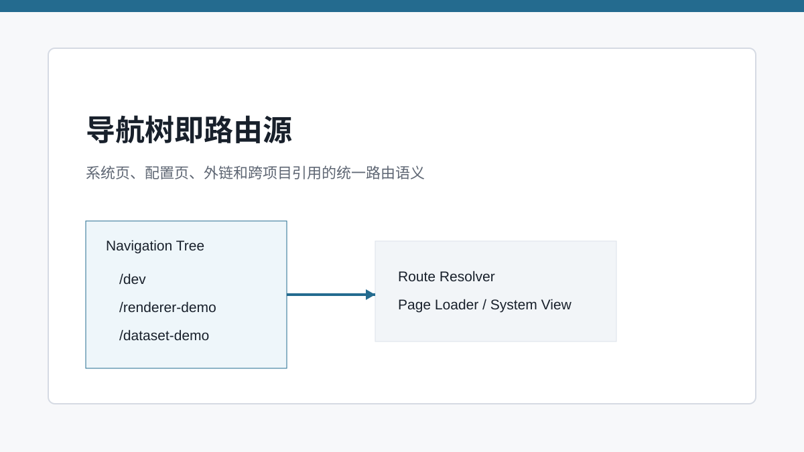
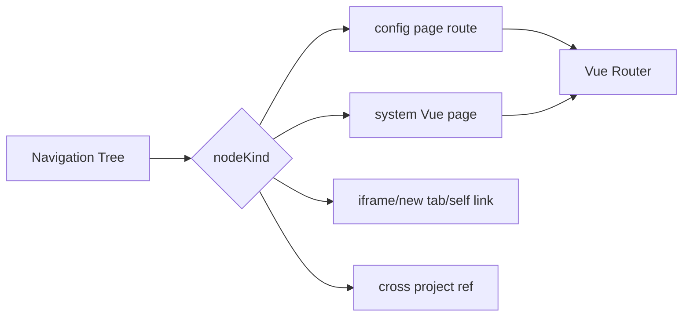

# 导航树即路由源：菜单、页面与项目边界的一次统一

> SPARK_VIEW 把页面入口统一收敛到导航树，让配置页、系统页、外链和跨项目引用共享同一套路由语义。

## 开篇

后台平台里的导航不是简单菜单。它决定页面入口、权限上下文、租户项目路径、系统页跳转和跨项目引用。SPARK_VIEW 把导航树当作路由源，而不是单纯的 UI 数据。这样 DevSystem 保存导航后，前端可以重新注册动态路由，运行时页面、系统页面和外链都走统一语义。

## 导航节点表达平台入口

导航树中既有 `page`，也有 `system-page`、`link`、`ref`、`module`、`system-action`。这些节点不是同一种跳转：配置页要进入 PageRenderer，系统页要加载 Vue 页面，外链可能 iframe 或新窗口，跨项目 ref 还要带目标 project。把这些行为收敛到导航模型，路由层才能统一处理。

模块节点还会影响页面布局。一个模块的 children 可以进入 header，也可以进入 sidebar，工具栏和用户菜单也由导航树表达。这让导航不只是“左边树”，而是整个平台入口布局的模型。

## 动态路由注册

`packages/spark-app/src/router/dynamic.ts` 根据导航节点生成 Vue Router route。模块节点可以决定子项放在 header、sidebar、toolbar 或 user menu，页面节点则变成具体路由。多租户路径会补上 tenant/project 前缀，保证同一个页面资产在不同项目下有明确地址。

配置页和系统页的差异也在这里体现：配置页最终要加载四文件并进入 `SparkPageRenderer`，系统页则匹配 `vue-page-map` 中的 Vue 页面。路由层屏蔽了差异，使用者只看到导航入口。

## DevSystem 与导航闭环

DevSystem 不只是编辑页面文件，也负责站点树。保存导航后，前端需要刷新动态路由；后端导航 API 则支撑树编辑、移动、搜索和 link probe。文章写这里时要强调：导航是页面资产进入运行时的第一道门。

这也是多租户平台需要导航模型的原因。页面不是孤立文件，它要挂在某个项目、某个租户、某个导航位置下，才能成为用户可访问的资产。

## 关键链路

## 源码锚点

- [../../packages/spark-app/src/router/dynamic.ts](../../packages/spark-app/src/router/dynamic.ts)
- [../../src/main.ts](../../src/main.ts)
- [../../spark-ai-server/src/main/java/com/spark/ai/controller/NavigationController.java](../../spark-ai-server/src/main/java/com/spark/ai/controller/NavigationController.java)
- [../../src/views/app/dev-system/useDevState.ts](../../src/views/app/dev-system/useDevState.ts)

## 小结

导航树把用户带到具体页面。路由命中之后，运行时要加载四文件资产并编译成 PageConfig，下一篇就看 Loader 与 Compiler 的边界。
