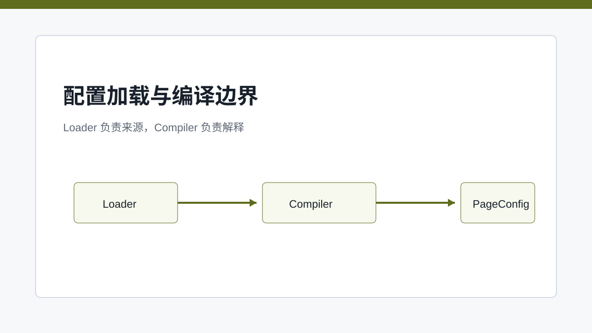
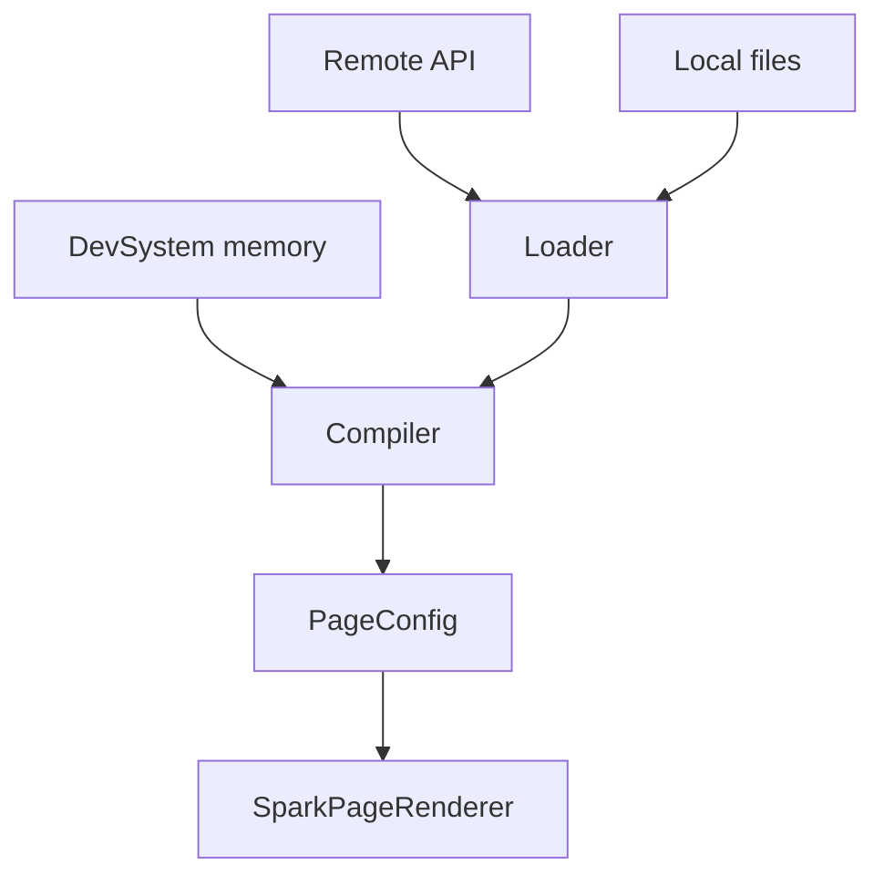

# Loader 与 Compiler：配置世界的取数边界和解释边界

> SPARK_VIEW 把“文件从哪里来”和“文件如何变成运行时模型”拆开，降低了缓存、后端、预览、AI 编辑之间的耦合。

## 开篇

同一个页面配置可能来自后端接口，也可能来自 DevSystem 内存态，还可能刚被 AI 修改。如果加载和解释混在一起，预览、缓存、远程配置和本地编辑会互相牵扯。SPARK_VIEW 把 Loader 与 Compiler 分开：Loader 只关心文件来源，Compiler 只关心文件如何变成可运行模型。

## Loader 解决来源问题

`spark-page-config` 的 Loader 面向本地和远程配置源。它处理请求、缓存、缺失文件、路径和响应解析。对于运行时页面，它通常通过 `/api/config` 一类后端接口读取四文件；对于 DevSystem 预览，则可以直接从内存文档拿到内容。来源不同，但后续解释口径一致。

这让运行时可以替换配置源而不替换解释器。后端文件、静态文件、测试配置、DevSystem 内存态都可以进入同一个 Compiler。加载层只回答“拿到什么内容”，不回答“内容如何运行”。

## Compiler 解决解释问题

Compiler 负责把 `rule`、`pagedata`、`script`、`css` 规范化成 PageConfig。它会处理 root 形态、DataSet metadata、空脚本样式等细节。这个阶段不关心文件来自哪里，只保证输入内容能被运行时消费。

例如 `rule.json` 可能是对象或数组，`pagedata.json` 也可能需要规范化成 DataSet 可理解的 metadata。Compiler 把这些差异收口，避免 PageRenderer 直接面对一堆来源差异。

## 为什么预览能复用运行时

DevSystem 实时预览可以绕过 Loader，因为文件已经在编辑器内存里；但它仍然复用 Compiler 和 `SparkPageRenderer`。这保证设计时看到的不是另一套模拟器，而是正式运行路径。AI 修改文档后，也能马上通过同样链路预览。

这条边界对调试也很重要。加载失败和编译失败是两类问题：前者看接口、缓存和文件存在性，后者看内容格式和运行时契约。

## 关键链路

## 源码锚点

- [../../packages/spark-page-config/src/files/runtime/page-config-loader.ts](../../packages/spark-page-config/src/files/runtime/page-config-loader.ts)
- [../../packages/spark-page-config/src/files/runtime/page-config-compiler.ts](../../packages/spark-page-config/src/files/runtime/page-config-compiler.ts)
- [../../src/views/app/dev-system/DevPreviewTab.vue](../../src/views/app/dev-system/DevPreviewTab.vue)
- [../../spark-ai-server/src/main/java/com/spark/ai/controller/PageConfigController.java](../../spark-ai-server/src/main/java/com/spark/ai/controller/PageConfigController.java)

## 小结

加载和编译完成后，PageConfig 进入页面解释器。下一篇进入 `SparkPageRenderer`，看它如何按顺序激活 CSS、脚本、数据和节点树。
