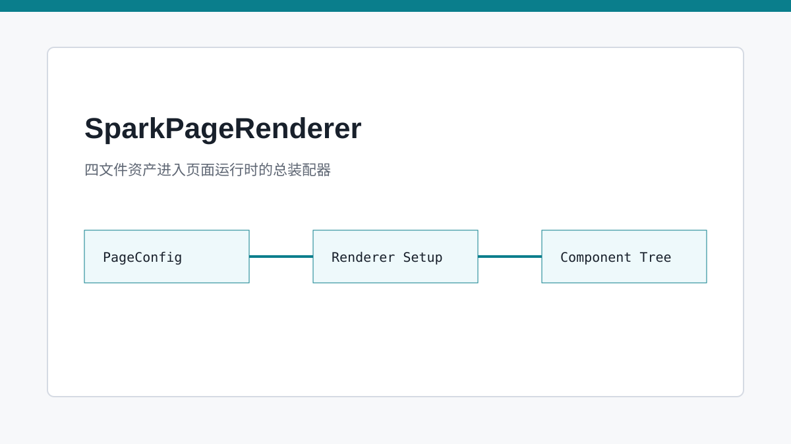
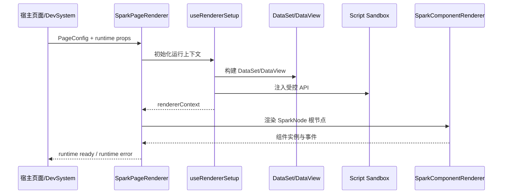

# SparkPageRenderer：四文件落地成页面的总指挥

> `SparkPageRenderer` 不是一个普通 Vue 容器，而是四文件协议进入真实页面运行时的总装配器。

## 开篇

如果只看最终页面，SPARK_VIEW 像是在渲染一棵组件树；但真正的运行时要做更多事：把配置 CSS 注入页面，把 `script.js` 放进受控沙箱，把 `pagedata.json` 编译为 DataSet，把 `rule.json` 交给组件解释器，还要把运行时错误、组件 API、数据上下文和生命周期事件串在一起。

这就是 `SparkPageRenderer` 的位置。它站在页面资产和递归组件渲染之间，把四文件协议转换成一套稳定的运行时上下文。它不负责业务页面“长什么样”，但负责让页面拥有一致的运行秩序。

## 运行时输入不是散乱 props

`SparkPageRenderer` 接收的是已经编译过的 PageConfig，而不是随手拼出来的 Vue props。这个输入里包含节点树、数据源、脚本和样式。配置来源可能是后端接口，也可能是 DevSystem 内存文档；只要进入 Renderer，后续链路就按统一 PageConfig 处理。

这种设计减少了渲染层对配置来源的感知。页面运行时不需要知道文件来自远程、缓存还是 AI 编辑后的 live model，它只关心当前 PageConfig 是否满足渲染契约。运行时越稳定，Loader、Compiler、DevSystem 和 AI 就越容易独立迭代。

## 初始化顺序决定体验稳定性

页面启动时不能随意渲染节点树。CSS 要先准备好，否则首屏闪动；DataSet 要先构造好，否则组件拿不到 DataView；脚本沙箱要拿到 `$dataSet`、`$components` 和 `$page` 等入口，否则事件回调会变成悬空函数。`useRendererSetup` 把这些动作组织成可读的初始化链。

组件树真正开始渲染时，`SparkComponentRenderer` 获得的已经不是裸配置，而是带有上下文的运行环境。字段组件能从 DataView 取值，按钮能触发 action，脚本能通过受控 API 调用页面服务。这是“配置驱动页面”和“JSON 静态拼图”的关键差异。

## 错误处理也是运行时协议

企业后台页面不能因为一个节点、一个脚本回调或一段配置失败就完全黑屏。`SparkPageRenderer` 通过 runtime error 结构把错误向上抛给宿主，使 DevSystem 可以展示错误，测试可以断言错误，生产环境可以接入监控。

这种错误收口也服务 AI。AI 修改四文件后，如果预览失败，宿主能把错误上下文反馈给模型，而不是只得到“页面不对”的模糊结果。可解释错误是可迭代编辑的基础。

## 关键链路

## 源码锚点

- [../../packages/spark-component/src/page/renderer/SparkPageRenderer.vue](../../packages/spark-component/src/page/renderer/SparkPageRenderer.vue)
- [../../packages/spark-component/src/page/renderer/useRendererSetup.ts](../../packages/spark-component/src/page/renderer/useRendererSetup.ts)
- [../../packages/spark-component/src/page/renderer/build-page-children.ts](../../packages/spark-component/src/page/renderer/build-page-children.ts)
- [../../src/views/app/dev-system/DevPreviewTab.vue](../../src/views/app/dev-system/DevPreviewTab.vue)

## 小结

`SparkPageRenderer` 把四文件资产变成可运行页面。下一篇继续向下走，进入递归解释器 `SparkComponentRenderer`，看每一个 SparkNode 如何变成真正的 Vue 组件。
