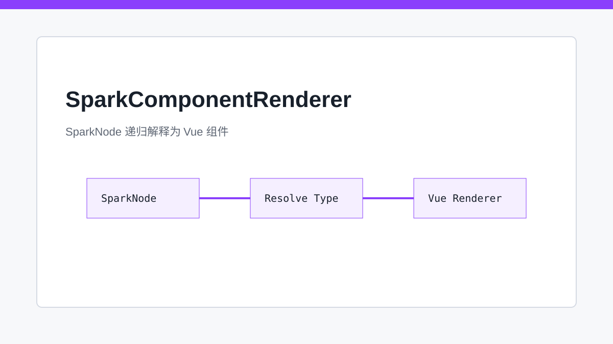
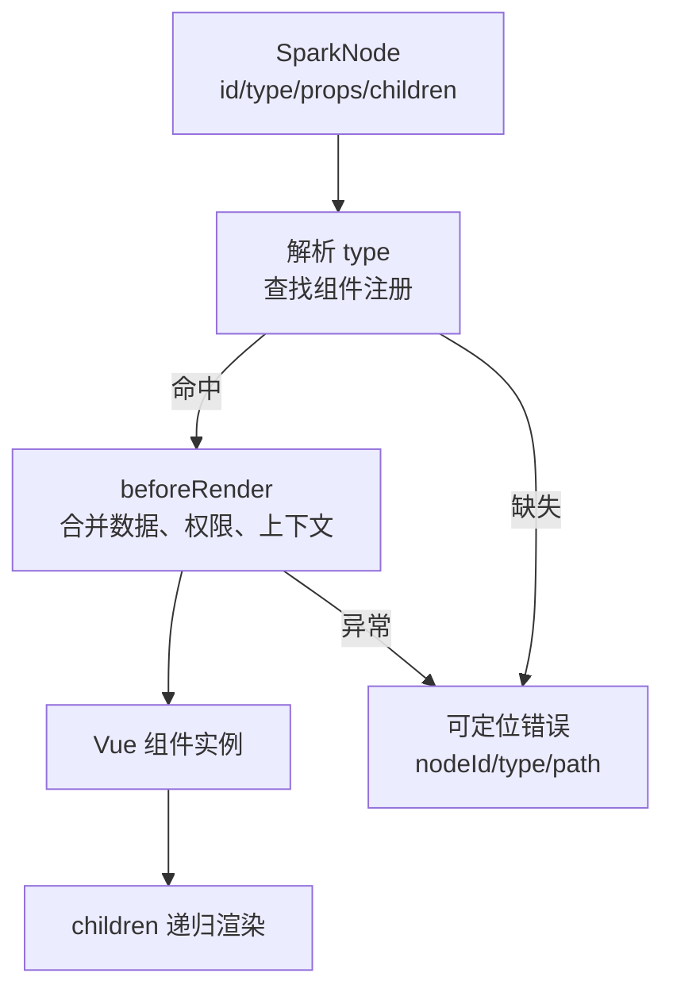

# SparkComponentRenderer：一棵 SparkNode 如何长成 Vue 页面

> `SparkComponentRenderer` 的价值在于把 SparkNode 当作运行时协议解释，而不是把 JSON 当作模板字符串渲染。

## 开篇

页面运行时真正面对的是一棵 SparkNode 树。每个节点都只有有限的协议字段：`id`、`type`、`props`、`children`。这些字段看起来简单，但背后承载了组件选择、上下文注入、渲染前处理、插槽递归、事件映射、能力注册和错误兜底。

`SparkComponentRenderer` 就是这棵树的解释器。它不要求每个页面都写一份 Vue 模板，而是让配置节点在统一规则下递归展开。这样，DevSystem、AI、后端配置和测试样例都能操作同一种节点语言。

## SparkNode 是组件协议，不是组件实现

节点的 `type` 指向注册组件，`props` 描述该组件的运行参数，`children` 描述子节点。运行时并不把节点等同于 Vue 组件源码，而是先解析节点，再查找组件注册表，最后把上下文和 props 送给真实组件。

这个分离很重要。配置层可以长期稳定，组件实现可以迭代替换。比如一个 `r-table` 的内部实现可以从简单表格演进到支持树数据、聚合、字段权限和 DataViewKey，但 SparkNode 仍然只声明“这里有一个 r-table 节点及其参数”。

## beforeRender 让节点拥有运行时调整点

有些节点不能完全靠静态 props 表达。例如字段需要按 `_perm` 判断可见和可编辑，按钮可能需要按当前行数据决定禁用状态，容器可能要根据业务状态隐藏整组区域。`beforeRender` 提供了进入组件前的受控调整点。

这类逻辑不能膨胀成散落在各组件里的重复判断。`SparkComponentRenderer` 在递归过程中统一处理节点上下文，让组件拿到的 props 已经经过运行时语义修正。组件保持专注，解释器负责把配置、数据和上下文合在一起。

## 组件缺失要可诊断

递归渲染最怕的问题不是报错，而是报错不可定位。一个节点 type 写错、注册表缺失、props 结构不对，都应该能够定位到具体 SparkNode。解释器需要把节点 ID、类型、父子关系和当前渲染路径带进错误上下文。

这也是为什么 AI 写入节点前必须查询组件参数荷载指南。AI 不应凭空猜测组件 props；它应该先从 PageDesign knowledge 模块查询合法 type，再按指南构造 SparkNode。解释器只负责运行，不负责为错误配置兜成“看起来能用”的页面。

## 关键链路

## 源码锚点

- [../../packages/spark-component/src/page/renderer/SparkComponentRenderer.vue](../../packages/spark-component/src/page/renderer/SparkComponentRenderer.vue)
- [../../packages/spark-component/src/page/renderer/beforeRender.ts](../../packages/spark-component/src/page/renderer/beforeRender.ts)
- [../../packages/spark-component/src/page/renderer/build-page-children.ts](../../packages/spark-component/src/page/renderer/build-page-children.ts)
- [../../packages/spark-component/src/types/spark-node-tree.ts](../../packages/spark-component/src/types/spark-node-tree.ts)

## 小结

`SparkComponentRenderer` 让页面节点树变成可递归解释的运行时协议。下一篇看组件注册与能力系统：为什么一个递归组件树仍然需要跨节点协作、API 暴露和上下文能力。
